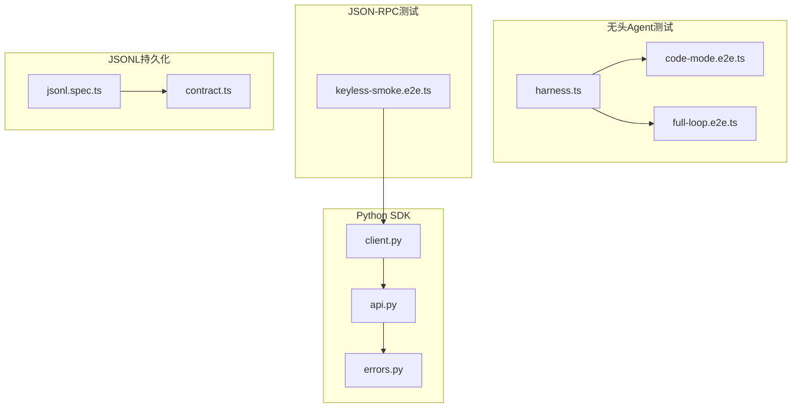
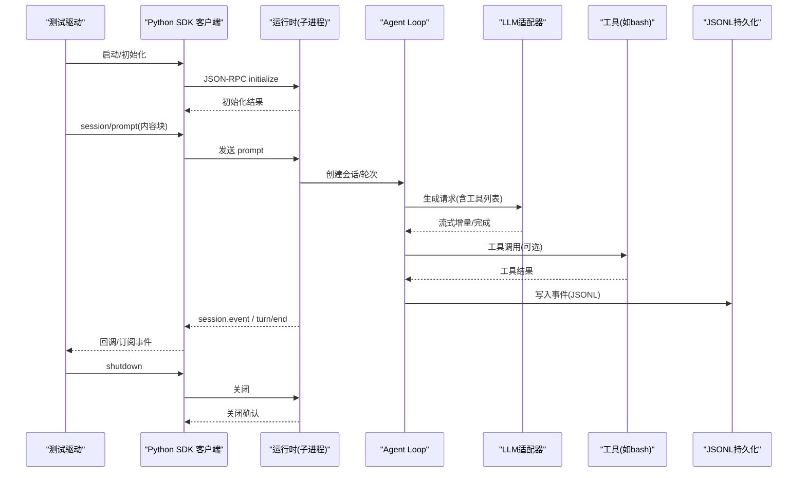
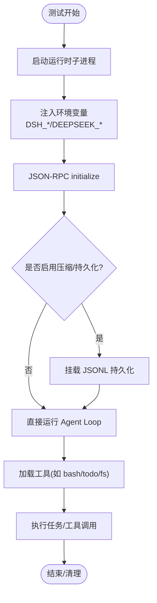
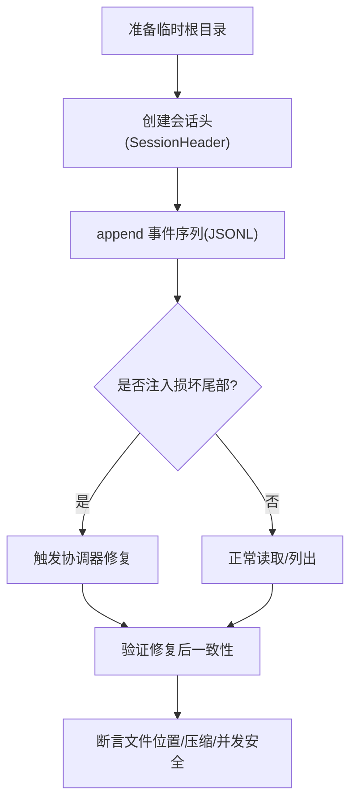
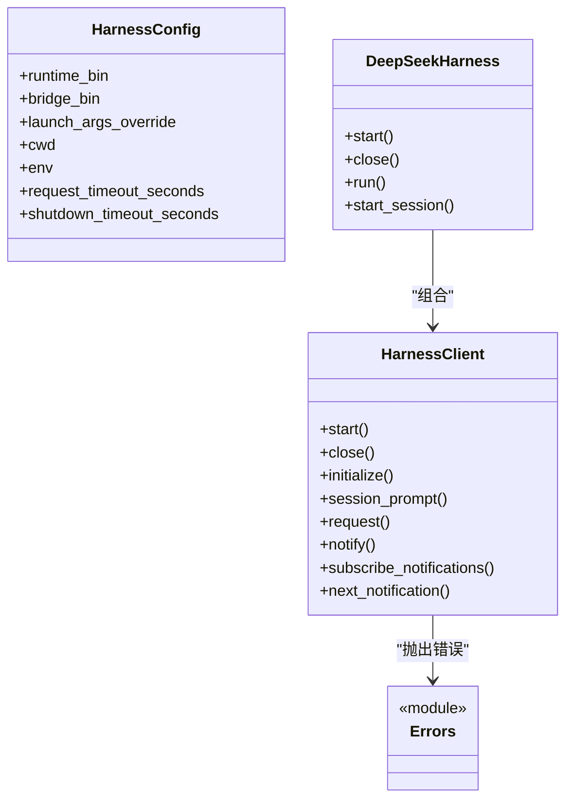
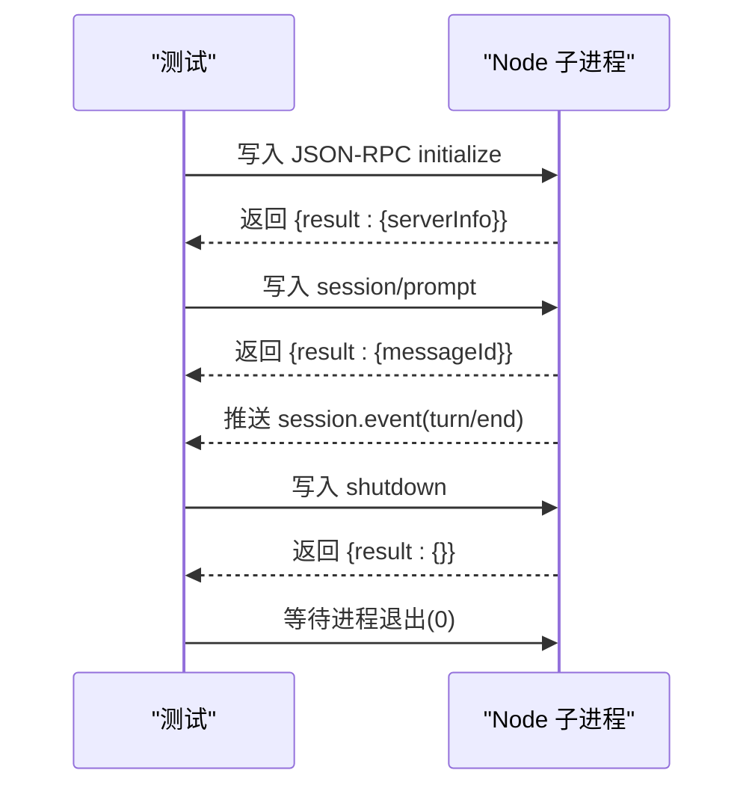
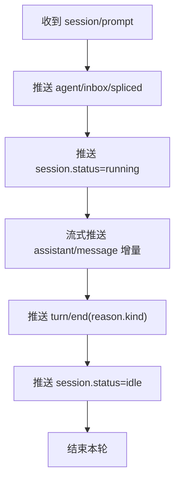
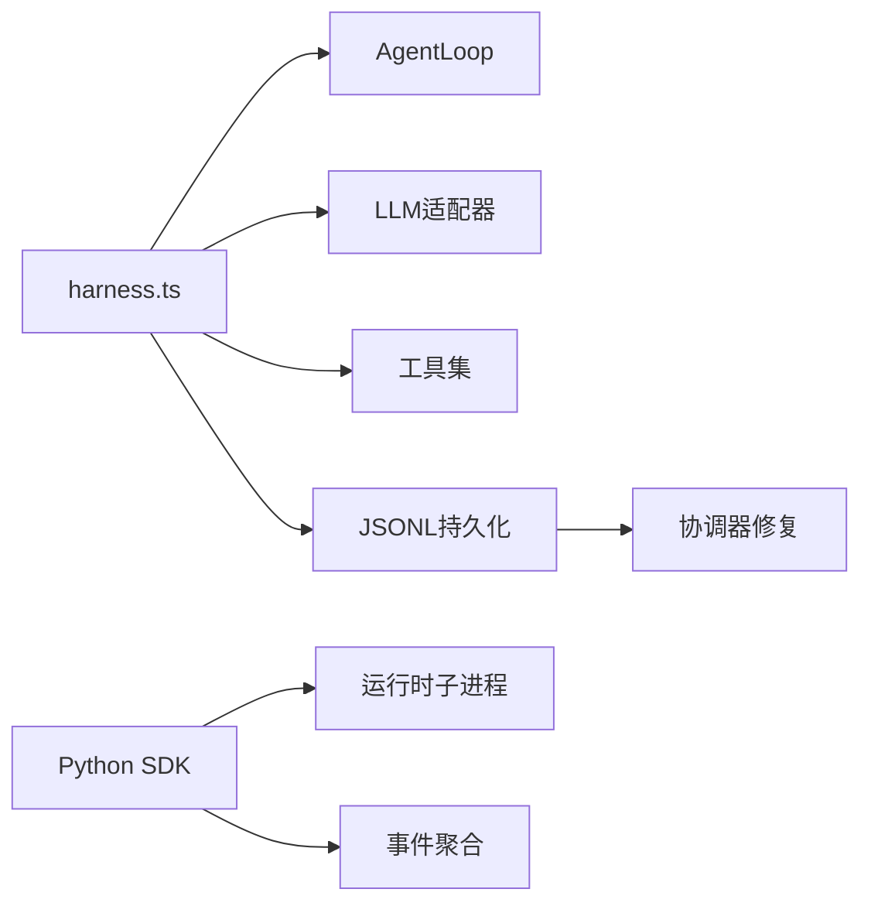

# 无头后端测试

<cite>
**本文引用的文件**
- [harness.ts](file://examples/headless-agent/tests/harness.ts)
- [code-mode.e2e.ts](file://examples/headless-agent/tests/code-mode.e2e.ts)
- [full-loop.e2e.ts](file://examples/headless-agent/tests/full-loop.e2e.ts)
- [keyless-smoke.e2e.ts](file://examples/jsonrpc-agent/tests/keyless-smoke.e2e.ts)
- [client.py](file://python/sdk/src/deepseek_harness/client.py)
- [api.py](file://python/sdk/src/deepseek_harness/api.py)
- [errors.py](file://python/sdk/src/deepseek_harness/errors.py)
- [jsonl.spec.ts](file://packages/session/session-persistence-jsonl/tests/jsonl.spec.ts)
- [contract.ts](file://packages/session/session-persistence/tests/contract.ts)
</cite>

## 目录
1. [简介](#简介)
2. [项目结构](#项目结构)
3. [核心组件](#核心组件)
4. [架构总览](#架构总览)
5. [详细组件分析](#详细组件分析)
6. [依赖关系分析](#依赖关系分析)
7. [性能与稳定性考量](#性能与稳定性考量)
8. [故障排查指南](#故障排查指南)
9. [结论](#结论)
10. [附录](#附录)

## 简介
本文件面向“无头后端测试”的完整实践，覆盖以下目标：
- 无头 Agent 的启动与配置：进程隔离、资源限制与环境变量注入。
- JSONL 测试驱动器：用例定义、输入数据管理与输出验证。
- Python SDK 集成测试：客户端连接、API 调用与异常处理。
- JSON-RPC 协议测试：请求构造、响应解析与错误码验证。
- 流式响应测试策略：数据分片、进度跟踪与超时控制。
- 错误与异常场景覆盖：网络中断、服务不可用、资源耗尽等。
- 测试环境隔离：临时目录、端口冲突、依赖模拟。
- 测试数据生命周期管理：清理、状态重置与并发访问控制。

## 项目结构
仓库围绕“示例应用 + 包 + 脚本”组织，测试主要分布在：
- examples/headless-agent/tests：无头 Agent e2e 测试与共享 harness。
- examples/jsonrpc-agent/tests：JSON-RPC 关键路径冒烟测试。
- python/sdk/tests：Python SDK 端到端与单元测试。
- packages/session/session-persistence-jsonl/tests：JSONL 持久化契约与实现测试。

图表来源
- [harness.ts:1-105](file://examples/headless-agent/tests/harness.ts#L1-L105)
- [code-mode.e2e.ts:1-439](file://examples/headless-agent/tests/code-mode.e2e.ts#L1-L439)
- [full-loop.e2e.ts:1-50](file://examples/headless-agent/tests/full-loop.e2e.ts#L1-L50)
- [keyless-smoke.e2e.ts:1-203](file://examples/jsonrpc-agent/tests/keyless-smoke.e2e.ts#L1-L203)
- [client.py:1-558](file://python/sdk/src/deepseek_harness/client.py#L1-L558)
- [api.py:1-243](file://python/sdk/src/deepseek_harness/api.py#L1-L243)
- [errors.py:1-24](file://python/sdk/src/deepseek_harness/errors.py#L1-L24)
- [jsonl.spec.ts:102-788](file://packages/session/session-persistence-jsonl/tests/jsonl.spec.ts#L102-L788)
- [contract.ts:1-31](file://packages/session/session-persistence/tests/contract.ts#L1-L31)

章节来源
- [harness.ts:1-105](file://examples/headless-agent/tests/harness.ts#L1-L105)
- [keyless-smoke.e2e.ts:1-203](file://examples/jsonrpc-agent/tests/keyless-smoke.e2e.ts#L1-L203)
- [client.py:1-558](file://python/sdk/src/deepseek_harness/client.py#L1-L558)
- [api.py:1-243](file://python/sdk/src/deepseek_harness/api.py#L1-L243)
- [jsonl.spec.ts:102-788](file://packages/session/session-persistence-jsonl/tests/jsonl.spec.ts#L102-L788)

## 核心组件
- 无头 Agent Harness：提供可复用的插件装配（LLM、工具、子进程、会话持久化），并暴露等待空闲与最终文本提取能力。
- JSON-RPC 冒烟测试：通过 execa 启动 Node 进程，使用 stdin/stdout 行协议发送 JSON-RPC 消息，断言初始化、会话提示、事件与关闭流程。
- Python SDK 客户端：以子进程方式启动运行时，封装 JSON-RPC 请求/通知路由、超时、关闭与诊断信息收集。
- JSONL 持久化：基于 JSON Lines 的追加式日志存储，支持压缩、协调器修复、并发安全与路径穿越防护。

章节来源
- [harness.ts:19-84](file://examples/headless-agent/tests/harness.ts#L19-L84)
- [keyless-smoke.e2e.ts:48-176](file://examples/jsonrpc-agent/tests/keyless-smoke.e2e.ts#L48-L176)
- [client.py:24-116](file://python/sdk/src/deepseek_harness/client.py#L24-L116)
- [jsonl.spec.ts:102-133](file://packages/session/session-persistence-jsonl/tests/jsonl.spec.ts#L102-L133)

## 架构总览
下图展示了无头后端测试中各组件的交互关系：测试驱动通过 Python SDK 或 Node 测试直接发起 JSON-RPC 请求；运行时在独立进程中执行 Agent Loop，调用 LLM 与工具；会话事件以 JSONL 形式落盘；测试侧对事件进行断言。

图表来源
- [client.py:117-178](file://python/sdk/src/deepseek_harness/client.py#L117-L178)
- [api.py:117-183](file://python/sdk/src/deepseek_harness/api.py#L117-L183)
- [keyless-smoke.e2e.ts:104-159](file://examples/jsonrpc-agent/tests/keyless-smoke.e2e.ts#L104-L159)
- [jsonl.spec.ts:783-788](file://packages/session/session-persistence-jsonl/tests/jsonl.spec.ts#L783-L788)

## 详细组件分析

### 无头 Agent 启动与配置（进程隔离、资源限制、环境变量）
- 进程隔离：通过 Node 子进程运行 JSON-RPC 服务端，或使用 Python SDK 启动运行时子进程；测试侧通过 execa 或 subprocess 管理生命周期，确保失败时强制终止。
- 资源限制：为 Bash 执行器设置超时毫秒数，避免长任务阻塞；对模型上下文窗口进行可控配置，便于触发压缩与边界行为。
- 环境变量：注入 DEEPSEEK_API_KEY、DEEPSEEK_BASE_URL、DSH_CWD、DSH_SESSION_ROOT、DSH_MAX_TOKENS_AS_SUCCESS 等，控制模型接入、工作目录、会话根与行为开关。

图表来源
- [keyless-smoke.e2e.ts:74-91](file://examples/jsonrpc-agent/tests/keyless-smoke.e2e.ts#L74-L91)
- [harness.ts:56-83](file://examples/headless-agent/tests/harness.ts#L56-L83)
- [api.py:56-83](file://python/sdk/src/deepseek_harness/api.py#L56-L83)

章节来源
- [keyless-smoke.e2e.ts:74-91](file://examples/jsonrpc-agent/tests/keyless-smoke.e2e.ts#L74-L91)
- [harness.ts:56-83](file://examples/headless-agent/tests/harness.ts#L56-L83)
- [api.py:56-83](file://python/sdk/src/deepseek_harness/api.py#L56-L83)

### JSONL 测试驱动器：用例定义、输入数据与输出验证
- 用例定义：通过契约测试 runPersistenceContract/runCoordinatorContract 统一校验 append-only、序列连续、懒加载与崩溃恢复语义。
- 输入数据：构造最小 SessionHeader 与事件序列，必要时注入损坏尾部以触发协调器修复。
- 输出验证：断言文件位于 root 下、压缩格式正确、并发写入不交叉缓冲、路径穿越被中和。

图表来源
- [contract.ts:1-31](file://packages/session/session-persistence/tests/contract.ts#L1-L31)
- [jsonl.spec.ts:102-133](file://packages/session/session-persistence-jsonl/tests/jsonl.spec.ts#L102-L133)
- [jsonl.spec.ts:763-780](file://packages/session/session-persistence-jsonl/tests/jsonl.spec.ts#L763-L780)
- [jsonl.spec.ts:783-788](file://packages/session/session-persistence-jsonl/tests/jsonl.spec.ts#L783-L788)

章节来源
- [jsonl.spec.ts:102-133](file://packages/session/session-persistence-jsonl/tests/jsonl.spec.ts#L102-L133)
- [jsonl.spec.ts:763-780](file://packages/session/session-persistence-jsonl/tests/jsonl.spec.ts#L763-L780)
- [jsonl.spec.ts:783-788](file://packages/session/session-persistence-jsonl/tests/jsonl.spec.ts#L783-L788)
- [contract.ts:1-31](file://packages/session/session-persistence/tests/contract.ts#L1-L31)

### Python SDK 集成测试：客户端连接、API 调用与异常处理
- 客户端连接：HarnessClient 启动子进程，维护读写线程，按行解析 JSON-RPC；DeepSeekHarness 作为高层封装，自动初始化与生命周期管理。
- API 调用：initialize、session/prompt、shutdown；支持通知订阅与过滤，自动追踪父子会话关系。
- 异常处理：TransportClosedError、JsonRpcError、SdkProtocolError；超时与关闭超时均有明确诊断信息（退出码、stderr 尾部）。

图表来源
- [client.py:24-116](file://python/sdk/src/deepseek_harness/client.py#L24-L116)
- [api.py:13-116](file://python/sdk/src/deepseek_harness/api.py#L13-L116)
- [errors.py:4-24](file://python/sdk/src/deepseek_harness/errors.py#L4-L24)

章节来源
- [client.py:117-178](file://python/sdk/src/deepseek_harness/client.py#L117-L178)
- [api.py:117-183](file://python/sdk/src/deepseek_harness/api.py#L117-L183)
- [errors.py:4-24](file://python/sdk/src/deepseek_harness/errors.py#L4-L24)

### JSON-RPC 协议测试：请求构造、响应解析与错误码验证
- 请求构造：手动拼装 jsonrpc 版本、id、method、params，通过 stdin 逐行发送。
- 响应解析：监听 stdout 行，解析 JSON，按 id 匹配响应；事件通过 method=session.event 推送。
- 错误码验证：当返回 error 字段时，SDK 将其转换为 JsonRpcError；测试覆盖无效参数导致加载失败的退出码与 stderr 片段。

图表来源
- [keyless-smoke.e2e.ts:104-159](file://examples/jsonrpc-agent/tests/keyless-smoke.e2e.ts#L104-L159)
- [keyless-smoke.e2e.ts:178-201](file://examples/jsonrpc-agent/tests/keyless-smoke.e2e.ts#L178-L201)

章节来源
- [keyless-smoke.e2e.ts:104-159](file://examples/jsonrpc-agent/tests/keyless-smoke.e2e.ts#L104-L159)
- [keyless-smoke.e2e.ts:178-201](file://examples/jsonrpc-agent/tests/keyless-smoke.e2e.ts#L178-L201)

### 流式响应测试策略：数据分片、进度跟踪与超时控制
- 数据分片：LLM 适配器以 SSE 流式返回增量 delta，测试通过事件流断言中间内容与 finish_reason。
- 进度跟踪：通过 session.status 与 session.event 的组合，识别 running/idle 与 turn/end 原因。
- 超时控制：Python SDK 支持 request_timeout_seconds 与 shutdown_timeout_seconds；Node 测试使用 execa timeout 与 SIGKILL 保证进程回收。

图表来源
- [api.py:132-183](file://python/sdk/src/deepseek_harness/api.py#L132-L183)
- [client.py:228-296](file://python/sdk/src/deepseek_harness/client.py#L228-L296)
- [keyless-smoke.e2e.ts:129-145](file://examples/jsonrpc-agent/tests/keyless-smoke.e2e.ts#L129-L145)

章节来源
- [api.py:132-183](file://python/sdk/src/deepseek_harness/api.py#L132-L183)
- [client.py:228-296](file://python/sdk/src/deepseek_harness/client.py#L228-L296)
- [keyless-smoke.e2e.ts:129-145](file://examples/jsonrpc-agent/tests/keyless-smoke.e2e.ts#L129-L145)

### 错误处理与异常场景覆盖
- 网络中断/服务不可用：Python SDK 捕获 TransportClosedError，附带退出码与 stderr 尾部；Node 测试通过 mock SSE 服务器模拟中断。
- 资源耗尽：通过 maxTokens 与压缩引擎触发 turn/end reason=max-tokens；测试断言工具列表与最大 token 传递。
- 协议错误：SDK 对非法 turn/end 结构抛出 SdkProtocolError；JSON-RPC 错误映射为 JsonRpcError。

章节来源
- [client.py:399-422](file://python/sdk/src/deepseek_harness/client.py#L399-L422)
- [keyless-smoke.e2e.ts:146-155](file://examples/jsonrpc-agent/tests/keyless-smoke.e2e.ts#L146-L155)
- [api.py:225-243](file://python/sdk/src/deepseek_harness/api.py#L225-L243)

### 测试环境隔离机制
- 临时目录：每个测试使用 mkdtemp 创建独立工作目录与会话根，测试结束后递归删除。
- 端口冲突：Node 测试绑定 127.0.0.1 随机端口，关闭服务器后再清理。
- 依赖模拟：Python 测试通过 launch_args_override 注入 fake runtime；Node 测试通过 createServer 模拟 LLM SSE。

章节来源
- [keyless-smoke.e2e.ts:54-71](file://examples/jsonrpc-agent/tests/keyless-smoke.e2e.ts#L54-L71)
- [keyless-smoke.e2e.ts:169-175](file://examples/jsonrpc-agent/tests/keyless-smoke.e2e.ts#L169-L175)
- [test_client.py:15-125](file://python/sdk/tests/test_client.py#L15-L125)

### 测试数据生命周期管理
- 数据清理：afterEach 钩子确保 fiber.dispose、rm -rf 工作目录与 sessions 根。
- 状态重置：每次测试重新创建 Context/Session，避免跨用例污染。
- 并发访问控制：JSONL 后端保证并发会话不交叉缓冲；协调器修复处理损坏尾部。

章节来源
- [code-mode.e2e.ts:42-50](file://examples/headless-agent/tests/code-mode.e2e.ts#L42-L50)
- [full-loop.e2e.ts:18-26](file://examples/headless-agent/tests/full-loop.e2e.ts#L18-L26)
- [jsonl.spec.ts:783-788](file://packages/session/session-persistence-jsonl/tests/jsonl.spec.ts#L783-L788)

## 依赖关系分析
- 无头 Agent Harness 依赖 Cordis Context、AgentLoop、LLM 适配器、工具与持久化插件。
- Python SDK 依赖底层 JSON-RPC 传输与运行时；高层 API 封装会话与事件聚合。
- JSONL 持久化依赖会话格式版本、压缩编解码与协调器修复逻辑。

图表来源
- [harness.ts:56-83](file://examples/headless-agent/tests/harness.ts#L56-L83)
- [api.py:56-116](file://python/sdk/src/deepseek_harness/api.py#L56-L116)
- [jsonl.spec.ts:102-133](file://packages/session/session-persistence-jsonl/tests/jsonl.spec.ts#L102-L133)

章节来源
- [harness.ts:56-83](file://examples/headless-agent/tests/harness.ts#L56-L83)
- [api.py:56-116](file://python/sdk/src/deepseek_harness/api.py#L56-L116)
- [jsonl.spec.ts:102-133](file://packages/session/session-persistence-jsonl/tests/jsonl.spec.ts#L102-L133)

## 性能与稳定性考量
- 流式处理：SSE 增量推送减少内存峰值；SDK 在请求循环中定期 drain 通知，避免队列堆积。
- 超时保护：请求与关闭均设超时，防止僵尸进程；Node 测试使用 killSignal 确保强杀。
- 压缩与持久化：JSONL 压缩降低磁盘占用；协调器修复保障崩溃恢复后的数据一致性。

[本节为通用指导，无需特定文件引用]

## 故障排查指南
- 运行时未响应：检查 stderr 尾部与退出码；Python SDK 会在错误信息中附加诊断。
- 协议不一致：若 turn/end 缺少 reason.kind，将抛出 SdkProtocolError；需修正运行时事件结构。
- 端口/目录冲突：确保每个测试使用独立 tmpdir 与随机端口；测试结束后清理。

章节来源
- [client.py:399-422](file://python/sdk/src/deepseek_harness/client.py#L399-L422)
- [api.py:225-243](file://python/sdk/src/deepseek_harness/api.py#L225-L243)
- [keyless-smoke.e2e.ts:169-175](file://examples/jsonrpc-agent/tests/keyless-smoke.e2e.ts#L169-L175)

## 结论
本仓库提供了完整的无头后端测试体系：通过 Node 与 Python SDK 分别驱动 JSON-RPC 与 Agent Loop，结合 JSONL 持久化与契约测试，覆盖了从启动、流式响应到错误处理的完整链路。借助严格的隔离与生命周期管理，测试具备高可靠性与可重复性。

[本节为总结，无需特定文件引用]

## 附录
- 最佳实践建议：
  - 始终在 after/before 钩子中显式释放资源（fiber.dispose、进程终止、目录清理）。
  - 使用临时目录与随机端口，避免并发干扰。
  - 对关键路径（initialize、prompt、shutdown）添加超时与重试策略。
  - 对 JSONL 持久化使用契约测试，确保不同后端行为一致。

[本节为补充说明，无需特定文件引用]