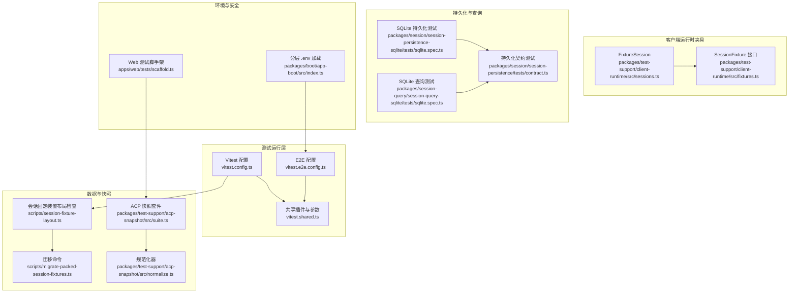
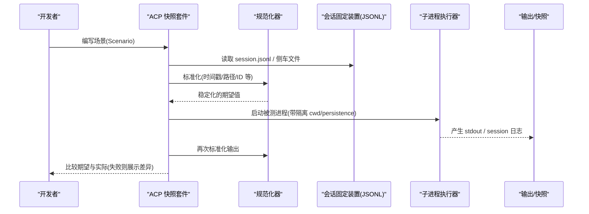
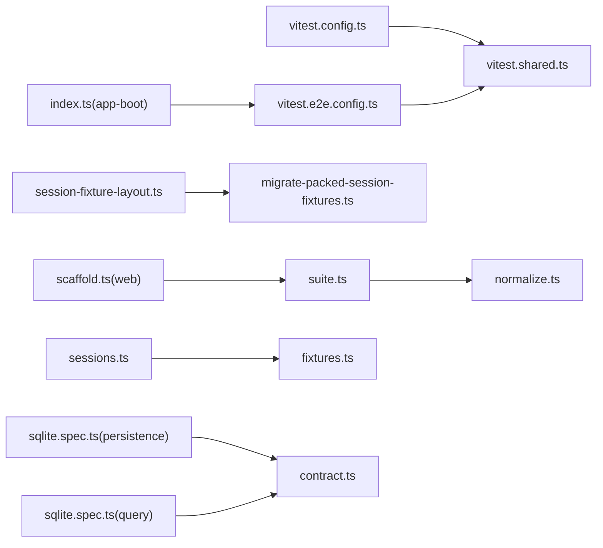

# 测试数据管理

<cite>
**本文引用的文件**
- [vitest.config.ts](file://vitest.config.ts)
- [vitest.shared.ts](file://vitest.shared.ts)
- [vitest.e2e.config.ts](file://vitest.e2e.config.ts)
- [session-fixture-layout.ts](file://scripts/session-fixture-layout.ts)
- [migrate-packed-session-fixtures.ts](file://scripts/migrate-packed-session-fixtures.ts)
- [test-fixture-cleanup.ts](file://scripts/test-fixture-cleanup.ts)
- [suite.ts](file://packages/test-support/acp-snapshot/src/suite.ts)
- [normalize.ts](file://packages/test-support/acp-snapshot/src/normalize.ts)
- [sessions.ts](file://packages/test-support/client-runtime/src/sessions.ts)
- [fixtures.ts](file://packages/test-support/client-runtime/src/fixtures.ts)
- [sqlite.spec.ts](file://packages/session/session-persistence-sqlite/tests/sqlite.spec.ts)
- [contract.ts](file://packages/session/session-persistence/tests/contract.ts)
- [sqlite.spec.ts](file://packages/session-query/session-query-sqlite/tests/sqlite.spec.ts)
- [scaffold.ts](file://apps/web/tests/scaffold.ts)
- [index.ts](file://packages/boot/app-boot/src/index.ts)
</cite>

## 目录
1. [简介](#简介)
2. [项目结构](#项目结构)
3. [核心组件](#核心组件)
4. [架构总览](#架构总览)
5. [详细组件分析](#详细组件分析)
6. [依赖关系分析](#依赖关系分析)
7. [性能考量](#性能考量)
8. [故障排查指南](#故障排查指南)
9. [结论](#结论)
10. [附录](#附录)

## 简介
本文件系统化梳理仓库中的测试数据管理方案，覆盖固定装置（fixtures）的组织与命名、静态/动态数据生成与工厂模式、环境与敏感信息管理、隔离策略、清理与恢复机制、版本迁移策略、大型数据集管理以及共享复用机制。目标是让不同背景的读者都能理解并正确使用仓库的测试数据体系。

## 项目结构
仓库采用多包多应用的多工作区结构，测试数据分布在多处：
- 单元测试与集成测试：位于各包的 tests 目录，使用 Vitest 统一配置与运行。
- E2E 测试：位于 apps/cli、examples 等 e2e 套件，使用独立配置文件加载真实凭据与环境。
- 快照与会话数据：以 JSONL 形式作为“可回放”的会话记录，配合规范化与打包工具保证一致性。
- 固定装置与夹具：按功能模块组织在 fixtures 目录中，包含配置、驱动脚本与模拟实现。

**图示来源**
- [vitest.config.ts:117-159](file://vitest.config.ts#L117-L159)
- [vitest.e2e.config.ts:31-57](file://vitest.e2e.config.ts#L31-L57)
- [vitest.shared.ts:15-42](file://vitest.shared.ts#L15-L42)
- [session-fixture-layout.ts:72-128](file://scripts/session-fixture-layout.ts#L72-L128)
- [migrate-packed-session-fixtures.ts:14-21](file://scripts/migrate-packed-session-fixtures.ts#L14-L21)
- [suite.ts:1-187](file://packages/test-support/acp-snapshot/src/suite.ts#L1-L187)
- [normalize.ts:203-218](file://packages/test-support/acp-snapshot/src/normalize.ts#L203-L218)
- [sessions.ts:18-73](file://packages/test-support/client-runtime/src/sessions.ts#L18-L73)
- [fixtures.ts:27-41](file://packages/test-support/client-runtime/src/fixtures.ts#L27-L41)
- [sqlite.spec.ts:512-663](file://packages/session/session-persistence-sqlite/tests/sqlite.spec.ts#L512-L663)
- [sqlite.spec.ts:90-187](file://packages/session-query/session-query-sqlite/tests/sqlite.spec.ts#L90-L187)
- [contract.ts:326-357](file://packages/session/session-persistence/tests/contract.ts#L326-L357)
- [index.ts:71-191](file://packages/boot/app-boot/src/index.ts#L71-L191)
- [scaffold.ts:700-711](file://apps/web/tests/scaffold.ts#L700-L711)

**章节来源**
- [vitest.config.ts:85-159](file://vitest.config.ts#L85-L159)
- [vitest.e2e.config.ts:1-59](file://vitest.e2e.config.ts#L1-L59)
- [session-fixture-layout.ts:1-129](file://scripts/session-fixture-layout.ts#L1-L129)

## 核心组件
- 会话固定装置布局校验与迁移：确保所有 JSONL 会话固定装置遵循统一的“压缩分块行”格式，并提供一键迁移命令。
- ACP 快照套件：提供场景表驱动的端到端快照对比，支持录制、回放、平台差异处理与侧车文件（系统提示词、工具模式）。
- 客户端运行时夹具：通过 FixtureSession 将测试会话暴露给被测代码，读路径委托给快照存储，写路径默认失败以确保“未声明即失败”。
- 持久化与查询测试：覆盖 SQLite 事务回滚、增量修订、取消传播、错误注入等关键行为。
- 环境与安全：分层加载 .env，E2E 套件从根级 .env 或环境变量获取凭据，避免硬编码敏感信息。

**章节来源**
- [session-fixture-layout.ts:72-128](file://scripts/session-fixture-layout.ts#L72-L128)
- [migrate-packed-session-fixtures.ts:14-21](file://scripts/migrate-packed-session-fixtures.ts#L14-L21)
- [suite.ts:1-187](file://packages/test-support/acp-snapshot/src/suite.ts#L1-L187)
- [sessions.ts:18-73](file://packages/test-support/client-runtime/src/sessions.ts#L18-L73)
- [fixtures.ts:27-41](file://packages/test-support/client-runtime/src/fixtures.ts#L27-L41)
- [sqlite.spec.ts:512-663](file://packages/session/session-persistence-sqlite/tests/sqlite.spec.ts#L512-L663)
- [sqlite.spec.ts:90-187](file://packages/session-query/session-query-sqlite/tests/sqlite.spec.ts#L90-L187)
- [contract.ts:326-357](file://packages/session/session-persistence/tests/contract.ts#L326-L357)
- [index.ts:71-191](file://packages/boot/app-boot/src/index.ts#L71-L191)

## 架构总览
下图展示了测试数据从“定义/生成”到“回放/对比”的全链路：

**图示来源**
- [suite.ts:1-187](file://packages/test-support/acp-snapshot/src/suite.ts#L1-L187)
- [normalize.ts:203-218](file://packages/test-support/acp-snapshot/src/normalize.ts#L203-L218)
- [session-fixture-layout.ts:72-128](file://scripts/session-fixture-layout.ts#L72-L128)

## 详细组件分析

### 固定装置的组织结构与命名约定
- 按功能模块分类：例如 examples/acp-agent/tests/fixtures 下按子代理类型（subagent-acp、subagent-claude-code、subagent-codex）与 shell 工具（tool-pwsh）组织，每个子目录包含 cordis.yml、driver.ts 与可选 fixture 脚本。
- 命名约定：
  - 会话固定装置为 JSONL 文件，首行必须是 session 头；后续行为事件行。
  - 快照套件使用 sidecar 文件命名：system-prompt.expected.md、tool-schemas.expected.json、stdout.expected.windows.jsonl 等。
  - 场景描述通过 Scenario 表声明，字段包括 recorded、hasModelTurn、comparesLog、pinsHeader、posixOnly、pwshOnly 等，用于控制录制/跳过/平台差异。

**章节来源**
- [suite.ts:38-187](file://packages/test-support/acp-snapshot/src/suite.ts#L38-L187)
- [session-fixture-layout.ts:39-61](file://scripts/session-fixture-layout.ts#L39-L61)

### 版本控制策略
- 会话固定装置强制“压缩分块行”的规范布局，任何变更需通过迁移命令重写，确保字节级一致性与幂等性。
- 快照套件对请求头进行 tokenized 比对，仅允许声明的变更数量，防止隐式漂移。
- 通过 Git 扫描 *.jsonl 并校验是否处于规范布局，不合规会阻断合并。

**章节来源**
- [session-fixture-layout.ts:72-128](file://scripts/session-fixture-layout.ts#L72-L128)
- [migrate-packed-session-fixtures.ts:14-21](file://scripts/migrate-packed-session-fixtures.ts#L14-L21)
- [suite.ts:100-187](file://packages/test-support/acp-snapshot/src/suite.ts#L100-L187)

### 测试数据的生成与管理方法
- 静态数据文件：JSONL 会话固定装置、YAML 配置、Markdown 提示词等，作为可复现输入与期望输出。
- 动态数据生成：通过 Scenario.prepareWorkspace 钩子在复制固定装置后追加平台不可表示的路径或临时资源。
- 数据工厂模式：
  - SessionFixture 接口定义 id、snapshot、summary、session 行为覆盖，便于组合出多种会话形态。
  - FixtureSession 将读操作委派给快照存储，写操作默认失败，除非显式提供覆盖，从而“未声明即失败”的强约束。
  - 客户端运行时通过 TestSessions.setProjection 设置投影值，供 useSession 等消费。

**章节来源**
- [fixtures.ts:27-41](file://packages/test-support/client-runtime/src/fixtures.ts#L27-L41)
- [sessions.ts:18-73](file://packages/test-support/client-runtime/src/sessions.ts#L18-L73)
- [suite.ts:160-187](file://packages/test-support/acp-snapshot/src/suite.ts#L160-L187)

### 测试环境的配置管理
- 环境变量加载：
  - 应用启动时按层级加载 .env：调用目录 > Harness-home > 继承的环境变量，拒绝引导期变量并保留来源追踪。
  - E2E 套件在配置阶段尝试加载根级 .env，缺失则回退到环境变量。
- 敏感信息处理：
  - 凭据来自环境变量或 gitignored 的 .env，不在源码中硬编码。
  - 通过 DSH_E2E_MAX_WORKERS 等开关控制并发与资源占用。
- Web 测试脚手架：
  - realizeSeedFixture 支持替换 {{sessionId}}、{{cwd}} 等占位符，必要时重写 cwd 以匹配实际工作空间。

**章节来源**
- [index.ts:71-191](file://packages/boot/app-boot/src/index.ts#L71-L191)
- [vitest.e2e.config.ts:1-59](file://vitest.e2e.config.ts#L1-L59)
- [scaffold.ts:700-711](file://apps/web/tests/scaffold.ts#L700-L711)

### 测试数据的隔离策略
- 数据库隔离：
  - 使用内存数据库或临时路径，确保每次测试拥有独立状态。
  - 查询引擎测试通过静态 Map 维护 entries/revisions，支持 reset/set/failure 注入，便于断言与异常路径。
- 文件系统隔离：
  - 每个子进程拥有独立的 temp cwd 与 persistence root，避免跨测试污染。
  - Windows 上通过安全删除工具移除 junction 指向的 fixture 树，避免递归跟随导致误删。
- 网络服务隔离：
  - 通过 mock 适配器与本地驱动脚本替代外部服务；子代理场景提供 mock-delegating-llm 等模拟实现。
  - E2E 套件限制并发（DSH_E2E_MAX_WORKERS），降低共享 API 配额压力。

**章节来源**
- [sqlite.spec.ts:90-187](file://packages/session-query/session-query-sqlite/tests/sqlite.spec.ts#L90-L187)
- [sqlite.spec.ts:512-663](file://packages/session/session-persistence-sqlite/tests/sqlite.spec.ts#L512-L663)
- [test-fixture-cleanup.ts:1-50](file://scripts/test-fixture-cleanup.ts#L1-L50)
- [vitest.e2e.config.ts:29-57](file://vitest.e2e.config.ts#L29-L57)

### 测试数据的清理与恢复机制
- 事务回滚：
  - 批量追加时在序列号冲突时整体回滚，保证原子性。
  - 损坏尾部被物理删除，后续追加可继续。
- 快照恢复：
  - 列表快照返回轻量级 revision，变更后 revision 变化，便于增量检测。
  - 查询引擎测试暴露 listSnapshots 信号与覆盖能力，便于验证取消与副作用。
- 垃圾回收：
  - 提供 unlinkFixtureLinks + removeFixtureSafely，先解引用 junction，再重试删除，避免 Windows 下的句柄竞争。

**章节来源**
- [sqlite.spec.ts:512-663](file://packages/session/session-persistence-sqlite/tests/sqlite.spec.ts#L512-L663)
- [contract.ts:326-357](file://packages/session/session-persistence/tests/contract.ts#L326-L357)
- [sqlite.spec.ts:90-187](file://packages/session-query/session-query-sqlite/tests/sqlite.spec.ts#L90-L187)
- [test-fixture-cleanup.ts:1-50](file://scripts/test-fixture-cleanup.ts#L1-L50)

### 测试数据的版本迁移策略
- 向后兼容：
  - 会话固定装置规范化过程保证解码等价与幂等，避免破坏既有语义。
  - 迁移命令仅重写非规范布局的文件，最小化变更范围。
- 渐进式升级：
  - 通过 Scenario.recorded 区分“从真实 API 录制”和“手工编写/采集”，后者永不重新录制，保障稳定性。
  - 头部快照类内唯一 pin 场景，其他成员与其比对，逐步收敛差异。

**章节来源**
- [session-fixture-layout.ts:72-128](file://scripts/session-fixture-layout.ts#L72-L128)
- [migrate-packed-session-fixtures.ts:14-21](file://scripts/migrate-packed-session-fixtures.ts#L14-L21)
- [suite.ts:70-187](file://packages/test-support/acp-snapshot/src/suite.ts#L70-L187)

### 大型测试数据集的管理方法
- 数据分片：
  - 会话事件以“分块行”形式存储，减少冗余并提升可读性与可比性。
- 压缩存储：
  - packChunkRuns 将事件流重编码为紧凑表示，同时保持可逆解码。
- 按需加载：
  - 查询引擎支持 readFrom(fromSeq)，仅加载指定偏移之后的事件，适合大会话回放。
  - 快照套件在录制/回放时只处理必要字段，并通过 normalize 剔除不稳定元素。

**章节来源**
- [session-fixture-layout.ts:43-61](file://scripts/session-fixture-layout.ts#L43-L61)
- [sqlite.spec.ts:90-187](file://packages/session-query/session-query-sqlite/tests/sqlite.spec.ts#L90-L187)
- [suite.ts:1-187](file://packages/test-support/acp-snapshot/src/suite.ts#L1-L187)

### 测试数据的共享和复用机制
- 公共 fixtures：
  - 示例工程共享子代理驱动与配置，避免重复实现。
- 继承关系：
  - 通过 Cordis 配置与 driver 脚本组合不同行为，fixture 可叠加覆盖。
- 模块化组织：
  - 每个子代理/工具一个目录，内含 cordis.yml、driver.ts、可选 fixture 脚本，职责清晰。
  - 快照套件通过 Scenario 表集中管理场景元数据，便于扩展与维护。

**章节来源**
- [suite.ts:66-187](file://packages/test-support/acp-snapshot/src/suite.ts#L66-L187)

## 依赖关系分析

**图示来源**
- [vitest.config.ts:117-159](file://vitest.config.ts#L117-L159)
- [vitest.shared.ts:15-42](file://vitest.shared.ts#L15-L42)
- [vitest.e2e.config.ts:31-57](file://vitest.e2e.config.ts#L31-L57)
- [session-fixture-layout.ts:72-128](file://scripts/session-fixture-layout.ts#L72-L128)
- [migrate-packed-session-fixtures.ts:14-21](file://scripts/migrate-packed-session-fixtures.ts#L14-L21)
- [suite.ts:1-187](file://packages/test-support/acp-snapshot/src/suite.ts#L1-L187)
- [normalize.ts:203-218](file://packages/test-support/acp-snapshot/src/normalize.ts#L203-L218)
- [sessions.ts:18-73](file://packages/test-support/client-runtime/src/sessions.ts#L18-L73)
- [fixtures.ts:27-41](file://packages/test-support/client-runtime/src/fixtures.ts#L27-L41)
- [sqlite.spec.ts:512-663](file://packages/session/session-persistence-sqlite/tests/sqlite.spec.ts#L512-L663)
- [contract.ts:326-357](file://packages/session/session-persistence/tests/contract.ts#L326-L357)
- [sqlite.spec.ts:90-187](file://packages/session-query/session-query-sqlite/tests/sqlite.spec.ts#L90-L187)
- [index.ts:71-191](file://packages/boot/app-boot/src/index.ts#L71-L191)
- [scaffold.ts:700-711](file://apps/web/tests/scaffold.ts#L700-L711)

**章节来源**
- [vitest.config.ts:85-159](file://vitest.config.ts#L85-L159)
- [vitest.e2e.config.ts:1-59](file://vitest.e2e.config.ts#L1-L59)

## 性能考量
- 并发控制：E2E 套件通过 DSH_E2E_MAX_WORKERS 限制并发，避免共享 API 配额耗尽。
- 覆盖率门控：单文件 100% 覆盖率要求，避免“大文件补贴小文件”的情况。
- 进程绑定测试：部分测试因进程全局状态或时序敏感，单独放入 process-bound 项目，避免 worker 线程干扰。
- 子进程隔离：每个场景独立 cwd 与持久化根，减少锁竞争与 IO 干扰。

**章节来源**
- [vitest.e2e.config.ts:29-57](file://vitest.e2e.config.ts#L29-L57)
- [vitest.config.ts:160-283](file://vitest.config.ts#L160-L283)
- [vitest.config.ts:103-159](file://vitest.config.ts#L103-L159)

## 故障排查指南
- 会话固定装置格式错误：
  - 现象：规范化时报错“invalid JSON”或“invalid session storage record”。
  - 处理：使用迁移命令重写为非规范布局的文件，确保首行为 session 头且后续事件可解码。
- 快照不一致：
  - 现象：头部或工具模式侧车文件比对失败。
  - 处理：确认 Scenario.pinsHeader 与 expectedHeaderChanges，必要时更新侧车文件。
- 数据库事务失败：
  - 现象：批量追加中途序列冲突导致回滚。
  - 处理：检查事件 seq 分配逻辑，确保无重复；必要时调整批次大小。
- Windows 清理失败：
  - 现象：删除 fixture 目录报 EPERM。
  - 处理：使用 removeFixtureSafely，它会先解引用 junction 并重试删除。

**章节来源**
- [session-fixture-layout.ts:24-53](file://scripts/session-fixture-layout.ts#L24-L53)
- [migrate-packed-session-fixtures.ts:14-21](file://scripts/migrate-packed-session-fixtures.ts#L14-L21)
- [suite.ts:100-187](file://packages/test-support/acp-snapshot/src/suite.ts#L100-L187)
- [sqlite.spec.ts:512-663](file://packages/session/session-persistence-sqlite/tests/sqlite.spec.ts#L512-L663)
- [test-fixture-cleanup.ts:1-50](file://scripts/test-fixture-cleanup.ts#L1-L50)

## 结论
该仓库的测试数据管理以“可回放、可比较、可迁移”为核心原则，通过 JSONL 会话固定装置、ACP 快照套件、客户端运行时夹具与严格的规范化流程，实现了高可靠、跨平台的测试体验。结合分层环境加载、严格隔离与完善的清理恢复机制，既能支撑大规模用例，又能保证长期演进中的稳定性与可维护性。

## 附录
- 常用命令：
  - 迁移会话固定装置：运行迁移脚本以统一布局。
  - 运行 E2E：设置凭据与并发参数后执行 E2E 套件。
- 最佳实践：
  - 新增场景优先使用 Scenario 表声明，避免散落配置。
  - 涉及外部依赖的场景尽量使用 mock 或本地驱动。
  - 对平台差异使用 posixOnly/pwshOnly 控制执行条件。

[本节为概念性总结，无需列出具体文件来源]