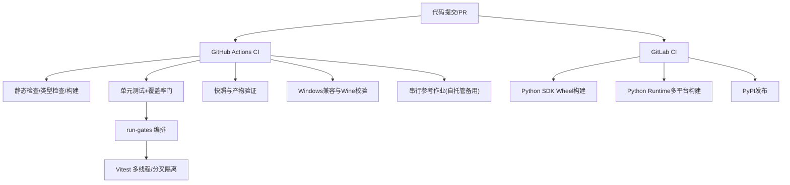
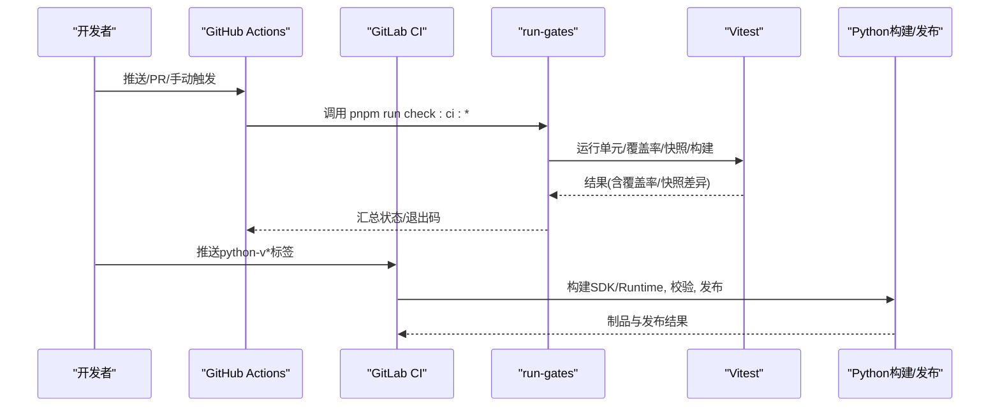
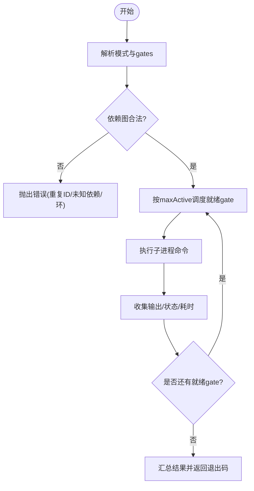
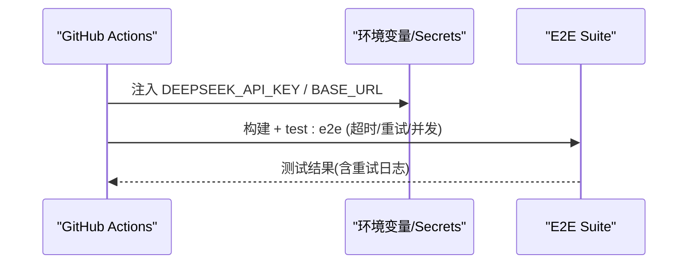
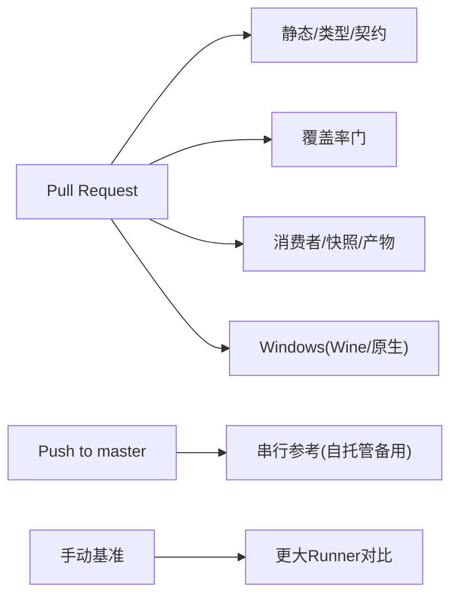
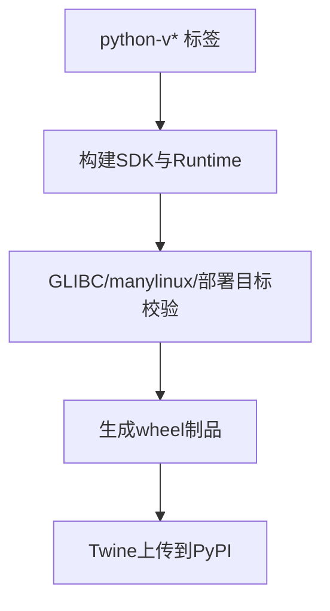
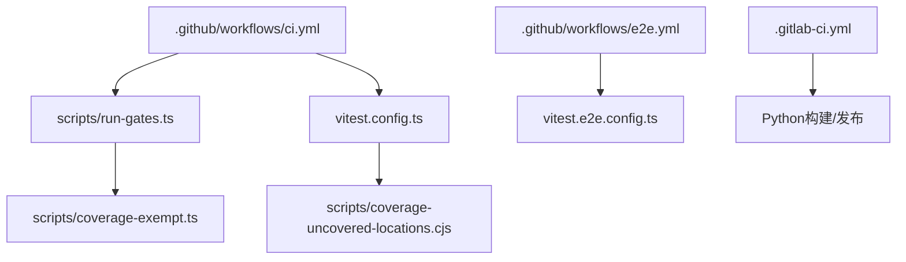

# 测试自动化与CI集成

<cite>
**本文引用的文件列表**
- [GitHub Actions CI](file://.github/workflows/ci.yml)
- [E2E工作流](file://.github/workflows/e2e.yml)
- [GitLab CI](file://.gitlab-ci.yml)
- [根级Vitest配置](file://vitest.config.ts)
- [E2E Vitest配置](file://vitest.e2e.config.ts)
- [共享Vitest工具](file://vitest.shared.ts)
- [质量门禁编排器](file://scripts/run-gates.ts)
- [覆盖率豁免清单](file://scripts/coverage-exempt.ts)
- [精确覆盖率位置报告](file://scripts/coverage-uncovered-locations.cjs)
- [测试策略文档](file://docs/testing.md)
- [根包脚本入口](file://package.json)
</cite>

## 目录
1. [简介](#简介)
2. [项目结构](#项目结构)
3. [核心组件](#核心组件)
4. [架构总览](#架构总览)
5. [详细组件分析](#详细组件分析)
6. [依赖关系分析](#依赖关系分析)
7. [性能考量](#性能考量)
8. [故障排查指南](#故障排查指南)
9. [结论](#结论)
10. [附录](#附录)

## 简介
本文件系统化梳理该仓库的测试自动化与持续集成（CI）体系，覆盖触发条件、任务编排、并行执行策略、Docker容器环境、缓存与制品管理、测试门禁规则、结果收集与报告、失败重试与恢复、资源管理与弹性伸缩、数据持久化与共享、以及性能监控与优化方法。内容基于仓库内实际配置文件与脚本实现进行说明，确保可追溯与可落地。

## 项目结构
仓库采用多工作区（pnpm workspaces），测试与CI通过统一的根级脚本和多个工作流协同：
- GitHub Actions：主CI流水线、E2E真实API测试、Python发布等
- GitLab CI：Python SDK与运行时构建与发布
- Vitest：单元测试、覆盖率、快照、Web浏览器快照、E2E
- run-gates：统一的质量门禁编排器，负责并发控制、依赖图校验、结果汇总



**图表来源**
- [.github/workflows/ci.yml:1-120](file://.github/workflows/ci.yml#L1-L120)
- [.github/workflows/e2e.yml:1-124](file://.github/workflows/e2e.yml#L1-L124)
- [.gitlab-ci.yml:1-130](file://.gitlab-ci.yml#L1-L130)
- [scripts/run-gates.ts:180-243](file://scripts/run-gates.ts#L180-L243)

**章节来源**
- [.github/workflows/ci.yml:1-120](file://.github/workflows/ci.yml#L1-L120)
- [.github/workflows/e2e.yml:1-124](file://.github/workflows/e2e.yml#L1-L124)
- [.gitlab-ci.yml:1-130](file://.gitlab-ci.yml#L1-L130)
- [scripts/run-gates.ts:180-243](file://scripts/run-gates.ts#L180-L243)

## 核心组件
- 质量门禁编排器（run-gates）：定义并执行多种模式（ci-primary、ci-coverage、ci-snapshot、ci-consumers、windows系列等），内置依赖图校验、循环检测、并发上限控制、结果聚合与退出码判定。
- Vitest配置：
  - 根配置：双项目（thread-safe/process-bound）、v8覆盖率、严格阈值（每文件100%）、自定义精确位置报告、跨平台排除与豁免。
  - E2E配置：真实API密钥读取、超时与重试、文件级并行度限制。
- GitHub Actions：
  - 主CI：静态、覆盖率、消费者、兼容性、Windows Wine、串行参考作业、基准对比。
  - E2E：受控密钥、预检、构建lib模式、真实API端到端测试。
- GitLab CI：
  - Python SDK与Runtime多平台构建、manylinux校验、macOS部署目标检查、Twine发布到私有PyPI。

**章节来源**
- [scripts/run-gates.ts:180-243](file://scripts/run-gates.ts#L180-L243)
- [vitest.config.ts:117-286](file://vitest.config.ts#L117-L286)
- [vitest.e2e.config.ts:1-59](file://vitest.e2e.config.ts#L1-L59)
- [.github/workflows/ci.yml:63-258](file://.github/workflows/ci.yml#L63-L258)
- [.github/workflows/e2e.yml:54-124](file://.github/workflows/e2e.yml#L54-L124)
- [.gitlab-ci.yml:23-130](file://.gitlab-ci.yml#L23-L130)

## 架构总览
下图展示从触发到执行的端到端流程，包括GitHub Actions与GitLab CI两条主线，以及run-gates在内部的任务编排。



**图表来源**
- [.github/workflows/ci.yml:63-258](file://.github/workflows/ci.yml#L63-L258)
- [.github/workflows/e2e.yml:54-124](file://.github/workflows/e2e.yml#L54-L124)
- [.gitlab-ci.yml:23-130](file://.gitlab-ci.yml#L23-L130)
- [scripts/run-gates.ts:180-243](file://scripts/run-gates.ts#L180-L243)

## 详细组件分析

### 质量门禁编排器（run-gates）
- 模式集合：ci-primary、ci-linux-primary、ci-static、ci-lint-contracts-ready、ci-coverage、ci-snapshot、ci-artifacts、ci-consumers、ci-windows-blocking/complete/observational、node-compat、check-all、doc-sync。
- 并发控制：默认按可用CPU计算，特定模式有上限；可通过环境变量DSH_GATE_CONCURRENCY覆盖。
- 依赖图：支持needs声明，自动校验无环与可达性；失败或跳过的依赖会级联跳过后续任务。
- 结果输出：每个gate记录耗时、stdout/stderr片段、退出码/信号；最终根据allowFailure判断整体成功。



**图表来源**
- [scripts/run-gates.ts:649-777](file://scripts/run-gates.ts#L649-L777)
- [scripts/run-gates.ts:180-243](file://scripts/run-gates.ts#L180-L243)

**章节来源**
- [scripts/run-gates.ts:180-243](file://scripts/run-gates.ts#L180-L243)
- [scripts/run-gates.ts:649-777](file://scripts/run-gates.ts#L649-L777)

### Vitest测试框架与覆盖率
- 双项目隔离：thread-safe（forks池，排除process-bound与重型套件）与process-bound（独立进程边界）。
- 覆盖率：v8 provider，包含packages/*/src/**/*.{ts,tsx}，排除类型/入口/客户端UI债务区域；阈值perFile=100%，语句/分支/函数/行均为100%。
- 精确位置报告：自定义istanbul reporter在CI与本地均启用，失败时打印path:line:col级别的可点击记录。
- 重型套件豁免：将编译器/子进程重型套件放入未插桩并行gate，避免v8开销影响阈值时间。

```mermaid
classDiagram
class VitestConfig {
+projects : ["thread-safe","process-bound"]
+coverage.provider : "v8"
+coverage.include : "packages/*/src/**/*.{ts,tsx}"
+coverage.thresholds.perFile : true
+coverage.thresholds.* : 100
+reporter : ["text","html","uncoveredLocationsReporter"]
}
class CoverageExempt {
+COVERAGE_EXEMPT_ENV : "DSH_COVERAGE_EXEMPT_HEAVY"
+coverageExemptHeavySuites : "filter/exclude"
}
VitestConfig --> CoverageExempt : "在覆盖率gate中豁免重型套件"
```

**图表来源**
- [vitest.config.ts:117-286](file://vitest.config.ts#L117-L286)
- [scripts/coverage-exempt.ts:1-42](file://scripts/coverage-exempt.ts#L1-L42)
- [scripts/coverage-uncovered-locations.cjs:1-31](file://scripts/coverage-uncovered-locations.cjs#L1-L31)

**章节来源**
- [vitest.config.ts:117-286](file://vitest.config.ts#L117-L286)
- [scripts/coverage-exempt.ts:1-42](file://scripts/coverage-exempt.ts#L1-L42)
- [scripts/coverage-uncovered-locations.cjs:1-31](file://scripts/coverage-uncovered-locations.cjs#L1-L31)

### E2E测试与真实API
- 触发：workflow_dispatch/push/schedule，仅对可信事件运行（排除fork与Dependabot）。
- 密钥管理：通过secrets映射为DEEPSEEK_API_KEY，并在步骤中显式注入；预检缺失则失败，避免“全跳过即通过”的假绿。
- 执行：构建lib模式后运行test:e2e，设置超时、重试与最大并发（DSH_E2E_MAX_WORKERS）。



**图表来源**
- [.github/workflows/e2e.yml:54-124](file://.github/workflows/e2e.yml#L54-L124)
- [vitest.e2e.config.ts:1-59](file://vitest.e2e.config.ts#L1-L59)

**章节来源**
- [.github/workflows/e2e.yml:54-124](file://.github/workflows/e2e.yml#L54-L124)
- [vitest.e2e.config.ts:1-59](file://vitest.e2e.config.ts#L1-L59)

### GitHub Actions流水线设计
- 触发条件：push到master、pull_request、workflow_dispatch（可选suite）。
- 并发控制：按workflow-ref分组，取消进行中（push除外），避免打乱自托管备用演练。
- 关键作业：
  - node-24：静态检查、类型契约、模块图、文档同步、构建、publint、节点版本兼容。
  - node-24-coverage：覆盖率门（v8，per-file 100%），分离重型套件。
  - node-24-consumers：构建产物、快照、Web浏览器快照、文档站点构建。
  - windows：Wine阻塞性检查；windows-native：完整原生套件（非阻塞）。
  - serial-*：串行参考作业与自托管备用演练（master push触发）。
  - larger-runner-benchmark/consolidated-runner-benchmark：手动基准对比。



**图表来源**
- [.github/workflows/ci.yml:1-120](file://.github/workflows/ci.yml#L1-L120)
- [.github/workflows/ci.yml:63-258](file://.github/workflows/ci.yml#L63-L258)
- [.github/workflows/ci.yml:495-697](file://.github/workflows/ci.yml#L495-L697)
- [.github/workflows/ci.yml:700-800](file://.github/workflows/ci.yml#L700-L800)

**章节来源**
- [.github/workflows/ci.yml:1-120](file://.github/workflows/ci.yml#L1-L120)
- [.github/workflows/ci.yml:63-258](file://.github/workflows/ci.yml#L63-L258)
- [.github/workflows/ci.yml:495-697](file://.github/workflows/ci.yml#L495-L697)
- [.github/workflows/ci.yml:700-800](file://.github/workflows/ci.yml#L700-L800)

### GitLab CI流水线设计
- 触发：匹配python-v语义化标签。
- 阶段：build与publish。
- 任务：
  - sdk-wheel：构建Python SDK wheel。
  - runtime-*：多平台（linux-x64/arm64、macos-arm64）构建运行时，校验GLIBC/manylinux，macOS部署目标检查，smoke测试。
  - publish-python：校验制品数量与名称，twine检查并上传至GitLab PyPI。



**图表来源**
- [.gitlab-ci.yml:1-130](file://.gitlab-ci.yml#L1-L130)

**章节来源**
- [.gitlab-ci.yml:1-130](file://.gitlab-ci.yml#L1-L130)

### Docker容器环境与缓存策略
- GitHub Actions：
  - Node/pnpm store缓存：使用actions/cache按操作系统与lockfile哈希键存储，PR恢复但不保存以避免付费路径延迟。
  - Playwright系统依赖缓存：按操作系统与lockfile哈希键缓存Chromium及系统包。
  - Wine apt缓存：master推送到默认分支范围缓存deb包，PR可恢复。
- GitLab CI：
  - Python venv与uv安装，构建时使用quay.io/pypa/manylinux镜像进行交叉校验与smoke测试。

**章节来源**
- [.github/workflows/ci.yml:88-105](file://.github/workflows/ci.yml#L88-L105)
- [.github/workflows/ci.yml:143-160](file://.github/workflows/ci.yml#L143-L160)
- [.github/workflows/ci.yml:206-231](file://.github/workflows/ci.yml#L206-L231)
- [.github/workflows/ci.yml:356-435](file://.github/workflows/ci.yml#L356-L435)
- [.gitlab-ci.yml:33-67](file://.gitlab-ci.yml#L33-L67)

### Artifact管理
- GitHub Actions：各job产物由平台自带机制保留（如Playwright二进制、构建产物），并通过cache复用。
- GitLab CI：明确artifacts.paths与过期时间（例如release/sdk/*.whl、release/$PLATFORM/*.whl，过期1周）。

**章节来源**
- [.gitlab-ci.yml:23-31](file://.gitlab-ci.yml#L23-L31)
- [.gitlab-ci.yml:65-67](file://.gitlab-ci.yml#L65-L67)

### 测试门禁规则
- 覆盖率阈值：perFile=100%，语句/分支/函数/行均为100%；失败时输出精确位置以便修复。
- 静态与契约：类型检查、模块图、文档类型检查、导出一致性、链接有效性等。
- 兼容性：Node 22/26兼容烟测；Windows Wine与原生两套信号。
- 快照：keyless预期输出覆盖外部行为；Web浏览器快照强制replay模式。

**章节来源**
- [vitest.config.ts:160-283](file://vitest.config.ts#L160-L283)
- [scripts/run-gates.ts:256-284](file://scripts/run-gates.ts#L256-L284)
- [docs/testing.md:7-15](file://docs/testing.md#L7-L15)

### 测试结果收集与报告
- 单元测试：text与HTML报告（本地），CI下附加精确位置报告。
- 覆盖率：v8 provider，失败时输出path:line:col级别记录。
- 快照：JSONL与截图比对，CI强制replay，本地record/refresh需人工审查。
- E2E：带重试与并发控制，超时保护，密钥预检。

**章节来源**
- [vitest.config.ts:280-283](file://vitest.config.ts#L280-L283)
- [scripts/coverage-uncovered-locations.cjs:1-31](file://scripts/coverage-uncovered-locations.cjs#L1-L31)
- [vitest.e2e.config.ts:46-57](file://vitest.e2e.config.ts#L46-L57)
- [.github/workflows/e2e.yml:89-124](file://.github/workflows/e2e.yml#L89-L124)

### 失败重试与故障恢复
- E2E重试：配置retry=2，配合超时与并发限制，缓解临时限流导致的抖动。
- 门禁降级：部分Windows观测性任务允许失败（allowFailure），不影响阻塞性门禁。
- 人工干预：基准对比与串行参考作业用于定位问题；自托管备用演练保证生产池退化时可接管。

**章节来源**
- [vitest.e2e.config.ts:46-57](file://vitest.e2e.config.ts#L46-L57)
- [scripts/run-gates.ts:429-441](file://scripts/run-gates.ts#L429-L441)
- [.github/workflows/ci.yml:561-619](file://.github/workflows/ci.yml#L561-L619)

### 测试环境资源管理
- 并发预算：run-gates通过DSH_GATE_CONCURRENCY控制；覆盖率门通过DSH_COVERAGE_MAX_WORKERS拆分权重；E2E通过DSH_E2E_MAX_WORKERS限制文件级并行。
- 弹性伸缩：GitHub Actions支持不同规格runner矩阵（larger-runner-benchmark），便于容量评估与瓶颈识别。
- 负载均衡：多作业并行（静态/覆盖率/消费者/Windows），减少关键路径等待。

**章节来源**
- [scripts/run-gates.ts:123-156](file://scripts/run-gates.ts#L123-L156)
- [scripts/run-gates.ts:485-518](file://scripts/run-gates.ts#L485-L518)
- [vitest.e2e.config.ts:16-29](file://vitest.e2e.config.ts#L16-L29)
- [.github/workflows/ci.yml:700-800](file://.github/workflows/ci.yml#L700-L800)

### 测试数据持久化与共享
- 快照数据：JSONL与截图作为keyless预期输出，随仓库版本化；迁移脚本保障布局一致性。
- 缓存数据：pnpm store、Playwright二进制、Wine deb包跨PR共享，加速冷启动。
- 分布式存储：GitLab PyPI制品用于Python SDK/Runtime分发；GitHub Actions artifacts用于临时构建产物。

**章节来源**
- [docs/testing.md:12-15](file://docs/testing.md#L12-L15)
- [.github/workflows/ci.yml:206-231](file://.github/workflows/ci.yml#L206-L231)
- [.gitlab-ci.yml:23-31](file://.gitlab-ci.yml#L23-L31)

### 性能监控与优化
- 执行时间分析：run-gates记录每个gate的durationMs，便于定位慢任务。
- 资源使用监控：benchmark作业报告runner CPU/内存，辅助容量规划。
- 瓶颈识别：覆盖率门拆分重型套件；E2E并发可调；Windows Wine缓存降低依赖安装时间。

**章节来源**
- [scripts/run-gates.ts:788-800](file://scripts/run-gates.ts#L788-L800)
- [.github/workflows/ci.yml:771-786](file://.github/workflows/ci.yml#L771-L786)
- [scripts/run-gates.ts:485-518](file://scripts/run-gates.ts#L485-L518)

## 依赖关系分析
- 工作流依赖：
  - ci.yml中的jobs相互独立但通过concurrency组协调；serial-*作业作为参考与备用。
  - e2e.yml独立于ci.yml，专注真实API测试，需要密钥预检。
- 脚本依赖：
  - run-gates依赖package.json中的脚本与vitest配置；覆盖率门依赖coverage-exempt与精确位置报告。
- 平台依赖：
  - Windows通过Wine与原生两套信号；Linux通过manylinux镜像校验。



**图表来源**
- [.github/workflows/ci.yml:63-258](file://.github/workflows/ci.yml#L63-L258)
- [.github/workflows/e2e.yml:54-124](file://.github/workflows/e2e.yml#L54-L124)
- [.gitlab-ci.yml:23-130](file://.gitlab-ci.yml#L23-L130)
- [scripts/run-gates.ts:180-243](file://scripts/run-gates.ts#L180-L243)
- [vitest.config.ts:117-286](file://vitest.config.ts#L117-L286)
- [vitest.e2e.config.ts:1-59](file://vitest.e2e.config.ts#L1-L59)
- [scripts/coverage-exempt.ts:1-42](file://scripts/coverage-exempt.ts#L1-L42)
- [scripts/coverage-uncovered-locations.cjs:1-31](file://scripts/coverage-uncovered-locations.cjs#L1-L31)

**章节来源**
- [.github/workflows/ci.yml:63-258](file://.github/workflows/ci.yml#L63-L258)
- [.github/workflows/e2e.yml:54-124](file://.github/workflows/e2e.yml#L54-L124)
- [.gitlab-ci.yml:23-130](file://.gitlab-ci.yml#L23-L130)
- [scripts/run-gates.ts:180-243](file://scripts/run-gates.ts#L180-L243)
- [vitest.config.ts:117-286](file://vitest.config.ts#L117-L286)
- [vitest.e2e.config.ts:1-59](file://vitest.e2e.config.ts#L1-L59)
- [scripts/coverage-exempt.ts:1-42](file://scripts/coverage-exempt.ts#L1-L42)
- [scripts/coverage-uncovered-locations.cjs:1-31](file://scripts/coverage-uncovered-locations.cjs#L1-L31)

## 性能考量
- 并发与隔离：Vitest使用forks池避免线程竞争；process-bound测试单独隔离；覆盖率门拆分重型套件。
- 缓存命中：pnpm store、Playwright、Wine deb包显著减少冷启动时间。
- 资源上限：通过环境变量精细控制并发，避免资源争用导致的不稳定。
- 基准对比：手动基准作业评估不同规格runner的性能，指导扩容决策。

[本节提供通用指导，无需具体文件分析]

## 故障排查指南
- 覆盖率失败：查看精确位置报告输出的path:line:col记录，定位未覆盖语句/分支/函数。
- E2E失败：检查密钥预检与BASE_URL配置；调整DSH_E2E_MAX_WORKERS降低并发；查看重试日志。
- Windows问题：确认Wine安装与apt缓存；必要时切换到native Windows作业定位内核相关缺陷。
- 串行参考作业：若PR阻塞，优先查看自托管备用演练结果以区分平台问题。

**章节来源**
- [scripts/coverage-uncovered-locations.cjs:1-31](file://scripts/coverage-uncovered-locations.cjs#L1-L31)
- [.github/workflows/e2e.yml:89-124](file://.github/workflows/e2e.yml#L89-L124)
- [.github/workflows/ci.yml:338-435](file://.github/workflows/ci.yml#L338-L435)
- [.github/workflows/ci.yml:561-619](file://.github/workflows/ci.yml#L561-L619)

## 结论
该仓库建立了完善的测试自动化与CI体系：通过run-gates统一编排质量门禁，Vitest提供严格的覆盖率与快照验证，GitHub Actions与GitLab CI分别承担前端/后端与Python生态的构建与发布。结合缓存、并发控制、重试与备用演练，系统在稳定性、可维护性与可扩展性方面具备良好实践。建议持续关注基准作业结果与覆盖率精确位置报告，持续优化瓶颈与提升测试效率。

[本节总结性内容，无需具体文件分析]

## 附录
- 测试策略与分层：单位、覆盖率门、真实API E2E、快照、Web浏览器快照。
- 最佳实践：优先真实实现而非mock；e2e断言外部世界；测试真实入口路径；source平面测试。

**章节来源**
- [docs/testing.md:7-50](file://docs/testing.md#L7-L50)