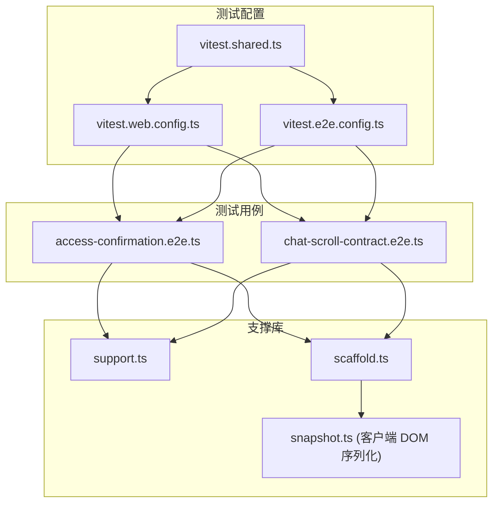
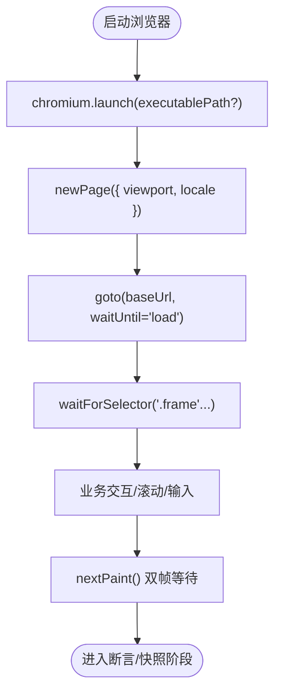
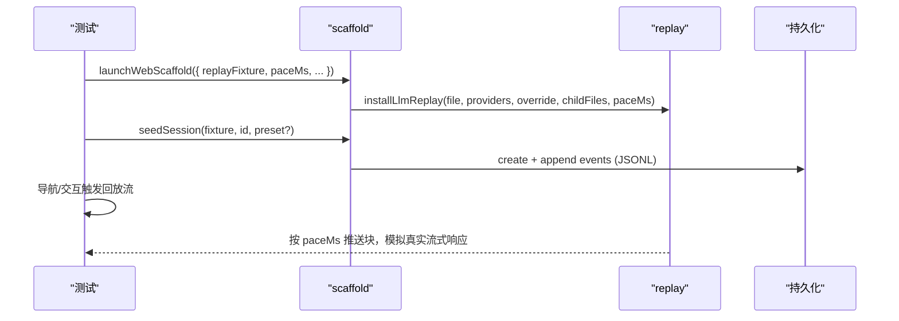
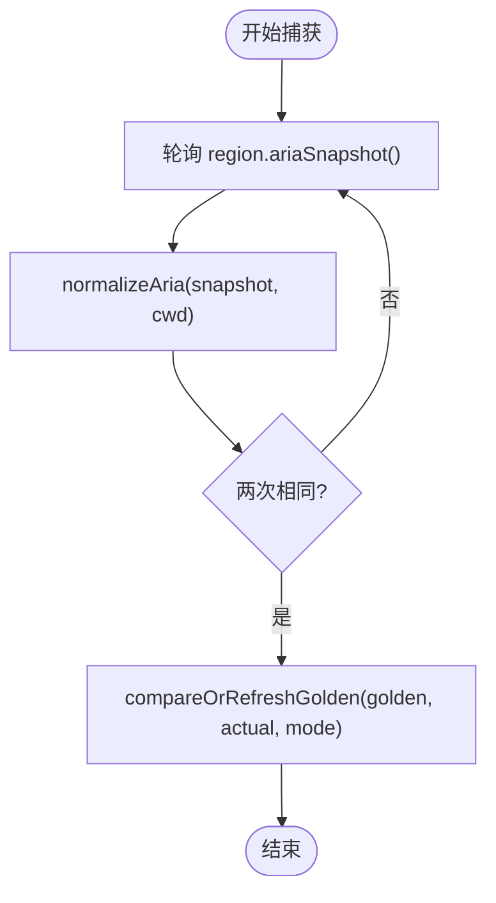
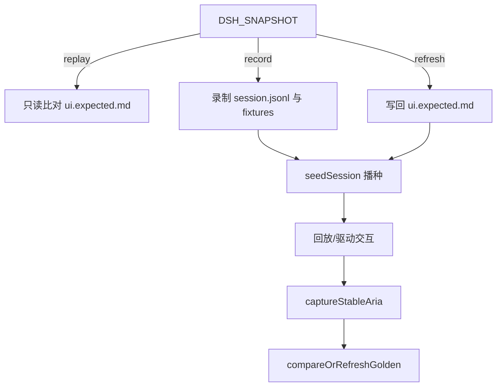
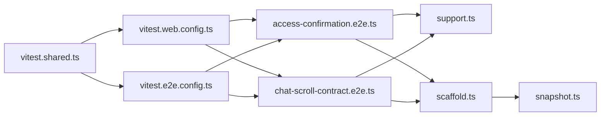

# 浏览器快照测试

<cite>
**本文引用的文件**
- [apps/web/tests/scaffold.ts](file://apps/web/tests/scaffold.ts)
- [apps/web/tests/support.ts](file://apps/web/tests/support.ts)
- [apps/web/tests/access-confirmation.e2e.ts](file://apps/web/tests/access-confirmation.e2e.ts)
- [apps/web/tests/chat-scroll-contract.e2e.ts](file://apps/web/tests/chat-scroll-contract.e2e.ts)
- [vitest.web.config.ts](file://vitest.web.config.ts)
- [vitest.e2e.config.ts](file://vitest.e2e.config.ts)
- [vitest.shared.ts](file://vitest.shared.ts)
- [packages/test-support/client-runtime/src/snapshot.ts](file://packages/test-support/client-runtime/src/snapshot.ts)
</cite>

## 目录
1. [简介](#简介)
2. [项目结构](#项目结构)
3. [核心组件](#核心组件)
4. [架构总览](#架构总览)
5. [详细组件分析](#详细组件分析)
6. [依赖关系分析](#依赖关系分析)
7. [性能考虑](#性能考虑)
8. [故障排查指南](#故障排查指南)
9. [结论](#结论)
10. [附录](#附录)

## 简介
本文件系统化说明仓库中的“浏览器快照测试”方案，覆盖 Chromium 启动与配置、Playwright 使用、视口与等待策略、DOM/ARIA 快照捕获与比较、动态内容稳定化、响应式与跨浏览器兼容策略、CI 只读模式与本地记录流程，以及性能优化技巧。所有实现均基于仓库内现有代码与配置，确保可复现与可维护。

## 项目结构
- Web E2E 测试位于 apps/web/tests，采用 Vitest 的 web 专用配置运行，串行执行以共享单一浏览器实例，降低启动开销并保证稳定性。
- 测试通过自研脚手架 launchWebScaffold 启动真实 Web 组合（Host + Client），在临时工作区与隔离的 $DSH_HOME 下运行，避免污染用户环境。
- 快照对比产物位于 apps/web/tests/snapshots，按场景分目录组织，包含 ui.expected.md、session.jsonl、seed.jsonl、replay.override.json 等。
- 公共工具与辅助函数集中在 support.ts 与 scaffold.ts，封装页面创建、失败截图、会话播种、回放注入、ARIA 快照稳定化与黄金文件对比。



**图示来源**
- [vitest.web.config.ts:1-36](file://vitest.web.config.ts#L1-L36)
- [vitest.e2e.config.ts:1-59](file://vitest.e2e.config.ts#L1-L59)
- [vitest.shared.ts:1-43](file://vitest.shared.ts#L1-L43)
- [apps/web/tests/access-confirmation.e2e.ts:1-81](file://apps/web/tests/access-confirmation.e2e.ts#L1-L81)
- [apps/web/tests/chat-scroll-contract.e2e.ts:1-844](file://apps/web/tests/chat-scroll-contract.e2e.ts#L1-L844)
- [apps/web/tests/support.ts:1-136](file://apps/web/tests/support.ts#L1-L136)
- [apps/web/tests/scaffold.ts:1-858](file://apps/web/tests/scaffold.ts#L1-L858)
- [packages/test-support/client-runtime/src/snapshot.ts:1-89](file://packages/test-support/client-runtime/src/snapshot.ts#L1-L89)

**章节来源**
- [vitest.web.config.ts:1-36](file://vitest.web.config.ts#L1-L36)
- [vitest.e2e.config.ts:1-59](file://vitest.e2e.config.ts#L1-L59)
- [vitest.shared.ts:1-43](file://vitest.shared.ts#L1-L43)
- [apps/web/tests/support.ts:1-136](file://apps/web/tests/support.ts#L1-L136)
- [apps/web/tests/scaffold.ts:1-858](file://apps/web/tests/scaffold.ts#L1-L858)

## 核心组件
- 浏览器与页面管理
  - Playwright Chromium 启动：支持通过环境变量指定可执行路径，便于 CI 或本地复用系统 Chromium。
  - 页面初始化：固定视口宽度 1680，高度可按需调整；语言环境默认 zh-CN 或 en-US，保证国际化断言稳定。
  - 失败截图：统一输出到 .artifacts 目录，便于失败诊断。
- Web 脚手架
  - 启动真实 Web 组合：加载 base 与 web-app 补丁，注入 session persistence、webserver、settings、credentials 等行，绑定随机端口并返回 baseUrl。
  - 会话播种与回放：通过 seedSession/realizeSeedFixture 将 session.jsonl 写入持久化根；replayFixture/replayOverride 注入 LLM 回放流，支持 paceMs 控制增量渲染节奏。
  - 模式切换：DSH_SNAPSHOT=replay|record|refresh，分别对应只读对比、录制生成、刷新黄金文件。
- 快照捕获与比较
  - ARIA 快照：captureStableAria 轮询直到两次归一化结果一致，避免 React 提交竞态。
  - 归一化：normalizeAria 替换 UUID、时间、路径、工作区名等不稳定信息为占位符。
  - 黄金文件：compareOrRefreshGolden 在 replay 模式下比对 ui.expected.md，在 refresh 模式下重写。
- DOM 快照序列化（客户端）
  - 注册自定义序列化器，折叠 CSS 模块类名、对 SVG 内部进行指纹压缩，保持 .snap 文件结构稳定。

**章节来源**
- [apps/web/tests/support.ts:1-136](file://apps/web/tests/support.ts#L1-L136)
- [apps/web/tests/scaffold.ts:85-97](file://apps/web/tests/scaffold.ts#L85-L97)
- [apps/web/tests/scaffold.ts:294-626](file://apps/web/tests/scaffold.ts#L294-L626)
- [apps/web/tests/scaffold.ts:651-662](file://apps/web/tests/scaffold.ts#L651-L662)
- [apps/web/tests/scaffold.ts:703-711](file://apps/web/tests/scaffold.ts#L703-L711)
- [apps/web/tests/scaffold.ts:713-776](file://apps/web/tests/scaffold.ts#L713-L776)
- [apps/web/tests/scaffold.ts:789-800](file://apps/web/tests/scaffold.ts#L789-L800)
- [apps/web/tests/scaffold.ts:828-858](file://apps/web/tests/scaffold.ts#L828-L858)
- [packages/test-support/client-runtime/src/snapshot.ts:1-89](file://packages/test-support/client-runtime/src/snapshot.ts#L1-L89)

## 架构总览
下图展示一次 Web 快照测试从配置到浏览器交互、再到快照对比的完整流程。

```mermaid
sequenceDiagram
participant Conf as "Vitest 配置"
participant Test as "测试用例"
participant Scaf as "Web 脚手架"
participant B as "Chromium"
participant P as "Page"
participant Snap as "快照工具"
Conf->>Test : 加载 vitest.web.config.ts
Test->>Scaf : launchWebScaffold(模式/回放/种子)
Scaf-->>Test : {baseUrl, ctx, whenTurnSettled}
Test->>B : chromium.launch(executablePath?)
B-->>Test : Browser
Test->>P : browser.newPage({viewport, locale})
P->>P : goto(baseUrl, waitUntil='load')
P->>P : waitForSelector('.frame'...)
Test->>Scaf : seedSession / installLlmReplay
Test->>P : 驱动交互/滚动/输入
Test->>Snap : captureStableAria(selector, workspaceCwd)
Snap-->>Test : 稳定化的 ARIA 文本
Test->>Snap : compareOrRefreshGolden(golden, actual, mode)
Note over Test,Snap : replay=比对; refresh=写回; record=不在此处写UI黄金
```

**图示来源**
- [vitest.web.config.ts:1-36](file://vitest.web.config.ts#L1-L36)
- [apps/web/tests/access-confirmation.e2e.ts:26-45](file://apps/web/tests/access-confirmation.e2e.ts#L26-L45)
- [apps/web/tests/scaffold.ts:294-626](file://apps/web/tests/scaffold.ts#L294-L626)
- [apps/web/tests/scaffold.ts:828-858](file://apps/web/tests/scaffold.ts#L828-L858)

## 详细组件分析

### 浏览器启动与配置（Chromium + Playwright）
- 启动参数
  - 支持通过 DSH_PLAYWRIGHT_EXECUTABLE_PATH 指向已安装的 Chromium，便于 CI 或本地复用。
  - 页面视口：宽度固定 1680，高度可按场景调整；locale 设置为 zh-CN 或 en-US，确保界面文案与字典一致。
- 等待策略
  - 使用 page.waitForSelector('[class*="frame"]') 等待应用框架挂载完成。
  - 针对长对话与滚动场景，使用 nextPaint 与 requestAnimationFrame 双帧等待，确保字体加载与布局稳定。
- 失败取证
  - saveFailureShot 自动保存全页截图至 .artifacts，便于失败时快速定位。



**图示来源**
- [apps/web/tests/access-confirmation.e2e.ts:26-45](file://apps/web/tests/access-confirmation.e2e.ts#L26-L45)
- [apps/web/tests/chat-scroll-contract.e2e.ts:237-244](file://apps/web/tests/chat-scroll-contract.e2e.ts#L237-L244)
- [apps/web/tests/support.ts:30-38](file://apps/web/tests/support.ts#L30-L38)
- [apps/web/tests/support.ts:112-121](file://apps/web/tests/support.ts#L112-L121)

**章节来源**
- [apps/web/tests/access-confirmation.e2e.ts:26-45](file://apps/web/tests/access-confirmation.e2e.ts#L26-L45)
- [apps/web/tests/chat-scroll-contract.e2e.ts:237-244](file://apps/web/tests/chat-scroll-contract.e2e.ts#L237-L244)
- [apps/web/tests/support.ts:30-38](file://apps/web/tests/support.ts#L30-L38)
- [apps/web/tests/support.ts:112-121](file://apps/web/tests/support.ts#L112-L121)

### 会话播种与回放（LLM 回放与资源预加载）
- 回放注入
  - 通过 installLlmReplay 注入 dsh-llm-replay，提供 providers 列表与回放文件，支持 childFiles 与 overrideFile。
  - 可通过 paceMs 控制 chunk 播放速度，使浏览器观察到真实的增量 SSE 渲染。
- 会话播种
  - seedSession/realizeSeedFixture 将 session.jsonl 通过真实后端 API 写入持久化根，避免直接写文件的格式风险。
  - 支持 seedBlankSession 用于冷启动空白会话。
- 资源预加载
  - 通过路由拦截与种子数据，提前准备搜索索引与历史分页所需数据，减少首屏抖动。



**图示来源**
- [apps/web/tests/scaffold.ts:550-568](file://apps/web/tests/scaffold.ts#L550-L568)
- [apps/web/tests/scaffold.ts:713-776](file://apps/web/tests/scaffold.ts#L713-L776)

**章节来源**
- [apps/web/tests/scaffold.ts:550-568](file://apps/web/tests/scaffold.ts#L550-L568)
- [apps/web/tests/scaffold.ts:713-776](file://apps/web/tests/scaffold.ts#L713-L776)

### 快照捕获与比较（DOM/ARIA/CSS/JS 状态）
- ARIA 快照
  - captureStableAria 轮询区域 ariaSnapshot，直到两次归一化结果相等，避免 React 提交竞态导致的抖动。
- 归一化策略
  - normalizeAria 将 UUID、时间、路径、工作区名、吞吐率等不稳定字段替换为占位符，确保跨机器/跨次运行稳定。
- 黄金文件对比
  - compareOrRefreshGolden 在 replay 模式下读取 ui.expected.md 并断言；在 refresh 模式下写回；缺失时在 replay 模式报错提示刷新命令。
- DOM 快照序列化（.snap）
  - 注册 domSnapshotSerializer，折叠 CSS 模块类名、对 SVG 内部做指纹压缩，保持结构型快照稳定。



**图示来源**
- [apps/web/tests/scaffold.ts:828-858](file://apps/web/tests/scaffold.ts#L828-L858)
- [apps/web/tests/scaffold.ts:789-800](file://apps/web/tests/scaffold.ts#L789-L800)
- [packages/test-support/client-runtime/src/snapshot.ts:1-89](file://packages/test-support/client-runtime/src/snapshot.ts#L1-L89)

**章节来源**
- [apps/web/tests/scaffold.ts:789-800](file://apps/web/tests/scaffold.ts#L789-L800)
- [apps/web/tests/scaffold.ts:828-858](file://apps/web/tests/scaffold.ts#L828-L858)
- [packages/test-support/client-runtime/src/snapshot.ts:1-89](file://packages/test-support/client-runtime/src/snapshot.ts#L1-L89)

### 动态内容处理（时间戳、随机ID、滚动位置）
- 会话 ID、cwd、rpcId 等通过 scrubRequestHeaders 与字符串替换替换为 {{sessionId}}/{{cwd}}/{{rpcId}}，确保回放与录制一致性。
- 工作区基名与路径在 ARIA 快照中统一替换为 {{workspace}}/{{cwd}}。
- 滚动位置与可视锚点通过 visibleFlowAnchor、expectSameFlowTop、scrollGeometry 等工具进行几何级断言，避免虚拟列表实现细节影响。

**章节来源**
- [apps/web/tests/scaffold.ts:651-662](file://apps/web/tests/scaffold.ts#L651-L662)
- [apps/web/tests/scaffold.ts:789-800](file://apps/web/tests/scaffold.ts#L789-L800)
- [apps/web/tests/chat-scroll-contract.e2e.ts:355-403](file://apps/web/tests/chat-scroll-contract.e2e.ts#L355-L403)

### 响应式设计与跨浏览器兼容性
- 视口切换
  - 通过 page.setViewportSize 切换窄屏（如 700x900）验证侧边栏折叠与布局变化。
- 多语言
  - 使用 ZH_BROWSER_LOCALE 与 newEnglishPage 分别驱动中文与英文界面，确保断言与字典一致。
- 浏览器复用
  - 同一测试文件内共享一个 Chromium 进程，减少启动开销；每个场景使用独立 Page Context 避免状态泄漏。

**章节来源**
- [apps/web/tests/chat-scroll-contract.e2e.ts:657-665](file://apps/web/tests/chat-scroll-contract.e2e.ts#L657-L665)
- [apps/web/tests/support.ts:30-38](file://apps/web/tests/support.ts#L30-L38)
- [apps/web/tests/chat-scroll-contract.e2e.ts:194-206](file://apps/web/tests/chat-scroll-contract.e2e.ts#L194-L206)

### 测试性能优化技巧
- 并行与串行
  - Web 测试文件串行执行（fileParallelism: false），共享单一浏览器实例，降低启动成本与资源竞争。
  - E2E 通用配置支持 DSH_E2E_MAX_WORKERS 控制文件级并行度，默认 4。
- 回放节奏
  - 通过 paceMs 控制回放块间隔，模拟真实网络延迟，提升 UI 行为稳定性。
- 资源预加载
  - 通过 seedSession 预先写入会话事件，避免首次请求带来的不确定性。
- 失败截图
  - saveFailureShot 快速产出证据，缩短排障时间。

**章节来源**
- [vitest.web.config.ts:24-35](file://vitest.web.config.ts#L24-L35)
- [vitest.e2e.config.ts:16-57](file://vitest.e2e.config.ts#L16-L57)
- [apps/web/tests/scaffold.ts:550-568](file://apps/web/tests/scaffold.ts#L550-L568)
- [apps/web/tests/support.ts:112-121](file://apps/web/tests/support.ts#L112-L121)

### CI 只读模式与本地记录流程
- 模式
  - DSH_SNAPSHOT=replay：CI 默认模式，仅比对 ui.expected.md，禁止写盘。
  - DSH_SNAPSHOT=record：需要 DEEPSEEK_API_KEY，录制真实会话并生成 session.jsonl 等夹具。
  - DSH_SNAPSHOT=refresh：本地刷新黄金文件（ui.expected.md）。
- 流程
  - 录制：launchWebScaffold(record) -> 驱动交互 -> recordFixture 清洗并写入 session.jsonl。
  - 回放：launchWebScaffold(replay) -> seedSession -> 回放 LLM -> captureStableAria -> compareOrRefreshGolden。
  - 刷新：launchWebScaffold(refresh) -> 同回放流程，但 write golden。



**图示来源**
- [apps/web/tests/scaffold.ts:85-97](file://apps/web/tests/scaffold.ts#L85-L97)
- [apps/web/tests/scaffold.ts:294-307](file://apps/web/tests/scaffold.ts#L294-L307)
- [apps/web/tests/scaffold.ts:651-662](file://apps/web/tests/scaffold.ts#L651-L662)
- [apps/web/tests/scaffold.ts:848-858](file://apps/web/tests/scaffold.ts#L848-L858)

**章节来源**
- [apps/web/tests/scaffold.ts:85-97](file://apps/web/tests/scaffold.ts#L85-L97)
- [apps/web/tests/scaffold.ts:294-307](file://apps/web/tests/scaffold.ts#L294-L307)
- [apps/web/tests/scaffold.ts:651-662](file://apps/web/tests/scaffold.ts#L651-L662)
- [apps/web/tests/scaffold.ts:848-858](file://apps/web/tests/scaffold.ts#L848-L858)

## 依赖关系分析
- 配置层
  - vitest.web.config.ts：定义 Web 测试入口、超时与串行执行。
  - vitest.e2e.config.ts：定义 E2E 并行度与环境变量加载。
  - vitest.shared.ts：提供装饰器预处理与 execArgv 设置。
- 测试层
  - access-confirmation.e2e.ts、chat-scroll-contract.e2e.ts：具体场景，调用脚手架与支撑工具。
- 支撑层
  - support.ts：浏览器/页面/失败截图/工作区连接。
  - scaffold.ts：Web 组合启动、会话播种、回放注入、ARIA 快照与黄金文件对比。
  - snapshot.ts（客户端）：DOM 快照序列化器。



**图示来源**
- [vitest.web.config.ts:1-36](file://vitest.web.config.ts#L1-L36)
- [vitest.e2e.config.ts:1-59](file://vitest.e2e.config.ts#L1-L59)
- [vitest.shared.ts:1-43](file://vitest.shared.ts#L1-L43)
- [apps/web/tests/access-confirmation.e2e.ts:1-81](file://apps/web/tests/access-confirmation.e2e.ts#L1-L81)
- [apps/web/tests/chat-scroll-contract.e2e.ts:1-844](file://apps/web/tests/chat-scroll-contract.e2e.ts#L1-L844)
- [apps/web/tests/support.ts:1-136](file://apps/web/tests/support.ts#L1-L136)
- [apps/web/tests/scaffold.ts:1-858](file://apps/web/tests/scaffold.ts#L1-L858)
- [packages/test-support/client-runtime/src/snapshot.ts:1-89](file://packages/test-support/client-runtime/src/snapshot.ts#L1-L89)

**章节来源**
- [vitest.web.config.ts:1-36](file://vitest.web.config.ts#L1-L36)
- [vitest.e2e.config.ts:1-59](file://vitest.e2e.config.ts#L1-L59)
- [vitest.shared.ts:1-43](file://vitest.shared.ts#L1-L43)
- [apps/web/tests/support.ts:1-136](file://apps/web/tests/support.ts#L1-L136)
- [apps/web/tests/scaffold.ts:1-858](file://apps/web/tests/scaffold.ts#L1-L858)
- [packages/test-support/client-runtime/src/snapshot.ts:1-89](file://packages/test-support/client-runtime/src/snapshot.ts#L1-L89)

## 性能考虑
- 串行执行 Web 测试文件，共享单一 Chromium，减少启动与上下文切换开销。
- 通过回放 paceMs 控制流式渲染节奏，避免过快导致 UI 抖动与不可重现。
- 使用 seedSession 预置会话数据，减少首次请求的不确定性。
- 失败截图快速产出证据，缩短排障时间。
- 通过 DSH_E2E_MAX_WORKERS 调节 E2E 文件级并行度，平衡速度与资源占用。

[本节为通用指导，无需特定文件引用]

## 故障排查指南
- 常见错误
  - 缺少黄金文件：replay 模式下若 ui.expected.md 不存在会抛出错误，需先运行 refresh 生成。
  - 回放未消费：teardown 时会检查 replayHandle.assertConsumed，未完全消费会报错。
  - 无模型适配器：keyless 模式下未安装回放且禁用 llm-deepseek 会导致路由为空，需在场景中使用回放或保留 route-only adapter。
- 调试建议
  - 使用 saveFailureShot 获取失败截图。
  - 通过 watchConsole 收集控制台错误与警告，确保无静默失败。
  - 逐步缩小范围：先 seedSession 再回放，确认会话正确；再添加交互步骤。

**章节来源**
- [apps/web/tests/scaffold.ts:607-624](file://apps/web/tests/scaffold.ts#L607-L624)
- [apps/web/tests/scaffold.ts:848-858](file://apps/web/tests/scaffold.ts#L848-L858)
- [apps/web/tests/support.ts:112-121](file://apps/web/tests/support.ts#L112-L121)

## 结论
该仓库的浏览器快照测试以 Playwright + Chromium 为核心，结合自研脚手架与回放机制，实现了高稳定性的 UI 回归保障。通过 ARIA 快照与归一化策略，屏蔽了动态内容与渲染差异；通过 seedSession 与回放节奏控制，提升了可重复性与性能；通过 DSH_SNAPSHOT 三模式，清晰区分了 CI 只读、本地录制与黄金更新流程。配合响应式视口切换与多语言支持，覆盖了更广泛的兼容性与用户体验场景。

[本节为总结性内容，无需特定文件引用]

## 附录
- 快照文件存储结构与命名约定
  - 目录：apps/web/tests/snapshots/<场景名>/
  - 文件：
    - ui.expected.md：ARIA 快照黄金文件（文本）
    - session.jsonl：会话回放夹具（事件序列）
    - seed.jsonl：种子会话（冷启动）
    - replay.override.json：回放覆盖文档（局部替换或追加）
- 常用环境变量
  - DSH_SNAPSHOT：replay|record|refresh
  - DSH_PLAYWRIGHT_EXECUTABLE_PATH：Chromium 可执行路径
  - DEEPSEEK_API_KEY：record 模式必需
  - DSH_E2E_MAX_WORKERS：E2E 文件级并行度
- 参考用例
  - access-confirmation.e2e.ts：权限确认对话框的 ARIA 快照与交互流程
  - chat-scroll-contract.e2e.ts：长对话滚动、流式渲染与几何断言

[本节为补充信息，无需特定文件引用]