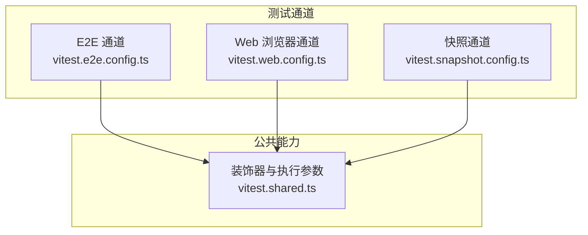
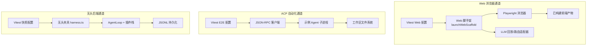
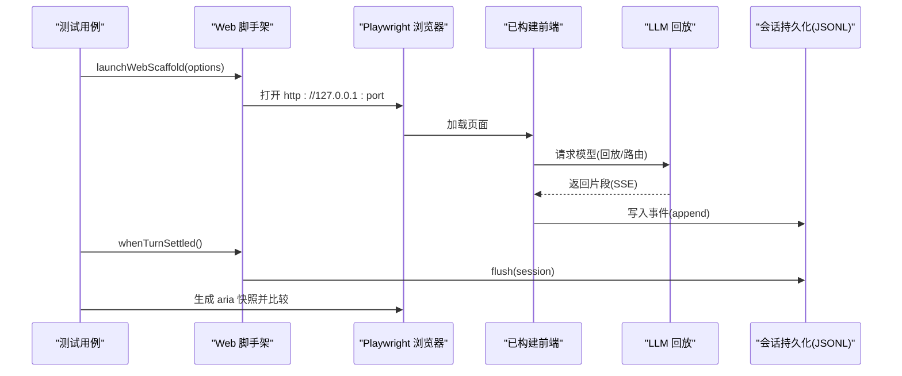
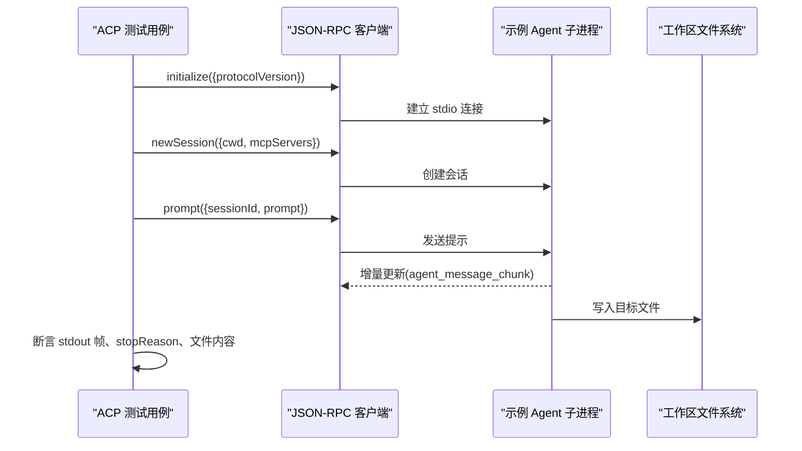
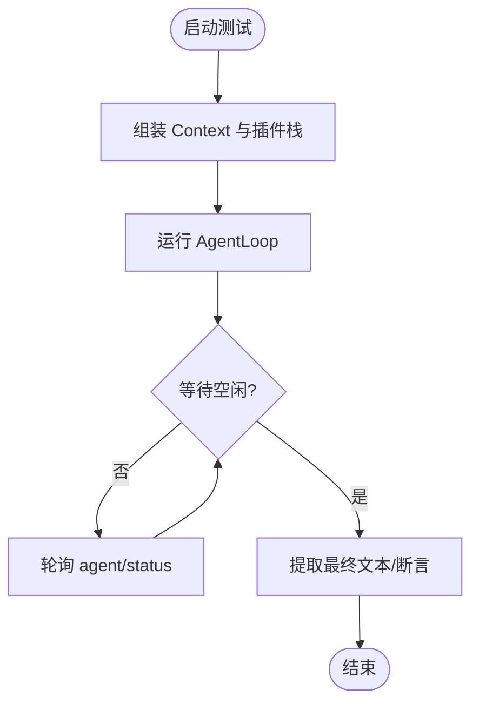
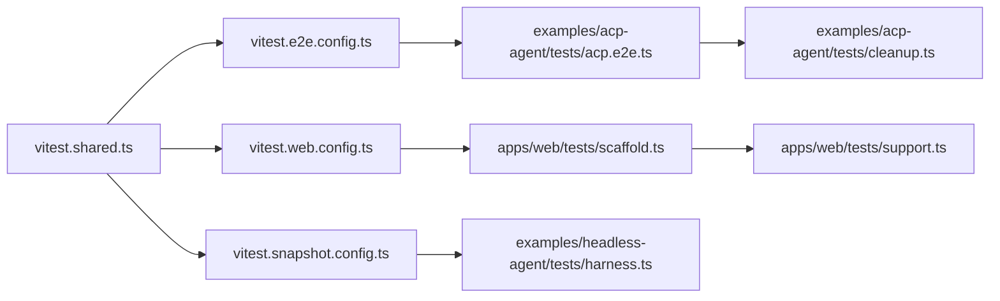

# 端到端测试

<cite>
**本文引用的文件**
- [vitest.e2e.config.ts](file://vitest.e2e.config.ts)
- [vitest.web.config.ts](file://vitest.web.config.ts)
- [vitest.snapshot.config.ts](file://vitest.snapshot.config.ts)
- [vitest.shared.ts](file://vitest.shared.ts)
- [scaffold.ts](file://apps/web/tests/scaffold.ts)
- [support.ts](file://apps/web/tests/support.ts)
- [acp.e2e.ts](file://examples/acp-agent/tests/acp.e2e.ts)
- [acp.snapshot.ts](file://examples/acp-agent/tests/acp.snapshot.ts)
- [cleanup.ts](file://examples/acp-agent/tests/cleanup.ts)
- [harness.ts](file://examples/headless-agent/tests/harness.ts)
- [built-boot.snapshot.ts](file://apps/web/tests/built-boot.snapshot.ts)
</cite>

## 目录
1. [简介](#简介)
2. [项目结构](#项目结构)
3. [核心组件](#核心组件)
4. [架构总览](#架构总览)
5. [详细组件分析](#详细组件分析)
6. [依赖关系分析](#依赖关系分析)
7. [性能考量](#性能考量)
8. [故障排查指南](#故障排查指南)
9. [结论](#结论)
10. [附录](#附录)

## 简介
本文件系统化梳理仓库的端到端（E2E）测试体系，覆盖三层关键场景：
- 浏览器快照测试：基于真实 Chromium 与 Playwright，驱动已构建的前端产物，通过会话回放实现“记录一次、回放永远”的关键无密钥用例。
- ACP 自动化场景：以真实子进程运行 Agent，通过 JSON-RPC 协议驱动会话，验证世界状态（文件系统）与输出一致性。
- 无头后端场景：使用 JSONL 测试驱动器与可插拔持久化，驱动完整插件栈进行无 UI 的回归与集成验证。

同时说明测试数据管理、固定装置组织、异步与状态同步策略、调试技巧以及 CI 门禁规则。

## 项目结构
E2E 测试按“通道/车道”划分，由多个 Vitest 配置分别驱动：
- 通用 E2E 通道：包含 packages/*/tests、apps/cli/tests、examples/*/tests 下的 e2e 用例，默认并行度可控，适合调用真实 API 的用例。
- Web 浏览器通道：仅包含 apps/web/tests 下的 e2e 与 snapshot 用例，串行执行共享一个浏览器实例，超时更长。
- 快照通道：统一收集 scripts、cli、examples 等 snapshot 用例，支持 replay/record/refresh 三种模式；replay 默认并行，record/refresh 串行以避免竞争写。

图表来源
- [vitest.e2e.config.ts:31-57](file://vitest.e2e.config.ts#L31-L57)
- [vitest.web.config.ts:16-35](file://vitest.web.config.ts#L16-L35)
- [vitest.snapshot.config.ts:39-67](file://vitest.snapshot.config.ts#L39-L67)
- [vitest.shared.ts:1-43](file://vitest.shared.ts#L1-L43)

章节来源
- [vitest.e2e.config.ts:1-59](file://vitest.e2e.config.ts#L1-L59)
- [vitest.web.config.ts:1-36](file://vitest.web.config.ts#L1-L36)
- [vitest.snapshot.config.ts:1-69](file://vitest.snapshot.config.ts#L1-L69)
- [vitest.shared.ts:1-43](file://vitest.shared.ts#L1-L43)

## 核心组件
- Web 浏览器脚手架：启动真实 web 组合（dsh-base + dsh-web-app），注入临时工作区、持久化根、隔离 DSH_HOME，并在非 record 模式下挂载 LLM 回放或路由适配器；提供 whenTurnSettled 等待 turn/end 并 flush 会话；提供 fixture 录制与种子注入工具。
- Web 支撑库：提供页面创建、语言设置、端口探测、失败截图、工作区连接辅助等。
- ACP 测试夹具与清理：以真实子进程运行示例 Agent，通过 JSON-RPC 驱动 initialize/newSession/prompt，断言 stdout 纯净性与磁盘结果；统一清理子进程与工作目录。
- 无头后端测试夹具：组装 AgentLoop、LLM、Bash、Tool、Compaction、JSONL 持久化等插件，提供等待空闲与最终文本提取工具。
- 构建产物引导快照：在 jsdom 中加载已构建前端产物，验证插件图装配、样式注入与关键交互渲染。

章节来源
- [scaffold.ts:85-278](file://apps/web/tests/scaffold.ts#L85-L278)
- [scaffold.ts:294-626](file://apps/web/tests/scaffold.ts#L294-L626)
- [support.ts:1-136](file://apps/web/tests/support.ts#L1-L136)
- [acp.e2e.ts:14-127](file://examples/acp-agent/tests/acp.e2e.ts#L14-L127)
- [cleanup.ts:1-24](file://examples/acp-agent/tests/cleanup.ts#L1-L24)
- [harness.ts:19-105](file://examples/headless-agent/tests/harness.ts#L19-L105)
- [built-boot.snapshot.ts:1-106](file://apps/web/tests/built-boot.snapshot.ts#L1-L106)

## 架构总览
下图展示三类 E2E 通道的协作关系与数据流：

图表来源
- [vitest.web.config.ts:16-35](file://vitest.web.config.ts#L16-L35)
- [vitest.e2e.config.ts:31-57](file://vitest.e2e.config.ts#L31-L57)
- [vitest.snapshot.config.ts:39-67](file://vitest.snapshot.config.ts#L39-L67)
- [scaffold.ts:294-626](file://apps/web/tests/scaffold.ts#L294-L626)
- [acp.e2e.ts:14-127](file://examples/acp-agent/tests/acp.e2e.ts#L14-L127)
- [harness.ts:19-105](file://examples/headless-agent/tests/harness.ts#L19-L105)

## 详细组件分析

### Web 浏览器快照测试（Chromium 配置与截图比较）
- 启动方式：通过脚手架 launchWebScaffold 启动真实 web 组合，绑定到随机端口，暴露 baseUrl；在非 record 模式下安装 LLM 回放或仅提供路由的适配器，确保无密钥稳定运行。
- 回放机制：通过 session.jsonl 回放模型响应，支持 child fixtures、override 文件、分块 pacing；提供 whenTurnSettled 等待 turn/end 并 flush 会话，保证持久化完成后再做断言。
- 截图比较：使用 Playwright 的 aria 快照；脚手架对快照进行归一化（UUID、cwd、耗时、吞吐等不稳定字段替换为占位符），确保跨机器/跨版本稳定。
- 录制与刷新：record 模式需要 DEEPSEEK_API_KEY，会采集实时会话并写入 fixture；refresh 模式在无密钥下重放并更新当前期望输出。

图表来源
- [scaffold.ts:294-626](file://apps/web/tests/scaffold.ts#L294-L626)
- [scaffold.ts:628-776](file://apps/web/tests/scaffold.ts#L628-L776)
- [support.ts:30-88](file://apps/web/tests/support.ts#L30-L88)

章节来源
- [scaffold.ts:85-278](file://apps/web/tests/scaffold.ts#L85-L278)
- [scaffold.ts:294-626](file://apps/web/tests/scaffold.ts#L294-L626)
- [scaffold.ts:628-776](file://apps/web/tests/scaffold.ts#L628-L776)
- [support.ts:1-136](file://apps/web/tests/support.ts#L1-L136)

### ACP 自动化场景（会话回放与 JSON-RPC 输出验证）
- 子进程驱动：以真实子进程运行示例 Agent，通过 JSON-RPC 客户端发送 initialize/newSession/prompt。
- 输出验证：断言 stdout 仅包含 JSON-RPC 帧；断言 prompt 完成后 stopReason 合法；独立检查工作区文件是否被 Agent 写入（如 proof.txt）。
- 清理策略：afterEach 统一关闭子进程并删除工作目录，聚合所有清理失败以便定位问题。

图表来源
- [acp.e2e.ts:14-127](file://examples/acp-agent/tests/acp.e2e.ts#L14-L127)
- [cleanup.ts:1-24](file://examples/acp-agent/tests/cleanup.ts#L1-L24)

章节来源
- [acp.e2e.ts:14-127](file://examples/acp-agent/tests/acp.e2e.ts#L14-L127)
- [cleanup.ts:1-24](file://examples/acp-agent/tests/cleanup.ts#L1-L24)

### 无头后端场景（JSONL 测试驱动器与插件栈）
- 夹具组装：mountAgentLoopTestDependencies 挂载系统提示、AgentLoop、LLM、本地 Bash、Todo 工具、可选 TokenMeter/压缩引擎、JSONL 持久化与检查点策略。
- 同步与断言：waitForIdle 监听 agent/status 为 idle；finalText 从 SessionEvent 中提取最终助手消息文本。
- 适用场景：无需浏览器，快速验证后端逻辑、工具链与持久化行为。

图表来源
- [harness.ts:19-105](file://examples/headless-agent/tests/harness.ts#L19-L105)

章节来源
- [harness.ts:19-105](file://examples/headless-agent/tests/harness.ts#L19-L105)

### 构建产物引导快照（JS DOM 环境）
- 目的：在不启动浏览器的情况下，验证已构建前端产物的插件图装配、CSS 注入与关键交互渲染路径。
- 关键点：通过 installAssembledBootEnv 与 mountAssembledApp 进入产品装配流程，断言树形会话、等待回答、上下文面板、差异卡片与 WebRow 渲染。

章节来源
- [built-boot.snapshot.ts:1-106](file://apps/web/tests/built-boot.snapshot.ts#L1-L106)

## 依赖关系分析
- 通道配置依赖公共装饰器与执行参数，确保 TypeScript 装饰器正确转译与 Node 环境标志一致。
- Web 脚手架依赖 Cordis 插件加载、Include/Group、应用引导、会话存储、LLM 回放与设置/凭据行；通过补丁覆盖 shipped 组合，保持与产品一致的装配顺序。
- ACP 测试依赖 @deepseek-ai/dsh-acp-snapshot 提供的启动与清理能力，配合示例 Agent 的 cordis.yml 与 tsconfig。
- 无头夹具依赖 AgentLoop 测试套件、本地 Bash 执行器、JSONL 持久化与压缩相关插件。

图表来源
- [vitest.shared.ts:1-43](file://vitest.shared.ts#L1-L43)
- [vitest.e2e.config.ts:31-57](file://vitest.e2e.config.ts#L31-L57)
- [vitest.web.config.ts:16-35](file://vitest.web.config.ts#L16-L35)
- [vitest.snapshot.config.ts:39-67](file://vitest.snapshot.config.ts#L39-L67)
- [scaffold.ts:294-626](file://apps/web/tests/scaffold.ts#L294-L626)
- [support.ts:1-136](file://apps/web/tests/support.ts#L1-L136)
- [acp.e2e.ts:14-127](file://examples/acp-agent/tests/acp.e2e.ts#L14-L127)
- [cleanup.ts:1-24](file://examples/acp-agent/tests/cleanup.ts#L1-L24)
- [harness.ts:19-105](file://examples/headless-agent/tests/harness.ts#L19-L105)

章节来源
- [vitest.shared.ts:1-43](file://vitest.shared.ts#L1-L43)
- [vitest.e2e.config.ts:1-59](file://vitest.e2e.config.ts#L1-L59)
- [vitest.web.config.ts:1-36](file://vitest.web.config.ts#L1-L36)
- [vitest.snapshot.config.ts:1-69](file://vitest.snapshot.config.ts#L1-L69)
- [scaffold.ts:294-626](file://apps/web/tests/scaffold.ts#L294-L626)
- [support.ts:1-136](file://apps/web/tests/support.ts#L1-L136)
- [acp.e2e.ts:14-127](file://examples/acp-agent/tests/acp.e2e.ts#L14-L127)
- [cleanup.ts:1-24](file://examples/acp-agent/tests/cleanup.ts#L1-L24)
- [harness.ts:19-105](file://examples/headless-agent/tests/harness.ts#L19-L105)

## 性能考量
- 并发控制：E2E 通道默认最大工作进程数可通过环境变量调整；Web 通道串行执行以共享浏览器；快照通道在 replay 模式下可按 CPU 并行度限制并发，record/refresh 串行避免竞争写。
- 超时与重试：E2E 与 Web 通道均提高超时阈值，E2E 启用重试以缓解瞬时抖动；Web 通道 hookTimeout 也相应提升。
- 资源隔离：Web 脚手架使用临时工作区与持久化根，隔离 DSH_HOME，避免污染用户环境；ACP 测试使用临时目录并严格清理。

章节来源
- [vitest.e2e.config.ts:16-57](file://vitest.e2e.config.ts#L16-L57)
- [vitest.web.config.ts:24-35](file://vitest.web.config.ts#L24-L35)
- [vitest.snapshot.config.ts:6-22](file://vitest.snapshot.config.ts#L6-L22)
- [vitest.snapshot.config.ts:55-67](file://vitest.snapshot.config.ts#L55-L67)
- [scaffold.ts:320-363](file://apps/web/tests/scaffold.ts#L320-L363)

## 故障排查指南
- 浏览器快照不一致：确认 DSH_SNAPSHOT=replay；若需更新期望输出，使用 refresh 模式并审查 diff；注意 Playwright 版本升级可能带来快照格式变化。
- Web 脚手架报错：检查是否缺少 DEEPSEEK_API_KEY（record 模式必需）；确认已构建前端产物存在；查看 whenTurnSettled 超时原因。
- ACP 子进程异常：检查 stdout 是否仅含 JSON-RPC 帧；确认工作区权限与工具可用性；使用 cleanup 聚合错误信息定位子进程退出码与目录残留。
- 无头后端空闲等待：确认 waitForIdle 触发条件；检查 AgentLoop 状态事件；必要时增加超时或打印中间日志。
- 清理失败：各通道均在 teardown 阶段聚合清理错误，优先关注 AggregateError 中的首个失败原因。

章节来源
- [scaffold.ts:294-363](file://apps/web/tests/scaffold.ts#L294-L363)
- [scaffold.ts:592-626](file://apps/web/tests/scaffold.ts#L592-L626)
- [support.ts:112-121](file://apps/web/tests/support.ts#L112-L121)
- [acp.e2e.ts:42-97](file://examples/acp-agent/tests/acp.e2e.ts#L42-L97)
- [cleanup.ts:11-23](file://examples/acp-agent/tests/cleanup.ts#L11-L23)
- [harness.ts:86-105](file://examples/headless-agent/tests/harness.ts#L86-L105)

## 结论
该 E2E 体系通过分层通道与回放机制，实现了高稳定性、可复现且低成本的端到端验证：
- Web 浏览器通道以真实 Chromium 与回放脚本保障 UI 回归成本最小化。
- ACP 通道以 JSON-RPC 与文件系统断言确保 Agent 行为与外部效果一致。
- 无头后端通道以插件栈与 JSONL 持久化验证核心逻辑与工具链。
结合严格的并发控制、超时与重试策略、隔离环境与完善的清理机制，可在本地与 CI 中高效运行并可靠发现回归。

## 附录

### 测试数据管理与固定装置组织
- Web 回放固定装置：session.jsonl 存放于 snapshots/<scenario>/，fixtureUserPrompts 与 realizeSeedFixture 提供解析与占位符替换；seedSession 通过真实后端写入持久化根。
- ACP 固定装置：每个 scenario 对应 snapshots/<name>/，支持 pinsHeader/headerClass/systemPromptSource/toolSchemasSource 等侧车与头部固定；prepareWorkspace 用于准备确定性工作区。
- 无头后端：可选 JSONL 持久化根用于 resume 场景；其他场景保持无文件。

章节来源
- [scaffold.ts:628-776](file://apps/web/tests/scaffold.ts#L628-L776)
- [acp.snapshot.ts:111-131](file://examples/acp-agent/tests/acp.snapshot.ts#L111-L131)
- [acp.snapshot.ts:133-621](file://examples/acp-agent/tests/acp.snapshot.ts#L133-L621)
- [harness.ts:56-83](file://examples/headless-agent/tests/harness.ts#L56-L83)

### 异步操作与状态同步
- Web 通道：whenTurnSettled 监听 session/event 的 turn/end，随后 flush 会话，确保持久化完成再断言。
- ACP 通道：initialize/newSession/prompt 顺序调用，updates 仅包含 committed assistant 文本；世界状态（文件）作为最终证据。
- 无头后端：waitForIdle 监听 agent/status 为 idle；finalText 从事件序列提取最终文本。

章节来源
- [scaffold.ts:592-606](file://apps/web/tests/scaffold.ts#L592-L606)
- [acp.e2e.ts:100-127](file://examples/acp-agent/tests/acp.e2e.ts#L100-L127)
- [harness.ts:86-105](file://examples/headless-agent/tests/harness.ts#L86-L105)

### 持续集成中的 E2E 测试流程与门禁规则
- Web 浏览器通道在 Linux PR CI 中以 DSH_SNAPSHOT=replay 运行，比较已提交的期望输出；不执行 record/refresh，避免静默改写。
- 快照通道在 replay 模式下并行执行，record/refresh 串行；E2E 通道支持可调并发，便于本地与 CI 平衡资源。
- 浏览器产物构建前置：web 测试前需构建前端产物，否则直接失败，防止测试旧包。

章节来源
- [vitest.web.config.ts:5-8](file://vitest.web.config.ts#L5-L8)
- [vitest.snapshot.config.ts:24-37](file://vitest.snapshot.config.ts#L24-L37)
- [vitest.snapshot.config.ts:55-67](file://vitest.snapshot.config.ts#L55-L67)
- [vitest.e2e.config.ts:46-57](file://vitest.e2e.config.ts#L46-L57)
- [support.ts:34-39](file://apps/web/tests/support.ts#L34-L39)