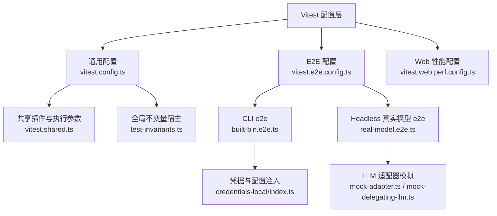
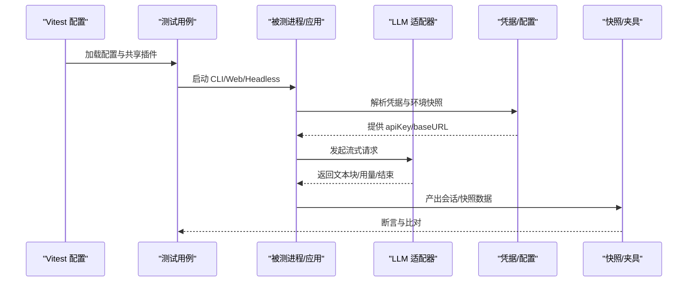
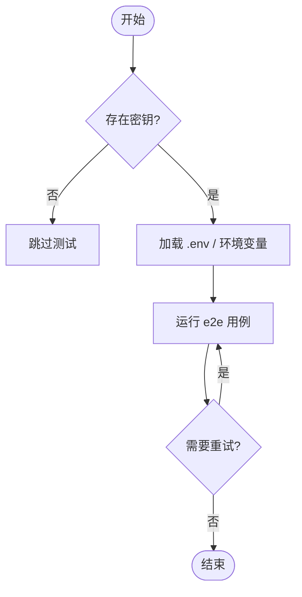
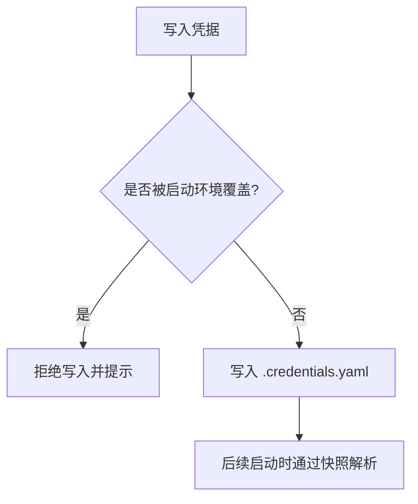
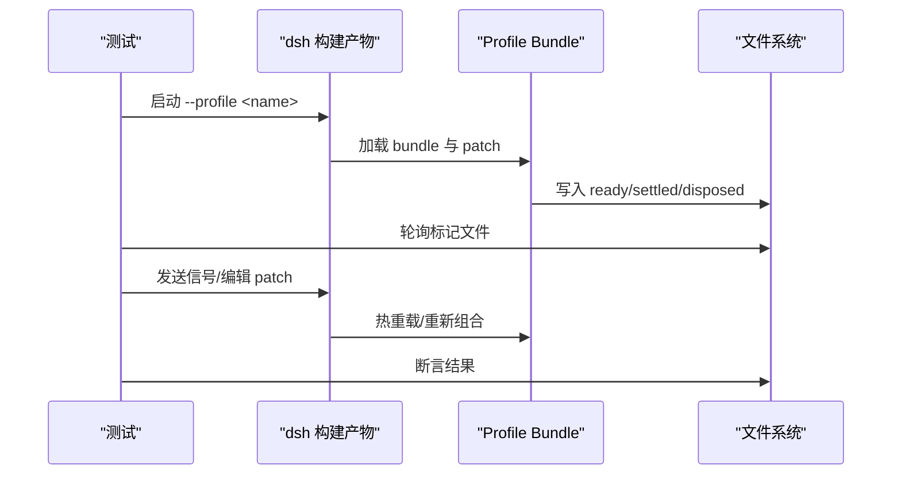
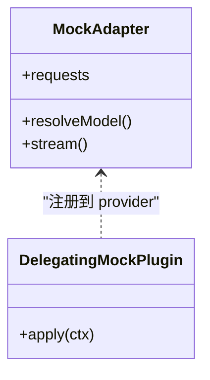
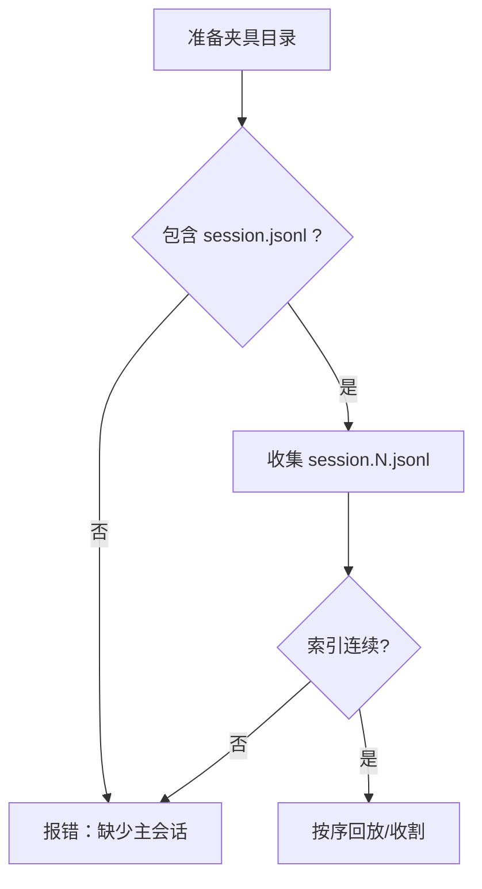
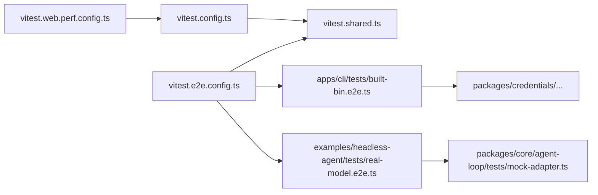

# 集成测试

<cite>
**本文引用的文件**
- [vitest.config.ts](file://vitest.config.ts)
- [vitest.e2e.config.ts](file://vitest.e2e.config.ts)
- [vitest.shared.ts](file://vitest.shared.ts)
- [scripts/test-invariants.ts](file://scripts/test-invariants.ts)
- [apps/cli/tests/built-bin.e2e.ts](file://apps/cli/tests/built-bin.e2e.ts)
- [examples/headless-agent/tests/real-model.e2e.ts](file://examples/headless-agent/tests/real-model.e2e.ts)
- [packages/core/agent-loop/tests/mock-adapter.ts](file://packages/core/agent-loop/tests/mock-adapter.ts)
- [examples/jsonrpc-agent/tests/fixtures/subagent/subagent-dsh-sdk/mock-delegating-llm.ts](file://examples/jsonrpc-agent/tests/fixtures/subagent/subagent-dsh-sdk/mock-delegating-llm.ts)
- [examples/acp-agent/tests/fixtures/subagent/subagent-acp/mock-delegating-llm.ts](file://examples/acp-agent/tests/fixtures/subagent/subagent-acp/mock-delegating-llm.ts)
- [packages/test-support/client-runtime/src/sessions.ts](file://packages/test-support/client-runtime/src/sessions.ts)
- [packages/test-support/acp-snapshot/src/suite.ts](file://packages/test-support/acp-snapshot/src/suite.ts)
- [scripts/session-fixture-layout.snapshot.ts](file://scripts/session-fixture-layout.snapshot.ts)
- [scripts/test-fixture-cleanup.ts](file://scripts/test-fixture-cleanup.ts)
- [apps/web/tests/scaffold.ts](file://apps/web/tests/scaffold.ts)
- [vitest.web.perf.config.ts](file://vitest.web.perf.config.ts)
- [scripts/verify-config-source-ownership.ts](file://scripts/verify-config-source-ownership.ts)
- [packages/credentials/credentials-local/src/index.ts](file://packages/credentials/credentials-local/src/index.ts)
</cite>

## 目录
1. [简介](#简介)
2. [项目结构](#项目结构)
3. [核心组件](#核心组件)
4. [架构总览](#架构总览)
5. [详细组件分析](#详细组件分析)
6. [依赖关系分析](#依赖关系分析)
7. [性能考虑](#性能考虑)
8. [故障排查指南](#故障排查指南)
9. [结论](#结论)
10. [附录](#附录)

## 简介
本文件面向“真实 API 调用、密钥管理、自动跳过、插件组合与 Cordis 配置加载、外部依赖模拟（LLM 适配器、网络、文件系统）、测试环境设置与清理、协议级消息验证、性能与优化”的集成测试实践。仓库采用多套 Vitest 配置将不同性质的测试隔离：单元/线程安全测试、进程绑定测试、端到端真实 API 测试、Web 性能测试等，并通过共享工具与夹具实现可重复、可观测、可维护的集成测试体系。

## 项目结构
- 多配置分层
  - 通用单元测试与覆盖率：[vitest.config.ts](file://vitest.config.ts)
  - 真实 API 端到端：[vitest.e2e.config.ts](file://vitest.e2e.config.ts)
  - Web 性能：[vitest.web.perf.config.ts](file://vitest.web.perf.config.ts)
  - 共享装饰器与执行参数：[vitest.shared.ts](file://vitest.shared.ts)
- 测试入口与用例
  - CLI 构建产物 e2e：[apps/cli/tests/built-bin.e2e.ts](file://apps/cli/tests/built-bin.e2e.ts)
  - Headless 真实模型 e2e：[examples/headless-agent/tests/real-model.e2e.ts](file://examples/headless-agent/tests/real-model.e2e.ts)
- 测试支撑
  - 全局不变量宿主：[scripts/test-invariants.ts](file://scripts/test-invariants.ts)
  - 客户端会话夹具：[packages/test-support/client-runtime/src/sessions.ts](file://packages/test-support/client-runtime/src/sessions.ts)
  - ACP 快照套件：[packages/test-support/acp-snapshot/src/suite.ts](file://packages/test-support/acp-snapshot/src/suite.ts)
  - 会话夹具布局校验：[scripts/session-fixture-layout.snapshot.ts](file://scripts/session-fixture-layout.snapshot.ts)
  - 夹具清理：[scripts/test-fixture-cleanup.ts](file://scripts/test-fixture-cleanup.ts)
  - Web 脚手架与占位符替换：[apps/web/tests/scaffold.ts](file://apps/web/tests/scaffold.ts)
- 质量门禁
  - 配置来源所有权校验：[scripts/verify-config-source-ownership.ts](file://scripts/verify-config-source-ownership.ts)
  - 凭据存储行为：[packages/credentials/credentials-local/src/index.ts](file://packages/credentials/credentials-local/src/index.ts)

**图表来源**
- [vitest.config.ts:117-159](file://vitest.config.ts#L117-L159)
- [vitest.e2e.config.ts:31-57](file://vitest.e2e.config.ts#L31-L57)
- [vitest.shared.ts:15-42](file://vitest.shared.ts#L15-L42)
- [apps/cli/tests/built-bin.e2e.ts:312-395](file://apps/cli/tests/built-bin.e2e.ts#L312-L395)
- [examples/headless-agent/tests/real-model.e2e.ts:12-33](file://examples/headless-agent/tests/real-model.e2e.ts#L12-L33)
- [packages/core/agent-loop/tests/mock-adapter.ts:58-88](file://packages/core/agent-loop/tests/mock-adapter.ts#L58-L88)
- [packages/credentials/credentials-local/src/index.ts:405-435](file://packages/credentials/credentials-local/src/index.ts#L405-L435)

**章节来源**
- [vitest.config.ts:117-159](file://vitest.config.ts#L117-L159)
- [vitest.e2e.config.ts:31-57](file://vitest.e2e.config.ts#L31-L57)
- [vitest.shared.ts:15-42](file://vitest.shared.ts#L15-L42)

## 核心组件
- 多项目与池化策略
  - 线程安全与进程绑定两类项目分离运行，避免进程级状态互相污染；对 Windows 平台进行包与测试集排除；按平台启用覆盖豁免。
  - 参考：[vitest.config.ts:117-159](file://vitest.config.ts#L117-L159)
- 真实 API 端到端配置
  - 单独配置文件加载根目录 .env；超时与重试放宽；并发工作进程数由环境变量控制；仅包含 e2e 文件。
  - 参考：[vitest.e2e.config.ts:1-57](file://vitest.e2e.config.ts#L1-L57)
- 共享装饰器与执行参数
  - 预转换 TypeScript 装饰器；为 Node 环境关闭 webstorage 标志以避免 jsdom 冲突。
  - 参考：[vitest.shared.ts:1-42](file://vitest.shared.ts#L1-L42)
- 全局不变量宿主
  - 在测试启动时挂载 InvariantRegistry 与每个包的 companion，确保所有服务在活跃前完成检查；拦截插件注册以加入就绪屏障。
  - 参考：[scripts/test-invariants.ts:1-274](file://scripts/test-invariants.ts#L1-L274)

**章节来源**
- [vitest.config.ts:117-159](file://vitest.config.ts#L117-L159)
- [vitest.e2e.config.ts:1-57](file://vitest.e2e.config.ts#L1-L57)
- [vitest.shared.ts:1-42](file://vitest.shared.ts#L1-L42)
- [scripts/test-invariants.ts:1-274](file://scripts/test-invariants.ts#L1-L274)

## 架构总览
下图展示从测试配置到被测进程、LLM 适配与凭据/配置的完整链路，以及关键门控点。

**图表来源**
- [vitest.e2e.config.ts:31-57](file://vitest.e2e.config.ts#L31-L57)
- [apps/cli/tests/built-bin.e2e.ts:370-395](file://apps/cli/tests/built-bin.e2e.ts#L370-L395)
- [packages/credentials/credentials-local/src/index.ts:405-435](file://packages/credentials/credentials-local/src/index.ts#L405-L435)
- [packages/core/agent-loop/tests/mock-adapter.ts:58-88](file://packages/core/agent-loop/tests/mock-adapter.ts#L58-L88)
- [packages/test-support/acp-snapshot/src/suite.ts:323-352](file://packages/test-support/acp-snapshot/src/suite.ts#L323-L352)

## 详细组件分析

### 真实 API 调用与自动跳过机制
- 设计要点
  - 使用独立 e2e 配置，仅在具备凭据时运行；通过环境变量或根 .env 注入密钥；无密钥时测试自跳过，保证 CI keyless 绿色。
  - 超时与重试宽松，限制并发工作进程数以规避配额限制。
- 关键实现
  - 加载 .env 并读取最大工作进程数：[vitest.e2e.config.ts:1-29](file://vitest.e2e.config.ts#L1-L29)
  - 包含 e2e 文件、设置超时/重试/并发：[vitest.e2e.config.ts:31-57](file://vitest.e2e.config.ts#L31-L57)
  - 示例：headless 真实模型测试在缺少密钥时跳过：[examples/headless-agent/tests/real-model.e2e.ts:12-13](file://examples/headless-agent/tests/real-model.e2e.ts#L12-L13)
- 最佳实践
  - 将密钥放入受保护的 CI 密钥库；本地开发可使用 .env；测试内不要硬编码密钥。
  - 对网络抖动与限流使用 retry；必要时降低并发。

**图表来源**
- [vitest.e2e.config.ts:1-29](file://vitest.e2e.config.ts#L1-L29)
- [vitest.e2e.config.ts:31-57](file://vitest.e2e.config.ts#L31-L57)
- [examples/headless-agent/tests/real-model.e2e.ts:12-13](file://examples/headless-agent/tests/real-model.e2e.ts#L12-L13)

**章节来源**
- [vitest.e2e.config.ts:1-57](file://vitest.e2e.config.ts#L1-L57)
- [examples/headless-agent/tests/real-model.e2e.ts:12-33](file://examples/headless-agent/tests/real-model.e2e.ts#L12-L33)

### 密钥管理与配置来源所有权
- 设计要点
  - 凭据通过专用存储与运行时快照解析，禁止在已交付配置中直接内联环境变量值，确保部署层可控。
  - 写入凭据时若被启动环境覆盖则拒绝，防止静默失效。
- 关键实现
  - 配置来源所有权校验脚本扫描 shipped 配置，禁止内联 apiKey/baseURL/headers 的环境变量形式：[scripts/verify-config-source-ownership.ts:25-56](file://scripts/verify-config-source-ownership.ts#L25-L56)
  - 凭据提供者拒绝被继承环境覆盖的写操作：[packages/credentials/credentials-local/src/index.ts:405-417](file://packages/credentials/credentials-local/src/index.ts#L405-L417)
  - 初始加载失败时抛出错误而非静默忽略：[packages/credentials/credentials-local/src/index.ts:419-435](file://packages/credentials/credentials-local/src/index.ts#L419-L435)
- 最佳实践
  - 使用 CI 密钥注入；本地通过 .credentials.yaml 管理；不要在 shipped 配置中写死密钥或 endpoint。

**图表来源**
- [packages/credentials/credentials-local/src/index.ts:405-435](file://packages/credentials/credentials-local/src/index.ts#L405-L435)
- [scripts/verify-config-source-ownership.ts:25-56](file://scripts/verify-config-source-ownership.ts#L25-L56)

**章节来源**
- [scripts/verify-config-source-ownership.ts:25-56](file://scripts/verify-config-source-ownership.ts#L25-L56)
- [packages/credentials/credentials-local/src/index.ts:405-435](file://packages/credentials/credentials-local/src/index.ts#L405-L435)

### 插件组合与 Cordis 配置加载测试
- 设计要点
  - 通过 CLI 构建产物 e2e 验证 profile 生命周期、热重载、补丁叠加、帮助路由不触发启动行等。
  - 使用临时 DSH_HOME 与最小 bundle 构造自定义 profile，验证配置层顺序与生效。
- 关键实现
  - 启动构建产物、传递环境变量、断言输出与退出码：[apps/cli/tests/built-bin.e2e.ts:17-39](file://apps/cli/tests/built-bin.e2e.ts#L17-L39)
  - 创建自定义 profile 与 bundle，写入 cordis.patch.yml 与 package.json：[apps/cli/tests/built-bin.e2e.ts:62-132](file://apps/cli/tests/built-bin.e2e.ts#L62-L132)
  - 验证热重载与用户层覆盖：[apps/cli/tests/built-bin.e2e.ts:496-546](file://apps/cli/tests/built-bin.e2e.ts#L496-L546)
  - 验证帮助与用法错误不激活启动相关行：[apps/cli/tests/built-bin.e2e.ts:329-368](file://apps/cli/tests/built-bin.e2e.ts#L329-L368)
- 最佳实践
  - 使用临时目录隔离每次测试；通过文件标记（ready/settled/disposed）观察生命周期；信号驱动关闭。

**图表来源**
- [apps/cli/tests/built-bin.e2e.ts:62-132](file://apps/cli/tests/built-bin.e2e.ts#L62-L132)
- [apps/cli/tests/built-bin.e2e.ts:496-546](file://apps/cli/tests/built-bin.e2e.ts#L496-L546)
- [apps/cli/tests/built-bin.e2e.ts:329-368](file://apps/cli/tests/built-bin.e2e.ts#L329-L368)

**章节来源**
- [apps/cli/tests/built-bin.e2e.ts:17-39](file://apps/cli/tests/built-bin.e2e.ts#L17-L39)
- [apps/cli/tests/built-bin.e2e.ts:62-132](file://apps/cli/tests/built-bin.e2e.ts#L62-L132)
- [apps/cli/tests/built-bin.e2e.ts:329-368](file://apps/cli/tests/built-bin.e2e.ts#L329-L368)
- [apps/cli/tests/built-bin.e2e.ts:496-546](file://apps/cli/tests/built-bin.e2e.ts#L496-L546)

### 外部依赖模拟：LLM 适配器、网络与文件系统
- LLM 适配器模拟
  - 基于脚本驱动的 MockAdapter，记录请求并可模拟挂起/慢取消场景，用于 agent-loop 稳定性测试。
  - 参考：[packages/core/agent-loop/tests/mock-adapter.ts:58-88](file://packages/core/agent-loop/tests/mock-adapter.ts#L58-L88)
  - 示例插件将 mock 适配器注册到 provider：[examples/jsonrpc-agent/tests/fixtures/subagent/subagent-dsh-sdk/mock-delegating-llm.ts:39-48](file://examples/jsonrpc-agent/tests/fixtures/subagent/subagent-dsh-sdk/mock-delegating-llm.ts#L39-L48)、[examples/acp-agent/tests/fixtures/subagent/subagent-acp/mock-delegating-llm.ts:39-48](file://examples/acp-agent/tests/fixtures/subagent/subagent-acp/mock-delegating-llm.ts#L39-L48)
- 网络请求模拟
  - 使用内置 mock server 替代真实 LLM 端点，断言路径、头部与请求体，避免消耗 token。
  - 参考：[apps/cli/tests/built-bin.e2e.ts:370-395](file://apps/cli/tests/built-bin.e2e.ts#L370-L395)
- 文件系统操作模拟
  - 使用临时目录与 fixture 树；Windows 下先 unlink 再递归删除，避免 junction 导致误删仓库文件。
  - 参考：[scripts/test-fixture-cleanup.ts:36-49](file://scripts/test-fixture-cleanup.ts#L36-L49)

**图表来源**
- [packages/core/agent-loop/tests/mock-adapter.ts:58-88](file://packages/core/agent-loop/tests/mock-adapter.ts#L58-L88)
- [examples/jsonrpc-agent/tests/fixtures/subagent/subagent-dsh-sdk/mock-delegating-llm.ts:39-48](file://examples/jsonrpc-agent/tests/fixtures/subagent/subagent-dsh-sdk/mock-delegating-llm.ts#L39-L48)
- [examples/acp-agent/tests/fixtures/subagent/subagent-acp/mock-delegating-llm.ts:39-48](file://examples/acp-agent/tests/fixtures/subagent/subagent-acp/mock-delegating-llm.ts#L39-L48)

**章节来源**
- [packages/core/agent-loop/tests/mock-adapter.ts:58-88](file://packages/core/agent-loop/tests/mock-adapter.ts#L58-L88)
- [examples/jsonrpc-agent/tests/fixtures/subagent/subagent-dsh-sdk/mock-delegating-llm.ts:39-48](file://examples/jsonrpc-agent/tests/fixtures/subagent/subagent-dsh-sdk/mock-delegating-llm.ts#L39-L48)
- [examples/acp-agent/tests/fixtures/subagent/subagent-acp/mock-delegating-llm.ts:39-48](file://examples/acp-agent/tests/fixtures/subagent/subagent-acp/mock-delegating-llm.ts#L39-L48)
- [apps/cli/tests/built-bin.e2e.ts:370-395](file://apps/cli/tests/built-bin.e2e.ts#L370-L395)
- [scripts/test-fixture-cleanup.ts:36-49](file://scripts/test-fixture-cleanup.ts#L36-L49)

### 测试数据的准备与管理策略
- 会话夹具与快照
  - 主会话 session.jsonl 与子会话 session.N.jsonl 必须连续编号；套件会校验并排序。
  - 参考：[packages/test-support/acp-snapshot/src/suite.ts:323-352](file://packages/test-support/acp-snapshot/src/suite.ts#L323-L352)
- 仓库级布局校验
  - 校验所有 JSONL 夹具遵循规范布局，否则强制迁移。
  - 参考：[scripts/session-fixture-layout.snapshot.ts:1-17](file://scripts/session-fixture-layout.snapshot.ts#L1-L17)
- Web 测试占位符替换
  - 支持 {{sessionId}}、{{cwd}} 等占位符替换，便于生成可复现实验数据。
  - 参考：[apps/web/tests/scaffold.ts:700-711](file://apps/web/tests/scaffold.ts#L700-L711)
- 客户端会话夹具
  - FixtureSession 将 ISession 方法委派给夹具，未声明的行为会显式失败，避免半工作假象。
  - 参考：[packages/test-support/client-runtime/src/sessions.ts:18-30](file://packages/test-support/client-runtime/src/sessions.ts#L18-L30)

**图表来源**
- [packages/test-support/acp-snapshot/src/suite.ts:323-352](file://packages/test-support/acp-snapshot/src/suite.ts#L323-L352)

**章节来源**
- [packages/test-support/acp-snapshot/src/suite.ts:323-352](file://packages/test-support/acp-snapshot/src/suite.ts#L323-L352)
- [scripts/session-fixture-layout.snapshot.ts:1-17](file://scripts/session-fixture-layout.snapshot.ts#L1-L17)
- [apps/web/tests/scaffold.ts:700-711](file://apps/web/tests/scaffold.ts#L700-L711)
- [packages/test-support/client-runtime/src/sessions.ts:18-30](file://packages/test-support/client-runtime/src/sessions.ts#L18-L30)

### 测试环境的设置与清理流程
- 设置
  - 通过 setupFiles 注入全局不变量宿主，确保各包 companion 在启动阶段完成检查。
  - 参考：[vitest.config.ts:117-123](file://vitest.config.ts#L117-L123)、[scripts/test-invariants.ts:158-209](file://scripts/test-invariants.ts#L158-L209)
- 清理
  - 使用安全的 fixture 清理函数，先 unlink 再递归删除，处理 Windows 句柄释放延迟。
  - 参考：[scripts/test-fixture-cleanup.ts:36-49](file://scripts/test-fixture-cleanup.ts#L36-L49)
- 进程绑定测试隔离
  - 将进程绑定测试放入独立项目，避免 worker 线程干扰。
  - 参考：[vitest.config.ts:103-115](file://vitest.config.ts#L103-L115)

**章节来源**
- [vitest.config.ts:117-123](file://vitest.config.ts#L117-L123)
- [scripts/test-invariants.ts:158-209](file://scripts/test-invariants.ts#L158-L209)
- [scripts/test-fixture-cleanup.ts:36-49](file://scripts/test-fixture-cleanup.ts#L36-L49)
- [vitest.config.ts:103-115](file://vitest.config.ts#L103-L115)

### 协议级别的测试与消息验证
- 设计要点
  - 通过会话 JSONL 夹具与规范化流程，验证消息序列、子会话顺序与内容一致性。
  - 使用属性测试与快照对比确保协议边界健壮。
- 关键实现
  - 会话夹具名称与顺序校验：[packages/test-support/acp-snapshot/src/suite.ts:323-352](file://packages/test-support/acp-snapshot/src/suite.ts#L323-L352)
  - 仓库级布局一致性校验：[scripts/session-fixture-layout.snapshot.ts:1-17](file://scripts/session-fixture-layout.snapshot.ts#L1-L17)
  - 客户端会话面通过夹具实现，未 stub 的方法显式失败，保障协议契约不被绕过：[packages/test-support/client-runtime/src/sessions.ts:18-30](file://packages/test-support/client-runtime/src/sessions.ts#L18-L30)

**章节来源**
- [packages/test-support/acp-snapshot/src/suite.ts:323-352](file://packages/test-support/acp-snapshot/src/suite.ts#L323-L352)
- [scripts/session-fixture-layout.snapshot.ts:1-17](file://scripts/session-fixture-layout.snapshot.ts#L1-L17)
- [packages/test-support/client-runtime/src/sessions.ts:18-30](file://packages/test-support/client-runtime/src/sessions.ts#L18-L30)

## 依赖关系分析
- 配置层依赖
  - vitest.config.ts 聚合 include/exclude、projects、coverage 阈值与平台差异。
  - vitest.e2e.config.ts 引入 shared 插件与 execArgv，定义 e2e 范围与并发。
  - vitest.web.perf.config.ts 复用 web 配置并扩展性能测试超时与包含规则。
- 运行时依赖
  - 测试用例依赖 test-invariants 提供的不变量宿主；CLI/Web/Headless 测试依赖凭据与配置解析；LLM 测试依赖 mock adapter 或真实模型。
- 潜在循环与耦合
  - 通过分项目与隔离进程避免循环；e2e 与 unit 解耦；fixture 与测试逻辑通过夹具接口松耦合。

**图表来源**
- [vitest.config.ts:117-159](file://vitest.config.ts#L117-L159)
- [vitest.e2e.config.ts:31-57](file://vitest.e2e.config.ts#L31-L57)
- [vitest.web.perf.config.ts:1-15](file://vitest.web.perf.config.ts#L1-L15)
- [apps/cli/tests/built-bin.e2e.ts:312-395](file://apps/cli/tests/built-bin.e2e.ts#L312-L395)
- [examples/headless-agent/tests/real-model.e2e.ts:12-33](file://examples/headless-agent/tests/real-model.e2e.ts#L12-L33)
- [packages/core/agent-loop/tests/mock-adapter.ts:58-88](file://packages/core/agent-loop/tests/mock-adapter.ts#L58-L88)

**章节来源**
- [vitest.config.ts:117-159](file://vitest.config.ts#L117-L159)
- [vitest.e2e.config.ts:31-57](file://vitest.e2e.config.ts#L31-L57)
- [vitest.web.perf.config.ts:1-15](file://vitest.web.perf.config.ts#L1-L15)

## 性能考虑
- 并发与超时
  - e2e 默认并发 4，可通过 DSH_E2E_MAX_WORKERS 调整；真实模型测试设置较长超时与重试。
  - 参考：[vitest.e2e.config.ts:16-57](file://vitest.e2e.config.ts#L16-L57)
- 覆盖与耗时
  - 单元覆盖严格 100% 但排除重型/浏览器专属代码；e2e 不纳入覆盖，避免拖慢。
  - 参考：[vitest.config.ts:160-283](file://vitest.config.ts#L160-L283)
- Web 性能测试
  - 独立配置提高超时与禁用控制台拦截，适合大规模历史回放与渲染压力测试。
  - 参考：[vitest.web.perf.config.ts:1-15](file://vitest.web.perf.config.ts#L1-L15)
- 建议
  - 使用 mock 替代真实 LLM；减少并发；拆分大用例；利用快照与夹具减少 IO。

[本节为通用指导，无需具体文件引用]

## 故障排查指南
- 常见失败定位
  - 凭据不可写：当启动环境覆盖时，写入会被拒绝；检查 shell 导出与 .credentials.yaml 权限。
  - 配置来源违规：shipped 配置中内联环境变量将被门禁报告；移除内联，交由适配器解析。
  - 夹具清理失败：Windows 下需先 unlink 再删除；确认清理函数被调用。
- 参考实现
  - 凭据写入保护：[packages/credentials/credentials-local/src/index.ts:405-417](file://packages/credentials/credentials-local/src/index.ts#L405-L417)
  - 配置来源所有权校验：[scripts/verify-config-source-ownership.ts:25-56](file://scripts/verify-config-source-ownership.ts#L25-L56)
  - 夹具安全清理：[scripts/test-fixture-cleanup.ts:36-49](file://scripts/test-fixture-cleanup.ts#L36-L49)

**章节来源**
- [packages/credentials/credentials-local/src/index.ts:405-417](file://packages/credentials/credentials-local/src/index.ts#L405-L417)
- [scripts/verify-config-source-ownership.ts:25-56](file://scripts/verify-config-source-ownership.ts#L25-L56)
- [scripts/test-fixture-cleanup.ts:36-49](file://scripts/test-fixture-cleanup.ts#L36-L49)

## 结论
该仓库通过分层配置、严格门禁与完善的夹具/模拟体系，实现了高可信的集成测试：真实 API 调用可开关、密钥与配置来源可控、插件组合与 Cordis 加载过程可观测、外部依赖可模拟、协议消息可验证、性能测试可独立运行。遵循本文实践可显著提升稳定性、可维护性与可观测性。

[本节为总结，无需具体文件引用]

## 附录
- 快速命令
  - 运行单元与覆盖：参考通用配置
  - 运行真实 API e2e：使用 e2e 配置并设置密钥
  - 运行 Web 性能：使用性能配置
- 参考文件
  - 配置与共享：[vitest.config.ts](file://vitest.config.ts)、[vitest.e2e.config.ts](file://vitest.e2e.config.ts)、[vitest.shared.ts](file://vitest.shared.ts)
  - 不变量宿主：[scripts/test-invariants.ts](file://scripts/test-invariants.ts)
  - CLI e2e：[apps/cli/tests/built-bin.e2e.ts](file://apps/cli/tests/built-bin.e2e.ts)
  - Headless 真实模型：[examples/headless-agent/tests/real-model.e2e.ts](file://examples/headless-agent/tests/real-model.e2e.ts)
  - LLM 模拟：[packages/core/agent-loop/tests/mock-adapter.ts](file://packages/core/agent-loop/tests/mock-adapter.ts)
  - 夹具与快照：[packages/test-support/acp-snapshot/src/suite.ts](file://packages/test-support/acp-snapshot/src/suite.ts)、[scripts/session-fixture-layout.snapshot.ts](file://scripts/session-fixture-layout.snapshot.ts)
  - 清理与安全：[scripts/test-fixture-cleanup.ts](file://scripts/test-fixture-cleanup.ts)
  - 凭据与配置门禁：[packages/credentials/credentials-local/src/index.ts](file://packages/credentials/credentials-local/src/index.ts)、[scripts/verify-config-source-ownership.ts](file://scripts/verify-config-source-ownership.ts)

[本节为附录，无需具体文件引用]