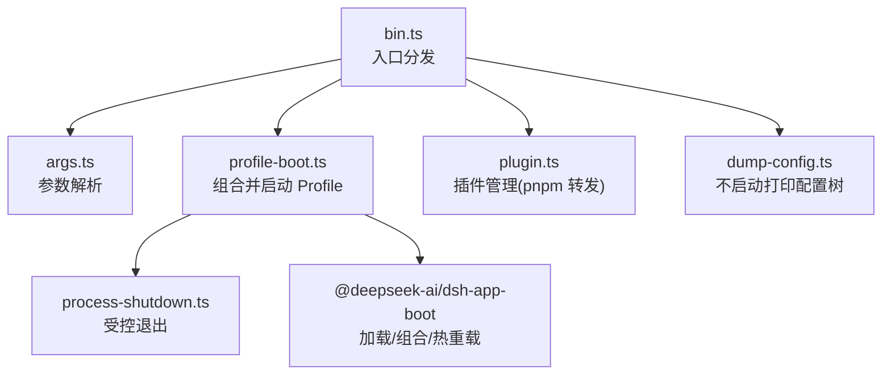
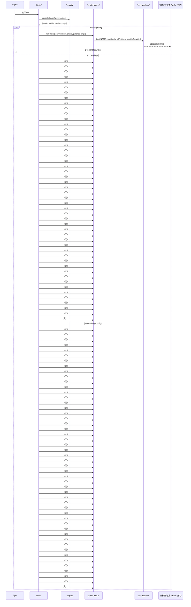
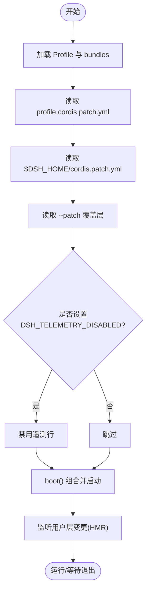
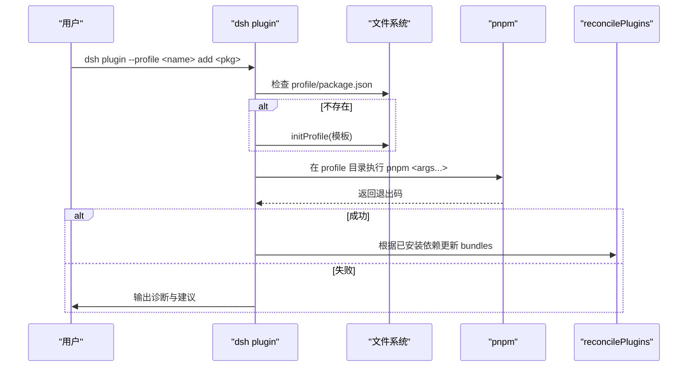
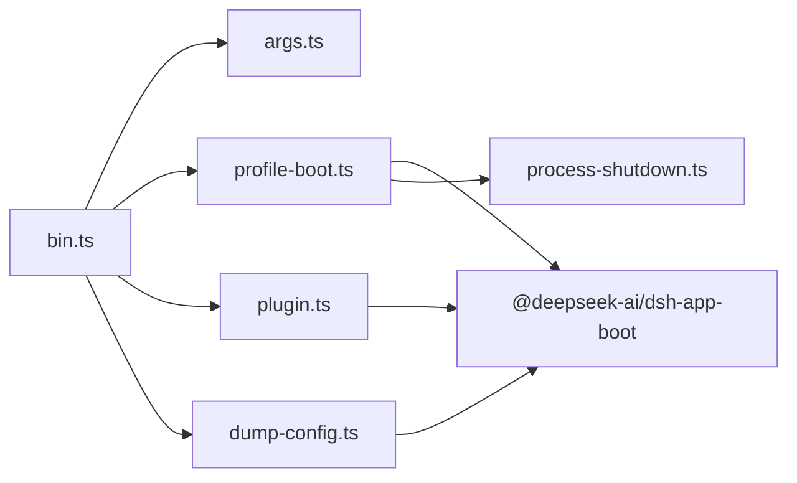
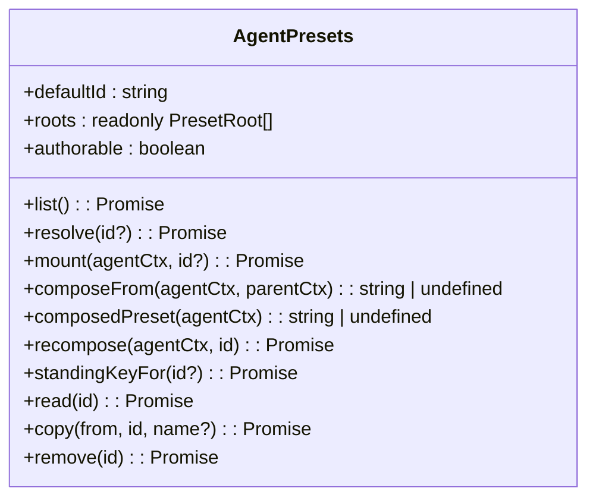

# CLI 接口

<cite>
**本文引用的文件**
- [apps/cli/src/bin.ts](file://apps/cli/src/bin.ts)
- [apps/cli/src/args.ts](file://apps/cli/src/args.ts)
- [apps/cli/src/plugin.ts](file://apps/cli/src/plugin.ts)
- [apps/cli/src/dump-config.ts](file://apps/cli/src/dump-config.ts)
- [apps/cli/src/profile-boot.ts](file://apps/cli/src/profile-boot.ts)
- [apps/cli/src/process-shutdown.ts](file://apps/cli/src/process-shutdown.ts)
- [apps/cli/package.json](file://apps/cli/package.json)
- [apps/cli/README.md](file://apps/cli/README.md)
- [apps/cli/README.zh.md](file://apps/cli/README.zh.md)
- [apps/cli/config/agent-presets/code/preset.yml](file://apps/cli/config/agent-presets/code/preset.yml)
- [apps/cli/config/agent-presets/standard/preset.yml](file://apps/cli/config/agent-presets/standard/preset.yml)
- [apps/cli/config/agent-presets/minimal/preset.yml](file://apps/cli/config/agent-presets/minimal/preset.yml)
- [apps/cli/config/agent-presets/cordis/preset.yml](file://apps/cli/config/agent-presets/cordis/preset.yml)
- [packages/preset/agent-presets/README.md](file://packages/preset/agent-presets/README.md)
</cite>

## 目录
1. [简介](#简介)
2. [项目结构](#项目结构)
3. [核心组件](#核心组件)
4. [架构总览](#架构总览)
5. [详细组件分析](#详细组件分析)
6. [依赖关系分析](#依赖关系分析)
7. [性能与可观测性](#性能与可观测性)
8. [故障排除指南](#故障排除指南)
9. [结论](#结论)
10. [附录：常用命令与最佳实践](#附录：常用命令与最佳实践)

## 简介
本文件面向终端用户与自动化脚本作者，系统化说明 DeepSeek Harness CLI（dsh）的命令行参数、选项、配置层、预设系统、插件集成、输出与日志控制、调试与排错方法，并提供高效使用技巧与常见工作流示例。

## 项目结构
CLI 由入口分发、参数解析、配置转储、Profile 启动、插件管理与进程关闭等模块组成。整体以“启动器只解析自身标志，其余参数透传给被启动的应用”为设计原则。

图表来源
- [apps/cli/src/bin.ts:1-54](file://apps/cli/src/bin.ts#L1-L54)
- [apps/cli/src/args.ts:1-192](file://apps/cli/src/args.ts#L1-L192)
- [apps/cli/src/profile-boot.ts:1-301](file://apps/cli/src/profile-boot.ts#L1-L301)
- [apps/cli/src/plugin.ts:1-159](file://apps/cli/src/plugin.ts#L1-L159)
- [apps/cli/src/dump-config.ts:1-54](file://apps/cli/src/dump-config.ts#L1-L54)
- [apps/cli/src/process-shutdown.ts:1-78](file://apps/cli/src/process-shutdown.ts#L1-L78)

章节来源
- [apps/cli/README.md:1-48](file://apps/cli/README.md#L1-L48)
- [apps/cli/README.zh.md:1-48](file://apps/cli/README.zh.md#L1-L48)

## 核心组件
- 入口分发：根据解析出的模式动态加载 profile 运行、插件管理或配置转储。
- 参数解析：定义 dsh 子命令与共享选项，严格区分“启动器标志”和“应用参数”。
- Profile 启动：按顺序组合 bundle 层、用户层、home 层、覆盖层，注入命令行与环境快照，提供 HMR 与信号处理。
- 插件管理：在 profile 目录执行 pnpm，自动维护 bundles 列表。
- 配置转储：在不启动的情况下打印组合后的配置树，便于诊断。
- 进程关闭：统一的优雅退出与强制退出策略。

章节来源
- [apps/cli/src/bin.ts:1-54](file://apps/cli/src/bin.ts#L1-L54)
- [apps/cli/src/args.ts:1-192](file://apps/cli/src/args.ts#L1-L192)
- [apps/cli/src/profile-boot.ts:1-301](file://apps/cli/src/profile-boot.ts#L1-L301)
- [apps/cli/src/plugin.ts:1-159](file://apps/cli/src/plugin.ts#L1-L159)
- [apps/cli/src/dump-config.ts:1-54](file://apps/cli/src/dump-config.ts#L1-L54)
- [apps/cli/src/process-shutdown.ts:1-78](file://apps/cli/src/process-shutdown.ts#L1-L78)

## 架构总览
下图展示一次典型 dsh 调用从参数解析到应用启动的生命周期，以及配置层的叠加顺序。

图表来源
- [apps/cli/src/bin.ts:1-54](file://apps/cli/src/bin.ts#L1-L54)
- [apps/cli/src/args.ts:105-192](file://apps/cli/src/args.ts#L105-L192)
- [apps/cli/src/profile-boot.ts:131-171](file://apps/cli/src/profile-boot.ts#L131-L171)

## 详细组件分析

### 命令行参数与命令结构
- 入口模式
  - dsh --profile <name>：启动指定 profile，并将后续所有参数透传给应用。
  - dsh web：等价于 --profile web。
  - dsh plugin --profile <name> <pnpm args...>：在 profile 目录转发 pnpm 并维护 bundles。
  - dsh --profile <name> --dump-config / --dump-default-config：不启动，打印组合配置树。
- 共享选项
  - --profile <name>：必填（除 plugin 子命令外）。
  - --patch <path>：可重复，追加到用户层之后作为覆盖层。
  - --dump-config：打印包含用户层与 --patch 的完整组合。
  - --dump-default-config：仅打印 bundle 层，禁止与 --patch 混用。
- 参数验证与错误处理
  - 未提供 --profile 或为空时报错。
  - --dump-config 与 --dump-default-config 互斥。
  - dump-config 不接受任何应用参数。
  - 子命令（web、plugin）不允许使用父级选项。
  - 解析失败时通过 CommanderError 输出帮助并退出非零码。

章节来源
- [apps/cli/src/args.ts:20-103](file://apps/cli/src/args.ts#L20-L103)
- [apps/cli/src/args.ts:112-192](file://apps/cli/src/args.ts#L112-L192)
- [apps/cli/README.md:17-43](file://apps/cli/README.md#L17-L43)
- [apps/cli/README.zh.md:18-43](file://apps/cli/README.zh.md#L18-L43)

### Profile 启动与配置叠加
- 配置叠加顺序（由低到高）
  1) dsh.profile.bundles 中各组合包的 patch
  2) profile 自身的 cordis.patch.yml
  3) home 级 $DSH_HOME/cordis.patch.yml
  4) --patch 指定的覆盖层
  5) 遥测开关（若启用 DSH_TELEMETRY_DISABLED）
- 注入能力
  - 将命令行快照与环境快照注入到上下文，供任意插件读取。
  - 支持用户层热重载（cordis.patch.yml 与 home 层）。
- 遥测开关
  - 设置环境变量 DSH_TELEMETRY_DISABLED 为非空值即禁用遥测行。
- 进程信号
  - SIGTERM 优雅退出（0），SIGINT 中断退出（130）。

图表来源
- [apps/cli/src/profile-boot.ts:131-171](file://apps/cli/src/profile-boot.ts#L131-L171)
- [apps/cli/src/profile-boot.ts:207-299](file://apps/cli/src/profile-boot.ts#L207-L299)

章节来源
- [apps/cli/src/profile-boot.ts:1-301](file://apps/cli/src/profile-boot.ts#L1-L301)

### 插件系统 CLI 集成
- 首次使用自动初始化：若 profile 目录不存在 package.json，则基于模板初始化。
- pnpm 转发：在 profile 目录下执行 pnpm，相对路径会被锚定到调用目录，避免误链接到 profile 内部。
- 自动维护 bundles：根据已安装依赖是否声明 dsh.bundle 动态增删 bundles 列表。
- 常见错误提示：
  - 找不到 pnpm 时给出安装指引。
  - git 依赖构建被阻止时，提示在 pnpm-workspace.yaml 中添加 allowBuilds。

图表来源
- [apps/cli/src/plugin.ts:120-158](file://apps/cli/src/plugin.ts#L120-L158)
- [apps/cli/src/plugin.ts:59-91](file://apps/cli/src/plugin.ts#L59-L91)
- [apps/cli/src/plugin.ts:93-112](file://apps/cli/src/plugin.ts#L93-L112)

章节来源
- [apps/cli/src/plugin.ts:1-159](file://apps/cli/src/plugin.ts#L1-L159)

### 配置转储（调试与审计）
- 用途：在不启动应用的情况下，查看最终组合的配置树，便于定位覆盖冲突与缺失。
- 行为差异
  - --dump-config：包含用户层与 --patch 覆盖层。
  - --dump-default-config：仅显示 bundle 层，且不能与 --patch 混用。
- 输出格式：按层标注来源文件/包名，逐层展示 patches。

章节来源
- [apps/cli/src/dump-config.ts:1-54](file://apps/cli/src/dump-config.ts#L1-L54)
- [apps/cli/src/args.ts:83-103](file://apps/cli/src/args.ts#L83-L103)

### 进程关闭与信号处理
- 优雅退出：应用可请求退出，最多等待 5 秒后强制退出。
- 信号处理：SIGTERM 走优雅退出；SIGINT 走中断退出。
- 测试友好：超时、强制退出与完成回调可替换，便于单测。

章节来源
- [apps/cli/src/process-shutdown.ts:1-78](file://apps/cli/src/process-shutdown.ts#L1-L78)
- [apps/cli/src/profile-boot.ts:216-225](file://apps/cli/src/profile-boot.ts#L216-L225)

## 依赖关系分析
- 模块耦合
  - bin.ts 仅负责分发，低耦合高内聚。
  - args.ts 集中管理 CLI 语法与校验，职责清晰。
  - profile-boot.ts 协调 app-boot 与 HMR、信号、环境注入。
  - plugin.ts 封装 pnpm 交互与 bundles 同步。
  - dump-config.ts 复用 profile 组合逻辑但不启动。
- 外部依赖
  - @deepseek-ai/dsh-app-boot：Profile 加载、组合、热重载、补丁加载。
  - commander：命令行解析与错误处理。
  - js-yaml：YAML 解析（用于配置）。
  - node-addon-require-builtin：原生扩展加载。

图表来源
- [apps/cli/src/bin.ts:1-54](file://apps/cli/src/bin.ts#L1-L54)
- [apps/cli/src/profile-boot.ts:1-301](file://apps/cli/src/profile-boot.ts#L1-L301)
- [apps/cli/src/plugin.ts:1-159](file://apps/cli/src/plugin.ts#L1-L159)
- [apps/cli/src/dump-config.ts:1-54](file://apps/cli/src/dump-config.ts#L1-L54)

章节来源
- [apps/cli/package.json:1-102](file://apps/cli/package.json#L1-L102)

## 性能与可观测性
- 启动性能
  - 动态导入：仅在需要时加载 profile 运行器，减少无关代码进入内存。
  - 配置组合：以补丁层方式增量组合，避免全量重写。
- 运行时优化
  - HMR：仅监听用户层变更，bundle 层稳定。
  - 结构化克隆：每次生成重新克隆补丁对象，避免跨次重组合的引用污染。
- 可观测性
  - 配置转储：快速定位配置来源与优先级问题。
  - 遥测开关：可通过环境变量一键禁用遥测。
  - 退出码：区分正常退出、中断与错误，便于自动化脚本判断。

[本节为通用指导，不直接分析具体文件]

## 故障排除指南
- 常见问题与解决
  - 未提供 --profile：请补充 --profile <name>。
  - --dump-config 与 --dump-default-config 同时使用：二者互斥，只能选其一。
  - dump-config 携带了应用参数：该模式不接受应用参数。
  - 子命令使用了父级选项：web 与 plugin 不允许使用父级 --profile/--patch/--dump-*。
  - pnpm 未安装：安装 pnpm 后再尝试管理插件。
  - git 依赖构建被阻止：在 profile 的 pnpm-workspace.yaml 中添加 allowBuilds 键。
- 诊断步骤
  - 使用 --dump-default-config 查看 bundle 层是否包含预期条目。
  - 使用 --dump-config 查看用户层与覆盖层是否正确生效。
  - 检查 $DSH_HOME/cordis.patch.yml 是否存在意外覆盖。
  - 观察退出码：0 表示成功，130 表示中断，其他为非零错误。

章节来源
- [apps/cli/src/args.ts:83-103](file://apps/cli/src/args.ts#L83-L103)
- [apps/cli/src/args.ts:147-181](file://apps/cli/src/args.ts#L147-L181)
- [apps/cli/src/plugin.ts:120-158](file://apps/cli/src/plugin.ts#L120-L158)
- [apps/cli/src/profile-boot.ts:216-225](file://apps/cli/src/profile-boot.ts#L216-L225)

## 结论
dsh 通过“启动器最小化 + 配置层叠加 + 插件化”实现了高度可组合、可观测、可运维的 CLI。借助预设系统与插件机制，用户可以快速搭建从极简到完整的 Agent 工作流，并通过配置转储与受控退出满足生产环境的稳定性要求。

[本节为总结，不直接分析具体文件]

## 附录：常用命令与最佳实践
- 常用命令
  - 启动 Web：dsh web
  - 无头任务：dsh --profile headless "your job"
  - 自定义覆盖：dsh --profile tui --patch ./extra.yml
  - 查看组合：dsh --profile web --dump-config
  - 仅看默认层：dsh --profile web --dump-default-config
  - 管理插件：dsh plugin --profile tui add <package>
- 批量操作脚本建议
  - 先 --dump-default-config 确认 bundle 层，再 --dump-config 对比用户层差异。
  - 使用 --patch 进行临时覆盖，避免修改持久化配置。
  - 对 CI 场景优先使用 headless 与 --dump-config，减少交互。
- 输出与日志
  - 应用参数由目标应用控制其输出格式；dsh 本身不介入应用输出。
  - 遥测可通过环境变量禁用：DSH_TELEMETRY_DISABLED=1。
  - 退出码：0 成功，130 中断，其他为错误。
- 终端技巧
  - 将常用 --patch 与 --profile 组合写入别名或脚本。
  - 使用 dsh web --help 获取具体应用的帮助，而非 dsh --help。
  - 在 Windows 上，插件管理会自动使用 shell 执行 pnpm。

章节来源
- [apps/cli/README.md:7-43](file://apps/cli/README.md#L7-L43)
- [apps/cli/README.zh.md:7-43](file://apps/cli/README.zh.md#L7-L43)
- [apps/cli/src/args.ts:63-72](file://apps/cli/src/args.ts#L63-L72)
- [apps/cli/src/profile-boot.ts:69-83](file://apps/cli/src/profile-boot.ts#L69-L83)

## 预设系统（Agent Presets）
- 内置预设
  - 标准模式：功能完整的编码 Agent，支持文件编辑、Shell、检索、Skills、计划、目标、子代理与工作流。
  - Code 模式：在标准模式基础上，通过 Code Mode SDK 呈现工具，让模型以 TypeScript 程序组合多步操作。
  - 极简模式：仅提供持久 bash 与 str_replace_editor 的双工具编码 Agent。
  - 创造模式：用于创建自定义 Agent preset，具备标准模式能力并提供运行时检查与创作指导。
- 元数据与发现
  - 每个预设目录包含 agent.cordis.yml（组合）与 preset.yml（展示元信息）。
  - 预设根目录由 dsh 启动时注入，扫描顺序与信任级别由配置决定。
  - 展示元信息仅影响 UI 呈现，不影响能力；解析失败会降级为 id。
- 自定义预设
  - 在用户根目录创建新目录，编写 agent.cordis.yml 与可选 preset.yml。
  - 通过服务 API 列出、选择、挂载、复制与删除本地预设。
  - 注意：id 来自目录名，trust 来自所在根目录，不可在 preset.yml 中伪造。

图表来源
- [packages/preset/agent-presets/README.md:9-24](file://packages/preset/agent-presets/README.md#L9-L24)

章节来源
- [apps/cli/config/agent-presets/standard/preset.yml:1-4](file://apps/cli/config/agent-presets/standard/preset.yml#L1-L4)
- [apps/cli/config/agent-presets/code/preset.yml:1-4](file://apps/cli/config/agent-presets/code/preset.yml#L1-L4)
- [apps/cli/config/agent-presets/minimal/preset.yml:1-4](file://apps/cli/config/agent-presets/minimal/preset.yml#L1-L4)
- [apps/cli/config/agent-presets/cordis/preset.yml:1-4](file://apps/cli/config/agent-presets/cordis/preset.yml#L1-L4)
- [packages/preset/agent-presets/README.md:71-92](file://packages/preset/agent-presets/README.md#L71-L92)