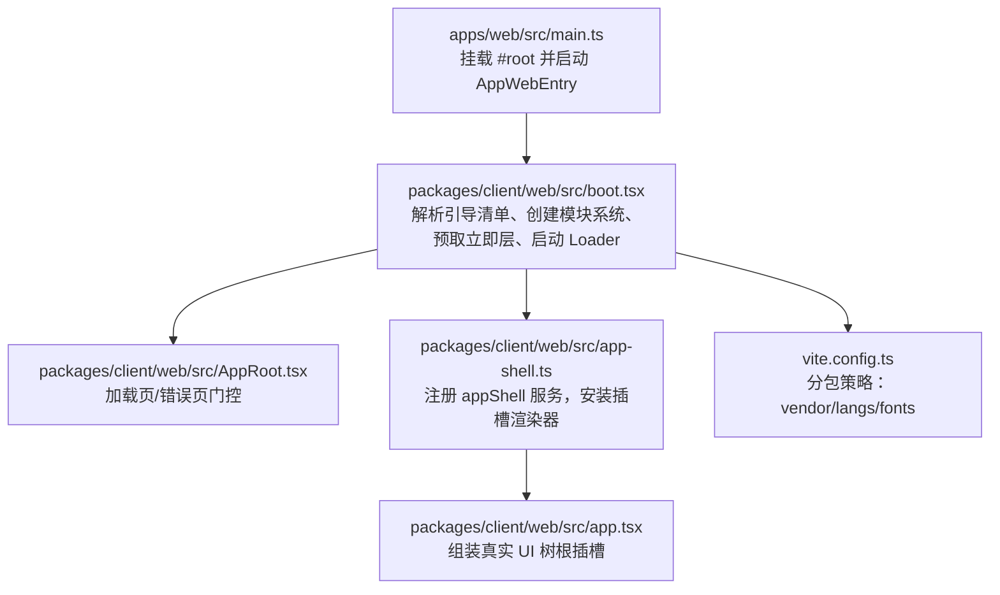
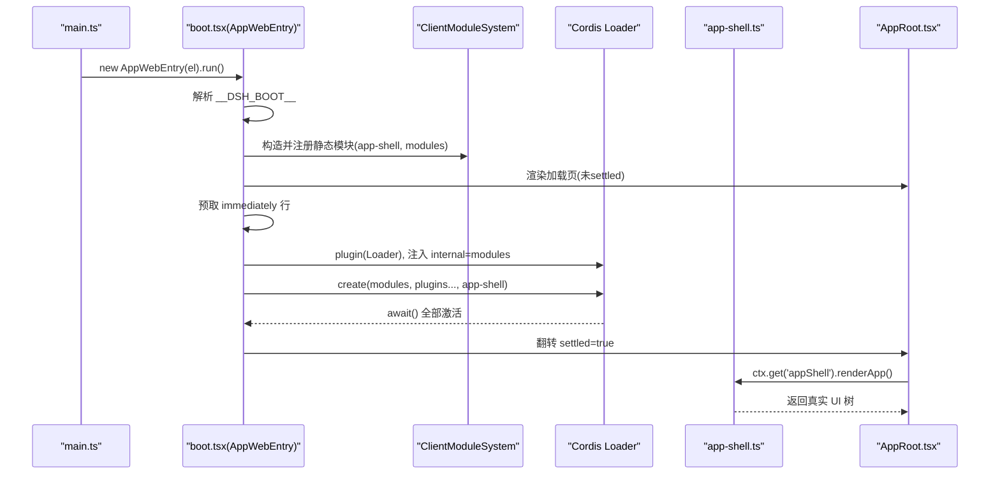
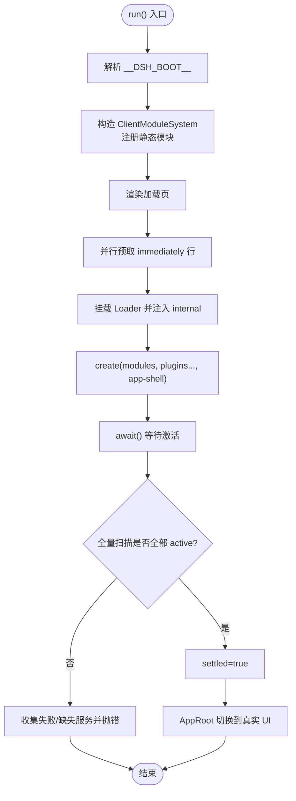
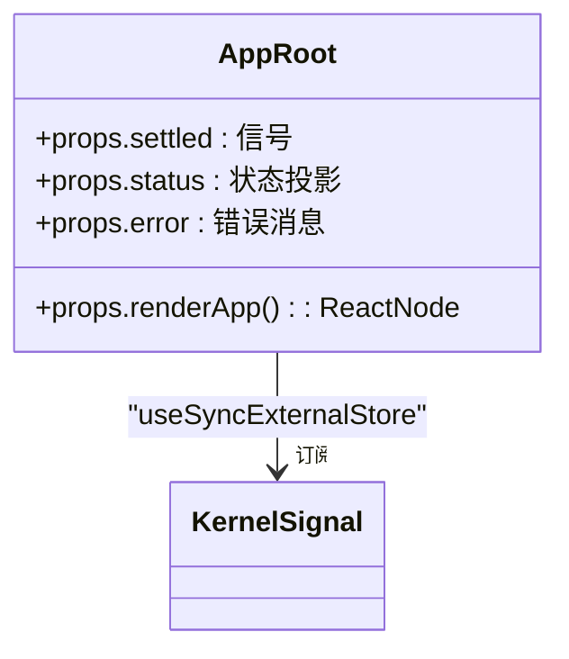
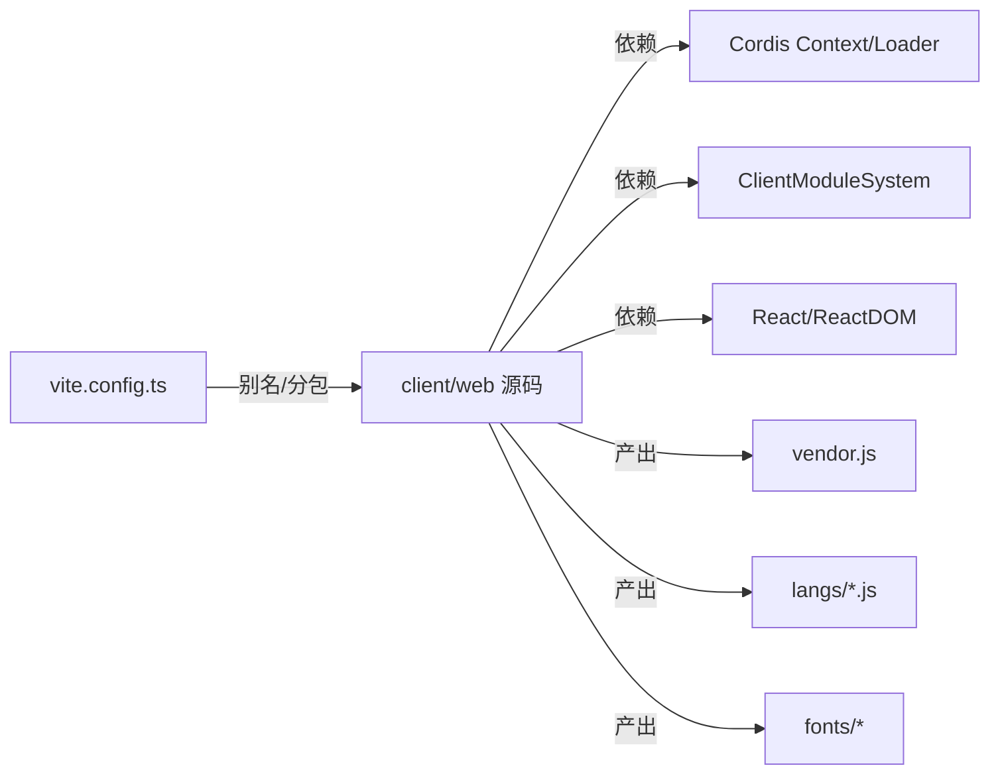

# Web 界面

<cite>
**本文引用的文件**
- [apps/web/src/main.ts](file://apps/web/src/main.ts)
- [apps/web/package.json](file://apps/web/package.json)
- [apps/web/vite.config.ts](file://apps/web/vite.config.ts)
- [packages/client/web/src/boot.tsx](file://packages/client/web/src/boot.tsx)
- [packages/client/web/src/AppRoot.tsx](file://packages/client/web/src/AppRoot.tsx)
- [packages/client/web/src/app-shell.ts](file://packages/client/web/src/app-shell.ts)
- [packages/client/web/src/app.tsx](file://packages/client/web/src/app.tsx)
- [packages/client/ui-primitives/src/markdown/parse.ts](file://packages/client/ui-primitives/src/markdown/parse.ts)
- [packages/client/ui-primitives/src/markdown/render.tsx](file://packages/client/ui-primitives/src/markdown/render.tsx)
</cite>

## 目录
1. [简介](#简介)
2. [项目结构](#项目结构)
3. [核心组件](#核心组件)
4. [架构总览](#架构总览)
5. [详细组件分析](#详细组件分析)
6. [依赖关系分析](#依赖关系分析)
7. [性能考虑](#性能考虑)
8. [故障排查指南](#故障排查指南)
9. [结论](#结论)
10. [附录：定制与扩展指南](#附录定制与扩展指南)

## 简介
本文件面向前端开发者，系统化说明 DeepSeek Harness Web 界面的 React 组件架构、插件系统与模块加载机制、状态管理与数据流、事件处理模式、主题与国际化思路、响应式与可访问性策略，以及性能优化实践。文档以代码级事实为依据，提供可视化图示与“代码片段路径”以便快速定位实现位置。

## 项目结构
Web 应用由 apps/web 作为 Vite 构建入口，实际运行时壳（Shell）与装配逻辑位于 packages/client/web。Vite 通过别名将 @deepseek-ai/dsh-client-web 等包指向源码，确保 CSS 走 Vite 管线；同时通过手动分包将重型渲染依赖（如数学公式、语法高亮、Markdown 解析）拆分到 vendor 与 langs 子目录，提升缓存命中与首屏性能。

图表来源
- [apps/web/src/main.ts:1-11](file://apps/web/src/main.ts#L1-L11)
- [packages/client/web/src/boot.tsx:68-208](file://packages/client/web/src/boot.tsx#L68-L208)
- [packages/client/web/src/AppRoot.tsx:16-60](file://packages/client/web/src/AppRoot.tsx#L16-L60)
- [packages/client/web/src/app-shell.ts:1-51](file://packages/client/web/src/app-shell.ts#L1-L51)
- [packages/client/web/src/app.tsx:1-45](file://packages/client/web/src/app.tsx#L1-L45)
- [apps/web/vite.config.ts:92-128](file://apps/web/vite.config.ts#L92-L128)

章节来源
- [apps/web/src/main.ts:1-11](file://apps/web/src/main.ts#L1-L11)
- [apps/web/vite.config.ts:1-161](file://apps/web/vite.config.ts#L1-L161)
- [packages/client/web/src/boot.tsx:1-239](file://packages/client/web/src/boot.tsx#L1-L239)

## 核心组件
- AppWebEntry：Web 壳启动内核，负责解析引导清单、初始化客户端模块系统、预取“立即层”、挂载 Loader、创建图条目、等待激活并切换至真实 UI。
- AppRoot：React 根组件，基于信号与状态投影在“加载中/失败/已就绪”三种视图间切换。
- app-shell：宿主装配插件，安装插槽渲染器并提供 renderApp 服务，用于在引导完成后一次性构建真实 UI 树。
- app.tsx：真实 UI 的装配闭包，绑定会话标题到文档标题，并将根插槽渲染为 UI 树的根节点。

章节来源
- [packages/client/web/src/boot.tsx:68-208](file://packages/client/web/src/boot.tsx#L68-L208)
- [packages/client/web/src/AppRoot.tsx:16-60](file://packages/client/web/src/AppRoot.tsx#L16-L60)
- [packages/client/web/src/app-shell.ts:1-51](file://packages/client/web/src/app-shell.ts#L1-L51)
- [packages/client/web/src/app.tsx:1-45](file://packages/client/web/src/app.tsx#L1-L45)

## 架构总览
Web 壳采用“引导阶段 + 插件图装配”的两阶段模型：
- 引导阶段：解析 window.__DSH_BOOT__ 得到 BootManifest，构造 ClientModuleSystem，注册静态模块（含 app-shell），渲染加载页，并行预取 immediately 行。
- 插件装配：注入 Loader，设置 internal 契约，按顺序创建 modules 与所有插件条目（跳过 modules 自身），最后创建 app-shell 条目；等待全部激活后进行全量扫描，确认无 pending/failed 后翻转 settled 信号，AppRoot 切换到真实 UI。

图表来源
- [apps/web/src/main.ts:1-11](file://apps/web/src/main.ts#L1-L11)
- [packages/client/web/src/boot.tsx:97-208](file://packages/client/web/src/boot.tsx#L97-L208)
- [packages/client/web/src/AppRoot.tsx:29-60](file://packages/client/web/src/AppRoot.tsx#L29-L60)
- [packages/client/web/src/app-shell.ts:35-50](file://packages/client/web/src/app-shell.ts#L35-L50)

## 详细组件分析

### 启动内核 AppWebEntry
- 职责：解析引导清单、建立模块系统、预取立即层、挂载 Loader、创建图条目、等待激活、执行全量扫描、上报错误、切换 UI。
- 关键流程：
  - 预取 immediately 行：并行 prefetch，失败不阻断整体启动，交由具体 import 路径报告。
  - 注入 Loader：将模块系统注入 loader.internal，避免浏览器裸 import 失败。
  - 条目创建：先创建 modules，再创建所有插件条目，最后创建 app-shell。
  - 激活断言：对每个 entry 检查 fiber 是否存在且处于 active，否则收集缺失服务或失败原因并抛出。
- 状态与信号：
  - status：按条目投影 fiber 状态（loading/active/pending/failed）。
  - settled：引导完成信号，驱动 AppRoot 切换。
  - error：捕获引导异常消息，供加载页展示。

图表来源
- [packages/client/web/src/boot.tsx:97-237](file://packages/client/web/src/boot.tsx#L97-L237)

章节来源
- [packages/client/web/src/boot.tsx:97-237](file://packages/client/web/src/boot.tsx#L97-L237)

### 根组件 AppRoot
- 职责：根据 settled/status/error 决定显示加载/失败/真实 UI。
- 交互：使用 useSyncExternalStore 订阅内核信号与状态投影；当 settled 为真时调用 renderApp 工厂渲染真实 UI。
- 错误呈现：若存在 failed 条目或 error 消息，显示失败列表与错误信息。

图表来源
- [packages/client/web/src/AppRoot.tsx:16-60](file://packages/client/web/src/AppRoot.tsx#L16-L60)

章节来源
- [packages/client/web/src/AppRoot.tsx:16-60](file://packages/client/web/src/AppRoot.tsx#L16-L60)

### 应用外壳 app-shell
- 职责：安装插槽渲染器，提供 appShell.renderApp 服务，延迟构建真实 UI 树。
- 依赖：slots、sessions、layout 服务在 inject 中声明，保证渲染时机正确。
- 设计要点：renderApp 闭包仅构建一次，跨多次渲染稳定引用。

章节来源
- [packages/client/web/src/app-shell.ts:1-51](file://packages/client/web/src/app-shell.ts#L1-L51)

### 真实 UI 装配 app.tsx
- 职责：绑定当前会话标题到文档标题，渲染根插槽。
- 数据流：通过 bindSnapshotSelector 订阅 sessions.list 快照选择器，获取 current 会话标题并更新 DocumentTitle。

章节来源
- [packages/client/web/src/app.tsx:1-45](file://packages/client/web/src/app.tsx#L1-L45)

### Markdown 渲染与增量更新（UI 能力）
- 解析与渲染分离：parse.ts 负责将 Markdown 转换为 AST；render.tsx 负责将 AST 渲染为 React 节点。
- 增量渲染：结合 incremental 能力，支持长文本流式更新，减少重渲染开销。
- 集成点：ui-primitives 暴露统一接口，被上层对话/卡片等组件复用。

章节来源
- [packages/client/ui-primitives/src/markdown/parse.ts](file://packages/client/ui-primitives/src/markdown/parse.ts)
- [packages/client/ui-primitives/src/markdown/render.tsx](file://packages/client/ui-primitives/src/markdown/render.tsx)

## 依赖关系分析
- 构建期依赖：
  - Vite 配置通过 alias 将多个 @deepseek-ai/* 包映射到源码，使 CSS 走 Vite 管线。
  - 手动分包：将 katex、shiki、mdast/micromark 家族等重型依赖放入 vendor；@shikijs/langs 的语法按需拆入 assets/langs。
  - 字体资源：KaTeX 字体归入 assets/fonts。
- 运行期依赖：
  - Cordis 上下文与 Loader 管理插件生命周期与服务注入。
  - 客户端模块系统负责模块表、静态注册与动态导入。
  - React DOM 负责渲染与状态同步。

图表来源
- [apps/web/vite.config.ts:92-128](file://apps/web/vite.config.ts#L92-L128)
- [packages/client/web/src/boot.tsx:35-48](file://packages/client/web/src/boot.tsx#L35-L48)

章节来源
- [apps/web/vite.config.ts:1-161](file://apps/web/vite.config.ts#L1-L161)
- [packages/client/web/src/boot.tsx:35-48](file://packages/client/web/src/boot.tsx#L35-L48)

## 性能考虑
- 分包与缓存
  - 将变化频率低的渲染依赖（katex/shiki/mdast/micromark）放入 vendor，编辑 shell 代码仅影响 index，提高长期缓存命中率。
  - 语法高亮语言包按需懒加载，独立 chunk 置于 assets/langs，避免首屏体积膨胀。
  - KaTeX 字体集中输出到 assets/fonts，便于 CDN 与缓存策略统一管理。
- 启动优化
  - 预取 immediately 行：在挂载 Loader 的同时并行预取，缩短后续材料化时间。
  - 条目创建并发：非预取的 bundle 加载可并行，降低总体等待时间。
  - 引导失败不阻断：单条目的导入失败不会导致全局失败，保持加载页并报告问题。
- 渲染优化
  - 增量 Markdown 渲染：结合 parse 与 render 分离，支持流式更新，减少整段重渲染。
  - 标题更新最小化：通过快照选择器仅在当前会话变更时更新文档标题。

[本节为通用性能建议，无需特定文件引用]

## 故障排查指南
- 引导失败
  - 现象：加载页显示“Failed to load plugins”，列出失败的条目 ID 与错误消息。
  - 可能原因：某插件 bundle 导入失败、服务缺失导致 pending、apply 抛出异常。
  - 定位方法：查看控制台错误与 AppRoot 的错误消息；检查对应插件的日志与依赖。
- 条目未激活
  - 现象：引导完成后仍停留在加载页或出现 pending 提示。
  - 可能原因：缺少服务注入、循环依赖、异步服务未就绪。
  - 定位方法：检查 app-shell 的 inject 集合与相关服务的提供；核对模块系统静态注册是否正确。
- 构建/开发环境
  - 现象：直接运行 Vite dev/preview 报错，提示不允许独立服务。
  - 原因：需要 dsh web 提供的引导清单与运行时环境。
  - 解决：通过 dsh web 启动；如需 HMR，配合 dev:web 脚本。

章节来源
- [packages/client/web/src/AppRoot.tsx:29-60](file://packages/client/web/src/AppRoot.tsx#L29-L60)
- [packages/client/web/src/boot.tsx:150-237](file://packages/client/web/src/boot.tsx#L150-L237)
- [apps/web/vite.config.ts:11-19](file://apps/web/vite.config.ts#L11-L19)

## 结论
DeepSeek Harness Web 界面以“引导 + 插件图装配”为核心，通过严格的壳自足规则与两阶段启动，确保加载页始终可用并在失败时提供明确诊断。模块化与分包策略兼顾了首屏性能与长期缓存稳定性。插槽与服务的组合使得 UI 具备高度可扩展性，适合持续演进与定制化。

[本节为总结性内容，无需特定文件引用]

## 附录：定制与扩展指南

### 如何扩展界面组件
- 在 ui-primitives 中新增基础组件，遵循现有命名与样式约定（CSS Modules）。
- 通过插槽机制将新组件插入到布局中：在 app-shell 安装插槽渲染器后，由上层业务通过 slots.renderSlot 进行组合。
- 参考路径：
  - [packages/client/web/src/app-shell.ts:35-50](file://packages/client/web/src/app-shell.ts#L35-L50)
  - [packages/client/web/src/app.tsx:38-43](file://packages/client/web/src/app.tsx#L38-L43)

### 如何添加新的功能模块（插件）
- 编写插件模块，导出 name/inject/apply，并在宿主图中注册为图条目。
- 若需与模块系统交互，确保其 id 与静态注册一致，避免重复 fetch。
- 参考路径：
  - [packages/client/web/src/boot.tsx:185-204](file://packages/client/web/src/boot.tsx#L185-L204)

### 如何定制用户界面
- 通过 app-shell 提供的 renderApp 服务，在引导完成后替换或增强根插槽内容。
- 利用 sessions 快照选择器绑定页面标题与状态，保持 UI 与数据一致。
- 参考路径：
  - [packages/client/web/src/app-shell.ts:44-50](file://packages/client/web/src/app-shell.ts#L44-L50)
  - [packages/client/web/src/app.tsx:26-43](file://packages/client/web/src/app.tsx#L26-L43)

### 主题系统与样式变量
- 样式组织：ui-primitives 使用 CSS Modules，便于局部作用域与按需引入。
- 主题变量：建议在 ui-primitives 中定义统一的 CSS 变量（颜色、字号、间距），并通过外层容器注入主题类名实现切换。
- 自定义主题：在应用层覆盖 CSS 变量或使用主题提供者包裹根节点，确保全局一致性。
- 参考路径（样式组织）：
  - [packages/client/ui-primitives/src/Button.module.css](file://packages/client/ui-primitives/src/Button.module.css)
  - [packages/client/ui-primitives/src/Input.module.css](file://packages/client/ui-primitives/src/Input.module.css)

### 国际化支持
- 语言包管理：建议将文案抽取为键值对，按语言维度组织；在运行时提供 i18n 服务，供组件读取当前语言文案。
- 动态语言切换：通过全局状态或上下文提供 setLocale 能力，触发组件重新渲染以刷新文案。
- 文档参考：
  - [docs/i18n/README.md](file://docs/i18n/README.md)
  - [docs/i18n/translation-rules.md](file://docs/i18n/translation-rules.md)

### 响应式设计、移动端适配与可访问性
- 响应式策略：使用相对单位与媒体查询，优先保证小屏可用性；复杂布局通过插槽与栅格组合。
- 移动端适配：触控目标尺寸、滚动区域隔离、键盘交互优化。
- 可访问性：语义化标签、ARIA 属性、焦点管理、键盘导航与屏幕阅读器兼容。
- 参考路径（示例组件样式）：
  - [packages/client/ui-primitives/src/Modal.module.css](file://packages/client/ui-primitives/src/Modal.module.css)
  - [packages/client/ui-primitives/src/Tooltip.module.css](file://packages/client/ui-primitives/src/Tooltip.module.css)

### 性能优化技术（实践清单）
- 代码分割：按功能与依赖划分 chunk，避免首屏冗余。
- 懒加载：对重型渲染（语法高亮、数学公式、Markdown 解析）按需加载。
- 缓存策略：vendor/langs/fonts 独立缓存，结合版本哈希提升命中率。
- 增量渲染：长文本与流式内容采用增量更新，减少重渲染范围。
- 参考路径：
  - [apps/web/vite.config.ts:21-61](file://apps/web/vite.config.ts#L21-L61)
  - [apps/web/vite.config.ts:92-128](file://apps/web/vite.config.ts#L92-L128)
  - [packages/client/ui-primitives/src/markdown/render.tsx](file://packages/client/ui-primitives/src/markdown/render.tsx)