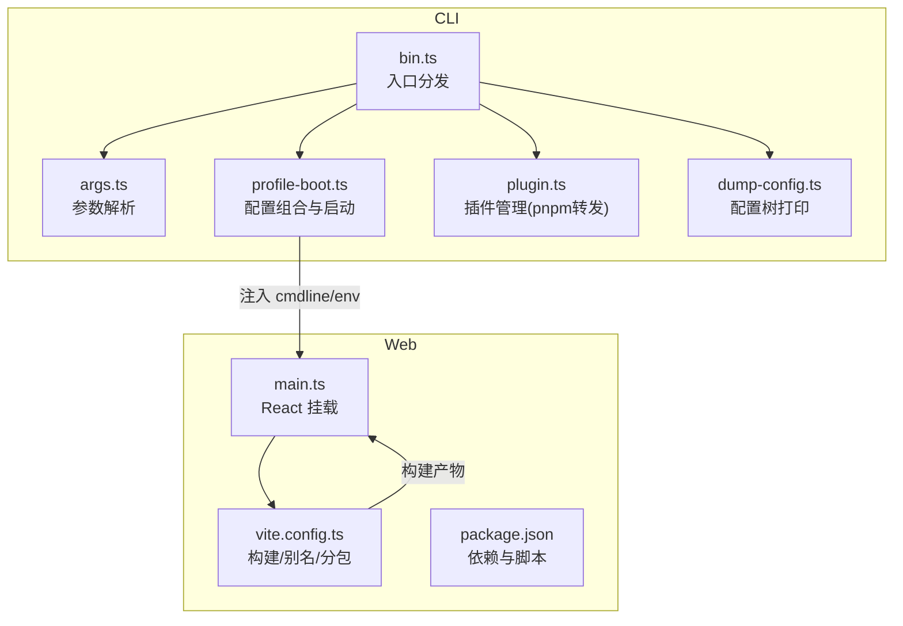
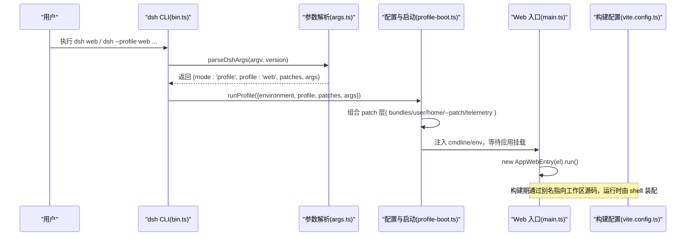
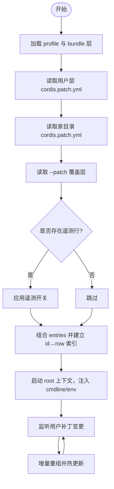
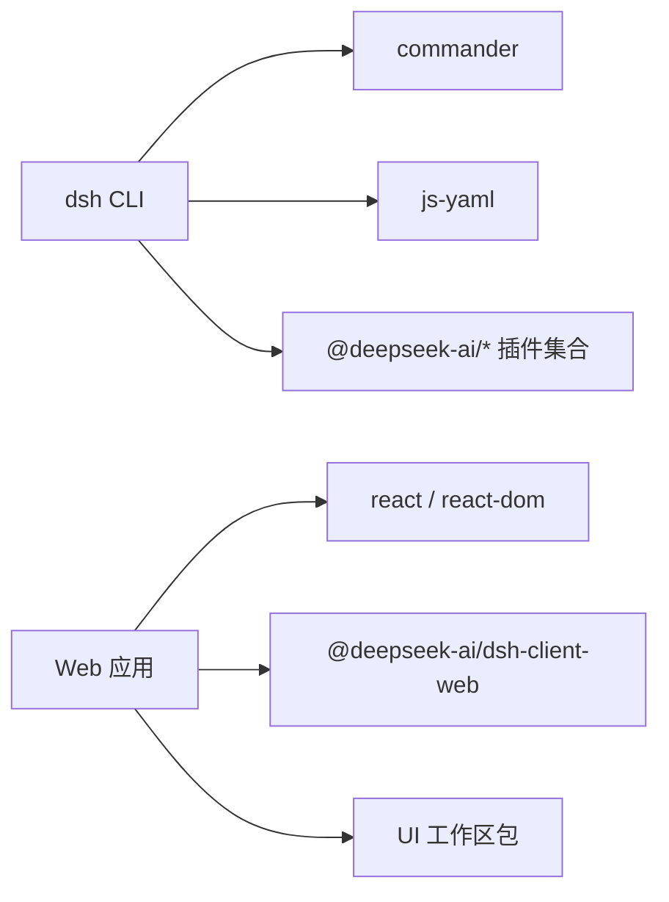

# 用户界面

<cite>
**本文引用的文件**
- [apps/web/src/main.ts](file://apps/web/src/main.ts)
- [apps/web/vite.config.ts](file://apps/web/vite.config.ts)
- [apps/web/package.json](file://apps/web/package.json)
- [apps/cli/src/bin.ts](file://apps/cli/src/bin.ts)
- [apps/cli/src/args.ts](file://apps/cli/src/args.ts)
- [apps/cli/src/profile-boot.ts](file://apps/cli/src/profile-boot.ts)
- [apps/cli/src/plugin.ts](file://apps/cli/src/plugin.ts)
- [apps/cli/src/dump-config.ts](file://apps/cli/src/dump-config.ts)
- [apps/cli/README.md](file://apps/cli/README.md)
</cite>

## 目录
1. [简介](#简介)
2. [项目结构](#项目结构)
3. [核心组件](#核心组件)
4. [架构总览](#架构总览)
5. [详细组件分析](#详细组件分析)
6. [依赖关系分析](#依赖关系分析)
7. [性能考量](#性能考量)
8. [故障排查指南](#故障排查指南)
9. [结论](#结论)
10. [附录](#附录)

## 简介
本文件面向前端开发者与终端用户，系统化说明 DeepSeek Harness 的用户界面：包括 Web 界面与 CLI 接口的完整能力、React 组件入口与构建配置、CLI 命令参考与参数、配置组合与热重载机制、扩展点与定制方式、响应式与可访问性建议、跨浏览器兼容性要点、性能优化技巧与调试方法。文档以仓库源码为依据，提供可视化架构图与流程图，帮助快速定位问题并高效扩展。

## 项目结构
DeepSeek Harness 将“Web 前端”和“CLI 启动器”分置于 apps/web 与 apps/cli 两个子应用中：
- apps/web：基于 Vite + React 的 Web 应用入口，负责挂载宿主提供的壳库（dsh-client-web），并通过 Vite 进行开发与构建。
- apps/cli：统一的命令行入口 dsh，负责解析参数、选择模式（web/headless/tui）、加载并组装插件层（patch layers）、启动目标应用或工具。

图表来源
- [apps/cli/src/bin.ts:1-54](file://apps/cli/src/bin.ts#L1-L54)
- [apps/cli/src/args.ts:1-192](file://apps/cli/src/args.ts#L1-L192)
- [apps/cli/src/profile-boot.ts:1-301](file://apps/cli/src/profile-boot.ts#L1-L301)
- [apps/cli/src/plugin.ts:1-159](file://apps/cli/src/plugin.ts#L1-L159)
- [apps/cli/src/dump-config.ts:1-54](file://apps/cli/src/dump-config.ts#L1-L54)
- [apps/web/src/main.ts:1-11](file://apps/web/src/main.ts#L1-L11)
- [apps/web/vite.config.ts:1-161](file://apps/web/vite.config.ts#L1-L161)
- [apps/web/package.json:1-52](file://apps/web/package.json#L1-L52)

章节来源
- [apps/cli/README.md:1-48](file://apps/cli/README.md#L1-L48)

## 核心组件
- CLI 入口与分发：bin.ts 根据 args.ts 解析出的模式动态导入对应运行器（profile/plugin/dump-config）。
- 参数解析：args.ts 使用 Commander 定义 dsh 主命令、web 别名、plugin 子命令，以及 --profile/--patch/--dump-config/--dump-default-config 等选项；支持将剩余参数透传给被启动的应用。
- 配置组合与启动：profile-boot.ts 负责加载 profile、组合 patch 层（bundle 层、用户层、home 层、--patch 覆盖层、遥测开关）、注入环境快照与命令行快照、安装失败即停策略、信号处理与进程关闭、监听用户补丁实现热重载。
- 插件管理：plugin.ts 在 profile 目录下执行 pnpm 命令，并在成功后根据已安装包是否声明 dsh.bundle 自动维护 dsh.profile.bundles 列表。
- 配置转储：dump-config.ts 在不启动应用的情况下渲染配置组成树，便于诊断。
- Web 入口：main.ts 仅做最小化引导，查找 #root 并调用 AppWebEntry.run()。
- Web 构建：vite.config.ts 禁止独立 serve、设置 React 插件、别名到工作区源码、按包名拆分 vendor chunk、字体与语法高亮资源分组、define 替换 Node 探针。

章节来源
- [apps/cli/src/bin.ts:1-54](file://apps/cli/src/bin.ts#L1-L54)
- [apps/cli/src/args.ts:1-192](file://apps/cli/src/args.ts#L1-L192)
- [apps/cli/src/profile-boot.ts:1-301](file://apps/cli/src/profile-boot.ts#L1-L301)
- [apps/cli/src/plugin.ts:1-159](file://apps/cli/src/plugin.ts#L1-L159)
- [apps/cli/src/dump-config.ts:1-54](file://apps/cli/src/dump-config.ts#L1-L54)
- [apps/web/src/main.ts:1-11](file://apps/web/src/main.ts#L1-L11)
- [apps/web/vite.config.ts:1-161](file://apps/web/vite.config.ts#L1-L161)
- [apps/web/package.json:1-52](file://apps/web/package.json#L1-L52)

## 架构总览
下图展示了从命令行到 Web 应用的完整调用链：参数解析 → 配置组合 → 注入服务 → 启动 Web 壳 → 挂载 React 根节点。

图表来源
- [apps/cli/src/bin.ts:1-54](file://apps/cli/src/bin.ts#L1-L54)
- [apps/cli/src/args.ts:1-192](file://apps/cli/src/args.ts#L1-L192)
- [apps/cli/src/profile-boot.ts:1-301](file://apps/cli/src/profile-boot.ts#L1-L301)
- [apps/web/src/main.ts:1-11](file://apps/web/src/main.ts#L1-L11)
- [apps/web/vite.config.ts:1-161](file://apps/web/vite.config.ts#L1-L161)

## 详细组件分析

### CLI 命令参考与参数
- 基本用法
  - dsh --profile <name>：启动指定 profile（如 web/headless/tui）。
  - dsh web：等价于 --profile web。
  - dsh plugin --profile <name> <pnpm args>：在 profile 目录中转发 pnpm 命令管理插件。
- 常用选项
  - --patch <path>：追加 patch 覆盖层（可重复）。
  - --dump-config：打印最终组成的配置树后退出。
  - --dump-default-config：仅打印 bundle 层（不含用户层与 --patch）后退出。
- 行为约定
  - 启动器先解析自身选项，遇到未知 token 后将剩余参数原样交给被启动应用。
  - web 子命令不接受父级 --profile/--patch/--dump-* 选项。
  - 错误时非零退出，help/version 由适配器统一处理。

章节来源
- [apps/cli/src/args.ts:1-192](file://apps/cli/src/args.ts#L1-L192)
- [apps/cli/README.md:1-48](file://apps/cli/README.md#L1-L48)

### 配置组合与热重载流程
- 组合顺序（自底向上）
  1) 各 bundle 的 patch（按 dsh.profile.bundles 顺序）
  2) 当前 profile 的 cordis.patch.yml
  3) 家目录 $DSH_HOME/cordis.patch.yml
  4) --patch 覆盖层
  5) 遥测开关（若存在对应行且环境变量启用禁用）
- 热重载
  - 监听用户补丁文件变化，增量重组 patch 栈并重新应用，不影响已挂载模块。
  - 当未自带 HMR 服务时，会按需挂载轻量 HMR 计时器与 watcher。

图表来源
- [apps/cli/src/profile-boot.ts:1-301](file://apps/cli/src/profile-boot.ts#L1-L301)

章节来源
- [apps/cli/src/profile-boot.ts:1-301](file://apps/cli/src/profile-boot.ts#L1-L301)

### 插件管理与依赖同步
- 首次使用自动初始化 profile 目录（若不存在 package.json）。
- 在 profile 目录执行 pnpm 命令，并将相对路径规范锚定到调用者目录，避免误解析。
- 成功后根据实际安装的依赖是否声明 dsh.bundle 自动维护 dsh.profile.bundles 列表，确保新增/移除/版本升级的 bundle 生效。
- 对 git 依赖安装失败的常见原因给出提示（prepare 脚本需 allowBuilds 白名单）。

章节来源
- [apps/cli/src/plugin.ts:1-159](file://apps/cli/src/plugin.ts#L1-L159)

### Web 应用入口与构建
- 入口职责极简：查找 #root 元素并调用 AppWebEntry.run() 完成挂载。
- Vite 构建要点
  - 禁止独立 serve，必须通过 dsh web 启动以保证 boot manifest 可用。
  - 通过 alias 将工作区包映射到 src，使 CSS 走 Vite 管线。
  - 将重型第三方库（math/markdown/highlight 相关）拆入 vendor chunk，提升缓存命中。
  - 语法高亮语言包按需懒加载，初始仅包含必要语言。
  - define 替换 Node 探针，屏蔽内部分支逻辑。
  - 字体资源归类至 assets/fonts/。

章节来源
- [apps/web/src/main.ts:1-11](file://apps/web/src/main.ts#L1-L11)
- [apps/web/vite.config.ts:1-161](file://apps/web/vite.config.ts#L1-L161)
- [apps/web/package.json:1-52](file://apps/web/package.json#L1-L52)

### 主题系统与国际化支持（概念性说明）
- 主题系统：通常由 UI 层通过主题上下文/样式变量提供，可在应用内切换明暗主题或品牌色。具体实现位于工作区 UI 包中，可通过覆盖样式变量或主题提供者进行定制。
- 国际化：多语言文案集中管理，运行时根据语言环境加载对应资源。可通过配置或运行时 API 切换语言。
- 注意：本节为通用实践说明，不直接引用具体源码文件。

[本节为概念性内容，无需来源]

### 界面定制与扩展点
- 通过 --patch 覆盖层注入新的配置行或修改现有行，实现功能开关与行为调整。
- 通过 dsh.plugin 在 profile 中添加自定义 bundle，扩展 UI 插槽或工具。
- 利用 Vite alias 在工作区源码级别定制 UI 行为（开发阶段）。
- 通过 CLI 注入的环境快照与命令行快照，在应用内读取启动上下文。

章节来源
- [apps/cli/src/profile-boot.ts:1-301](file://apps/cli/src/profile-boot.ts#L1-L301)
- [apps/cli/src/args.ts:1-192](file://apps/cli/src/args.ts#L1-L192)

### 响应式设计、可访问性与跨浏览器兼容
- 响应式：UI 组件应遵循弹性布局与断点适配原则，确保桌面与移动端体验一致。
- 可访问性：为交互控件提供语义化标签、键盘导航、焦点管理与屏幕阅读器支持。
- 跨浏览器：Vite 构建产物默认面向现代浏览器；如需兼容旧版浏览器，可在构建配置中调整目标环境与 polyfill。
- 注意：本节为通用实践说明，不直接引用具体源码文件。

[本节为概念性内容，无需来源]

## 依赖关系分析
- CLI 依赖
  - commander：命令行解析
  - js-yaml：YAML 配置读写
  - 多个 dsh-* 插件包：构成不同 profile 的能力集合
- Web 依赖
  - react/react-dom：UI 框架
  - @deepseek-ai/dsh-client-web：壳库与装配
  - 其他 UI 与工作区包：通过 Vite alias 指向源码

图表来源
- [apps/cli/package.json:1-102](file://apps/cli/package.json#L1-L102)
- [apps/web/package.json:1-52](file://apps/web/package.json#L1-L52)

章节来源
- [apps/cli/package.json:1-102](file://apps/cli/package.json#L1-L102)
- [apps/web/package.json:1-52](file://apps/web/package.json#L1-L52)

## 性能考量
- 构建期
  - 将重型第三方库放入 vendor chunk，提高缓存命中率。
  - 语法高亮语言包按需懒加载，减少首屏体积。
  - 字体资源分类输出，利于 CDN 缓存与并行加载。
- 运行期
  - 配置热重载采用增量重组，避免全量重建。
  - 通过 fail-loud 与受控进程关闭，缩短异常恢复时间。
  - 合理拆分入口与懒加载路由/组件，降低首屏压力。
- 调试
  - 开启 sourcemap 便于定位问题。
  - 使用 --dump-config 检查配置组合是否正确。
  - 通过环境变量控制遥测与日志输出，辅助定位。

[本节为通用指导，无需来源]

## 故障排查指南
- 无法独立启动 Web 开发服务器
  - 现象：直接运行 Vite serve 报错。
  - 原因：需要 boot manifest，必须通过 dsh web 启动。
  - 解决：使用 dsh web 或 pnpm dsh web。
- 插件安装失败（git 依赖 prepare 脚本被阻止）
  - 现象：pnpm 安装时报错。
  - 原因：安全策略阻止 prepare 脚本执行。
  - 解决：在 pnpm-workspace.yaml 的 allowBuilds 中添加对应键值后重试。
- 配置组合不符合预期
  - 使用 --dump-default-config 查看 bundle 层，使用 --dump-config 查看完整层。
  - 检查 --patch 覆盖层内容与顺序。
- 进程退出码与信号
  - SIGTERM 正常退出（0），SIGINT 中断退出（130）。
  - 结合应用日志与 dump 输出定位问题。

章节来源
- [apps/web/vite.config.ts:1-161](file://apps/web/vite.config.ts#L1-L161)
- [apps/cli/src/plugin.ts:1-159](file://apps/cli/src/plugin.ts#L1-L159)
- [apps/cli/src/dump-config.ts:1-54](file://apps/cli/src/dump-config.ts#L1-L54)
- [apps/cli/src/profile-boot.ts:1-301](file://apps/cli/src/profile-boot.ts#L1-L301)

## 结论
DeepSeek Harness 的用户界面以“CLI 驱动 + Web 壳装配”的方式组织：CLI 负责参数解析、配置组合与应用启动；Web 侧专注于 UI 渲染与交互。通过 patch 层与插件体系，用户可以灵活定制行为与界面；借助 Vite 的构建优化与热重载机制，获得良好的开发与运行体验。对于前端开发者，建议优先通过插件与 patch 扩展能力；对于终端用户，掌握 dsh 命令与配置转储工具即可高效使用与排障。

[本节为总结性内容，无需来源]

## 附录
- 常用命令速查
  - dsh --profile web：启动 Web 界面
  - dsh web：同上（别名）
  - dsh --profile headless "任务"：无头模式执行任务
  - dsh plugin --profile <name> add <pkg>：添加插件
  - dsh --profile <name> --dump-config：打印配置树
  - dsh --profile <name> --dump-default-config：仅打印 bundle 层
- 关键文件路径
  - CLI 入口：apps/cli/src/bin.ts
  - 参数解析：apps/cli/src/args.ts
  - 配置组合：apps/cli/src/profile-boot.ts
  - 插件管理：apps/cli/src/plugin.ts
  - 配置转储：apps/cli/src/dump-config.ts
  - Web 入口：apps/web/src/main.ts
  - Web 构建：apps/web/vite.config.ts

[本节为参考信息，无需来源]