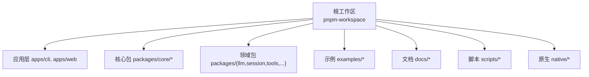
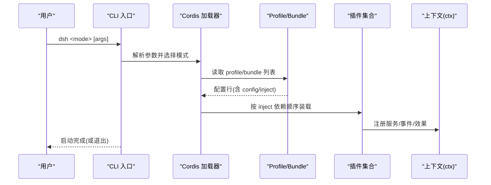
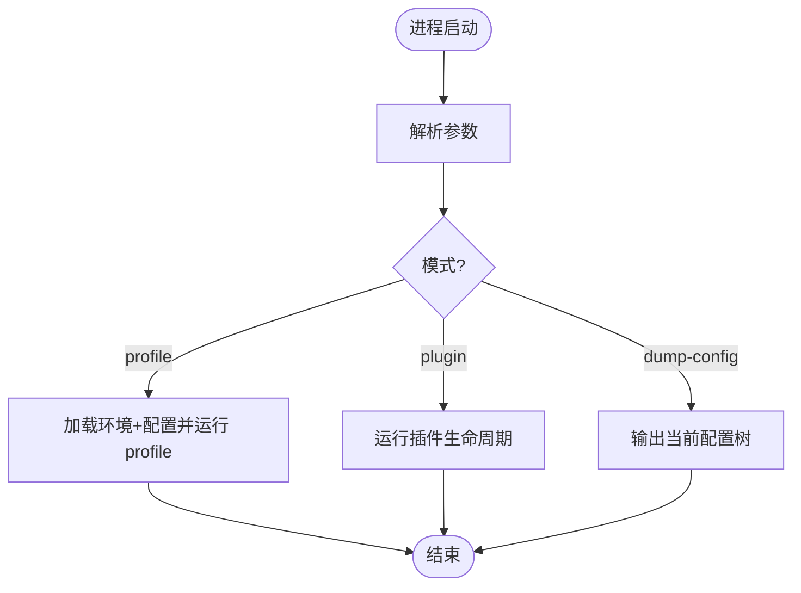
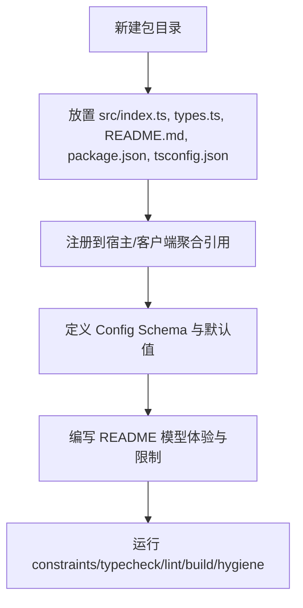
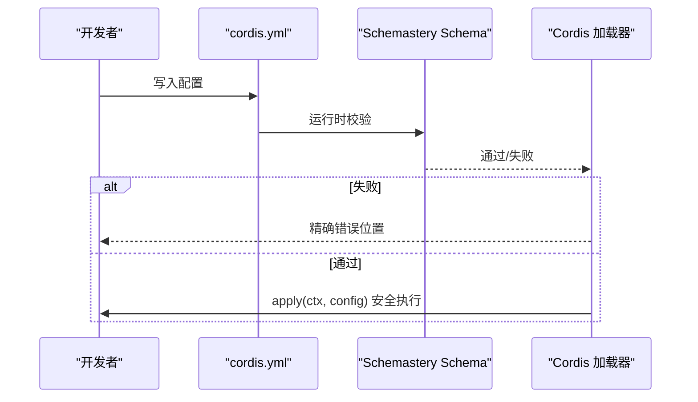
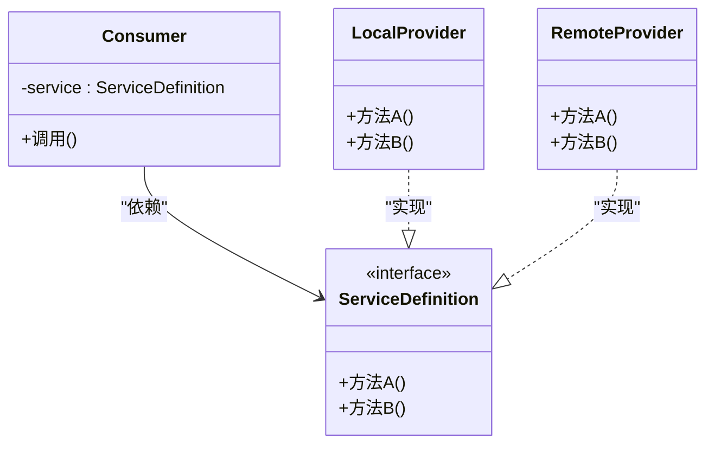
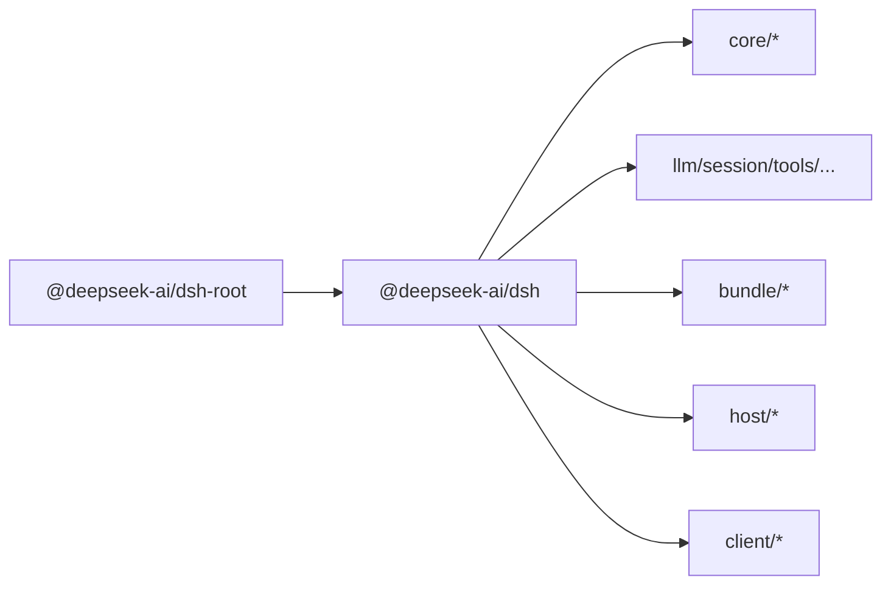

# 代码组织模式

<cite>
**本文引用的文件**
- [README.md](file://README.md)
- [package.json](file://package.json)
- [apps/cli/package.json](file://apps/cli/package.json)
- [apps/cli/src/bin.ts](file://apps/cli/src/bin.ts)
- [packages/AGENTS.md](file://packages/AGENTS.md)
- [docs/architecture.md](file://docs/architecture.md)
- [docs/cordis-primer.md](file://docs/cordis-primer.md)
- [docs/cookbook/adding-a-package.md](file://docs/cookbook/adding-a-package.md)
- [docs/testing.md](file://docs/testing.md)
- [docs/config-catalog.md](file://docs/config-catalog.md)
- [docs/user/develop/basic/config.md](file://docs/user/develop/basic/config.md)
- [scripts/verify-cordis-config.ts](file://scripts/verify-cordis-config.ts)
- [scripts/gen-config-catalog.ts](file://scripts/gen-config-catalog.ts)
</cite>

## 目录
1. [简介](#简介)
2. [项目结构](#项目结构)
3. [核心组件](#核心组件)
4. [架构总览](#架构总览)
5. [详细组件分析](#详细组件分析)
6. [依赖分析](#依赖分析)
7. [性能考虑](#性能考虑)
8. [故障排查指南](#故障排查指南)
9. [结论](#结论)
10. [附录](#附录)

## 简介
本指南面向 DeepSeek Harness（dsh）的插件化代码组织与扩展开发，聚焦“一切皆插件”的 Cordis 框架下的模块划分、依赖管理、命名约定、配置管理与版本兼容性策略。文档同时提供工具开发、Agent 实现与扩展开发的标准化模式，并覆盖单元测试、集成测试、文档生成与大型团队协作最佳实践。

## 项目结构
仓库采用 Monorepo 组织：根工作区通过 pnpm workspaces 聚合 apps、packages、native、examples、website 等子工程；CLI 入口位于 apps/cli，核心能力以 packages/* 形式模块化；文档位于 docs，脚本与校验位于 scripts。



**图表来源**
- [package.json:11-18](file://package.json#L11-L18)

**章节来源**
- [package.json:1-18](file://package.json#L1-L18)
- [README.md:1-58](file://README.md#L1-L58)

## 核心组件
- CLI 入口与分发：apps/cli/src/bin.ts 解析参数并按 mode 动态加载 profile/plugin/dump-config 等路径，避免无关模式被引入。
- 插件装配：Cordis 将服务、事件、可逆效果挂载到共享上下文 ctx；每个产品功能都是插件，可通过配置替换。
- 会话与提示：core/session 维护追加式日志与内存存储；core/system-prompt 负责提示段与工具 schema 组装。
- 工具与 Agent：core/tools 提供作用域内工具注册与执行管线；core/agent 定义 Agent 接口与事件；core/agent-loop 为默认驱动。
- 能力接缝：通过 Service Definition / Provider / Consumer 三角色解耦，如 shell、subagent、fs 等。

**章节来源**
- [apps/cli/src/bin.ts:1-54](file://apps/cli/src/bin.ts#L1-L54)
- [docs/architecture.md:9-13](file://docs/architecture.md#L9-L13)
- [docs/architecture.md:39-52](file://docs/architecture.md#L39-L52)
- [docs/architecture.md:98-103](file://docs/architecture.md#L98-L103)

## 架构总览
dsh 以 Cordis 为内核，运行期由“配置文件树 + 插件树”组合而成。Profile 声明要堆叠的 Bundle，Bundle 是配置行与代码的打包格式，支持按层 patch。启动时按顺序合并各层，最终形成可插拔的产品形态。



**图表来源**
- [apps/cli/src/bin.ts:27-53](file://apps/cli/src/bin.ts#L27-L53)
- [docs/architecture.md:15-28](file://docs/architecture.md#L15-L28)
- [docs/cordis-primer.md:7-14](file://docs/cordis-primer.md#L7-L14)

**章节来源**
- [docs/architecture.md:15-37](file://docs/architecture.md#L15-L37)
- [docs/cordis-primer.md:7-14](file://docs/cordis-primer.md#L7-L14)

## 详细组件分析

### CLI 命令分发与模式隔离
- 入口根据命令行模式动态 import 对应处理器，减少冷启动成本并保持职责单一。
- 支持 profile、plugin、dump-config 等模式，统一从 package.json 中读取版本信息。



**图表来源**
- [apps/cli/src/bin.ts:19-53](file://apps/cli/src/bin.ts#L19-L53)

**章节来源**
- [apps/cli/src/bin.ts:1-54](file://apps/cli/src/bin.ts#L1-L54)

### 插件与包的创建规范
- 包结构：src/index.ts 暴露 service 默认导出或函数插件（name/inject/apply/Config），types.ts 仅包含类型。
- tsconfig 继承 base，严格 outDir/rootDir 约定；每个包在 host/client 聚合中唯一归属。
- README 必须描述模型体验（请求上下文、Token/KV Cache 影响）、已知限制与延期项。
- 包名遵循“角色即名”，避免实现细节进入稳定名称。



**图表来源**
- [docs/cookbook/adding-a-package.md:7-39](file://docs/cookbook/adding-a-package.md#L7-L39)
- [docs/cookbook/adding-a-package.md:41-73](file://docs/cookbook/adding-a-package.md#L41-L73)
- [docs/cookbook/adding-a-package.md:73-119](file://docs/cookbook/adding-a-package.md#L73-L119)

**章节来源**
- [docs/cookbook/adding-a-package.md:7-119](file://docs/cookbook/adding-a-package.md#L7-L119)
- [packages/AGENTS.md:1-28](file://packages/AGENTS.md#L1-L28)

### 配置管理与验证
- 所有 cordis.yml 配置通过 Schemastery 校验，缺失必填字段或类型错误会失败于加载阶段。
- 生成的配置目录 docs/config-catalog.md 由脚本自动生成，确保声明与运行时 schema 一致。
- verify-cordis-config 校验 Loader 元数据、插件解析、预设分层与客户端半面声明。



**图表来源**
- [docs/user/develop/basic/config.md:7-45](file://docs/user/develop/basic/config.md#L7-L45)
- [docs/config-catalog.md:1-10](file://docs/config-catalog.md#L1-L10)
- [scripts/verify-cordis-config.ts:72-99](file://scripts/verify-cordis-config.ts#L72-L99)

**章节来源**
- [docs/user/develop/basic/config.md:1-72](file://docs/user/develop/basic/config.md#L1-L72)
- [docs/config-catalog.md:1-10](file://docs/config-catalog.md#L1-L10)
- [scripts/verify-cordis-config.ts:69-99](file://scripts/verify-cordis-config.ts#L69-L99)
- [scripts/gen-config-catalog.ts:819-836](file://scripts/gen-config-catalog.ts#L819-L836)

### 事件与调用流（Turn 流程）
- Turn 由零或多个 Step 组成；Step 包含一次模型请求与工具调用。
- 关键事件包括 turn/start、step/start、tool/call*、assistant/chunk*、turn/end 等，均为持久化或可观察的扩展点。
- agent/pre-step、agent/request、tools/* 等为瀑布流事件，监听器需调用 next() 委派。

```mermaid
sequenceDiagram
participant Loop as "Agent 循环"
participant Prompt as "系统提示/工具schema"
participant LLM as "LLM 适配器"
participant Tools as "工具执行管线"
Loop->>Loop : turn/start
Loop->>Prompt : 组装提示与工具schema
Loop->>Loop : agent/pre-step (可重写/拒绝)
Loop->>Loop : step/start
Loop->>LLM : 发送请求 -> assistant/chunk*
Loop->>Tools : tool/call* -> tools/execute -> tool/result*
Loop->>Loop : step/end
Loop->>Loop : 若仍有待处理则下一 step
Loop->>Loop : turn/end
```

**图表来源**
- [docs/architecture.md:63-90](file://docs/architecture.md#L63-L90)

**章节来源**
- [docs/architecture.md:63-90](file://docs/architecture.md#L63-L90)

### 能力接缝（Service Definition / Provider / Consumer）
- 通过明确的角色分离，使同一能力在不同环境（本地/沙箱/远程）可替换。
- 典型示例：shell、subagent、fs 等能力背后可切换不同提供者，而消费者不变。



**图表来源**
- [docs/architecture.md:98-103](file://docs/architecture.md#L98-L103)

**章节来源**
- [docs/architecture.md:98-103](file://docs/architecture.md#L98-L103)

## 依赖分析
- 工作区依赖：根 package.json 声明 workspaces，apps/cli 作为发布入口依赖大量 dsh-* 插件包。
- 插件间耦合：通过 ctx 键进行松耦合通信；inject 显式声明依赖，避免隐式时序问题。
- 构建产物：CLI bin 指向 lib/bin.js，发布文件限定 lib 与配置目录，避免泄露源码。



**图表来源**
- [package.json:11-18](file://package.json#L11-L18)
- [apps/cli/package.json:22-83](file://apps/cli/package.json#L22-L83)

**章节来源**
- [package.json:1-18](file://package.json#L1-L18)
- [apps/cli/package.json:1-102](file://apps/cli/package.json#L1-L102)

## 性能考虑
- 启动优化：CLI 使用动态 import 按模式加载，避免无关模块参与冷启动。
- 并发控制：agent-loop 提供 maxParallelToolCalls 控制每步并行工具调用数。
- 资源上限：代码执行、输出大小、内存等均有明确上限配置，防止资源滥用。
- 压缩与持久化：会话持久化支持压缩与打包，降低 I/O 压力。

**章节来源**
- [apps/cli/src/bin.ts:1-10](file://apps/cli/src/bin.ts#L1-L10)
- [docs/config-catalog.md:135-166](file://docs/config-catalog.md#L135-L166)
- [docs/config-catalog.md:431-466](file://docs/config-catalog.md#L431-L466)

## 故障排查指南
- 配置错误：加载阶段即失败，错误定位到具体字段与原因；检查 Schemastery 定义与 yaml 值。
- 插件解析失败：verify-cordis-config 会报告 Loader 元数据、插件包解析、预设分层等问题。
- 快照不一致：使用 test:snapshot:record/test:snapshot:refresh 更新预期输出，并人工审查差异。
- 构建/类型检查：先 build:lib:host 再 typecheck; 使用 hygiene 统一质量门禁。

**章节来源**
- [docs/testing.md:7-16](file://docs/testing.md#L7-L16)
- [scripts/verify-cordis-config.ts:72-99](file://scripts/verify-cordis-config.ts#L72-L99)
- [package.json:20-40](file://package.json#L20-L40)

## 结论
DeepSeek Harness 以 Cordis 为核心，通过“一切皆插件”的架构实现了高度可插拔、可组合的系统。配合严格的包规范、配置校验、测试策略与文档生成，能够在大型项目中保持高内聚、低耦合与强可维护性。遵循本文的组织模式与最佳实践，可高效开展工具开发、Agent 实现与扩展定制。

## 附录

### 命名约定与文件结构
- 包名体现角色而非实现；ctx 键单复数与类职责一致。
- src/types.ts 仅含类型；tests 置于包级 tests/ 目录；README 包含模型体验与限制。
- 每个包在宿主或客户端聚合中唯一归属，避免重复编译。

**章节来源**
- [packages/AGENTS.md:20-28](file://packages/AGENTS.md#L20-L28)
- [docs/cookbook/adding-a-package.md:7-39](file://docs/cookbook/adding-a-package.md#L7-L39)

### 配置管理最佳实践
- 使用 Schemastery 定义 Config，并在 schema 中给出默认值。
- 通过 generate 的配置目录与校验脚本保证声明与运行时一致。
- 对敏感或外部依赖使用环境变量与密钥管理（credentials）。

**章节来源**
- [docs/user/develop/basic/config.md:7-45](file://docs/user/develop/basic/config.md#L7-L45)
- [docs/config-catalog.md:1-10](file://docs/config-catalog.md#L1-L10)

### 测试策略与覆盖率
- 单元、覆盖率、真实 API e2e、快照、Web 浏览器快照多层级测试。
- 优先使用真实实现，仅在昂贵或不确定边界使用 mock。
- 构建产物测试与源平面测试分离，避免双份模块导致的问题。

**章节来源**
- [docs/testing.md:7-49](file://docs/testing.md#L7-L49)

### 版本兼容性与发布
- 当前处于开发者预览，存在破坏性变更风险；遵循发布脚本与校验流程。
- 通过根脚本统一构建、类型检查、lint、文档生成与发布准备。

**章节来源**
- [README.md:9-12](file://README.md#L9-L12)
- [package.json:19-142](file://package.json#L19-L142)