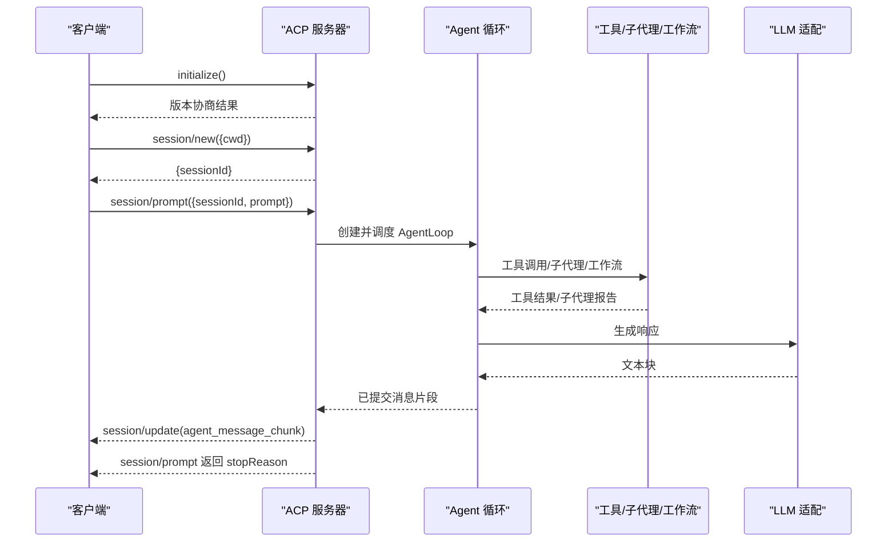
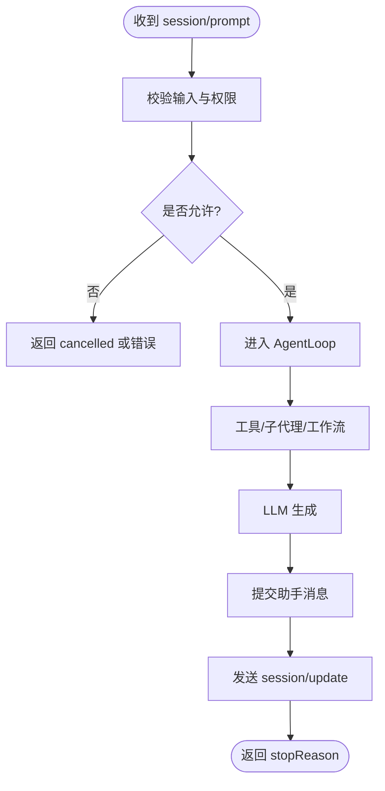
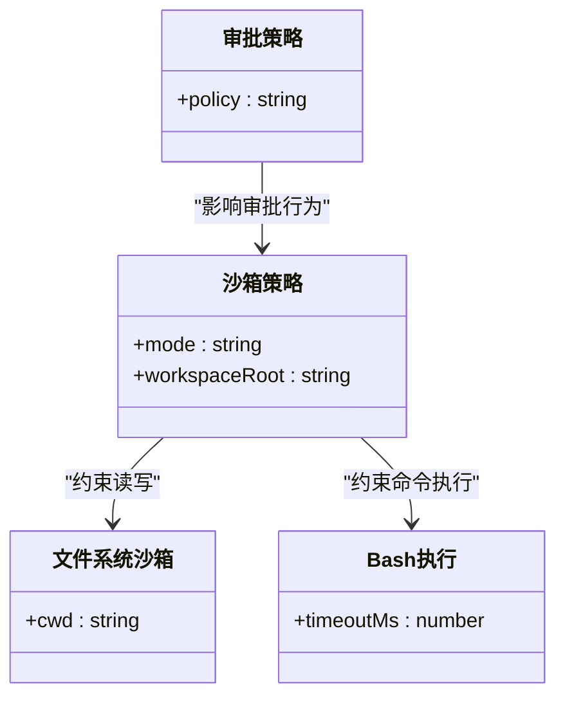
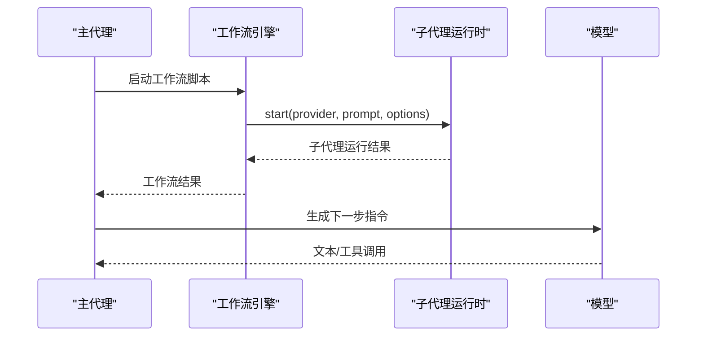
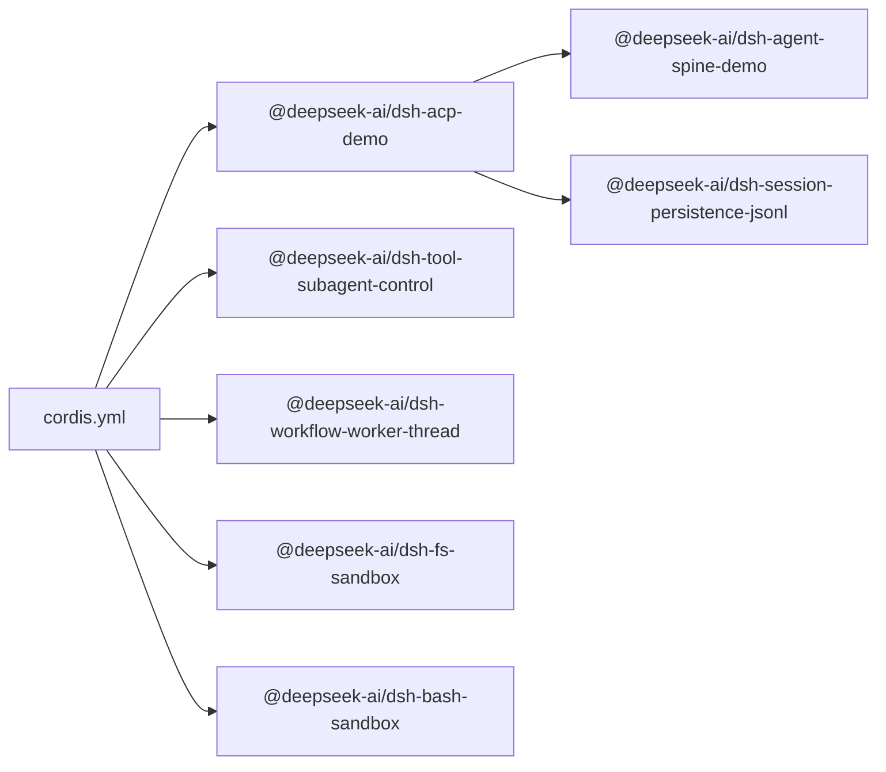
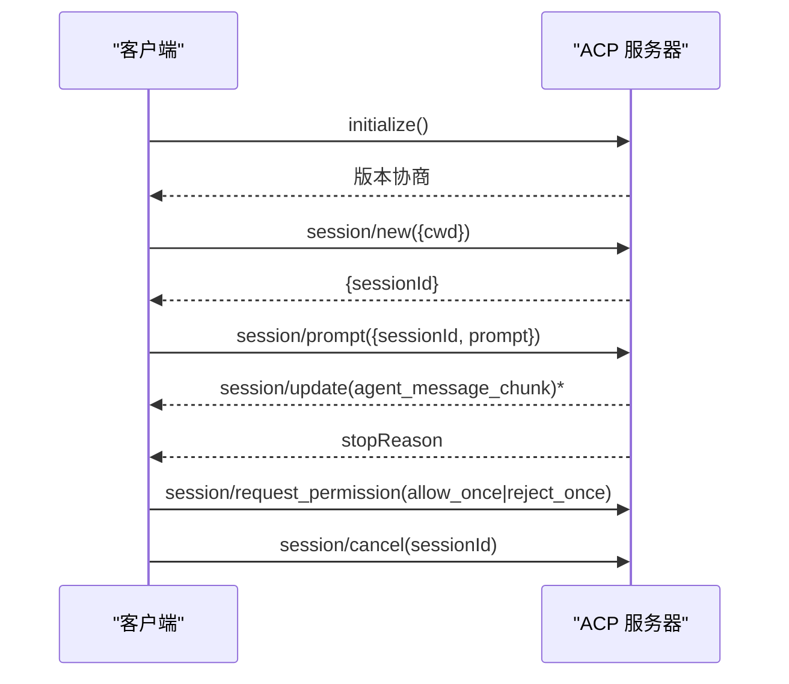

# ACP Agent 示例

<cite>
**本文引用的文件**
- [examples/acp-agent/README.md](file://examples/acp-agent/README.md)
- [examples/acp-agent/cordis.yml](file://examples/acp-agent/cordis.yml)
- [examples/acp-agent/composition.md](file://examples/acp-agent/composition.md)
- [packages/acp/README.md](file://packages/acp/README.md)
- [packages/acp/acp/README.md](file://packages/acp/acp/README.md)
- [examples/acp-agent/tests/acp.e2e.ts](file://examples/acp-agent/tests/acp.e2e.ts)
- [examples/acp-agent/advanced.cordis.yml](file://examples/acp-agent/advanced.cordis.yml)
- [examples/acp-agent/cordis-tools.cordis.yml](file://examples/acp-agent/cordis-tools.cordis.yml)
- [apps/cli/reference/README.md](file://apps/cli/reference/README.md)
- [packages/hooks/hooks-claude-code/src/index.ts](file://packages/hooks/hooks-claude-code/src/index.ts)
- [packages/workflow/workflow-worker-thread/src/host.ts](file://packages/workflow/workflow-worker-thread/src/host.ts)
- [packages/workflow/workflow-worker-thread/src/index.ts](file://packages/workflow/workflow-worker-thread/src/index.ts)
</cite>

## 目录
1. [简介](#简介)
2. [项目结构](#项目结构)
3. [核心组件](#核心组件)
4. [架构总览](#架构总览)
5. [详细组件分析](#详细组件分析)
6. [依赖关系分析](#依赖关系分析)
7. [性能与可观测性](#性能与可观测性)
8. [启动与配置指南](#启动与配置指南)
9. [使用示例与编程交互](#使用示例与编程交互)
10. [故障排除指南](#故障排除指南)
11. [最佳实践](#最佳实践)
12. [结论](#结论)

## 简介
本示例实现了一个面向自动化的 Agent Client Protocol（ACP）服务器，通过 JSON-RPC stdio 暴露能力，供父代理、子代理提供者或其他程序化客户端调用。它不承载用户界面，而是专注于协议通道、会话管理、权限控制与沙箱机制，并提供子代理、工作流与钩子的集成演示。

## 项目结构
该示例位于 examples/acp-agent，核心由一个 Cordis 配置文件驱动，组合了 LLM 适配、沙箱策略、子进程、Bash 执行、审批策略、ACP 自动化桥接、令牌计量、压缩、会话投影、子代理工具、工作流引擎、文件系统沙箱与观察策略、以及多种钩子桥接。

```mermaid
graph TB
cfg["示例配置<br/>examples/acp-agent/cordis.yml"]
acp_demo["ACP 自动化服务<br/>@deepseek-ai/dsh-acp-demo"]
llm_deepseek["LLM DeepSeek 适配<br/>@deepseek-ai/dsh-llm-deepseek"]
sandbox_policy["沙箱策略<br/>@deepseek-ai/dsh-sandbox-policy"]
subprocess["子进程管理<br/>@deepseek-ai/dsh-subprocess-local"]
bash_exec["沙箱 Bash 执行<br/>@deepseek-ai/dsh-bash-sandbox"]
approval["审批策略<br/>@deepseek-ai/dsh-user-approval"]
token_meter["令牌计量<br/>@deepseek-ai/dsh-token-meter"]
compaction["上下文压缩<br/>@deepseek-ai/dsh-compaction-basic"]
session_proj["会话投影<br/>@deepseek-ai/dsh-session-projection"]
subagent_tools["子代理工具集<br/>@deepseek-ai/dsh-tool-subagent*"]
workflow_engine["工作流引擎<br/>@deepseek-ai/dsh-workflow-worker-thread"]
fs_sandbox["文件系统沙箱<br/>@deepseek-ai/dsh-fs-sandbox"]
fs_obs["文件观察策略<br/>@deepseek-ai/dsh-fs-observation-policy"]
hooks_cc["Claude Code 钩子桥<br/>@deepseek-ai/dsh-hooks-claude-code"]
hooks_codex["Codex 钩子桥<br/>@deepseek-ai/dsh-hooks-codex"]
cfg --> acp_demo
cfg --> llm_deepseek
cfg --> sandbox_policy
cfg --> subprocess
cfg --> bash_exec
cfg --> approval
cfg --> token_meter
cfg --> compaction
cfg --> session_proj
cfg --> subagent_tools
cfg --> workflow_engine
cfg --> fs_sandbox
cfg --> fs_obs
cfg --> hooks_cc
cfg --> hooks_codex
```

图表来源
- [examples/acp-agent/cordis.yml:1-193](file://examples/acp-agent/cordis.yml#L1-L193)
- [examples/acp-agent/composition.md:1-110](file://examples/acp-agent/composition.md#L1-L110)

章节来源
- [examples/acp-agent/README.md:1-25](file://examples/acp-agent/README.md#L1-L25)
- [examples/acp-agent/cordis.yml:1-193](file://examples/acp-agent/cordis.yml#L1-L193)
- [examples/acp-agent/composition.md:1-110](file://examples/acp-agent/composition.md#L1-L110)

## 核心组件
- ACP 自动化桥：在 stdin/stdout 上建立连接，驱动会话创建、提示提交、取消与权限协商，仅输出协议帧到 stdout。
- LLM 适配：DeepSeek 适配器提供模型路由与推理能力。
- 沙箱与策略：通过策略决定 workspace-write 或 danger-full-access；Bash 与文件系统操作受策略约束。
- 审批策略：根据模式选择 ask 或 never。
- 子代理与工作流：支持 spawn/fork 两种子代理方式，以及工作流脚本在 worker 线程中运行。
- 钩子：同时支持 Claude Code 与 Codex 的钩子协议，注入上下文或拦截行为。
- 持久化与压缩：会话以 JSONL 持久化，默认启用 zstd 压缩（快照模式关闭）。

章节来源
- [packages/acp/acp/README.md:1-82](file://packages/acp/acp/README.md#L1-L82)
- [examples/acp-agent/cordis.yml:1-193](file://examples/acp-agent/cordis.yml#L1-L193)

## 架构总览
下图展示了从客户端到 ACP 服务器的端到端流程：客户端通过 JSON-RPC stdio 与服务器通信，服务器创建会话并驱动 AgentLoop，结合工具、子代理与工作流完成请求，并通过 session/update 推送已提交的助手消息片段。

图表来源
- [packages/acp/acp/README.md:20-44](file://packages/acp/acp/README.md#L20-L44)
- [examples/acp-agent/cordis.yml:47-66](file://examples/acp-agent/cordis.yml#L47-L66)

## 详细组件分析

### ACP 协议与 JSON-RPC stdio
- 协议方法：initialize、session/new、session/prompt、session/cancel、session/update、session/request_permission。
- 传输契约：stdout 仅承载换行分隔的 JSON-RPC 帧；stderr 用于诊断。
- 会话隔离：每个 session/new 携带绝对 cwd，独立上下文、取消路径与生命周期。
- 权限协商：一次允许/拒绝选择，应用于当前重试，记录在工具结果审计路径中。

图表来源
- [packages/acp/acp/README.md:20-44](file://packages/acp/acp/README.md#L20-L44)
- [examples/acp-agent/README.md:14-25](file://examples/acp-agent/README.md#L14-L25)

章节来源
- [packages/acp/README.md:1-12](file://packages/acp/README.md#L1-L12)
- [packages/acp/acp/README.md:1-82](file://packages/acp/acp/README.md#L1-L82)
- [examples/acp-agent/README.md:14-25](file://examples/acp-agent/README.md#L14-L25)

### 会话管理与工作区
- 工作区：每个会话的 cwd 为绝对路径，Bash 与文件系统写入按策略限制在该工作区与临时根。
- 持久化：会话落盘为 JSONL，可通过环境变量切换存储根与压缩策略。
- 标题与上下文：系统提示包含 {{model}} 与 {{cwd}} 占位符，工作区上下文大小受限。

章节来源
- [examples/acp-agent/cordis.yml:47-66](file://examples/acp-agent/cordis.yml#L47-L66)
- [examples/acp-agent/README.md:20-25](file://examples/acp-agent/README.md#L20-L25)

### 权限控制与沙箱机制
- 模式选择：DSH_PERMISSION_MODE 决定部署级策略（workspace-write 或 danger-full-access）。
- 审批策略：根据模式选择 ask 或 never。
- 文件系统：fs-sandbox 与 fs-observation-policy 配合，确保读写编辑受控并可观察。
- Bash：受同一策略约束，失败时触发权限请求，客户端可一次性允许或拒绝。

图表来源
- [examples/acp-agent/cordis.yml:24-46](file://examples/acp-agent/cordis.yml#L24-L46)
- [examples/acp-agent/cordis.yml:160-175](file://examples/acp-agent/cordis.yml#L160-L175)

章节来源
- [examples/acp-agent/cordis.yml:24-46](file://examples/acp-agent/cordis.yml#L24-L46)
- [examples/acp-agent/cordis.yml:160-175](file://examples/acp-agent/cordis.yml#L160-L175)
- [apps/cli/reference/README.md:68-72](file://apps/cli/reference/README.md#L68-L72)

### 子代理与工作流
- 子代理：支持 spawn 与 fork 两种方式，分别通过 tool-subagent 与 tool-subagent-fork 暴露；支持可继续后台子代理与一次性子代理。
- 工作流：通过 worker-thread 引擎在独立线程中运行脚本，支持并发与超时控制，事件围绕 run 生命周期发布。

图表来源
- [examples/acp-agent/cordis.yml:137-154](file://examples/acp-agent/cordis.yml#L137-L154)
- [packages/workflow/workflow-worker-thread/src/host.ts:132-383](file://packages/workflow/workflow-worker-thread/src/host.ts#L132-L383)
- [packages/workflow/workflow-worker-thread/src/index.ts:106-131](file://packages/workflow/workflow-worker-thread/src/index.ts#L106-L131)

章节来源
- [examples/acp-agent/cordis.yml:87-154](file://examples/acp-agent/cordis.yml#L87-L154)
- [packages/workflow/workflow-worker-thread/src/host.ts:132-383](file://packages/workflow/workflow-worker-thread/src/host.ts#L132-L383)
- [packages/workflow/workflow-worker-thread/src/index.ts:106-131](file://packages/workflow/workflow-worker-thread/src/index.ts#L106-L131)

### 钩子功能
- Claude Code 钩子：读取 hooks.json，监听 SubagentStart/SubagentStop 等事件，向子代理注入上下文。
- Codex 钩子：使用 codex-hooks.json，遵循五事件方言，同样进程级、读一次、缺失即无操作。
- 日志：钩子警告通过 ctx.logger 输出，不污染 stdout。

章节来源
- [examples/acp-agent/cordis.yml:176-193](file://examples/acp-agent/cordis.yml#L176-L193)
- [packages/hooks/hooks-claude-code/src/index.ts:279-304](file://packages/hooks/hooks-claude-code/src/index.ts#L279-L304)

## 依赖关系分析
- 配置驱动：cordis.yml 声明所有插件与配置，composition.md 自动生成依赖图。
- 关键依赖链：
  - acp-demo 依赖 agent-spine-demo、JSONL 持久化与 ACP 协议桥。
  - 子代理工具依赖 subagent-control、list-agents、report 等模块。
  - 工作流引擎依赖 subagents 运行时与 worker 线程。
  - 文件系统与 Bash 共享同一沙箱策略。

图表来源
- [examples/acp-agent/composition.md:1-110](file://examples/acp-agent/composition.md#L1-L110)
- [examples/acp-agent/cordis.yml:1-193](file://examples/acp-agent/cordis.yml#L1-L193)

章节来源
- [examples/acp-agent/composition.md:1-110](file://examples/acp-agent/composition.md#L1-L110)

## 性能与可观测性
- 令牌计量：token-meter 对请求压力进行回放感知控制。
- 上下文压缩：compaction-basic 在达到阈值时压缩历史，保留比例与最大 token 数可调。
- 输出纯净：stdout 仅承载协议帧，便于自动化管道解析；stderr 用于诊断。
- 持久化：JSONL 会话日志支持快照与回放，压缩策略可按环境切换。

章节来源
- [examples/acp-agent/cordis.yml:67-79](file://examples/acp-agent/cordis.yml#L67-L79)
- [examples/acp-agent/README.md:14-19](file://examples/acp-agent/README.md#L14-L19)

## 启动与配置指南
- 环境变量
  - DEEPSEEK_API_KEY：用于 DeepSeek 适配器启动与调用（测试可用虚拟值引导启动）。
  - DSH_PERMISSION_MODE：选择 workspace-write 或 danger-full-access。
  - DSH_SNAPSHOT_SESSIONS_ROOT：设置会话持久化根（快照模式常用）。
  - DSH_SNAPSHOT：控制会话日志压缩策略（快照模式关闭压缩）。
- 工作区配置
  - 每个 session/new 传入绝对 cwd，作为该会话的工作区根。
  - 工作区上下文大小可通过 workspaceContext.maxBytes 调整。
- 权限模式
  - workspace-write：限制写入至工作区与临时根，超出需审批。
  - danger-full-access：放宽限制，适合快照与测试场景。

章节来源
- [examples/acp-agent/README.md:7-25](file://examples/acp-agent/README.md#L7-L25)
- [examples/acp-agent/cordis.yml:24-66](file://examples/acp-agent/cordis.yml#L24-L66)
- [apps/cli/reference/README.md:68-72](file://apps/cli/reference/README.md#L68-L72)

## 使用示例与编程交互
- 启动示例
  - 使用仓库脚本启动 ACP 自动化服务器，或通过子进程直接运行 bin 入口。
- 编程交互步骤
  - initialize：协商协议版本与能力。
  - session/new：创建新会话，传入 cwd。
  - session/prompt：提交文本提示，等待 stopReason。
  - session/update：接收已提交的助手消息片段。
  - session/request_permission：对权限请求进行一次性允许或拒绝。
  - session/cancel：取消指定会话的待处理提示。
- 子代理与工作流
  - 通过工具调用子代理（spawn/fork），或在脚本中调用 agent() 创建工作流任务。
- 钩子
  - 配置 hooks.json 或 codex-hooks.json，监听事件并向子代理注入上下文。

图表来源
- [packages/acp/acp/README.md:20-44](file://packages/acp/acp/README.md#L20-L44)
- [examples/acp-agent/tests/acp.e2e.ts:42-127](file://examples/acp-agent/tests/acp.e2e.ts#L42-L127)

章节来源
- [examples/acp-agent/tests/acp.e2e.ts:42-127](file://examples/acp-agent/tests/acp.e2e.ts#L42-L127)
- [packages/acp/acp/README.md:20-44](file://packages/acp/acp/README.md#L20-L44)

## 故障排除指南
- stdout 污染问题
  - 现象：stdout 出现非 JSON 行。
  - 排查：确认未将日志打印到 stdout；诊断应使用 stderr。
- 会话创建失败
  - 现象：session/new 抛出内部错误。
  - 排查：检查依赖注入与加载顺序；确保 provider/model 配置正确。
- 权限被拒
  - 现象：Bash 或文件系统操作返回“访问被拒绝”。
  - 排查：确认 DSH_PERMISSION_MODE 与审批策略；必要时通过 session/request_permission 一次性允许。
- 子代理/工作流异常
  - 现象：子代理启动失败或工作流 worker 崩溃。
  - 排查：查看 worker 错误与消息反序列化错误；检查并发与超时配置。
- 钩子无效
  - 现象：钩子未生效。
  - 排查：确认 hooks.json 或 codex-hooks.json 路径存在且格式正确；钩子警告通过 ctx.logger 输出。

章节来源
- [examples/acp-agent/README.md:14-19](file://examples/acp-agent/README.md#L14-L19)
- [examples/acp-agent/tests/acp.e2e.ts:42-98](file://examples/acp-agent/tests/acp.e2e.ts#L42-L98)
- [packages/hooks/hooks-claude-code/src/index.ts:279-304](file://packages/hooks/hooks-claude-code/src/index.ts#L279-L304)
- [packages/workflow/workflow-worker-thread/src/host.ts:132-154](file://packages/workflow/workflow-worker-thread/src/host.ts#L132-L154)

## 最佳实践
- 保持 stdout 纯净：仅输出协议帧，避免调试信息泄漏。
- 明确工作区：每次 session/new 传入绝对 cwd，确保隔离与可重现。
- 合理选择权限模式：开发/测试可使用 danger-full-access，生产推荐 workspace-write。
- 控制上下文大小：调整 workspaceContext.maxBytes 以平衡性能与效果。
- 利用压缩与持久化：启用 zstd 压缩以减少磁盘占用，便于回放与分析。
- 谨慎使用钩子：仅在必要时注入上下文或拦截行为，避免复杂化流程。
- 监控令牌与压缩：结合 token-meter 与 compaction 控制资源消耗。

[本节为通用指导，无需具体文件引用]

## 结论
该示例提供了一个完整、可复用的 ACP 自动化服务器实现，涵盖 JSON-RPC stdio 通信、会话管理、权限控制与沙箱机制，并集成了子代理、工作流与钩子能力。通过清晰的环境变量与配置项，开发者可以快速搭建面向自动化的 Agent 服务，并在不同环境中灵活调整权限与性能参数。

[本节为总结，无需具体文件引用]