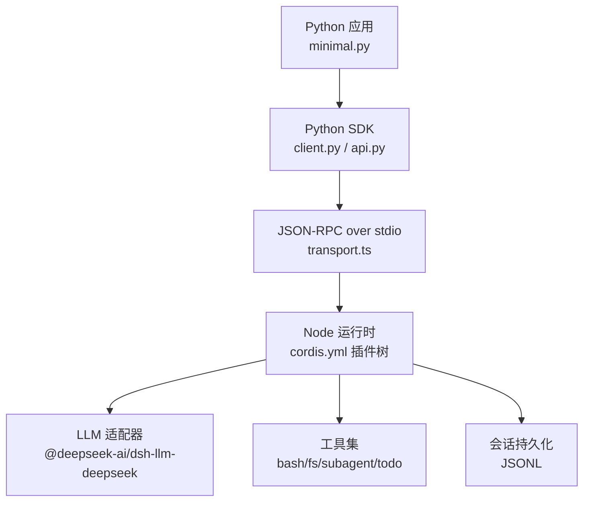
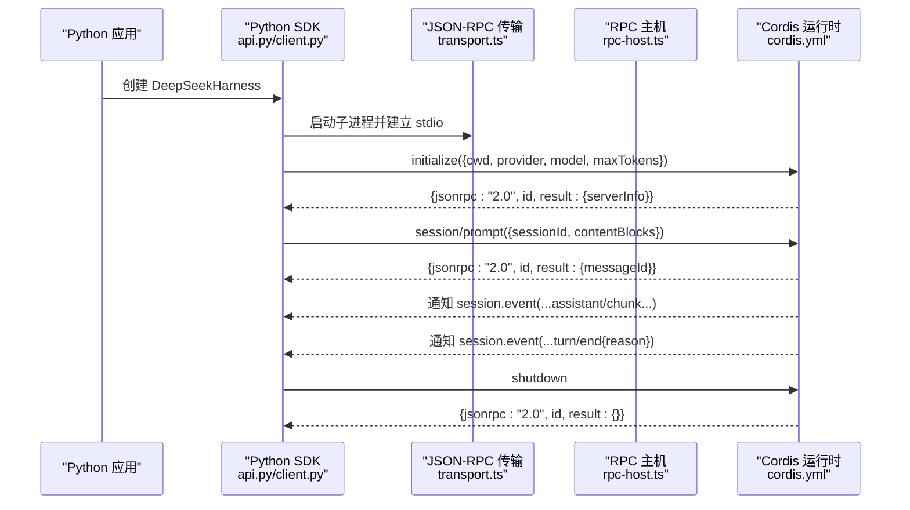
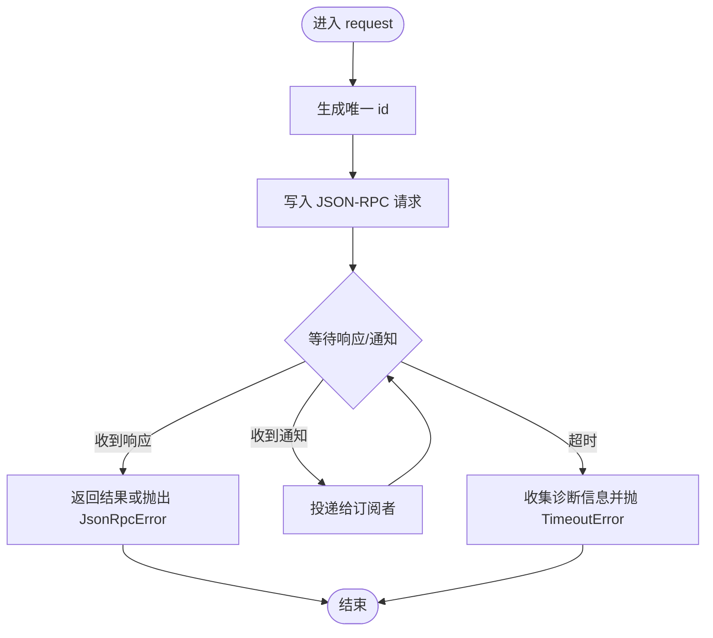
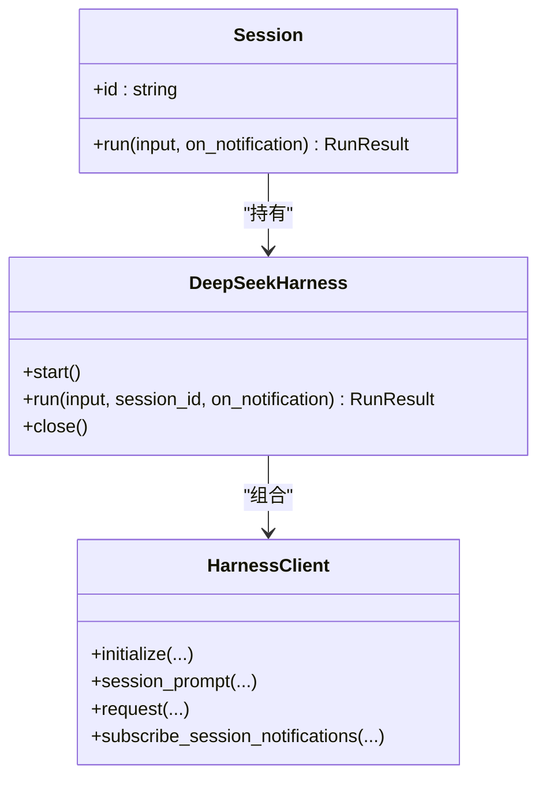
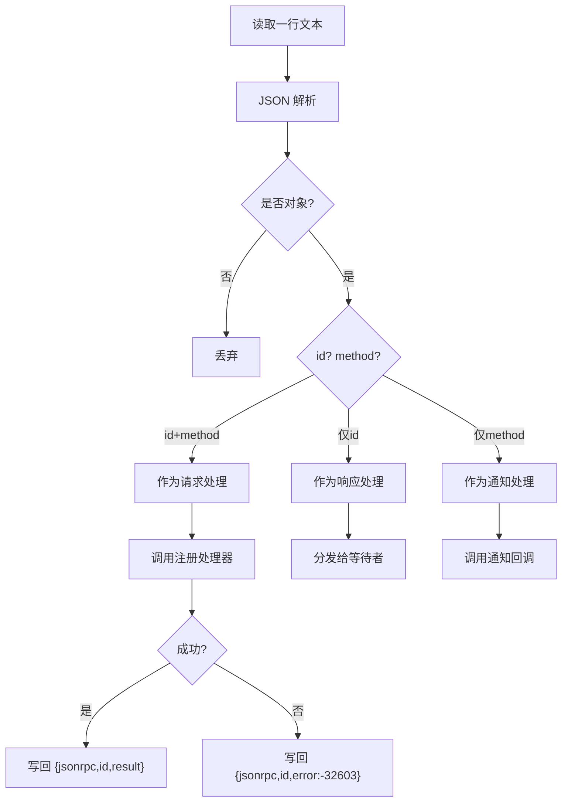
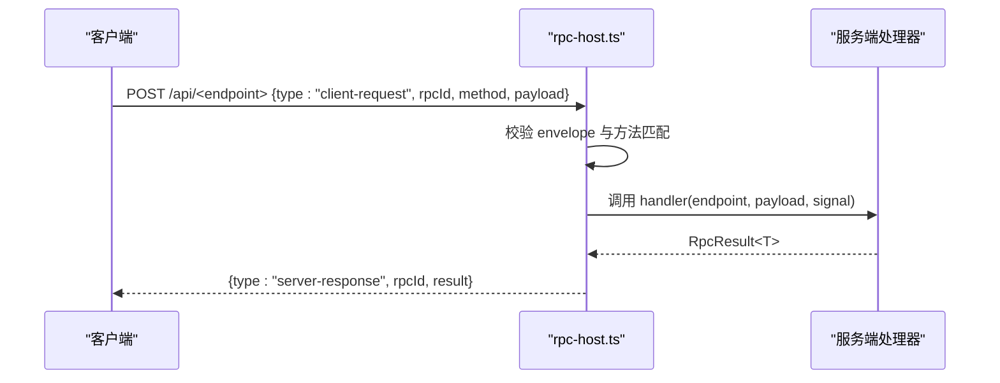
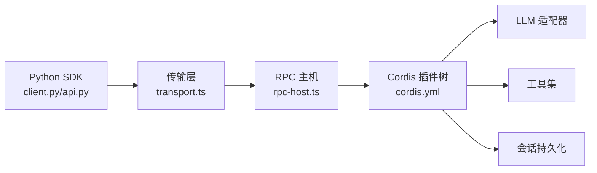

# JSON-RPC 接口示例

<cite>
**本文引用的文件**
- [examples/jsonrpc-agent/README.md](file://examples/jsonrpc-agent/README.md)
- [examples/jsonrpc-agent/minimal.py](file://examples/jsonrpc-agent/minimal.py)
- [examples/jsonrpc-agent/cordis.yml](file://examples/jsonrpc-agent/cordis.yml)
- [python/sdk/src/deepseek_harness/client.py](file://python/sdk/src/deepseek_harness/client.py)
- [python/sdk/src/deepseek_harness/api.py](file://python/sdk/src/deepseek_harness/api.py)
- [python/sdk/src/deepseek_harness/errors.py](file://python/sdk/src/deepseek_harness/errors.py)
- [python/sdk/src/deepseek_harness/models.py](file://python/sdk/src/deepseek_harness/models.py)
- [packages/sdk/protocol/src/transport.ts](file://packages/sdk/protocol/src/transport.ts)
- [packages/client/connection/src/rpc-host.ts](file://packages/client/connection/src/rpc-host.ts)
- [packages/host/apiproxy/src/api/rpc.ts](file://packages/host/apiproxy/src/api/rpc.ts)
- [examples/jsonrpc-agent/tests/keyless-smoke.e2e.ts](file://examples/jsonrpc-agent/tests/keyless-smoke.e2e.ts)
</cite>

## 目录
1. [简介](#简介)
2. [项目结构](#项目结构)
3. [核心组件](#核心组件)
4. [架构总览](#架构总览)
5. [详细组件分析](#详细组件分析)
6. [依赖关系分析](#依赖关系分析)
7. [性能考虑](#性能考虑)
8. [故障排查指南](#故障排查指南)
9. [结论](#结论)
10. [附录：跨语言客户端示例与调试技巧](#附录跨语言客户端示例与调试技巧)

## 简介
本文件围绕仓库中的“JSON-RPC 接口示例”进行系统化说明，重点解释 JSON-RPC 协议在 Python SDK 与运行时之间的实现与通信机制，涵盖消息格式、错误处理、连接管理；并给出使用 Python SDK 与 JSON-RPC 服务交互的完整流程（初始化、方法调用、结果处理）。同时提供 JavaScript 侧的对接思路与示例片段路径，帮助实现跨语言的 Agent 通信。文档还包含协议规范要点、调试技巧与性能建议。

## 项目结构
该示例由三部分构成：
- Python SDK 高层封装：提供面向用户的 API（DeepSeekHarness、Session），负责启动子进程、建立 JSON-RPC over stdio 通道、发送 initialize/session/prompt/shutdown 等请求，以及订阅 session.event 通知。
- JSON-RPC 运行时（Node.js）：通过 Cordis 配置加载插件树，暴露 initialize、session/prompt、shutdown 等方法，并以 JSONL 行式 JSON-RPC 与 Python 客户端通信。
- 测试与最小化示例：演示如何通过命令行或脚本驱动一次完整的对话回合，并验证行为（包括 max-tokens 的处理策略）。

图示来源
- [examples/jsonrpc-agent/minimal.py:16-39](file://examples/jsonrpc-agent/minimal.py#L16-L39)
- [python/sdk/src/deepseek_harness/client.py:63-116](file://python/sdk/src/deepseek_harness/client.py#L63-L116)
- [packages/sdk/protocol/src/transport.ts:158-238](file://packages/sdk/protocol/src/transport.ts#L158-L238)
- [examples/jsonrpc-agent/cordis.yml:1-90](file://examples/jsonrpc-agent/cordis.yml#L1-L90)

章节来源
- [examples/jsonrpc-agent/README.md:1-41](file://examples/jsonrpc-agent/README.md#L1-L41)
- [examples/jsonrpc-agent/minimal.py:16-39](file://examples/jsonrpc-agent/minimal.py#L16-L39)
- [examples/jsonrpc-agent/cordis.yml:1-90](file://examples/jsonrpc-agent/cordis.yml#L1-L90)

## 核心组件
- Python SDK 客户端 HarnessClient：以子进程方式启动运行时，维护读写线程，解析 JSONL 行，分发响应、通知与入站请求；支持超时、关闭与诊断信息收集。
- 高层 API DeepSeekHarness/Session：封装 initialize、session/prompt、shutdown 的生命周期，聚合事件流，提取最终回复与结束原因。
- JSON-RPC 传输层 transport.ts：按行读取 JSON，识别请求/响应/通知三类帧，路由到对应处理器，并生成标准错误帧。
- RPC 主机 rpc-host.ts：HTTP 端点上的信封校验与方法匹配，返回统一的结果包装。
- 协议类型 rpc.ts：定义四象限消息模型（client-request/server-response/server-request/client-response）、错误码与细节映射、RpcResult 等。

章节来源
- [python/sdk/src/deepseek_harness/client.py:37-116](file://python/sdk/src/deepseek_harness/client.py#L37-L116)
- [python/sdk/src/deepseek_harness/api.py:48-183](file://python/sdk/src/deepseek_harness/api.py#L48-L183)
- [packages/sdk/protocol/src/transport.ts:158-238](file://packages/sdk/protocol/src/transport.ts#L158-L238)
- [packages/client/connection/src/rpc-host.ts:160-198](file://packages/client/connection/src/rpc-host.ts#L160-L198)
- [packages/host/apiproxy/src/api/rpc.ts:148-194](file://packages/host/apiproxy/src/api/rpc.ts#L148-L194)

## 架构总览
下图展示从 Python 应用到 Node 运行时的端到端调用序列，包括初始化、提示词提交、事件通知与关闭。

图示来源
- [examples/jsonrpc-agent/tests/keyless-smoke.e2e.ts:104-159](file://examples/jsonrpc-agent/tests/keyless-smoke.e2e.ts#L104-L159)
- [python/sdk/src/deepseek_harness/api.py:97-124](file://python/sdk/src/deepseek_harness/api.py#L97-L124)
- [python/sdk/src/deepseek_harness/client.py:117-183](file://python/sdk/src/deepseek_harness/client.py#L117-L183)
- [packages/sdk/protocol/src/transport.ts:201-238](file://packages/sdk/protocol/src/transport.ts#L201-L238)
- [packages/client/connection/src/rpc-host.ts:160-198](file://packages/client/connection/src/rpc-host.ts#L160-L198)

## 详细组件分析

### Python SDK 客户端 HarnessClient
- 职责：启动/关闭运行时子进程；维护请求-响应对应表；解析 JSONL 行；分发响应、通知与入站请求；收集 stderr 用于诊断。
- 关键流程：
  - start/close：子进程生命周期管理，优雅关闭并清理等待者。
  - initialize/session_prompt/request/notify：构造 JSON-RPC 消息，写入 stdin，等待响应或通知。
  - _reader_loop/_handle_message：逐行解析，区分请求/响应/通知，投递到队列或订阅者。
  - 错误与诊断：TransportClosedError、JsonRpcError 及运行时退出码、stderr 尾部输出。

图示来源
- [python/sdk/src/deepseek_harness/client.py:157-296](file://python/sdk/src/deepseek_harness/client.py#L157-L296)
- [python/sdk/src/deepseek_harness/client.py:318-397](file://python/sdk/src/deepseek_harness/client.py#L318-L397)
- [python/sdk/src/deepseek_harness/errors.py:4-23](file://python/sdk/src/deepseek_harness/errors.py#L4-L23)

章节来源
- [python/sdk/src/deepseek_harness/client.py:37-116](file://python/sdk/src/deepseek_harness/client.py#L37-L116)
- [python/sdk/src/deepseek_harness/client.py:157-296](file://python/sdk/src/deepseek_harness/client.py#L157-L296)
- [python/sdk/src/deepseek_harness/client.py:318-397](file://python/sdk/src/deepseek_harness/client.py#L318-L397)
- [python/sdk/src/deepseek_harness/errors.py:4-23](file://python/sdk/src/deepseek_harness/errors.py#L4-L23)

### 高层 API：DeepSeekHarness 与 Session
- DeepSeekHarness：封装运行时启动、initialize、run（内部创建 Session）、close。
- Session：将输入标准化为内容块，发起 session/prompt，订阅 session.event，直到 turn/end 且状态 idle，聚合 events 并提取 final_response 与 finish_reason。

图示来源
- [python/sdk/src/deepseek_harness/api.py:48-183](file://python/sdk/src/deepseek_harness/api.py#L48-L183)
- [python/sdk/src/deepseek_harness/client.py:117-183](file://python/sdk/src/deepseek_harness/client.py#L117-L183)

章节来源
- [python/sdk/src/deepseek_harness/api.py:48-183](file://python/sdk/src/deepseek_harness/api.py#L48-L183)

### JSON-RPC 传输层（Node 侧）
- 行式协议：每行一个 JSON 对象，包含 jsonrpc、id/method、params/result/error。
- 帧识别：有 id+method 视为请求；仅有 id 视为响应；仅有 method 视为通知。
- 错误处理：未找到处理器时返回 -32601；其他异常返回 -32603。

图示来源
- [packages/sdk/protocol/src/transport.ts:201-238](file://packages/sdk/protocol/src/transport.ts#L201-L238)

章节来源
- [packages/sdk/protocol/src/transport.ts:158-238](file://packages/sdk/protocol/src/transport.ts#L158-L238)

### HTTP 端点与信封校验（rpc-host）
- 接收 POST 请求体，解析为 ClientRequest，校验 envelope 与方法名是否与端点一致。
- 成功则调用 handler 并返回 ServerResponse；失败返回 bad-request 或 internal 错误。

图示来源
- [packages/client/connection/src/rpc-host.ts:160-198](file://packages/client/connection/src/rpc-host.ts#L160-L198)
- [packages/host/apiproxy/src/api/rpc.ts:148-194](file://packages/host/apiproxy/src/api/rpc.ts#L148-L194)

章节来源
- [packages/client/connection/src/rpc-host.ts:160-198](file://packages/client/connection/src/rpc-host.ts#L160-L198)
- [packages/host/apiproxy/src/api/rpc.ts:148-194](file://packages/host/apiproxy/src/api/rpc.ts#L148-L194)

### 运行时配置与插件树（cordis.yml）
- 启用 JSON-RPC 服务器插件，设置 maxTokensAsSuccess 策略。
- 加载 LLM 适配器、子进程/终端、文件系统、子代理、任务工具、令牌计量与上下文压缩等插件。
- 环境变量注入工作目录、会话根、系统提示等。

章节来源
- [examples/jsonrpc-agent/cordis.yml:1-90](file://examples/jsonrpc-agent/cordis.yml#L1-L90)
- [examples/jsonrpc-agent/README.md:16-41](file://examples/jsonrpc-agent/README.md#L16-L41)

## 依赖关系分析
- Python SDK 依赖 Node 运行时提供的 JSON-RPC 能力；运行时通过 Cordis 插件体系组合功能。
- 传输层与 RPC 主机解耦：前者负责行式 JSON-RPC，后者负责 HTTP 信封与路由。
- 错误模型统一：业务错误通过 RpcResult.error 表达，传输层错误通过 JSON-RPC error 字段表达。

图示来源
- [python/sdk/src/deepseek_harness/client.py:63-116](file://python/sdk/src/deepseek_harness/client.py#L63-L116)
- [packages/sdk/protocol/src/transport.ts:158-238](file://packages/sdk/protocol/src/transport.ts#L158-L238)
- [packages/client/connection/src/rpc-host.ts:160-198](file://packages/client/connection/src/rpc-host.ts#L160-L198)
- [examples/jsonrpc-agent/cordis.yml:1-90](file://examples/jsonrpc-agent/cordis.yml#L1-L90)

章节来源
- [python/sdk/src/deepseek_harness/client.py:63-116](file://python/sdk/src/deepseek_harness/client.py#L63-L116)
- [packages/sdk/protocol/src/transport.ts:158-238](file://packages/sdk/protocol/src/transport.ts#L158-L238)
- [packages/client/connection/src/rpc-host.ts:160-198](file://packages/client/connection/src/rpc-host.ts#L160-L198)
- [examples/jsonrpc-agent/cordis.yml:1-90](file://examples/jsonrpc-agent/cordis.yml#L1-L90)

## 性能考虑
- 行式 JSON-RPC 低开销：按行解析与写入，避免额外序列化开销。
- 并发与超时：Python 侧通过队列与线程处理响应与通知，支持请求级超时与优雅关闭。
- 上下文压缩：运行时可启用压缩以减少会话体积，提升 I/O 效率。
- 工具并行：todo_write 等工具允许并行执行，提高吞吐。

[本节为通用指导，不直接分析具体文件]

## 故障排查指南
- 常见错误类型：
  - TransportClosedError：运行时子进程退出或 stdout 关闭。
  - JsonRpcError：运行时返回 JSON-RPC 错误响应。
  - SdkProtocolError：SDK 协议层数据不符合预期（如 turn/end 缺少 reason.kind）。
- 诊断信息：
  - 捕获 stderr 尾部与进程退出码，便于定位崩溃原因。
  - 检查环境变量（如 DSH_MAX_TOKENS_AS_SUCCESS）是否正确解析。
- 典型问题定位：
  - 非 JSON 输出：确保运行时 stdout 仅输出 JSON-RPC 帧。
  - 方法不匹配：HTTP 端点要求 method 与路径一致，否则返回 bad-request。

章节来源
- [python/sdk/src/deepseek_harness/errors.py:4-23](file://python/sdk/src/deepseek_harness/errors.py#L4-L23)
- [python/sdk/src/deepseek_harness/client.py:399-422](file://python/sdk/src/deepseek_harness/client.py#L399-L422)
- [examples/jsonrpc-agent/tests/keyless-smoke.e2e.ts:178-201](file://examples/jsonrpc-agent/tests/keyless-smoke.e2e.ts#L178-L201)
- [packages/client/connection/src/rpc-host.ts:160-198](file://packages/client/connection/src/rpc-host.ts#L160-L198)

## 结论
本示例展示了基于 JSON-RPC 的跨语言 Agent 通信方案：Python SDK 通过 stdio 与 Node 运行时交互，利用 Cordis 插件体系灵活组合能力；传输层严格遵循 JSON-RPC 2.0 的行式协议，配合统一的错误模型与诊断信息，保障稳定性与可观测性。结合测试用例与最小化配置，可以快速搭建并验证端到端流程。

[本节为总结，不直接分析具体文件]

## 附录：跨语言客户端示例与调试技巧

### Python 客户端使用步骤
- 初始化：使用 DeepSeekHarness 传入 provider、model、max_tokens、workspace、session_root、cordis 等参数，并在上下文管理器中自动启动与关闭。
- 方法调用：调用 run 或显式创建 Session 后调用 session_prompt，提交内容块。
- 结果处理：从事件流中提取 final_response 与 finish_reason，必要时订阅 session.event 获取中间增量。

章节来源
- [examples/jsonrpc-agent/minimal.py:16-39](file://examples/jsonrpc-agent/minimal.py#L16-L39)
- [python/sdk/src/deepseek_harness/api.py:97-183](file://python/sdk/src/deepseek_harness/api.py#L97-L183)

### JavaScript 客户端对接要点
- 若通过 HTTP 端点访问，需构造 ClientRequest（type、rpcId、method、payload），并解析 ServerResponse。
- 若通过 JSON-RPC over stdio，需按行发送/接收 JSON，识别请求/响应/通知三类帧，并处理 -32601/-32603 错误。
- 参考测试用例中的行式协议驱动方式，模拟 initialize、session/prompt、shutdown 流程。

章节来源
- [packages/host/apiproxy/src/api/rpc.ts:148-194](file://packages/host/apiproxy/src/api/rpc.ts#L148-L194)
- [packages/sdk/protocol/src/transport.ts:201-238](file://packages/sdk/protocol/src/transport.ts#L201-L238)
- [examples/jsonrpc-agent/tests/keyless-smoke.e2e.ts:104-159](file://examples/jsonrpc-agent/tests/keyless-smoke.e2e.ts#L104-L159)

### 调试技巧
- 打印并校验 stdout/stderr：确保只有 JSON-RPC 帧输出到 stdout，其余日志走 stderr。
- 设置断点与快照：利用测试中的 waitForLine 模式，逐步验证每条消息是否符合预期。
- 环境变量校验：DSH_MAX_TOKENS_AS_SUCCESS 必须为布尔值字符串，否则会导致插件树加载失败。

章节来源
- [examples/jsonrpc-agent/tests/keyless-smoke.e2e.ts:16-46](file://examples/jsonrpc-agent/tests/keyless-smoke.e2e.ts#L16-L46)
- [examples/jsonrpc-agent/tests/keyless-smoke.e2e.ts:178-201](file://examples/jsonrpc-agent/tests/keyless-smoke.e2e.ts#L178-L201)