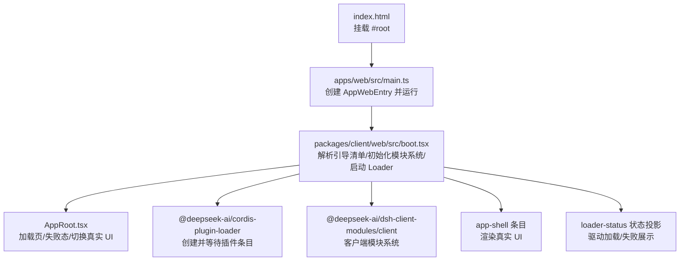
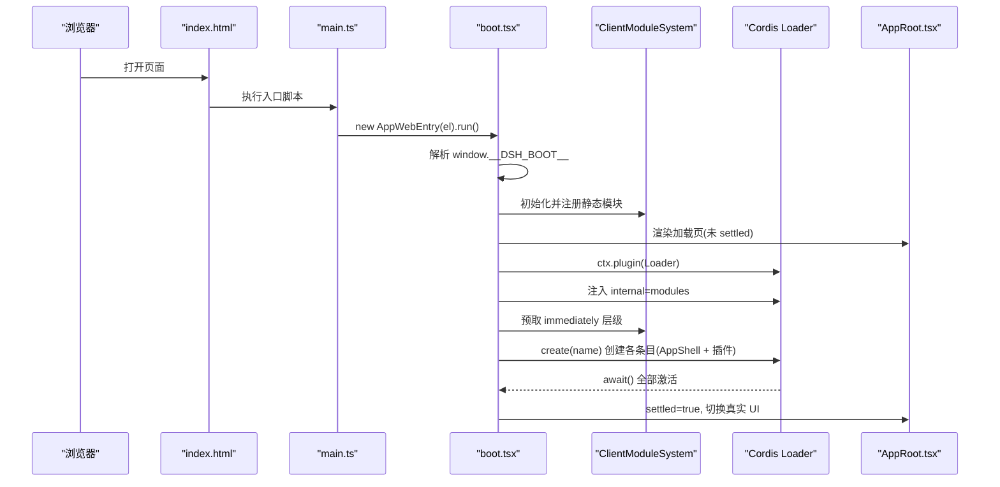
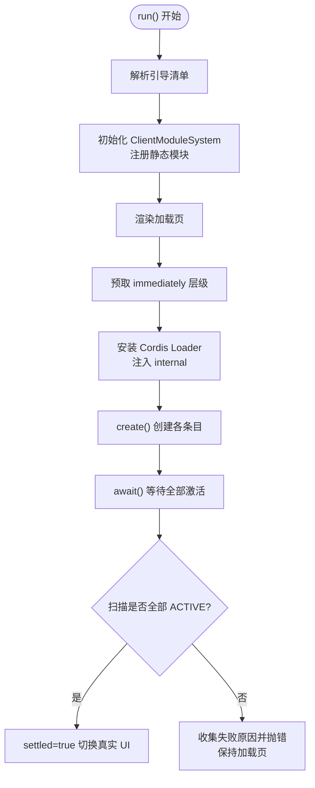
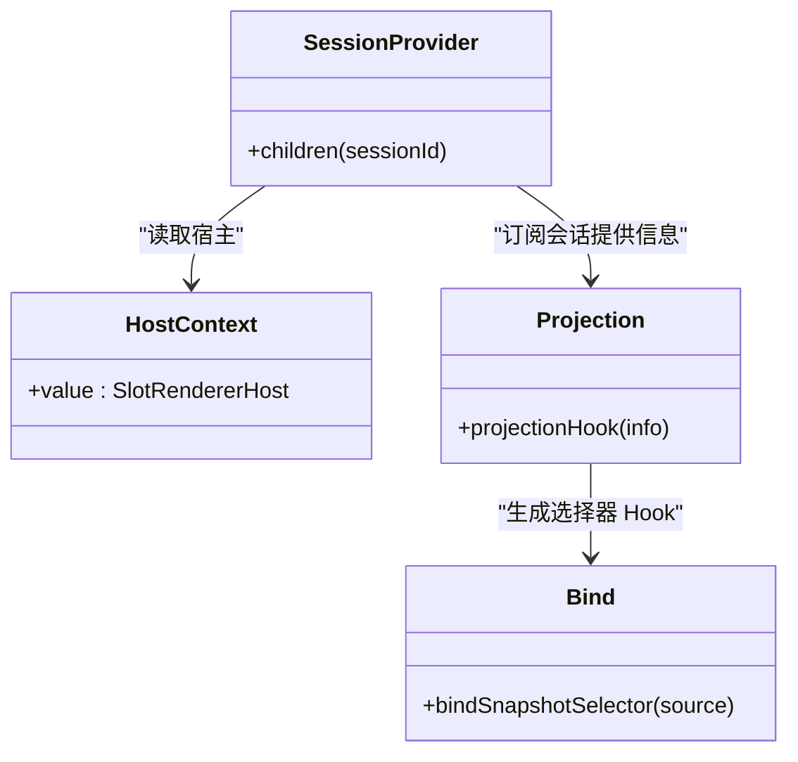
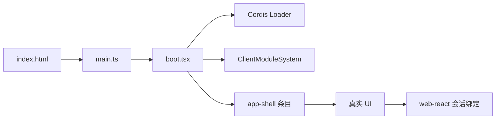

# Web 集成示例

<cite>
**本文引用的文件**
- [apps/web/src/main.ts](file://apps/web/src/main.ts)
- [apps/web/index.html](file://apps/web/index.html)
- [apps/web/vite.config.ts](file://apps/web/vite.config.ts)
- [apps/web/package.json](file://apps/web/package.json)
- [packages/client/web/src/boot.tsx](file://packages/client/web/src/boot.tsx)
- [packages/client/web/src/AppRoot.tsx](file://packages/client/web/src/AppRoot.tsx)
- [packages/client/web-react/src/session-provider.tsx](file://packages/client/web-react/src/session-provider.tsx)
- [packages/client/web-react/src/bind.ts](file://packages/client/web-react/src/bind.ts)
- [examples/web-cordis/README.md](file://examples/web-cordis/README.md)
- [examples/web-cordis/cordis.yml](file://examples/web-cordis/cordis.yml)
</cite>

## 目录
1. [简介](#简介)
2. [项目结构](#项目结构)
3. [核心组件](#核心组件)
4. [架构总览](#架构总览)
5. [详细组件分析](#详细组件分析)
6. [依赖关系分析](#依赖关系分析)
7. [性能与打包优化](#性能与打包优化)
8. [故障排查指南](#故障排查指南)
9. [结论](#结论)
10. [附录：部署与兼容性](#附录：部署与兼容性)

## 简介
本文件面向在 Web 环境中集成 DeepSeek Harness 的开发者，聚焦以下目标：
- 前端组件加载、状态管理与事件处理
- Cordis 插件系统在浏览器中的工作原理（模块打包、依赖管理、热重载）
- 完整的 React 应用示例：嵌入 Agent 能力、处理用户交互与管理会话状态
- 部署配置与浏览器兼容性说明

## 项目结构
Web 入口位于 apps/web，采用 Vite 构建，并通过别名将 @deepseek-ai/dsh-client-web 等包指向源码，以便在浏览器中编译 CSS 并启用开发体验。真正的壳层启动逻辑集中在 packages/client/web/src/boot.tsx，React 绑定与会话上下文在 packages/client/web-react 中提供。

图表来源
- [apps/web/index.html:1-15](file://apps/web/index.html#L1-L15)
- [apps/web/src/main.ts:1-11](file://apps/web/src/main.ts#L1-L11)
- [packages/client/web/src/boot.tsx:1-239](file://packages/client/web/src/boot.tsx#L1-L239)
- [packages/client/web/src/AppRoot.tsx:1-61](file://packages/client/web/src/AppRoot.tsx#L1-L61)

章节来源
- [apps/web/index.html:1-15](file://apps/web/index.html#L1-L15)
- [apps/web/src/main.ts:1-11](file://apps/web/src/main.ts#L1-L11)
- [apps/web/vite.config.ts:1-161](file://apps/web/vite.config.ts#L1-L161)
- [apps/web/package.json:1-52](file://apps/web/package.json#L1-L52)

## 核心组件
- 应用入口与挂载：index.html 提供 #root，main.ts 创建 AppWebEntry 并调用 run()。
- 引导内核：boot.tsx 负责解析引导清单、初始化客户端模块系统、注入 Loader、预取 immediately 层级、创建插件条目、等待激活并切换到真实 UI。
- 加载与错误界面：AppRoot.tsx 根据 settled/status/error 信号显示加载中或失败信息，并在引导完成后渲染真实 UI。
- React 会话绑定：web-react 提供 SessionProvider、useHost、projectionHook 等，用于订阅宿主提供的会话与可观察数据源，并以 React Hook 形式暴露给业务组件。

章节来源
- [apps/web/src/main.ts:1-11](file://apps/web/src/main.ts#L1-L11)
- [packages/client/web/src/boot.tsx:1-239](file://packages/client/web/src/boot.tsx#L1-L239)
- [packages/client/web/src/AppRoot.tsx:1-61](file://packages/client/web/src/AppRoot.tsx#L1-L61)
- [packages/client/web-react/src/session-provider.tsx:1-161](file://packages/client/web-react/src/session-provider.tsx#L1-L161)
- [packages/client/web-react/src/bind.ts:1-25](file://packages/client/web-react/src/bind.ts#L1-L25)

## 架构总览
下图展示了从页面加载到插件就绪的完整时序，包括引导清单解析、模块系统注册、Loader 注入、条目创建与激活、状态切换。

图表来源
- [apps/web/index.html:1-15](file://apps/web/index.html#L1-L15)
- [apps/web/src/main.ts:1-11](file://apps/web/src/main.ts#L1-L11)
- [packages/client/web/src/boot.tsx:1-239](file://packages/client/web/src/boot.tsx#L1-L239)
- [packages/client/web/src/AppRoot.tsx:1-61](file://packages/client/web/src/AppRoot.tsx#L1-L61)

## 详细组件分析

### 引导内核（AppWebEntry）
- 职责
  - 解析引导清单（window.__DSH_BOOT__），建立客户端模块系统。
  - 注册 app-shell 为静态模块，并将 modules 实例挂到全局槽位供插件侧读取。
  - 渲染加载页，同时并行预取 immediately 层级。
  - 注入 Cordis Loader 的 internal 接口，创建所有条目（含 app-shell 与插件）。
  - 等待全部条目激活并进行“全量扫描”，若存在未激活条目则抛出错误。
- 关键流程
  - 预取 immediately 层级：确保同步 require 边在材料化前已注册工厂。
  - 条目创建顺序：先 modules，再所有插件，最后 app-shell；并发创建以最大化并行下载。
  - 状态投影：监听内部 status 事件，映射为 per-entry 的状态标签，驱动 UI。
- 错误处理
  - 单个条目导入失败不会导致整体失败，但会在扫描阶段汇总并报错。
  - 加载页会显示失败条目与错误消息，便于定位问题。

图表来源
- [packages/client/web/src/boot.tsx:1-239](file://packages/client/web/src/boot.tsx#L1-L239)

章节来源
- [packages/client/web/src/boot.tsx:1-239](file://packages/client/web/src/boot.tsx#L1-L239)

### 加载与错误界面（AppRoot）
- 通过 useSyncExternalStore 订阅 kernel 信号（settled/status/error）。
- 未 settled 时显示加载中或失败列表；settled 后调用 renderApp 渲染真实 UI。
- 保证“失败面”不依赖任何插件，满足壳层自足性原则。

章节来源
- [packages/client/web/src/AppRoot.tsx:1-61](file://packages/client/web/src/AppRoot.tsx#L1-L61)

### React 会话与可观察数据绑定（web-react）
- HostContext/useHost：获取宿主提供的 SlotRendererHost，确保组件在渲染树内使用。
- SessionProvider：订阅当前会话并提供 sessionId，按 key={sessionId} 重建会话子树。
- projectionHook：基于宿主可观察源生成稳定的选择器 Hook，缓存以避免重复订阅。
- bindSnapshotSelector：将任意 HostObservable 桥接到 use-sync-external-store 的选择器 Hook。

图表来源
- [packages/client/web-react/src/session-provider.tsx:1-161](file://packages/client/web-react/src/session-provider.tsx#L1-L161)
- [packages/client/web-react/src/bind.ts:1-25](file://packages/client/web-react/src/bind.ts#L1-L25)

章节来源
- [packages/client/web-react/src/session-provider.tsx:1-161](file://packages/client/web-react/src/session-provider.tsx#L1-L161)
- [packages/client/web-react/src/bind.ts:1-25](file://packages/client/web-react/src/bind.ts#L1-L25)

### Cordis 插件系统与 Web 环境
- 模块打包与依赖管理
  - Vite 通过 alias 将 @deepseek-ai/dsh-client-web 等包指向源码，使 CSS 走 Vite 管线。
  - manualChunks 将重型第三方库（如 math、markdown、shiki）拆分到 vendor 与 langs 子目录，减少主包体积。
  - define 替换 process.* 与 CORDIS_SHARED，屏蔽 Node 分支，避免浏览器端引入 Node 代码。
- 热重载（HMR）
  - 通过 Cordis Loader 的 fiber 生命周期与状态事件，结合 shell 的状态投影，实现插件级热更新与快速反馈。
  - 开发时由 dsh web 命令注入运行时引导数据，禁止直接以裸 Vite serve 暴露无引导清单的壳层。
- 插件装配
  - 引导清单包含 plugins 行，shell 会为每个行创建 loader entry，并等待全部激活。
  - 可通过 patch overlay（如 examples/web-cordis/cordis.yml）动态插入 host runner 与工具插件。

章节来源
- [apps/web/vite.config.ts:1-161](file://apps/web/vite.config.ts#L1-L161)
- [examples/web-cordis/cordis.yml:1-20](file://examples/web-cordis/cordis.yml#L1-L20)

## 依赖关系分析
- 入口依赖链
  - index.html -> main.ts -> AppWebEntry (boot.tsx) -> Cordis Loader -> 客户端模块系统 -> app-shell -> 真实 UI
- React 绑定依赖
  - web-react 提供 SessionProvider、useHost、projectionHook，依赖宿主提供的可观察源与插槽机制
- 构建期依赖
  - Vite 插件与别名决定源码编译路径与产物布局；manualChunks 控制 vendor/langs 分包策略

图表来源
- [apps/web/index.html:1-15](file://apps/web/index.html#L1-L15)
- [apps/web/src/main.ts:1-11](file://apps/web/src/main.ts#L1-L11)
- [packages/client/web/src/boot.tsx:1-239](file://packages/client/web/src/boot.tsx#L1-L239)
- [packages/client/web-react/src/session-provider.tsx:1-161](file://packages/client/web-react/src/session-provider.tsx#L1-L161)

章节来源
- [apps/web/package.json:1-52](file://apps/web/package.json#L1-L52)
- [apps/web/vite.config.ts:1-161](file://apps/web/vite.config.ts#L1-L161)

## 性能与打包优化
- 分包策略
  - 将数学、语法高亮、Markdown 解析等重型依赖放入 vendor 与 langs 子目录，提升缓存命中率。
  - 仅将直接依赖且不含 React 的包列入 vendor 白名单，避免 React 被拖入 vendor。
- 资源组织
  - 字体等资源按扩展名路由至 assets/fonts，CSS 引用 KaTeX 字体时路径稳定。
- 构建产物
  - 开启 sourcemap，便于调试；lang 分包与主包分离，按需加载。
- 开发体验
  - 通过 define 屏蔽 Node 分支，避免不必要的 polyfill；alias 指向源码，利于 HMR 与样式管线。

章节来源
- [apps/web/vite.config.ts:1-161](file://apps/web/vite.config.ts#L1-L161)

## 故障排查指南
- 常见问题
  - 缺少 #root：入口会抛出错误，检查 HTML 是否正确挂载根节点。
  - 引导清单缺失或格式错误：解析阶段即失败，需确认服务端正确注入 __DSH_BOOT__。
  - 插件导入失败：加载页会列出失败的条目 ID，并保留错误信息；查看控制台定位具体 import 错误。
  - 条目未激活：扫描阶段会报告 pending/failed 及缺失服务，检查服务提供与依赖注入。
- 建议步骤
  - 使用浏览器网络面板检查 vendor/langs 分包是否按预期加载。
  - 在开发模式使用 dsh web 命令，避免裸 Vite serve 导致的引导缺失。
  - 通过 Cordis 状态事件与加载页状态投影，定位具体失败的插件条目。

章节来源
- [apps/web/src/main.ts:1-11](file://apps/web/src/main.ts#L1-L11)
- [packages/client/web/src/boot.tsx:1-239](file://packages/client/web/src/boot.tsx#L1-L239)
- [packages/client/web/src/AppRoot.tsx:1-61](file://packages/client/web/src/AppRoot.tsx#L1-L61)

## 结论
DeepSeek Harness 的 Web 集成通过“引导清单 + 客户端模块系统 + Cordis Loader”的组合，实现了插件化的 UI 装配与运行时能力注入。Vite 的分包与别名策略保证了良好的性能与开发体验；web-react 提供了稳定的 React 绑定与会话管理能力。借助示例与配置，可在浏览器中安全、高效地嵌入 Agent 功能并管理用户交互与会话状态。

## 附录：部署与兼容性
- 运行方式
  - 通过 dsh web 命令启动，确保注入引导数据；示例 web-cordis 提供演示配置与端口覆盖。
- 浏览器兼容
  - 使用现代 ES 模块与 fetch；无需 Node API，已通过 define 屏蔽 Node 分支。
  - 支持 PWA manifest 与图标，便于桌面化体验。
- 部署要点
  - 确保静态资源（vendor/langs/fonts）可被正确访问；Sourcemap 仅在开发或需要调试时启用。
  - 如需自定义插件装配，参考 cordis.yml 的 patch overlay 方式插入 host runner 与工具。

章节来源
- [examples/web-cordis/README.md:1-22](file://examples/web-cordis/README.md#L1-L22)
- [examples/web-cordis/cordis.yml:1-20](file://examples/web-cordis/cordis.yml#L1-L20)
- [apps/web/index.html:1-15](file://apps/web/index.html#L1-L15)