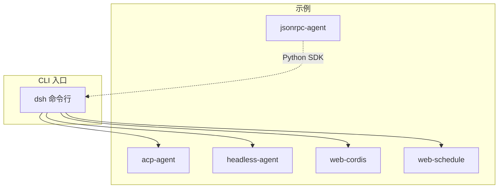
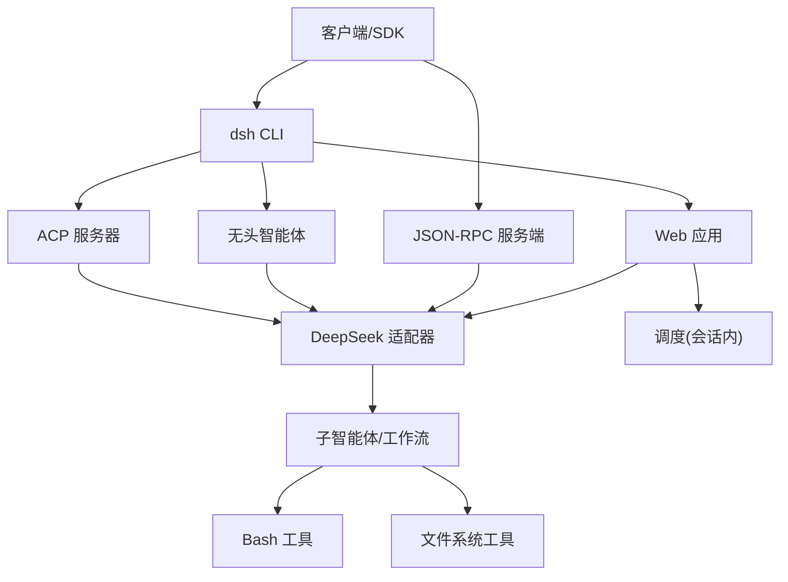
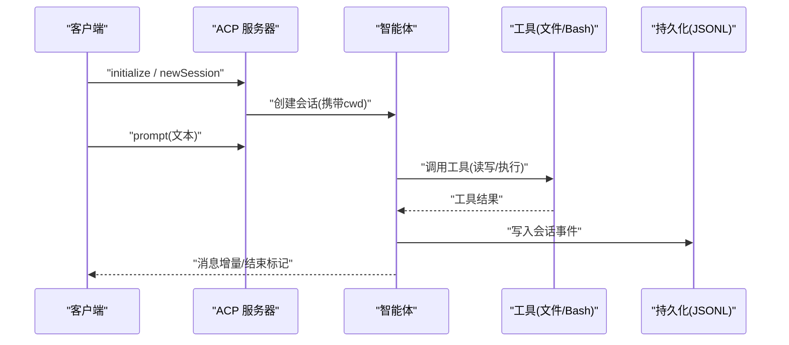
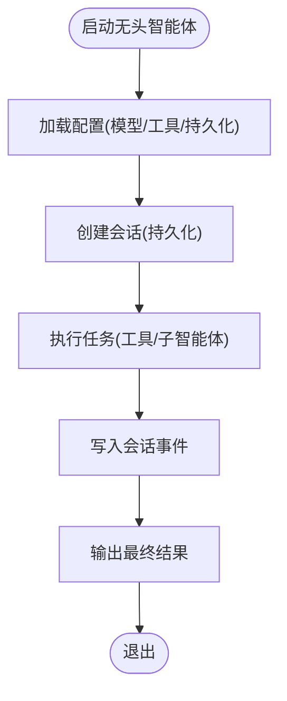
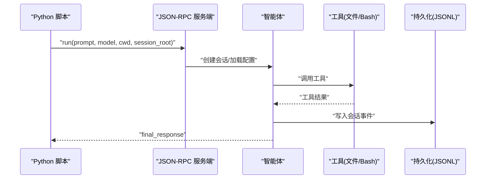
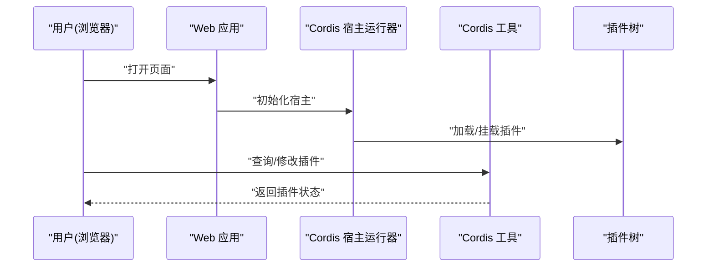
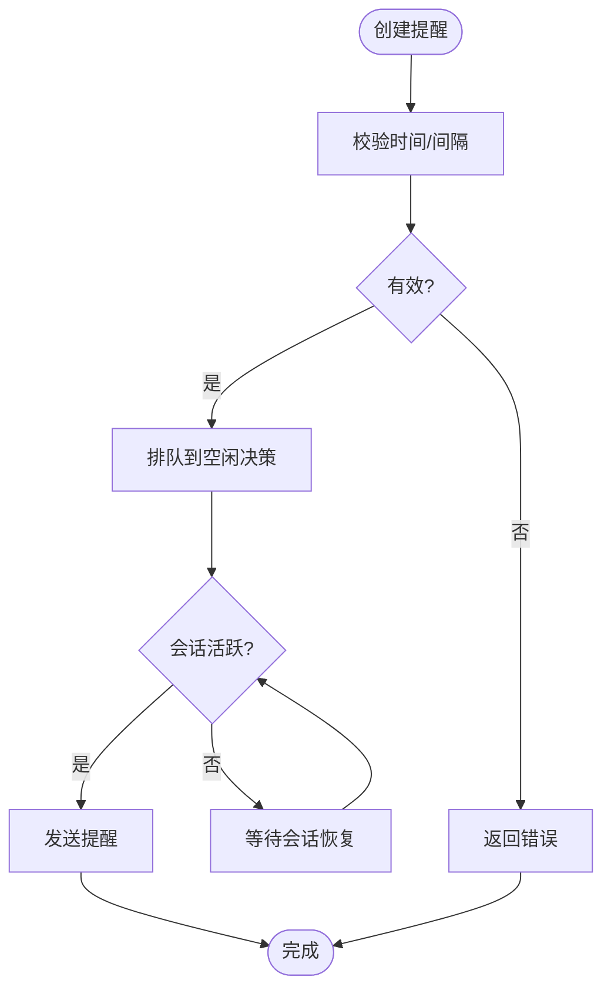
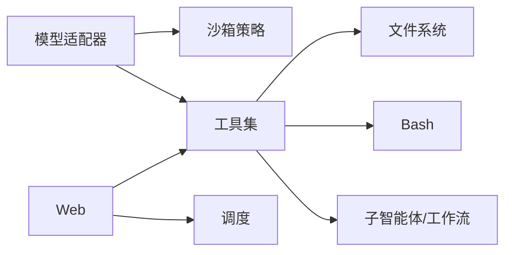

# 使用示例

<cite>
**本文引用的文件**
- [examples/README.md](file://examples/README.md)
- [apps/cli/README.md](file://apps/cli/README.md)
- [examples/acp-agent/README.md](file://examples/acp-agent/README.md)
- [examples/acp-agent/cordis.yml](file://examples/acp-agent/cordis.yml)
- [examples/headless-agent/README.md](file://examples/headless-agent/README.md)
- [examples/headless-agent/cordis.yml](file://examples/headless-agent/cordis.yml)
- [examples/jsonrpc-agent/README.md](file://examples/jsonrpc-agent/README.md)
- [examples/jsonrpc-agent/cordis.yml](file://examples/jsonrpc-agent/cordis.yml)
- [examples/jsonrpc-agent/minimal.py](file://examples/jsonrpc-agent/minimal.py)
- [examples/web-cordis/README.md](file://examples/web-cordis/README.md)
- [examples/web-cordis/cordis.yml](file://examples/web-cordis/cordis.yml)
- [examples/web-schedule/README.md](file://examples/web-schedule/README.md)
- [examples/web-schedule/cordis.yml](file://examples/web-schedule/cordis.yml)
</cite>

## 目录
1. [简介](#简介)
2. [项目结构](#项目结构)
3. [核心组件](#核心组件)
4. [架构总览](#架构总览)
5. [详细组件分析](#详细组件分析)
6. [依赖关系分析](#依赖关系分析)
7. [性能考虑](#性能考虑)
8. [故障排除指南](#故障排除指南)
9. [结论](#结论)
10. [附录](#附录)

## 简介
本章节面向希望从零开始构建智能体应用的开发者，提供 DeepSeek Harness 的完整使用场景与示例。覆盖以下能力：
- ACP Agent：通过 JSON-RPC over stdio 的程序化自动化服务
- 无头模式：一次性任务执行、持久化会话与结构化输出
- JSON-RPC 接口：Python SDK 驱动的无人值守编码智能体
- Web 集成：浏览器界面与可插拔 Cordis 插件树
- 调度功能：会话内定时提醒（Session-local Schedule）

每个示例包含配置说明、启动命令、预期输出与故障排除要点，帮助快速上手并掌握高级特性与集成模式。

## 项目结构
仓库中的 examples 目录提供了可直接运行的演示，涵盖多种运行形态与扩展点：
- acp-agent：面向自动化的 ACP 服务器，支持会话、权限、取消、子智能体与工作流
- headless-agent：非交互式编码智能体，接受单一任务后输出结果
- jsonrpc-agent：通过 Python SDK 和 JSON-RPC 驱动的智能体
- web-cordis：自引用 Web 演示，可在内存中检查与挂载/卸载插件
- web-schedule：为 Web 进程启用会话级定时提醒的可选叠加层

图表来源
- [examples/README.md:1-30](file://examples/README.md#L1-L30)
- [apps/cli/README.md:1-48](file://apps/cli/README.md#L1-L48)

章节来源
- [examples/README.md:1-30](file://examples/README.md#L1-L30)
- [apps/cli/README.md:1-48](file://apps/cli/README.md#L1-L48)

## 核心组件
- 适配器与模型：DeepSeek 适配器负责模型调用与上下文窗口管理
- 沙箱与文件系统：本地或远程沙箱策略控制 bash 与文件工具访问范围
- 会话与持久化：JSONL 会话日志、压缩与检查点策略
- 子智能体与工作流：spawn/fork 两种子智能体模式，工作流引擎驱动脚本
- 工具集：bash、fs、todo、ralph、workflow、subagent 等
- 权限与审批：workspace-write 与 danger-full-access 策略切换
- Web 与调度：Web 叠加层与 Session-local 定时提醒

章节来源
- [examples/acp-agent/cordis.yml:1-193](file://examples/acp-agent/cordis.yml#L1-L193)
- [examples/headless-agent/cordis.yml:1-166](file://examples/headless-agent/cordis.yml#L1-L166)
- [examples/jsonrpc-agent/cordis.yml:1-90](file://examples/jsonrpc-agent/cordis.yml#L1-L90)
- [examples/web-cordis/cordis.yml:1-20](file://examples/web-cordis/cordis.yml#L1-L20)
- [examples/web-schedule/cordis.yml:1-10](file://examples/web-schedule/cordis.yml#L1-L10)

## 架构总览
下图展示不同示例在运行时如何组合插件与工具，以及数据与控制流向。

图表来源
- [examples/acp-agent/cordis.yml:1-193](file://examples/acp-agent/cordis.yml#L1-L193)
- [examples/headless-agent/cordis.yml:1-166](file://examples/headless-agent/cordis.yml#L1-L166)
- [examples/jsonrpc-agent/cordis.yml:1-90](file://examples/jsonrpc-agent/cordis.yml#L1-L90)
- [examples/web-cordis/cordis.yml:1-20](file://examples/web-cordis/cordis.yml#L1-L20)
- [examples/web-schedule/cordis.yml:1-10](file://examples/web-schedule/cordis.yml#L1-L10)

## 详细组件分析

### ACP Agent 示例
- 目标：提供基于 Agent Client Protocol 的自动化服务，适合父智能体、子智能体提供者与程序化客户端
- 关键配置要点
  - 模型适配器：启用思考与推理努力，注册可用模型
  - 沙箱策略：默认 workspace-write；可通过环境变量切换为 danger-full-access
  - 会话持久化：JSONL 存储，支持压缩；快照模式下关闭压缩
  - 子智能体：支持 spawn 与 fork 两种模式，背景任务可延续或一次性
  - 工作流：线程工作器驱动模型编写的脚本
  - 权限审批：根据策略选择 ask 或 never
  - 钩子：支持 Claude Code 与 Codex 两种钩子协议
- 启动命令
  - 需要设置 DEEPSEEK_API_KEY
  - 运行 demo 脚本以启动 ACP 服务器或代码模式
- 预期输出
  - stdout 仅承载换行分隔的 ACP JSON-RPC 帧
  - 每次 session/new 创建新智能体，保持 stdout 协议纯净
- 故障排除
  - 若出现权限不足，检查 DSH_PERMISSION_MODE 与当前会话 cwd
  - 若 stdout 混入日志，确认未添加控制台输出到 stdout
  - 快照模式需确保 DSH_SNAPSHOT 与 DSH_SNAPSHOT_SESSIONS_ROOT 正确设置

图表来源
- [examples/acp-agent/README.md:1-25](file://examples/acp-agent/README.md#L1-L25)
- [examples/acp-agent/cordis.yml:1-193](file://examples/acp-agent/cordis.yml#L1-L193)

章节来源
- [examples/acp-agent/README.md:1-25](file://examples/acp-agent/README.md#L1-L25)
- [examples/acp-agent/cordis.yml:1-193](file://examples/acp-agent/cordis.yml#L1-L193)

### 无头模式示例
- 目标：一次性任务执行，生成机器可读或人类可读输出，并持久化会话
- 关键配置要点
  - 模型适配器：注册模型与上下文窗口
  - 会话持久化：JSONL 存储，压缩策略按环境切换
  - 子智能体与工作流：支持 spawn/fork 与线程工作器
  - 工具集：bash、fs、todo、ralph 等
  - 权限策略：默认 workspace-write，可按需切换
- 启动命令
  - 设置 DEEPSEEK_API_KEY（可选 DEEPSEEK_BASE_URL）
  - 使用 dsh --profile headless 传入任务
- 预期输出
  - 打印最终助手文本，退出进程
  - 会话日志写入 .sessions 目录
- 故障排除
  - 若模型调用失败，检查 API Key 与 Base URL
  - 若文件/命令执行受限，调整 DSH_PERMISSION_MODE
  - 快照测试需确保 DSH_SNAPSHOT 与相关路径正确

图表来源
- [examples/headless-agent/README.md:1-33](file://examples/headless-agent/README.md#L1-L33)
- [examples/headless-agent/cordis.yml:1-166](file://examples/headless-agent/cordis.yml#L1-L166)

章节来源
- [examples/headless-agent/README.md:1-33](file://examples/headless-agent/README.md#L1-L33)
- [examples/headless-agent/cordis.yml:1-166](file://examples/headless-agent/cordis.yml#L1-L166)

### JSON-RPC 接口示例
- 目标：通过 Python SDK 与 JSON-RPC 驱动无人值守编码智能体
- 关键配置要点
  - JSON-RPC 服务端：保留 stdout 给协议，不输出控制台日志
  - 模型适配器：按需传递模型参数
  - 工具集：bash（前台）、read/write/edit、subagent（单进程）、todo_write
  - 会话持久化：JSONL，压缩策略按环境切换
  - 上下文窗口与最大令牌：通过环境变量控制
- 启动命令
  - 设置必要的环境变量（如 DEEPSEEK_API_KEY、DSH_CWD、DSH_MODEL 等）
  - 通过 minimal.py 运行最小化变体
- 预期输出
  - 最终响应打印至标准输出
  - 会话事件写入指定目录
- 故障排除
  - 若 token 限制导致中断，检查 DSH_MAX_TOKENS_AS_SUCCESS
  - 若工作区路径错误，确认 DSH_CWD
  - 若权限不足，调整策略或运行环境

图表来源
- [examples/jsonrpc-agent/README.md:1-41](file://examples/jsonrpc-agent/README.md#L1-L41)
- [examples/jsonrpc-agent/cordis.yml:1-90](file://examples/jsonrpc-agent/cordis.yml#L1-L90)
- [examples/jsonrpc-agent/minimal.py:1-44](file://examples/jsonrpc-agent/minimal.py#L1-L44)

章节来源
- [examples/jsonrpc-agent/README.md:1-41](file://examples/jsonrpc-agent/README.md#L1-L41)
- [examples/jsonrpc-agent/cordis.yml:1-90](file://examples/jsonrpc-agent/cordis.yml#L1-L90)
- [examples/jsonrpc-agent/minimal.py:1-44](file://examples/jsonrpc-agent/minimal.py#L1-L44)

### Web 集成示例
- 目标：在浏览器中运行智能体，并通过 Cordis 工具动态检查与修改内存中的插件树
- 关键配置要点
  - Web 叠加层：插入 cordis-host-runner 与 tool-cordis
  - 端口绑定：示例将端口设置为 3081
  - 安全提示：临时插件具有进程级能力，不应视为安全边界
- 启动命令
  - 运行 demo:cordis 启动浏览器界面
  - 也可启动 ACP 自动化服务器模式
- 预期输出
  - 浏览器打开后可查看与操作当前 Cordis 插件树
  - 会话状态与工具调用在 Web UI 中可见
- 故障排除
  - 若端口冲突，调整 webserver.port
  - 若插件加载失败，检查注入顺序与依赖
  - 若权限不足，结合沙箱策略与工具配置

图表来源
- [examples/web-cordis/README.md:1-22](file://examples/web-cordis/README.md#L1-L22)
- [examples/web-cordis/cordis.yml:1-20](file://examples/web-cordis/cordis.yml#L1-L20)

章节来源
- [examples/web-cordis/README.md:1-22](file://examples/web-cordis/README.md#L1-L22)
- [examples/web-cordis/cordis.yml:1-20](file://examples/web-cordis/cordis.yml#L1-L20)

### 调度功能示例
- 目标：为 Web 进程启用会话内定时提醒，支持 after_seconds、at 与 every_seconds
- 关键配置要点
  - 时间上下文：附加 IANA 时区信息到提示
  - 调度服务：schedule_create/list/delete 管理提醒
  - 行为约束：仅在会话活跃且空闲时排队后续轮次；冷历史不会触发
- 启动命令
  - 使用 dsh web --patch 叠加 schedule 配置
- 预期输出
  - 提醒结果标注为“会话内”
  - 到期提醒在会话恢复后继续等待并投递
- 故障排除
  - 若时间解析失败，检查 RFC 3339 格式与时区
  - 若提醒未触发，确认会话处于活跃且空闲状态
  - 若跨进程失效，注意提醒仅在当前会话内有效

图表来源
- [examples/web-schedule/README.md:1-20](file://examples/web-schedule/README.md#L1-L20)
- [examples/web-schedule/cordis.yml:1-10](file://examples/web-schedule/cordis.yml#L1-L10)

章节来源
- [examples/web-schedule/README.md:1-20](file://examples/web-schedule/README.md#L1-L20)
- [examples/web-schedule/cordis.yml:1-10](file://examples/web-schedule/cordis.yml#L1-L10)

## 依赖关系分析
- 插件与工具耦合
  - 模型适配器依赖凭证与上下文窗口配置
  - 子智能体与工作流依赖进程管理与线程执行
  - 文件系统与 Bash 工具受沙箱策略约束
  - Web 与调度依赖时间上下文与会话生命周期
- 外部依赖
  - DeepSeek API（凭据与端点）
  - 操作系统进程与终端（PTY）
  - 文件系统（读写与观察策略）

图表来源
- [examples/acp-agent/cordis.yml:1-193](file://examples/acp-agent/cordis.yml#L1-L193)
- [examples/headless-agent/cordis.yml:1-166](file://examples/headless-agent/cordis.yml#L1-L166)
- [examples/jsonrpc-agent/cordis.yml:1-90](file://examples/jsonrpc-agent/cordis.yml#L1-L90)
- [examples/web-cordis/cordis.yml:1-20](file://examples/web-cordis/cordis.yml#L1-L20)
- [examples/web-schedule/cordis.yml:1-10](file://examples/web-schedule/cordis.yml#L1-L10)

章节来源
- [examples/acp-agent/cordis.yml:1-193](file://examples/acp-agent/cordis.yml#L1-L193)
- [examples/headless-agent/cordis.yml:1-166](file://examples/headless-agent/cordis.yml#L1-L166)
- [examples/jsonrpc-agent/cordis.yml:1-90](file://examples/jsonrpc-agent/cordis.yml#L1-L90)
- [examples/web-cordis/cordis.yml:1-20](file://examples/web-cordis/cordis.yml#L1-L20)
- [examples/web-schedule/cordis.yml:1-10](file://examples/web-schedule/cordis.yml#L1-L10)

## 性能考虑
- 上下文压缩：合理设置阈值与保留比例，避免频繁压缩影响延迟
- 令牌限制：通过 maxTokensAsSuccess 控制中断行为的成功/错误语义
- 子智能体深度：限制最大深度以避免过深递归
- 工作流执行：使用线程工作器隔离脚本执行，降低主循环阻塞
- 持久化压缩：生产环境启用压缩以减少磁盘占用与 I/O

[本节为通用指导，无需特定文件来源]

## 故障排除指南
- 认证与模型调用
  - 检查 DEEPSEEK_API_KEY 与 DEEPSEEK_BASE_URL
  - 确认模型 ID 与上下文窗口配置一致
- 权限与沙箱
  - 根据需求设置 DSH_PERMISSION_MODE（workspace-write 或 danger-full-access）
  - 确保会话 cwd 与工具路径匹配
- 输出通道污染
  - ACP 模式要求 stdout 仅承载 JSON-RPC；日志应输出到 stderr
- 会话与持久化
  - 检查 DSH_SESSION_ROOT 与压缩策略
  - 快照模式需关闭压缩并设置相应环境变量
- Web 与调度
  - 端口冲突时调整 webserver.port
  - 时间解析失败需符合 RFC 3339 与时区规范

章节来源
- [examples/acp-agent/README.md:1-25](file://examples/acp-agent/README.md#L1-L25)
- [examples/headless-agent/README.md:1-33](file://examples/headless-agent/README.md#L1-L33)
- [examples/jsonrpc-agent/README.md:1-41](file://examples/jsonrpc-agent/README.md#L1-L41)
- [examples/web-schedule/README.md:1-20](file://examples/web-schedule/README.md#L1-L20)

## 结论
通过上述示例，开发者可以：
- 使用 ACP 实现程序化自动化与服务编排
- 在无头模式下执行一次性任务并获得稳定输出
- 借助 Python SDK 与 JSON-RPC 构建无人值守智能体
- 在 Web 环境中动态管理插件与工具
- 利用会话内调度实现可靠的定时提醒

这些能力覆盖了从基础用法到高级特性的完整路径，便于在不同场景中快速搭建与集成智能体应用。

[本节为总结性内容，无需特定文件来源]

## 附录
- CLI 入口与模式
  - dsh --profile headless：运行一次性任务
  - dsh web：启动 Web 应用
  - 通过 --patch 叠加自定义配置
- 环境变量参考
  - DEEPSEEK_API_KEY、DEEPSEEK_BASE_URL
  - DSH_CWD、DSH_MODEL、DSH_SESSION_ROOT
  - DSH_PERMISSION_MODE、DSH_MAX_TOKENS_AS_SUCCESS
  - DSH_SYSTEM_PROMPT、DSH_CONTEXT_WINDOW

章节来源
- [apps/cli/README.md:1-48](file://apps/cli/README.md#L1-L48)
- [examples/jsonrpc-agent/README.md:1-41](file://examples/jsonrpc-agent/README.md#L1-L41)