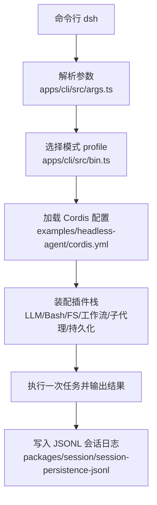
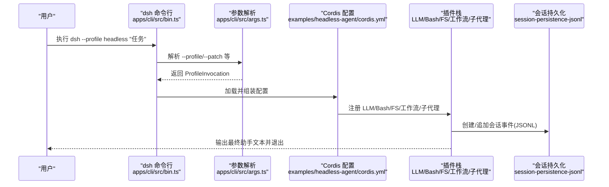
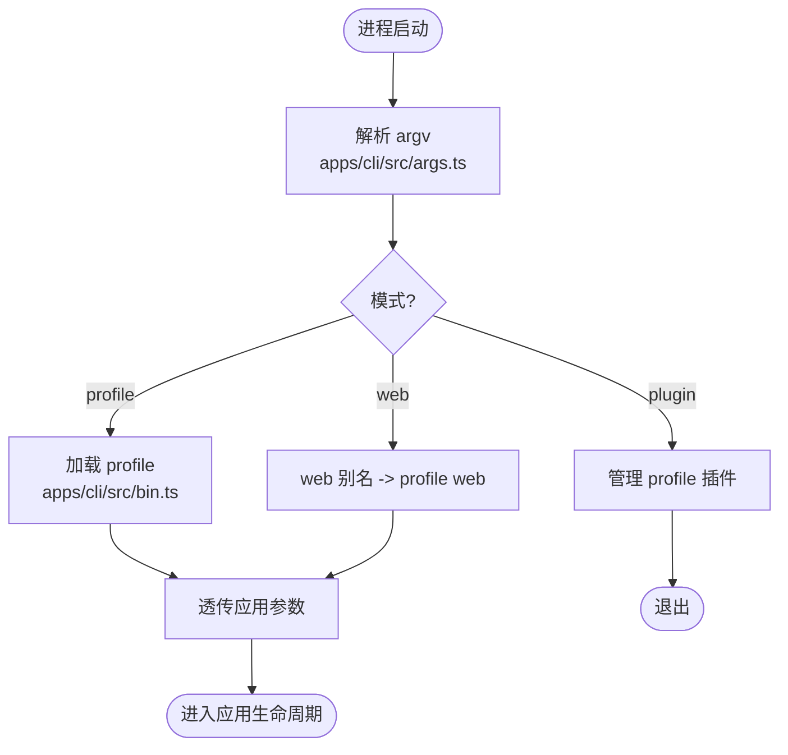
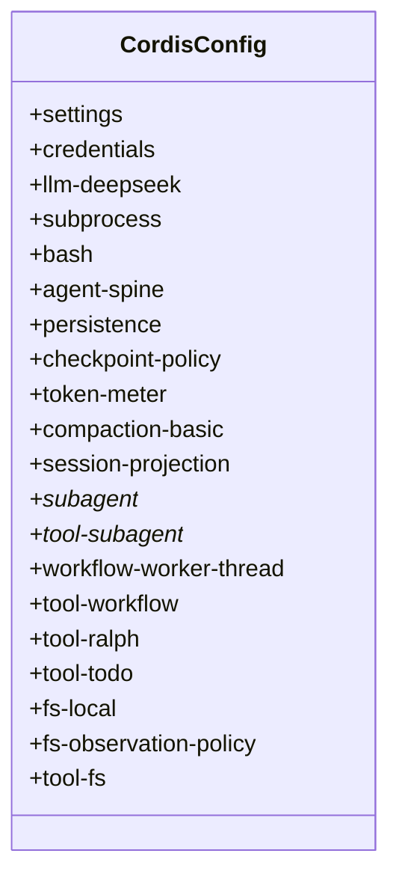
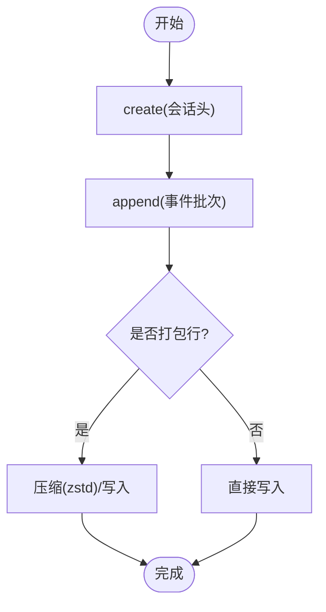
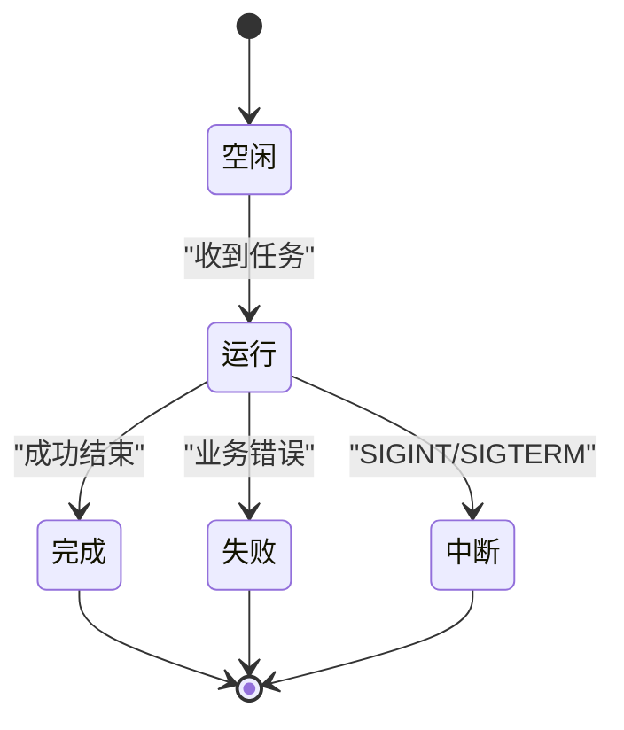
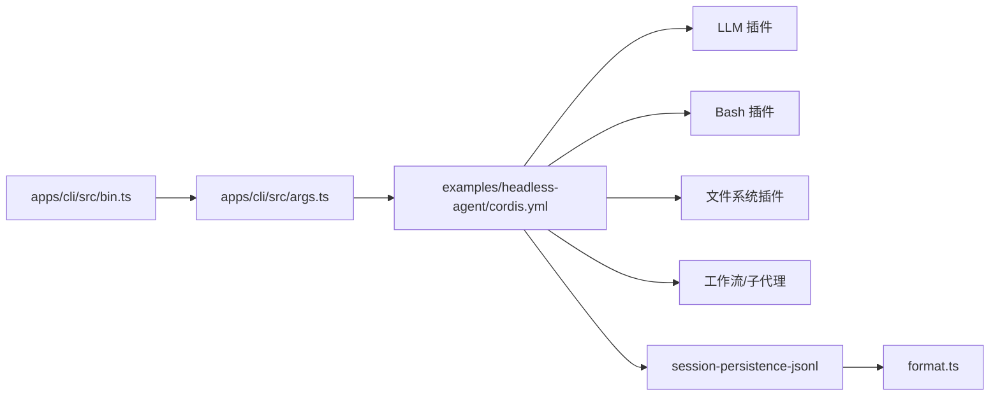

# 无头模式示例

<cite>
**本文引用的文件**
- [README.md](file://examples/headless-agent/README.md)
- [README.zh.md](file://examples/headless-agent/README.zh.md)
- [cordis.yml](file://examples/headless-agent/cordis.yml)
- [advanced.cordis.yml](file://examples/headless-agent/advanced.cordis.yml)
- [bin.ts](file://apps/cli/src/bin.ts)
- [args.ts](file://apps/cli/src/args.ts)
- [headless-shutdown.e2e.ts](file://apps/cli/tests/headless-shutdown.e2e.ts)
- [harness.ts](file://examples/headless-agent/tests/harness.ts)
- [index.ts](file://packages/session/session-persistence-jsonl/src/index.ts)
- [format.ts](file://packages/session/session-persistence-jsonl/src/format.ts)
- [keyless-smoke.e2e.ts](file://examples/headless-agent/tests/keyless-smoke.e2e.ts)
- [headless.snapshot.ts](file://examples/headless-agent/tests/headless.snapshot.ts)
</cite>

## 目录
1. [简介](#简介)
2. [项目结构](#项目结构)
3. [核心组件](#核心组件)
4. [架构总览](#架构总览)
5. [详细组件分析](#详细组件分析)
6. [依赖关系分析](#依赖关系分析)
7. [性能考虑](#性能考虑)
8. [故障排查指南](#故障排查指南)
9. [结论](#结论)
10. [附录](#附录)

## 简介
本示例展示如何在 Node.js 环境中以“无头模式”运行 DeepSeek Harness Agent，用于后台任务处理、批量处理与系统集成。无头模式的优势在于：
- 无需浏览器或 GUI，适合 CI/CD、批处理与服务器端集成
- 一次性执行任务，输出最终结果后退出，便于脚本化编排
- 支持会话持久化、子代理与工作流，可组合复杂任务
- 通过配置层（Cordis）灵活装配能力，如 Bash、文件系统、压缩日志等

典型适用场景：
- 后台任务：定时任务、异步流水线、离线数据处理
- 批量处理：对大量文件或代码库进行统一分析与修改
- 系统集成：与外部系统通过 CLI、事件流或会话日志对接

## 项目结构
本仓库将无头模式的示例集中在 examples/headless-agent，并通过 apps/cli 的 dsh 命令启动。关键要点：
- 入口命令：dsh --profile headless "任务描述"
- 配置文件：examples/headless-agent/cordis.yml 定义插件装配；advanced.cordis.yml 提供增强配置（如 Code Mode）
- 会话持久化：JSONL 格式，默认启用 zstd 压缩
- 测试驱动：tests 下包含端到端用例，验证无头流程、关闭行为与快照一致性

图表来源
- [bin.ts:29-38](file://apps/cli/src/bin.ts#L29-L38)
- [args.ts:112-145](file://apps/cli/src/args.ts#L112-L145)
- [cordis.yml:1-166](file://examples/headless-agent/cordis.yml#L1-L166)
- [index.ts:171-178](file://packages/session/session-persistence-jsonl/src/index.ts#L171-L178)

章节来源
- [README.md:7-18](file://examples/headless-agent/README.md#L7-L18)
- [README.zh.md:7-18](file://examples/headless-agent/README.zh.md#L7-L18)
- [bin.ts:29-38](file://apps/cli/src/bin.ts#L29-L38)
- [args.ts:112-145](file://apps/cli/src/args.ts#L112-L145)
- [cordis.yml:1-166](file://examples/headless-agent/cordis.yml#L1-L166)

## 核心组件
- 命令行与参数解析
  - dsh 命令负责解析 --profile、--patch、--dump-config 等选项，并将剩余参数透传给被启动的应用
  - 支持 web 别名与 plugin 子命令
- 无头配置与插件装配
  - cordis.yml 定义了 LLM、Bash、文件系统、子代理、工作流、持久化等插件
  - advanced.cordis.yml 在基础之上叠加 Code Mode 与 Cordis 工具
- 会话持久化
  - JSONL 后端支持压缩（zstd）、打包行、写批延迟、冷启动缓存等
  - 路径与后缀由 format.ts 计算，确保一致性与兼容性
- 测试与验收
  - keyless-smoke.e2e.ts 验证真实工具往返与会话持久化
  - headless.snapshot.ts 校验产物与预期快照一致
  - headless-shutdown.e2e.ts 验证 PTY 下的优雅关闭与信号处理

章节来源
- [args.ts:112-192](file://apps/cli/src/args.ts#L112-L192)
- [cordis.yml:1-166](file://examples/headless-agent/cordis.yml#L1-L166)
- [advanced.cordis.yml:1-35](file://examples/headless-agent/advanced.cordis.yml#L1-L35)
- [index.ts:59-83](file://packages/session/session-persistence-jsonl/src/index.ts#L59-L83)
- [format.ts:193-224](file://packages/session/session-persistence-jsonl/src/format.ts#L193-L224)
- [keyless-smoke.e2e.ts:15-40](file://examples/headless-agent/tests/keyless-smoke.e2e.ts#L15-L40)
- [headless.snapshot.ts:221-249](file://examples/headless-agent/tests/headless.snapshot.ts#L221-L249)
- [headless-shutdown.e2e.ts:64-131](file://apps/cli/tests/headless-shutdown.e2e.ts#L64-L131)

## 架构总览
无头模式的核心是“一次性 Agent 执行 + 会话持久化 + 插件化能力”。下图展示了从命令行到插件装配再到会话落盘的完整链路。

图表来源
- [bin.ts:29-38](file://apps/cli/src/bin.ts#L29-L38)
- [args.ts:112-145](file://apps/cli/src/args.ts#L112-L145)
- [cordis.yml:1-166](file://examples/headless-agent/cordis.yml#L1-L166)
- [index.ts:171-178](file://packages/session/session-persistence-jsonl/src/index.ts#L171-L178)

## 详细组件分析

### 命令行与参数传递
- dsh 命令仅解析自身拥有的标志，其余参数透传给被启动的应用
- 支持 --profile 指定配置集，--patch 叠加额外补丁，--dump-config/--dump-default-config 打印配置树
- web 为 --profile web 的别名；plugin 子命令转发给 pnpm

图表来源
- [args.ts:112-192](file://apps/cli/src/args.ts#L112-L192)
- [bin.ts:29-48](file://apps/cli/src/bin.ts#L29-L48)

章节来源
- [args.ts:112-192](file://apps/cli/src/args.ts#L112-L192)
- [bin.ts:29-48](file://apps/cli/src/bin.ts#L29-L48)

### 无头配置与插件装配
- cordis.yml 定义了完整的无头 Agent 栈：设置、凭据、LLM、子进程、Bash、Agent Spine、持久化、检查点策略、Token 计量、压缩、子代理与工作流、文件系统工具等
- advanced.cordis.yml 在基础之上添加 Code Mode 与 Cordis 工具，并调整模型与上下文窗口

图表来源
- [cordis.yml:1-166](file://examples/headless-agent/cordis.yml#L1-L166)
- [advanced.cordis.yml:1-35](file://examples/headless-agent/advanced.cordis.yml#L1-L35)

章节来源
- [cordis.yml:1-166](file://examples/headless-agent/cordis.yml#L1-L166)
- [advanced.cordis.yml:1-35](file://examples/headless-agent/advanced.cordis.yml#L1-L35)

### 会话持久化与输出处理
- JSONL 持久化后端提供 create/append/list/load 等操作，支持压缩与打包行
- 日志路径与后缀由 format.ts 计算，保证读取兼容不同布局
- 测试中通过 stdout 输出 JSONL 事件流，并以最后一个记录作为结果

图表来源
- [index.ts:171-178](file://packages/session/session-persistence-jsonl/src/index.ts#L171-L178)
- [format.ts:193-224](file://packages/session/session-persistence-jsonl/src/format.ts#L193-L224)

章节来源
- [index.ts:59-83](file://packages/session/session-persistence-jsonl/src/index.ts#L59-L83)
- [format.ts:193-224](file://packages/session/session-persistence-jsonl/src/format.ts#L193-L224)
- [keyless-smoke.e2e.ts:15-40](file://examples/headless-agent/tests/keyless-smoke.e2e.ts#L15-L40)
- [headless.snapshot.ts:221-249](file://examples/headless-agent/tests/headless.snapshot.ts#L221-L249)

### 错误恢复与关闭行为
- 正常关闭会触发根级 dispose，保留首次请求的退出码；失败则强制退出以保证进程安全
- 第一个信号启动优雅关闭并设置五秒退出兜底；第二个信号立即强制退出
- 退出码约定：完成返回 0，业务错误返回 1，SIGINT 返回 130，SIGTERM 返回 143

图表来源
- [headless-shutdown.e2e.ts:124-131](file://apps/cli/tests/headless-shutdown.e2e.ts#L124-L131)

章节来源
- [headless-shutdown.e2e.ts:64-131](file://apps/cli/tests/headless-shutdown.e2e.ts#L64-L131)

### Node.js 环境集成示例（步骤式）
以下示例以步骤形式说明如何在 Node.js 环境中集成无头模式，避免直接粘贴代码：
- 准备环境变量
  - 设置 DEEPSEEK_API_KEY（可选 DEEPSEEK_BASE_URL）
  - 如需沙箱，设置 E2B_API_KEY
- 运行无头任务
  - 使用 dsh --profile headless "任务描述"
  - 可通过 --patch 叠加额外配置
- 处理输出
  - 标准输出包含 JSONL 事件流，最后一条为结果记录
  - 会话日志写入 .sessions 目录，默认 zstd 压缩
- 错误恢复
  - 捕获退出码：0 表示成功，1 表示业务错误，130/143 对应信号
  - 若需强制退出，发送第二个 SIGINT/SIGTERM
- 参考实现
  - 端到端测试展示了如何调用 dsh 并断言输出与会话持久化

章节来源
- [README.md:7-18](file://examples/headless-agent/README.md#L7-L18)
- [README.zh.md:7-18](file://examples/headless-agent/README.zh.md#L7-L18)
- [keyless-smoke.e2e.ts:15-40](file://examples/headless-agent/tests/keyless-smoke.e2e.ts#L15-L40)
- [headless-shutdown.e2e.ts:124-131](file://apps/cli/tests/headless-shutdown.e2e.ts#L124-L131)

## 依赖关系分析
- 命令行依赖参数解析模块，决定后续加载哪个 profile
- 无头配置依赖多个插件包（LLM、Bash、FS、工作流、子代理、持久化）
- 持久化后端依赖格式模块计算路径与压缩策略
- 测试套件依赖上述所有组件以验证端到端行为

图表来源
- [bin.ts:29-38](file://apps/cli/src/bin.ts#L29-L38)
- [args.ts:112-145](file://apps/cli/src/args.ts#L112-L145)
- [cordis.yml:1-166](file://examples/headless-agent/cordis.yml#L1-L166)
- [index.ts:171-178](file://packages/session/session-persistence-jsonl/src/index.ts#L171-L178)
- [format.ts:193-224](file://packages/session/session-persistence-jsonl/src/format.ts#L193-L224)

章节来源
- [cordis.yml:1-166](file://examples/headless-agent/cordis.yml#L1-L166)
- [index.ts:171-178](file://packages/session/session-persistence-jsonl/src/index.ts#L171-L178)
- [format.ts:193-224](file://packages/session/session-persistence-jsonl/src/format.ts#L193-L224)

## 性能考虑
- 会话日志压缩
  - 默认启用 zstd 压缩，显著减少磁盘占用；可通过环境变量控制是否禁用
  - 打包行可将连续 chunk 合并存储，进一步降低体积
- 写批延迟
  - 通过 writeBatchMaxDelayMs 控制事件合并窗口，平衡实时性与 I/O 开销
- 历史压缩
  - 使用 compaction-basic 与 token-meter 控制上下文窗口增长，避免过大历史影响性能
- 工作流与子代理
  - 使用 worker-thread 与 spawn/fork 模式并行执行，注意并发上限与资源隔离
- 监控建议
  - 基于 JSONL 事件流进行指标采集（工具调用次数、耗时、错误率）
  - 结合 Token 计量与会话压缩比率评估成本与效率

章节来源
- [cordis.yml:63-83](file://examples/headless-agent/cordis.yml#L63-L83)
- [index.ts:59-83](file://packages/session/session-persistence-jsonl/src/index.ts#L59-L83)
- [format.ts:193-224](file://packages/session/session-persistence-jsonl/src/format.ts#L193-L224)

## 故障排查指南
- 无法启动或参数错误
  - 检查 --profile 是否存在，--patch 路径是否正确
  - 使用 --dump-config 查看组合后的配置树
- 工具调用失败
  - 确认 Bash 超时与环境变量（如 DEEPSEEK_API_KEY）已正确设置
  - 查看 JSONL 事件中的 tool/call 与 tool/result，定位错误信息
- 会话未持久化
  - 检查 .sessions 目录权限与路径
  - 确认 compression 与 packChunks 配置是否符合预期
- 关闭异常
  - 观察退出码与 stderr；必要时发送第二个信号强制退出
  - 验证 PTY 驱动与信号处理逻辑

章节来源
- [args.ts:112-192](file://apps/cli/src/args.ts#L112-L192)
- [keyless-smoke.e2e.ts:15-40](file://examples/headless-agent/tests/keyless-smoke.e2e.ts#L15-L40)
- [headless-shutdown.e2e.ts:64-131](file://apps/cli/tests/headless-shutdown.e2e.ts#L64-L131)

## 结论
无头模式为后台任务、批量处理与系统集成提供了轻量、可组合且可观测的执行方式。通过 Cordis 配置层，可以灵活装配 LLM、Bash、文件系统、工作流与持久化等能力；配合 JSONL 事件流与压缩策略，既能满足性能需求，又便于监控与回放。建议在集成时关注参数传递、错误恢复与性能优化，并结合测试套件验证端到端行为。

## 附录
- 快速运行
  - 设置环境变量后，执行 dsh --profile headless "任务描述"
- 高级配置
  - 使用 advanced.cordis.yml 启用 Code Mode 与 Cordis 工具
- 测试参考
  - harness.ts 展示了如何挂载测试依赖与工具链
  - headless.snapshot.ts 与 keyless-smoke.e2e.ts 提供了端到端验证样例

章节来源
- [README.md:7-18](file://examples/headless-agent/README.md#L7-L18)
- [README.zh.md:7-18](file://examples/headless-agent/README.zh.md#L7-L18)
- [advanced.cordis.yml:1-35](file://examples/headless-agent/advanced.cordis.yml#L1-L35)
- [harness.ts:1-105](file://examples/headless-agent/tests/harness.ts#L1-L105)
- [headless.snapshot.ts:221-249](file://examples/headless-agent/tests/headless.snapshot.ts#L221-L249)
- [keyless-smoke.e2e.ts:15-40](file://examples/headless-agent/tests/keyless-smoke.e2e.ts#L15-L40)