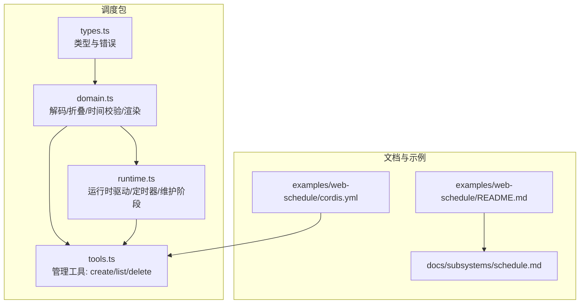
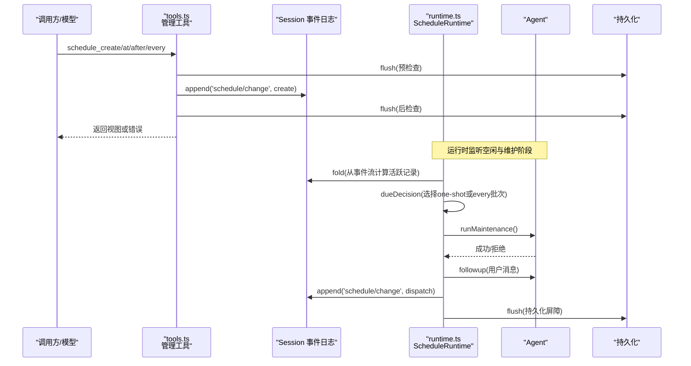
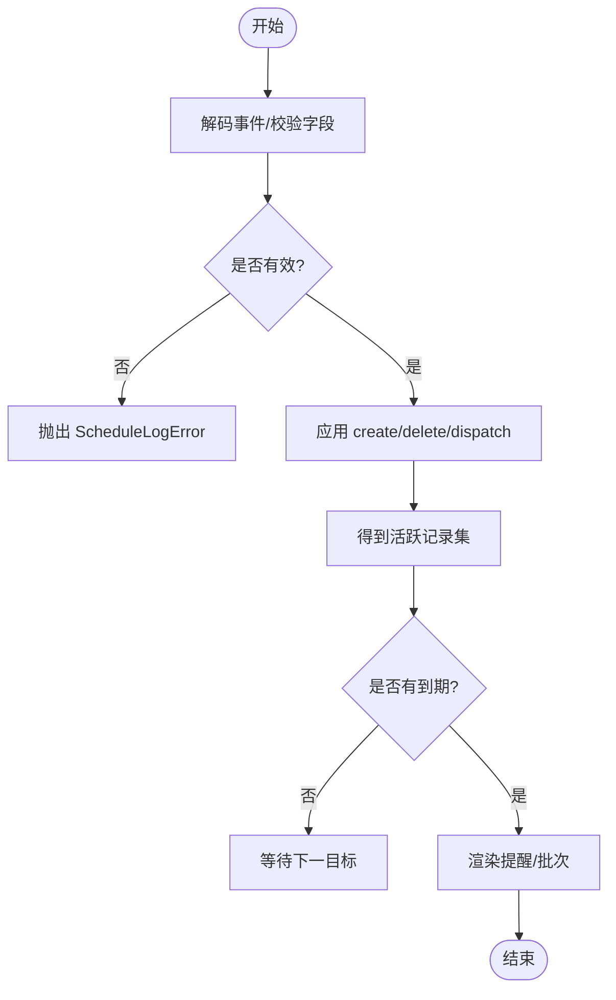
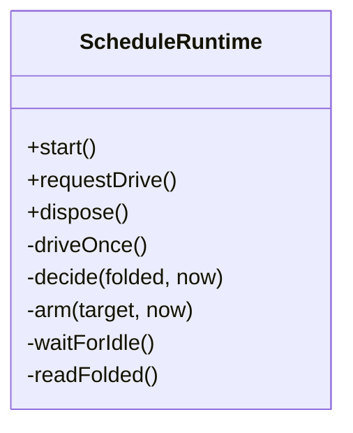
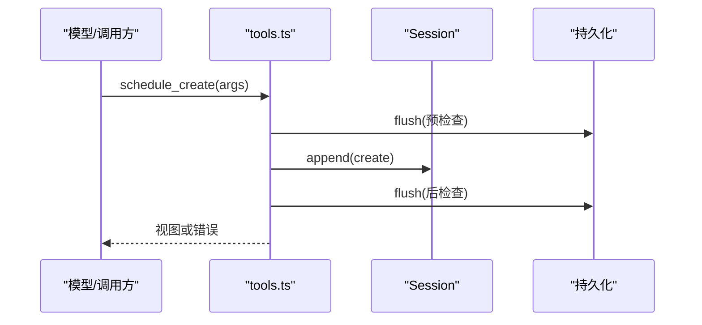
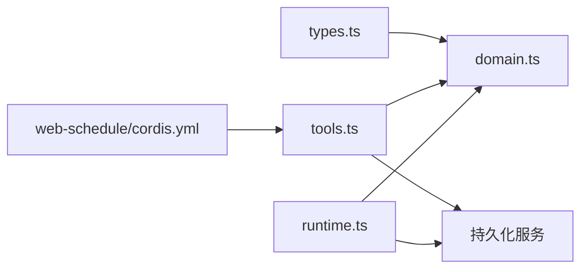

# 调度功能示例

<cite>
**本文引用的文件**
- [packages/schedule/schedule/src/types.ts](file://packages/schedule/schedule/src/types.ts)
- [packages/schedule/schedule/src/domain.ts](file://packages/schedule/schedule/src/domain.ts)
- [packages/schedule/schedule/src/tools.ts](file://packages/schedule/schedule/src/tools.ts)
- [packages/schedule/schedule/src/runtime.ts](file://packages/schedule/schedule/src/runtime.ts)
- [packages/schedule/schedule/README.md](file://packages/schedule/schedule/README.md)
- [docs/subsystems/schedule.md](file://docs/subsystems/schedule.md)
- [examples/web-schedule/cordis.yml](file://examples/web-schedule/cordis.yml)
- [examples/web-schedule/README.md](file://examples/web-schedule/README.md)
</cite>

## 目录
1. [简介](#简介)
2. [项目结构](#项目结构)
3. [核心组件](#核心组件)
4. [架构总览](#架构总览)
5. [详细组件分析](#详细组件分析)
6. [依赖关系分析](#依赖关系分析)
7. [性能考虑](#性能考虑)
8. [故障排查指南](#故障排查指南)
9. [结论](#结论)
10. [附录：使用示例与最佳实践](#附录使用示例与最佳实践)

## 简介
本示例文档围绕“会话内可持久化的提醒调度”展开，覆盖以下目标：
- 解释任务调度的核心概念与实现机制：定时任务、延迟执行、固定频率重复、并发控制。
- 说明如何配置和管理“工作流式”的调度：任务定义、依赖关系（通过事件顺序）、执行策略（维护阶段、空闲边界）。
- 提供完整的调度器使用示例：创建周期性任务、处理失败、监控执行状态。
- 给出性能优化建议与扩展开发指南。

该调度系统以 Session 事件日志为权威状态源，所有定时器、工具返回值和模型 follow-up 都是对事件流的投影；它不直接发送外部通知，仅在原会话存活时投递到对话中。

## 项目结构
与调度相关的代码集中在 packages/schedule/schedule 包中，并通过 Web overlay 在 examples/web-schedule 启用。

图表来源
- [packages/schedule/schedule/src/types.ts:1-222](file://packages/schedule/schedule/src/types.ts#L1-L222)
- [packages/schedule/schedule/src/domain.ts:1-120](file://packages/schedule/schedule/src/domain.ts#L1-L120)
- [packages/schedule/schedule/src/runtime.ts:1-120](file://packages/schedule/schedule/src/runtime.ts#L1-L120)
- [packages/schedule/schedule/src/tools.ts:1-120](file://packages/schedule/schedule/src/tools.ts#L1-L120)
- [examples/web-schedule/cordis.yml:1-10](file://examples/web-schedule/cordis.yml#L1-L10)
- [examples/web-schedule/README.md:1-20](file://examples/web-schedule/README.md#L1-L20)

章节来源
- [packages/schedule/schedule/src/types.ts:1-222](file://packages/schedule/schedule/src/types.ts#L1-L222)
- [packages/schedule/schedule/src/domain.ts:1-120](file://packages/schedule/schedule/src/domain.ts#L1-L120)
- [packages/schedule/schedule/src/runtime.ts:1-120](file://packages/schedule/schedule/src/runtime.ts#L1-L120)
- [packages/schedule/schedule/src/tools.ts:1-120](file://packages/schedule/schedule/src/tools.ts#L1-L120)
- [examples/web-schedule/cordis.yml:1-10](file://examples/web-schedule/cordis.yml#L1-L10)
- [examples/web-schedule/README.md:1-20](file://examples/web-schedule/README.md#L1-L20)

## 核心组件
- 类型与错误（types.ts）：定义记录、视图、变更事件、工具输入输出与错误码。
- 领域逻辑（domain.ts）：严格解码 schedule/change 事件、折叠活跃记录、时间与时区校验、固定频率决策、提醒内容渲染。
- 运行时（runtime.ts）：进程内定时器、空闲等待、维护阶段抢占、follow-up 队列、持久化屏障。
- 管理工具（tools.ts）：schedule_create / schedule_list / schedule_delete 三个工具的注册与执行流程。
- 文档与示例：子系统文档说明协议与行为；Web overlay 示例展示如何在 Web 环境中启用。

章节来源
- [packages/schedule/schedule/src/types.ts:1-222](file://packages/schedule/schedule/src/types.ts#L1-L222)
- [packages/schedule/schedule/src/domain.ts:1-808](file://packages/schedule/schedule/src/domain.ts#L1-L808)
- [packages/schedule/schedule/src/runtime.ts:1-325](file://packages/schedule/schedule/src/runtime.ts#L1-L325)
- [packages/schedule/schedule/src/tools.ts:1-468](file://packages/schedule/schedule/src/tools.ts#L1-L468)
- [docs/subsystems/schedule.md:1-187](file://docs/subsystems/schedule.md#L1-L187)
- [examples/web-schedule/README.md:1-20](file://examples/web-schedule/README.md#L1-L20)

## 架构总览
调度系统以“Session 事件日志”为唯一权威状态，所有运行态（定时器、视图、投递）均由事件流推导而来。管理操作通过工具写入事件，运行时在 Agent 空闲时读取并投递 follow-up。

图表来源
- [packages/schedule/schedule/src/tools.ts:316-455](file://packages/schedule/schedule/src/tools.ts#L316-L455)
- [packages/schedule/schedule/src/runtime.ts:230-323](file://packages/schedule/schedule/src/runtime.ts#L230-L323)
- [packages/schedule/schedule/src/domain.ts:575-621](file://packages/schedule/schedule/src/domain.ts#L575-L621)

## 详细组件分析

### 类型与数据模型（types.ts）
- 记录类型：
  - after：延迟一次性提醒，保存 afterSeconds 与 scheduledAt。
  - at：绝对时间一次性提醒，仅保存 canonical UTC scheduledAt。
  - every：固定频率重复提醒，保存 everySeconds 与 anchored scheduledAt。
- 视图：包含 state（scheduled/overdue）与 deliveryMode（session-local）。
- 变更事件：create、delete、dispatch（one-shot 仅 id；every 带 acceptedAt）。
- 错误：统一错误码集合，包括 invalid_prompt、invalid_selector、invalid_rule、invalid_time_zone、not_future、time_out_of_range、frequency_too_high、corrupt_schedule_log、persistence_uncertain、internal_error。

章节来源
- [packages/schedule/schedule/src/types.ts:12-119](file://packages/schedule/schedule/src/types.ts#L12-L119)
- [packages/schedule/schedule/src/types.ts:121-222](file://packages/schedule/schedule/src/types.ts#L121-L222)

### 领域逻辑（domain.ts）
- 严格解码与折叠：
  - decodeScheduleChange：版本与字段校验，区分 create/delete/dispatch。
  - foldScheduleEvents：从事件流构建 active 列表与 seenIds，应用 delete/dispatch 转换。
- 时间与时区：
  - parseOffsetInstant / resolveLocalInstant / canonicalizeTimeZone：支持 RFC 3339 偏移与本地日历对象，拒绝 DST 间隙，重叠取最早。
- 固定频率决策：
  - resolveEveryOccurrence：基于 acceptedAt 计算最新到期点与下一个目标，跳过缺失区间。
- 渲染：
  - renderReminderFraming / renderEveryReminderBatchFraming：生成注入防护的固定模板文本。

图表来源
- [packages/schedule/schedule/src/domain.ts:465-511](file://packages/schedule/schedule/src/domain.ts#L465-L511)
- [packages/schedule/schedule/src/domain.ts:575-621](file://packages/schedule/schedule/src/domain.ts#L575-L621)
- [packages/schedule/schedule/src/domain.ts:519-551](file://packages/schedule/schedule/src/domain.ts#L519-L551)
- [packages/schedule/schedule/src/domain.ts:779-800](file://packages/schedule/schedule/src/domain.ts#L779-L800)

章节来源
- [packages/schedule/schedule/src/domain.ts:1-808](file://packages/schedule/schedule/src/domain.ts#L1-L808)

### 运行时（runtime.ts）
- 定时器分段：Node 最大延迟限制下自动分段等待，每次唤醒重新采样墙钟。
- 空闲与维护：
  - waitForIdle：等待 Agent whenIdle 边界。
  - runMaintenance：抢占维护阶段，避免打断当前对话。
- 决策与投递：
  - dueDecision：优先 one-shot，其次 every 批次（按目标与创建序）。
  - followup：将渲染后的提醒作为用户消息入队。
  - append dispatch：记录一次调度，随后 flush 持久化屏障。
- 容错：
  - 损坏日志：标记 faulted 并停止后续工作。
  - 持久化不确定：返回 persistence_uncertain，不猜测结果。

图表来源
- [packages/schedule/schedule/src/runtime.ts:77-140](file://packages/schedule/schedule/src/runtime.ts#L77-L140)
- [packages/schedule/schedule/src/runtime.ts:230-323](file://packages/schedule/schedule/src/runtime.ts#L230-L323)

章节来源
- [packages/schedule/schedule/src/runtime.ts:1-325](file://packages/schedule/schedule/src/runtime.ts#L1-L325)

### 管理工具（tools.ts）
- schedule_create：
  - 参数校验：prompt 非空；三选一 selector（after_seconds/at/every_seconds）；every_seconds >= 300。
  - 预检查 flush -> 分配 ID -> 构造记录 -> append create -> 后检查 flush -> 返回视图。
- schedule_list：
  - 预检查 flush -> 折叠事件 -> 返回活跃记录的视图数组。
- schedule_delete：
  - 参数校验 -> 预检查 flush -> 查找活跃记录 -> append delete -> 后检查 flush -> 返回删除结果。
- 事务与取消：
  - runCancellableScheduleTransaction：在 Agent 作用域内串行执行，支持 AbortSignal 取消。

图表来源
- [packages/schedule/schedule/src/tools.ts:316-397](file://packages/schedule/schedule/src/tools.ts#L316-L397)
- [packages/schedule/schedule/src/tools.ts:399-417](file://packages/schedule/schedule/src/tools.ts#L399-L417)
- [packages/schedule/schedule/src/tools.ts:419-455](file://packages/schedule/schedule/src/tools.ts#L419-L455)

章节来源
- [packages/schedule/schedule/src/tools.ts:1-468](file://packages/schedule/schedule/src/tools.ts#L1-L468)

### 工作流与依赖关系
- 依赖关系：
  - tools 依赖 domain 进行输入校验与视图生成。
  - runtime 依赖 domain 进行事件折叠与决策。
  - 两者都依赖持久化服务（flush）确保一致性。
- 执行策略：
  - 管理操作串行化于 Agent 作用域的事务中。
  - 运行时在维护阶段执行，避免中断当前对话。
  - 固定频率记录独立维护状态，批量合并 overdue 记录。

章节来源
- [packages/schedule/schedule/src/tools.ts:186-196](file://packages/schedule/schedule/src/tools.ts#L186-L196)
- [packages/schedule/schedule/src/runtime.ts:254-311](file://packages/schedule/schedule/src/runtime.ts#L254-L311)
- [docs/subsystems/schedule.md:100-152](file://docs/subsystems/schedule.md#L100-L152)

## 依赖关系分析
- 内部依赖：
  - types -> domain：类型与错误被领域逻辑消费。
  - tools -> domain：工具层复用输入校验、视图生成与事件折叠。
  - runtime -> domain：运行时复用决策与渲染。
  - tools/runtime -> persistence：通过 flush 保证一致性与幂等。
- 外部集成：
  - Cordis Context、Agent、Session、LLM 消息构造。
  - Web overlay 通过 cordis.yml 插入 time-context 与 schedule 插件。

图表来源
- [packages/schedule/schedule/src/types.ts:1-222](file://packages/schedule/schedule/src/types.ts#L1-L222)
- [packages/schedule/schedule/src/tools.ts:1-120](file://packages/schedule/schedule/src/tools.ts#L1-L120)
- [packages/schedule/schedule/src/runtime.ts:1-120](file://packages/schedule/schedule/src/runtime.ts#L1-L120)
- [examples/web-schedule/cordis.yml:1-10](file://examples/web-schedule/cordis.yml#L1-L10)

章节来源
- [packages/schedule/schedule/src/types.ts:1-222](file://packages/schedule/schedule/src/types.ts#L1-L222)
- [packages/schedule/schedule/src/tools.ts:1-120](file://packages/schedule/schedule/src/tools.ts#L1-L120)
- [packages/schedule/schedule/src/runtime.ts:1-120](file://packages/schedule/schedule/src/runtime.ts#L1-L120)
- [examples/web-schedule/cordis.yml:1-10](file://examples/web-schedule/cordis.yml#L1-L10)

## 性能考虑
- 定时器分段：超过 Node 最大延迟时自动分段等待，避免精度丢失与提前触发。
- 批量合并：多个 overdue 的 every 记录在同一决策时刻合并为一个 follow-up，减少模型轮次。
- 最小间隔：every_seconds 下限 300 秒，防止高频调度导致资源压力。
- 维护阶段：仅在 Agent 空闲且成功抢占维护阶段时执行，避免阻塞主对话。
- 持久化屏障：前后 flush 保障一致性，失败时返回不确定性而非猜测。

[本节为通用指导，无需特定文件引用]

## 故障排查指南
- 常见错误码与含义：
  - invalid_prompt：提示为空或仅空白。
  - invalid_selector：selector 未提供或多选。
  - invalid_rule：数值或格式不符合约束（如 every_seconds < 300）。
  - invalid_time_zone：时区无效或未解析。
  - not_future：目标时间不是严格未来。
  - time_out_of_range：无法表示为四位年份 UTC。
  - frequency_too_high：频率过高。
  - corrupt_schedule_log：事件流损坏。
  - persistence_uncertain：持久化未完成，需重试并查询。
  - internal_error：内部异常兜底。
- 排查步骤：
  - 查看 schedule_list 返回的 active 记录与 state。
  - 检查 session 事件流中的 schedule/change 序列是否完整。
  - 确认 flush 是否成功，必要时重试。
  - 关注运行时日志中的警告信息（例如 idle wait failed、framing or followup failed）。

章节来源
- [packages/schedule/schedule/src/types.ts:121-222](file://packages/schedule/schedule/src/types.ts#L121-L222)
- [packages/schedule/schedule/src/tools.ts:221-250](file://packages/schedule/schedule/src/tools.ts#L221-L250)
- [packages/schedule/schedule/src/runtime.ts:205-228](file://packages/schedule/schedule/src/runtime.ts#L205-L228)

## 结论
该调度系统以“事件即状态”的方式实现了可靠、可审计的会话内提醒能力。通过严格的输入校验、稳定的错误码、维护阶段的执行策略以及持久化屏障，系统在可用性、一致性与可观测性之间取得平衡。对于需要周期性任务、延迟执行与轻量并发控制的场景，这是一个稳健的基础设施。

[本节为总结，无需特定文件引用]

## 附录：使用示例与最佳实践

### 启用调度（Web 环境）
- 通过 overlay 启用 schedule 插件与时间上下文：
  - 参考示例配置文件：[examples/web-schedule/cordis.yml:1-10](file://examples/web-schedule/cordis.yml#L1-L10)
  - 使用说明：[examples/web-schedule/README.md:1-20](file://examples/web-schedule/README.md#L1-L20)

章节来源
- [examples/web-schedule/cordis.yml:1-10](file://examples/web-schedule/cordis.yml#L1-L10)
- [examples/web-schedule/README.md:1-20](file://examples/web-schedule/README.md#L1-L20)

### 创建与管理任务
- 创建一次性延迟任务（after_seconds）：
  - 调用 schedule_create，传入 prompt 与 after_seconds。
  - 参考工具注册与执行流程：[tools.ts:316-397](file://packages/schedule/schedule/src/tools.ts#L316-L397)
- 创建绝对时间任务（at）：
  - 使用 RFC 3339 字符串或本地日历对象（含 time_zone）。
  - 参考输入校验与记录构造：[tools.ts:316-397](file://packages/schedule/schedule/src/tools.ts#L316-L397)、[domain.ts:679-720](file://packages/schedule/schedule/src/domain.ts#L679-L720)
- 创建周期性任务（every_seconds）：
  - 设置至少 300 秒的间隔，系统将按创建锚点对齐并跳过缺失区间。
  - 参考记录构造与频率约束：[tools.ts:316-397](file://packages/schedule/schedule/src/tools.ts#L316-L397)、[domain.ts:730-758](file://packages/schedule/schedule/src/domain.ts#L730-L758)
- 列出任务：
  - 调用 schedule_list，获取 active 记录及其 state。
  - 参考工具执行：[tools.ts:399-417](file://packages/schedule/schedule/src/tools.ts#L399-L417)
- 删除任务：
  - 调用 schedule_delete，传入精确 id。
  - 参考工具执行：[tools.ts:419-455](file://packages/schedule/schedule/src/tools.ts#L419-L455)

章节来源
- [packages/schedule/schedule/src/tools.ts:316-455](file://packages/schedule/schedule/src/tools.ts#L316-L455)
- [packages/schedule/schedule/src/domain.ts:679-758](file://packages/schedule/schedule/src/domain.ts#L679-L758)

### 监控执行状态
- 通过 schedule_list 查看 state（scheduled/overdue）与 deliveryMode（session-local）。
- 观察 session 事件流中的 schedule/change 事件，确认 create/delete/dispatch 的顺序与完整性。
- 参考事件结构与折叠逻辑：[domain.ts:465-621](file://packages/schedule/schedule/src/domain.ts#L465-L621)

章节来源
- [packages/schedule/schedule/src/domain.ts:465-621](file://packages/schedule/schedule/src/domain.ts#L465-L621)
- [docs/subsystems/schedule.md:100-152](file://docs/subsystems/schedule.md#L100-L152)

### 处理失败与恢复
- 失败分类：
  - 输入错误：invalid_prompt、invalid_selector、invalid_rule、invalid_time_zone、not_future、time_out_of_range、frequency_too_high。
  - 数据损坏：corrupt_schedule_log。
  - 持久化不确定：persistence_uncertain。
  - 内部错误：internal_error。
- 恢复策略：
  - 遇到 persistence_uncertain 时，先 schedule_list 确认状态再重试。
  - 遇到 corrupt_schedule_log 时，检查事件流完整性并修复。
  - 运行时故障会标记 faulted，需重启或重建运行时。

章节来源
- [packages/schedule/schedule/src/types.ts:121-222](file://packages/schedule/schedule/src/types.ts#L121-L222)
- [packages/schedule/schedule/src/tools.ts:221-250](file://packages/schedule/schedule/src/tools.ts#L221-L250)
- [packages/schedule/schedule/src/runtime.ts:205-228](file://packages/schedule/schedule/src/runtime.ts#L205-L228)

### 性能优化建议
- 合理设置 every_seconds 下限（>=300），避免高频调度。
- 利用批量合并特性，将多个 overdue 的 every 记录在一次 follow-up 中呈现。
- 在 Agent 空闲时执行维护任务，避免影响主对话。
- 使用持久化屏障确保一致性，失败时重试并查询。

[本节为通用指导，无需特定文件引用]

### 扩展开发指南
- 新增规则或字段：
  - 在 domain.ts 中扩展解码与折叠逻辑，保持向后兼容。
  - 在 types.ts 中更新类型与错误码。
  - 在 tools.ts 中调整参数校验与输出 schema。
- 自定义渲染：
  - 在 domain.ts 中扩展 renderReminderFraming / renderEveryReminderBatchFraming。
- 集成外部通知：
  - 当前设计为 session-local，如需外部通知，可在 followup 之后增加桥接逻辑，但需遵循“不中断当前对话”的原则。

章节来源
- [packages/schedule/schedule/src/domain.ts:465-621](file://packages/schedule/schedule/src/domain.ts#L465-L621)
- [packages/schedule/schedule/src/types.ts:121-222](file://packages/schedule/schedule/src/types.ts#L121-L222)
- [packages/schedule/schedule/src/tools.ts:316-455](file://packages/schedule/schedule/src/tools.ts#L316-L455)