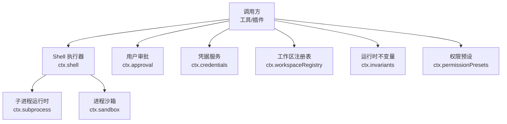
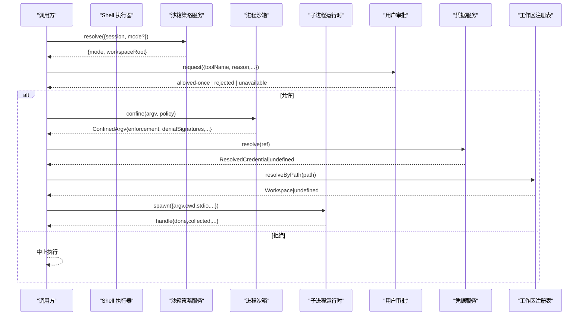
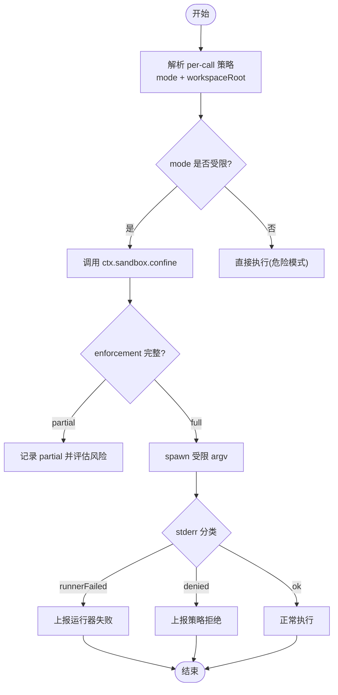
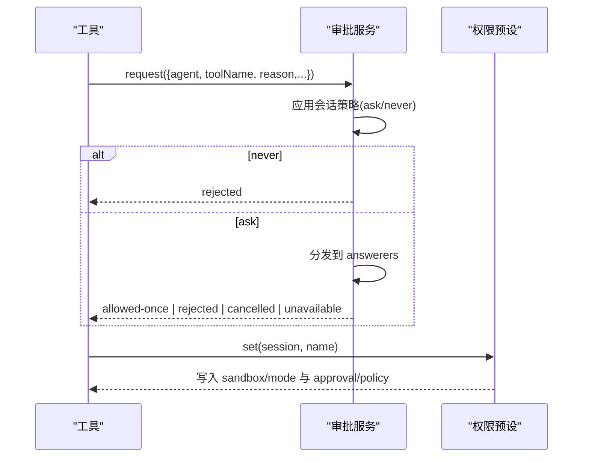
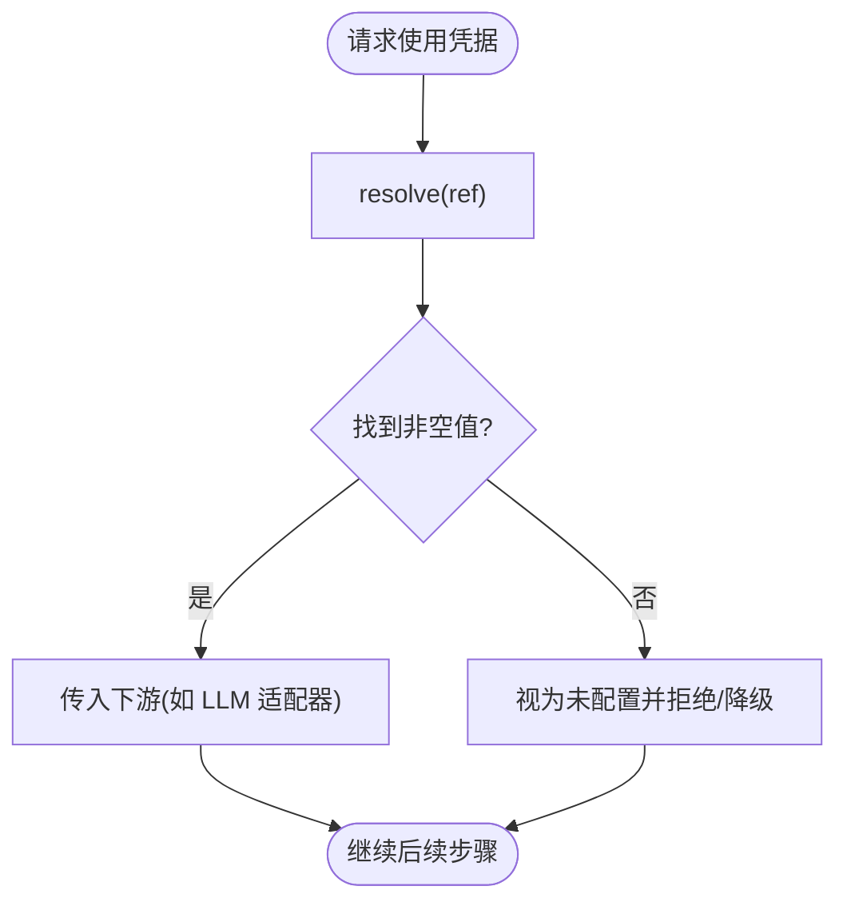
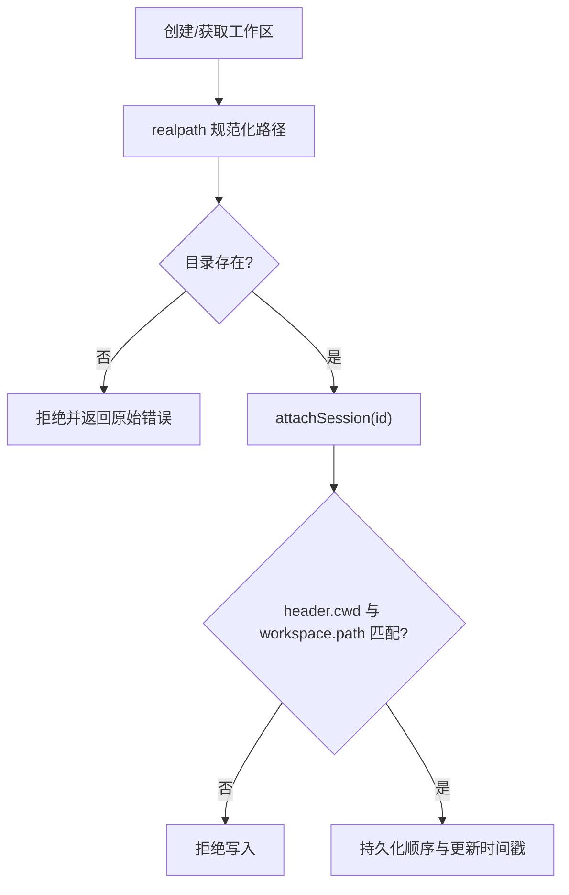
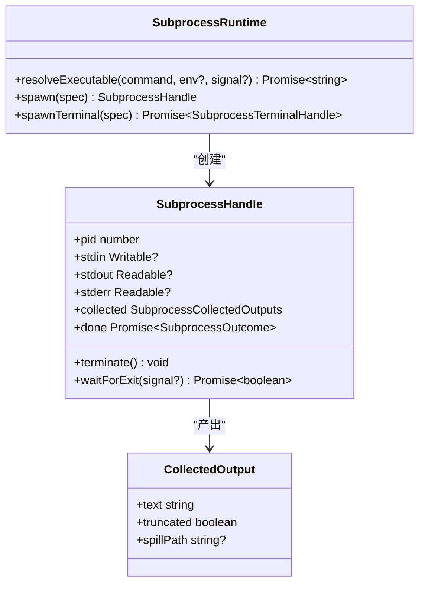
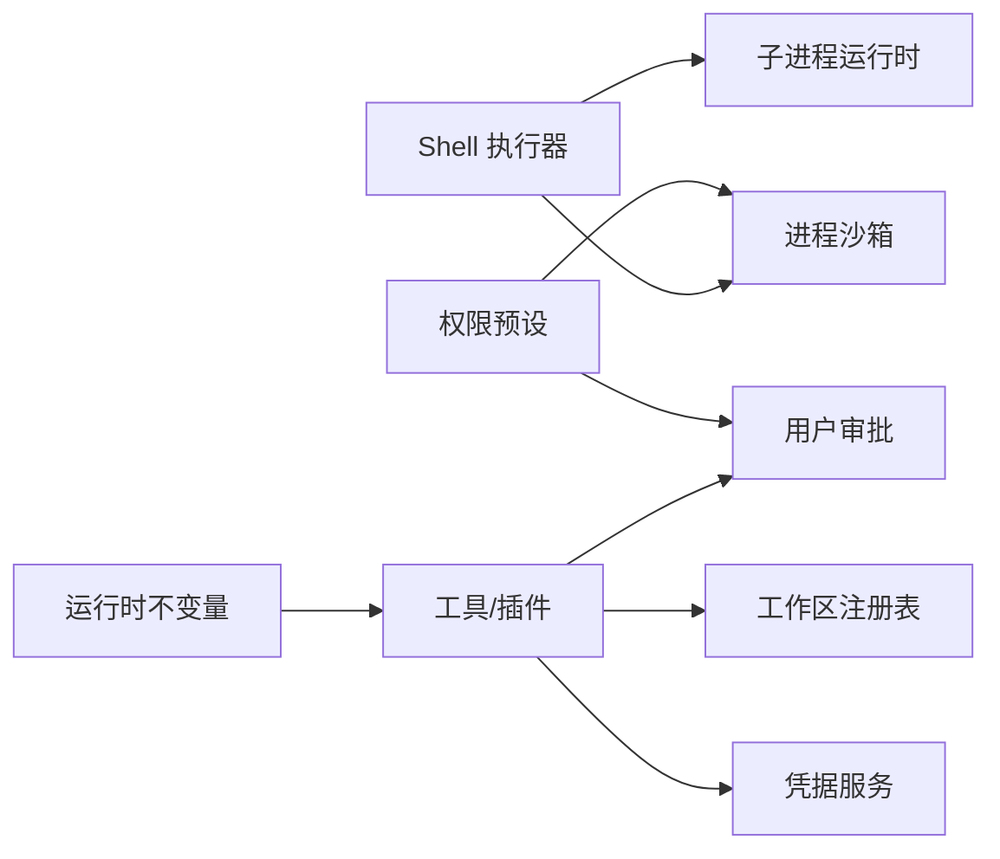

# 安全最佳实践

<cite>
**本文引用的文件**
- [sandbox.md](file://docs/subsystems/sandbox.md)
- [permission-presets.md](file://docs/subsystems/permission-presets.md)
- [invariants.md](file://docs/subsystems/invariants.md)
- [defensive-patterns.md](file://docs/defensive-patterns.md)
- [shell.md](file://docs/subsystems/shell.md)
- [subprocess.md](file://docs/subsystems/subprocess.md)
- [approval.md](file://docs/subsystems/approval.md)
- [credentials.md](file://docs/subsystems/credentials.md)
- [workspace.md](file://docs/subsystems/workspace.md)
- [postmortem/README.md](file://docs/postmortem/README.md)
- [verify-config-source-ownership.ts](file://scripts/verify-config-source-ownership.ts)
</cite>

## 目录
1. [简介](#简介)
2. [项目结构](#项目结构)
3. [核心组件](#核心组件)
4. [架构总览](#架构总览)
5. [详细组件分析](#详细组件分析)
6. [依赖关系分析](#依赖关系分析)
7. [性能与安全权衡](#性能与安全权衡)
8. [故障排查与应急响应](#故障排查与应急响应)
9. [结论](#结论)
10. [附录：部署环境定制建议与配置模板](#附录部署环境定制建议与配置模板)

## 简介
本指南面向 DeepSeek Harness 的安全工程实践，聚焦防御性编程、权限控制、沙箱边界、不变量验证、输入校验与错误处理。内容基于仓库中的子系统文档与脚本实现，覆盖进程沙箱、用户审批、凭据管理、工作区隔离、子进程执行等关键面，并提供不同部署环境的差异化建议与可操作模板。

## 项目结构
DeepSeek Harness 将安全能力拆分为多个“能力缝”（seam）与配套服务：
- 进程沙箱：统一封装平台后端（Linux bwrap/Landlock、macOS Seatbelt、Windows ACL），提供 per-call 策略与执行事实。
- 用户审批：以会话级策略驱动 ask/never，审计事件落盘，fail-closed 默认拒绝。
- 凭据管理：引用式配置，按操作解析，空值即不存在；支持热更新。
- 工作区：持久化目录归属与会话成员关系，启动时基于头信息完成历史归并。
- Shell/子进程：显式 stdio 模式、收集输出、树级终止、凭据清洗、DSH_* 命名空间。
- 运行时不变量：包级注册、白/黑名单过滤、失败可追溯。
- 权限预设：将沙箱模式与审批策略打包为可选 UI 选择项。

图表来源
- [shell.md:1-304](file://docs/subsystems/shell.md#L1-L304)
- [subprocess.md:1-325](file://docs/subsystems/subprocess.md#L1-L325)
- [sandbox.md:1-219](file://docs/subsystems/sandbox.md#L1-L219)
- [approval.md:1-171](file://docs/subsystems/approval.md#L1-L171)
- [credentials.md:1-134](file://docs/subsystems/credentials.md#L1-L134)
- [workspace.md:1-229](file://docs/subsystems/workspace.md#L1-L229)
- [invariants.md:1-89](file://docs/subsystems/invariants.md#L1-L89)
- [permission-presets.md:1-132](file://docs/subsystems/permission-presets.md#L1-L132)

章节来源
- [shell.md:1-304](file://docs/subsystems/shell.md#L1-L304)
- [subprocess.md:1-325](file://docs/subsystems/subprocess.md#L1-L325)
- [sandbox.md:1-219](file://docs/subsystems/sandbox.md#L1-L219)
- [approval.md:1-171](file://docs/subsystems/approval.md#L1-L171)
- [credentials.md:1-134](file://docs/subsystems/credentials.md#L1-L134)
- [workspace.md:1-229](file://docs/subsystems/workspace.md#L1-L229)
- [invariants.md:1-89](file://docs/subsystems/invariants.md#L1-L89)
- [permission-presets.md:1-132](file://docs/subsystems/permission-presets.md#L1-L132)

## 核心组件
- 进程沙箱：定义 read-only / workspace-write / danger-full-access 三种文件效果模式，per-call 策略携带 sessionId、workspaceRoot，返回 ConfinedArgv 及 enforcement 完整性（full/partial）。
- 用户审批：会话级 ask/never 策略，approval/request 瀑布决策，审计事件 approval/asked + approval/decided 成对记录。
- 凭据管理：CredentialRef 引用式配置，resolve/describe/set/unset 四元接口；空值即不存在，避免误配。
- 工作区：WorkspaceId 稳定标识，realpath 规范化路径，attachSession 双向校验（id 在账户中且 header.cwd 匹配）。
- Shell/子进程：显式 SubprocessSpawnSpec，collect 模式输出带 spill 恢复；terminate 树级 SIGTERM→grace→SIGKILL；DSH_* 受控环境变量。
- 运行时不变量：按包名注册检查，白/黑名单过滤，失败抛出 INVARIANT 错误并可追溯至包名。
- 权限预设：将 sandbox/mode 与 approval/policy 打包为 preset，current() 推导当前组合，set() 写入各自 setter。

章节来源
- [sandbox.md:1-219](file://docs/subsystems/sandbox.md#L1-L219)
- [approval.md:1-171](file://docs/subsystems/approval.md#L1-L171)
- [credentials.md:1-134](file://docs/subsystems/credentials.md#L1-L134)
- [workspace.md:1-229](file://docs/subsystems/workspace.md#L1-L229)
- [shell.md:1-304](file://docs/subsystems/shell.md#L1-L304)
- [subprocess.md:1-325](file://docs/subsystems/subprocess.md#L1-L325)
- [invariants.md:1-89](file://docs/subsystems/invariants.md#L1-L89)
- [permission-presets.md:1-132](file://docs/subsystems/permission-presets.md#L1-L132)

## 架构总览
下图展示一次受限 shell 执行的端到端流程：调用方通过 Shell 执行器发起命令，沙箱策略服务决定模式与工作区根，子进程运行时负责创建进程与输出收集，审批服务决定是否放行，凭据服务提供密钥引用解析，工作区确保目录归属一致。

图表来源
- [shell.md:1-304](file://docs/subsystems/shell.md#L1-L304)
- [sandbox.md:1-219](file://docs/subsystems/sandbox.md#L1-L219)
- [subprocess.md:1-325](file://docs/subsystems/subprocess.md#L1-L325)
- [approval.md:1-171](file://docs/subsystems/approval.md#L1-L171)
- [credentials.md:1-134](file://docs/subsystems/credentials.md#L1-L134)
- [workspace.md:1-229](file://docs/subsystems/workspace.md#L1-L229)

## 详细组件分析

### 进程沙箱与执行策略
- 模式与强制粒度：read-only、workspace-write、danger-full-access；仅前两种可下发给 provider，danger-full-access 由消费者自行绕过。
- per-call 策略：携带 sessionId、workspaceRoot，provider 不共享状态，并发安全。
- 执行事实：enforcement full/partial 区分后端能力差异；denialSignatures 与 runnerFailureRules 用于区分“被沙箱拦截”和“沙箱运行器失败”。
- 失败关闭：无可用后端抛 SANDBOX_UNAVAILABLE；静默直通非法。

图表来源
- [sandbox.md:1-219](file://docs/subsystems/sandbox.md#L1-L219)
- [shell.md:1-304](file://docs/subsystems/shell.md#L1-L304)

章节来源
- [sandbox.md:1-219](file://docs/subsystems/sandbox.md#L1-L219)
- [shell.md:1-304](file://docs/subsystems/shell.md#L1-L304)

### 用户审批与权限预设
- 审批策略：会话级 ask/never；never 直接拒绝，ask 进入 answerer 瀑布，缺失或异常回答者返回 unavailable（fail-closed）。
- 审计：approval/asked + approval/decided 成对落盘，模型不可见但可回放。
- 权限预设：将 sandbox/mode 与 approval/policy 打包为 preset；current() 根据有效旋钮推导；set() 仅写入变更的旋钮。

图表来源
- [approval.md:1-171](file://docs/subsystems/approval.md#L1-L171)
- [permission-presets.md:1-132](file://docs/subsystems/permission-presets.md#L1-L132)

章节来源
- [approval.md:1-171](file://docs/subsystems/approval.md#L1-L171)
- [permission-presets.md:1-132](file://docs/subsystems/permission-presets.md#L1-L132)

### 凭据管理与配置来源校验
- 引用式配置：CredentialRef 指向环境变量名；resolve 每次操作重新解析，支持热更新。
- 空值语义：空存储值视为未配置，避免误用。
- 配置来源校验：脚本禁止在 shipped 配置中内联凭据或端点，强制走 ctx.credentials 与环境快照。

图表来源
- [credentials.md:1-134](file://docs/subsystems/credentials.md#L1-L134)
- [verify-config-source-ownership.ts:25-56](file://scripts/verify-config-source-ownership.ts#L25-L56)

章节来源
- [credentials.md:1-134](file://docs/subsystems/credentials.md#L1-L134)
- [verify-config-source-ownership.ts:25-56](file://scripts/verify-config-source-ownership.ts#L25-L56)

### 工作区与目录边界
- 身份与规范：WorkspaceId 稳定；path 经 realpath 规范化，唯一性基于字符串相等。
- 成员关系：attachSession 要求 id 在账户中且 session header.cwd 与 workspace path 一致。
- 启动引导：从持久化头构建索引，一次性归并历史，未匹配 cwd 的会话保持 Ungrouped。

图表来源
- [workspace.md:1-229](file://docs/subsystems/workspace.md#L1-L229)

章节来源
- [workspace.md:1-229](file://docs/subsystems/workspace.md#L1-L229)

### Shell/子进程执行与输出收集
- 显式规格：SubprocessSpawnSpec 不含默认值，所有处置、限制、目录均由调用方明确。
- 输出收集：collect 模式支持溢出尾缓存与 spill 文件恢复；reader 偏移读取互不干扰。
- 终止与清理：terminate 树级 SIGTERM→grace→SIGKILL；waitForExit 等待整棵树退出。
- 环境变量：丢弃外部 DSH_*，合并受控 DshEnvironment；凭据清洗防止泄露。

图表来源
- [subprocess.md:1-325](file://docs/subsystems/subprocess.md#L1-L325)
- [shell.md:1-304](file://docs/subsystems/shell.md#L1-L304)

章节来源
- [subprocess.md:1-325](file://docs/subsystems/subprocess.md#L1-L325)
- [shell.md:1-304](file://docs/subsystems/shell.md#L1-L304)

### 运行时不变量与防御性编程
- 不变量注册：包级 companion 插件注册检查，白/黑名单过滤，失败抛出 INVARIANT 错误并标注包名。
- 防御性规则：独立报告正交结果；公共契约两侧一致；异步状态≠同步状态；dispose 必须到达静止；回调异常隔离；不暴露敏感环境与可预测路径；符号链接安全删除。

章节来源
- [invariants.md:1-89](file://docs/subsystems/invariants.md#L1-L89)
- [defensive-patterns.md:1-34](file://docs/defensive-patterns.md#L1-L34)

## 依赖关系分析
- 松耦合能力缝：每个安全能力以服务形式暴露，消费者通过 ctx.* 访问，便于替换与测试。
- 强约束边界：沙箱与审批构成双重门；子进程与 Shell 层严格分离职责；凭据与工作区提供上下文支撑。
- 潜在循环：各 seam 通过 Cordis 上下文解耦，未见直接循环依赖；配置与预设作为上层编排。

图表来源
- [permission-presets.md:1-132](file://docs/subsystems/permission-presets.md#L1-L132)
- [sandbox.md:1-219](file://docs/subsystems/sandbox.md#L1-L219)
- [approval.md:1-171](file://docs/subsystems/approval.md#L1-L171)
- [shell.md:1-304](file://docs/subsystems/shell.md#L1-L304)
- [subprocess.md:1-325](file://docs/subsystems/subprocess.md#L1-L325)
- [credentials.md:1-134](file://docs/subsystems/credentials.md#L1-L134)
- [workspace.md:1-229](file://docs/subsystems/workspace.md#L1-L229)
- [invariants.md:1-89](file://docs/subsystems/invariants.md#L1-L89)

章节来源
- [permission-presets.md:1-132](file://docs/subsystems/permission-presets.md#L1-L132)
- [sandbox.md:1-219](file://docs/subsystems/sandbox.md#L1-L219)
- [approval.md:1-171](file://docs/subsystems/approval.md#L1-L171)
- [shell.md:1-304](file://docs/subsystems/shell.md#L1-L304)
- [subprocess.md:1-325](file://docs/subsystems/subprocess.md#L1-L325)
- [credentials.md:1-134](file://docs/subsystems/credentials.md#L1-L134)
- [workspace.md:1-229](file://docs/subsystems/workspace.md#L1-L229)
- [invariants.md:1-89](file://docs/subsystems/invariants.md#L1-L89)

## 性能与安全权衡
- 沙箱 enforcement partial：在旧内核或特定后端下可能仅部分生效，需在上层做风险评估与降级策略。
- 输出收集 spill：大输出会写 spill 文件，需考虑磁盘与 I/O 开销；仅在需要完整恢复时启用 spill。
- 审批 ask：交互成本较高，headless/CI 场景建议使用 never 以降低延迟与不确定性。
- 凭据热更新：每次操作重新解析带来轻微开销，但避免重启与缓存过期问题。

[本节为通用指导，不直接分析具体文件]

## 故障排查与应急响应
- 常见现象定位：
  - 沙箱拒绝：查看 stderr 分类与 denialSignatures，确认 enforcement 是否为 partial。
  - 运行器失败：依据 runnerFailureRules 判断是否在命令执行前失败。
  - 审批拒绝：检查会话策略与 answerer 链，必要时切换到 ask 并补充理由。
  - 凭据未配置：确认引用是否存在、是否空值、是否被只读源遮挡。
  - 工作区不一致：核对 session header.cwd 与 workspace path 是否匹配。
- 应急流程：
  - 立即回滚到更保守的沙箱模式（如 workspace-write → read-only）。
  - 临时切换审批策略为 ask，收集人工决策与审计日志。
  - 若凭据失效，优先恢复引用来源并确保非空。
  - 对疑似逃逸或越权行为，保留会话日志与 spill 文件，进行事后复盘。

章节来源
- [sandbox.md:1-219](file://docs/subsystems/sandbox.md#L1-L219)
- [approval.md:1-171](file://docs/subsystems/approval.md#L1-L171)
- [credentials.md:1-134](file://docs/subsystems/credentials.md#L1-L134)
- [workspace.md:1-229](file://docs/subsystems/workspace.md#L1-L229)
- [postmortem/README.md:1-19](file://docs/postmortem/README.md#L1-L19)

## 结论
DeepSeek Harness 通过能力缝与严格边界设计，实现了进程沙箱、用户审批、凭据管理、工作区隔离与子进程控制的系统化安全体系。结合运行时不变量与防御性编程约定，可在多环境下提供可审计、可回放、可回滚的安全执行环境。生产部署应遵循最小权限原则，结合权限预设与审批策略，持续评估后端 enforcement 完整性，并以事故复盘机制完善防护网。

[本节为总结性内容，不直接分析具体文件]

## 附录：部署环境定制建议与配置模板

- 本地开发
  - 沙箱模式：workspace-write（允许在工作区与后端临时目录写入）。
  - 审批策略：ask（交互式确认高风险操作）。
  - 凭据：使用本地环境变量或文件源，确保非空。
  - 工作区：绑定到当前项目目录，确保 attachSession 成功。
  - 参考：[permission-presets.md:1-132](file://docs/subsystems/permission-presets.md#L1-L132)、[sandbox.md:1-219](file://docs/subsystems/sandbox.md#L1-L219)、[approval.md:1-171](file://docs/subsystems/approval.md#L1-L171)、[credentials.md:1-134](file://docs/subsystems/credentials.md#L1-L134)、[workspace.md:1-229](file://docs/subsystems/workspace.md#L1-L229)

- CI/Headless
  - 沙箱模式：read-only（仅允许必要写入 sink）。
  - 审批策略：never（确定性拒绝，避免阻塞流水线）。
  - 凭据：注入环境变量引用，确保每步解析最新值。
  - 工作区：固定只读挂载，避免意外写入。
  - 参考：[approval.md:1-171](file://docs/subsystems/approval.md#L1-L171)、[sandbox.md:1-219](file://docs/subsystems/sandbox.md#L1-L219)、[credentials.md:1-134](file://docs/subsystems/credentials.md#L1-L134)

- 生产服务器
  - 沙箱模式：read-only 或 workspace-write（依据业务需求），关注 enforcement partial 的风险提示。
  - 审批策略：ask（关键操作需人工确认），结合审计日志。
  - 凭据：集中化管理（如项目级或用户级环境），禁止内联。
  - 工作区：严格归属校验，定期清理无效会话。
  - 参考：[sandbox.md:1-219](file://docs/subsystems/sandbox.md#L1-L219)、[approval.md:1-171](file://docs/subsystems/approval.md#L1-L171)、[credentials.md:1-134](file://docs/subsystems/credentials.md#L1-L134)、[workspace.md:1-229](file://docs/subsystems/workspace.md#L1-L229)

- 容器/微虚拟机/远程执行
  - 使用容器或微 VM 作为整体能力缝的替代实现；进程沙箱仍用于细粒度文件效果控制。
  - 注意网络与进程可见性不在沙箱模式词汇范围内，需额外隔离。
  - 参考：[sandbox.md:1-219](file://docs/subsystems/sandbox.md#L1-L219)

- 配置模板要点
  - 预设表：包含 workspace-write+ask 与 danger-full-access+never 两项基础预设；custom 为派生态，不可作为目标。
  - 默认预设：当组合默认无法匹配任何预设时需显式配置 defaultPreset。
  - 配置来源：禁止在 shipped 配置中内联凭据或端点，统一通过 ctx.credentials 与环境快照。
  - 参考：[permission-presets.md:1-132](file://docs/subsystems/permission-presets.md#L1-L132)、[verify-config-source-ownership.ts:25-56](file://scripts/verify-config-source-ownership.ts#L25-L56)

章节来源
- [permission-presets.md:1-132](file://docs/subsystems/permission-presets.md#L1-L132)
- [sandbox.md:1-219](file://docs/subsystems/sandbox.md#L1-L219)
- [approval.md:1-171](file://docs/subsystems/approval.md#L1-L171)
- [credentials.md:1-134](file://docs/subsystems/credentials.md#L1-L134)
- [workspace.md:1-229](file://docs/subsystems/workspace.md#L1-L229)
- [verify-config-source-ownership.ts:25-56](file://scripts/verify-config-source-ownership.ts#L25-L56)