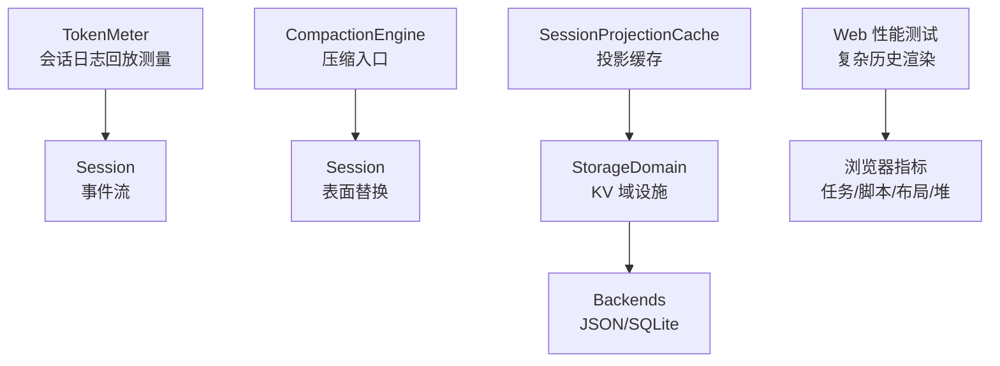
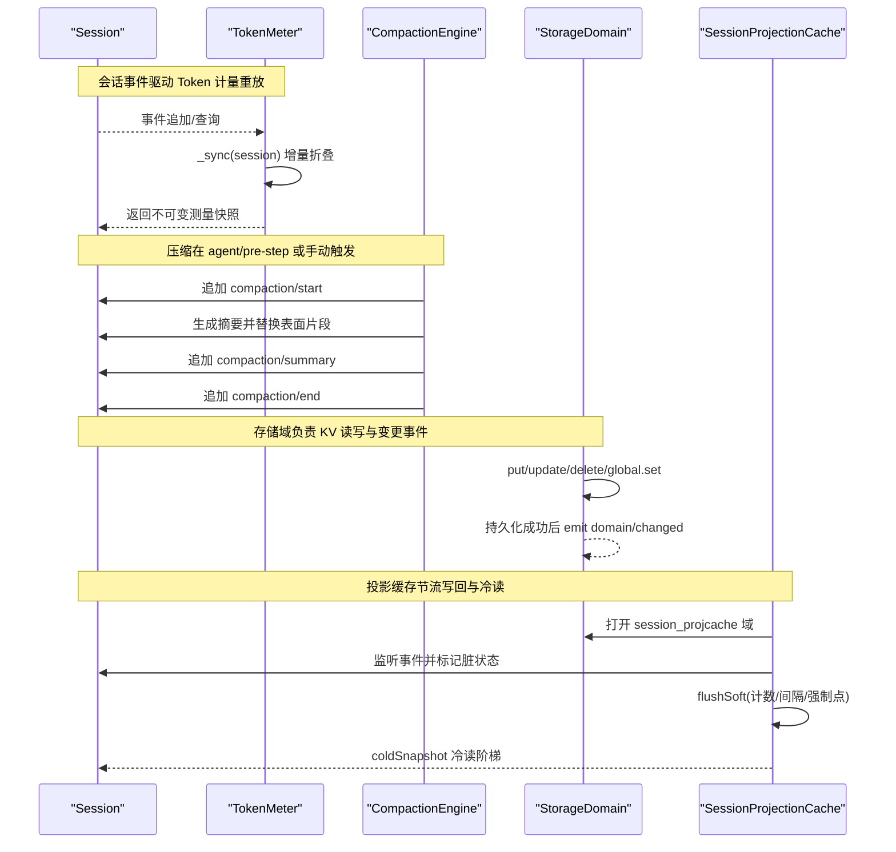
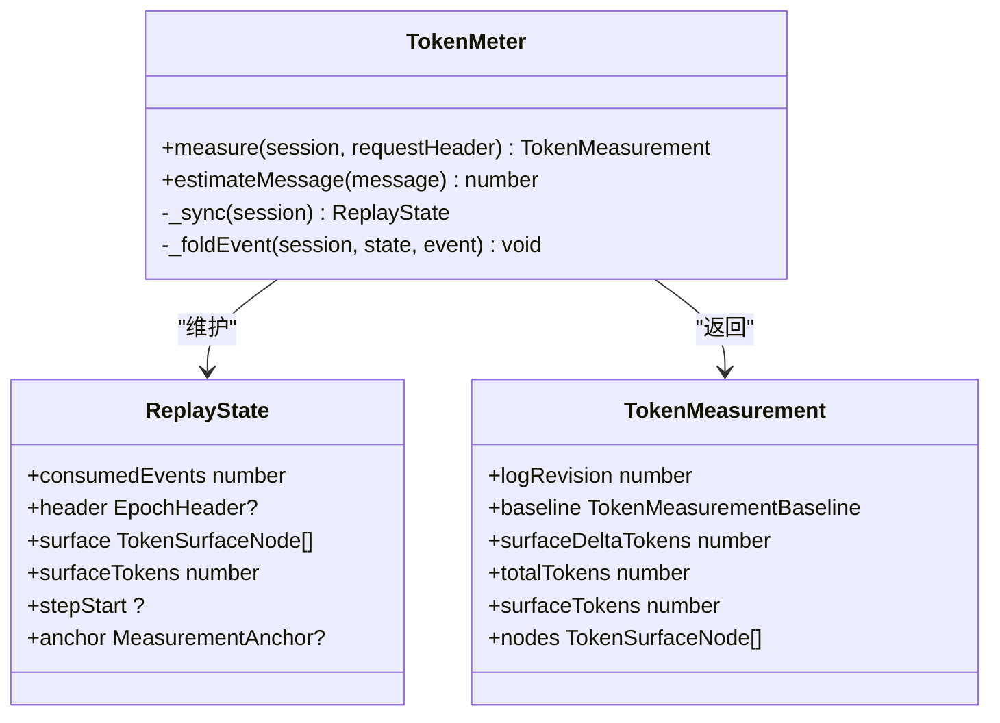
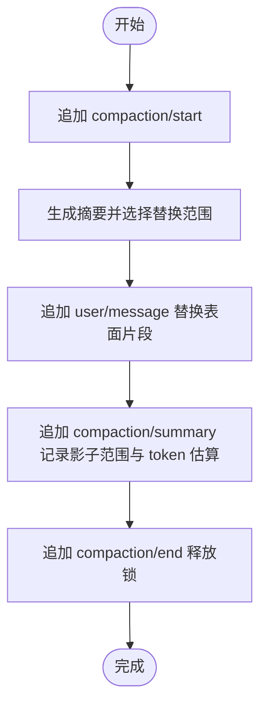
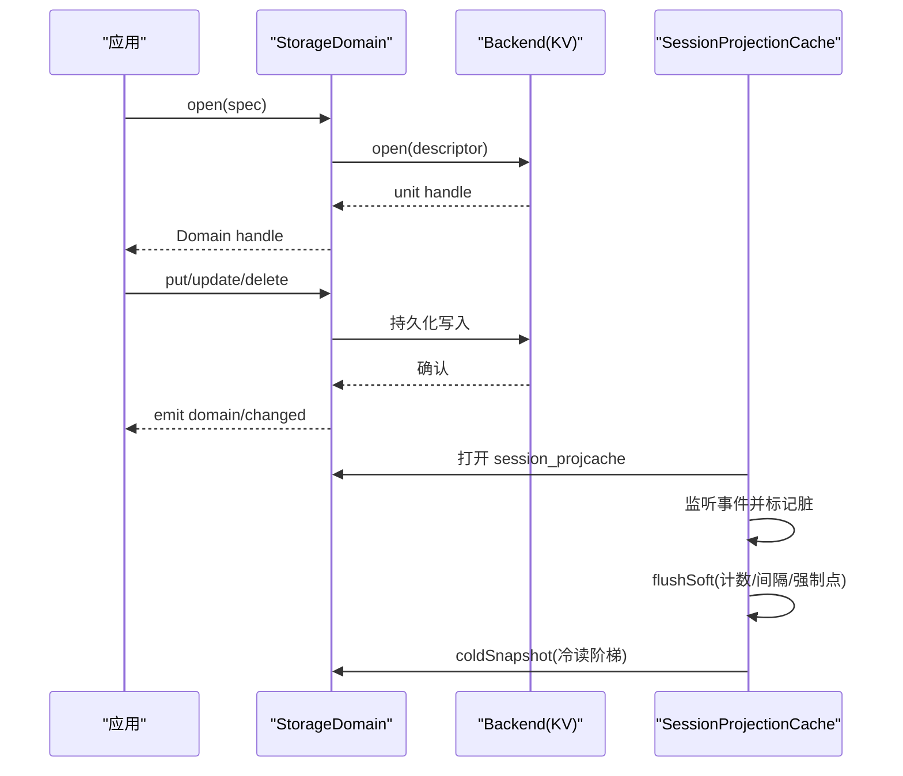
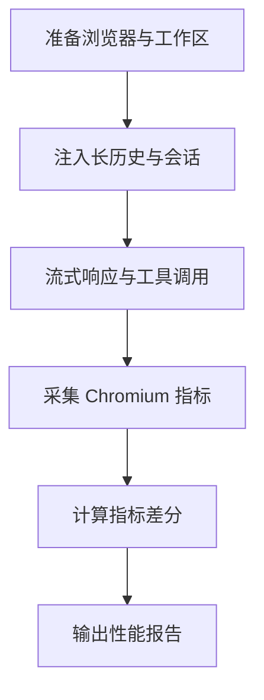
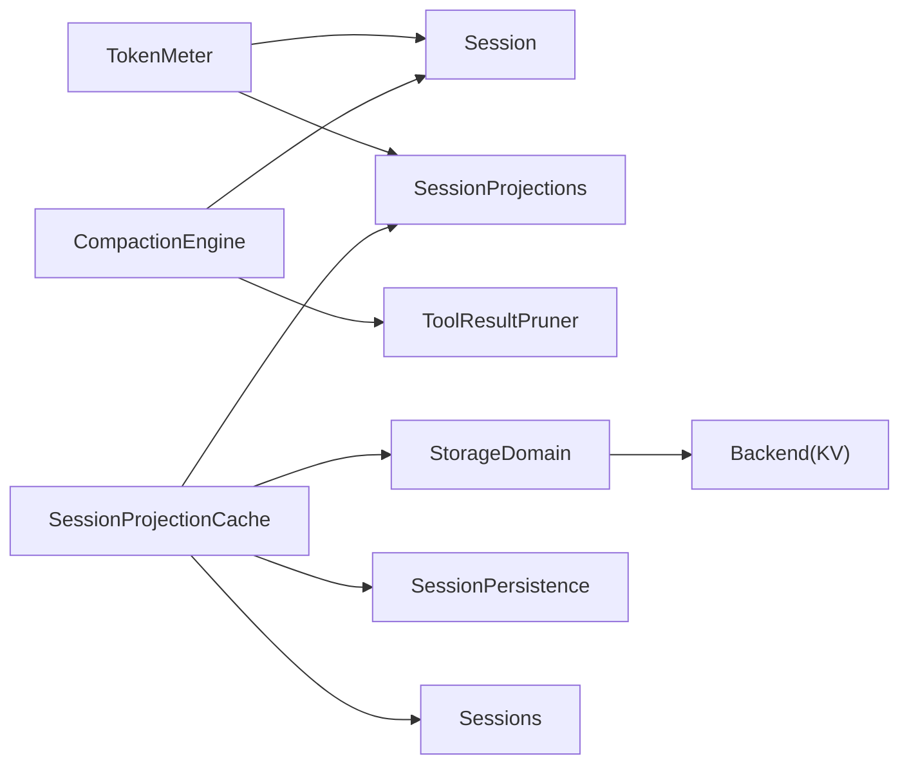

# 性能优化

<cite>
**本文引用的文件**
- [packages/llm/token-meter/src/index.ts](file://packages/llm/token-meter/src/index.ts)
- [packages/llm/token-meter/src/types.ts](file://packages/llm/token-meter/src/types.ts)
- [docs/subsystems/token-meter.md](file://docs/subsystems/token-meter.md)
- [docs/subsystems/compaction.md](file://docs/subsystems/compaction.md)
- [docs/subsystems/storage.md](file://docs/subsystems/storage.md)
- [packages/storage/storage-domain/src/index.ts](file://packages/storage/storage-domain/src/index.ts)
- [packages/session/session-projection-cache/src/index.ts](file://packages/session/session-projection-cache/src/index.ts)
- [packages/session/session-projection-cache/tests/cache.spec.ts](file://packages/session/session-projection-cache/tests/cache.spec.ts)
- [apps/web/tests/complex-history.perf.ts](file://apps/web/tests/complex-history.perf.ts)
- [BENCHMARK.md](file://BENCHMARK.md)
</cite>

## 目录
1. [简介](#简介)
2. [项目结构](#项目结构)
3. [核心组件](#核心组件)
4. [架构总览](#架构总览)
5. [详细组件分析](#详细组件分析)
6. [依赖关系分析](#依赖关系分析)
7. [性能考量](#性能考量)
8. [故障排查指南](#故障排查指南)
9. [结论](#结论)
10. [附录](#附录)

## 简介
本指南聚焦 DeepSeek Harness 的性能优化，围绕 Token 计量、运行时诊断、会话压缩与存储优化四大主题展开。内容涵盖：
- Token 计量与使用量投影的机制与复杂度
- 会话压缩（Compaction）触发策略、范围选择与工具结果裁剪
- 存储子系统与投影缓存的写回策略、冷读路径与一致性保障
- 性能监控工具、瓶颈识别技巧与调优建议
- 内存管理、并发控制与缓存策略的最佳实践
- 基准测试、负载测试与生产环境配置模板及监控方案

## 项目结构
DeepSeek Harness 将性能相关能力拆分为多个可插拔子系统：
- Token 计量服务：提供基于会话日志的可回放测量，输出不可变快照
- 会话压缩：可选能力，通过事件记录锁、摘要与影子节点，安全替换历史片段
- 存储子系统：后端无关的 KV 域抽象，支持 JSON/SQLite 等实现
- 投影缓存：对会话投影做持久化缓存，支持节流写回与冷读阶梯
- Web 端性能测试：基于 Playwright 的高基数历史渲染压测与指标采集

**图示来源**
- [packages/llm/token-meter/src/index.ts:74-147](file://packages/llm/token-meter/src/index.ts#L74-L147)
- [docs/subsystems/compaction.md:9-23](file://docs/subsystems/compaction.md#L9-L23)
- [docs/subsystems/storage.md:9-47](file://docs/subsystems/storage.md#L9-L47)
- [packages/session/session-projection-cache/src/index.ts:62-89](file://packages/session/session-projection-cache/src/index.ts#L62-L89)
- [apps/web/tests/complex-history.perf.ts:1-104](file://apps/web/tests/complex-history.perf.ts#L1-L104)

**章节来源**
- [docs/subsystems/token-meter.md:1-91](file://docs/subsystems/token-meter.md#L1-L91)
- [docs/subsystems/compaction.md:1-239](file://docs/subsystems/compaction.md#L1-L239)
- [docs/subsystems/storage.md:1-230](file://docs/subsystems/storage.md#L1-L230)
- [packages/session/session-projection-cache/src/index.ts:62-89](file://packages/session/session-projection-cache/src/index.ts#L62-L89)
- [apps/web/tests/complex-history.perf.ts:1-200](file://apps/web/tests/complex-history.perf.ts#L1-L200)

## 核心组件
- Token 计量服务：以会话事件为输入，维护每会话的重放状态，输出包含请求压力与表面定价的不可变快照；支持按最近成功调用锚点复用用量，否则走启发式重估
- 会话压缩：通过 start/summary/end 事件锁定操作，生成摘要并替换表面片段；可选工具结果裁剪减少文本体积
- 存储域设施：声明式领域模型，路由到具体后端；读写链保证顺序与一致性，变更事件在持久化后发出
- 投影缓存：对会话投影进行节流写回，并在 turn/end 与 session 释放时强制落盘；冷读从缓存行、持久化 tail、注册表恢复，再写回刷新

**章节来源**
- [packages/llm/token-meter/src/index.ts:74-147](file://packages/llm/token-meter/src/index.ts#L74-L147)
- [docs/subsystems/compaction.md:9-86](file://docs/subsystems/compaction.md#L9-L86)
- [docs/subsystems/storage.md:9-103](file://docs/subsystems/storage.md#L9-L103)
- [packages/session/session-projection-cache/src/index.ts:62-89](file://packages/session/session-projection-cache/src/index.ts#L62-L89)

## 架构总览
下图展示 Token 计量、压缩、存储与投影缓存之间的交互关系，以及它们在会话生命周期中的职责边界。

**图示来源**
- [packages/llm/token-meter/src/index.ts:116-181](file://packages/llm/token-meter/src/index.ts#L116-L181)
- [docs/subsystems/compaction.md:9-23](file://docs/subsystems/compaction.md#L9-L23)
- [docs/subsystems/storage.md:104-125](file://docs/subsystems/storage.md#L104-L125)
- [packages/session/session-projection-cache/src/index.ts:62-89](file://packages/session/session-projection-cache/src/index.ts#L62-L89)

## 详细组件分析

### Token 计量（Token Meter）
- 设计要点
  - 每个会话独立维护重放状态，增量消费事件，避免重复计算
  - 测量结果深度冻结，确保不可变性与线程安全
  - 当最近一次成功调用的请求头匹配且总量不低于启发式锚点时，复用 provider 用量；否则对完整包络与表面进行启发式重估
  - 测量复杂度为 O(表面节点数)，因为每次调用会克隆位置节点
- 关键数据结构
  - TokenMeasurement：包含 logRevision、baseline、surfaceDeltaTokens、totalTokens、surfaceTokens、nodes
  - TokenSurfaceNode：序列号与启发式 token 数
- 性能影响
  - 重用用量锚点可减少重估开销
  - 表面节点数量增长将线性增加测量成本，需配合压缩降低表面规模

**图示来源**
- [packages/llm/token-meter/src/index.ts:74-147](file://packages/llm/token-meter/src/index.ts#L74-L147)
- [packages/llm/token-meter/src/types.ts:20-42](file://packages/llm/token-meter/src/types.ts#L20-L42)

**章节来源**
- [packages/llm/token-meter/src/index.ts:74-147](file://packages/llm/token-meter/src/index.ts#L74-L147)
- [packages/llm/token-meter/src/types.ts:20-42](file://packages/llm/token-meter/src/types.ts#L20-L42)
- [docs/subsystems/token-meter.md:1-91](file://docs/subsystems/token-meter.md#L1-L91)

### 会话压缩（Compaction）
- 事件契约
  - compaction/start：获取锁，记录 turn 或 null（手动）
  - compaction/summary：记录摘要、被影子化的范围与 seqs、估计 token 数、模型调用信息
  - compaction/end：释放锁，记录错误（如有）
- 触发策略
  - 自动：pressure 或 context-overflow；在 agent/pre-step 串行执行
  - 手动：compactNow 在空闲时尝试缩减历史
- 工具结果裁剪
  - 可选 pruner 在服务端对工具结果文本进行 head/middle/tail 裁剪，减少 Unicode 字符数
- 性能收益
  - 通过替换大段历史为摘要，显著降低后续请求包络与表面规模
  - 结合 Token 计量，可在压缩前后对比 totalTokens/surfaceTokens，评估效果

**图示来源**
- [docs/subsystems/compaction.md:9-23](file://docs/subsystems/compaction.md#L9-L23)
- [docs/subsystems/compaction.md:60-86](file://docs/subsystems/compaction.md#L60-L86)

**章节来源**
- [docs/subsystems/compaction.md:9-86](file://docs/subsystems/compaction.md#L9-L86)
- [docs/subsystems/compaction.md:90-118](file://docs/subsystems/compaction.md#L90-L118)

### 存储与投影缓存（Storage & Session Projection Cache）
- 存储域设施
  - 声明式领域模型，路由到 JSON/SQLite 后端
  - 写链顺序保证：先持久化，再内存更新，最后 emit domain/changed
  - 读取同步于权威内存状态，迭代器稳定
- 投影缓存
  - 节流写回：计数与间隔触发，turn/end 与 session 释放为强制落盘点
  - 冷读阶梯：缓存行 → 持久化 readFrom tail → 注册表 restore → 写回刷新
  - 失败软处理：写入失败仅记录警告，下次写或冷读自愈

**图示来源**
- [docs/subsystems/storage.md:49-103](file://docs/subsystems/storage.md#L49-L103)
- [docs/subsystems/storage.md:104-125](file://docs/subsystems/storage.md#L104-L125)
- [packages/storage/storage-domain/src/index.ts:69-177](file://packages/storage/storage-domain/src/index.ts#L69-L177)
- [packages/session/session-projection-cache/src/index.ts:62-89](file://packages/session/session-projection-cache/src/index.ts#L62-L89)
- [packages/session/session-projection-cache/tests/cache.spec.ts:120-144](file://packages/session/session-projection-cache/tests/cache.spec.ts#L120-L144)

**章节来源**
- [docs/subsystems/storage.md:9-125](file://docs/subsystems/storage.md#L9-L125)
- [packages/storage/storage-domain/src/index.ts:69-177](file://packages/storage/storage-domain/src/index.ts#L69-L177)
- [packages/session/session-projection-cache/src/index.ts:62-89](file://packages/session/session-projection-cache/src/index.ts#L62-L89)
- [packages/session/session-projection-cache/tests/cache.spec.ts:120-144](file://packages/session/session-projection-cache/tests/cache.spec.ts#L120-L144)

### Web 端性能测试与指标采集
- 高基数历史渲染压测
  - 构造大量侧边栏会话与长历史会话，模拟工具调用与流式响应
  - 采集 wall/task/script/layout/recalcStyle/devtools 时间、DOM 节点与监听器变化、堆内存占用
- 指标差分
  - 通过 before/after 指标差计算各阶段耗时与资源变化
  - 用于回归检测与优化验证

**图示来源**
- [apps/web/tests/complex-history.perf.ts:1-104](file://apps/web/tests/complex-history.perf.ts#L1-L104)
- [apps/web/tests/complex-history.perf.ts:544-568](file://apps/web/tests/complex-history.perf.ts#L544-L568)

**章节来源**
- [apps/web/tests/complex-history.perf.ts:1-200](file://apps/web/tests/complex-history.perf.ts#L1-L200)
- [apps/web/tests/complex-history.perf.ts:544-568](file://apps/web/tests/complex-history.perf.ts#L544-L568)

## 依赖关系分析
- TokenMeter 依赖 Session 事件流与 LLM 消息类型，可选依赖 sessionProjections 注册投影
- CompactionEngine 依赖 Session 与 LLM，可与 toolResultPruner 协作
- StorageDomain 依赖 storage hub 与后端 kv facet，domain/changed 事件由存储层发出
- SessionProjectionCache 依赖 storageDomain、sessionProjections、sessionPersistence、sessions，形成跨子系统协作

**图示来源**
- [packages/llm/token-meter/src/index.ts:85-97](file://packages/llm/token-meter/src/index.ts#L85-L97)
- [docs/subsystems/compaction.md:60-86](file://docs/subsystems/compaction.md#L60-L86)
- [docs/subsystems/storage.md:9-47](file://docs/subsystems/storage.md#L9-L47)
- [packages/session/session-projection-cache/src/index.ts:62-89](file://packages/session/session-projection-cache/src/index.ts#L62-L89)

**章节来源**
- [packages/llm/token-meter/src/index.ts:85-97](file://packages/llm/token-meter/src/index.ts#L85-L97)
- [docs/subsystems/compaction.md:60-86](file://docs/subsystems/compaction.md#L60-L86)
- [docs/subsystems/storage.md:9-47](file://docs/subsystems/storage.md#L9-L47)
- [packages/session/session-projection-cache/src/index.ts:62-89](file://packages/session/session-projection-cache/src/index.ts#L62-L89)

## 性能考量
- Token 计量
  - 优先复用 provider 用量锚点，减少启发式重估
  - 控制会话表面规模，避免 O(surface) 测量成为热点
- 会话压缩
  - 合理设置压力阈值与上下文溢出策略，及时替换大段历史
  - 启用工具结果裁剪，降低文本体积与后续请求包络
- 存储与缓存
  - 调整投影缓存写回策略（计数/间隔），平衡持久化开销与冷读延迟
  - 利用强制落盘点（turn/end、session 释放）确保一致性
- 并发控制
  - 工具调用遵循并发安全标记，限制最大并行子调用数，避免资源争用
- 内存管理
  - 关注 DOM 节点与监听器数量，避免泄漏；定期清理未使用会话与投影
- 监控与诊断
  - 使用 Web 性能测试采集浏览器指标，定位渲染与脚本瓶颈
  - 结合 Token 计量与压缩日志，追踪请求压力变化

[本节为通用指导，不直接分析具体文件]

## 故障排查指南
- Token 计量异常
  - 检查 step/start 与 step/end 是否配对，assistant/message 是否与步骤一致
  - 若 baseline 为 estimated，说明无法复用用量锚点，需检查请求头与 surface 变化
- 压缩失败
  - 查看 compaction/start 是否匹配 end；failed 原因包括 busy、cancelled、changed、summary、commit、persistence
  - 工具结果裁剪失败可能因文本预算不足或格式不合法
- 存储写入失败
  - domain/changed 仅在持久化成功后发出；失败不会回滚内存，但会记录警告
  - 版本不匹配或介质损坏会导致 open 失败
- 投影缓存不一致
  - 冷读阶梯中若缓存行过期或日志收缩，将降级为全量重读
  - 强制落盘点未触发可能导致冷读延迟升高

**章节来源**
- [packages/llm/token-meter/src/index.ts:188-270](file://packages/llm/token-meter/src/index.ts#L188-L270)
- [docs/subsystems/compaction.md:71-86](file://docs/subsystems/compaction.md#L71-L86)
- [docs/subsystems/storage.md:104-125](file://docs/subsystems/storage.md#L104-L125)
- [packages/session/session-projection-cache/tests/cache.spec.ts:247-262](file://packages/session/session-projection-cache/tests/cache.spec.ts#L247-L262)

## 结论
DeepSeek Harness 通过 Token 计量、会话压缩、存储域与投影缓存的组合，提供了可扩展且高性能的会话处理能力。实践中应：
- 以 Token 计量为依据，持续评估请求压力与表面规模
- 合理配置压缩策略与工具结果裁剪，降低后续请求成本
- 利用投影缓存的节流写回与冷读阶梯，平衡持久化与读取性能
- 借助 Web 性能测试与指标采集，定位并优化前端渲染瓶颈
- 在生产环境中结合监控与告警，持续跟踪性能指标与资源使用

[本节为总结性内容，不直接分析具体文件]

## 附录
- 基准测试运行
  - 参考仓库根目录的基准说明，安装 Python SDK 并运行 jsonrpc-agent 最小变体，使用独立工作区与会话 ID 隔离任务
- 生产环境配置模板
  - 存储域：默认后端与路由映射，按域名覆盖后端
  - 投影缓存：写回计数与间隔、强制落盘点策略
  - 压缩：压力阈值、上下文溢出策略、工具结果裁剪开关
- 监控方案
  - 服务端：Token 计量快照、压缩事件、存储变更事件
  - 客户端：浏览器指标（任务/脚本/布局/堆）、DOM 节点与监听器统计

**章节来源**
- [BENCHMARK.md:1-4](file://BENCHMARK.md#L1-L4)
- [docs/subsystems/storage.md:49-103](file://docs/subsystems/storage.md#L49-L103)
- [packages/session/session-projection-cache/src/index.ts:62-89](file://packages/session/session-projection-cache/src/index.ts#L62-L89)
- [docs/subsystems/compaction.md:60-86](file://docs/subsystems/compaction.md#L60-L86)