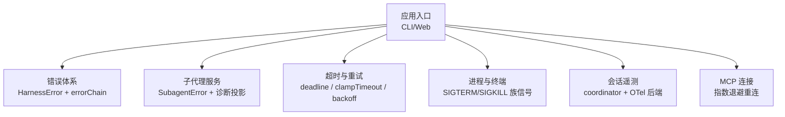
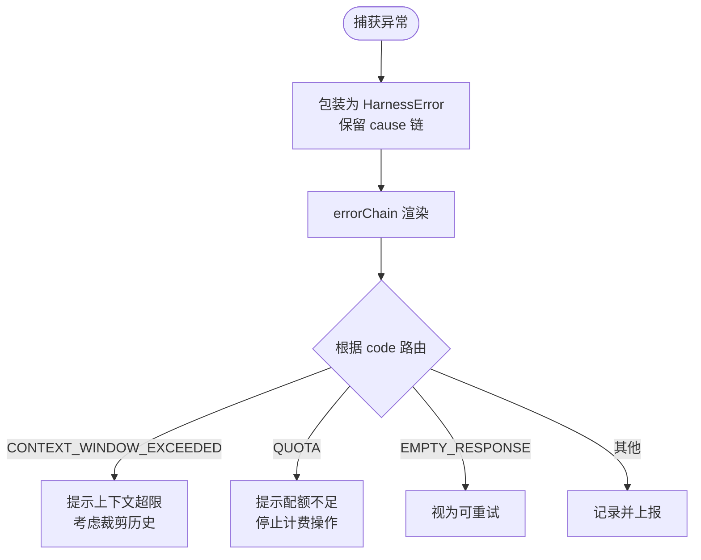
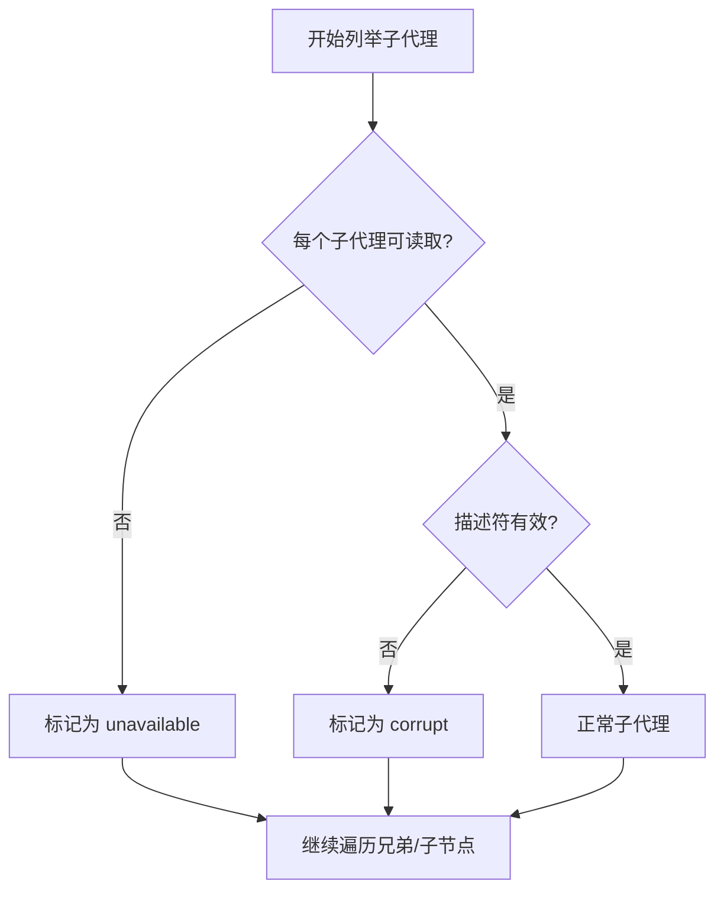
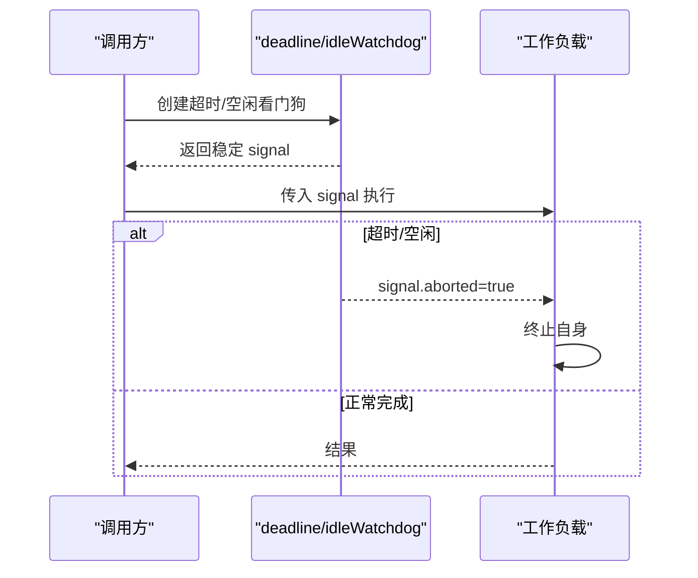
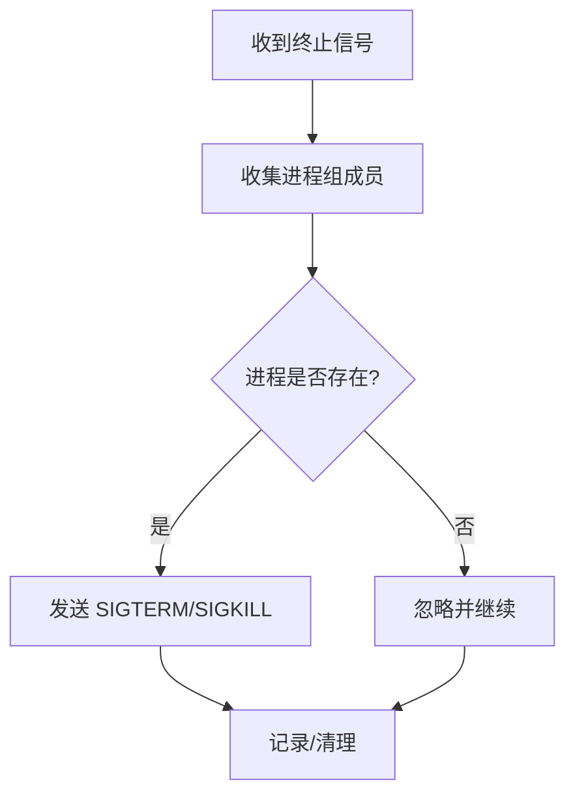
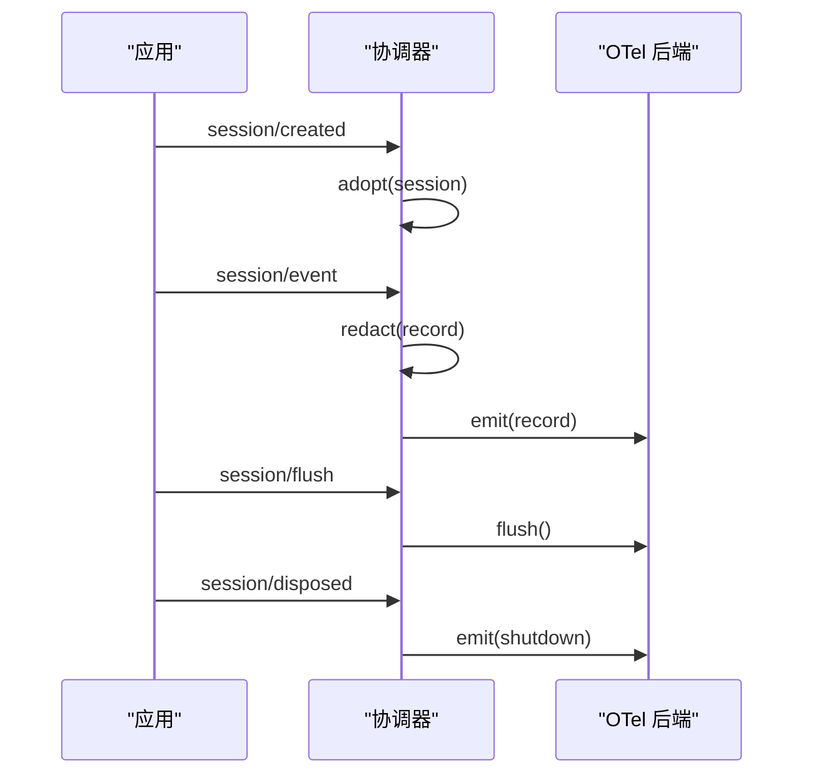
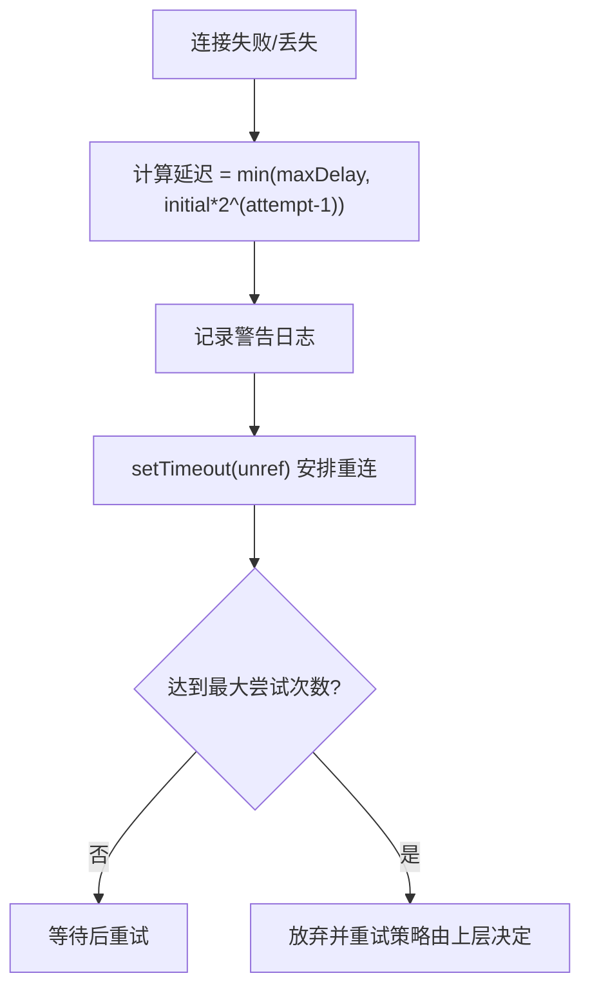
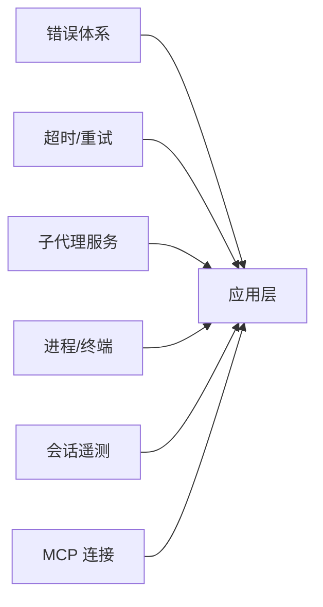

# 故障排除指南

<cite>
**本文引用的文件**
- [packages/llm/llm/src/error.ts](file://packages/llm/llm/src/error.ts)
- [packages/subagent/subagent/src/error.ts](file://packages/subagent/subagent/src/error.ts)
- [packages/util/timeout/README.zh.md](file://packages/util/timeout/README.zh.md)
- [packages/util/timeout/tests/timeout.spec.ts](file://packages/util/timeout/tests/timeout.spec.ts)
- [packages/session/session-telemetry/src/coordinator.ts](file://packages/session/session-telemetry/src/coordinator.ts)
- [packages/session/session-telemetry/src/index.ts](file://packages/session/session-telemetry/src/index.ts)
- [packages/session/session-telemetry-otel/src/index.ts](file://packages/session/session-telemetry-otel/src/index.ts)
- [packages/mcp/mcp-client/src/connection.ts](file://packages/mcp/mcp-client/src/connection.ts)
- [packages/mcp/mcp-client/tests/reconnect.spec.ts](file://packages/mcp/mcp-client/tests/reconnect.spec.ts)
- [packages/subprocess/subprocess-local/src/terminal.ts](file://packages/subprocess/subprocess-local/src/terminal.ts)
- [examples/headless-agent/tests/subagent-diagnostic.snapshot.ts](file://examples/headless-agent/tests/subagent-diagnostic.snapshot.ts)
- [docs/postmortem/README.md](file://docs/postmortem/README.md)
</cite>

## 目录
1. [简介](#简介)
2. [项目结构](#项目结构)
3. [核心组件](#核心组件)
4. [架构总览](#架构总览)
5. [详细组件分析](#详细组件分析)
6. [依赖关系分析](#依赖关系分析)
7. [性能注意事项](#性能注意事项)
8. [故障排查指南](#故障排查指南)
9. [结论](#结论)
10. [附录](#附录)

## 简介
本指南面向 DeepSeek Harness 的使用者与开发者，聚焦于常见问题的诊断、错误日志分析与修复建议。内容涵盖：
- 如何定位与解读错误链、子代理诊断、超时与重试、连接重连等关键路径
- 如何使用运行时遥测（会话遥测）收集问题上下文
- 典型问题的复现步骤、调试技巧与修复建议
- 性能问题排查、内存泄漏检测思路与连接超时的解决流程
- 社区常见问题与专家级调试技巧

## 项目结构
DeepSeek Harness 采用多包模块化架构，错误处理、超时控制、子代理诊断、进程管理、遥测采集等能力分布在独立包中，便于组合与替换。本次故障排除重点涉及以下模块：
- 错误体系：统一的错误基类与错误链渲染
- 子代理：子代理列表与不可用/损坏的诊断投影
- 超时与重试：统一超时信号、退避策略与最大延迟限制
- 进程与终端：子进程终止、组信号发送与资源清理
- 遥测：会话事件采集、去标识化、后端导出与模式开关
- 连接与重连：MCP 客户端的指数退避与未引用定时器



**图表来源**
- [packages/llm/llm/src/error.ts:1-164](file://packages/llm/llm/src/error.ts#L1-L164)
- [packages/subagent/subagent/src/error.ts:1-16](file://packages/subagent/subagent/src/error.ts#L1-L16)
- [packages/util/timeout/README.zh.md:17-47](file://packages/util/timeout/README.zh.md#L17-L47)
- [packages/subprocess/subprocess-local/src/terminal.ts:172-204](file://packages/subprocess/subprocess-local/src/terminal.ts#L172-L204)
- [packages/session/session-telemetry/src/coordinator.ts:69-226](file://packages/session/session-telemetry/src/coordinator.ts#L69-L226)
- [packages/session/session-telemetry-otel/src/index.ts:141-168](file://packages/session/session-telemetry-otel/src/index.ts#L141-L168)
- [packages/mcp/mcp-client/src/connection.ts:214-225](file://packages/mcp/mcp-client/src/connection.ts#L214-L225)

**章节来源**
- [packages/llm/llm/src/error.ts:1-164](file://packages/llm/llm/src/error.ts#L1-L164)
- [packages/subagent/subagent/src/error.ts:1-16](file://packages/subagent/subagent/src/error.ts#L1-L16)
- [packages/util/timeout/README.zh.md:17-47](file://packages/util/timeout/README.zh.md#L17-L47)
- [packages/subprocess/subprocess-local/src/terminal.ts:172-204](file://packages/subprocess/subprocess-local/src/terminal.ts#L172-L204)
- [packages/session/session-telemetry/src/coordinator.ts:69-226](file://packages/session/session-telemetry/src/coordinator.ts#L69-L226)
- [packages/session/session-telemetry-otel/src/index.ts:141-168](file://packages/session/session-telemetry-otel/src/index.ts#L141-L168)
- [packages/mcp/mcp-client/src/connection.ts:214-225](file://packages/mcp/mcp-client/src/connection.ts#L214-L225)

## 核心组件
- 错误体系
  - 统一的机器可路由错误码与人类可读消息分离，支持标准 cause 链与 AggregateError 成员展开，便于在 UI、日志与持久记录中呈现完整失败原因。
  - 提供上下文窗口超限、配额耗尽、空响应、无效凭据等标准化分类，便于上层重试与降级策略。
- 子代理诊断
  - 子代理列表在冷启动检查失败时，将单个子代理降级为“不可用”诊断；对损坏描述符或版本不兼容的子代理标记为“损坏”，并继续遍历其子节点。
- 超时与重试
  - 通过 deadline/idleWatchdog 将取消与超时融合为 AbortSignal，配合 clampTimeout 校验请求超时值，避免过大或非法配置导致系统不稳定。
  - 重试策略包含初始延迟、最大延迟、抖动比例与最大重试次数，参数严格校验并冻结为不可变对象。
- 进程与终端
  - 子进程组信号发送时对已退出进程进行安全捕获；强制停止后代进程时优先使用 SIGKILL，并在宿主退出时尽力回收。
- 会话遥测
  - 协调器订阅会话生命周期事件，按模式采集、去标识化后投递到后端；支持 flush 提示与 shutdown 收尾，确保 turn 边界清晰。
  - OTel 后端支持 FULL/FEEDBACK_ONLY/DISABLED 三种模式，默认禁用以避免意外数据外泄。
- MCP 连接
  - 连接失败或丢失时采用指数退避重连，记录尝试次数与延迟上限，定时器 unref 避免阻止进程退出。

**章节来源**
- [packages/llm/llm/src/error.ts:1-164](file://packages/llm/llm/src/error.ts#L1-L164)
- [packages/subagent/subagent/src/error.ts:1-16](file://packages/subagent/subagent/src/error.ts#L1-L16)
- [packages/util/timeout/README.zh.md:17-47](file://packages/util/timeout/README.zh.md#L17-L47)
- [packages/util/timeout/tests/timeout.spec.ts:1-39](file://packages/util/timeout/tests/timeout.spec.ts#L1-L39)
- [packages/subprocess/subprocess-local/src/terminal.ts:172-204](file://packages/subprocess/subprocess-local/src/terminal.ts#L172-L204)
- [packages/session/session-telemetry/src/coordinator.ts:69-226](file://packages/session/session-telemetry/src/coordinator.ts#L69-L226)
- [packages/session/session-telemetry-otel/src/index.ts:141-168](file://packages/session/session-telemetry-otel/src/index.ts#L141-L168)
- [packages/mcp/mcp-client/src/connection.ts:214-225](file://packages/mcp/mcp-client/src/connection.ts#L214-L225)

## 架构总览
下图展示了从用户请求到错误渲染、子代理诊断、超时控制、进程管理与遥测采集的整体交互。

```mermaid
sequenceDiagram
participant U as "调用方"
participant LLM as "LLM 适配器"
ERR as "错误链渲染"
SA as "子代理服务"
TO as "超时/重试"
PROC as "进程/终端"
TEL as "会话遥测"
U->>LLM : 发起请求
LLM-->>U : 成功响应或抛出错误
alt 错误
LLM->>ERR : errorChain(异常)
ERR-->>U : 完整错误链文本
end
U->>SA : 列出/查询子代理
SA-->>U : 返回子代理或诊断项
U->>TO : 带超时/取消的请求
TO-->>U : 正常完成或超时中止
U->>PROC : 启动/终止子进程
PROC-->>U : 状态/退出码
U->>TEL : 采集/flush/shutdown
TEL-->>U : 确认/落盘
```

**图表来源**
- [packages/llm/llm/src/error.ts:102-154](file://packages/llm/llm/src/error.ts#L102-L154)
- [packages/subagent/subagent/src/error.ts:1-16](file://packages/subagent/subagent/src/error.ts#L1-L16)
- [packages/util/timeout/README.zh.md:17-47](file://packages/util/timeout/README.zh.md#L17-L47)
- [packages/subprocess/subprocess-local/src/terminal.ts:172-204](file://packages/subprocess/subprocess-local/src/terminal.ts#L172-L204)
- [packages/session/session-telemetry/src/coordinator.ts:69-226](file://packages/session/session-telemetry/src/coordinator.ts#L69-L226)

## 详细组件分析

### 错误链与错误分类
- 设计要点
  - 所有 HarnessError 子类携带稳定 code，用于程序化路由而非解析 message。
  - errorChain 会递归展开 cause 链与 AggregateError 成员，屏蔽循环引用与不可渲染值，保证 UI/日志安全。
  - 提供 isContextWindowExceededError/isQuotaExceededError 等分类函数，帮助上层决定重试或告警。
- 实践建议
  - 在捕获层统一包装为 HarnessError，保留 cause 链。
  - 对外展示使用 errorChain，内部逻辑基于 code 分支。
  - 对上下文窗口超限与配额耗尽分别采取不同策略（如截断/提示充值）。



**图表来源**
- [packages/llm/llm/src/error.ts:1-164](file://packages/llm/llm/src/error.ts#L1-L164)

**章节来源**
- [packages/llm/llm/src/error.ts:1-164](file://packages/llm/llm/src/error.ts#L1-L164)

### 子代理诊断与不可用/损坏处理
- 行为说明
  - 冷启动检查失败时，对应子代理以“不可用”诊断形式返回，不影响健康兄弟节点。
  - 损坏的描述符或未知版本标记为“损坏”，仍继续遍历其子节点，保持可见性。
  - 若读取期间发生中止，整体操作应失败而不是返回部分成功的诊断。
- 复现与验证
  - 通过注入存储层失败或构造损坏描述符，观察 listChildren/listDescendants 的输出是否包含诊断项。
  - 在 headless 快照测试中，确认父会话日志中出现“[diagnostic: corrupt]”等可见事实。



**图表来源**
- [examples/headless-agent/tests/subagent-diagnostic.snapshot.ts:73-101](file://examples/headless-agent/tests/subagent-diagnostic.snapshot.ts#L73-L101)

**章节来源**
- [examples/headless-agent/tests/subagent-diagnostic.snapshot.ts:73-101](file://examples/headless-agent/tests/subagent-diagnostic.snapshot.ts#L73-L101)

### 超时、空闲看门狗与重试策略
- 关键点
  - clampTimeout 校验请求超时为正且有限，并限制在最大值内，防止误配导致系统不稳定。
  - deadline 将上游取消与超时融合为 AbortSignal；idleWatchdog 维护稳定信号并在异步迭代未完成时计时。
  - 超时原因通过 TimeoutReason 传递，调用方需自行实现真正的终止路径。
  - 重试策略包含初始延迟、最大延迟、抖动比例与最大重试次数，参数严格校验并冻结。
- 调试建议
  - 遇到“假死”或“无响应”时，优先检查是否传入了正确的 signal，以及下游是否监听 abort。
  - 对网络/流式传输，使用 idleWatchdog 监控“有需求但无产出”的情况。
  - 调整 backoff 参数时注意 MAX_TIMER_DELAY_MS 限制。



**图表来源**
- [packages/util/timeout/README.zh.md:17-47](file://packages/util/timeout/README.zh.md#L17-L47)
- [packages/util/timeout/tests/timeout.spec.ts:1-39](file://packages/util/timeout/tests/timeout.spec.ts#L1-L39)

**章节来源**
- [packages/util/timeout/README.zh.md:17-47](file://packages/util/timeout/README.zh.md#L17-L47)
- [packages/util/timeout/tests/timeout.spec.ts:1-39](file://packages/util/timeout/tests/timeout.spec.ts#L1-L39)

### 进程与终端：安全终止与资源回收
- 行为说明
  - 向进程组发送 SIGTERM/SIGKILL 时，对已退出进程的错误进行静默捕获，避免中断主流程。
  - 强制停止后代进程时，优先使用 SIGKILL，并在宿主退出时尽力扫描并终止。
- 排障要点
  - 若出现僵尸进程或端口占用，检查 forceStopDescendants 路径是否被触发。
  - 在容器或受限环境中，确认进程表可用性与权限。



**图表来源**
- [packages/subprocess/subprocess-local/src/terminal.ts:172-204](file://packages/subprocess/subprocess-local/src/terminal.ts#L172-L204)

**章节来源**
- [packages/subprocess/subprocess-local/src/terminal.ts:172-204](file://packages/subprocess/subprocess-local/src/terminal.ts#L172-L204)

### 会话遥测：采集、去标识化与后端导出
- 机制
  - 协调器订阅 session/created、session/event、session/disposed、session/flush 等事件，按模式采集并投递。
  - 通过 waterfall 对记录进行去标识化，确保敏感信息不被导出。
  - OTel 后端支持 FULL/FEEDBACK_ONLY/DISABLED 模式，默认禁用；shutdown 时有序发出关闭标记。
- 排障要点
  - 若遥测未上报，检查 mode 是否为 DISABLED，或协调器是否被挂载。
  - 若出现重复或丢失，关注 firstLiveSeq 与 replay 边界，理解“最多一次”语义。



**图表来源**
- [packages/session/session-telemetry/src/coordinator.ts:69-226](file://packages/session/session-telemetry/src/coordinator.ts#L69-L226)
- [packages/session/session-telemetry/src/index.ts:162-178](file://packages/session/session-telemetry/src/index.ts#L162-L178)
- [packages/session/session-telemetry-otel/src/index.ts:141-168](file://packages/session/session-telemetry-otel/src/index.ts#L141-L168)

**章节来源**
- [packages/session/session-telemetry/src/coordinator.ts:69-226](file://packages/session/session-telemetry/src/coordinator.ts#L69-L226)
- [packages/session/session-telemetry/src/index.ts:162-178](file://packages/session/session-telemetry/src/index.ts#L162-L178)
- [packages/session/session-telemetry-otel/src/index.ts:141-168](file://packages/session/session-telemetry-otel/src/index.ts#L141-L168)

### MCP 连接：指数退避与未引用定时器
- 行为说明
  - 连接失败或丢失时，记录警告并安排重连；延迟按指数增长，受最大延迟限制。
  - 重连定时器使用 unref，避免阻止进程退出。
- 排障要点
  - 若频繁重连，检查网络稳定性与远端可用性。
  - 若进程无法退出，确认是否有未释放的定时器或句柄。



**图表来源**
- [packages/mcp/mcp-client/src/connection.ts:214-225](file://packages/mcp/mcp-client/src/connection.ts#L214-L225)
- [packages/mcp/mcp-client/tests/reconnect.spec.ts:506-521](file://packages/mcp/mcp-client/tests/reconnect.spec.ts#L506-L521)

**章节来源**
- [packages/mcp/mcp-client/src/connection.ts:214-225](file://packages/mcp/mcp-client/src/connection.ts#L214-L225)
- [packages/mcp/mcp-client/tests/reconnect.spec.ts:506-521](file://packages/mcp/mcp-client/tests/reconnect.spec.ts#L506-L521)

## 依赖关系分析
- 低耦合高内聚
  - 错误体系独立于业务逻辑，仅通过 code 与 errorChain 暴露诊断面。
  - 超时工具包与具体业务解耦，通过 AbortSignal 协作。
  - 子代理诊断与存储层通过接口隔离，便于注入失败场景。
  - 遥测协调器与后端通过抽象 Sink 解耦，支持多种导出方式。
- 外部依赖
  - Node.js 定时器与进程 API 用于超时与终止。
  - OpenTelemetry SDK 用于遥测导出。
  - MCP 协议客户端用于工具/模型通信。



**图表来源**
- [packages/llm/llm/src/error.ts:1-164](file://packages/llm/llm/src/error.ts#L1-L164)
- [packages/util/timeout/README.zh.md:17-47](file://packages/util/timeout/README.zh.md#L17-L47)
- [packages/subagent/subagent/src/error.ts:1-16](file://packages/subagent/subagent/src/error.ts#L1-L16)
- [packages/subprocess/subprocess-local/src/terminal.ts:172-204](file://packages/subprocess/subprocess-local/src/terminal.ts#L172-L204)
- [packages/session/session-telemetry/src/coordinator.ts:69-226](file://packages/session/session-telemetry/src/coordinator.ts#L69-L226)
- [packages/mcp/mcp-client/src/connection.ts:214-225](file://packages/mcp/mcp-client/src/connection.ts#L214-L225)

**章节来源**
- [packages/llm/llm/src/error.ts:1-164](file://packages/llm/llm/src/error.ts#L1-L164)
- [packages/util/timeout/README.zh.md:17-47](file://packages/util/timeout/README.zh.md#L17-L47)
- [packages/subagent/subagent/src/error.ts:1-16](file://packages/subagent/subagent/src/error.ts#L1-L16)
- [packages/subprocess/subprocess-local/src/terminal.ts:172-204](file://packages/subprocess/subprocess-local/src/terminal.ts#L172-L204)
- [packages/session/session-telemetry/src/coordinator.ts:69-226](file://packages/session/session-telemetry/src/coordinator.ts#L69-L226)
- [packages/mcp/mcp-client/src/connection.ts:214-225](file://packages/mcp/mcp-client/src/connection.ts#L214-L225)

## 性能注意事项
- 超时与空闲看门狗
  - 合理设置 timeoutMs，避免过短导致频繁中断，过长导致资源占用。
  - 对流式传输使用 idleWatchdog，仅在“有需求但未产出”时计时，减少无效等待。
- 重试与退避
  - 谨慎配置 initialDelayMs、maxDelayMs、jitterRatio，避免雪崩或长时间阻塞。
  - 对幂等操作启用重试，非幂等操作需结合业务语义。
- 进程与终端
  - 及时终止子进程，避免僵尸进程与端口泄漏。
  - 在容器或受限环境中，确认信号与权限。
- 遥测开销
  - 生产环境默认禁用遥测，按需开启 FULL/FEEDBACK_ONLY。
  - 注意去标识化规则，避免额外 CPU/内存开销。

[本节为通用指导，不直接分析具体文件]

## 故障排查指南

### 常见错误与日志分析
- 错误链不完整或重复
  - 现象：日志中出现重复或嵌套的包装错误。
  - 处理：使用 errorChain 获取完整链，避免重复渲染；基于 code 分支处理。
- 上下文窗口超限
  - 现象：请求被拒绝，提示上下文长度超限。
  - 处理：裁剪历史、分块提交或更换更大上下文模型。
- 配额耗尽
  - 现象：账户余额/配额不足。
  - 处理：充值或切换提供商；停止计费相关操作。
- 空响应
  - 现象：完成但无内容块。
  - 处理：视为可重试，结合业务重试策略。

**章节来源**
- [packages/llm/llm/src/error.ts:1-164](file://packages/llm/llm/src/error.ts#L1-L164)

### 子代理问题定位
- 症状
  - 子代理列表中出现“不可用”或“损坏”的诊断项。
  - 父会话日志中包含诊断标记。
- 步骤
  - 检查存储层是否可用，模拟读取失败观察诊断生成。
  - 检查描述符版本与内容是否兼容。
  - 确认中止期间不会将失败降级为部分成功。
- 修复建议
  - 修复存储后端或恢复网络。
  - 升级/修正描述符。
  - 在调用侧正确处理中止信号。

**章节来源**
- [examples/headless-agent/tests/subagent-diagnostic.snapshot.ts:73-101](file://examples/headless-agent/tests/subagent-diagnostic.snapshot.ts#L73-L101)

### 超时与连接超时
- 症状
  - 请求长时间无响应或频繁超时。
  - MCP 连接反复重连。
- 步骤
  - 检查 timeoutMs 配置是否合法且在允许范围内。
  - 确认下游是否监听 AbortSignal 并正确终止。
  - 检查网络与远端服务状态。
- 修复建议
  - 调整超时与退避参数。
  - 优化下游处理逻辑，尽快响应或主动取消。
  - 对不稳定网络增加重试与熔断。

**章节来源**
- [packages/util/timeout/README.zh.md:17-47](file://packages/util/timeout/README.zh.md#L17-L47)
- [packages/mcp/mcp-client/src/connection.ts:214-225](file://packages/mcp/mcp-client/src/connection.ts#L214-L225)

### 进程与资源泄漏
- 症状
  - 僵尸进程、端口占用、容器无法退出。
- 步骤
  - 检查子进程组信号发送与强制终止路径。
  - 确认定时器与句柄是否正确释放。
- 修复建议
  - 完善终止路径，确保信号可达。
  - 在宿主退出时尽力回收资源。
  - 使用 unref 定时器避免阻止退出。

**章节来源**
- [packages/subprocess/subprocess-local/src/terminal.ts:172-204](file://packages/subprocess/subprocess-local/src/terminal.ts#L172-L204)

### 遥测与诊断信息收集
- 症状
  - 无法获取会话事件或遥测未上报。
- 步骤
  - 检查遥测模式是否为 DISABLED。
  - 确认协调器已挂载并订阅事件。
  - 查看去标识化规则是否过滤了关键信息。
- 修复建议
  - 按需开启 FULL/FEEDBACK_ONLY。
  - 调整去标识化规则，保留必要字段。
  - 关注 shutdown 顺序，确保关闭标记发出。

**章节来源**
- [packages/session/session-telemetry/src/coordinator.ts:69-226](file://packages/session/session-telemetry/src/coordinator.ts#L69-L226)
- [packages/session/session-telemetry-otel/src/index.ts:141-168](file://packages/session/session-telemetry-otel/src/index.ts#L141-L168)

### 性能问题排查
- 症状
  - 响应慢、CPU/内存飙升、卡顿。
- 步骤
  - 检查超时与重试是否过于激进。
  - 分析子代理列表与遥测采集是否造成额外开销。
  - 检查进程与终端是否产生大量子任务。
- 修复建议
  - 调优超时与退避参数。
  - 限制并发与批量大小。
  - 优化下游处理逻辑，减少阻塞。

[本节为通用指导，不直接分析具体文件]

### 内存泄漏检测
- 症状
  - 长期运行后内存持续增长。
- 步骤
  - 检查是否持有不必要的强引用（如会话、缓存、监听器）。
  - 确认定时器与句柄是否正确释放。
  - 使用堆快照对比，定位增长热点。
- 修复建议
  - 及时释放资源，避免长生命周期对象累积。
  - 使用弱引用或池化技术。
  - 定期巡检与压测。

[本节为通用指导，不直接分析具体文件]

### 社区常见问题与专家技巧
- 常见问题
  - 为什么错误链很长？—— 为了保留完整上下文，便于定位根因。
  - 为什么子代理显示“不可用”？—— 存储或读取失败，属于降级保护。
  - 为什么遥测没有数据？—— 默认禁用，需显式开启。
- 专家技巧
  - 使用 errorChain 快速定位根因，不要解析 message。
  - 对超时/取消，务必让下游监听 signal 并主动终止。
  - 在生产环境谨慎开启遥测，避免泄露敏感信息。

**章节来源**
- [docs/postmortem/README.md:1-19](file://docs/postmortem/README.md#L1-L19)

## 结论
本指南围绕错误链、子代理诊断、超时与重试、进程管理、遥测采集与连接重连等核心能力，提供了系统化的故障排查方法与实践建议。通过统一错误体系、合理的超时与重试策略、安全的进程终止与完善的遥测采集，可以显著提升系统的可观测性与稳定性。建议在生产环境中谨慎配置遥测与重试，持续监控关键指标，并结合本文的步骤快速定位与修复问题。

## 附录
- 术语
  - 错误链：包含 cause 链与 AggregateError 成员的完整错误信息。
  - 子代理诊断：子代理列表中对不可用或损坏节点的标注。
  - 超时信号：通过 AbortSignal 传达的取消与超时通知。
  - 会话遥测：对会话事件进行采集、去标识化与导出的机制。
- 参考
  - 事后复盘文档用于记录系统性问题与改进措施。

[本节为概念性内容，不直接分析具体文件]