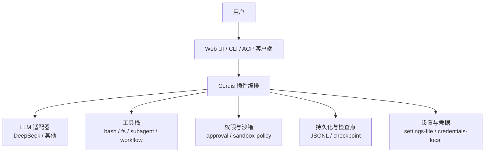
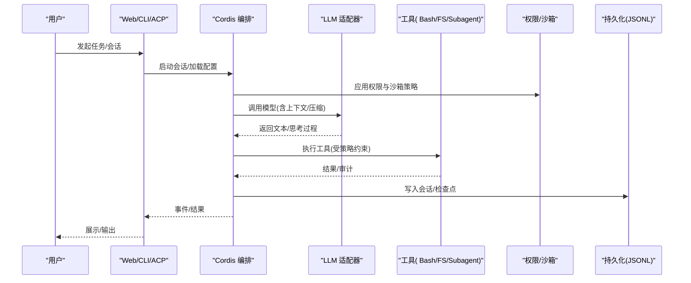
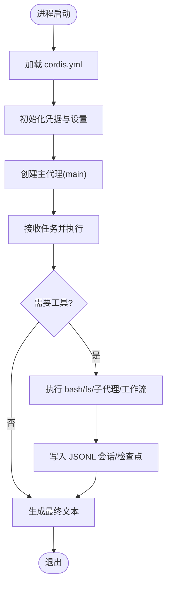
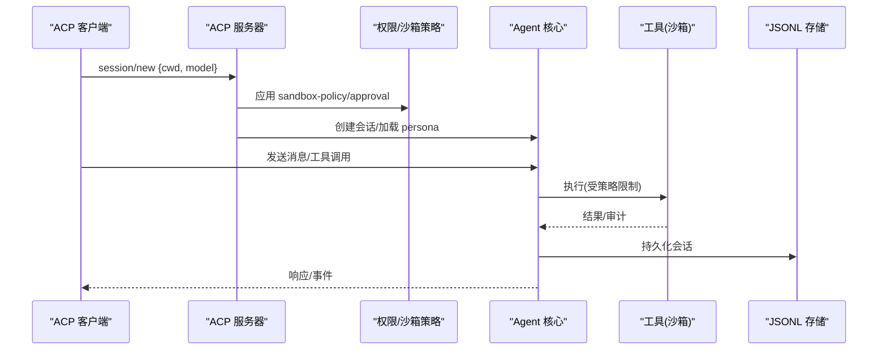
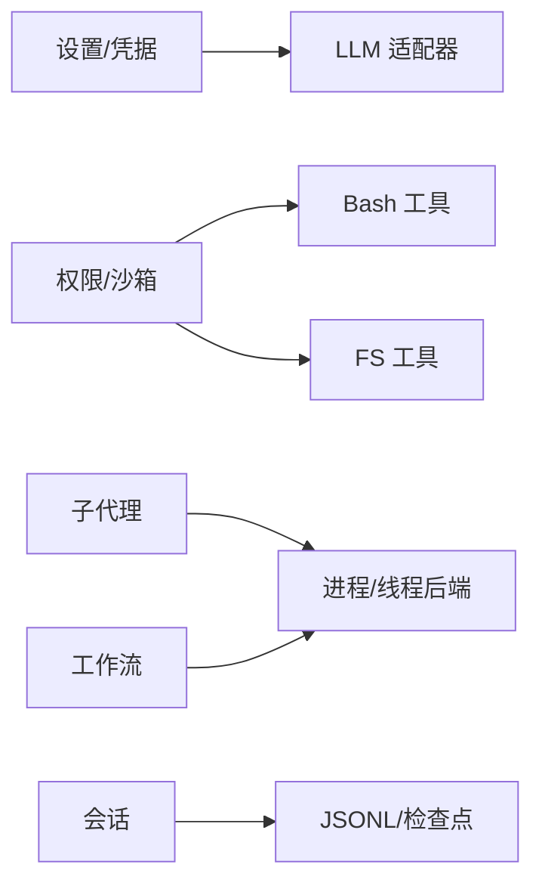
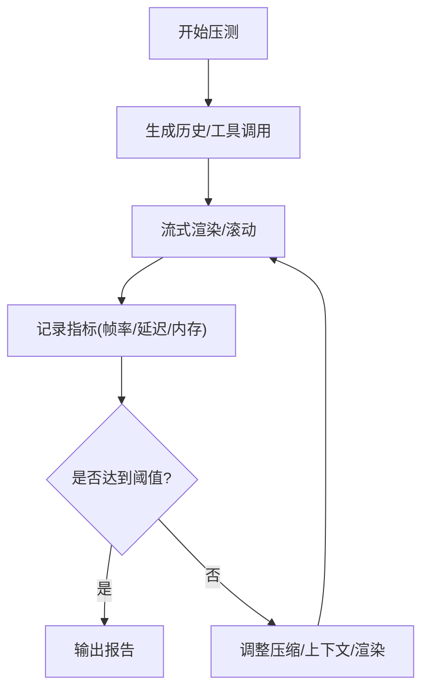

# 示例和最佳实践

<cite>
**本文引用的文件**
- [README.md](file://README.md)
- [examples/README.md](file://examples/README.md)
- [examples/headless-agent/README.md](file://examples/headless-agent/README.md)
- [examples/acp-agent/README.md](file://examples/acp-agent/README.md)
- [examples/headless-agent/cordis.yml](file://examples/headless-agent/cordis.yml)
- [examples/acp-agent/cordis.yml](file://examples/acp-agent/cordis.yml)
- [docs/user/guide/index.md](file://docs/user/guide/index.md)
- [docs/defensive-patterns.md](file://docs/defensive-patterns.md)
- [BENCHMARK.md](file://BENCHMARK.md)
- [apps/web/tests/scaffold.ts](file://apps/web/tests/scaffold.ts)
- [packages/settings/settings/src/index.ts](file://packages/settings/settings/src/index.ts)
- [docs/subsystems/settings.md](file://docs/subsystems/settings.md)
- [packages/interaction/permission-presets/src/index.ts](file://packages/interaction/permission-presets/src/index.ts)
- [packages/client/ui-permission-presets/src/client/presentation.ts](file://packages/client/ui-permission-presets/src/client/presentation.ts)
- [vitest.web.perf.config.ts](file://vitest.web.perf.config.ts)
- [apps/web/tests/complex-history.perf.ts](file://apps/web/tests/complex-history.perf.ts)
</cite>

## 目录
1. [简介](#简介)
2. [项目结构](#项目结构)
3. [核心组件](#核心组件)
4. [架构总览](#架构总览)
5. [详细组件分析](#详细组件分析)
6. [依赖关系分析](#依赖关系分析)
7. [性能考量](#性能考量)
8. [故障排除指南](#故障排除指南)
9. [结论](#结论)
10. [附录](#附录)

## 简介
本文件面向不同经验水平的开发者，提供 DeepSeek Harness（dsh）的示例与最佳实践。内容覆盖：
- 基础用法：Web UI、无头代理、JSON-RPC 自动化
- 高级特性：子代理、工作流、权限策略、沙箱隔离、持久化与压缩
- 集成示例：MCP 内存、Web 调度、ACP 协议服务器
- 安全实践：最小权限、凭据管理、输出清洗、路径安全
- 性能优化：上下文窗口、压缩阈值、流式渲染、压力测试
- 错误处理与调试：防御性编程、不变量校验、异常策略
- 代码组织模式：配置即组合、插件化、HMR 热更新

## 项目结构
仓库采用“一切皆插件”的架构，基于 Cordis 编排。示例位于 examples 目录，每个示例自包含配置、前置条件与运行方式；核心子系统位于 packages，文档位于 docs，CLI/Web 入口在 apps。

图表来源
- [examples/headless-agent/cordis.yml:1-166](file://examples/headless-agent/cordis.yml#L1-L166)
- [examples/acp-agent/cordis.yml:1-193](file://examples/acp-agent/cordis.yml#L1-L193)
- [docs/user/guide/index.md:1-31](file://docs/user/guide/index.md#L1-L31)

章节来源
- [README.md:1-58](file://README.md#L1-L58)
- [examples/README.md:1-30](file://examples/README.md#L1-L30)

## 核心组件
- 会话与模型
  - 通过 settings 与 credentials 注入模型与凭据，支持热重载与运行时切换。
  - 使用 token-meter 与 compaction-basic 控制上下文窗口与历史压缩。
- 工具与执行
  - bash 执行器（本地或沙箱）、文件系统工具（本地或沙箱）、子代理（spawn/fork）、工作流（worker-thread）。
- 权限与安全
  - sandbox-policy 与 approval 策略，支持 workspace-write 与 danger-full-access 等模式。
- 持久化与可观测性
  - JSONL 会话持久化、压缩策略、检查点策略、事件流。

章节来源
- [examples/headless-agent/cordis.yml:1-166](file://examples/headless-agent/cordis.yml#L1-L166)
- [examples/acp-agent/cordis.yml:1-193](file://examples/acp-agent/cordis.yml#L1-L193)
- [docs/subsystems/settings.md:18-50](file://docs/subsystems/settings.md#L18-L50)

## 架构总览
下图展示 Web UI/CLI/ACP 到插件编排、工具链、权限与持久化的交互。

图表来源
- [examples/headless-agent/cordis.yml:1-166](file://examples/headless-agent/cordis.yml#L1-L166)
- [examples/acp-agent/cordis.yml:1-193](file://examples/acp-agent/cordis.yml#L1-L193)
- [docs/user/guide/index.md:1-31](file://docs/user/guide/index.md#L1-L31)

## 详细组件分析

### 无头代理示例（headless-agent）
- 目标：一次性编码任务，标准输出纯文本，适合脚本化与 CI。
- 关键能力：DeepSeek 适配器、本地 bash/FS、子代理、工作流、Ralph 迭代、todo_write、JSONL 持久化。
- 典型运行：设置环境变量后通过 dsh --profile headless 执行任务并退出。

图表来源
- [examples/headless-agent/cordis.yml:1-166](file://examples/headless-agent/cordis.yml#L1-L166)
- [examples/headless-agent/README.md:1-33](file://examples/headless-agent/README.md#L1-L33)

章节来源
- [examples/headless-agent/README.md:1-33](file://examples/headless-agent/README.md#L1-L33)
- [examples/headless-agent/cordis.yml:1-166](file://examples/headless-agent/cordis.yml#L1-L166)

### ACP 自动化服务器示例（acp-agent）
- 目标：面向程序化客户端的 Agent Client Protocol 服务器，支持会话、权限、取消。
- 关键能力：JSON-RPC over stdio、沙箱化 bash/FS、审批策略、子代理与工作流、重复工具提醒、钩子桥接。
- 权限策略：workspace-write 下重试请求更宽访问时触发 session/request_permission，由客户端决定 allow_once/reject_once。

图表来源
- [examples/acp-agent/cordis.yml:1-193](file://examples/acp-agent/cordis.yml#L1-L193)
- [examples/acp-agent/README.md:1-25](file://examples/acp-agent/README.md#L1-L25)

章节来源
- [examples/acp-agent/README.md:1-25](file://examples/acp-agent/README.md#L1-L25)
- [examples/acp-agent/cordis.yml:1-193](file://examples/acp-agent/cordis.yml#L1-L193)

### Web UI 快速上手
- 启动后打开 Settings → Models 配置模型，选择工作区后即可开始对话。
- 会话会在工作区内读写文件、运行命令、委派任务与维护计划，并在需要时请求批准。

章节来源
- [docs/user/guide/index.md:1-31](file://docs/user/guide/index.md#L1-L31)

### 设置系统与配置最佳实践
- 将可调参数暴露为配置字段，避免硬编码；无效配置应在插件加载时失败并给出可操作错误。
- 注册命名空间时可附加 validate，用于表达跨字段约束；已运行的实例遇到外部编辑的非法值会保留上次有效值并告警。
- 配置变更通过 HMR 热替换，旧实例自动清理注册项。

章节来源
- [docs/user/develop/basic/config.md:74-107](file://docs/user/develop/basic/config.md#L74-L107)
- [packages/settings/settings/src/index.ts:36-62](file://packages/settings/settings/src/index.ts#L36-L62)
- [packages/settings/settings/src/index.ts:472-498](file://packages/settings/settings/src/index.ts#L472-L498)
- [docs/subsystems/settings.md:18-50](file://docs/subsystems/settings.md#L18-L50)

### 权限预设与审批策略
- 默认会话在发布前补齐缺失的权限事实；未显式设置的 preset/sandbox/approval 会使用当前用户默认值。
- 预设名称在 UI 中以友好标题显示，危险全权模式需明确标识。

章节来源
- [packages/interaction/permission-presets/src/index.ts:379-433](file://packages/interaction/permission-presets/src/index.ts#L379-L433)
- [packages/client/ui-permission-presets/src/client/presentation.ts:1-22](file://packages/client/ui-permission-presets/src/client/presentation.ts#L1-L22)

## 依赖关系分析
- 插件间通过 Cordis 服务与事件解耦；示例通过 cordis.yml 声明式组合。
- 关键依赖链：
  - 设置/凭据 → LLM 适配器
  - 权限/沙箱 → bash/FS 工具
  - 子代理/工作流 → 进程/线程后端
  - 会话 → JSONL 持久化与检查点

图表来源
- [examples/headless-agent/cordis.yml:1-166](file://examples/headless-agent/cordis.yml#L1-L166)
- [examples/acp-agent/cordis.yml:1-193](file://examples/acp-agent/cordis.yml#L1-L193)

章节来源
- [examples/headless-agent/cordis.yml:1-166](file://examples/headless-agent/cordis.yml#L1-L166)
- [examples/acp-agent/cordis.yml:1-193](file://examples/acp-agent/cordis.yml#L1-L193)

## 性能考量
- 上下文与压缩
  - 使用 token-meter 与 compaction-basic 按模型上下文窗口比例进行压缩，避免溢出。
  - 合理设置 thresholdRatio、retainRatio、maxTokens 以平衡质量与成本。
- 流式与渲染
  - Web 端压力测试配置启用长超时与禁用控制台拦截，便于真实场景下的性能证据采集。
  - 复杂历史回放测试模拟大量会话与工具调用，验证滚动与虚拟化性能。
- 基准方法
  - 遵循仓库基准说明，使用 Python SDK 与 jsonrpc-agent 的最小变体，独立工作区与会话 ID 进行对比。

图表来源
- [vitest.web.perf.config.ts:1-15](file://vitest.web.perf.config.ts#L1-L15)
- [apps/web/tests/complex-history.perf.ts:37-70](file://apps/web/tests/complex-history.perf.ts#L37-L70)
- [BENCHMARK.md:1-4](file://BENCHMARK.md#L1-L4)

章节来源
- [BENCHMARK.md:1-4](file://BENCHMARK.md#L1-L4)
- [vitest.web.perf.config.ts:1-15](file://vitest.web.perf.config.ts#L1-L15)
- [apps/web/tests/complex-history.perf.ts:37-70](file://apps/web/tests/complex-history.perf.ts#L37-L70)

## 故障排除指南
- 常见症状与对策
  - 模型调用失败：检查凭据与模型路由；确认 token-meter 与 compaction 阈值是否导致截断。
  - 权限拒绝：确认 sandbox-policy 与 approval 策略；在 workspace-write 模式下重试可能触发 session/request_permission。
  - 子代理/工作流卡住：确保清理异步资源并等待子进程退出；监听通知注册表在终止前先关闭。
  - 输出泄露风险：确保命令环境清洗、临时文件私有目录与随机名、避免符号链接路径。
- 调试技巧
  - 使用快照模式记录会话事件流，定位问题阶段。
  - 通过 Web 测试脚手架复现生产模块解析与启动流程，缩小差异范围。
  - 结合防御性模式：正交上报结果、遵守公共约定两侧、区分异步状态与同步状态。

章节来源
- [docs/defensive-patterns.md:1-34](file://docs/defensive-patterns.md#L1-L34)
- [examples/acp-agent/README.md:14-25](file://examples/acp-agent/README.md#L14-L25)
- [apps/web/tests/scaffold.ts:493-518](file://apps/web/tests/scaffold.ts#L493-L518)

## 结论
- 以插件化与配置驱动为核心，Harness 提供了从 Web UI 到无头/自动化场景的统一能力面。
- 安全与性能应贯穿设计：最小权限、沙箱隔离、凭据外置、上下文压缩与流式渲染。
- 通过示例与文档，开发者可按需组合能力，构建稳定、可观测、可扩展的智能体系统。

## 附录
- 常用运行方式
  - Web UI：安装 Node.js 后通过 npm 命令启动，默认端口 3080。
  - 源码运行：克隆仓库、安装依赖、构建后运行 web 模式。
- 扩展与集成
  - MCP 内存：通过通用 MCP 客户端连接第三方记忆服务。
  - Web 调度：可选 Web 叠加层实现会话内定时提醒。
  - ACP 协议：面向程序化客户端的自动化接口。

章节来源
- [README.md:13-35](file://README.md#L13-L35)
- [examples/README.md:7-29](file://examples/README.md#L7-L29)