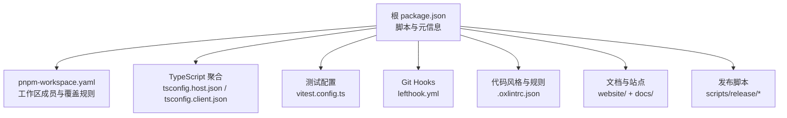
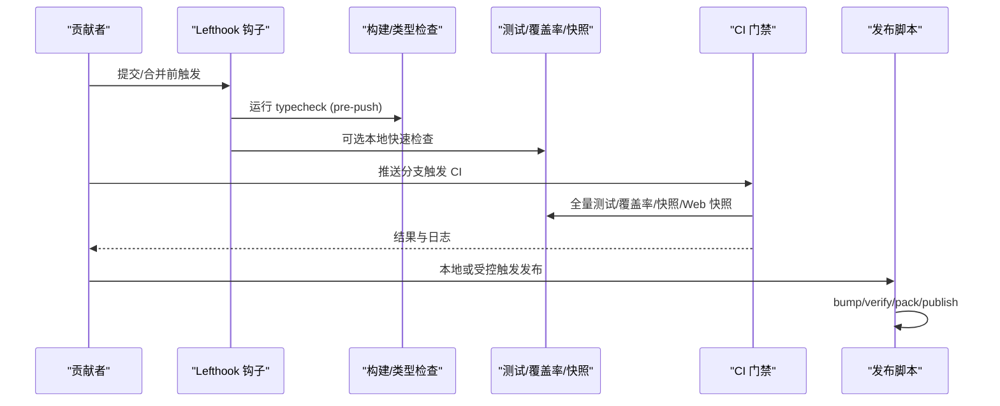
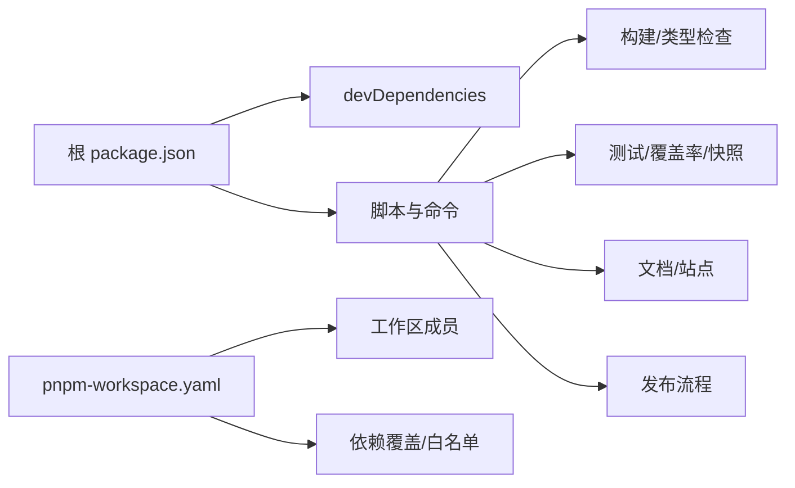

# 贡献指南

<cite>
**本文引用的文件**
- [CONTRIBUTING.md](file://CONTRIBUTING.md)
- [CONTRIBUTING.zh.md](file://CONTRIBUTING.zh.md)
- [README.md](file://README.md)
- [package.json](file://package.json)
- [pnpm-workspace.yaml](file://pnpm-workspace.yaml)
- [docs/development.md](file://docs/development.md)
- [docs/testing.md](file://docs/testing.md)
- [AGENTS.md](file://AGENTS.md)
- [.github/pull_request_template.md](file://.github/pull_request_template.md)
- [.github/ISSUE_TEMPLATE/config.yml](file://.github/ISSUE_TEMPLATE/config.yml)
- [.github/ISSUE_TEMPLATE/bug.md](file://.github/ISSUE_TEMPLATE/bug.md)
- [.github/ISSUE_TEMPLATE/feature.md](file://.github/ISSUE_TEMPLATE/feature.md)
- [.github/ISSUE_TEMPLATE/idea.md](file://.github/ISSUE_TEMPLATE/idea.md)
- [.github/ISSUE_TEMPLATE/research.md](file://.github/ISSUE_TEMPLATE/research.md)
- [.github/ISSUE_TEMPLATE/task.md](file://.github/ISSUE_TEMPLATE/task.md)
- [lefthook.yml](file://lefthook.yml)
- [.oxlintrc.json](file://.oxlintrc.json)
- [vitest.config.ts](file://vitest.config.ts)
- [scripts/run-gates.ts](file://scripts/run-gates.ts)
- [scripts/release/bump.ts](file://scripts/release/bump.ts)
- [scripts/release/verify.ts](file://scripts/release/verify.ts)
- [scripts/release/pack.ts](file://scripts/release/pack.ts)
- [scripts/release/publish.ts](file://scripts/release/publish.ts)
</cite>

## 目录
1. [简介](#简介)
2. [项目结构](#项目结构)
3. [核心组件](#核心组件)
4. [架构总览](#架构总览)
5. [详细组件分析](#详细组件分析)
6. [依赖关系分析](#依赖关系分析)
7. [性能与质量考量](#性能与质量考量)
8. [故障排查指南](#故障排查指南)
9. [结论](#结论)
10. [附录：贡献步骤清单](#附录贡献步骤清单)

## 简介
本指南面向希望参与 DeepSeek Harness（dsh）的开发者，涵盖开发环境设置、代码规范、测试要求、文档更新、问题报告、功能请求、代码审查、发布流程、版本管理与向后兼容性政策，以及从 Fork 到 Pull Request 的完整贡献路径。当前仓库处于“开发者预览”阶段，迭代迅速，存在破坏性变更的可能；同时目前不直接接受外部 PR，但欢迎通过讨论区反馈问题、贡献生态插件与社区内容。

**章节来源**
- [README.md:9-12](file://README.md#L9-L12)
- [CONTRIBUTING.md:9-21](file://CONTRIBUTING.md#L9-L21)
- [CONTRIBUTING.zh.md:9-21](file://CONTRIBUTING.zh.md#L9-L21)

## 项目结构
仓库采用 pnpm monorepo 组织，包含产品包、应用、示例、原生组件、Python SDK 与网站等。根脚本统一编排构建、类型检查、测试、文档与发布任务。工作区成员在 pnpm 配置中声明，并通过 workspace 协议进行本地解析。

**图示来源**
- [package.json:19-142](file://package.json#L19-L142)
- [pnpm-workspace.yaml:1-25](file://pnpm-workspace.yaml#L1-L25)
- [docs/development.md:44-78](file://docs/development.md#L44-L78)
- [vitest.config.ts:117-159](file://vitest.config.ts#L117-L159)
- [lefthook.yml:1-56](file://lefthook.yml#L1-L56)
- [.oxlintrc.json:1-322](file://.oxlintrc.json#L1-L322)

**章节来源**
- [package.json:1-183](file://package.json#L1-L183)
- [pnpm-workspace.yaml:1-73](file://pnpm-workspace.yaml#L1-L73)
- [docs/development.md:44-88](file://docs/development.md#L44-L88)

## 核心组件
- 开发与构建
  - Node 引擎范围由根 package.json 声明；使用 pnpm 管理依赖与工作区。
  - 构建分 Host/Client 两个 TypeScript 聚合，分别编译与打包，再构建 Web 前端。
  - 提供统一的 build/typecheck/lint/test/doc-sync/hygiene 等脚本。
- 测试体系
  - 单元测试、覆盖率门禁、真实 API e2e、快照测试、Web 浏览器快照测试。
  - Vitest 多项目隔离进程边界测试，按平台与能力做选择性排除。
- 代码质量
  - Lefthook 本地钩子执行翻译配对校验、staged 代码检查、第三方通知生成、空白字符检查与 vendor 清单守卫。
  - Oxlint 严格规则集，含 TypeScript 类型感知规则与样式规范。
- 文档与国际化
  - 双语文档与 i18n 配对合并驱动；文档站点构建与片段验证。
- 发布与版本
  - 提供 bump/verify/pack/publish 等发布脚本；工作区约束与发布成员校验。

**章节来源**
- [package.json:19-142](file://package.json#L19-L142)
- [docs/development.md:8-40](file://docs/development.md#L8-L40)
- [docs/testing.md:7-15](file://docs/testing.md#L7-L15)
- [lefthook.yml:5-55](file://lefthook.yml#L5-L55)
- [.oxlintrc.json:32-177](file://.oxlintrc.json#L32-L177)

## 架构总览
下图展示贡献者日常流程中的关键节点：本地准备、提交前检查、推送前检查、CI 门禁与发布流水线。

**图示来源**
- [lefthook.yml:52-55](file://lefthook.yml#L52-L55)
- [package.json:27-58](file://package.json#L27-L58)
- [vitest.config.ts:117-159](file://vitest.config.ts#L117-L159)
- [scripts/release/bump.ts](file://scripts/release/bump.ts)
- [scripts/release/verify.ts](file://scripts/release/verify.ts)
- [scripts/release/pack.ts](file://scripts/release/pack.ts)
- [scripts/release/publish.ts](file://scripts/release/publish.ts)

## 详细组件分析

### 开发环境与首次启动
- 前置条件
  - Node.js 版本范围由根 package.json 指定；推荐使用 Corepack 管理的 pnpm 版本。
  - Git 2.26+；安装后会自动配置 worktree 专属 Lefthook 钩子与翻译配对合并驱动。
- 首次安装与验证
  - 在仓库根执行依赖安装；随后执行类型检查以确认环境就绪。
  - 如需手动修复钩子或合并驱动，可运行相应安装/修复脚本。
- 环境变量
  - 真实 API 演示与 e2e 测试可通过环境变量注入密钥；未设置时相关套件自跳过。

**章节来源**
- [package.json:7-10](file://package.json#L7-L10)
- [docs/development.md:8-40](file://docs/development.md#L8-L40)
- [docs/development.md:90-99](file://docs/development.md#L90-L99)

### 代码规范与本地检查
- 代码风格与规则
  - 使用 Oxlint 进行类型感知检查与样式规范；测试与示例有差异化规则。
  - 行宽、引号、分号、缩进等样式规则集中配置。
- 提交前检查（Lefthook）
  - pre-commit：翻译配对记录校验、归档 Agent Notes 校验、staged 代码检查与自动修复、第三方通知再生成、空白字符检查、vendor 清单守卫。
  - pre-merge-commit：同上索引级校验。
  - pre-push：执行 typecheck（完成 Host lib 与生成的契约）。
- 工作区与依赖
  - 工作区成员与覆盖规则在 pnpm 配置中声明；对允许构建的依赖进行白名单控制。

**章节来源**
- [.oxlintrc.json:32-177](file://.oxlintrc.json#L32-L177)
- [lefthook.yml:5-55](file://lefthook.yml#L5-L55)
- [pnpm-workspace.yaml:23-55](file://pnpm-workspace.yaml#L23-L55)

### 测试策略与要求
- 分层测试
  - 单元测试：基于 vitest 的包与脚本规格用例。
  - 覆盖率门禁：对包源码逐文件 100% 覆盖率。
  - 真实 API e2e：需要密钥的端到端场景，无密钥自跳过。
  - 快照测试：键无关的预期输出，覆盖传输契约与呈现。
  - Web 浏览器快照：Chromium 回放比对，CI 强制只读模式。
- 进程隔离与平台差异
  - 进程绑定测试单独项目运行；Windows 不支持的套件与覆盖范围按平台排除。
- 最佳实践
  - 优先真实实现而非 mock；e2e 断言外部世界状态；测试资源自建自释放。

**章节来源**
- [docs/testing.md:7-49](file://docs/testing.md#L7-L49)
- [vitest.config.ts:117-159](file://vitest.config.ts#L117-L159)
- [vitest.config.ts:160-283](file://vitest.config.ts#L160-L283)

### 文档更新与国际化
- 文档同步与站点构建
  - 使用 doc-sync 运行所有文档门禁；website:build 构建站点并验证片段。
- 双语与配对合并
  - 翻译配对合并驱动在冲突时生成安全记录；提供解决工具。
- 文档类型检查
  - 文档中的类型等价块需注册并在同步中校验一致性。

**章节来源**
- [package.json:65-93](file://package.json#L65-L93)
- [docs/development.md:101-117](file://docs/development.md#L101-L117)
- [docs/development.md:163-172](file://docs/development.md#L163-L172)

### 问题报告与功能请求
- 模板与入口
  - 通过 GitHub Issues 模板提交 bug、功能、想法、研究与任务类问题。
  - 仓库 README 提供社区支持与反馈渠道。
- 当前接受方式
  - 目前不直接接受外部 PR；鼓励在 Discussions 中报告问题与投票关注点。

**章节来源**
- [.github/ISSUE_TEMPLATE/config.yml](file://.github/ISSUE_TEMPLATE/config.yml)
- [.github/ISSUE_TEMPLATE/bug.md](file://.github/ISSUE_TEMPLATE/bug.md)
- [.github/ISSUE_TEMPLATE/feature.md](file://.github/ISSUE_TEMPLATE/feature.md)
- [.github/ISSUE_TEMPLATE/idea.md](file://.github/ISSUE_TEMPLATE/idea.md)
- [.github/ISSUE_TEMPLATE/research.md](file://.github/ISSUE_TEMPLATE/research.md)
- [.github/ISSUE_TEMPLATE/task.md](file://.github/ISSUE_TEMPLATE/task.md)
- [README.md:37-45](file://README.md#L37-L45)
- [CONTRIBUTING.md:9-21](file://CONTRIBUTING.md#L9-L21)

### 代码审查与提交流程
- PR 模板
  - 关联 Issue、简述变更与验证要点；非 Draft 的人类 PR 至少引用一个同仓库 Issue。
- 本地门禁与 CI
  - 本地通过 Lefthook 与脚本快速自检；CI 负责全面门禁与多 Node 版本兼容信号。
- 标签与说明
  - 遵循仓库标签约定；保持 PR 历史清晰，必要时使用栈式提交。

**章节来源**
- [.github/pull_request_template.md:1-14](file://.github/pull_request_template.md#L1-L14)
- [lefthook.yml:5-55](file://lefthook.yml#L5-L55)
- [AGENTS.md:86-92](file://AGENTS.md#L86-L92)

### 发布流程、版本管理与向后兼容性
- 版本与兼容性
  - 当前为开发者预览，存在破坏性变更风险；内部维护 schema/version 字段以管理格式演进。
- 发布命令
  - 提供 bump/verify/pack/publish 等脚本，配合工作区约束与发布成员校验。
- 门禁与验证
  - 发布前需通过 verify 与 pack 产物校验；publish 仅消费已验证的 tarball。

**章节来源**
- [README.md:9-12](file://README.md#L9-L12)
- [package.json:129-135](file://package.json#L129-L135)
- [scripts/release/bump.ts](file://scripts/release/bump.ts)
- [scripts/release/verify.ts](file://scripts/release/verify.ts)
- [scripts/release/pack.ts](file://scripts/release/pack.ts)
- [scripts/release/publish.ts](file://scripts/release/publish.ts)

### 新贡献者入门与长期贡献深度指南
- 新贡献者
  - 安装依赖、运行类型检查与环境验证；了解测试分层与快照机制；阅读开发指南与架构文档。
- 长期贡献者
  - 熟悉 Host/Client 双聚合构建顺序与 Typert 契约生成；掌握 Lefthook 与 CI 门禁；遵循 AGENTS 约定与文档同步；在重大变更中补充 Agent Note。

**章节来源**
- [docs/development.md:8-40](file://docs/development.md#L8-L40)
- [docs/development.md:44-88](file://docs/development.md#L44-L88)
- [AGENTS.md:98-141](file://AGENTS.md#L98-L141)

## 依赖关系分析
- 工作区与包管理
  - 根 package.json 定义脚本与依赖；pnpm-workspace.yaml 声明工作区成员、覆盖与构建白名单。
- 构建与测试依赖
  - TypeScript、tsdown、Vitest、Oxlint、Coverage 等工具链在根 devDependencies 中声明。
- 外部集成
  - Lefthook 作为本地钩子框架；Node 引擎范围限制影响可运行环境。

**图示来源**
- [package.json:1-183](file://package.json#L1-L183)
- [pnpm-workspace.yaml:1-73](file://pnpm-workspace.yaml#L1-L73)

**章节来源**
- [package.json:1-183](file://package.json#L1-L183)
- [pnpm-workspace.yaml:1-73](file://pnpm-workspace.yaml#L1-L73)

## 性能与质量考量
- 构建性能
  - Host/Client 分离构建减少类型碰撞；tsdown 基于 tsc 产出进行打包。
- 测试稳定性
  - 进程绑定测试独立项目运行；平台差异与缺失能力（如 pwsh）下自跳过或豁免。
- 代码质量
  - 严格的 Oxlint 规则与覆盖率门禁；本地钩子保障提交前质量基线。

[本节为通用指导，无需特定文件来源]

## 故障排查指南
- 常见问题定位
  - 若本地钩子未生效或合并驱动异常，重新安装钩子或运行配对冲突解决脚本。
  - 若类型检查失败，先确保 Host lib 构建完成；必要时执行完整 build。
  - 若 e2e 或快照失败，检查密钥是否设置、平台能力是否满足、快照是否需要刷新。
- 参考脚本与配置
  - 查看 lefthook 配置与 vitest 配置中的排除项与项目划分。
  - 使用 coverage 报告定位未覆盖位置。

**章节来源**
- [docs/development.md:101-117](file://docs/development.md#L101-L117)
- [vitest.config.ts:160-283](file://vitest.config.ts#L160-L283)
- [lefthook.yml:5-55](file://lefthook.yml#L5-L55)

## 结论
DeepSeek Harness 提供完善的 monorepo 工程化体系与质量门禁，适合团队协作与持续交付。尽管当前不接受外部 PR，仍强烈建议通过 Discussions 反馈问题、贡献生态插件与社区内容。对于内部贡献者，请遵循开发指南、测试策略与发布流程，确保变更可追溯、可验证、可回滚。

[本节为总结性内容，无需特定文件来源]

## 附录：贡献步骤清单
- 环境准备
  - 安装 Node 与 pnpm；克隆仓库并安装依赖；执行类型检查确认环境就绪。
- 理解规范
  - 阅读开发指南、测试策略、代码规范与 AGENTS 约定。
- 修改与验证
  - 编写/更新代码与测试；本地运行相关检查（typecheck、lint、test、snapshot）。
- 文档更新
  - 更新受影响文档与 JSDoc；运行 doc-sync 保证文档门禁通过。
- 提交与审查
  - 提交变更；根据 PR 模板填写关联 Issue 与变更验证；等待 CI 门禁与审查反馈。
- 发布（内部）
  - 使用 release 脚本进行版本提升、验证、打包与发布；确保工作区约束与发布成员校验通过。

**章节来源**
- [docs/development.md:8-40](file://docs/development.md#L8-L40)
- [docs/testing.md:7-49](file://docs/testing.md#L7-L49)
- [AGENTS.md:86-92](file://AGENTS.md#L86-L92)
- [package.json:129-135](file://package.json#L129-L135)