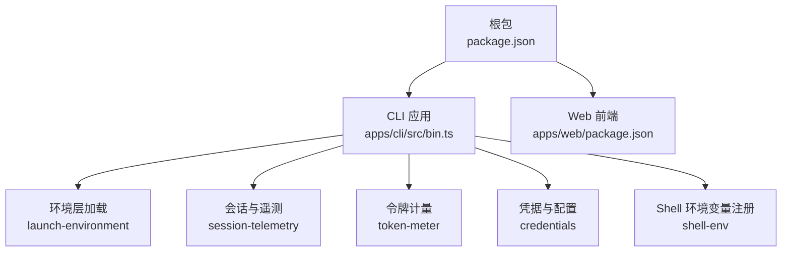
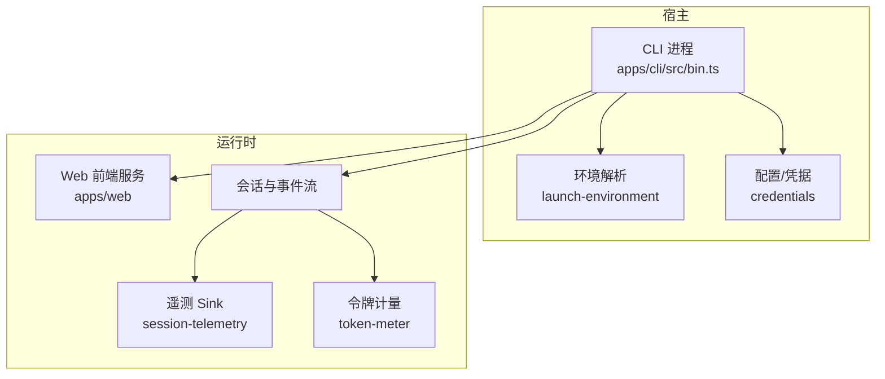
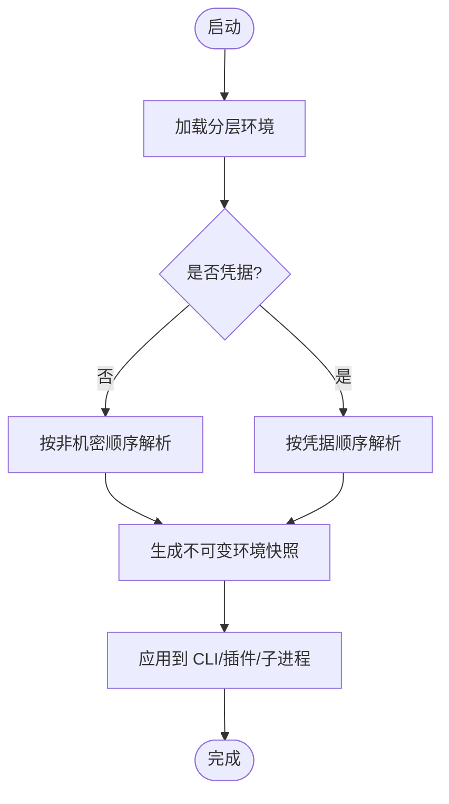
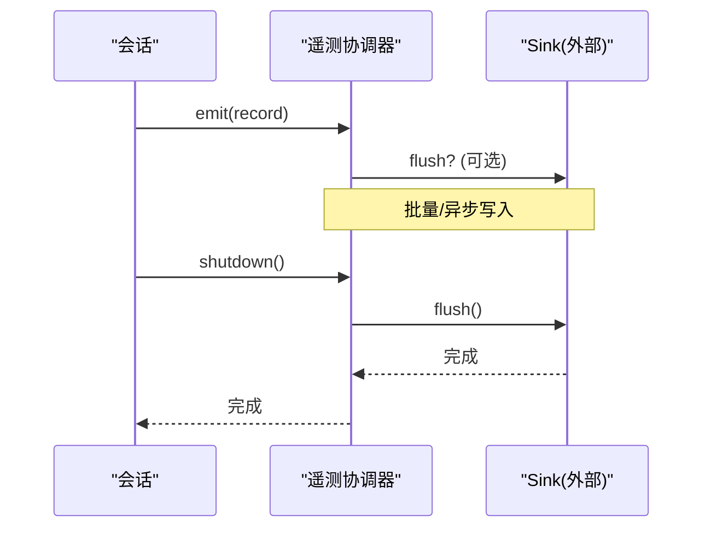
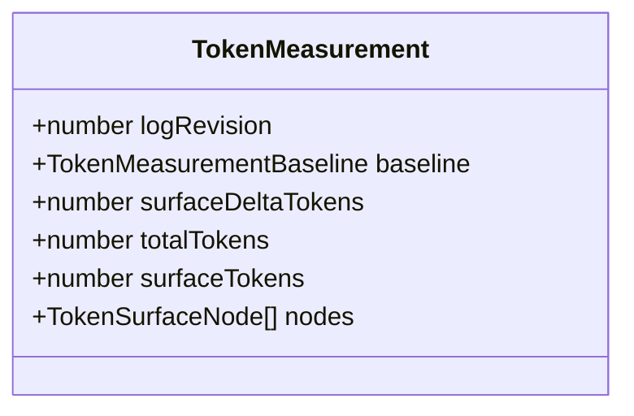
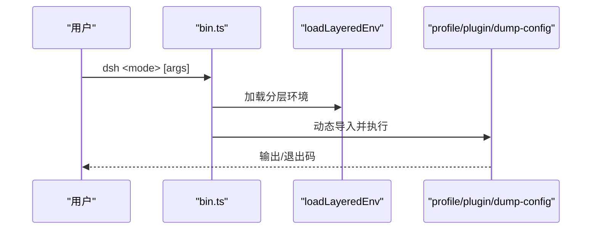
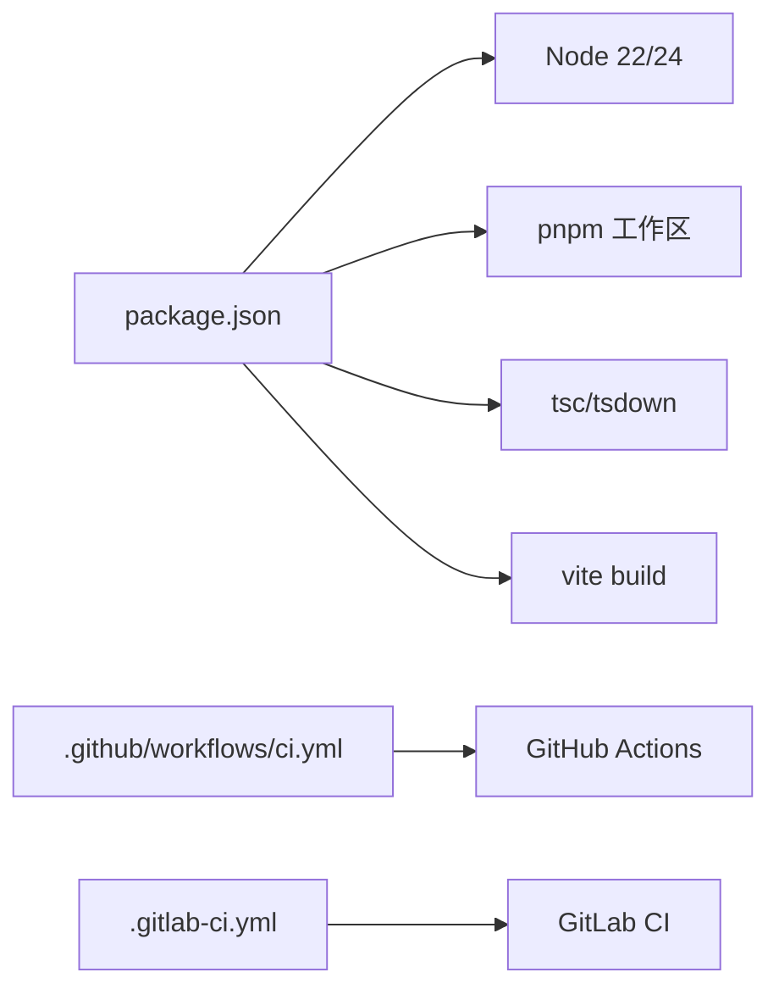

# 部署运维

<cite>
**本文引用的文件**
- [package.json](file://package.json)
- [README.md](file://README.md)
- [.gitlab-ci.yml](file://.gitlab-ci.yml)
- [.github/workflows/ci.yml](file://.github/workflows/ci.yml)
- [apps/cli/src/bin.ts](file://apps/cli/src/bin.ts)
- [apps/web/package.json](file://apps/web/package.json)
- [packages/util/launch-environment/src/index.ts](file://packages/util/launch-environment/src/index.ts)
- [packages/session/session-telemetry/src/index.ts](file://packages/session/session-telemetry/src/index.ts)
- [packages/llm/token-meter/src/types.ts](file://packages/llm/token-meter/src/types.ts)
- [packages/llm/token-meter/tests/token-meter.spec.ts](file://packages/llm/token-meter/tests/token-meter.spec.ts)
- [packages/shell/shell-env/tests/shell-env.spec.ts](file://packages/shell/shell-env/tests/shell-env.spec.ts)
- [packages/credentials/credentials/README.md](file://packages/credentials/credentials/README.md)
- [docs/postmortem/README.zh.md](file://docs/postmortem/README.zh.md)
</cite>

## 目录
1. [简介](#简介)
2. [项目结构](#项目结构)
3. [核心组件](#核心组件)
4. [架构总览](#架构总览)
5. [详细组件分析](#详细组件分析)
6. [依赖关系分析](#依赖关系分析)
7. [性能与资源管理](#性能与资源管理)
8. [故障排查指南](#故障排查指南)
9. [备份与恢复、灾难恢复](#备份与恢复灾难恢复)
10. [安全加固与合规](#安全加固与合规)
11. [自动化部署与 CI/CD](#自动化部署与-cicd)
12. [监控与告警](#监控与告警)
13. [结论](#结论)

## 简介
本指南面向生产环境的部署与运维，覆盖容器化方案、配置与环境变量、监控与日志、性能调优、故障排查、备份恢复、安全加固、CI/CD 流水线以及监控告警设置。内容基于仓库中的构建脚本、工作流、CLI 入口、环境解析模块、遥测接口与凭据机制等实现进行说明，确保可落地执行。

## 项目结构
- 根级 package.json 定义了 Node.js 版本要求、pnpm 工作区、构建与测试脚本，是构建与发布的基础。
- apps/cli 提供命令行入口，按模式动态加载不同运行路径（profile、plugin、dump-config）。
- apps/web 为 Web 前端产物，由 CLI 的 web 模式服务。
- packages 下包含运行时能力（会话、遥测、令牌计量、凭据、Shell 环境变量注册等）。
- .github/workflows 与 .gitlab-ci.yml 提供跨平台 CI/CD 与 Python SDK/运行时制品构建与发布流程。

**图示来源**
- [package.json:1-183](file://package.json#L1-L183)
- [apps/cli/src/bin.ts:1-54](file://apps/cli/src/bin.ts#L1-L54)
- [apps/web/package.json:1-52](file://apps/web/package.json#L1-L52)
- [packages/util/launch-environment/src/index.ts:1-29](file://packages/util/launch-environment/src/index.ts#L1-L29)
- [packages/session/session-telemetry/src/index.ts:162-178](file://packages/session/session-telemetry/src/index.ts#L162-L178)
- [packages/llm/token-meter/src/types.ts:20-42](file://packages/llm/token-meter/src/types.ts#L20-L42)
- [packages/credentials/credentials/README.md:44-49](file://packages/credentials/credentials/README.md#L44-L49)
- [packages/shell/shell-env/tests/shell-env.spec.ts:96-118](file://packages/shell/shell-env/tests/shell-env.spec.ts#L96-L118)

**章节来源**
- [package.json:1-183](file://package.json#L1-L183)
- [README.md:1-58](file://README.md#L1-L58)

## 核心组件
- 命令行入口：按模式分发到 profile/plugin/dump-config，并加载分层环境。
- 环境解析：以不可变快照记录每个变量的来源层级（进程继承、项目 .env、用户 .env），避免污染全局 process.env。
- 会话遥测：定义 emit/flush/shutdown 契约，支持异步落盘与优雅关闭。
- 令牌计量：对会话表面进行不可变快照测量，用于压力控制与成本估算。
- 凭据与配置：非机密值统一解析顺序；凭据采用独立且更窄的优先级；进程环境为只读最高优先。
- Shell 环境变量注册：声明式注册变量，防止重复归属冲突。

**章节来源**
- [apps/cli/src/bin.ts:1-54](file://apps/cli/src/bin.ts#L1-L54)
- [packages/util/launch-environment/src/index.ts:1-29](file://packages/util/launch-environment/src/index.ts#L1-L29)
- [packages/session/session-telemetry/src/index.ts:162-178](file://packages/session/session-telemetry/src/index.ts#L162-L178)
- [packages/llm/token-meter/src/types.ts:20-42](file://packages/llm/token-meter/src/types.ts#L20-L42)
- [packages/credentials/credentials/README.md:44-49](file://packages/credentials/credentials/README.md#L44-L49)
- [packages/shell/shell-env/tests/shell-env.spec.ts:96-118](file://packages/shell/shell-env/tests/shell-env.spec.ts#L96-L118)

## 架构总览
下图展示生产环境典型部署拓扑：CLI 作为进程入口，加载分层环境与插件，驱动 Web 前端静态资源服务与后端能力；遥测与令牌计量贯穿会话生命周期；凭据与配置通过独立策略注入。

**图示来源**
- [apps/cli/src/bin.ts:1-54](file://apps/cli/src/bin.ts#L1-L54)
- [apps/web/package.json:1-52](file://apps/web/package.json#L1-L52)
- [packages/util/launch-environment/src/index.ts:1-29](file://packages/util/launch-environment/src/index.ts#L1-L29)
- [packages/session/session-telemetry/src/index.ts:162-178](file://packages/session/session-telemetry/src/index.ts#L162-L178)
- [packages/llm/token-meter/src/types.ts:20-42](file://packages/llm/token-meter/src/types.ts#L20-L42)

## 详细组件分析

### 配置与环境变量处理
- 非机密值解析顺序：显式运行参数 > 用户设置 > 组合层（profile/patch）> 进程环境 > 发现的文件（项目 .env、$DSH_HOME/.env）> 默认值。
- 凭据解析顺序：进程环境（只读最高优先）> $DSH_HOME/.credentials.yaml（provider 管理、可写）> 项目 .env > $DSH_HOME/.env。
- 启动环境快照：以 LaunchEnvironmentEntry 记录 value/source/path，供消费者透明读取而不污染全局环境。
- Shell 环境变量注册：通过注册表声明变量归属，拒绝重复声明，保证可观测性与一致性。

**图示来源**
- [packages/util/launch-environment/src/index.ts:1-29](file://packages/util/launch-environment/src/index.ts#L1-L29)
- [packages/credentials/credentials/README.md:44-49](file://packages/credentials/credentials/README.md#L44-L49)
- [packages/shell/shell-env/tests/shell-env.spec.ts:96-118](file://packages/shell/shell-env/tests/shell-env.spec.ts#L96-L118)

**章节来源**
- [packages/util/launch-environment/src/index.ts:1-29](file://packages/util/launch-environment/src/index.ts#L1-L29)
- [packages/credentials/credentials/README.md:44-49](file://packages/credentials/credentials/README.md#L44-L49)
- [packages/shell/shell-env/tests/shell-env.spec.ts:96-118](file://packages/shell/shell-env/tests/shell-env.spec.ts#L96-L118)

### 会话遥测与日志收集
- 遥测 Sink 契约：emit 上报逻辑记录，flush 可选刷新，shutdown 等待管线静默后返回。
- 建议将 emit 输出至结构化日志（JSON），并转发到集中式日志系统；在 shutdown 时确保缓冲数据全部写出。
- 结合令牌计量快照，可在关键步骤记录 token 用量，便于成本与容量规划。

**图示来源**
- [packages/session/session-telemetry/src/index.ts:162-178](file://packages/session/session-telemetry/src/index.ts#L162-L178)

**章节来源**
- [packages/session/session-telemetry/src/index.ts:162-178](file://packages/session/session-telemetry/src/index.ts#L162-L178)

### 令牌计量与压力控制
- 令牌计量提供不可变的 TokenMeasurement，包含 logRevision、baseline、surfaceDeltaTokens、totalTokens、surfaceTokens、nodes。
- 通过 snapshot 方式测量当前“会话表面”的压力，避免在长日志上反复全量计算造成开销。
- 测试用例验证空会话测量结果与不可变性，确保在生产中可稳定复用。

**图示来源**
- [packages/llm/token-meter/src/types.ts:20-42](file://packages/llm/token-meter/src/types.ts#L20-L42)
- [packages/llm/token-meter/tests/token-meter.spec.ts:148-167](file://packages/llm/token-meter/tests/token-meter.spec.ts#L148-L167)

**章节来源**
- [packages/llm/token-meter/src/types.ts:20-42](file://packages/llm/token-meter/src/types.ts#L20-L42)
- [packages/llm/token-meter/tests/token-meter.spec.ts:148-167](file://packages/llm/token-meter/tests/token-meter.spec.ts#L148-L167)

### CLI 入口与运行模式
- bin.ts 根据解析后的模式动态导入 profile/plugin/dump-config，并通过 loadLayeredEnv('dsh') 加载分层环境。
- 该设计使不同运行模式保持最小依赖，提升启动性能与可维护性。

**图示来源**
- [apps/cli/src/bin.ts:1-54](file://apps/cli/src/bin.ts#L1-L54)

**章节来源**
- [apps/cli/src/bin.ts:1-54](file://apps/cli/src/bin.ts#L1-L54)

## 依赖关系分析
- 构建与运行依赖：Node.js 版本约束、pnpm 工作区、TypeScript 编译与 tsdown 打包。
- 前端构建：Vite 构建 Web 产物，CLI 负责提供服务。
- CI/CD：GitHub Actions 与 GitLab CI 共同支撑多平台构建、测试、制品发布。

**图示来源**
- [package.json:1-183](file://package.json#L1-L183)
- [.github/workflows/ci.yml:1-800](file://.github/workflows/ci.yml#L1-L800)
- [.gitlab-ci.yml:1-130](file://.gitlab-ci.yml#L1-L130)

**章节来源**
- [package.json:1-183](file://package.json#L1-L183)
- [.github/workflows/ci.yml:1-800](file://.github/workflows/ci.yml#L1-L800)
- [.gitlab-ci.yml:1-130](file://.gitlab-ci.yml#L1-L130)

## 性能与资源管理
- 并发与缓存：CI 中使用 pnpm store 缓存、Playwright 浏览器缓存，减少安装与下载耗时。
- 资源隔离：使用 bubblewrap 准备沙箱环境，降低对宿主系统的侵入。
- 令牌计量：通过不可变快照与增量计算控制压力，避免全量扫描带来的 CPU/内存峰值。
- 建议：
  - 在生产容器内限制 Node 堆大小与线程数，结合令牌计量阈值做自适应限流。
  - 将遥测 flush/shutdown 纳入进程信号处理，确保数据不丢失。
  - 对大对象（如会话表面）采用只读快照，避免复制与锁竞争。

[本节为通用指导，不直接分析具体文件]

## 故障排查指南
- 事故复盘：仓库提供 postmortem 规范与示例，强调系统性防护与回归测试。
- 常见问题定位：
  - 凭据未生效：检查进程环境是否被覆盖，确认 .credentials.yaml 与 .env 的优先级。
  - 遥测数据缺失：确认 emit/flush/shutdown 调用链完整，外部 Sink 可达。
  - 令牌计量异常：核对会话事件边界与快照一致性，关注 malformed durable boundaries。
- 建议：
  - 在 CI 中启用覆盖率与快照对比，快速发现回归。
  - 对关键路径增加断言与可观测点（如日志级别、指标上报）。

**章节来源**
- [docs/postmortem/README.zh.md:1-19](file://docs/postmortem/README.zh.md#L1-L19)

## 备份与恢复、灾难恢复
- 数据范围：会话持久化、遥测数据、用户设置与凭据存储。
- 策略建议：
  - 会话与遥测：定期导出为 JSONL/归档，保留 RPO/RTO 目标内的副本。
  - 凭据与设置：仅备份 .credentials.yaml 与 settings 相关数据，严格权限控制。
  - 恢复演练：在预发环境定期演练恢复流程，验证数据一致性与可用性。
- 注意：
  - 备份需脱敏或加密传输与存储。
  - 恢复后校验版本号与 schema 兼容性，必要时执行迁移。

[本节为通用指导，不直接分析具体文件]

## 安全加固与合规
- 凭据最小暴露：进程环境为只读最高优先，避免将敏感信息写入 .env 文件。
- 配置分层：非机密值按明确顺序解析，防止恶意环境变量覆盖关键配置。
- 沙箱与隔离：CI 使用 bubblewrap 准备环境，生产建议容器化并限制文件系统访问。
- 合规建议：
  - 审计凭据访问与变更，记录操作者与时序。
  - 对外部依赖进行许可证与漏洞扫描（仓库已集成 publint/knip 等工具）。
  - 遵循最小权限原则，限制容器与进程的 capabilities。

**章节来源**
- [packages/credentials/credentials/README.md:44-49](file://packages/credentials/credentials/README.md#L44-L49)

## 自动化部署与 CI/CD
- GitHub Actions：
  - 多 Node 版本兼容测试、覆盖率、快照与制品构建。
  - 支持 failover 到自托管池，保障稳定性。
  - Windows 与 Wine 门控，确保跨平台构建质量。
- GitLab CI：
  - Python SDK 与运行时制品构建，多平台 wheel 打包与发布。
  - 严格的版本标签校验与制品完整性检查。
- 建议：
  - 将构建产物签名与校验纳入流水线。
  - 使用受保护的分支与审批规则，控制发布节奏。
  - 将密钥与凭据接入 Secrets Manager，避免硬编码。

**章节来源**
- [.github/workflows/ci.yml:1-800](file://.github/workflows/ci.yml#L1-L800)
- [.gitlab-ci.yml:1-130](file://.gitlab-ci.yml#L1-L130)

## 监控与告警
- 指标采集：
  - 使用 session-telemetry 上报关键事件（请求、响应、错误、成本）。
  - 通过 token-meter 的测量结果统计 token 用量与压力趋势。
- 日志收集：
  - 结构化日志（JSON）+ 集中式日志系统（如 ELK/Loki）。
  - 在 shutdown 时强制 flush，避免数据丢失。
- 告警策略：
  - 错误率突增、延迟升高、token 用量异常、凭据访问失败。
  - 结合业务阈值与 SLO 设定多级告警。
- 可视化：
  - 仪表盘展示健康度、吞吐、成本与错误分布。
  - 关联会话 ID 追踪端到端链路。

**章节来源**
- [packages/session/session-telemetry/src/index.ts:162-178](file://packages/session/session-telemetry/src/index.ts#L162-L178)
- [packages/llm/token-meter/src/types.ts:20-42](file://packages/llm/token-meter/src/types.ts#L20-L42)

## 结论
本指南基于仓库的实际实现，给出了生产部署的架构与组件说明，覆盖了配置与环境变量、监控与日志、性能调优、故障排查、备份恢复、安全加固与 CI/CD 流水线。建议在部署前完成以下动作：
- 明确配置与凭据的分层策略，并在预发环境验证。
- 接入遥测与日志系统，完善告警与仪表盘。
- 建立备份与恢复流程，定期演练。
- 将 CI/CD 与发布流程标准化，确保可追溯与可回滚。

[本节为总结，不直接分析具体文件]