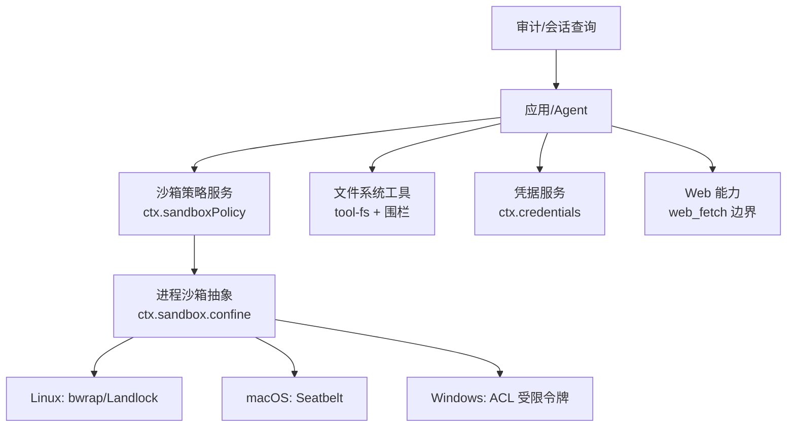
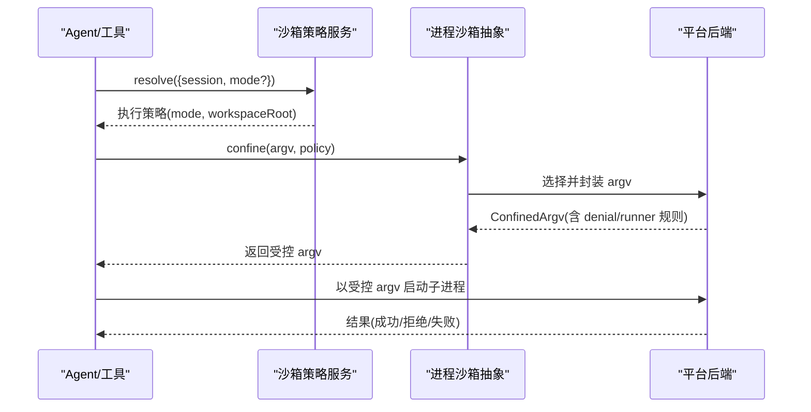
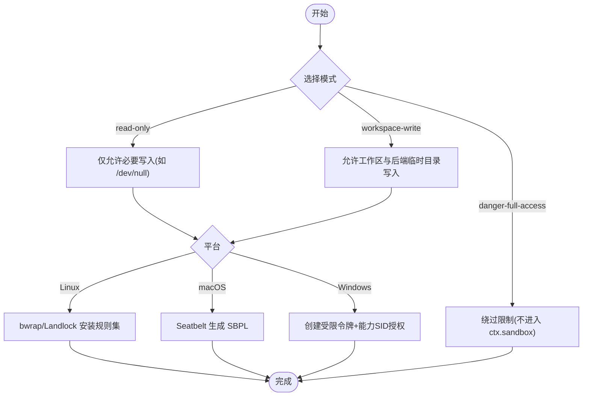
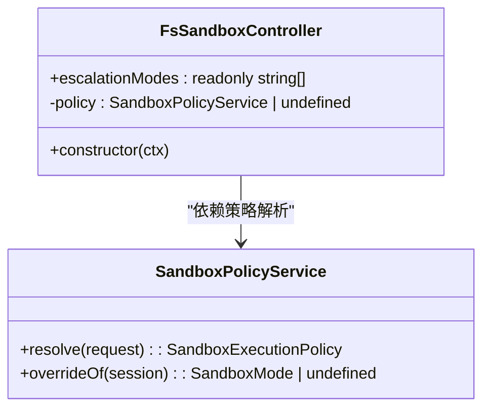
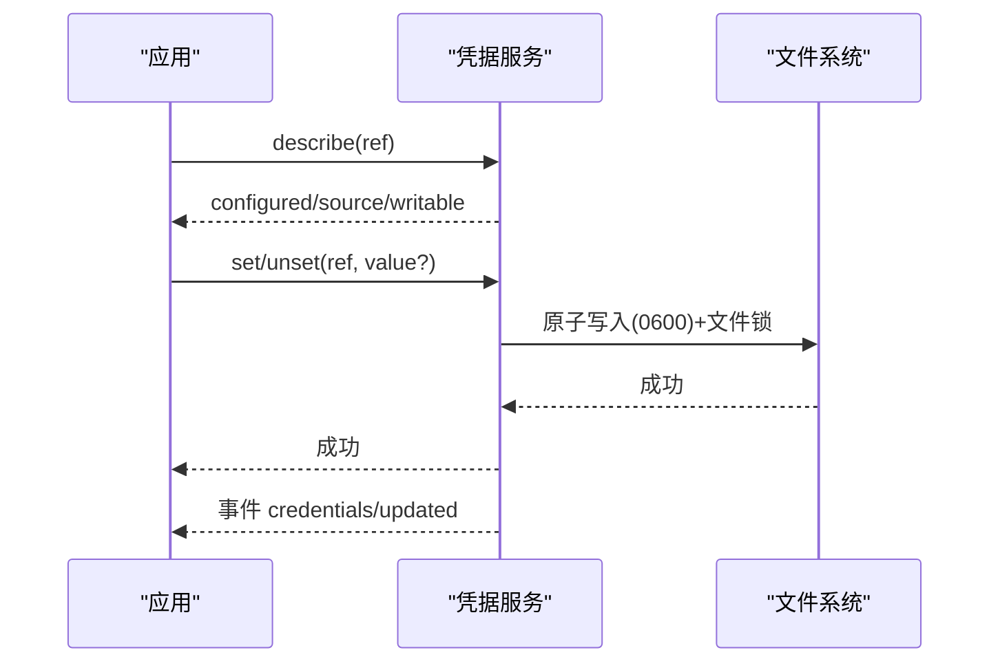
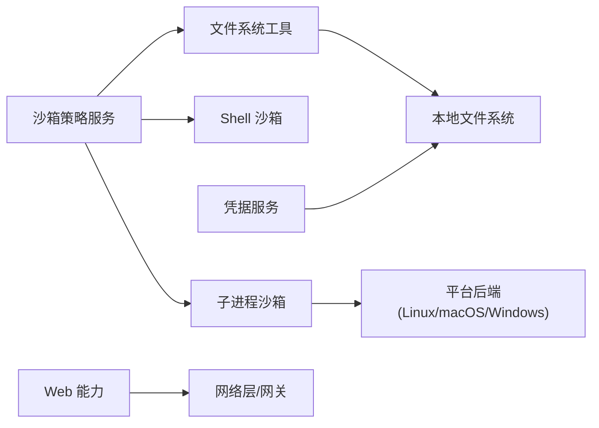

# 安全加固

<cite>
**本文引用的文件**
- [packages/sandbox/sandbox/src/index.ts](file://packages/sandbox/sandbox/src/index.ts)
- [packages/sandbox/sandbox-policy/README.md](file://packages/sandbox/sandbox-policy/README.md)
- [packages/fs/tool-fs/src/sandbox.ts](file://packages/fs/tool-fs/src/sandbox.ts)
- [packages/sandbox/sandbox-local/src/profiles.ts](file://packages/sandbox/sandbox-local/src/profiles.ts)
- [native/landlock-run/packages/entry/src/main.c](file://native/landlock-run/packages/entry/src/main.c)
- [packages/sandbox/sandbox-windows-acl/src/win32-abi.ts](file://packages/sandbox/sandbox-windows-acl/src/win32-abi.ts)
- [packages/sandbox/sandbox-windows-acl/src/acl.ts](file://packages/sandbox/sandbox-windows-acl/src/acl.ts)
- [packages/credentials/credentials-local/src/index.ts](file://packages/credentials/credentials-local/src/index.ts)
- [docs/subsystems/credentials.md](file://docs/subsystems/credentials.md)
- [docs/subsystems/sandbox.md](file://docs/subsystems/sandbox.md)
- [docs/subsystems/filesystem.md](file://docs/subsystems/filesystem.md)
- [.agents/notes/implemented/architecture/2026-06-24-web-capability-seam.md](file://.agents/notes/implemented/architecture/2026-06-24-web-capability-seam.md)
- [.agents/notes/proposed/process/2026-06-11-supply-chain-and-vendor-drift.md](file://.agents/notes/proposed/process/2026-06-11-supply-chain-and-vendor-drift.md)
- [packages/session-query/tool-session-query/src/input.ts](file://packages/session-query/tool-session-query/src/input.ts)
</cite>

## 目录
1. [引言](#引言)
2. [项目结构](#项目结构)
3. [核心组件](#核心组件)
4. [架构总览](#架构总览)
5. [详细组件分析](#详细组件分析)
6. [依赖关系分析](#依赖关系分析)
7. [性能与安全权衡](#性能与安全权衡)
8. [故障排查指南](#故障排查指南)
9. [结论](#结论)
10. [附录](#附录)

## 引言
本指南面向生产环境的 DeepSeek Harness 安全加固，聚焦以下目标：
- 网络访问控制与边界（含 SSRF 防护、仅允许 http/https、字节/时间上限、跨域重定向限制）
- 权限最小化原则（文件系统、网络、系统调用）
- 沙箱机制配置与优化（Linux Landlock/bwrap、macOS Seatbelt、Windows ACL 受限令牌）
- 敏感信息保护（API 密钥管理、环境变量分层、日志脱敏）
- 安全审计与合规检查（漏洞扫描、依赖检查、配置验证）
- 入侵检测、异常行为监控与安全事件响应流程
- 安全更新与补丁管理策略

## 项目结构
DeepSeek Harness 的安全能力由多个子系统协作实现：
- 进程沙箱抽象与本地实现：sandbox、sandbox-local、sandbox-windows-acl
- 沙箱策略服务：sandbox-policy
- 文件系统工具与围栏：fs、tool-fs
- 凭据管理与存储：credentials、credentials-local
- Web 能力边界：web-fetch 相关文档与约束
- 审计与可观测性：session 查询与事件表面

图表来源
- [packages/sandbox/sandbox/src/index.ts:168-185](file://packages/sandbox/sandbox/src/index.ts#L168-L185)
- [packages/sandbox/sandbox-policy/README.md:1-25](file://packages/sandbox/sandbox-policy/README.md#L1-L25)
- [packages/fs/tool-fs/src/sandbox.ts:26-50](file://packages/fs/tool-fs/src/sandbox.ts#L26-L50)
- [docs/subsystems/credentials.md:1-35](file://docs/subsystems/credentials.md#L1-L35)
- [.agents/notes/implemented/architecture/2026-06-24-web-capability-seam.md:321-331](file://.agents/notes/implemented/architecture/2026-06-24-web-capability-seam.md#L321-L331)

章节来源
- [docs/subsystems/sandbox.md:1-39](file://docs/subsystems/sandbox.md#L1-L39)
- [docs/subsystems/filesystem.md:1-9](file://docs/subsystems/filesystem.md#L1-L9)

## 核心组件
- 进程沙箱抽象与模式：定义 read-only、workspace-write、danger-full-access 三种文件效果模式；full/partial 执行完整性报告。
- 沙箱策略服务：集中解析每调用一次的模式与工作区根路径，确保各能力一致。
- 平台后端：
  - Linux：bwrap/Landlock，按 ABI 协商能力集，fail-closed。
  - macOS：Seatbelt，基于 SBPL 配置文件。
  - Windows：ACL 受限令牌，精确写入/删除掩码，避免 WRITE_DAC/WRITE_OWNER。
- 文件系统围栏：在 tool-fs 层提供升级提示与拒绝标记，统一模型可见的拒绝语义。
- 凭据服务：分层解析（进程环境 > 托管 YAML > 项目/用户 .env），只读覆盖、原子写入、热重载。
- Web 能力边界：仅 http/https、凭证拒绝、字节/时间上限、阻断跨域重定向；SSRF 防护待完善。

章节来源
- [docs/subsystems/sandbox.md:9-39](file://docs/subsystems/sandbox.md#L9-L39)
- [packages/sandbox/sandbox-policy/README.md:11-25](file://packages/sandbox/sandbox-policy/README.md#L11-L25)
- [native/landlock-run/packages/entry/src/main.c:220-242](file://native/landlock-run/packages/entry/src/main.c#L220-L242)
- [packages/sandbox/sandbox-local/src/profiles.ts:38-58](file://packages/sandbox/sandbox-local/src/profiles.ts#L38-L58)
- [packages/sandbox/sandbox-windows-acl/src/win32-abi.ts:45-71](file://packages/sandbox/sandbox-windows-acl/src/win32-abi.ts#L45-L71)
- [packages/fs/tool-fs/src/sandbox.ts:26-50](file://packages/fs/tool-fs/src/sandbox.ts#L26-L50)
- [docs/subsystems/credentials.md:1-35](file://docs/subsystems/credentials.md#L1-L35)
- [.agents/notes/implemented/architecture/2026-06-24-web-capability-seam.md:321-331](file://.agents/notes/implemented/architecture/2026-06-24-web-capability-seam.md#L321-L331)

## 架构总览
下图展示从 Agent 到沙箱后端的调用链与策略解析过程。

图表来源
- [packages/sandbox/sandbox/src/index.ts:168-185](file://packages/sandbox/sandbox/src/index.ts#L168-L185)
- [packages/sandbox/sandbox-policy/README.md:16-25](file://packages/sandbox/sandbox-policy/README.md#L16-L25)
- [docs/subsystems/sandbox.md:96-150](file://docs/subsystems/sandbox.md#L96-L150)

## 详细组件分析

### 进程沙箱与平台后端
- 模式与执行完整性：read-only/workspace-write/danger-full-access；full/partial 用于表达内核或后端能力是否完整。
- Linux (Landlock/bwrap)：
  - 通过 ABI 协商限制能力集，设置 no_new_privs，fail-closed。
  - 对只读/读写路径分别授予最小权限。
- macOS (Seatbelt)：
  - 生成 SBPL 配置文件，默认 deny file-write*，显式允许 /dev/null 与工作区子路径。
- Windows (ACL 受限令牌)：
  - 使用受限令牌与能力 SID 授权，精确写入/删除掩码，禁止 WRITE_DAC/WRITE_OWNER 防止逃逸。
  - 测试覆盖幂等授权与撤销，避免全树传播开销。

图表来源
- [docs/subsystems/sandbox.md:9-39](file://docs/subsystems/sandbox.md#L9-L39)
- [native/landlock-run/packages/entry/src/main.c:220-242](file://native/landlock-run/packages/entry/src/main.c#L220-L242)
- [packages/sandbox/sandbox-local/src/profiles.ts:38-58](file://packages/sandbox/sandbox-local/src/profiles.ts#L38-L58)
- [packages/sandbox/sandbox-windows-acl/src/win32-abi.ts:45-71](file://packages/sandbox/sandbox-windows-acl/src/win32-abi.ts#L45-L71)

章节来源
- [docs/subsystems/sandbox.md:9-39](file://docs/subsystems/sandbox.md#L9-L39)
- [native/landlock-run/packages/entry/src/main.c:220-242](file://native/landlock-run/packages/entry/src/main.c#L220-L242)
- [packages/sandbox/sandbox-local/src/profiles.ts:38-58](file://packages/sandbox/sandbox-local/src/profiles.ts#L38-L58)
- [packages/sandbox/sandbox-windows-acl/src/win32-abi.ts:45-71](file://packages/sandbox/sandbox-windows-acl/src/win32-abi.ts#L45-L71)

### 沙箱策略服务与文件系统围栏
- 策略解析：集中维护部署默认模式与工作区根，支持会话级覆盖与不可变 cwd 作为工作区边界。
- 工具侧升级提示：当操作被拒绝时，提供统一的拒绝标记与升级提示，引导模型重试并附带最小权限参数与理由。

图表来源
- [packages/fs/tool-fs/src/sandbox.ts:26-50](file://packages/fs/tool-fs/src/sandbox.ts#L26-L50)
- [packages/sandbox/sandbox-policy/README.md:16-25](file://packages/sandbox/sandbox-policy/README.md#L16-L25)

章节来源
- [packages/fs/tool-fs/src/sandbox.ts:26-50](file://packages/fs/tool-fs/src/sandbox.ts#L26-L50)
- [packages/sandbox/sandbox-policy/README.md:11-25](file://packages/sandbox/sandbox-policy/README.md#L11-L25)

### 凭据管理与敏感信息保护
- 分层解析：进程环境（只读且优先）> 托管 YAML（可写）> 项目/用户 .env（只读回退）。
- 安全存储：YAML 文件 0600 权限，目录 0700；跨进程写入锁；热重载；拒绝空值；描述接口不暴露值。
- 审计事件：credentials/updated 通知持久化变更，便于 UI 刷新与审计。

图表来源
- [packages/credentials/credentials-local/src/index.ts:1-49](file://packages/credentials/credentials-local/src/index.ts#L1-L49)
- [packages/credentials/credentials-local/src/index.ts:87-122](file://packages/credentials/credentials-local/src/index.ts#L87-L122)
- [packages/credentials/credentials-local/src/index.ts:333-403](file://packages/credentials/credentials-local/src/index.ts#L333-L403)
- [docs/subsystems/credentials.md:32-50](file://docs/subsystems/credentials.md#L32-L50)

章节来源
- [packages/credentials/credentials-local/src/index.ts:1-49](file://packages/credentials/credentials-local/src/index.ts#L1-L49)
- [packages/credentials/credentials-local/src/index.ts:87-122](file://packages/credentials/credentials-local/src/index.ts#L87-L122)
- [packages/credentials/credentials-local/src/index.ts:333-403](file://packages/credentials/credentials-local/src/index.ts#L333-L403)
- [docs/subsystems/credentials.md:1-50](file://docs/subsystems/credentials.md#L1-L50)

### Web 能力边界与网络访问控制
- 传输卫生：仅 http/https、凭证拒绝、字节/时间上限、阻断跨域重定向。
- SSRF 防护：当前未完全实现，需 DNS 解析后校验 IP、重定向逐跳校验、IPv6 边缘处理；在未实现前，不得启用可访问内部目标的 web_fetch。
- 建议：在生产中禁用或严格白名单域名，结合网关与防火墙进行二次校验。

章节来源
- [.agents/notes/implemented/architecture/2026-06-24-web-capability-seam.md:321-331](file://.agents/notes/implemented/architecture/2026-06-24-web-capability-seam.md#L321-L331)

## 依赖关系分析
- 沙箱策略为所有执行路径的统一入口，避免多端各自解析导致策略漂移。
- 平台后端对内核/系统 API 的依赖不同，需关注 ABI 降级与部分执行能力。
- 凭据服务与文件系统强耦合，需保证文件权限与原子写入一致性。
- Web 能力与外部网络强耦合，需配合网络层策略与网关。

图表来源
- [packages/sandbox/sandbox-policy/README.md:1-25](file://packages/sandbox/sandbox-policy/README.md#L1-L25)
- [docs/subsystems/filesystem.md:1-9](file://docs/subsystems/filesystem.md#L1-L9)
- [docs/subsystems/credentials.md:1-35](file://docs/subsystems/credentials.md#L1-L35)

章节来源
- [packages/sandbox/sandbox-policy/README.md:1-25](file://packages/sandbox/sandbox-policy/README.md#L1-L25)
- [docs/subsystems/filesystem.md:1-9](file://docs/subsystems/filesystem.md#L1-L9)
- [docs/subsystems/credentials.md:1-35](file://docs/subsystems/credentials.md#L1-L35)

## 性能与安全权衡
- 沙箱执行完整性：partial 模式下需评估风险，必要时拒绝关键操作。
- Windows ACL 全树传播：首次授权可能耗时，应缓存已存在的精确 ACE 以避免重复。
- 凭据热重载：debounce 窗口平衡实时性与稳定性，避免频繁重读。
- Web 能力：字节/时间上限保障上下文质量与资源消耗可控。

章节来源
- [docs/subsystems/sandbox.md:30-39](file://docs/subsystems/sandbox.md#L30-L39)
- [packages/sandbox/sandbox-windows-acl/tests/acl.spec.ts:152-172](file://packages/sandbox/sandbox-windows-acl/tests/acl.spec.ts#L152-L172)
- [packages/credentials/credentials-local/src/index.ts:277-305](file://packages/credentials/credentials-local/src/index.ts#L277-L305)
- [.agents/notes/implemented/architecture/2026-06-24-web-capability-seam.md:321-331](file://.agents/notes/implemented/architecture/2026-06-24-web-capability-seam.md#L321-L331)

## 故障排查指南
- 沙箱不可用：当无可用后端时抛出 SANDBOX_UNAVAILABLE，需检查内核 ABI、SELinux/AppArmor、平台运行时。
- 拒绝标记与升级提示：模型收到统一拒绝标记与升级提示，确认是否需要最小权限重试。
- 凭据写入被拒：若进程环境存在同名键，则 set/unset 被拒绝，需在启动环境中移除。
- 文件权限错误：YAML 文件非 owner-only 将阻止加载，需修正为 0600。
- Web 能力限制：遇到截断或二进制拒绝，检查大小限制与内容类型。

章节来源
- [docs/subsystems/sandbox.md:152-157](file://docs/subsystems/sandbox.md#L152-L157)
- [packages/fs/tool-fs/src/sandbox.ts:26-50](file://packages/fs/tool-fs/src/sandbox.ts#L26-L50)
- [packages/credentials/credentials-local/src/index.ts:333-417](file://packages/credentials/credentials-local/src/index.ts#L333-L417)
- [packages/credentials/credentials-local/src/index.ts:87-122](file://packages/credentials/credentials-local/src/index.ts#L87-L122)
- [.agents/notes/implemented/architecture/2026-06-24-web-capability-seam.md:321-331](file://.agents/notes/implemented/architecture/2026-06-24-web-capability-seam.md#L321-L331)

## 结论
通过统一的沙箱策略、平台后端的最小权限执行、严格的凭据管理与网络边界控制，DeepSeek Harness 在生产环境可实现高安全基线。建议持续完善 SSRF 防护、强化审计与合规检查，并将安全更新纳入自动化流水线。

## 附录

### 生产环境安全配置最佳实践清单
- 网络访问控制
  - 仅允许 http/https，阻断跨域重定向；对 web_fetch 实施域名白名单与网关拦截。
  - 在网关/防火墙层限制出站连接至内网地址，防范 SSRF。
- 防火墙与网络安全组
  - 限制端口暴露，仅开放必要服务端口；对外部请求进行鉴权与速率限制。
- 权限最小化
  - 文件系统：默认 read-only，按需升级为 workspace-write；避免 danger-full-access。
  - 网络：最小化域名/IP 白名单；禁用不必要的协议。
  - 系统调用：Linux 启用 no_new_privs；Windows 避免 WRITE_DAC/WRITE_OWNER。
- 沙箱机制
  - Linux：启用 Landlock，ABI 降级时报告 partial 并拒绝高风险操作。
  - macOS：使用 Seatbelt 最小写入集合。
  - Windows：使用受限令牌与能力 SID，避免全树传播开销。
- 敏感信息保护
  - 使用凭据服务分层解析；YAML 文件 0600，目录 0700；禁止空值；热重载。
  - 日志脱敏：避免输出密钥、令牌、URL 中的凭据片段。
- 安全审计与合规
  - 定期运行依赖漏洞扫描与许可证核对；CI 中加入供应链漂移检查。
  - 配置验证：沙箱模式、凭据来源、网络白名单在启动时校验。
- 入侵检测与事件响应
  - 利用 session 查询与事件表面（current/shadowed/log-only）进行异常行为监测。
  - 建立告警与响应流程：拒绝标记、升级提示、凭据变更事件、网络异常。
- 安全更新与补丁管理
  - 自动化依赖更新提案；供应商代码漂移校验；关键补丁快速回滚预案。

章节来源
- [docs/subsystems/sandbox.md:9-39](file://docs/subsystems/sandbox.md#L9-L39)
- [packages/credentials/credentials-local/src/index.ts:87-122](file://packages/credentials/credentials-local/src/index.ts#L87-L122)
- [docs/subsystems/credentials.md:32-50](file://docs/subsystems/credentials.md#L32-L50)
- [.agents/notes/proposed/process/2026-06-11-supply-chain-and-vendor-drift.md:1-36](file://.agents/notes/proposed/process/2026-06-11-supply-chain-and-vendor-drift.md#L1-L36)
- [packages/session-query/tool-session-query/src/input.ts:45-86](file://packages/session-query/tool-session-query/src/input.ts#L45-L86)