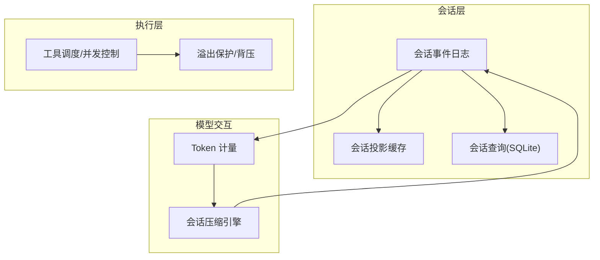
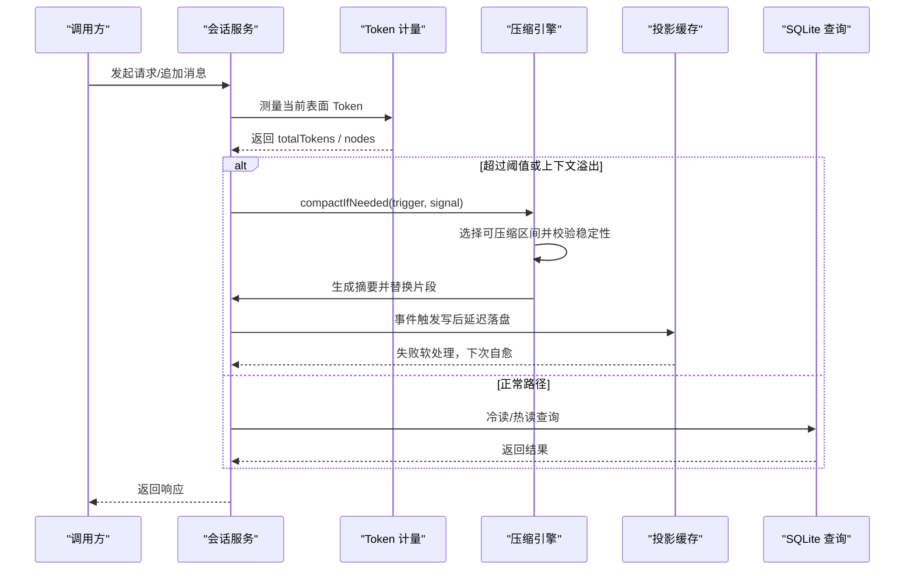
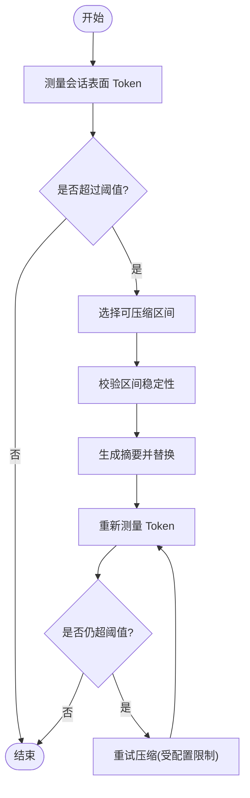
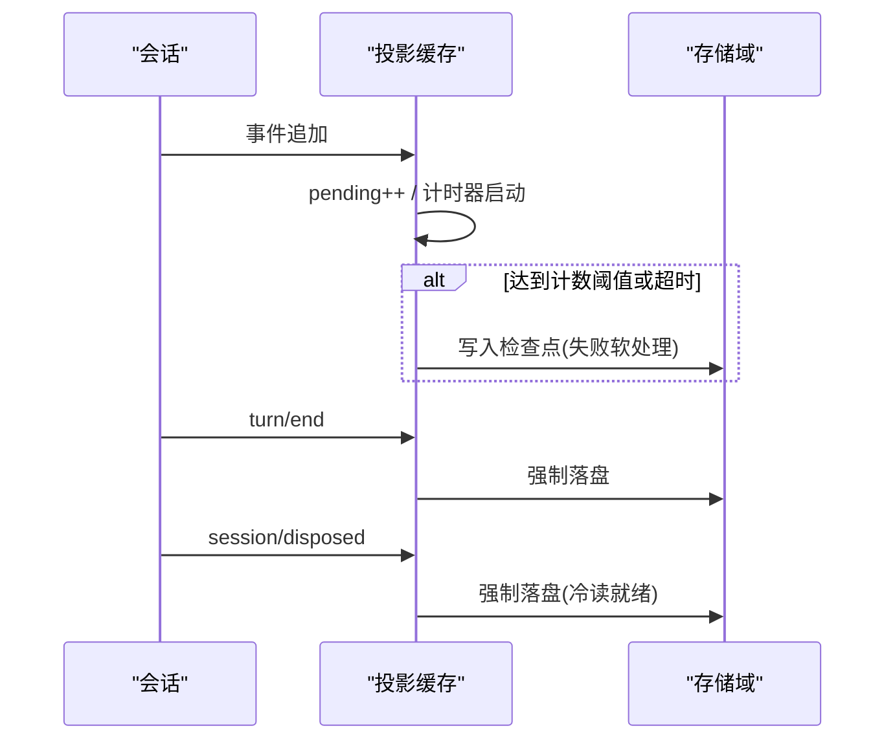
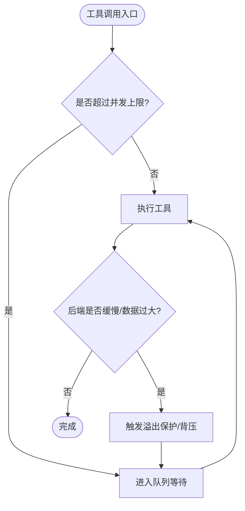
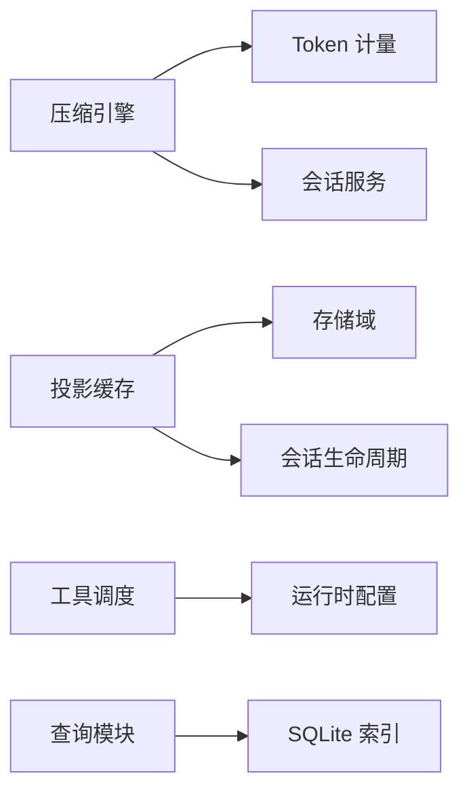

# 性能优化

<cite>
**本文引用的文件**
- [packages/compaction/compaction-basic/src/index.ts](file://packages/compaction/compaction-basic/src/index.ts)
- [packages/compaction/compaction-basic/src/region.ts](file://packages/compaction/compaction-basic/src/region.ts)
- [packages/compaction/compaction/src/index.ts](file://packages/compaction/compaction/src/index.ts)
- [packages/llm/token-meter/src/surface-projection.ts](file://packages/llm/token-meter/src/surface-projection.ts)
- [packages/llm/token-meter/tests/token-usage-projection.spec.ts](file://packages/llm/token-meter/tests/token-usage-projection.spec.ts)
- [packages/session/session-projection-cache/src/index.ts](file://packages/session/session-projection-cache/src/index.ts)
- [packages/session/session-projection-cache/tests/cache.spec.ts](file://packages/session/session-projection-cache/tests/cache.spec.ts)
- [packages/session-query/session-query-sqlite/src/index.ts](file://packages/session-query/session-query-sqlite/src/index.ts)
- [packages/core/tools/tests/code-mode.spec.ts](file://packages/core/tools/tests/code-mode.spec.ts)
- [packages/spill/spill-policy/tests/spill-policy.spec.ts](file://packages/spill/spill-policy/tests/spill-policy.spec.ts)
- [packages/host/apiproxy/src/api-proxy.ts](file://packages/host/apiproxy/src/api-proxy.ts)
- [apps/web/tests/complex-history.perf.ts](file://apps/web/tests/complex-history.perf.ts)
- [BENCHMARK.md](file://BENCHMARK.md)
</cite>

## 目录
1. [简介](#简介)
2. [项目结构](#项目结构)
3. [核心组件](#核心组件)
4. [架构总览](#架构总览)
5. [详细组件分析](#详细组件分析)
6. [依赖关系分析](#依赖关系分析)
7. [性能考量](#性能考量)
8. [故障排查指南](#故障排查指南)
9. [结论](#结论)
10. [附录](#附录)

## 简介
本指南聚焦 DeepSeek Harness 在生产环境下的性能优化，覆盖内存管理、垃圾回收与泄漏检测；并发控制、线程池与任务队列；缓存策略、数据库查询与文件 I/O；Token 计量与成本优化；会话压缩对性能与存储的影响；基准测试与分析工具；以及生产资源分配、负载均衡与水平扩展建议。内容基于仓库内实现与测试用例进行提炼，确保可落地与可验证。

## 项目结构
DeepSeek Harness 采用多包模块化架构，关键子系统包括：
- 会话压缩（Compaction）：在上下文压力或溢出时自动/手动压缩会话表面，降低 Token 消耗并维持响应性。
- Token 计量（Token Meter）：以 O(1) 折叠维护会话表面的 Token 估算，支撑压缩阈值与成本统计。
- 会话投影缓存（Session Projection Cache）：写后延迟落盘 + 强制落盘点，提供冷读加速与自愈能力。
- 会话查询（Session Query SQLite）：串行化访问 SQLite 索引，避免并发竞争。
- 代码运行时与工具调度：限制子调用并发度，防止 CPU/内存过载。
- 溢出保护（Spill Policy）：对大对象与慢后端进行背压，避免无界堆积。
- Web 端性能测试：通过 Playwright 采集浏览器指标，评估渲染与流式更新性能。

图表来源
- [packages/session/session-projection-cache/src/index.ts:62-263](file://packages/session/session-projection-cache/src/index.ts#L62-L263)
- [packages/llm/token-meter/src/surface-projection.ts:1-95](file://packages/llm/token-meter/src/surface-projection.ts#L1-L95)
- [packages/compaction/compaction-basic/src/index.ts:95-200](file://packages/compaction/compaction-basic/src/index.ts#L95-L200)
- [packages/core/tools/tests/code-mode.spec.ts:567-590](file://packages/core/tools/tests/code-mode.spec.ts#L567-L590)
- [packages/spill/spill-policy/tests/spill-policy.spec.ts:373-398](file://packages/spill/spill-policy/tests/spill-policy.spec.ts#L373-L398)

章节来源
- [packages/session/session-projection-cache/src/index.ts:62-263](file://packages/session/session-projection-cache/src/index.ts#L62-L263)
- [packages/llm/token-meter/src/surface-projection.ts:1-95](file://packages/llm/token-meter/src/surface-projection.ts#L1-L95)
- [packages/compaction/compaction-basic/src/index.ts:95-200](file://packages/compaction/compaction-basic/src/index.ts#L95-L200)
- [packages/core/tools/tests/code-mode.spec.ts:567-590](file://packages/core/tools/tests/code-mode.spec.ts#L567-L590)
- [packages/spill/spill-policy/tests/spill-policy.spec.ts:373-398](file://packages/spill/spill-policy/tests/spill-policy.spec.ts#L373-L398)

## 核心组件
- 会话压缩引擎：基于 Token 计量与保留策略，选择可压缩区间，生成摘要并替换原片段，支持重试与上下文溢出恢复。
- Token 计量器：维护会话表面 Token 的增量变化，使用“影子价格”协议保证替换区间的计价一致性。
- 会话投影缓存：按事件计数与时间间隔节流写入，并在“回合结束”和“会话销毁”两个强制点落盘，提供冷读路径与自愈。
- 会话查询 SQLite：串行化访问，避免并发冲突，失败时抛出明确错误。
- 工具并发控制：通过 maxParallelSubCalls 限制并行子调用，保障资源占用上限。
- 溢出保护：当后端缓慢或数据过大时，触发背压，阻止无界堆积。

章节来源
- [packages/compaction/compaction-basic/src/index.ts:95-200](file://packages/compaction/compaction-basic/src/index.ts#L95-L200)
- [packages/llm/token-meter/src/surface-projection.ts:1-95](file://packages/llm/token-meter/src/surface-projection.ts#L1-L95)
- [packages/session/session-projection-cache/src/index.ts:62-263](file://packages/session/session-projection-cache/src/index.ts#L62-L263)
- [packages/session-query/session-query-sqlite/src/index.ts:357-393](file://packages/session-query/session-query-sqlite/src/index.ts#L357-L393)
- [packages/core/tools/tests/code-mode.spec.ts:567-590](file://packages/core/tools/tests/code-mode.spec.ts#L567-L590)
- [packages/spill/spill-policy/tests/spill-policy.spec.ts:373-398](file://packages/spill/spill-policy/tests/spill-policy.spec.ts#L373-L398)

## 架构总览
下图展示从用户请求到会话压缩、Token 计量、缓存与查询的关键路径，体现性能优化的关键点：节流写入、并发限制、背压与冷读加速。

图表来源
- [packages/compaction/compaction-basic/src/index.ts:137-200](file://packages/compaction/compaction-basic/src/index.ts#L137-L200)
- [packages/compaction/compaction-basic/src/region.ts:398-424](file://packages/compaction/compaction-basic/src/region.ts#L398-L424)
- [packages/session/session-projection-cache/src/index.ts:199-263](file://packages/session/session-projection-cache/src/index.ts#L199-L263)
- [packages/session-query/session-query-sqlite/src/index.ts:357-393](file://packages/session-query/session-query-sqlite/src/index.ts#L357-L393)

## 详细组件分析

### 会话压缩与 Token 计量
- 压缩触发：步骤前压力检查与上下文溢出恢复，均调用 compactIfNeeded，支持 AbortSignal 取消。
- 区间选择与稳定性：选择可压缩范围后，在摘要生成期间校验所选区间未被修改，确保一致性。
- Token 计量：通过 surface-projection 的 foldSurfaceProjection 维护增量 Token，配合“影子价格”协议精确计价替换区间。

图表来源
- [packages/compaction/compaction-basic/src/index.ts:137-200](file://packages/compaction/compaction-basic/src/index.ts#L137-L200)
- [packages/compaction/compaction-basic/src/region.ts:398-424](file://packages/compaction/compaction-basic/src/region.ts#L398-L424)
- [packages/llm/token-meter/src/surface-projection.ts:66-95](file://packages/llm/token-meter/src/surface-projection.ts#L66-L95)

章节来源
- [packages/compaction/compaction/src/index.ts:101-117](file://packages/compaction/compaction/src/index.ts#L101-L117)
- [packages/compaction/compaction-basic/src/index.ts:95-200](file://packages/compaction/compaction-basic/src/index.ts#L95-L200)
- [packages/compaction/compaction-basic/src/region.ts:398-424](file://packages/compaction/compaction-basic/src/region.ts#L398-L424)
- [packages/llm/token-meter/src/surface-projection.ts:1-95](file://packages/llm/token-meter/src/surface-projection.ts#L1-L95)
- [packages/llm/token-meter/tests/token-usage-projection.spec.ts:74-99](file://packages/llm/token-meter/tests/token-usage-projection.spec.ts#L74-L99)

### 会话投影缓存与冷读路径
- 写后延迟：按事件计数与时间间隔节流写入，减少频繁持久化开销。
- 强制落盘点：回合结束与会话销毁时立即落盘，确保冷读可用。
- 自愈机制：持久化失败仅记录警告，下次写入或冷读时自动修复。

图表来源
- [packages/session/session-projection-cache/src/index.ts:199-263](file://packages/session/session-projection-cache/src/index.ts#L199-L263)
- [packages/session/session-projection-cache/tests/cache.spec.ts:120-168](file://packages/session/session-projection-cache/tests/cache.spec.ts#L120-L168)

章节来源
- [packages/session/session-projection-cache/src/index.ts:62-263](file://packages/session/session-projection-cache/src/index.ts#L62-L263)
- [packages/session/session-projection-cache/tests/cache.spec.ts:120-168](file://packages/session/session-projection-cache/tests/cache.spec.ts#L120-L168)

### 并发控制与任务队列优化
- 子调用并发限制：通过 maxParallelSubCalls 控制同时运行的工具调用数量，避免资源争用。
- 溢出保护与背压：当后端缓慢或数据过大时，有序通道会阻塞后续提交，防止无界堆积。
- 任务队列：结合 spill policy 与工具运行时，确保在受限资源下稳定运行。

图表来源
- [packages/core/tools/tests/code-mode.spec.ts:567-590](file://packages/core/tools/tests/code-mode.spec.ts#L567-L590)
- [packages/spill/spill-policy/tests/spill-policy.spec.ts:373-398](file://packages/spill/spill-policy/tests/spill-policy.spec.ts#L373-L398)

章节来源
- [packages/core/tools/tests/code-mode.spec.ts:567-590](file://packages/core/tools/tests/code-mode.spec.ts#L567-L590)
- [packages/spill/spill-policy/tests/spill-policy.spec.ts:373-398](file://packages/spill/spill-policy/tests/spill-policy.spec.ts#L373-L398)

### 数据库查询优化
- 串行化访问：SQLite 索引操作通过 _serialized 方法串行执行，避免并发冲突。
- 错误处理：打开失败或中止信号触发时抛出明确错误，便于上层定位问题。

章节来源
- [packages/session-query/session-query-sqlite/src/index.ts:357-393](file://packages/session-query/session-query-sqlite/src/index.ts#L357-L393)

### 文件 I/O 与冷读探测
- 冷会话元数据探测：在列出会话时对物理文件大小进行检查，超大会话跳过快速探测，避免阻塞。
- 读取失败降级：读取失败时记录警告并继续可见，保证列表可用性。

章节来源
- [packages/host/apiproxy/src/api-proxy.ts:565-601](file://packages/host/apiproxy/src/api-proxy.ts#L565-L601)

## 依赖关系分析
- 压缩引擎依赖 Token 计量与 Session 服务，通过事件驱动触发压缩。
- 投影缓存依赖存储域与会话生命周期事件，实现写后延迟与强制落盘。
- 工具调度依赖运行时配置，限制并发以避免资源耗尽。
- 查询模块依赖 SQLite，串行化访问提升稳定性。

图表来源
- [packages/compaction/compaction-basic/src/index.ts:95-200](file://packages/compaction/compaction-basic/src/index.ts#L95-L200)
- [packages/session/session-projection-cache/src/index.ts:62-263](file://packages/session/session-projection-cache/src/index.ts#L62-L263)
- [packages/core/tools/tests/code-mode.spec.ts:567-590](file://packages/core/tools/tests/code-mode.spec.ts#L567-L590)
- [packages/session-query/session-query-sqlite/src/index.ts:357-393](file://packages/session-query/session-query-sqlite/src/index.ts#L357-L393)

章节来源
- [packages/compaction/compaction-basic/src/index.ts:95-200](file://packages/compaction/compaction-basic/src/index.ts#L95-L200)
- [packages/session/session-projection-cache/src/index.ts:62-263](file://packages/session/session-projection-cache/src/index.ts#L62-L263)
- [packages/core/tools/tests/code-mode.spec.ts:567-590](file://packages/core/tools/tests/code-mode.spec.ts#L567-L590)
- [packages/session-query/session-query-sqlite/src/index.ts:357-393](file://packages/session-query/session-query-sqlite/src/index.ts#L357-L393)

## 性能考量
- 内存管理与 GC：
  - 使用弱引用与及时清理定时器，避免会话销毁后残留状态。
  - 投影缓存的脏标记与定时任务在插件销毁时统一清理。
- 垃圾回收调优：
  - 通过强制落盘点减少长生命周期对象持有，降低堆增长。
  - 大对象与中间绑定值需关注内存边界，避免溢出。
- 内存泄漏检测：
  - 利用测试中的断言与监控点，验证资源释放与状态清理。
- 并发控制：
  - 合理设置 maxParallelSubCalls，平衡吞吐与资源占用。
  - 结合溢出保护，防止慢后端导致的队列膨胀。
- 缓存策略：
  - 调整 writeEveryEvents 与 writeIntervalMs，平衡写入频率与持久化开销。
- 数据库查询：
  - 串行化访问 SQLite，避免锁竞争；必要时分库或分表。
- 文件 I/O：
  - 冷读探测跳过超大会话，减少 I/O 压力。
- Token 计量与成本优化：
  - 使用 compaction/summary 与 compaction/prune 的影子价格协议，精确计价替换区间。
  - 根据 totalTokens 与 surfaceTokens 动态调整压缩阈值，降低成本。
- 会话压缩影响：
  - 压缩减少 Token 消耗与内存占用，但可能增加摘要生成开销；需权衡阈值与重试次数。
- 基准测试与分析：
  - 使用 apps/web/tests/complex-history.perf.ts 采集浏览器指标（节点数、监听器、堆大小等）。
  - 遵循 BENCHMARK.md 指导，使用独立工作区与会话 ID 进行隔离测试。

章节来源
- [packages/session/session-projection-cache/src/index.ts:232-263](file://packages/session/session-projection-cache/src/index.ts#L232-L263)
- [packages/llm/token-meter/src/surface-projection.ts:66-95](file://packages/llm/token-meter/src/surface-projection.ts#L66-L95)
- [apps/web/tests/complex-history.perf.ts:515-542](file://apps/web/tests/complex-history.perf.ts#L515-L542)
- [BENCHMARK.md:1-4](file://BENCHMARK.md#L1-L4)

## 故障排查指南
- 压缩失败：
  - 检查目标策略配置与上下文溢出重试次数，确认是否因配置不当导致压缩未生效。
  - 查看日志中关于 step compaction failed 的警告，定位具体错误原因。
- 投影缓存写入失败：
  - 关注“session projection cache: ... write for ... failed”警告，确认存储域可用性与权限。
  - 自愈机制会在下次写入或冷读时尝试恢复，若持续失败需检查底层存储。
- SQLite 查询异常：
  - 捕获 SESSION_QUERY_INDEX_FAILED 错误，检查索引打开与中止信号处理。
- 工具并发超限：
  - 调整 maxParallelSubCalls，观察峰值并发与排队情况，避免资源争用。
- 溢出保护触发：
  - 监控 tool/code-dispatch-start 事件，确认是否因后端缓慢或数据过大导致背压。

章节来源
- [packages/compaction/compaction-basic/src/index.ts:137-200](file://packages/compaction/compaction-basic/src/index.ts#L137-L200)
- [packages/session/session-projection-cache/src/index.ts:246-263](file://packages/session/session-projection-cache/src/index.ts#L246-L263)
- [packages/session-query/session-query-sqlite/src/index.ts:357-393](file://packages/session-query/session-query-sqlite/src/index.ts#L357-L393)
- [packages/core/tools/tests/code-mode.spec.ts:567-590](file://packages/core/tools/tests/code-mode.spec.ts#L567-L590)
- [packages/spill/spill-policy/tests/spill-policy.spec.ts:373-398](file://packages/spill/spill-policy/tests/spill-policy.spec.ts#L373-L398)

## 结论
DeepSeek Harness 通过会话压缩、Token 计量、投影缓存、并发控制与溢出保护等机制，构建了高性能、可扩展的会话处理框架。生产环境中应合理配置压缩阈值、缓存写入策略与并发上限，并结合基准测试与监控工具持续优化。对于 CPU 密集型任务，优先限制并发与启用溢出保护；对于 I/O 密集型任务，优化缓存与查询串行化策略，避免阻塞。

## 附录
- 基准测试方法：
  - 使用 apps/web/tests/complex-history.perf.ts 采集浏览器性能指标，包括 DOM 节点、监听器、堆内存等。
  - 遵循 BENCHMARK.md 指导，使用独立工作区与会话 ID 进行隔离测试。
- 生产资源分配建议：
  - 根据负载调整 maxParallelSubCalls 与压缩阈值，避免资源耗尽。
  - 为投影缓存配置合适的 writeEveryEvents 与 writeIntervalMs，平衡写入频率与持久化开销。
- 负载均衡与水平扩展：
  - 通过多实例部署与会话路由，分散负载；结合 SQLite 串行化与存储域分片，提升整体吞吐。

章节来源
- [apps/web/tests/complex-history.perf.ts:515-542](file://apps/web/tests/complex-history.perf.ts#L515-L542)
- [BENCHMARK.md:1-4](file://BENCHMARK.md#L1-L4)