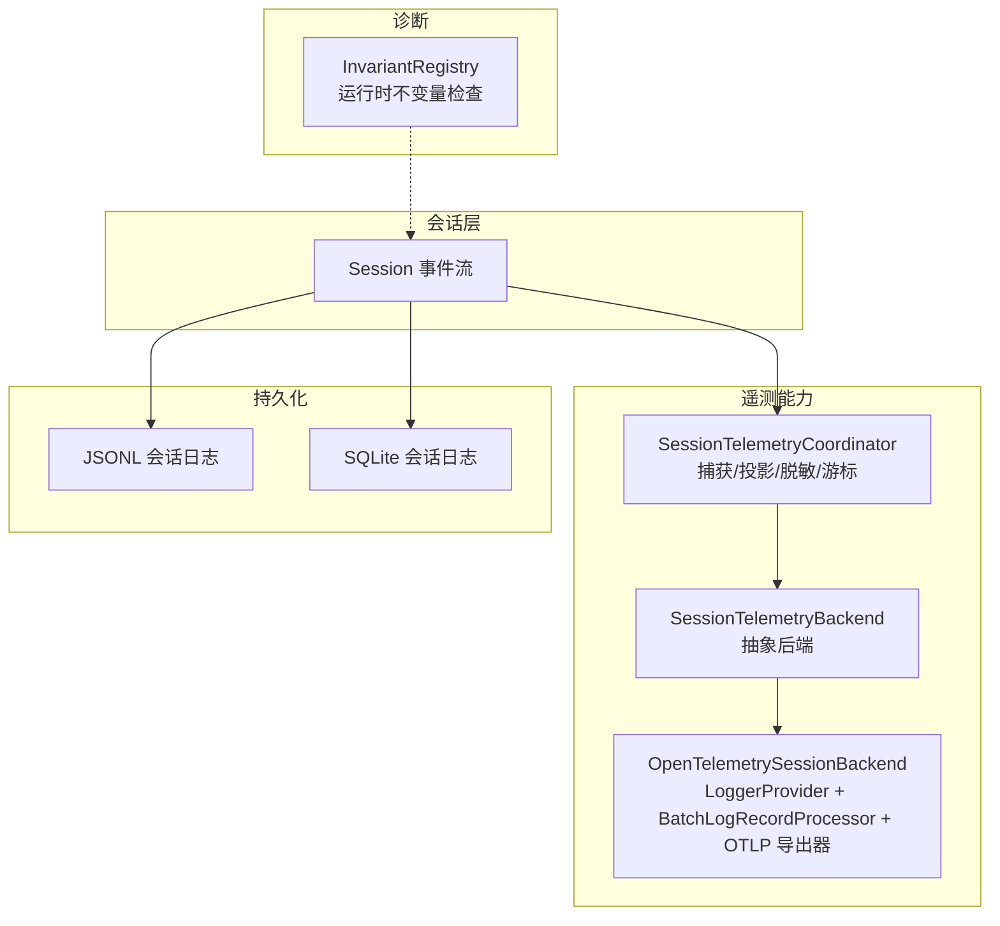
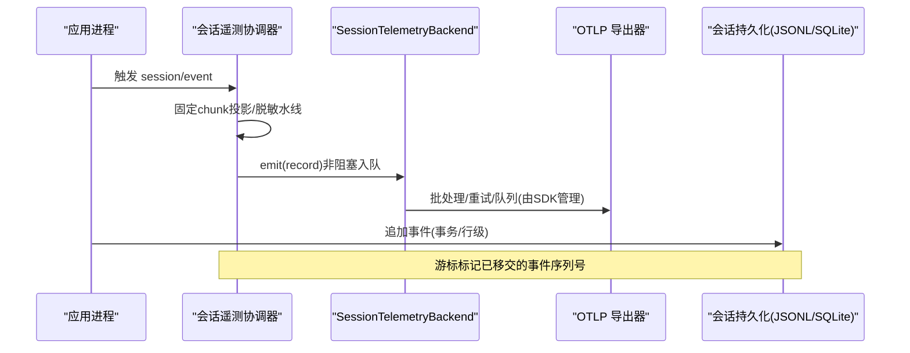
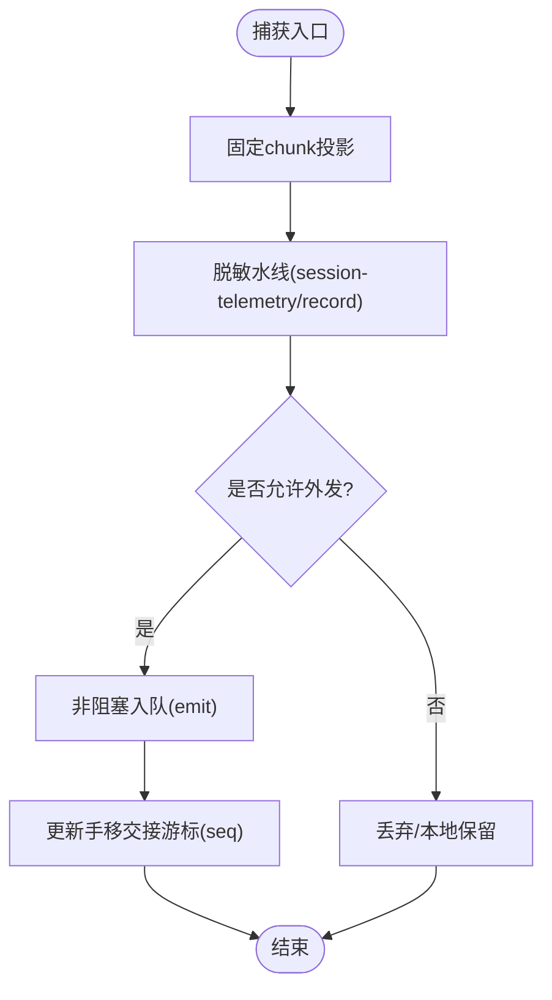
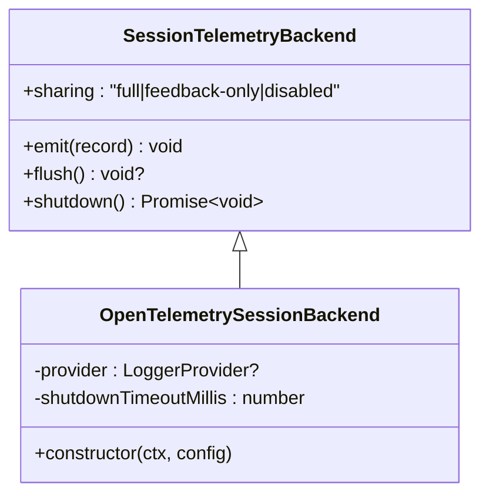
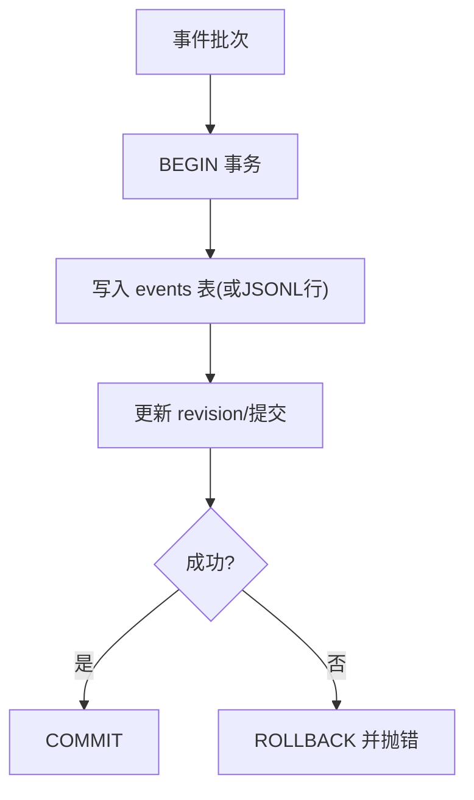
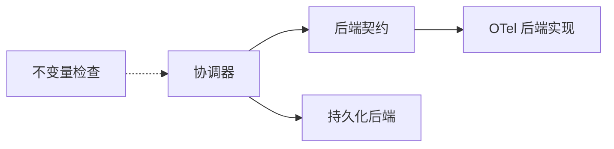

# 监控日志

<cite>
**本文引用的文件**
- [packages/session/session-telemetry/src/index.ts](file://packages/session/session-telemetry/src/index.ts)
- [packages/session/session-telemetry/README.md](file://packages/session/session-telemetry/README.md)
- [packages/session/session-telemetry-otel/src/index.ts](file://packages/session/session-telemetry-otel/src/index.ts)
- [packages/session/session-telemetry-otel/README.md](file://packages/session/session-telemetry-otel/README.md)
- [docs/subsystems/session-telemetry.md](file://docs/subsystems/session-telemetry.md)
- [packages/runtime-diagnostics/invariants/src/index.ts](file://packages/runtime-diagnostics/invariants/src/index.ts)
- [packages/runtime-diagnostics/invariants/README.md](file://packages/runtime-diagnostics/invariants/README.md)
- [packages/session/session-persistence-sqlite/src/index.ts](file://packages/session/session-persistence-sqlite/src/index.ts)
- [packages/session/session-persistence-jsonl/src/format.ts](file://packages/session/session-persistence-jsonl/src/format.ts)
- [packages/client/ui-trajectory/src/client/TrajectoryTable.tsx](file://packages/client/ui-trajectory/src/client/TrajectoryTable.tsx)
- [apps/cli/tests/fixtures/dsh-badge/cordis.yml](file://apps/cli/tests/fixtures/dsh-badge/cordis.yml)
</cite>

## 目录
1. [简介](#简介)
2. [项目结构](#项目结构)
3. [核心组件](#核心组件)
4. [架构总览](#架构总览)
5. [详细组件分析](#详细组件分析)
6. [依赖关系分析](#依赖关系分析)
7. [性能考量](#性能考量)
8. [故障排查指南](#故障排查指南)
9. [结论](#结论)
10. [附录](#附录)

## 简介
本文件面向运维与平台工程团队，系统化说明 DeepSeek Harness 的运行时诊断、指标采集与遥测机制，并给出如何接入 Prometheus、Grafana、ELK Stack 等外部监控系统的具体建议。文档覆盖：
- 内置运行时诊断工具（不变量检查）
- 会话级遥测数据捕获与上报（OpenTelemetry 后端）
- 会话日志持久化格式与扫描
- KPI 定义与阈值建议
- 告警规则示例（资源使用率、错误率、响应时间）
- 日志格式、轮转、聚合与长期存储方案
- 常见故障定位技巧

## 项目结构
DeepSeek Harness 将“遥测能力”拆分为可插拔的服务契约与实现：
- 服务契约与捕获协调器：session-telemetry（负责捕获点、投影、脱敏水线、游标与最小后端契约）
- OpenTelemetry 后端：session-telemetry-otel（对接 OTLP/HTTP 日志导出器，配置批处理、重试、队列与丢失策略）
- 运行时不变量：runtime-diagnostics/invariants（按包注册运行时不变量检查，支持白名单/黑名单过滤）
- 会话持久化：session-persistence-*（JSONL/SQLite 等后端，提供事件追加、事务边界与解析）

图表来源
- [packages/session/session-telemetry/src/index.ts:148-176](file://packages/session/session-telemetry/src/index.ts#L148-L176)
- [packages/session/session-telemetry-otel/src/index.ts:147-200](file://packages/session/session-telemetry-otel/src/index.ts#L147-L200)
- [packages/session/session-persistence-jsonl/src/format.ts:249-281](file://packages/session/session-persistence-jsonl/src/format.ts#L249-L281)
- [packages/session/session-persistence-sqlite/src/index.ts:278-302](file://packages/session/session-persistence-sqlite/src/index.ts#L278-L302)
- [packages/runtime-diagnostics/invariants/src/index.ts:94-197](file://packages/runtime-diagnostics/invariants/src/index.ts#L94-L197)

章节来源
- [packages/session/session-telemetry/README.md:1-50](file://packages/session/session-telemetry/README.md#L1-L50)
- [packages/session/session-telemetry-otel/README.md:1-57](file://packages/session/session-telemetry-otel/README.md#L1-L57)
- [docs/subsystems/session-telemetry.md:1-195](file://docs/subsystems/session-telemetry.md#L1-L195)

## 核心组件
- 会话遥测协调器（capture coordinator）
  - 职责：订阅会话事件、固定 chunk 投影、脱敏水线、手移交接游标、最小后端契约
  - 关键行为：仅首块 assistant/chunk 随流发送；其他事件完整透传；对 ops 记录（agent-error、shutdown）作为信号而非计数项
- OpenTelemetry 后端
  - 职责：以 LoggerProvider + BatchLogRecordProcessor + OTLP/HTTP 导出器构建上报管线；映射 severity、attributes、body；资源标识包含 service.name/version 与匿名 user.id
  - 模式：FULL（实时）、FEEDBACK_ONLY（仅在反馈时回放已记录的会话日志前缀）、DISABLED（默认，不构造 SDK 管线）
- 运行时不变量检查
  - 职责：按包注册运行时不变量检查，支持全局开关与包名正则白/黑名单；失败抛出 InvariantError（code=INVARIANT）
- 会话持久化
  - JSONL：逐行 JSON 事件，带 header；支持增量扫描与完整性校验
  - SQLite：批量追加在单事务中完成，保证原子性与持久性

章节来源
- [packages/session/session-telemetry/src/index.ts:148-176](file://packages/session/session-telemetry/src/index.ts#L148-L176)
- [packages/session/session-telemetry-otel/src/index.ts:147-200](file://packages/session/session-telemetry-otel/src/index.ts#L147-L200)
- [packages/runtime-diagnostics/invariants/src/index.ts:94-197](file://packages/runtime-diagnostics/invariants/src/index.ts#L94-L197)
- [packages/session/session-persistence-jsonl/src/format.ts:249-281](file://packages/session/session-persistence-jsonl/src/format.ts#L249-L281)
- [packages/session/session-persistence-sqlite/src/index.ts:278-302](file://packages/session/session-persistence-sqlite/src/index.ts#L278-L302)

## 架构总览
遥测数据从会话事件出发，经协调器投影与脱敏后，交由后端 SDK 进行批处理与网络导出；同时会话事件被持久化为 JSONL 或写入 SQLite。运行时不变量检查在运行期验证内部一致性。

图表来源
- [packages/session/session-telemetry/src/index.ts:148-176](file://packages/session/session-telemetry/src/index.ts#L148-L176)
- [packages/session/session-telemetry-otel/src/index.ts:147-200](file://packages/session/session-telemetry-otel/src/index.ts#L147-L200)
- [packages/session/session-persistence-jsonl/src/format.ts:249-281](file://packages/session/session-persistence-jsonl/src/format.ts#L249-L281)
- [packages/session/session-persistence-sqlite/src/index.ts:278-302](file://packages/session/session-persistence-sqlite/src/index.ts#L278-L302)

## 详细组件分析

### 会话遥测协调器（session-telemetry）
- 捕获点：session/created、session/event、session/flush、session/disposed、agent/error
- 投影与游标：仅首块 assistant/chunk 随流发送；WeakMap 维护每会话最高已移交 seq，避免重复导出
- 脱敏水线：通过 session-telemetry/record 瀑布扩展点，部署侧挂载规则，仅影响外发副本，不改写本地会话日志
- 逻辑记录：channel（ledger/ops）、time、severity（info/warn/error）、attributes（最小身份）、body（深拷贝）
- 交付语义：best-effort，接收端需基于 (session.id, event.seq) 去重；ops 记录用于告警信号

图表来源
- [packages/session/session-telemetry/src/index.ts:148-176](file://packages/session/session-telemetry/src/index.ts#L148-L176)
- [docs/subsystems/session-telemetry.md:1-195](file://docs/subsystems/session-telemetry.md#L1-L195)

章节来源
- [packages/session/session-telemetry/README.md:1-50](file://packages/session/session-telemetry/README.md#L1-L50)
- [docs/subsystems/session-telemetry.md:1-195](file://docs/subsystems/session-telemetry.md#L1-L195)

### OpenTelemetry 后端（session-telemetry-otel）
- 模式
  - FULL：每条记录即时交给 OTel SDK
  - FEEDBACK_ONLY：仅在 feedback/record 时回放已记录的会话日志前缀
  - DISABLED：默认，不构造 SDK 管线，仅记录警告
- 配置要点
  - exporter.url：必填（非 DISABLED），必须为 http(s)
  - processor：透传给 BatchLogRecordProcessor（含 maxExportBatchSize 等）
  - shutdownTimeoutMillis：外层关闭超时，默认 3000ms
- 资源标识：service.name/version 来自 APP_IDENTITY；附加匿名 user.id
- 严重级别映射：info/warn/error → OTel SeverityNumber

图表来源
- [packages/session/session-telemetry/src/index.ts:148-176](file://packages/session/session-telemetry/src/index.ts#L148-L176)
- [packages/session/session-telemetry-otel/src/index.ts:147-200](file://packages/session/session-telemetry-otel/src/index.ts#L147-L200)

章节来源
- [packages/session/session-telemetry-otel/README.md:1-57](file://packages/session/session-telemetry-otel/README.md#L1-L57)
- [packages/session/session-telemetry-otel/src/index.ts:147-200](file://packages/session/session-telemetry-otel/src/index.ts#L147-L200)

### 运行时不变量检查（invariants）
- 功能：按 npm 包名注册运行时不变量检查，支持 enabled、package_allowlist、package_blocklist
- 执行：启用时在独立 fiber 中运行；失败抛出 InvariantError（code=INVARIANT），携带 packageName
- 适用场景：校验跨记录一致性、状态机转换、不可变快照约束等

章节来源
- [packages/runtime-diagnostics/invariants/README.md:1-86](file://packages/runtime-diagnostics/invariants/README.md#L1-L86)
- [packages/runtime-diagnostics/invariants/src/index.ts:94-197](file://packages/runtime-diagnostics/invariants/src/index.ts#L94-L197)

### 会话日志持久化（JSONL/SQLite）
- JSONL：header 行 + 事件行；支持增量扫描与完整性校验
- SQLite：批量追加在单事务中，确保原子性与持久性；失败回滚

图表来源
- [packages/session/session-persistence-sqlite/src/index.ts:278-302](file://packages/session/session-persistence-sqlite/src/index.ts#L278-L302)
- [packages/session/session-persistence-jsonl/src/format.ts:249-281](file://packages/session/session-persistence-jsonl/src/format.ts#L249-L281)

章节来源
- [packages/session/session-persistence-sqlite/src/index.ts:278-302](file://packages/session/session-persistence-sqlite/src/index.ts#L278-L302)
- [packages/session/session-persistence-jsonl/src/format.ts:249-281](file://packages/session/session-persistence-jsonl/src/format.ts#L249-L281)

## 依赖关系分析
- 遥测能力解耦：协调器只关心最小后端契约，具体上报由后端实现承担
- 外部依赖：OpenTelemetry JS SDK（LoggerProvider、BatchLogRecordProcessor、OTLP 导出器）
- 持久化后端：JSONL/SQLite 等，选择取决于部署需求
- 诊断：invariants 与业务包解耦，通过插件机制装配

图表来源
- [packages/session/session-telemetry/src/index.ts:148-176](file://packages/session/session-telemetry/src/index.ts#L148-L176)
- [packages/session/session-telemetry-otel/src/index.ts:147-200](file://packages/session/session-telemetry-otel/src/index.ts#L147-L200)

章节来源
- [docs/subsystems/session-telemetry.md:1-195](file://docs/subsystems/session-telemetry.md#L1-L195)

## 性能考量
- 捕获路径零 I/O：协调器在 session/event 热路径只做投影、深拷贝与入队，避免阻塞
- 批处理与重试：由 OTel SDK 管理，可通过 processor 参数调优（如 scheduledDelayMillis、maxExportBatchSize、queue 大小、重试策略）
- 关闭超时：shutdownTimeoutMillis 控制外层等待上限，防止进程退出卡死
- 日志持久化：SQLite 批量事务减少磁盘抖动；JSONL 适合追加型高吞吐场景
- 前端指标展示：TTFT、生成耗时、吞吐量等指标可用于评估模型调用体验

章节来源
- [packages/session/session-telemetry-otel/README.md:1-57](file://packages/session/session-telemetry-otel/README.md#L1-L57)
- [packages/client/ui-trajectory/src/client/TrajectoryTable.tsx:311-344](file://packages/client/ui-trajectory/src/client/TrajectoryTable.tsx#L311-L344)

## 故障排查指南
- 遥测未上报
  - 确认 mode 是否为 DISABLED；若为 FEEDBACK_ONLY，需在会话中产生 feedback/record 才会回放前缀
  - 检查 exporter.url 是否有效且为 http(s)；processor.maxExportBatchSize 是否为正整数
  - 查看关闭阶段是否有超时导致部分记录丢失
- 日志损坏或无法解析
  - JSONL 头行非合法 JSON 或缺失会导致解析失败；检查写入过程与并发访问
  - SQLite 事务失败会回滚，关注唯一键冲突等异常
- 运行时不变量报错
  - 出现 InvariantError（code=INVARIANT）时，根据 packageName 定位对应包，检查其契约是否被破坏
- 常见问题定位
  - 使用 /feedback 命令确认共享策略披露（full/feedback-only/disabled）
  - 通过 CLI 测试夹具可禁用遥测以隔离问题（见 dsh-badge cordis.yml）

章节来源
- [packages/session/session-telemetry-otel/README.md:1-57](file://packages/session/session-telemetry-otel/README.md#L1-L57)
- [packages/session/session-persistence-jsonl/src/format.ts:249-281](file://packages/session/session-persistence-jsonl/src/format.ts#L249-L281)
- [packages/session/session-persistence-sqlite/src/index.ts:278-302](file://packages/session/session-persistence-sqlite/src/index.ts#L278-L302)
- [packages/runtime-diagnostics/invariants/src/index.ts:94-197](file://packages/runtime-diagnostics/invariants/src/index.ts#L94-L197)
- [apps/cli/tests/fixtures/dsh-badge/cordis.yml:1-9](file://apps/cli/tests/fixtures/dsh-badge/cordis.yml#L1-L9)

## 结论
DeepSeek Harness 通过“协调器 + 后端”的解耦设计，实现了可扩展的会话级遥测与运行时诊断。结合 JSONL/SQLite 的持久化能力与 OpenTelemetry 生态，能够灵活对接 Prometheus/Grafana/ELK 等系统。通过合理的 KPI 与告警策略，以及完善的故障排查手段，可显著提升生产环境的可观测性与稳定性。

## 附录

### 关键性能指标（KPI）定义与阈值建议
- 首字延迟（TTFT）：从步骤开始到首个 token 的时间，建议阈值依模型与任务而定（例如 P95 < 2s）
- 生成耗时：首 token 到完成的时长，建议设置 P95/P99 阈值
- 吞吐量（tokens/s）：输出 tokens 除以生成秒数，建议设定下限（如 > 50 tok/s）
- 错误率：tool/result.isError、turn/end 错误原因、agent-error 等导致的错误占比，建议 P95 错误率 < 1%
- 资源使用率：CPU/内存/磁盘 IO，建议设置饱和度阈值（如 CPU > 80% 持续 5 分钟）

章节来源
- [packages/client/ui-trajectory/src/client/TrajectoryTable.tsx:311-344](file://packages/client/ui-trajectory/src/client/TrajectoryTable.tsx#L311-L344)
- [docs/subsystems/session-telemetry.md:1-195](file://docs/subsystems/session-telemetry.md#L1-L195)

### 告警规则配置示例（Prometheus/Grafana/ELK）
- 资源使用率
  - 条件：node_cpu_usage_percent > 80% 持续 5m
  - 动作：通知运维群，自动扩容或限流
- 错误率
  - 条件：rate(agent_error_total[5m]) / rate(request_total[5m]) > 0.01
  - 动作：创建 Grafana 面板，推送 Slack/钉钉
- 响应时间
  - 条件：histogram_quantile(0.95, request_duration_seconds_bucket) > 2s
  - 动作：触发降级或熔断

（以上为通用示例，实际阈值请依据业务 SLA 调整）

### 日志格式、轮转、聚合与长期存储
- 日志格式
  - 会话事件：JSONL 行式，header 行 + 事件行；SQLite 以结构化表存储
  - 遥测记录：OTLP Logs 格式，包含 timestamp、severity、attributes、body
- 日志轮转
  - JSONL：按文件大小/时间切分，配合 logrotate 或对象存储生命周期
  - SQLite：定期归档与压缩，避免单库过大
- 聚合与长期存储
  - ELK：Filebeat/Fluent Bit 收集 JSONL 与 OTLP Logs，索引至 Elasticsearch，Kibana 可视化
  - Prometheus/Grafana：通过 Exporter 暴露指标，Grafana 看板展示趋势与告警

### 接入外部监控系统的步骤
- Prometheus/Grafana
  - 通过 OTLP 导出器将指标/日志发送至 Collector，再转发至 Prometheus 或 Loki
  - 配置 scrape 目标与 Grafana 数据源，建立看板与告警规则
- ELK Stack
  - 使用 Filebeat/Fluent Bit 收集 JSONL 与 OTLP Logs
  - 配置 Logstash/Ingest Pipeline 进行清洗与路由，Elasticsearch 存储，Kibana 查询

章节来源
- [packages/session/session-telemetry-otel/README.md:1-57](file://packages/session/session-telemetry-otel/README.md#L1-L57)
- [packages/session/session-persistence-jsonl/src/format.ts:249-281](file://packages/session/session-persistence-jsonl/src/format.ts#L249-L281)
- [packages/session/session-persistence-sqlite/src/index.ts:278-302](file://packages/session/session-persistence-sqlite/src/index.ts#L278-L302)