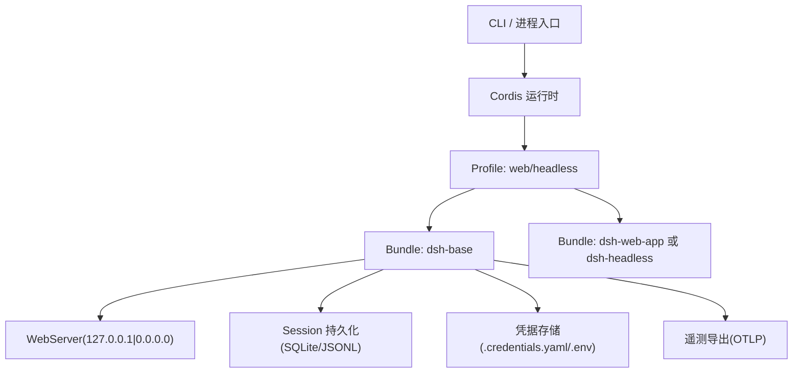
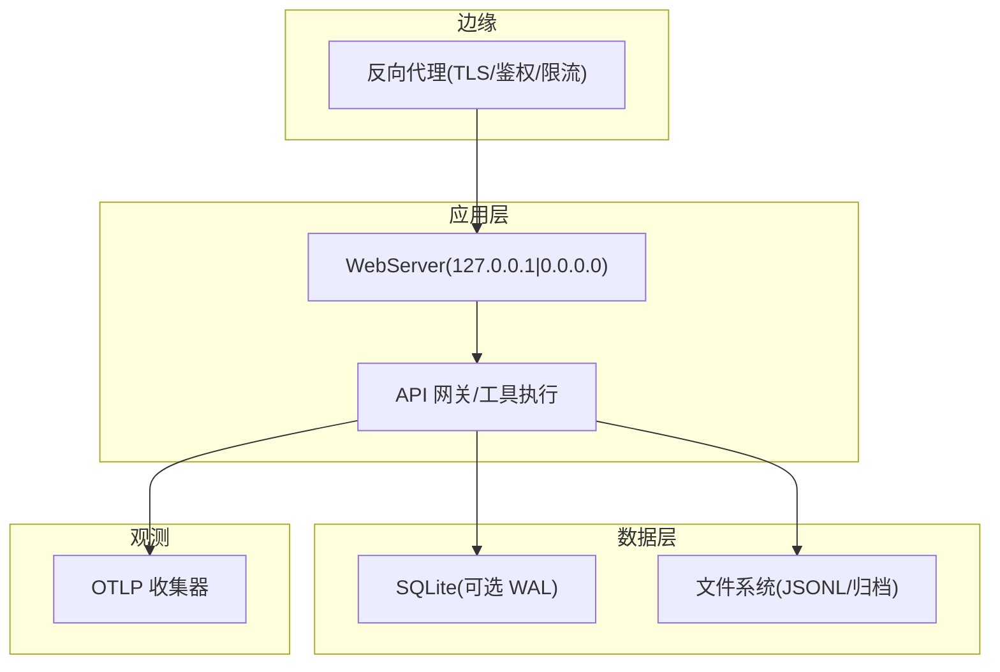
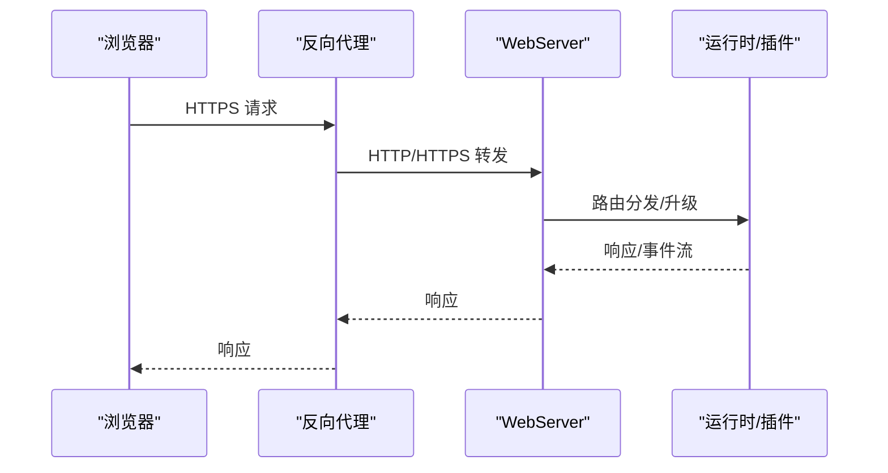
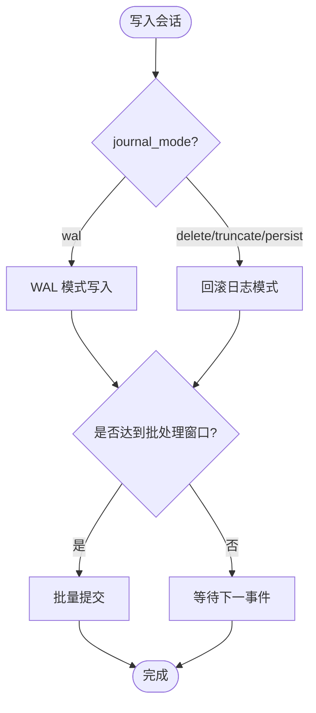
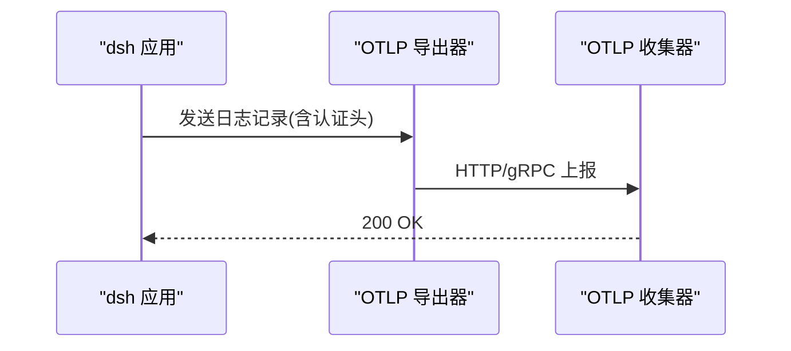
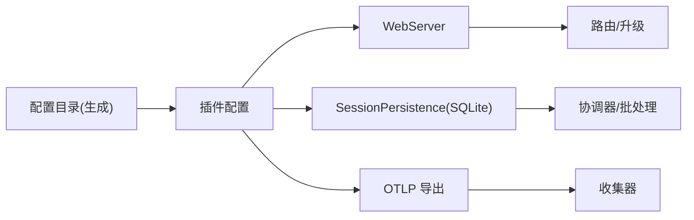

# 部署运维

<cite>
**本文引用的文件**
- [README.md](file://README.md)
- [架构文档](file://docs/architecture.md)
- [配置目录（生成）](file://docs/config-catalog.md)
- [Web 服务器实现](file://packages/host/webserver/src/index.ts)
- [Web 服务器说明](file://packages/host/webserver/README.md)
- [会话持久化 SQLite](file://packages/session/session-persistence-sqlite/src/index.ts)
- [SQLite 测试](file://packages/session/session-persistence-sqlite/tests/sqlite.spec.ts)
- [示例补丁 cordis.yml](file://examples/web-cordis/cordis.yml)
- [OpenTelemetry 会话遥测 README](file://packages/session/session-telemetry-otel/README.md)
- [OpenTelemetry 会话遥测测试](file://packages/session/session-telemetry-otel/tests/otel.spec.ts)
- [凭据与用户环境分层笔记](file://.agents/notes/implemented/architecture/2026-08-04-credentials-yaml-and-user-environment-layer.zh.md)
- [配置来源所有权笔记](file://.agents/notes/implemented/architecture/2026-08-04-configuration-source-ownership.zh.md)
- [Web 绑定地址决策](file://.agents/notes/implemented/feature/2026-07-22-web-bind-address.md)
- [MCP 客户端自动重连笔记](file://.agents/notes/implemented/feature/2026-08-06-mcp-client-auto-reconnect.md)
- [MCP 客户端重连测试](file://packages/mcp/mcp-client/tests/reconnect.spec.ts)
</cite>

## 目录
1. [简介](#简介)
2. [项目结构](#项目结构)
3. [核心组件](#核心组件)
4. [架构总览](#架构总览)
5. [详细组件分析](#详细组件分析)
6. [依赖关系分析](#依赖关系分析)
7. [性能考虑](#性能考虑)
8. [故障排除指南](#故障排除指南)
9. [结论](#结论)
10. [附录：部署脚本与配置模板](#附录部署脚本与配置模板)

## 简介
本文件面向运维工程师与系统管理员，提供 DeepSeek Harness（dsh）在生产环境的部署、监控、高可用与安全加固指南。内容覆盖 Docker 与云原生部署思路、负载均衡与高可用策略、灾难恢复、资源调优与扩缩容、日志与指标采集、告警配置、备份恢复与故障排查，并附带可直接复用的部署脚本与配置模板路径。

## 项目结构
- dsh 采用“一切皆插件”的 Cordis 架构，通过 profile 与 bundle 在启动时组合运行树；web 与 headless 作为模板 profile，基础能力由 dsh-base 提供，可按需叠加 web-app 或 headless 行为。
- 运行时通过 cordis.yml 进行配置拼装，支持 patch overlay 覆盖默认行配置，便于不同部署差异化。
- Web UI 默认监听本地回环地址，可通过 CLI 显式选择全接口模式；生产建议前置反向代理以启用 TLS、鉴权与访问控制。

**图表来源**
- [架构文档:15-37](file://docs/architecture.md#L15-L37)
- [Web 服务器实现:44-50](file://packages/host/webserver/src/index.ts#L44-L50)
- [配置目录（生成）:788-800](file://docs/config-catalog.md#L788-L800)

**章节来源**
- [架构文档:15-37](file://docs/architecture.md#L15-L37)
- [README.md:13-35](file://README.md#L13-L35)

## 核心组件
- Web 服务与路由：提供浏览器前端与 API 网关，支持精确前缀路由与 WebSocket 升级；生产应置于反向代理之后。
- 会话持久化：支持 SQLite 与 JSONL 后端；SQLite 可配置 journal_mode、写入批处理窗口等参数。
- 凭据与环境：凭据与通用环境变量分层解析，敏感值优先从进程环境读取，非敏感值按顺序合并。
- 遥测与日志：基于 OpenTelemetry 的日志导出，支持认证头、TLS、节流等行为由上游 SDK 决定。
- 外部工具集成：MCP 客户端具备自动重连与退避策略，保障短暂中断后的自愈。

**章节来源**
- [Web 服务器实现:44-101](file://packages/host/webserver/src/index.ts#L44-L101)
- [Web 服务器说明:19-23](file://packages/host/webserver/README.md#L19-L23)
- [会话持久化 SQLite:69-110](file://packages/session/session-persistence-sqlite/src/index.ts#L69-L110)
- [凭据与用户环境分层笔记:1-22](file://.agents/notes/implemented/architecture/2026-08-04-credentials-yaml-and-user-environment-layer.zh.md#L1-L22)
- [配置来源所有权笔记:17-40](file://.agents/notes/implemented/architecture/2026-08-04-configuration-source-ownership.zh.md#L17-L40)
- [OpenTelemetry 会话遥测 README:52-57](file://packages/session/session-telemetry-otel/README.md#L52-L57)
- [MCP 客户端自动重连笔记:43-49](file://.agents/notes/implemented/feature/2026-08-06-mcp-client-auto-reconnect.md#L43-L49)

## 架构总览
下图展示典型生产部署拓扑：外部流量经反向代理进入 dsh Web 服务，会话数据落盘至 SQLite，遥测通过 OTLP 上报到收集器，凭据与环境变量按既定优先级注入。

**图表来源**
- [Web 服务器实现:44-101](file://packages/host/webserver/src/index.ts#L44-L101)
- [会话持久化 SQLite:69-110](file://packages/session/session-persistence-sqlite/src/index.ts#L69-L110)
- [OpenTelemetry 会话遥测测试:98-106](file://packages/session/session-telemetry-otel/tests/otel.spec.ts#L98-L106)

## 详细组件分析

### Web 服务与网络边界
- 默认绑定 127.0.0.1，避免无意暴露；如需局域网访问，显式使用 0.0.0.0。
- 生产环境必须前置反向代理，启用 TLS、鉴权、请求体大小限制与速率限制。
- 路由注册区分精确与前缀，WebSocket 升级由独立处理器接管。

**图表来源**
- [Web 服务器实现:44-101](file://packages/host/webserver/src/index.ts#L44-L101)
- [Web 服务器说明:19-23](file://packages/host/webserver/README.md#L19-L23)

**章节来源**
- [Web 绑定地址决策:1-30](file://.agents/notes/implemented/feature/2026-07-22-web-bind-address.md#L1-L30)
- [Web 服务器实现:44-101](file://packages/host/webserver/src/index.ts#L44-L101)
- [Web 服务器说明:19-23](file://packages/host/webserver/README.md#L19-L23)

### 会话持久化与数据一致性
- SQLite 后端支持 WAL 与多种 journal 模式，适合多进程并发写场景；可配置写入批处理延迟以提升吞吐。
- 数据库目录与文件权限由后端创建/校验，缺失目录会递归创建并以严格权限初始化。
- JSONL 后端用于归档与离线分析；两者均可配合压缩与索引提升查询效率。

**图表来源**
- [会话持久化 SQLite:69-110](file://packages/session/session-persistence-sqlite/src/index.ts#L69-L110)

**章节来源**
- [会话持久化 SQLite:69-175](file://packages/session/session-persistence-sqlite/src/index.ts#L69-L175)
- [SQLite 测试:584-611](file://packages/session/session-persistence-sqlite/tests/sqlite.spec.ts#L584-L611)

### 凭据与环境变量分层
- 非机密值按统一顺序解析：显式覆盖 > 用户设置 > 组合层 > 进程环境 > 发现的文件 > 默认值。
- 凭据走更窄的独立顺序：进程环境（只读且最高优先级）> $DSH_HOME/.credentials.yaml > 工作目录 .env > $DSH_HOME/.env。
- 该设计确保密钥不被意外提升到全局环境，同时允许非机密配置灵活注入。

**章节来源**
- [凭据与用户环境分层笔记:1-22](file://.agents/notes/implemented/architecture/2026-08-04-credentials-yaml-and-user-environment-layer.zh.md#L1-L22)
- [配置来源所有权笔记:17-40](file://.agents/notes/implemented/architecture/2026-08-04-configuration-source-ownership.zh.md#L17-L40)

### 遥测与日志采集
- 通过 OpenTelemetry 导出会话日志，支持自定义头部（如 Bearer Token）与 URL 指向收集器。
- 认证、TLS、节流等实际传输行为遵循上游 SDK；反馈模式下的快照策略影响崩溃前的可导出性。
- 建议在集群中集中采集日志与指标，结合告警规则实现异常早发现。

**图表来源**
- [OpenTelemetry 会话遥测测试:98-106](file://packages/session/session-telemetry-otel/tests/otel.spec.ts#L98-L106)
- [OpenTelemetry 会话遥测 README:52-57](file://packages/session/session-telemetry-otel/README.md#L52-L57)

**章节来源**
- [OpenTelemetry 会话遥测测试:61-119](file://packages/session/session-telemetry-otel/tests/otel.spec.ts#L61-L119)
- [OpenTelemetry 会话遥测 README:52-57](file://packages/session/session-telemetry-otel/README.md#L52-L57)

### 外部工具集成与自愈
- MCP 客户端支持自动重连，具备指数退避与最大重试次数；连接恢复后重新同步工具注册。
- 若最终失败或禁用重连，插件保持加载但工具不可用，并通过日志提示，避免无限重试。

**章节来源**
- [MCP 客户端自动重连笔记:43-49](file://.agents/notes/implemented/feature/2026-08-06-mcp-client-auto-reconnect.md#L43-L49)
- [MCP 客户端重连测试:156-183](file://packages/mcp/mcp-client/tests/reconnect.spec.ts#L156-L183)

## 依赖关系分析
- 插件间通过 Cordis 上下文键解耦，配置目录为部署期参考，确保每个插件的 config 字段与其 schema 一致。
- Web 服务依赖路由注册与升级处理器；会话持久化依赖协调器与写入批处理；遥测依赖 OTLP 导出器。

**图表来源**
- [配置目录（生成）:788-800](file://docs/config-catalog.md#L788-L800)
- [会话持久化 SQLite:69-110](file://packages/session/session-persistence-sqlite/src/index.ts#L69-L110)
- [OpenTelemetry 会话遥测测试:98-106](file://packages/session/session-telemetry-otel/tests/otel.spec.ts#L98-L106)

**章节来源**
- [配置目录（生成）:1-12](file://docs/config-catalog.md#L1-L12)

## 性能考虑
- Web 服务：生产务必前置反向代理，利用其连接复用、缓存与限流能力；合理设置请求体大小上限。
- 会话持久化：开启 WAL 模式并调整 writeBatchMaxDelayMs 平衡延迟与吞吐；根据磁盘与并发调整 preparedSessionCacheSize。
- 遥测导出：根据收集端容量调整导出频率与批大小；必要时启用压缩与重试。
- 资源隔离：对代码执行与子进程设置超时与内存上限，防止单任务拖垮整体。

[本节为通用指导，不直接分析具体文件]

## 故障排除指南
- 无法外网访问：确认已显式使用 0.0.0.0 或通过反向代理暴露；检查防火墙与端口映射。
- 会话写入失败：检查 SQLite 目录权限与 journal_mode 兼容性；查看批处理窗口与磁盘空间。
- 遥测无数据：核对 OTLP URL、认证头与网络可达性；确认导出器未因节流丢弃。
- MCP 工具不可用：查看重连日志与最大尝试次数；必要时临时禁用重连定位问题。

**章节来源**
- [Web 绑定地址决策:1-30](file://.agents/notes/implemented/feature/2026-07-22-web-bind-address.md#L1-L30)
- [会话持久化 SQLite:69-110](file://packages/session/session-persistence-sqlite/src/index.ts#L69-L110)
- [OpenTelemetry 会话遥测测试:98-106](file://packages/session/session-telemetry-otel/tests/otel.spec.ts#L98-L106)
- [MCP 客户端重连测试:156-183](file://packages/mcp/mcp-client/tests/reconnect.spec.ts#L156-L183)

## 结论
DeepSeek Harness 以插件化与配置驱动为核心，便于在不同环境中快速组装与调优。生产部署应以反向代理为安全边界，结合 SQLite 持久化与 OTLP 遥测构建稳定可观测的系统。通过合理的资源限制、扩缩容策略与备份恢复机制，可实现高可用与易维护的生产环境。

[本节为总结，不直接分析具体文件]

## 附录：部署脚本与配置模板

### Docker 部署要点
- 镜像内安装 Node.js 与 pnpm，构建产物并暴露端口；将 Web 服务绑定到 127.0.0.1，由容器编排平台或反向代理对外暴露。
- 挂载持久卷：会话数据目录（SQLite）、附件目录、凭据文件（.credentials.yaml）。
- 注入环境变量：模型密钥、Base URL、遥测端点等；避免将敏感信息硬编码进镜像。

[本节为通用指导，不直接分析具体文件]

### 云原生（Kubernetes）部署要点
- Deployment：副本数按负载设定，健康检查探针就绪后接入流量。
- Service/Ingress：Ingress 负责 TLS 终止与域名路由；Service 暴露内部端口。
- ConfigMap/Secret：存放非敏感与敏感配置；通过环境变量或卷挂载注入。
- HorizontalPodAutoscaler：基于 CPU/内存或自定义指标（如请求量、队列长度）自动扩缩容。
- PodDisruptionBudget：保证滚动更新期间最小可用副本。

[本节为通用指导，不直接分析具体文件]

### 生产环境配置清单（来自配置目录）
- Web 服务：host 与 port 明确配置；生产建议使用 127.0.0.1 并由反向代理暴露。
- 会话持久化：path、journal_mode、preparedSessionCacheSize、writeBatchMaxDelayMs。
- 凭据：.credentials.yaml 路径与 watch 行为；非机密值通过环境变量注入。
- 遥测：OTLP exporter 的 url 与 headers（如 authorization）。

**章节来源**
- [配置目录（生成）:788-800](file://docs/config-catalog.md#L788-L800)
- [会话持久化 SQLite:69-110](file://packages/session/session-persistence-sqlite/src/index.ts#L69-L110)
- [OpenTelemetry 会话遥测测试:98-106](file://packages/session/session-telemetry-otel/tests/otel.spec.ts#L98-L106)

### 负载均衡与高可用
- 多副本部署：通过 Ingress 轮询或加权策略分发请求；会话持久化使用共享存储或外部数据库。
- 状态外置：会话数据与附件落盘至持久卷或对象存储；避免 Pod 重启导致状态丢失。
- 优雅停机：配置探针与优雅关闭，确保请求完成后释放资源。

[本节为通用指导，不直接分析具体文件]

### 灾难恢复与备份
- 定期备份 SQLite 数据库与附件目录；注意 WAL 模式下的一致性快照策略。
- 制定 RTO/RPO 目标，演练恢复流程；验证备份完整性与可用性。
- 跨地域复制：关键数据异地备份，降低区域性风险。

[本节为通用指导，不直接分析具体文件]

### 安全加固
- 反向代理：启用 TLS、强密码套件、HSTS、IP 白名单与请求体大小限制。
- 凭据管理：仅通过 Secret 注入；避免在日志中输出敏感信息。
- 最小权限：容器以非 root 运行；文件系统与网络访问最小化。

[本节为通用指导，不直接分析具体文件]

### 监控与告警
- 指标：QPS、延迟分布、错误率、资源使用率、队列长度。
- 日志：结构化日志，包含会话 ID、模型调用、工具执行结果。
- 告警：阈值告警与异常模式检测；结合 SLO 定义告警策略。

[本节为通用指导，不直接分析具体文件]

### 扩缩容配置
- 水平扩缩容：基于 CPU/内存或业务指标；设置最小/最大副本与冷却时间。
- 垂直扩缩容：根据负载特征调整资源配额；关注 GC 与内存峰值。
- 弹性策略：突发流量下快速扩容，低谷时段收缩节省成本。

[本节为通用指导，不直接分析具体文件]

### 部署脚本与配置模板（路径）
- 示例补丁（演示如何覆盖 Web 端口与插入插件）：[示例补丁 cordis.yml](file://examples/web-cordis/cordis.yml)
- Web 服务配置项参考：[配置目录（生成）:788-800](file://docs/config-catalog.md#L788-L800)
- 会话持久化配置项参考：[会话持久化 SQLite:69-110](file://packages/session/session-persistence-sqlite/src/index.ts#L69-L110)
- 遥测导出配置参考：[OpenTelemetry 会话遥测测试:98-106](file://packages/session/session-telemetry-otel/tests/otel.spec.ts#L98-L106)

**章节来源**
- [示例补丁 cordis.yml:1-20](file://examples/web-cordis/cordis.yml#L1-L20)
- [配置目录（生成）:788-800](file://docs/config-catalog.md#L788-L800)
- [会话持久化 SQLite:69-110](file://packages/session/session-persistence-sqlite/src/index.ts#L69-L110)
- [OpenTelemetry 会话遥测测试:98-106](file://packages/session/session-telemetry-otel/tests/otel.spec.ts#L98-L106)