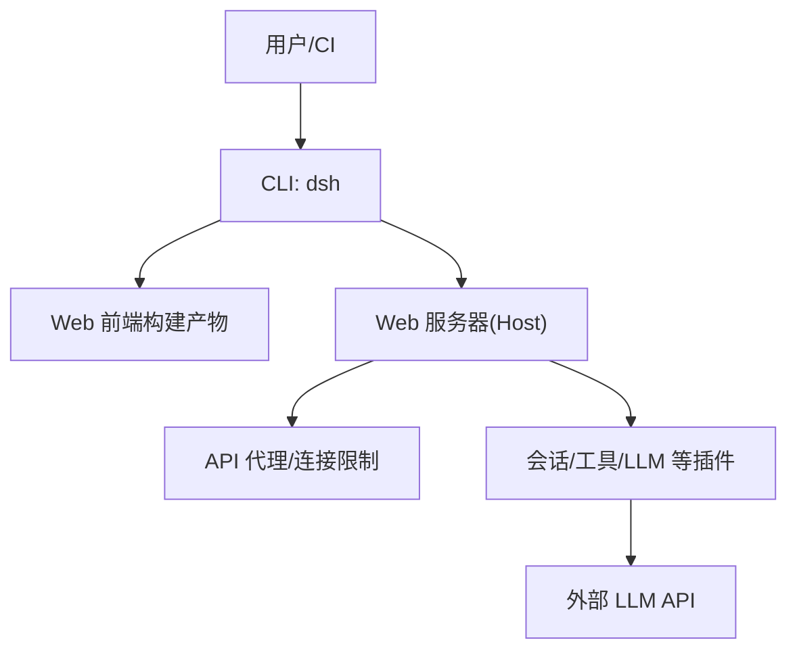
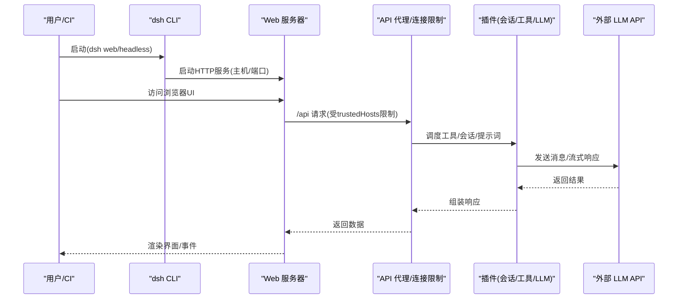
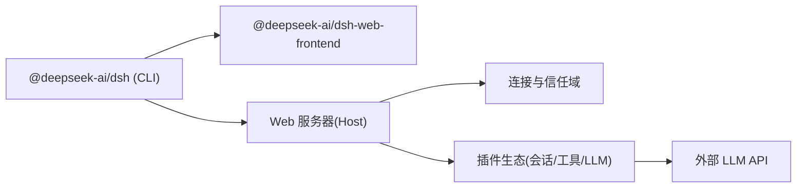

# 部署选项

<cite>
**本文引用的文件**
- [README.md](file://README.md)
- [package.json](file://package.json)
- [apps/cli/package.json](file://apps/cli/package.json)
- [apps/web/package.json](file://apps/web/package.json)
- [docs/development.md](file://docs/development.md)
- [docs/architecture.md](file://docs/architecture.md)
- [packages/host/webserver/src/index.ts](file://packages/host/webserver/src/index.ts)
- [packages/host/webserver/README.md](file://packages/host/webserver/README.md)
- [packages/client/connection/src/index.ts](file://packages/client/connection/src/index.ts)
- [packages/boot/app-boot/src/index.ts](file://packages/boot/app-boot/src/index.ts)
</cite>

## 目录
1. [简介](#简介)
2. [项目结构](#项目结构)
3. [核心组件](#核心组件)
4. [架构总览](#架构总览)
5. [详细组件分析](#详细组件分析)
6. [依赖关系分析](#依赖关系分析)
7. [性能考量](#性能考量)
8. [故障排查指南](#故障排查指南)
9. [结论](#结论)
10. [附录](#附录)

## 简介
本文件面向运维与平台工程团队，系统化说明 DeepSeek Harness（dsh）在本地开发、Docker 容器化、云原生（Kubernetes）以及生产环境的部署方式。内容涵盖适用场景、前置条件、配置参数、启动命令、环境变量、端口映射、数据卷挂载、网络与安全策略，并提供 Docker Compose 编排示例与 Kubernetes YAML 模板要点，帮助快速完成多环境交付。

## 项目结构
DeepSeek Harness 采用插件化架构，通过 Cordis 将模型适配、工具、持久化、沙箱、设置、凭据等能力以“插件”形式组合。运行时的 dsh 程序由多个 bundle/profile 层叠加而成，支持 web 与 headless 两种典型形态：
- web：提供浏览器 UI 与 HTTP 服务，适合交互式开发与演示。
- headless：无服务器的一键执行模式，适合自动化与批处理任务。

图示来源
- [README.md:13-35](file://README.md#L13-L35)
- [docs/architecture.md:15-37](file://docs/architecture.md#L15-L37)
- [apps/web/package.json:1-26](file://apps/web/package.json#L1-L26)
- [packages/host/webserver/src/index.ts:44-63](file://packages/host/webserver/src/index.ts#L44-L63)

章节来源
- [README.md:13-35](file://README.md#L13-L35)
- [docs/architecture.md:15-37](file://docs/architecture.md#L15-L37)
- [apps/web/package.json:1-26](file://apps/web/package.json#L1-L26)

## 核心组件
- CLI 入口与脚本：根 package.json 暴露了构建、测试、文档与 dsh 命令；apps/cli 定义了可执行 bin 与运行时依赖；apps/web 负责 Web 前端构建与分发。
- Web 服务器：host/webserver 提供 HTTP 监听，绑定 host/port，并支持 WebSocket 升级路由。
- 连接与信任域：client/connection 定义 trustedHosts 与请求体大小限制，用于 /api 的信任边界。
- 环境与配置加载：boot/app-boot 实现分层 .env 加载（进程继承 > 项目 .env > 用户 .env），并维护快照。

章节来源
- [package.json:19-142](file://package.json#L19-L142)
- [apps/cli/package.json:14-84](file://apps/cli/package.json#L14-L84)
- [apps/web/package.json:1-26](file://apps/web/package.json#L1-L26)
- [packages/host/webserver/src/index.ts:44-63](file://packages/host/webserver/src/index.ts#L44-L63)
- [packages/client/connection/src/index.ts:46-67](file://packages/client/connection/src/index.ts#L46-L67)
- [packages/boot/app-boot/src/index.ts:166-191](file://packages/boot/app-boot/src/index.ts#L166-L191)

## 架构总览
下图展示从 CLI 到 Web 服务、API 代理与插件生态的调用链，以及与外部 LLM 的交互。

图示来源
- [README.md:13-35](file://README.md#L13-L35)
- [packages/host/webserver/src/index.ts:44-63](file://packages/host/webserver/src/index.ts#L44-L63)
- [packages/client/connection/src/index.ts:46-67](file://packages/client/connection/src/index.ts#L46-L67)
- [docs/architecture.md:15-37](file://docs/architecture.md#L15-L37)

## 详细组件分析

### 本地开发环境部署
- 适用场景：开发者本机调试 Web UI、Headless 任务、插件与工具。
- 前置条件：Node.js 版本满足要求；启用 Corepack 并使用 pnpm；可选配置 DeepSeek API Key。
- 安装与构建：克隆仓库后执行依赖安装与构建。
- 启动命令：
  - 使用 npm 包直接运行 Web UI。
  - 源码模式下先构建再运行 dsh web。
- 环境变量：
  - DEEPSEEK_API_KEY：必需时用于真实 API 调用。
  - DEEPSEEK_BASE_URL：可选，默认公共端点。
- 端口与网络：默认在本地回环地址提供服务；如需外网访问需显式配置 host 为 0.0.0.0 并通过反向代理加固。
- 安全注意：内置 Web 服务器未包含 TLS、鉴权或源策略，非回环绑定会暴露到网络，建议在生产前加反向代理。

章节来源
- [docs/development.md:9-15](file://docs/development.md#L9-L15)
- [docs/development.md:90-99](file://docs/development.md#L90-L99)
- [README.md:13-35](file://README.md#L13-L35)
- [packages/host/webserver/README.md:19-23](file://packages/host/webserver/README.md#L19-L23)

### Docker 容器化部署
- 适用场景：隔离运行、跨机器一致性、CI/CD 流水线、临时评测与演示。
- 镜像与入口：基于 Node 运行时，安装依赖并构建 Web 前端，暴露 Web 服务端口。
- 启动命令要点：
  - 通过命令行参数指定 profile（web 或 headless）。
  - 通过环境变量注入凭据与端点。
  - 通过端口映射将容器内 Web 端口暴露给宿主机。
- 数据卷挂载：
  - 挂载工作区目录以便读写代码与资源。
  - 挂载 Harness Home 目录以持久化配置、会话与凭据。
- 网络配置：
  - 开发时可绑定 0.0.0.0 并映射端口；生产建议仅暴露必要端口并由反向代理统一出口。
- 安全加固：
  - 使用只读根文件系统（除必要目录）。
  - 限制 CPU/内存资源。
  - 通过反向代理提供 TLS 与鉴权。

（本节为通用部署实践指导，不直接引用具体源码文件）

### 云原生部署（Kubernetes）
- 适用场景：弹性伸缩、高可用、多租户隔离、与集群服务网格集成。
- 资源对象：
  - Deployment：定义副本数、镜像、环境变量、资源限制与探针。
  - Service：暴露 ClusterIP/NodePort/LoadBalancer。
  - Ingress：统一入口、TLS 终止、路径路由。
  - ConfigMap/Secret：集中管理配置与敏感信息。
  - PersistentVolumeClaim：持久化 Harness Home 与工作区（按需）。
- 关键配置项：
  - 环境变量：DEEPSEEK_API_KEY、DEEPSEEK_BASE_URL、DSH_HOME、dsh profile 与参数。
  - 端口：容器内 Web 端口映射至 Service 与 Ingress。
  - 资源限制：requests/limits 控制 CPU/内存，避免抖动。
  - 健康检查：liveness/readiness 探针确保流量只进入就绪 Pod。
  - 存储：对会话与凭据进行持久化，避免重启丢失。
- 安全策略：
  - 最小权限运行账户。
  - 网络策略限制出站访问（仅允许 LLM 域名）。
  - 通过 Ingress/TLS 与鉴权网关保护 /api。

（本节为通用 K8s 部署实践指导，不直接引用具体源码文件）

### 生产环境部署
- 适用场景：对外稳定服务、高并发、合规与审计要求。
- 部署模式：
  - 推荐以反向代理（Nginx/Ingress）作为唯一入口，后端 dsh 仅监听回环或内部网络。
  - 使用 HTTPS 与强认证（OAuth/JWT/API Key）。
  - 开启日志采集、指标上报与链路追踪。
- 配置与凭据：
  - 通过 Secret 注入密钥，避免明文与环境变量污染。
  - 使用 ConfigMap 管理非敏感配置。
  - 严格限定 trustedHosts，防止 /api 被任意 Host 访问。
- 容量规划：
  - 根据 QPS、并发会话与模型吞吐评估 CPU/内存/带宽。
  - 水平扩展 Pod，配合 HPA 自动扩缩容。
- 可观测性：
  - 结构化日志、错误告警、慢请求监控、LLM 调用耗时与失败率。

（本节为通用生产实践指导，不直接引用具体源码文件）

## 依赖关系分析
- CLI 依赖宿主与客户端插件集合，负责装配 profile/bundle 并启动 Web 或 Headless 模式。
- Web 前端独立构建，由 CLI 提供的 Web 服务器静态托管。
- Web 服务器提供 HTTP 与 WebSocket 升级能力，受连接信任域限制。
- 配置与环境加载遵循分层优先级，保证可预测性与安全性。

图示来源
- [apps/cli/package.json:14-84](file://apps/cli/package.json#L14-L84)
- [apps/web/package.json:1-26](file://apps/web/package.json#L1-L26)
- [packages/host/webserver/src/index.ts:44-63](file://packages/host/webserver/src/index.ts#L44-L63)
- [packages/client/connection/src/index.ts:46-67](file://packages/client/connection/src/index.ts#L46-L67)

章节来源
- [apps/cli/package.json:14-84](file://apps/cli/package.json#L14-L84)
- [apps/web/package.json:1-26](file://apps/web/package.json#L1-L26)
- [packages/host/webserver/src/index.ts:44-63](file://packages/host/webserver/src/index.ts#L44-L63)
- [packages/client/connection/src/index.ts:46-67](file://packages/client/connection/src/index.ts#L46-L67)

## 性能考量
- 模型侧：合理设置最大令牌、超时与重试策略，避免长尾请求拖垮服务。
- 计算资源：为 Pod/容器设置合理的 requests/limits，结合 HPA 实现弹性。
- I/O 与存储：会话与日志落盘需考虑磁盘 IO 与保留策略，避免写放大。
- 网络：限制出站域名，减少 DNS 解析与连接开销；复用连接池。
- 缓存：对静态资源与常用上下文做缓存，降低重复计算。
- 可观测：采集延迟分位、错误率与资源使用，持续优化瓶颈。

（本节为通用性能指导，不直接引用具体源码文件）

## 故障排查指南
- 无法访问 Web UI：
  - 确认端口是否被占用且已正确映射。
  - 若绑定 0.0.0.0，需通过反向代理加固。
- /api 请求被拒绝：
  - 检查 trustedHosts 是否包含当前 Host。
  - 确认请求体大小未超过限制。
- 凭据未生效：
  - 确认环境变量层级优先级：进程继承 > 项目 .env > 用户 .env。
  - 避免在 .env 中放置引导期变量。
- 启动失败：
  - 查看 Web 服务器监听失败原因（端口冲突、权限不足）。
  - 检查 Node 版本与依赖安装是否完整。

章节来源
- [packages/host/webserver/src/index.ts:44-63](file://packages/host/webserver/src/index.ts#L44-L63)
- [packages/client/connection/src/index.ts:46-67](file://packages/client/connection/src/index.ts#L46-L67)
- [packages/boot/app-boot/src/index.ts:166-191](file://packages/boot/app-boot/src/index.ts#L166-L191)
- [packages/host/webserver/README.md:19-23](file://packages/host/webserver/README.md#L19-L23)

## 结论
DeepSeek Harness 提供了灵活的插件化架构与多种运行模式，适合从本地开发到生产全生命周期。通过合理的容器化与云原生编排、严格的网络与安全策略、完善的可观测性与容量规划，可在不同环境中稳定高效地交付 AI Agent 能力。建议在生产环境始终通过反向代理与鉴权网关保护服务，并结合监控告警持续优化。

## 附录

### 环境变量与配置要点
- 必需/可选：
  - DEEPSEEK_API_KEY：调用真实模型时必需。
  - DEEPSEEK_BASE_URL：可选，默认公共端点。
- 配置层级（非凭据）：
  - 本次运行显式参数 > 操作级覆盖/CLI 参数 > 用户设置 > 组合配置 > 进程环境 > 发现的文件 .env > 默认值。
- 凭据层级：
  - 进程继承环境（只读优先） > $DSH_HOME/.credentials.yaml > 项目 .env > 用户 .env。

章节来源
- [docs/development.md:90-99](file://docs/development.md#L90-L99)
- [packages/boot/app-boot/src/index.ts:166-191](file://packages/boot/app-boot/src/index.ts#L166-L191)

### 端口与网络
- Web 服务器：
  - host：支持 127.0.0.1 与 0.0.0.0。
  - port：指定端口或 0 表示系统分配。
- 连接信任域：
  - trustedHosts：声明非回环可达的主机名或 host:port，/api 仅信任这些来源。
  - maxRequestBodyBytes：限制请求体大小。

章节来源
- [packages/host/webserver/src/index.ts:44-63](file://packages/host/webserver/src/index.ts#L44-L63)
- [packages/client/connection/src/index.ts:46-67](file://packages/client/connection/src/index.ts#L46-L67)

### Docker Compose 编排示例（要点）
- 服务定义：
  - 镜像：基于 Node 的 dsh 镜像。
  - 命令：dsh web 或 dsh --profile headless。
  - 环境变量：DEEPSEEK_API_KEY、DEEPSEEK_BASE_URL、DSH_HOME。
  - 端口映射：容器 Web 端口映射到宿主机。
  - 数据卷：挂载工作区与 $DSH_HOME。
  - 资源限制：CPU/内存上限。
- 安全建议：
  - 仅暴露必要端口。
  - 使用反向代理提供 TLS 与鉴权。

（本节为通用编排实践指导，不直接引用具体源码文件）

### Kubernetes YAML 模板要点（要点）
- Deployment：
  - replicas：按负载设定。
  - containers：镜像、命令、环境变量、资源限制、探针。
- Service：
  - type：ClusterIP/NodePort/LoadBalancer。
  - ports：映射容器 Web 端口。
- Ingress：
  - hosts/path：统一入口与 TLS。
- ConfigMap/Secret：
  - 非敏感配置与密钥分离。
- PVC：
  - 持久化 $DSH_HOME 与工作区（按需）。

（本节为通用 K8s 模板指导，不直接引用具体源码文件）

### 启动命令速查
- 使用 npm 包运行 Web UI：参考 README 中的 npx 命令。
- 源码模式：
  - 安装依赖与构建后，运行 dsh web。
- Headless 模式：
  - 通过 dsh --profile headless 执行一次性任务。

章节来源
- [README.md:13-35](file://README.md#L13-L35)
- [docs/development.md:127-151](file://docs/development.md#L127-L151)