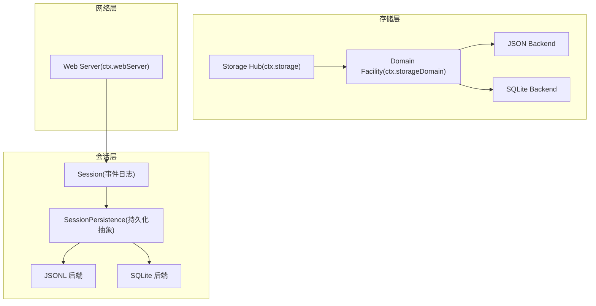
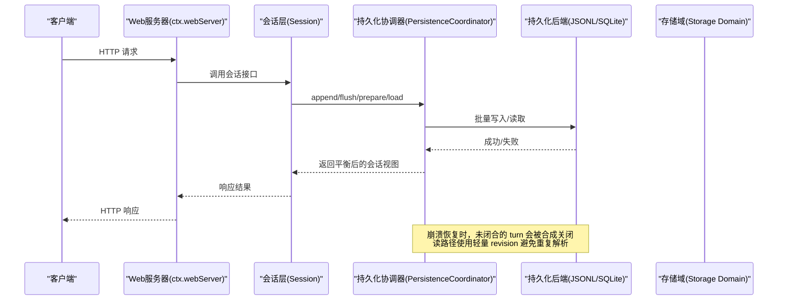
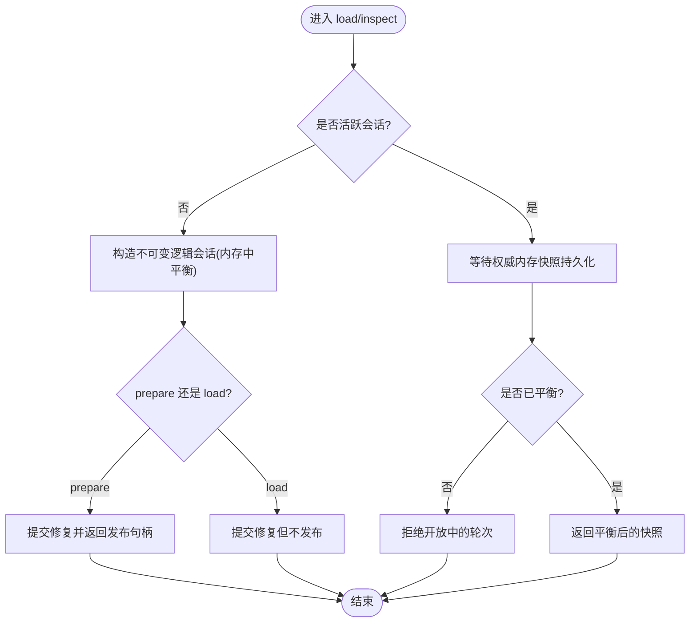
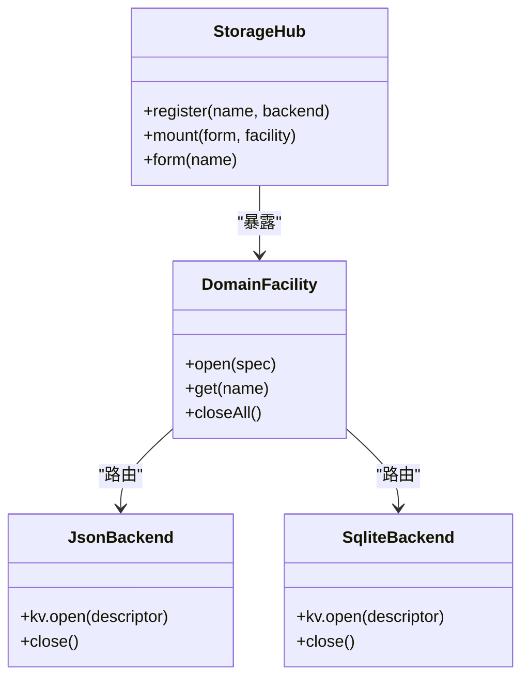
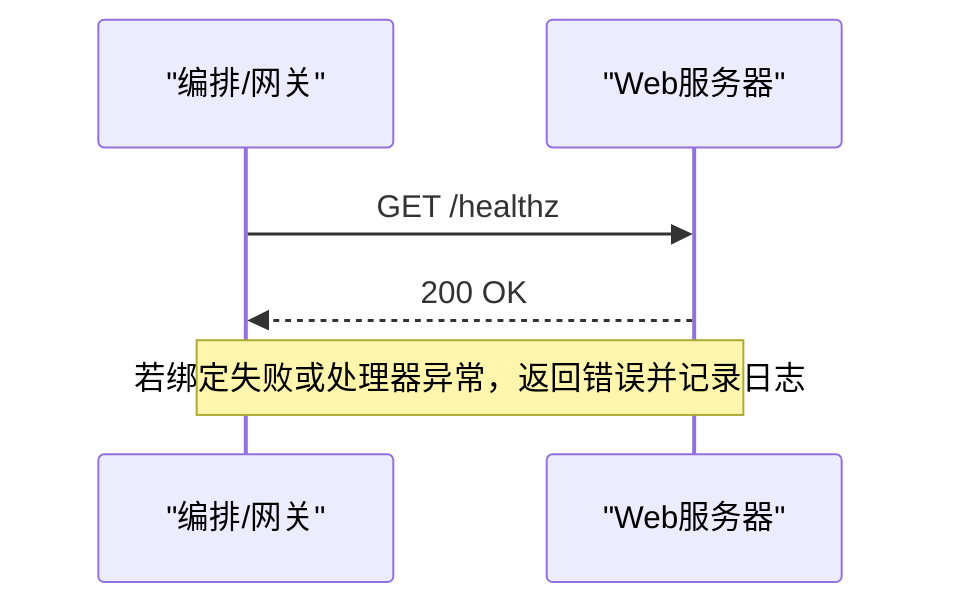
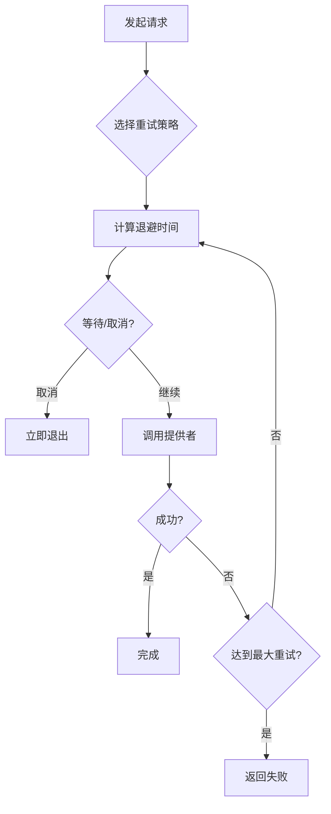
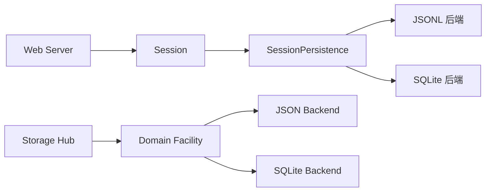

# 高可用性和灾难恢复

<cite>
**本文引用的文件**
- [packages/session/session-persistence/README.zh.md](file://packages/session/session-persistence/README.zh.md)
- [packages/session-query/session-query-sqlite/src/index.ts](file://packages/session-query/session-query-sqlite/src/index.ts)
- [packages/session/session-persistence/tests/persistence.spec.ts](file://packages/session/session-persistence/tests/persistence.spec.ts)
- [docs/subsystems/persistence.md](file://docs/subsystems/persistence.md)
- [docs/subsystems/storage.md](file://docs/subsystems/storage.md)
- [packages/storage/storage-json/README.md](file://packages/storage/storage-json/README.md)
- [packages/storage/storage-sqlite/README.md](file://packages/storage/storage-sqlite/README.md)
- [docs/subsystems/session.md](file://docs/subsystems/session.md)
- [packages/host/webserver/README.md](file://packages/host/webserver/README.md)
- [docs/subsystems/web-server.md](file://docs/subsystems/web-server.md)
- [packages/llm/llm-retry/src/index.ts](file://packages/llm/llm-retry/src/index.ts)
- [packages/llm/llm/src/retry-policy.ts](file://packages/llm/llm/src/retry-policy.ts)
- [packages/api/gateway/tests/gateway.host.spec.ts](file://packages/api/gateway/tests/gateway.host.spec.ts)
</cite>

## 目录
1. [简介](#简介)
2. [项目结构](#项目结构)
3. [核心组件](#核心组件)
4. [架构总览](#架构总览)
5. [详细组件分析](#详细组件分析)
6. [依赖关系分析](#依赖关系分析)
7. [性能考量](#性能考量)
8. [故障排查指南](#故障排查指南)
9. [结论](#结论)
10. [附录](#附录)

## 简介
本文件面向生产部署与运维，围绕 DeepSeek Harness 的高可用性与灾难恢复能力进行系统化说明。内容覆盖多实例部署、负载均衡与健康检查、数据持久化与备份恢复、会话状态同步、故障转移与自动重启、集群最佳实践（节点通信、数据分片与复制）、灾难恢复计划（数据丢失恢复、服务中断恢复、业务连续性保障）、监控告警与自动修复机制，以及演练计划与回滚策略。文档同时提供可操作的配置示例与故障模拟测试方法，帮助团队在紧急情况下快速恢复服务。

## 项目结构
DeepSeek Harness 将“会话事件日志”的持久化与“非会话领域数据”的存储解耦为两个独立子系统：
- 会话持久化：以 append-only 的事件日志为核心，提供崩溃恢复、冷/热路径一致性保证与轻量级快照。
- 通用存储：通过 hub + backend 抽象，提供 JSON 文件与 SQLite 两种后端，用于工作区、设置、缓存等非会话数据。

图表来源
- [docs/subsystems/persistence.md:1-386](file://docs/subsystems/persistence.md#L1-L386)
- [docs/subsystems/storage.md:1-230](file://docs/subsystems/storage.md#L1-L230)
- [docs/subsystems/web-server.md:1-109](file://docs/subsystems/web-server.md#L1-L109)

章节来源
- [docs/subsystems/persistence.md:1-386](file://docs/subsystems/persistence.md#L1-L386)
- [docs/subsystems/storage.md:1-230](file://docs/subsystems/storage.md#L1-L230)
- [docs/subsystems/web-server.md:1-109](file://docs/subsystems/web-server.md#L1-L109)

## 核心组件
- 会话与事件日志：以不可变、append-only 的 SessionEvent 序列作为唯一事实源；消息历史由日志派生，不单独存储。
- 持久化协调器：负责批写入、flush 检查点、崩溃恢复（合成中断边界）、冷/热路径一致性、准备与发布生命周期。
- 存储域与后端：通过 ctx.storage 注册后端，ctx.storageDomain 打开声明式领域，支持 JSON 与 SQLite 两种介质。
- Web 服务器：提供 HTTP 路由与升级通道，用于前端静态资源、API 桥接与 SSE/HMR 等。

章节来源
- [docs/subsystems/session.md:1-800](file://docs/subsystems/session.md#L1-L800)
- [docs/subsystems/persistence.md:1-386](file://docs/subsystems/persistence.md#L1-L386)
- [docs/subsystems/storage.md:1-230](file://docs/subsystems/storage.md#L1-L230)
- [docs/subsystems/web-server.md:1-109](file://docs/subsystems/web-server.md#L1-L109)

## 架构总览
下图展示一次请求从 Web 入口到会话处理、持久化落盘与读取的完整链路，并体现健康检查、重试与恢复的关键点。

图表来源
- [docs/subsystems/web-server.md:1-109](file://docs/subsystems/web-server.md#L1-L109)
- [docs/subsystems/persistence.md:1-386](file://docs/subsystems/persistence.md#L1-L386)
- [packages/session-query/session-query-sqlite/src/index.ts:214-228](file://packages/session-query/session-query-sqlite/src/index.ts#L214-L228)

## 详细组件分析

### 会话持久化与崩溃恢复
- 批写入与 flush 检查点：首次待写事件启动固定批窗口，后续事件加入而不重置截止时间；session/flush 取消等待并排空，确保顺序与错误观察点。
- 崩溃恢复：加载日志发现未闭合的 turn/start 时，不会截断，而是合成一个 turn/end{kind:'interrupted'}，保持执行平衡且不改变已提交事件。
- 冷/热路径：对活跃 id，load 会等待权威内存快照完成持久化并在平衡后返回；对冷 id，inspect 构造不可变逻辑会话但不发布，prepare 提交修复并返回可释放的发布句柄。
- 格式拒绝：版本不兼容或未知必需事件类型会拒绝加载，明确提示升级方向或无法迁移。

图表来源
- [docs/subsystems/persistence.md:1-386](file://docs/subsystems/persistence.md#L1-L386)
- [packages/session/session-persistence/README.zh.md:38-38](file://packages/session/session-persistence/README.zh.md#L38-L38)

章节来源
- [docs/subsystems/persistence.md:1-386](file://docs/subsystems/persistence.md#L1-L386)
- [packages/session/session-persistence/README.zh.md:38-38](file://packages/session/session-persistence/README.zh.md#L38-L38)
- [packages/session/session-persistence/tests/persistence.spec.ts:399-1004](file://packages/session/session-persistence/tests/persistence.spec.ts#L399-L1004)

### 存储域与后端（JSON/SQLite）
- 存储 Hub：ctx.storage 仅做路由与挂载，不直接 IO；后端拥有介质，消费者通过 domain 层访问。
- 领域声明：定义 name/version/tables/global，open 时校验版本、表名、记录 schema，失败即抛错。
- JSON 后端：每 unit 一个可读 JSON 文件，原子替换（temp-write + fsync + rename），适合人类可读与单进程场景。
- SQLite 后端：每行一文档，单库存储高频更新数据；每个写操作为单条 prepared statement，满足 KV 原子性；默认 WAL 模式。

图表来源
- [docs/subsystems/storage.md:1-230](file://docs/subsystems/storage.md#L1-L230)
- [packages/storage/storage-json/README.md:1-39](file://packages/storage/storage-json/README.md#L1-L39)
- [packages/storage/storage-sqlite/README.md:1-44](file://packages/storage/storage-sqlite/README.md#L1-L44)

章节来源
- [docs/subsystems/storage.md:1-230](file://docs/subsystems/storage.md#L1-L230)
- [packages/storage/storage-json/README.md:1-39](file://packages/storage/storage-json/README.md#L1-L39)
- [packages/storage/storage-sqlite/README.md:1-44](file://packages/storage/storage-sqlite/README.md#L1-L44)

### Web 服务器与健康检查
- Web 服务器：提供 named route 注册、fallback 处理、index.html 变换与端口探测；监听失败会拒绝初始化。
- 健康检查建议：在网关或编排层对 /healthz 或 API 桥接端点进行 TCP/HTTP 探针；由于内置服务器无 TLS/鉴权，生产应前置反向代理。
- 连接清理：处置时关闭所有连接，防止挂起。

图表来源
- [docs/subsystems/web-server.md:1-109](file://docs/subsystems/web-server.md#L1-L109)
- [packages/host/webserver/README.md:1-23](file://packages/host/webserver/README.md#L1-L23)

章节来源
- [docs/subsystems/web-server.md:1-109](file://docs/subsystems/web-server.md#L1-L109)
- [packages/host/webserver/README.md:1-23](file://packages/host/webserver/README.md#L1-L23)

### 重试与容错（LLM 请求）
- 重试策略：支持 normal/unbounded 模式，含退避、抖动与最大重试次数；配置校验严格，避免非法参数。
- 异步控制：使用 AbortSignal 管理延迟与取消，避免泄漏定时器。
- 网关取消：当调用被取消时，业务错误被视为客户端断开而非内部故障。

图表来源
- [packages/llm/llm/src/retry-policy.ts:123-156](file://packages/llm/llm/src/retry-policy.ts#L123-L156)
- [packages/llm/llm-retry/src/index.ts:78-109](file://packages/llm/llm-retry/src/index.ts#L78-L109)
- [packages/api/gateway/tests/gateway.host.spec.ts:1027-1047](file://packages/api/gateway/tests/gateway.host.spec.ts#L1027-L1047)

章节来源
- [packages/llm/llm/src/retry-policy.ts:123-156](file://packages/llm/llm/src/retry-policy.ts#L123-L156)
- [packages/llm/llm-retry/src/index.ts:78-109](file://packages/llm/llm-retry/src/index.ts#L78-L109)
- [packages/api/gateway/tests/gateway.host.spec.ts:1027-1047](file://packages/api/gateway/tests/gateway.host.spec.ts#L1027-L1047)

## 依赖关系分析
- 会话层依赖持久化抽象，具体实现可选择 JSONL 或 SQLite；两者均遵循同一契约并通过共享测试套件验证。
- 存储域通过路由决定使用 JSON 或 SQLite 后端；domain 层对读写顺序和原子性有明确要求。
- Web 服务器与上层插件解耦，仅负责路由与连接生命周期。

图表来源
- [docs/subsystems/persistence.md:1-386](file://docs/subsystems/persistence.md#L1-L386)
- [docs/subsystems/storage.md:1-230](file://docs/subsystems/storage.md#L1-L230)
- [docs/subsystems/web-server.md:1-109](file://docs/subsystems/web-server.md#L1-L109)

章节来源
- [docs/subsystems/persistence.md:1-386](file://docs/subsystems/persistence.md#L1-L386)
- [docs/subsystems/storage.md:1-230](file://docs/subsystems/storage.md#L1-L230)
- [docs/subsystems/web-server.md:1-109](file://docs/subsystems/web-server.md#L1-L109)

## 性能考量
- 批写入与 flush：通过固定批窗口与 session/flush 检查点降低 I/O 频率，提高吞吐。
- 轻量 revision：SQLite 查询使用全局/本地 generation 与 tail 队列，减少重复解析与锁竞争。
- 后端选择：JSON 后端适合可读性与单进程；SQLite 适合高频更新与并发读。
- 重试与退避：合理配置 initialDelayMs、maxDelayMs、jitterRatio，避免雪崩与风暴。

章节来源
- [docs/subsystems/persistence.md:1-386](file://docs/subsystems/persistence.md#L1-L386)
- [packages/session-query/session-query-sqlite/src/index.ts:214-228](file://packages/session-query/session-query-sqlite/src/index.ts#L214-L228)
- [packages/storage/storage-json/README.md:1-39](file://packages/storage/storage-json/README.md#L1-L39)
- [packages/storage/storage-sqlite/README.md:1-44](file://packages/storage/storage-sqlite/README.md#L1-L44)
- [packages/llm/llm/src/retry-policy.ts:123-156](file://packages/llm/llm/src/retry-policy.ts#L123-L156)

## 故障排查指南
- 会话崩溃恢复：确认是否存在未闭合的 turn；检查 inspect/prepare 行为是否符合预期；关注 rejected stored identity 与 format refusal。
- 存储后端问题：JSON 后端检查文件原子替换与权限；SQLite 后端检查 journal_mode 与版本匹配。
- Web 服务器：监听失败、路由冲突、异常请求处理；确认 fallback 与 index 变换是否正确。
- 重试与取消：检查重试策略配置、AbortSignal 使用、网关取消语义。

章节来源
- [packages/session/session-persistence/tests/persistence.spec.ts:399-1004](file://packages/session/session-persistence/tests/persistence.spec.ts#L399-L1004)
- [packages/storage/storage-json/README.md:1-39](file://packages/storage/storage-json/README.md#L1-L39)
- [packages/storage/storage-sqlite/README.md:1-44](file://packages/storage/storage-sqlite/README.md#L1-L44)
- [docs/subsystems/web-server.md:1-109](file://docs/subsystems/web-server.md#L1-L109)
- [packages/api/gateway/tests/gateway.host.spec.ts:1027-1047](file://packages/api/gateway/tests/gateway.host.spec.ts#L1027-L1047)

## 结论
DeepSeek Harness 通过事件溯源、可插拔持久化后端与解耦的网络层，提供了稳健的高可用基础。配合合理的批写入、flush 检查点、崩溃恢复、重试策略与外部编排的健康检查，可在多实例环境中实现故障转移与自动恢复。生产部署建议前置反向代理、启用 WAL 与合适的存储后端，并建立完善的监控、演练与回滚流程。

## 附录

### 多实例部署与负载均衡
- 多实例：每个进程维护独立的会话与存储介质；通过外部负载均衡分发请求。
- 健康检查：在网关层对 /healthz 或 API 桥接端点进行 TCP/HTTP 探针；失败实例剔除。
- 会话亲和：如需会话内状态一致，可使用 sticky session 或基于会话 ID 的路由。

### 数据持久化策略与备份恢复
- 会话日志：JSONL 或 SQLite 存储；定期快照与增量备份；恢复时使用 prepare/load 路径进行一致性重建。
- 领域数据：JSON 文件按 unit 备份；SQLite 数据库整体备份；注意版本与 schema 一致性。
- 一致性保证：append-only 与 seq 连续性；format version 拒绝未知版本；SQLite 使用 PRAGMA user_version 保护。

### 会话状态同步、故障转移与自动重启
- 状态同步：通过外部存储（如共享文件系统或数据库）实现跨进程共享；或使用事件总线广播变更。
- 故障转移：健康检查失败时切换流量；新实例通过持久化恢复会话。
- 自动重启：编排系统检测进程退出并重启；结合幂等初始化与恢复逻辑。

### 集群最佳实践
- 节点间通信：使用可靠的消息队列或 RPC；避免强耦合。
- 数据分片：按会话 ID 或用户 ID 分片；保证热点均匀。
- 复制策略：主从或多主复制；注意冲突解决与一致性模型。

### 灾难恢复计划
- 数据丢失恢复：从最近快照恢复；应用增量日志；验证一致性。
- 服务中断恢复：快速切换备用实例；回滚到稳定版本。
- 业务连续性：降级策略（只读、限流）；关键路径优先恢复。

### 监控告警与自动修复
- 指标：QPS、延迟、错误率、I/O 吞吐、重试次数、批大小。
- 告警：阈值触发；通知渠道（邮件、短信、IM）。
- 自动修复：健康检查失败重启；容量不足扩容；重试策略动态调整。

### 演练计划与回滚策略
- 演练：定期模拟节点故障、磁盘损坏、网络分区；验证恢复流程。
- 回滚：灰度发布；快速回滚到上一版本；数据迁移可逆。
- 测试方法：注入故障（超时、丢包、OOM）；验证系统自愈与降级。

### 配置示例与故障模拟
- Web 服务器：host/port 配置；健康检查端点。
- 存储后端：JSON root 路径；SQLite path/journal_mode。
- 重试策略：initialDelayMs、maxDelayMs、jitterRatio、maxRetries。
- 故障模拟：使用测试工具注入错误；观察恢复行为。

章节来源
- [docs/subsystems/web-server.md:1-109](file://docs/subsystems/web-server.md#L1-L109)
- [docs/subsystems/storage.md:1-230](file://docs/subsystems/storage.md#L1-L230)
- [packages/storage/storage-json/README.md:1-39](file://packages/storage/storage-json/README.md#L1-L39)
- [packages/storage/storage-sqlite/README.md:1-44](file://packages/storage/storage-sqlite/README.md#L1-L44)
- [packages/llm/llm/src/retry-policy.ts:123-156](file://packages/llm/llm/src/retry-policy.ts#L123-L156)
- [packages/llm/llm-retry/src/index.ts:78-109](file://packages/llm/llm-retry/src/index.ts#L78-L109)