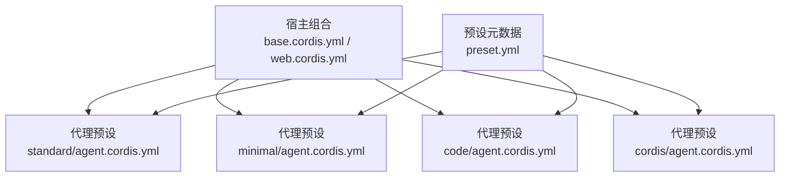
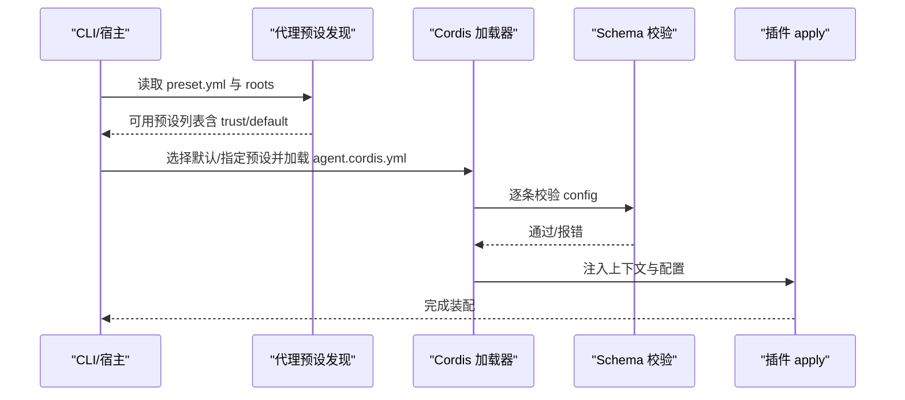
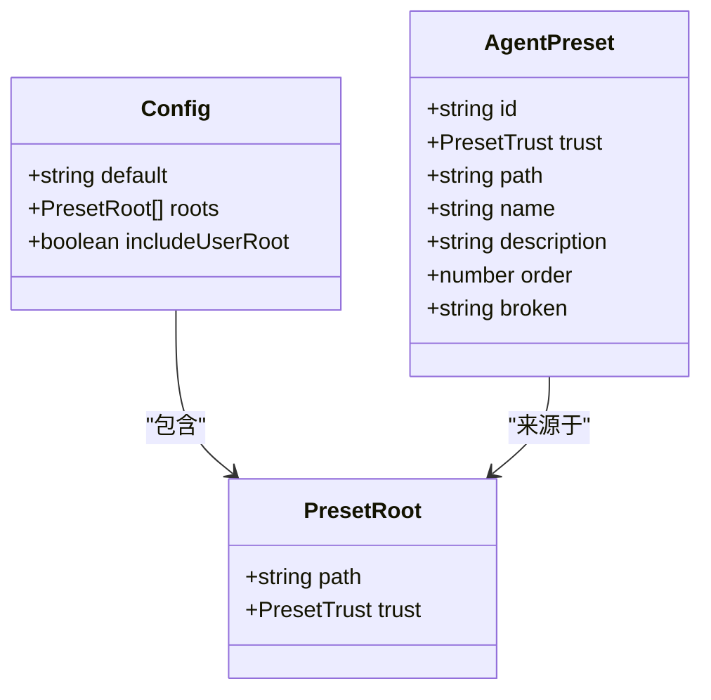
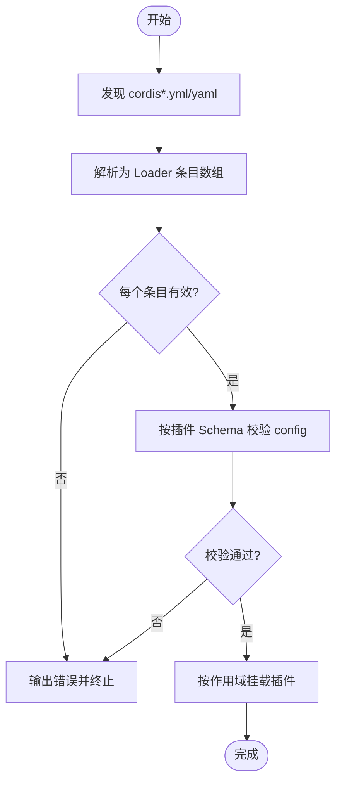
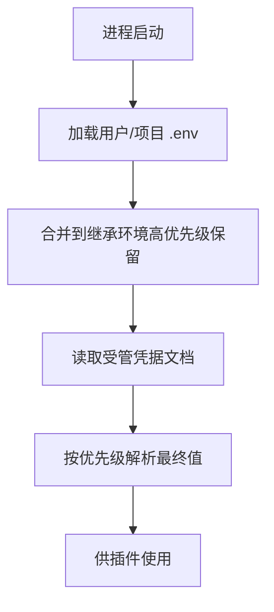
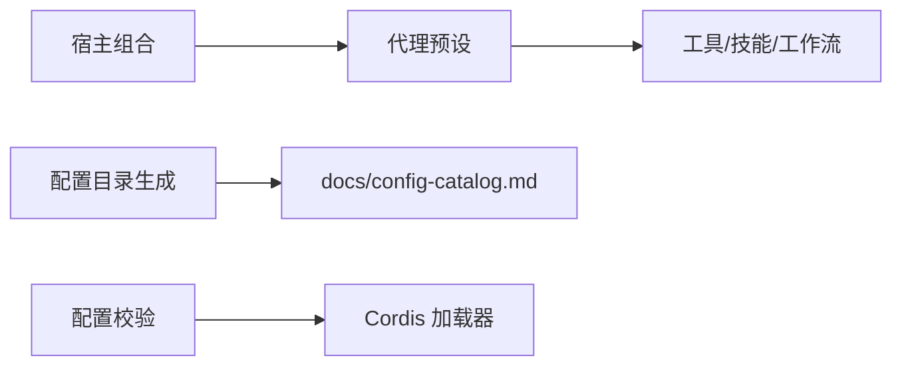

# 配置管理

<cite>
**本文引用的文件**
- [apps/cli/config/agent-presets/standard/preset.yml](file://apps/cli/config/agent-presets/standard/preset.yml)
- [apps/cli/config/agent-presets/minimal/preset.yml](file://apps/cli/config/agent-presets/minimal/preset.yml)
- [apps/cli/config/agent-presets/code/preset.yml](file://apps/cli/config/agent-presets/code/preset.yml)
- [apps/cli/config/agent-presets/cordis/preset.yml](file://apps/cli/config/agent-presets/cordis/preset.yml)
- [apps/cli/config/agent-presets/standard/agent.cordis.yml](file://apps/cli/config/agent-presets/standard/agent.cordis.yml)
- [packages/preset/agent-presets/src/preset.ts](file://packages/preset/agent-presets/src/preset.ts)
- [scripts/cordis-config-files.ts](file://scripts/cordis-config-files.ts)
- [scripts/verify-cordis-config.ts](file://scripts/verify-cordis-config.ts)
- [scripts/gen-config-catalog.ts](file://scripts/gen-config-catalog.ts)
- [docs/config-catalog.md](file://docs/config-catalog.md)
- [docs/cordis-tutorial/05-config.zh.md](file://docs/cordis-tutorial/05-config.zh.md)
- [packages/settings/settings/src/redact.ts](file://packages/settings/settings/src/redact.ts)
- [scripts/verify-config-source-ownership.ts](file://scripts/verify-config-source-ownership.ts)
- [packages/shell/shell-env/tests/shell-env.spec.ts](file://packages/shell/shell-env/tests/shell-env.spec.ts)
</cite>

## 目录
1. [简介](#简介)
2. [项目结构](#项目结构)
3. [核心组件](#核心组件)
4. [架构总览](#架构总览)
5. [详细组件分析](#详细组件分析)
6. [依赖关系分析](#依赖关系分析)
7. [性能考量](#性能考量)
8. [故障排查指南](#故障排查指南)
9. [结论](#结论)
10. [附录：配置目录参考与示例](#附录配置目录参考与示例)

## 简介
本文件面向系统管理员与开发者，系统化说明 DeepSeek Harness 的配置管理机制，包括：
- 配置文件格式（Cordis Loader YAML、插件配置 Schema）
- 环境变量与凭据层（用户级、项目级、继承环境）
- 动态配置机制（热重载、运行时合并）
- 配置验证、继承与合并策略
- 代理预设（标准、最小化、自定义）的配置方法
- 最佳实践、常见错误诊断与解决
- 完整配置项参考与场景示例

## 项目结构
DeepSeek Harness 的配置由“宿主组合 + 代理预设”两层构成：
- 宿主组合：负责注册全局服务（工具、沙箱、持久化、模型路由等），通常位于应用或主机侧。
- 代理预设：以 agent.cordis.yml 描述一个可复用的 Agent 能力集合（工具、提示词、工作流等），通过 preset 元数据暴露给选择器。

图表来源
- [apps/cli/config/agent-presets/standard/agent.cordis.yml:1-20](file://apps/cli/config/agent-presets/standard/agent.cordis.yml#L1-L20)
- [apps/cli/config/agent-presets/standard/preset.yml:1-4](file://apps/cli/config/agent-presets/standard/preset.yml#L1-L4)

章节来源
- [apps/cli/config/agent-presets/standard/agent.cordis.yml:1-20](file://apps/cli/config/agent-presets/standard/agent.cordis.yml#L1-L20)
- [scripts/cordis-config-files.ts:1-19](file://scripts/cordis-config-files.ts#L1-L19)

## 核心组件
- 代理预设发现与挂载
  - 预设根目录扫描、信任级别（system/user）、默认预设选择、用户根目录可选追加。
  - 关键类型与错误：PresetRoot、AgentPreset、UnknownPresetError、PresetMountError。
- Cordis 配置加载与校验
  - 自动发现 cordis*.yml/yaml；对每个条目进行 schema 校验，失败即停止加载并给出精确错误。
- 配置目录生成与一致性保障
  - 从源码声明自动生成配置目录文档，并与运行时 schema 交叉校验。
- 凭据与环境变量
  - 禁止在已分发配置中内联凭据/端点；凭据通过受管文档与环境分层解析。
- Shell 环境变量注册冲突检测
  - 重复变量所有权在注册时拒绝，避免覆盖歧义。

章节来源
- [packages/preset/agent-presets/src/preset.ts:1-94](file://packages/preset/agent-presets/src/preset.ts#L1-L94)
- [scripts/verify-cordis-config.ts:69-99](file://scripts/verify-cordis-config.ts#L69-L99)
- [scripts/gen-config-catalog.ts:463-491](file://scripts/gen-config-catalog.ts#L463-L491)
- [scripts/verify-config-source-ownership.ts:25-56](file://scripts/verify-config-source-ownership.ts#L25-L56)
- [packages/shell/shell-env/tests/shell-env.spec.ts:96-118](file://packages/shell/shell-env/tests/shell-env.spec.ts#L96-L118)

## 架构总览
下图展示“宿主组合 + 代理预设”的装配流程，以及配置加载、验证与合并的关键路径。

图表来源
- [packages/preset/agent-presets/src/preset.ts:51-62](file://packages/preset/agent-presets/src/preset.ts#L51-L62)
- [scripts/verify-cordis-config.ts:72-99](file://scripts/verify-cordis-config.ts#L72-L99)
- [docs/cordis-tutorial/05-config.zh.md:1-66](file://docs/cordis-tutorial/05-config.zh.md#L1-L66)

## 详细组件分析

### 代理预设（标准/最小化/自定义）
- 预设元数据
  - name/description/order 用于 UI 展示与排序。
- 预设组合
  - standard/agent.cordis.yml 定义完整的编码 Agent 能力（Shell、FS、Skills、Goals、Compaction、Subagent/Workflow 等）。
  - minimal 提供极简双工具模式（bash + str_replace_editor）。
  - code/cordis 分别提供 Code Mode SDK 呈现与创作/实验能力。
- 信任与范围
  - system 预设随部署发布；user 预设来自本地，具备更高信任等级。
  - includeUserRoot 控制是否将用户预设目录追加到扫描根。

图表来源
- [packages/preset/agent-presets/src/preset.ts:20-62](file://packages/preset/agent-presets/src/preset.ts#L20-L62)

章节来源
- [apps/cli/config/agent-presets/standard/preset.yml:1-4](file://apps/cli/config/agent-presets/standard/preset.yml#L1-L4)
- [apps/cli/config/agent-presets/minimal/preset.yml:1-4](file://apps/cli/config/agent-presets/minimal/preset.yml#L1-L4)
- [apps/cli/config/agent-presets/code/preset.yml:1-4](file://apps/cli/config/agent-presets/code/preset.yml#L1-L4)
- [apps/cli/config/agent-presets/cordis/preset.yml:1-4](file://apps/cli/config/agent-presets/cordis/preset.yml#L1-L4)
- [apps/cli/config/agent-presets/standard/agent.cordis.yml:1-252](file://apps/cli/config/agent-presets/standard/agent.cordis.yml#L1-L252)
- [packages/preset/agent-presets/src/preset.ts:1-94](file://packages/preset/agent-presets/src/preset.ts#L1-L94)

### 配置加载、验证与合并
- 配置发现
  - 自动扫描仓库中的 cordis*.yml/yaml（排除翻译侧车与 vendor/node_modules）。
- 加载与校验
  - 每个 Loader 条目必须为数组；config 块按插件声明的 Schema 校验，错误会立即中止加载并报告具体路径。
- 合并策略
  - 宿主组合先于预设加载；预设内部通过 group/isolate 控制作用域与服务可见性。
  - 插件配置通过 Schema 默认值补齐，apply 接收完整配置。

图表来源
- [scripts/cordis-config-files.ts:1-19](file://scripts/cordis-config-files.ts#L1-L19)
- [scripts/verify-cordis-config.ts:72-99](file://scripts/verify-cordis-config.ts#L72-L99)
- [docs/cordis-tutorial/05-config.zh.md:1-66](file://docs/cordis-tutorial/05-config.zh.md#L1-L66)

章节来源
- [scripts/cordis-config-files.ts:1-19](file://scripts/cordis-config-files.ts#L1-L19)
- [scripts/verify-cordis-config.ts:69-99](file://scripts/verify-cordis-config.ts#L69-L99)
- [docs/cordis-tutorial/05-config.zh.md:1-66](file://docs/cordis-tutorial/05-config.zh.md#L1-L66)

### 环境变量与凭据层
- 环境变量分层
  - 用户级 .env < 项目级 .env < 继承环境（进程启动前已存在的环境优先）。
  - 仅产品 CLI 会叠加这些文件；SDK/示例二进制保持各自加载逻辑，避免误用开发者的 $DSH_HOME。
- 凭据管理
  - 凭据通过受管文档集中管理，禁止在已分发配置中直接内联凭据/端点。
  - 设置优先级：继承环境（只读覆盖）> 受管文档 > 项目/用户 .env（可写回退）。
- 敏感信息脱敏
  - 配置导出/日志中，标记为 secret 的字段会被脱敏处理。

图表来源
- [scripts/verify-config-source-ownership.ts:25-56](file://scripts/verify-config-source-ownership.ts#L25-L56)
- [packages/settings/settings/src/redact.ts:50-83](file://packages/settings/settings/src/redact.ts#L50-L83)

章节来源
- [scripts/verify-config-source-ownership.ts:25-56](file://scripts/verify-config-source-ownership.ts#L25-L56)
- [packages/settings/settings/src/redact.ts:50-83](file://packages/settings/settings/src/redact.ts#L50-L83)

### 动态配置与热重载
- 配置热更新
  - 部分组件支持监听配置变更并在运行期重新发布（如凭据文档 watcher）。
- 作用域隔离
  - 通过 group/isolate 控制服务可见性与生命周期，避免跨会话/跨预设污染。

章节来源
- [apps/cli/config/agent-presets/standard/agent.cordis.yml:100-156](file://apps/cli/config/agent-presets/standard/agent.cordis.yml#L100-L156)

## 依赖关系分析
- 预设与宿主
  - 宿主组合注册全局能力（工具、沙箱、持久化、模型路由）；预设仅注册模型可见的工具与提示词片段。
- 配置目录生成
  - 通过脚本从源码声明生成 docs/config-catalog.md，确保运行时 schema 与声明一致。
- 校验与约束
  - verify-cordis-config 检查 Loader 元数据与包解析；gen-config-catalog 保证配置目录与实现同步。

图表来源
- [scripts/gen-config-catalog.ts:463-491](file://scripts/gen-config-catalog.ts#L463-L491)
- [scripts/verify-cordis-config.ts:72-99](file://scripts/verify-cordis-config.ts#L72-L99)

章节来源
- [scripts/gen-config-catalog.ts:463-491](file://scripts/gen-config-catalog.ts#L463-L491)
- [scripts/verify-cordis-config.ts:69-99](file://scripts/verify-cordis-config.ts#L69-L99)

## 性能考量
- 并发与超时
  - 工具调用并发上限、命令执行超时、内存与堆限制等均可配置，避免资源争用与长时间阻塞。
- 压缩与存储
  - 会话导出压缩级别、JSONL 压缩策略可按需调整，平衡 CPU/延迟与体积。
- 工作区上下文
  - 指令文件加载有字节预算限制，防止过大上下文影响模型输入与响应时间。

章节来源
- [docs/config-catalog.md:135-165](file://docs/config-catalog.md#L135-L165)
- [docs/config-catalog.md:431-466](file://docs/config-catalog.md#L431-L466)
- [docs/config-catalog.md:724-756](file://docs/config-catalog.md#L724-L756)

## 故障排查指南
- 配置无效导致加载失败
  - 现象：启动时报错，指出具体字段类型不匹配。
  - 原因：cordis.yml 的 config 未满足插件 Schema。
  - 处理：对照 docs/config-catalog.md 修正字段类型与必填项。
- 预设不存在或无法挂载
  - 现象：UnknownPresetError 或 PresetMountError。
  - 原因：未找到预设 ID，或预设组合不完整/损坏。
  - 处理：确认 roots 与 includeUserRoot 配置；修复 preset 组合文件。
- 环境变量覆盖异常
  - 现象：凭据未按预期生效。
  - 原因：继承环境覆盖了低优先级 .env；或在已分发配置中内联了凭据。
  - 处理：将凭据放入受管文档；避免在 shipped 配置中内联。
- Shell 环境变量冲突
  - 现象：注册阶段抛出重复变量所有权错误。
  - 原因：多个模块声明了同一变量名。
  - 处理：统一变量命名与归属，避免重复注册。

章节来源
- [docs/cordis-tutorial/05-config.zh.md:53-66](file://docs/cordis-tutorial/05-config.zh.md#L53-L66)
- [packages/preset/agent-presets/src/preset.ts:64-94](file://packages/preset/agent-presets/src/preset.ts#L64-L94)
- [scripts/verify-config-source-ownership.ts:25-56](file://scripts/verify-config-source-ownership.ts#L25-L56)
- [packages/shell/shell-env/tests/shell-env.spec.ts:96-118](file://packages/shell/shell-env/tests/shell-env.spec.ts#L96-L118)

## 结论
DeepSeek Harness 通过“宿主组合 + 代理预设”的分层设计，结合严格的 Schema 校验、清晰的环境/凭据分层与作用域隔离，提供了安全、可复用且易于扩展的配置体系。遵循本文的最佳实践与排障建议，可快速搭建稳定可靠的 Agent 运行环境。

## 附录：配置目录参考与示例

### 配置目录参考（节选）
以下为常用插件配置的要点（详见 docs/config-catalog.md 对应章节）：
- @deepseek-ai/dsh-agent-loop
  - maxParallelToolCalls：每步最大并行工具调用数；agents：启动时创建/恢复的 Agent 列表。
- @deepseek-ai/dsh-agent-instructions
  - dshHome、projectRootMarkers、maxBytes、maxSourceBytes、instructionFileCandidates、localInstructionFileCandidates。
- @deepseek-ai/dsp-bash-local
  - cwd、timeoutMs、maxTimeoutMs、maxOutputBytes、maxSpillBytes、graceMs。
- @deepseek-ai/dsh-compaction-basic
  - thresholdRatio、retainRatio/retainTokens、summarizationProvider/Model、maxTokens、compactionRetries、maxOverflowRetries。
- @deepseek-ai/dsh-credentials-local
  - path、dshHome、watch、debounceMs。
- @deepseek-ai/dsh-host-webserver
  - host、port。
- @deepseek-ai/dsh-client-connection
  - trustedHosts、maxRequestBodyBytes。

章节来源
- [docs/config-catalog.md:105-165](file://docs/config-catalog.md#L105-L165)
- [docs/config-catalog.md:343-388](file://docs/config-catalog.md#L343-L388)
- [docs/config-catalog.md:468-512](file://docs/config-catalog.md#L468-L512)
- [docs/config-catalog.md:550-568](file://docs/config-catalog.md#L550-L568)
- [docs/config-catalog.md:788-800](file://docs/config-catalog.md#L788-L800)
- [docs/config-catalog.md:390-413](file://docs/config-catalog.md#L390-L413)

### 代理预设配置方法
- 标准模式（standard）
  - 启用完整编码能力：Shell、文件系统、Skills、计划、目标、子代理与工作流、压缩等。
  - 参考：standard/agent.cordis.yml 中的各工具与分组配置。
- 最小化模式（minimal）
  - 仅提供持久 bash 与编辑器工具，适合轻量任务。
- 自定义预设
  - 基于标准/最小化复制，按需启用/禁用工具与功能；通过 preset.yml 设置 name/description/order。
  - 将用户预设目录加入 roots，并通过 includeUserRoot 启用用户根扫描。

章节来源
- [apps/cli/config/agent-presets/standard/agent.cordis.yml:1-252](file://apps/cli/config/agent-presets/standard/agent.cordis.yml#L1-L252)
- [apps/cli/config/agent-presets/minimal/preset.yml:1-4](file://apps/cli/config/agent-presets/minimal/preset.yml#L1-L4)
- [apps/cli/config/agent-presets/code/preset.yml:1-4](file://apps/cli/config/agent-presets/code/preset.yml#L1-L4)
- [apps/cli/config/agent-presets/cordis/preset.yml:1-4](file://apps/cli/config/agent-presets/cordis/preset.yml#L1-L4)
- [packages/preset/agent-presets/src/preset.ts:51-62](file://packages/preset/agent-presets/src/preset.ts#L51-L62)

### 配置最佳实践
- 使用 Schema 默认值与必填项约束，避免半配置启动。
- 将凭据放入受管文档，不在 shipped 配置中内联。
- 合理设置并发、超时与内存限制，避免资源耗尽。
- 使用 group/isolate 明确作用域，避免跨会话/跨预设污染。
- 通过 includeUserRoot 与 roots 组织多套预设，便于团队共享与个人定制。

### 常见错误与解决
- 配置类型错误：根据校验错误定位字段并修正类型。
- 预设未找到：检查 default/roots/includeUserRoot 与预设目录命名规范。
- 环境变量覆盖：确认继承环境优先级，必要时调整 .env 顺序。
- Shell 变量冲突：统一变量命名，避免重复注册。

### 场景示例（路径指引）
- 完整编码 Agent：standard/agent.cordis.yml
- 极简编码 Agent：minimal/preset.yml（配合宿主组合）
- 代码模式呈现：code/preset.yml（结合宿主提供的 Code Mode 能力）
- 创作/实验环境：cordis/preset.yml（启用运行时检查与插件实验）

章节来源
- [apps/cli/config/agent-presets/standard/agent.cordis.yml:1-252](file://apps/cli/config/agent-presets/standard/agent.cordis.yml#L1-L252)
- [apps/cli/config/agent-presets/minimal/preset.yml:1-4](file://apps/cli/config/agent-presets/minimal/preset.yml#L1-L4)
- [apps/cli/config/agent-presets/code/preset.yml:1-4](file://apps/cli/config/agent-presets/code/preset.yml#L1-L4)
- [apps/cli/config/agent-presets/cordis/preset.yml:1-4](file://apps/cli/config/agent-presets/cordis/preset.yml#L1-L4)