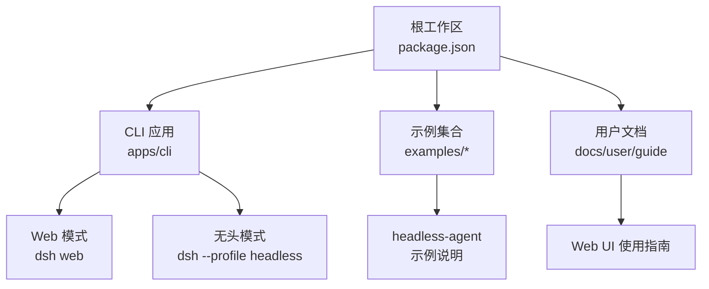
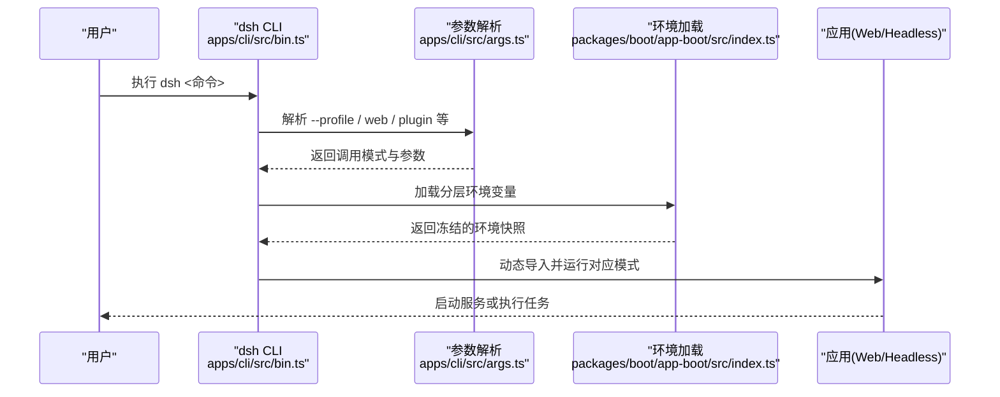
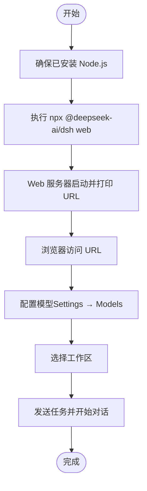
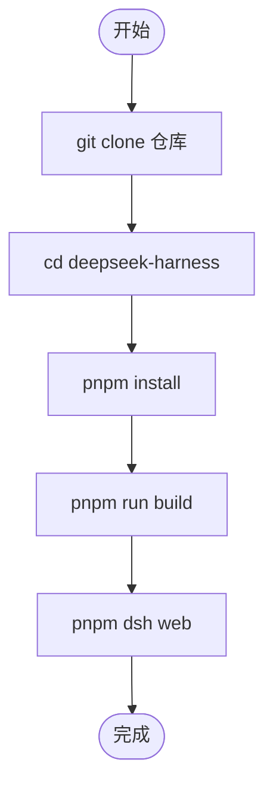
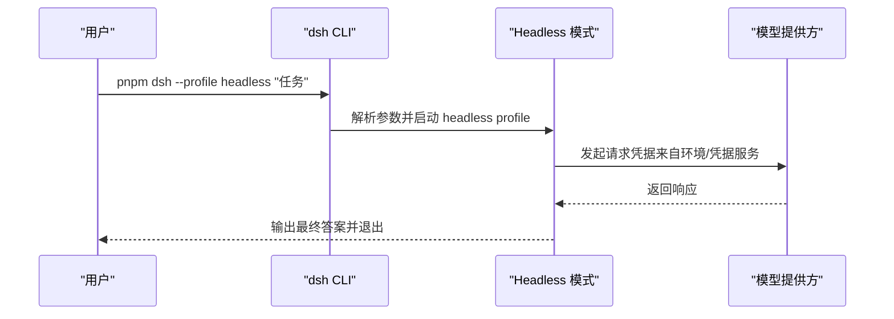
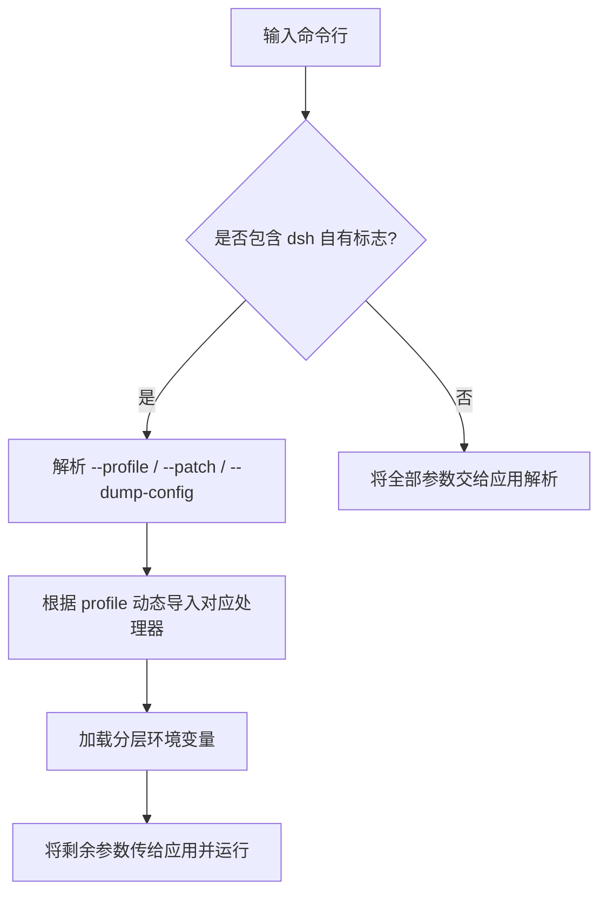
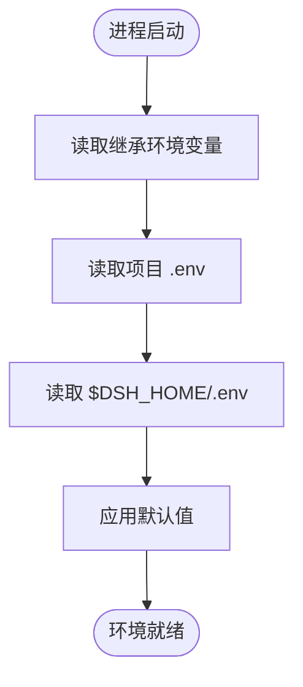
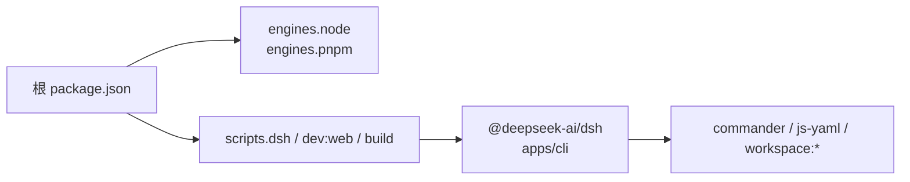

# 快速开始

<cite>
**本文引用的文件**
- [README.md](file://README.md)
- [apps/cli/README.md](file://apps/cli/README.md)
- [apps/cli/package.json](file://apps/cli/package.json)
- [package.json](file://package.json)
- [apps/cli/src/bin.ts](file://apps/cli/src/bin.ts)
- [apps/cli/src/args.ts](file://apps/cli/src/args.ts)
- [examples/headless-agent/README.md](file://examples/headless-agent/README.md)
- [docs/user/guide/index.md](file://docs/user/guide/index.md)
- [packages/boot/app-boot/src/index.ts](file://packages/boot/app-boot/src/index.ts)
</cite>

## 目录
1. [简介](#简介)
2. [项目结构](#项目结构)
3. [核心组件](#核心组件)
4. [架构总览](#架构总览)
5. [详细组件分析](#详细组件分析)
6. [依赖分析](#依赖分析)
7. [性能注意事项](#性能注意事项)
8. [故障排查指南](#故障排查指南)
9. [结论](#结论)
10. [附录](#附录)

## 简介
本指南面向首次接触 DeepSeek Harness（dsh）的用户，目标是在 5 分钟内成功运行第一个 Agent。你将学会：
- 环境要求与依赖安装
- 通过 npm 直接运行 Web UI
- 从源码构建并运行
- 使用 CLI 的无头模式执行一次性任务
- 基本配置与常见问题处理

## 项目结构
仓库采用多包工作区组织，关键入口包括：
- 根脚本与命令：根 package.json 提供统一脚本，如 dsh、dev:web 等
- CLI 应用：apps/cli 提供 dsh 命令行，支持 web、headless、plugin 等模式
- 示例：examples 包含 headless-agent、acp-agent 等可运行示例
- 用户文档：docs/user/guide 提供 Web UI 使用指南

**图表来源**
- [package.json:19-142](file://package.json#L19-L142)
- [apps/cli/README.md:7-43](file://apps/cli/README.md#L7-L43)
- [examples/headless-agent/README.md:7-16](file://examples/headless-agent/README.md#L7-L16)
- [docs/user/guide/index.md:1-11](file://docs/user/guide/index.md#L1-L11)

**章节来源**
- [package.json:1-183](file://package.json#L1-L183)
- [apps/cli/README.md:1-48](file://apps/cli/README.md#L1-L48)
- [examples/headless-agent/README.md:1-33](file://examples/headless-agent/README.md#L1-L33)
- [docs/user/guide/index.md:1-31](file://docs/user/guide/index.md#L1-L31)

## 核心组件
- dsh CLI：统一的启动器，负责解析参数、选择 profile 并转发给具体应用（web、headless 等）
- Web UI：浏览器端交互界面，用于会话编排、模型配置与工具调用
- Headless 模式：非交互式执行单次任务，输出最终结果后退出
- 配置与环境：通过 layered environment 加载 .env 与设置，支持凭据管理

**章节来源**
- [apps/cli/src/bin.ts:1-54](file://apps/cli/src/bin.ts#L1-L54)
- [apps/cli/src/args.ts:1-192](file://apps/cli/src/args.ts#L1-L192)
- [docs/user/guide/index.md:1-31](file://docs/user/guide/index.md#L1-L31)
- [packages/boot/app-boot/src/index.ts:166-191](file://packages/boot/app-boot/src/index.ts#L166-L191)

## 架构总览
下图展示了 dsh 启动流程：命令行入口解析参数，动态导入对应模式处理器，加载分层环境，并将剩余参数传递给被引导的应用。

**图表来源**
- [apps/cli/src/bin.ts:1-54](file://apps/cli/src/bin.ts#L1-L54)
- [apps/cli/src/args.ts:112-192](file://apps/cli/src/args.ts#L112-L192)
- [packages/boot/app-boot/src/index.ts:166-191](file://packages/boot/app-boot/src/index.ts#L166-L191)

## 详细组件分析

### 通过 npm 直接运行 Web UI
- 前提：已安装 Node.js
- 命令：在任意目录执行 npx @deepseek-ai/dsh web
- 行为：默认在 http://127.0.0.1:3080 启动 Web UI；若端口占用或需要自定义主机/端口，可通过 web 应用的参数调整（由 web 应用自身解析）
- 后续：打开 Settings → Models 配置模型，选择工作区后即可发送任务

**图表来源**
- [README.md:15-23](file://README.md#L15-L23)
- [docs/user/guide/index.md:1-11](file://docs/user/guide/index.md#L1-L11)

**章节来源**
- [README.md:15-23](file://README.md#L15-L23)
- [docs/user/guide/index.md:1-11](file://docs/user/guide/index.md#L1-L11)

### 从源码运行
- 克隆仓库并进入目录
- 使用 pnpm 安装依赖并构建产物
- 通过根脚本运行 dsh web

**图表来源**
- [README.md:25-35](file://README.md#L25-L35)
- [package.json:19-47](file://package.json#L19-L47)

**章节来源**
- [README.md:25-35](file://README.md#L25-L35)
- [package.json:19-47](file://package.json#L19-L47)

### 无头模式（Headless）执行一次性任务
- 适用场景：无需 Web UI，提交一个任务，得到最终答案后退出
- 命令：pnpm dsh --profile headless "你的任务描述"
- 行为：创建并持久化一个全新会话，输出最终助手文本，然后退出进程
- 提示：可在根 .env 或通过导出环境变量提供 API Key 与可选 Base URL

**图表来源**
- [examples/headless-agent/README.md:7-16](file://examples/headless-agent/README.md#L7-L16)
- [apps/cli/README.md:7-16](file://apps/cli/README.md#L7-L16)

**章节来源**
- [examples/headless-agent/README.md:7-16](file://examples/headless-agent/README.md#L7-L16)
- [apps/cli/README.md:7-16](file://apps/cli/README.md#L7-L16)

### CLI 参数与模式概览
- 常用模式
  - dsh web：等同于 --profile web，启动 Web UI
  - dsh --profile headless "任务"：执行一次性任务
  - dsh plugin --profile <name> ...：在 profile 中管理插件（转发到 pnpm）
- 参数优先级
  - 先解析 dsh 自身的标志（--profile、--patch、--dump-config 等）
  - 其余参数原样传递给被引导的应用（例如 web 应用的 --host、--port）

**图表来源**
- [apps/cli/src/args.ts:112-192](file://apps/cli/src/args.ts#L112-L192)
- [apps/cli/src/bin.ts:27-53](file://apps/cli/src/bin.ts#L27-L53)

**章节来源**
- [apps/cli/src/args.ts:112-192](file://apps/cli/src/args.ts#L112-L192)
- [apps/cli/src/bin.ts:27-53](file://apps/cli/src/bin.ts#L27-L53)

### 配置与环境变量
- 分层环境加载顺序（简化）
  - 继承自父进程的环境变量
  - 当前工作目录下的 .env
  - $DSH_HOME/.env
  - 默认值
- 凭据优先于普通配置，且受凭据服务管理；非凭据配置遵循“显式 > 用户设置 > 组合 > 环境 > 发现的文件 > 默认”的顺序
- 建议：在根 .env 或导出环境变量中设置 DEEPSEEK_API_KEY；如需自定义 Base URL，可按需设置相应变量

**图表来源**
- [packages/boot/app-boot/src/index.ts:166-191](file://packages/boot/app-boot/src/index.ts#L166-L191)

**章节来源**
- [packages/boot/app-boot/src/index.ts:166-191](file://packages/boot/app-boot/src/index.ts#L166-L191)

## 依赖分析
- 运行时要求
  - Node.js：^22.19.0 或 >=24.0.0
  - pnpm：11.7.0（由 packageManager 指定）
- 主要依赖
  - CLI 依赖 commander、js-yaml 等
  - 工作区内部依赖众多 dsh-* 包，构成 Web、Headless、工具链等能力

**图表来源**
- [package.json:7-10](file://package.json#L7-L10)
- [package.json:19-142](file://package.json#L19-L142)
- [apps/cli/package.json:22-84](file://apps/cli/package.json#L22-L84)

**章节来源**
- [package.json:7-10](file://package.json#L7-L10)
- [package.json:19-142](file://package.json#L19-L142)
- [apps/cli/package.json:22-84](file://apps/cli/package.json#L22-L84)

## 性能注意事项
- 首次启动会加载分层环境与插件树，建议在开发时复用同一工作区以减少冷启动开销
- 无头模式适合批量任务与 CI 集成，避免 GUI 渲染开销
- 合理配置模型与工具（如压缩、搜索超时）可降低请求与 I/O 压力

[本节为通用指导，不直接分析具体文件]

## 故障排查指南
- 无法启动 Web UI
  - 检查 Node.js 版本是否符合要求
  - 确认端口未被占用；必要时通过 web 应用参数调整主机与端口
- 模型不可用或认证失败
  - 在 Settings → Models 中保存 API Key，或通过环境变量提供
  - 检查凭据服务与 .env 中的密钥是否正确加载
- 无头模式报错
  - 确认已设置 DEEPSEEK_API_KEY（以及可选的 Base URL）
  - 使用 dsh --profile headless 仅接受单条非空任务

**章节来源**
- [docs/user/guide/index.md:7-11](file://docs/user/guide/index.md#L7-L11)
- [examples/headless-agent/README.md:7-16](file://examples/headless-agent/README.md#L7-L16)

## 结论
通过以上步骤，你可以在 5 分钟内完成以下目标：
- 使用 npx 直接运行 Web UI 并配置模型与工作区
- 从源码构建并运行 dsh
- 使用无头模式执行一次性任务
- 理解分层配置与环境变量的基本用法
遇到问题时，参考故障排查部分进行定位与解决。

## 附录

### 环境要求与依赖安装
- Node.js：^22.19.0 或 >=24.0.0
- pnpm：11.7.0（工作区自动管理）
- 安装与构建
  - 克隆仓库并进入目录
  - pnpm install
  - pnpm run build（源码运行时需要）

**章节来源**
- [package.json:7-10](file://package.json#L7-L10)
- [README.md:25-35](file://README.md#L25-L35)

### 基本命令参考
- 通过 npm 运行 Web UI：npx @deepseek-ai/dsh web
- 从源码运行：pnpm dsh web
- 无头模式：pnpm dsh --profile headless "任务"
- 查看帮助：dsh --help；web 应用帮助：dsh web --help

**章节来源**
- [README.md:15-35](file://README.md#L15-L35)
- [apps/cli/README.md:7-28](file://apps/cli/README.md#L7-L28)
- [apps/cli/src/args.ts:63-72](file://apps/cli/src/args.ts#L63-L72)

### 简单配置示例
- 根 .env（示例字段名）
  - DEEPSEEK_API_KEY=sk-...
  - DEEPSEEK_BASE_URL=https://...（可选）
- 在 Web UI 中也可通过 Settings → Models 保存密钥，无需重启服务

**章节来源**
- [examples/headless-agent/README.md:7-16](file://examples/headless-agent/README.md#L7-L16)
- [docs/user/guide/index.md:7-11](file://docs/user/guide/index.md#L7-L11)