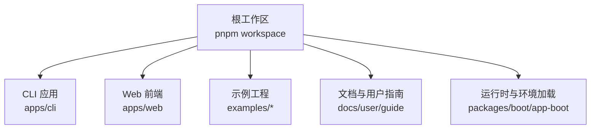
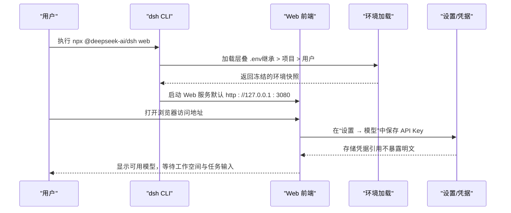
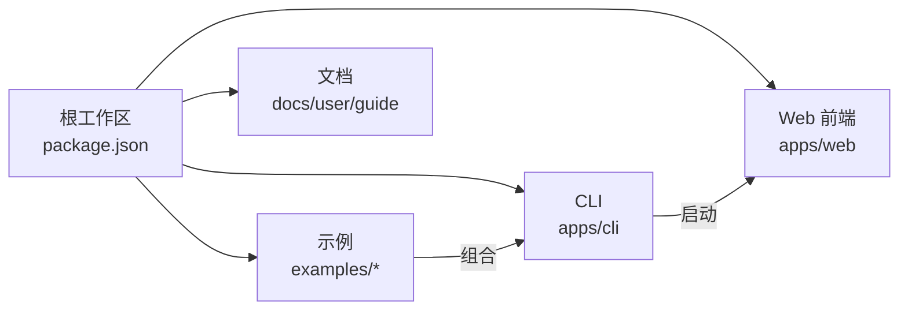

# 快速开始

<cite>
**本文引用的文件**
- [README.md](file://README.md)
- [package.json](file://package.json)
- [apps/cli/README.md](file://apps/cli/README.md)
- [apps/web/package.json](file://apps/web/package.json)
- [examples/README.md](file://examples/README.md)
- [examples/acp-agent/README.md](file://examples/acp-agent/README.md)
- [examples/headless-agent/README.md](file://examples/headless-agent/README.md)
- [examples/acp-agent/cordis.yml](file://examples/acp-agent/cordis.yml)
- [apps/cli/config/agent-presets/minimal/agent.cordis.yml](file://apps/cli/config/agent-presets/minimal/agent.cordis.yml)
- [docs/user/guide/index.md](file://docs/user/guide/index.md)
- [docs/user/guide/providers.md](file://docs/user/guide/providers.md)
- [packages/boot/app-boot/src/index.ts](file://packages/boot/app-boot/src/index.ts)
</cite>

## 目录
1. [简介](#简介)
2. [项目结构](#项目结构)
3. [核心组件](#核心组件)
4. [架构总览](#架构总览)
5. [详细组件分析](#详细组件分析)
6. [依赖分析](#依赖分析)
7. [性能注意事项](#性能注意事项)
8. [故障排除指南](#故障排除指南)
9. [结论](#结论)
10. [附录](#附录)

## 简介
本指南面向首次接触 DeepSeek Harness（简称 dsh）的新手，目标是帮助你在最短时间内完成安装、启动 Web UI、创建第一个 Agent，并体验文本对话、代码执行与文件操作等常见场景。项目采用“一切皆插件”的架构，基于 Cordis 进行组合式扩展，支持通过 npm 包直接运行 Web UI，也支持从源码构建与开发。

## 项目结构
仓库采用多包工作区组织，关键入口包括：
- CLI 命令行工具：提供 web、headless 等模式
- Web 前端：Vite 构建的 React 应用，由 CLI 的 web 模式提供服务
- 示例工程：展示不同使用方式（ACP、Headless、Web 叠加等）
- 配置与预设：内置最小化、标准等 Agent 预设，便于快速上手

图表来源
- [package.json:1-18](file://package.json#L1-L18)
- [apps/cli/README.md:1-48](file://apps/cli/README.md#L1-L48)
- [apps/web/package.json:1-52](file://apps/web/package.json#L1-L52)

章节来源
- [package.json:1-18](file://package.json#L1-L18)
- [apps/cli/README.md:1-48](file://apps/cli/README.md#L1-L48)
- [apps/web/package.json:1-52](file://apps/web/package.json#L1-L52)

## 核心组件
- CLI 启动器：解析命令与参数，选择并启动对应 Profile（如 web、headless），将剩余参数转发给具体应用
- Web UI：默认监听本地端口，提供模型配置、工作空间选择、会话编排与审批策略可视化
- 环境加载：按优先级合并继承环境变量、项目 .env、用户目录 .env，确保凭据与开关安全注入
- 示例与预设：提供最小化 Agent 预设与多种示例，覆盖自动化、无头任务、Web 叠加等场景

章节来源
- [apps/cli/README.md:1-48](file://apps/cli/README.md#L1-L48)
- [docs/user/guide/index.md:1-31](file://docs/user/guide/index.md#L1-L31)
- [packages/boot/app-boot/src/index.ts:166-191](file://packages/boot/app-boot/src/index.ts#L166-L191)

## 架构总览
下图展示了从命令行到 Web UI 的核心调用链，以及模型配置与凭据加载的关键路径。

图表来源
- [README.md:15-35](file://README.md#L15-L35)
- [apps/cli/README.md:1-48](file://apps/cli/README.md#L1-L48)
- [docs/user/guide/index.md:1-31](file://docs/user/guide/index.md#L1-L31)
- [docs/user/guide/providers.md:1-99](file://docs/user/guide/providers.md#L1-L99)
- [packages/boot/app-boot/src/index.ts:166-191](file://packages/boot/app-boot/src/index.ts#L166-L191)

## 详细组件分析

### 安装与环境要求
- Node.js 版本要求：^22.19.0 或 >=24.0.0
- 包管理器：pnpm（工作区管理）
- 快速启动：通过 npm 直接运行 Web UI
- 从源码构建：克隆仓库后安装依赖、构建并启动

步骤
1) 安装 Node.js（满足版本要求）
2) 通过 npm 运行 Web UI：npx @deepseek-ai/dsh web
3) 从源码运行：
   - git clone 仓库
   - pnpm install
   - pnpm run build
   - pnpm dsh web

章节来源
- [package.json:8-10](file://package.json#L8-L10)
- [README.md:15-35](file://README.md#L15-L35)

### 通过 npm 包快速启动 Web UI
- 命令：npx @deepseek-ai/dsh web
- 默认地址：http://127.0.0.1:3080
- 后续操作：在“设置 → 模型”中添加 API Key；选择工作空间；发送任务

章节来源
- [README.md:15-23](file://README.md#L15-L23)
- [docs/user/guide/index.md:1-31](file://docs/user/guide/index.md#L1-L31)

### 从源代码构建和运行
- 工作区脚本：根 package.json 提供 build、dsh 等脚本
- 前端构建：apps/web 使用 Vite 构建产物，由 CLI 的 web 模式提供服务

章节来源
- [package.json:19-25](file://package.json#L19-L25)
- [apps/web/package.json:22-26](file://apps/web/package.json#L22-L26)

### 第一个 Agent：最小化预设与基础配置
- 使用内置 minimal 预设：包含固定提示词、持久化 Bash 终端、字符串替换编辑器等能力
- 配置文件结构要点：
  - persona：定义系统提示词与行为
  - terminal/bash：提供命令执行能力
  - fs-local/editor：提供文件系统与编辑能力
- 你可以基于该预设快速体验“文本对话 + 代码执行 + 文件操作”

章节来源
- [apps/cli/config/agent-presets/minimal/agent.cordis.yml:1-63](file://apps/cli/config/agent-presets/minimal/agent.cordis.yml#L1-L63)

### 常用选项与典型场景演示
- 文本对话：在 Web UI 中选择模型与工作空间，直接输入问题即可
- 代码执行：通过 Bash 工具在沙箱内运行命令（超时、权限策略受控）
- 文件操作：通过文件系统工具读取/编辑工作区文件（遵循沙箱策略）
- 自动化与无头模式：参考 headless-agent 与 acp-agent 示例，适合程序化集成

章节来源
- [examples/README.md:1-30](file://examples/README.md#L1-L30)
- [examples/headless-agent/README.md:1-33](file://examples/headless-agent/README.md#L1-L33)
- [examples/acp-agent/README.md:1-25](file://examples/acp-agent/README.md#L1-L25)
- [examples/acp-agent/cordis.yml:1-193](file://examples/acp-agent/cordis.yml#L1-L193)

### 模型配置与凭据管理
- 在“设置 → 模型”页面添加提供方与 API Key
- 密钥以只写方式存储，settings 仅保留凭据引用
- 自定义提供方需填写 Provider ID、基础 URL、API 协议、凭据与至少一个模型
- 图片输入需在 settings.yaml 中为模型声明 input 模态

章节来源
- [docs/user/guide/providers.md:1-99](file://docs/user/guide/providers.md#L1-L99)

### 环境加载与优先级
- 层叠顺序：继承环境变量 > 项目 .env > 用户目录 .env
- 启动时校验并合并，避免污染进程环境；对引导变量有严格限制
- 凭据优先于普通环境变量，保证安全性

章节来源
- [packages/boot/app-boot/src/index.ts:166-191](file://packages/boot/app-boot/src/index.ts#L166-L191)

## 依赖分析
- 工作区依赖：根 package.json 定义了 workspaces，涵盖 packages、apps、native、website 等子模块
- CLI 与 Web 解耦：CLI 负责启动与参数转发，Web 前端独立构建与发布
- 示例与预设：通过 cordis 配置文件组合插件能力，形成可复用的 Agent 形态

图表来源
- [package.json:1-18](file://package.json#L1-L18)
- [apps/cli/README.md:1-48](file://apps/cli/README.md#L1-L48)
- [apps/web/package.json:1-52](file://apps/web/package.json#L1-L52)

章节来源
- [package.json:1-18](file://package.json#L1-L18)

## 性能注意事项
- 上下文压缩：示例配置中包含压缩阈值与保留比例，有助于长会话控制成本
- 沙箱与权限：默认限制在 workspace-write，避免不必要的宽权限导致额外开销
- 子代理与工作流：按需启用，避免过多并发带来的资源压力
- 模型选择：根据任务复杂度选择合适的模型，平衡质量与延迟

章节来源
- [examples/acp-agent/cordis.yml:67-79](file://examples/acp-agent/cordis.yml#L67-L79)

## 故障排除指南
常见问题与解决思路
- 无法启动 Web UI
  - 检查 Node.js 版本是否符合要求
  - 确认端口未被占用（默认 3080）
- 模型请求失败
  - 检查“设置 → 模型”是否正确保存 API Key
  - 若获取可用模型返回 401，检查密钥或手动输入模型
- 图片被拒绝
  - 自定义提供方需在 settings.yaml 中为模型声明 input 包含 image
  - DeepSeek 自身 chat-completions 路由为纯文本，不可配置为图像输入
- 凭据与环境问题
  - 确认 .env 未包含引导变量（会被拒绝）
  - 层叠顺序：继承 > 项目 .env > 用户 .env，注意覆盖关系

章节来源
- [docs/user/guide/providers.md:88-99](file://docs/user/guide/providers.md#L88-L99)
- [packages/boot/app-boot/src/index.ts:166-191](file://packages/boot/app-boot/src/index.ts#L166-L191)

## 结论
通过本指南，你可以在几分钟内完成安装、启动 Web UI、配置模型并创建第一个 Agent，体验文本对话、代码执行与文件操作。建议进一步探索示例工程与预设，结合你的业务场景定制插件与流程。遇到问题时，优先检查模型配置、凭据与环境加载逻辑。

## 附录
- 快速命令速查
  - 通过 npm 启动 Web UI：npx @deepseek-ai/dsh web
  - 从源码构建并运行：git clone → pnpm install → pnpm run build → pnpm dsh web
- 推荐学习路径
  - 阅读用户指南：docs/user/guide
  - 尝试示例：examples/*
  - 了解 CLI 模式：apps/cli/README.md

章节来源
- [README.md:15-35](file://README.md#L15-L35)
- [docs/user/guide/index.md:1-31](file://docs/user/guide/index.md#L1-L31)
- [apps/cli/README.md:1-48](file://apps/cli/README.md#L1-L48)
- [examples/README.md:1-30](file://examples/README.md#L1-L30)