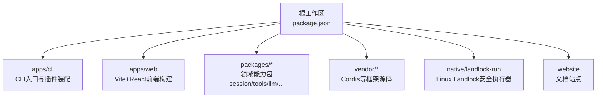
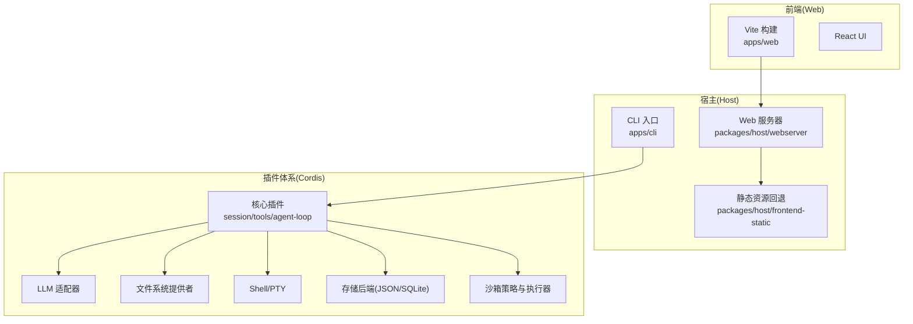
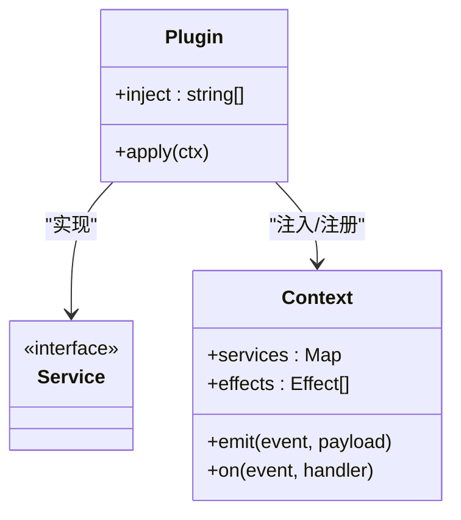
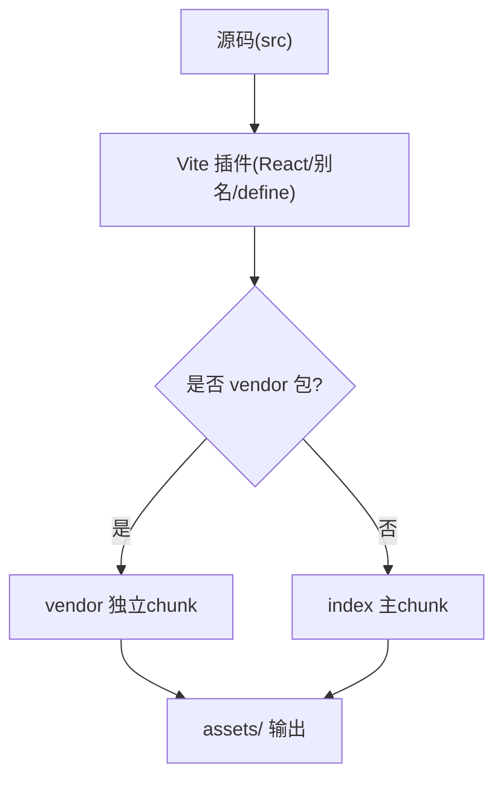
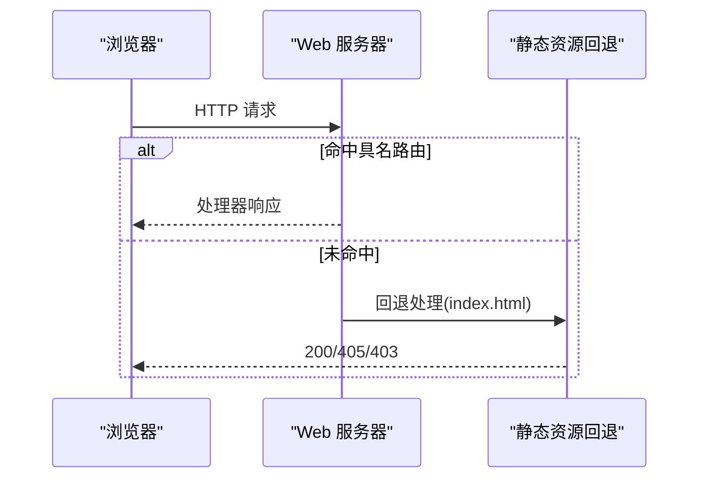
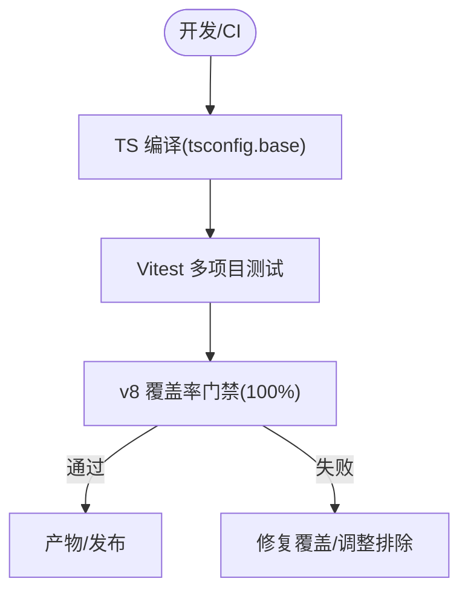
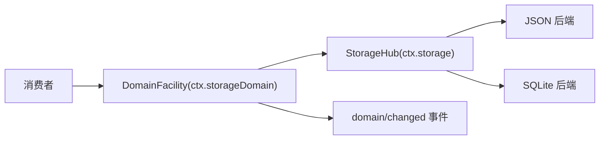
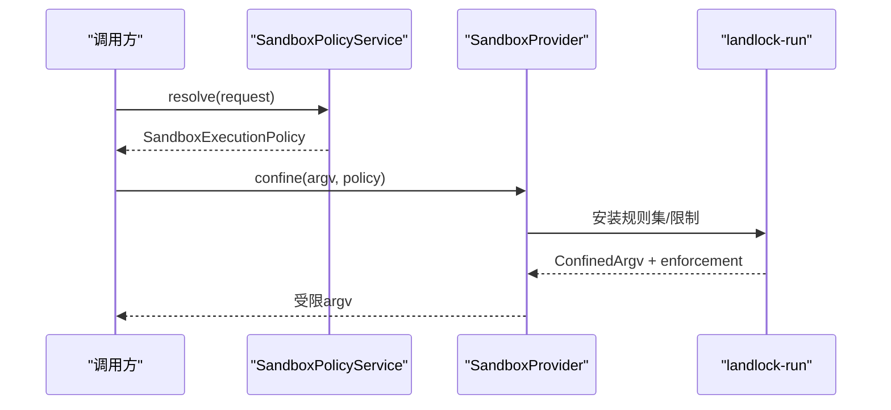
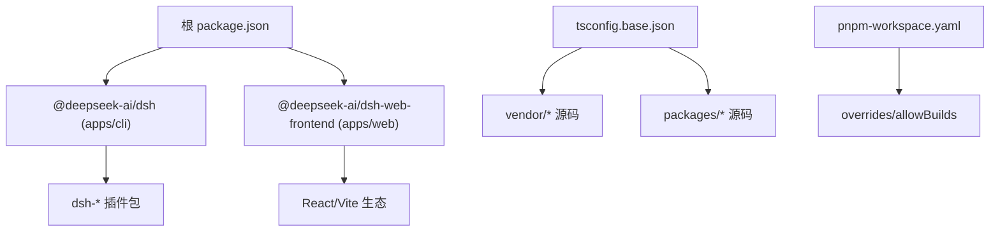

# 技术栈

<cite>
**本文引用的文件**
- [package.json](file://package.json)
- [pnpm-workspace.yaml](file://pnpm-workspace.yaml)
- [README.md](file://README.md)
- [apps/cli/package.json](file://apps/cli/package.json)
- [apps/web/package.json](file://apps/web/package.json)
- [apps/web/vite.config.ts](file://apps/web/vite.config.ts)
- [vitest.config.ts](file://vitest.config.ts)
- [tsconfig.base.json](file://tsconfig.base.json)
- [docs/architecture.md](file://docs/architecture.md)
- [docs/cordis-primer.md](file://docs/cordis-primer.md)
- [docs/subsystems/storage.md](file://docs/subsystems/storage.md)
- [docs/subsystems/sandbox.md](file://docs/subsystems/sandbox.md)
- [packages/host/webserver/src/index.ts](file://packages/host/webserver/src/index.ts)
- [packages/host/frontend-static/src/index.ts](file://packages/host/frontend-static/src/index.ts)
- [native/landlock-run/packages/entry/src/main.c](file://native/landlock-run/packages/entry/src/main.c)
</cite>

## 目录
1. [简介](#简介)
2. [项目结构](#项目结构)
3. [核心组件](#核心组件)
4. [架构总览](#架构总览)
5. [详细组件分析](#详细组件分析)
6. [依赖关系分析](#依赖关系分析)
7. [性能考量](#性能考量)
8. [故障排查指南](#故障排查指南)
9. [结论](#结论)
10. [附录](#附录)

## 简介
DeepSeek Harness（dsh）是一个以“一切皆插件”为核心理念的开源智能体运行框架，底层基于 Cordis 插件框架。它通过可组合的插件树、类型化事件与能力接缝，将模型适配、工具注册、会话日志、沙箱策略等全部解耦为可替换的插件层。前端提供 Web UI，后端由 Node.js 驱动 CLI 与宿主服务，构建与测试采用现代 TypeScript 工程化工具链。

**章节来源**
- [README.md:1-58](file://README.md#L1-L58)

## 项目结构
仓库采用 pnpm monorepo 组织，根工作区声明了 vendor、packages、apps、website、native 等子工作区，并通过 workspace 链接与 overrides 统一管理依赖版本与本地源码解析。顶层脚本统一编排构建、类型检查、测试、发布与文档生成。

**图表来源**
- [package.json:11-18](file://package.json#L11-L18)
- [pnpm-workspace.yaml:1-21](file://pnpm-workspace.yaml#L1-L21)

**章节来源**
- [package.json:1-18](file://package.json#L1-L18)
- [pnpm-workspace.yaml:1-21](file://pnpm-workspace.yaml#L1-L21)

## 核心组件
- 语言与运行时：TypeScript + Node.js（要求 Node 22/24），ESM 模块，严格类型与增量编译。
- 插件框架：Cordis（vendored），以 Service、Context、Typed Events、Reversible Effects 为核心抽象。
- 前端：Vite + React，使用 Vite 插件与别名将客户端 shell 与 UI 组件打包为浏览器产物。
- 后端：Node.js 进程内宿主，暴露 Web 服务器用于托管前端静态资源与路由。
- 构建与测试：pnpm monorepo、TypeScript 编译、tsdown 聚合打包、Vitest 多项目测试与覆盖率门禁。
- 存储：可选存储子系统，支持 JSON 与 SQLite 后端，面向域的数据形式与变更事件。
- 安全沙箱：跨平台进程隔离（Linux Landlock/bwrap、macOS Seatbelt、Windows ACL），内核级限制与降级报告。

**章节来源**
- [package.json:8-10](file://package.json#L8-L10)
- [docs/cordis-primer.md:7-13](file://docs/cordis-primer.md#L7-L13)
- [apps/web/package.json:28-49](file://apps/web/package.json#L28-L49)
- [apps/web/vite.config.ts:92-159](file://apps/web/vite.config.ts#L92-L159)
- [vitest.config.ts:117-159](file://vitest.config.ts#L117-L159)
- [docs/subsystems/storage.md:1-7](file://docs/subsystems/storage.md#L1-L7)
- [docs/subsystems/sandbox.md:1-6](file://docs/subsystems/sandbox.md#L1-L6)

## 架构总览
dsh 在启动时按“配置层→插件层→能力接缝”的顺序组装运行态。每个能力（如 LLM、工具、文件系统、会话、调度、Web 服务等）都以插件形式挂载到共享 Context，并通过类型化事件进行通信。Web 前端通过宿主提供的 Web 服务器访问应用，CLI 负责引导、装配与生命周期管理。

**图表来源**
- [docs/architecture.md:9-27](file://docs/architecture.md#L9-L27)
- [apps/web/vite.config.ts:92-159](file://apps/web/vite.config.ts#L92-L159)
- [packages/host/webserver/src/index.ts:65-101](file://packages/host/webserver/src/index.ts#L65-L101)
- [packages/host/frontend-static/src/index.ts:88-110](file://packages/host/frontend-static/src/index.ts#L88-L110)

**章节来源**
- [docs/architecture.md:9-27](file://docs/architecture.md#L9-L27)

## 详细组件分析

### 插件框架：Cordis
- 设计要点：插件实现 Service；Context 作为服务容器；通过 inject 声明依赖；使用 Typed Events 通信；注册为可撤销效果。
- 在 dsh 中，所有能力（模型、工具、会话、系统提示、Agent 循环等）均以插件形式挂载，便于替换与组合。

**图表来源**
- [docs/cordis-primer.md:7-13](file://docs/cordis-primer.md#L7-L13)

**章节来源**
- [docs/cordis-primer.md:7-13](file://docs/cordis-primer.md#L7-L13)

### 前端技术栈：Vite + React
- 构建：Vite 构建 React 应用，通过别名将客户端 shell 与 UI 组件直接编译入浏览器产物，避免二次 lib 引入。
- 分包：手动拆分 vendor 与语法高亮相关 chunk，优化缓存与首屏加载。
- 兼容：通过 define 与 stub 屏蔽 Node-only 模块，使 vendored loader 能在浏览器环境正确分支。

**图表来源**
- [apps/web/vite.config.ts:21-61](file://apps/web/vite.config.ts#L21-L61)
- [apps/web/vite.config.ts:92-159](file://apps/web/vite.config.ts#L92-L159)

**章节来源**
- [apps/web/package.json:28-49](file://apps/web/package.json#L28-L49)
- [apps/web/vite.config.ts:92-159](file://apps/web/vite.config.ts#L92-L159)

### 后端技术栈：Node.js + Express（宿主 Web 服务器）
- 宿主提供 Web 服务器，支持精确路由与前缀路由，并维护升级连接表。
- 前端静态资源通过“回退席位”统一处理 SPA 路由与非 GET/HEAD 方法限制。

**图表来源**
- [packages/host/webserver/src/index.ts:65-101](file://packages/host/webserver/src/index.ts#L65-L101)
- [packages/host/frontend-static/src/index.ts:88-110](file://packages/host/frontend-static/src/index.ts#L88-L110)

**章节来源**
- [packages/host/webserver/src/index.ts:65-101](file://packages/host/webserver/src/index.ts#L65-L101)
- [packages/host/frontend-static/src/index.ts:88-110](file://packages/host/frontend-static/src/index.ts#L88-L110)

### 构建与测试工具链：pnpm monorepo + TypeScript + Vitest
- 工作区：pnpm-workspace.yaml 定义成员、linkWorkspacePackages、overrides 与 allowBuilds 白名单。
- 类型与编译：tsconfig.base.json 集中路径映射与严格选项，支持复合项目与增量编译。
- 测试：Vitest 多项目（线程安全/进程绑定）、v8 覆盖率门禁（每文件 100%）、平台差异排除与覆盖豁免。

**图表来源**
- [pnpm-workspace.yaml:23-55](file://pnpm-workspace.yaml#L23-L55)
- [tsconfig.base.json:1-27](file://tsconfig.base.json#L1-L27)
- [vitest.config.ts:117-159](file://vitest.config.ts#L117-L159)
- [vitest.config.ts:160-283](file://vitest.config.ts#L160-L283)

**章节来源**
- [pnpm-workspace.yaml:23-55](file://pnpm-workspace.yaml#L23-L55)
- [tsconfig.base.json:1-27](file://tsconfig.base.json#L1-L27)
- [vitest.config.ts:117-159](file://vitest.config.ts#L117-L159)
- [vitest.config.ts:160-283](file://vitest.config.ts#L160-L283)

### 存储方案：JSON 与 SQLite 后端
- 存储子系统为可选能力，通过 hub（ctx.storage）注册多个后端，数据形式（domain）消费后端契约。
- 提供 JSON（单文件原子写入）与 SQLite（行级持久化）两种后端；变更通过 domain/changed 事件通知。

**图表来源**
- [docs/subsystems/storage.md:1-7](file://docs/subsystems/storage.md#L1-L7)
- [docs/subsystems/storage.md:9-25](file://docs/subsystems/storage.md#L9-L25)
- [docs/subsystems/storage.md:26-47](file://docs/subsystems/storage.md#L26-L47)
- [docs/subsystems/storage.md:104-125](file://docs/subsystems/storage.md#L104-L125)

**章节来源**
- [docs/subsystems/storage.md:1-7](file://docs/subsystems/storage.md#L1-L7)
- [docs/subsystems/storage.md:9-25](file://docs/subsystems/storage.md#L9-L25)
- [docs/subsystems/storage.md:26-47](file://docs/subsystems/storage.md#L26-L47)
- [docs/subsystems/storage.md:104-125](file://docs/subsystems/storage.md#L104-L125)

### 安全沙箱与进程隔离：Landlock 与跨平台后端
- 模式：read-only、workspace-write、danger-full-access；仅前两种进入 provider。
- 执行策略：每次调用解析完整策略（含 workspaceRoot、sessionId），provider 返回受限 argv 与 enforcement 事实。
- Linux 实现：通过 landlock-run 二进制设置规则集、no_new_privs，并报告 ABI 降级导致的 partial 执行。

**图表来源**
- [docs/subsystems/sandbox.md:9-39](file://docs/subsystems/sandbox.md#L9-L39)
- [docs/subsystems/sandbox.md:41-94](file://docs/subsystems/sandbox.md#L41-L94)
- [docs/subsystems/sandbox.md:96-150](file://docs/subsystems/sandbox.md#L96-L150)
- [native/landlock-run/packages/entry/src/main.c:220-267](file://native/landlock-run/packages/entry/src/main.c#L220-L267)

**章节来源**
- [docs/subsystems/sandbox.md:9-39](file://docs/subsystems/sandbox.md#L9-L39)
- [docs/subsystems/sandbox.md:41-94](file://docs/subsystems/sandbox.md#L41-L94)
- [docs/subsystems/sandbox.md:96-150](file://docs/subsystems/sandbox.md#L96-L150)
- [native/landlock-run/packages/entry/src/main.c:220-267](file://native/landlock-run/packages/entry/src/main.c#L220-L267)

## 依赖关系分析
- 工作区依赖：根 package.json 声明 workspaces，apps/cli 依赖大量 dsh-* 插件包；apps/web 依赖 React 与 Vite 生态。
- 源码解析：tsconfig.base.json 将 @deepseek-ai/* 等别名指向 vendor 或 packages 源码，保证开发与测试期间使用最新源码而非已发布 lib。
- 外部依赖治理：pnpm-workspace.yaml 通过 overrides 与 allowBuilds 严格控制第三方构建脚本与原生依赖。

**图表来源**
- [package.json:11-18](file://package.json#L11-L18)
- [apps/cli/package.json:22-83](file://apps/cli/package.json#L22-L83)
- [apps/web/package.json:28-49](file://apps/web/package.json#L28-L49)
- [tsconfig.base.json:27-55](file://tsconfig.base.json#L27-L55)
- [pnpm-workspace.yaml:23-55](file://pnpm-workspace.yaml#L23-L55)

**章节来源**
- [package.json:11-18](file://package.json#L11-L18)
- [apps/cli/package.json:22-83](file://apps/cli/package.json#L22-L83)
- [apps/web/package.json:28-49](file://apps/web/package.json#L28-L49)
- [tsconfig.base.json:27-55](file://tsconfig.base.json#L27-L55)
- [pnpm-workspace.yaml:23-55](file://pnpm-workspace.yaml#L23-L55)

## 性能考量
- 前端分包：将数学、Markdown、语法高亮等重型依赖抽离至 vendor chunk，减少主包体积与重哈希频率。
- 构建优化：Vite 别名直接编译 src，避免二次 lib 引入；按需懒加载语法表，降低首屏开销。
- 测试并行：Vitest 使用 fork 池隔离进程敏感用例，提升稳定性与吞吐。
- 存储写路径：SQLite 后端适合高频更新场景；JSON 后端适合人类可读与原子写入需求。

[本节为通用指导，不直接分析具体文件]

## 故障排查指南
- Web 无法独立启动：apps/web 禁止 standalone serve，需通过 dsh web 或 dev:web 启动，否则抛出错误。
- 路由冲突：Web 服务器对重复路由会抛错，需确保组合层面路由互不相交。
- 沙箱不可用：当无可用后端时会抛出不可用错误，需检查平台能力与内核 ABI。
- 存储版本不匹配：打开 domain 时若介质版本不一致会拒绝，需对齐版本或迁移。

**章节来源**
- [apps/web/vite.config.ts:6-18](file://apps/web/vite.config.ts#L6-L18)
- [packages/host/webserver/src/index.ts:88-101](file://packages/host/webserver/src/index.ts#L88-L101)
- [docs/subsystems/sandbox.md:152-156](file://docs/subsystems/sandbox.md#L152-L156)
- [docs/subsystems/storage.md:47-47](file://docs/subsystems/storage.md#L47-L47)

## 结论
DeepSeek Harness 以 Cordis 插件框架为核心，结合 TypeScript 工程化、Vite/React 前端、Node.js 宿主与跨平台沙箱，形成高度可组合、可扩展且安全的智能体运行环境。通过 monorepo 与严格的依赖治理，项目在可维护性、可测试性与安全性之间取得平衡，适合复杂 Agent 应用的快速迭代与生产部署。

[本节为总结性内容，不直接分析具体文件]

## 附录
- 推荐阅读：架构文档、Cordis 入门教程、子系统文档（存储、沙箱、Web 服务器）。
- 常用命令：pnpm build、pnpm test、pnpm test:e2e、pnpm dsh web。

[本节为补充信息，不直接分析具体文件]