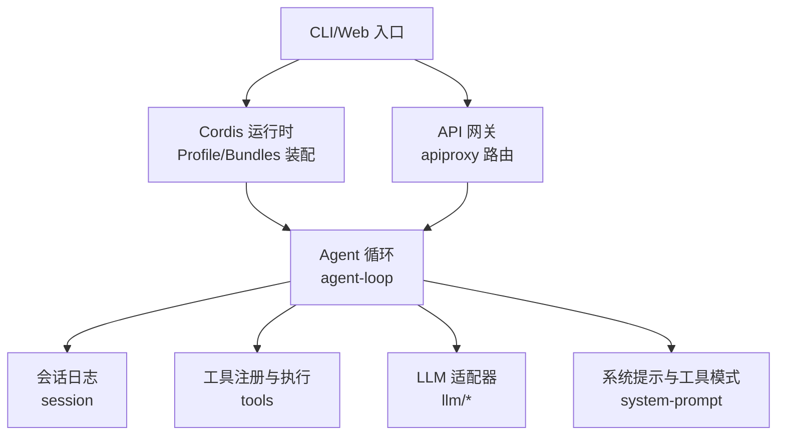
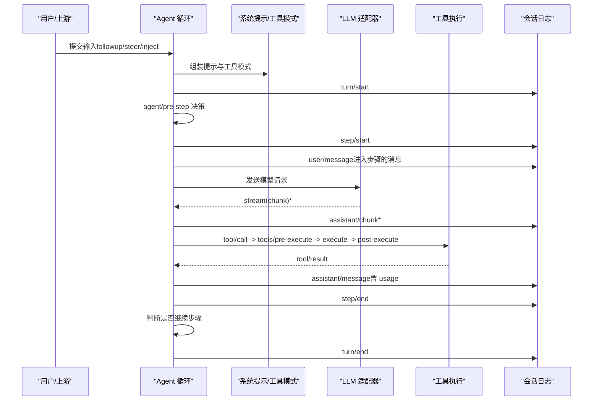
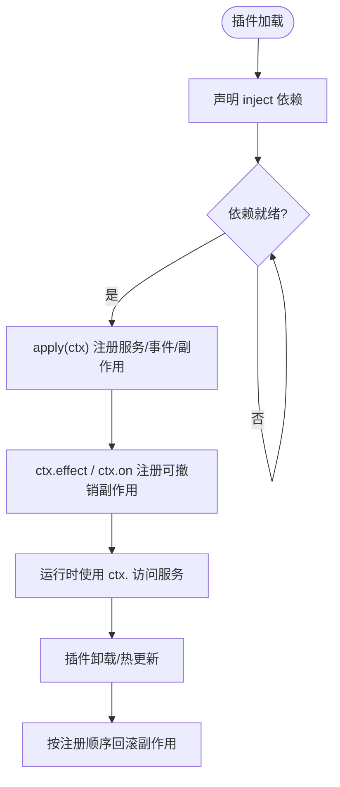
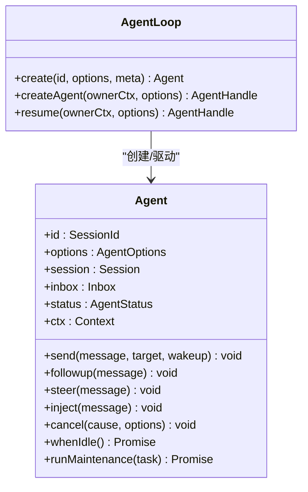
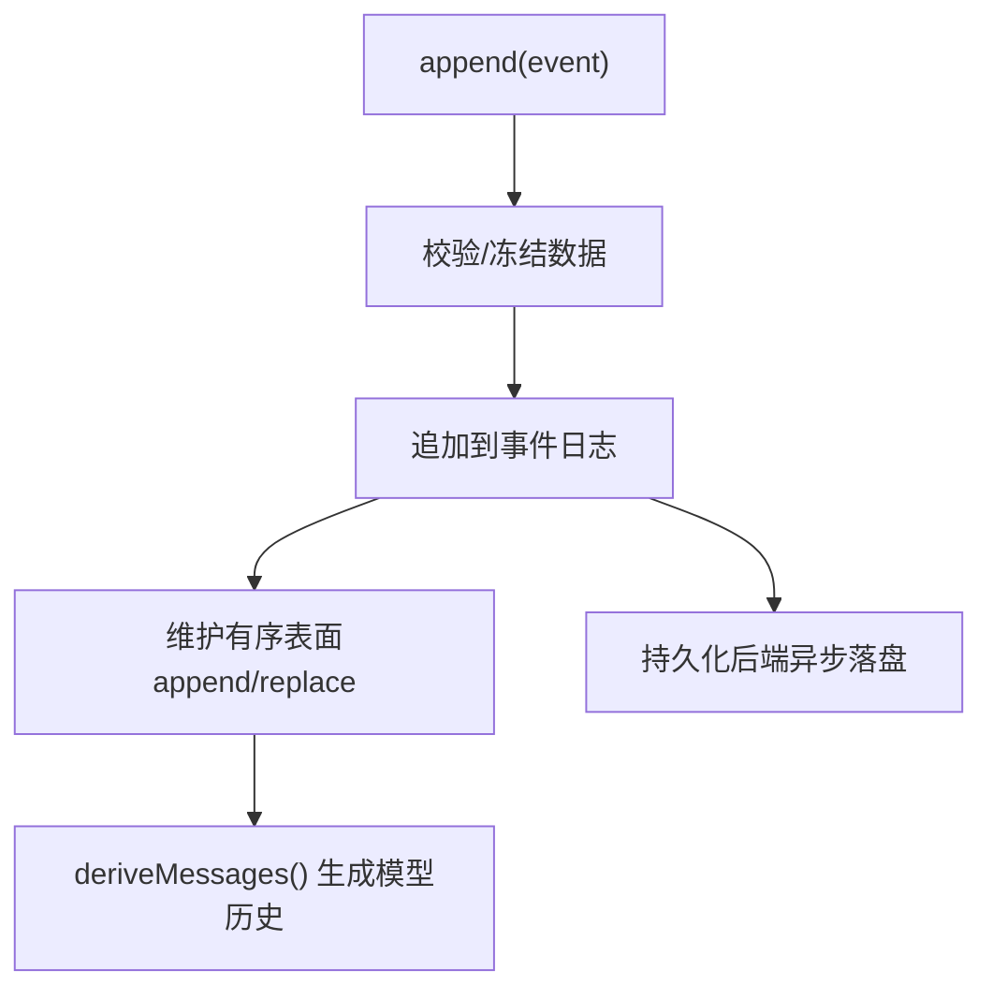
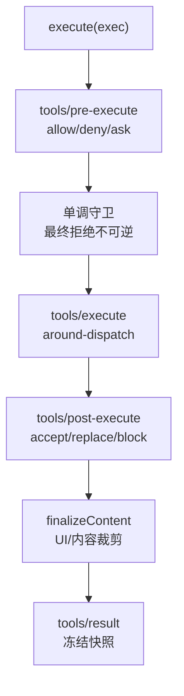
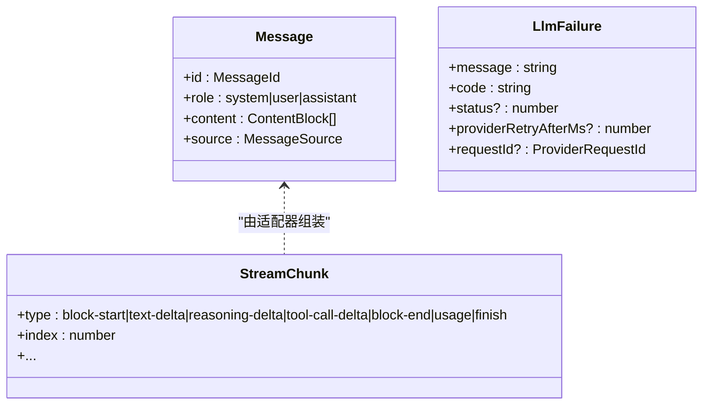
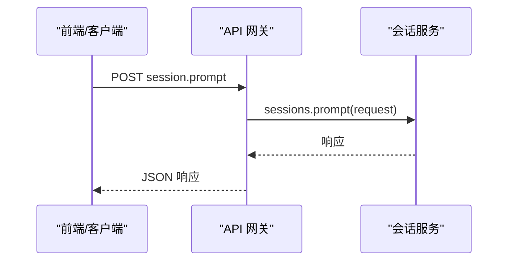
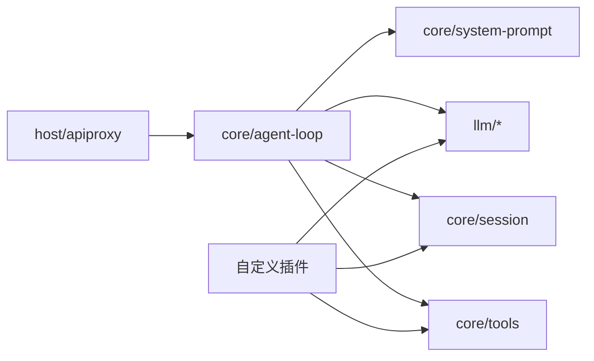

# 架构概览

<cite>
**本文引用的文件**
- [README.md](file://README.md)
- [architecture.md](file://docs/architecture.md)
- [cordis-primer.md](file://docs/cordis-primer.md)
- [core.md](file://docs/subsystems/core.md)
- [session.md](file://docs/subsystems/session.md)
- [tools.md](file://docs/subsystems/tools.md)
- [llm-streaming.md](file://docs/subsystems/llm-streaming.md)
- [handler.ts](file://packages/host/apiproxy/src/fetch/handler.ts)
</cite>

## 目录
1. [简介](#简介)
2. [项目结构](#项目结构)
3. [核心组件](#核心组件)
4. [架构总览](#架构总览)
5. [详细组件分析](#详细组件分析)
6. [依赖关系分析](#依赖关系分析)
7. [性能考量](#性能考量)
8. [故障排查指南](#故障排查指南)
9. [结论](#结论)
10. [附录](#附录)

## 简介
DeepSeek Harness（dsh）是一个以“一切皆插件”为核心理念的开源智能体运行框架，基于 Cordis 插件框架构建。通过可插拔的服务、事件与副作用机制，模型适配器、工具注册表、会话日志以及智能体循环本身均可由配置替换或扩展。系统提供 CLI 与 Web 两种形态，并以“配置文件层 + 组合包”的方式组织启动时的插件树，使能力可按需装配、热更新与卸载。

**章节来源**
- [README.md:5-11](file://README.md#L5-L11)

## 项目结构
- 顶层应用：apps/cli 与 apps/web 分别提供命令行与 Web 入口；它们通过 Cordis 加载 profile/bundle 并组装运行时。
- 核心子系统：packages/core 下的 session、system-prompt、tools、agent、agent-loop、scope 等构成驱动智能体的主干。
- LLM 集成：packages/llm 定义消息、流式协议与适配器契约，具体提供商适配在 llm-deepseek、llm-pi-ai 等包中实现。
- 宿主与 API：packages/host/apiproxy 暴露统一的 RPC 路由，将前端/客户端请求映射到会话、子智能体等能力。
- 文档与示例：docs 下系统化描述架构、子系统与教程；examples 提供多种 agent 配置与端到端用例。

**图示来源**
- [architecture.md:15-27](file://docs/architecture.md#L15-L27)
- [core.md:7-20](file://docs/subsystems/core.md#L7-L20)

**章节来源**
- [architecture.md:15-27](file://docs/architecture.md#L15-L27)
- [core.md:7-20](file://docs/subsystems/core.md#L7-L20)

## 核心组件
- Agent 管理：提供 Agent 接口、生命周期、入站消息投递、取消与拦截点，默认驱动由 agent-loop 实现。
- 会话管理：以追加型事件日志为核心，所有模型可见事实均落盘并可重放；衍生历史用于构建模型上下文。
- 工具系统：统一注册、权限策略、执行管道与 UI 呈现约定；支持并行/独占调度、超时与结果后处理。
- LLM 集成：抽象消息、内容块、流式协议与失败语义；适配器负责具体提供商调用与重试策略。
- 插件化架构：通过 Cordis 的 Service、Context、Event、Effect 与 Scope 实现能力解耦与可替换。

**章节来源**
- [core.md:7-20](file://docs/subsystems/core.md#L7-L20)
- [session.md:1-12](file://docs/subsystems/session.md#L1-L12)
- [tools.md:1-12](file://docs/subsystems/tools.md#L1-L12)
- [llm-streaming.md:1-8](file://docs/subsystems/llm-streaming.md#L1-L8)
- [cordis-primer.md:7-13](file://docs/cordis-primer.md#L7-L13)

## 架构总览
下图展示一次“轮次（turn）”的核心数据流：从输入进入、预步骤决策、模型请求与流式响应、工具调用与结果回写，再到下一轮输入或结束。

**图示来源**
- [architecture.md:63-90](file://docs/architecture.md#L63-L90)
- [core.md:7-10](file://docs/subsystems/core.md#L7-L10)

**章节来源**
- [architecture.md:63-90](file://docs/architecture.md#L63-L90)

## 详细组件分析

### 插件化基础：Cordis 设计
- 服务与上下文：插件通过实现 Service 并在 Context 中声明键名（如 ctx.tools、ctx.llm、ctx.sessions），其他插件按键查找，避免硬耦合。
- 依赖注入：通过 inject 声明所需服务，加载顺序由依赖关系决定。
- 事件通信：emit、waterfall、parallel、serial 四种分发模式，用于观察、包装、扇出与串行处理。
- 副作用管理：注册项（提示片段、工具模式、适配器、监听器）通过 effect/on 安装，卸载时自动回滚。

**图示来源**
- [cordis-primer.md:7-13](file://docs/cordis-primer.md#L7-L13)
- [cordis-primer.md:15-34](file://docs/cordis-primer.md#L15-L34)

**章节来源**
- [cordis-primer.md:7-34](file://docs/cordis-primer.md#L7-L34)

### Agent 管理与循环
- Agent 接口：提供 send/followup/steer/inject、cancel、whenIdle、runMaintenance 等能力，统一入站消息与生命周期控制。
- 循环驱动：默认实现位于 agent-loop，负责 claim 输入、打开 turn、组装提示、发起 LLM 请求、派发工具调用、写入日志与推进下一步。
- 拦截点：agent/pre-step、agent/request-error、agent/turn-stopping 等事件用于策略与恢复。

**图示来源**
- [core.md:22-51](file://docs/subsystems/core.md#L22-L51)
- [core.md:53-155](file://docs/subsystems/core.md#L53-L155)
- [core.md:343-380](file://docs/subsystems/core.md#L343-L380)

**章节来源**
- [core.md:22-155](file://docs/subsystems/core.md#L22-L155)
- [core.md:343-380](file://docs/subsystems/core.md#L343-L380)

### 会话管理：事件溯源与衍生历史
- 追加日志：SessionEventMap 定义了 turn/step/user/assistant/tool 等事件类型，所有模型可见事实必须可重放。
- 衍生历史：deriveMessages() 从有序表面投影得到 Message[]，供模型请求使用；原始 chunk 保留回放保真。
- 持久化：后端订阅 session/event 并在 checkpoint/dispose 时落盘；崩溃恢复通过合成 interrupted 原因关闭悬挂 turn。

**图示来源**
- [session.md:1-12](file://docs/subsystems/session.md#L1-L12)
- [session.md:251-313](file://docs/subsystems/session.md#L251-L313)
- [session.md:521-531](file://docs/subsystems/session.md#L521-L531)
- [session.md:601-605](file://docs/subsystems/session.md#L601-L605)

**章节来源**
- [session.md:1-12](file://docs/subsystems/session.md#L1-L12)
- [session.md:251-313](file://docs/subsystems/session.md#L251-L313)
- [session.md:521-531](file://docs/subsystems/session.md#L521-L531)
- [session.md:601-605](file://docs/subsystems/session.md#L601-L605)

### 工具系统：注册、策略与执行管道
- 注册与模式：ToolDefinition 包含模型可见 schema、输出契约、execute、可选 finalizeContent 与 UI 呈现；schemas() 仅暴露白名单字段。
- 执行管道：tools/pre-execute → 单调守卫 → tools/execute（around-dispatch）→ tools/post-execute → finalizeContent → tools/result。
- 调度与并发：executionMode 决定 parallel/exclusive；支持超时预算、结果后处理与结构化错误。

**图示来源**
- [tools.md:9-12](file://docs/subsystems/tools.md#L9-L12)
- [tools.md:170-173](file://docs/subsystems/tools.md#L170-L173)
- [tools.md:243-255](file://docs/subsystems/tools.md#L243-L255)
- [tools.md:376-404](file://docs/subsystems/tools.md#L376-L404)

**章节来源**
- [tools.md:9-12](file://docs/subsystems/tools.md#L9-L12)
- [tools.md:170-173](file://docs/subsystems/tools.md#L170-L173)
- [tools.md:243-255](file://docs/subsystems/tools.md#L243-L255)
- [tools.md:376-404](file://docs/subsystems/tools.md#L376-L404)

### LLM 集成：消息、流与适配器
- 消息与内容块：Message/ContentBlock 为跨模块共享词汇，助手消息携带 provider/model 与可选 replayState。
- 流式协议：StreamChunk 支持文本/推理/工具调用增量与 block-end 完整块，finish 携带 FinishReason 与可选 replayState。
- 失败语义：LlmFailure 标准化错误码、状态码与重试建议，便于上层策略统一处理。

**图示来源**
- [llm-streaming.md:11-31](file://docs/subsystems/llm-streaming.md#L11-L31)
- [llm-streaming.md:154-182](file://docs/subsystems/llm-streaming.md#L154-L182)
- [llm-streaming.md:184-200](file://docs/subsystems/llm-streaming.md#L184-L200)

**章节来源**
- [llm-streaming.md:11-31](file://docs/subsystems/llm-streaming.md#L11-L31)
- [llm-streaming.md:154-182](file://docs/subsystems/llm-streaming.md#L154-L182)
- [llm-streaming.md:184-200](file://docs/subsystems/llm-streaming.md#L184-L200)

### API 网关与外部集成
- apiproxy 提供统一路由，将 session.*、subagent.* 等请求映射到对应服务方法，屏蔽内部实现细节。
- 前端/客户端通过该网关与宿主交互，触发会话创建、查询、提示、取消等操作。

**图示来源**
- [handler.ts:90-103](file://packages/host/apiproxy/src/fetch/handler.ts#L90-L103)

**章节来源**
- [handler.ts:90-103](file://packages/host/apiproxy/src/fetch/handler.ts#L90-L103)

## 依赖关系分析
- 松耦合：各子系统通过 ctx 键与服务接口交互，避免直接导入实现；新增能力只需注册新服务/事件。
- 明确边界：session 作为唯一事实源，tools 与 llm 围绕其事件进行读写；agent-loop 协调三者。
- 可扩展性：通过 profile/bundle 分层装配，任何行都可被 patch 覆盖或插入新行。

**图示来源**
- [core.md:7-20](file://docs/subsystems/core.md#L7-L20)
- [architecture.md:15-27](file://docs/architecture.md#L15-L27)

**章节来源**
- [core.md:7-20](file://docs/subsystems/core.md#L7-L20)
- [architecture.md:15-27](file://docs/architecture.md#L15-L27)

## 性能考量
- 流式响应：LLM 适配器以 StreamChunk 增量推送，降低首字延迟；assistant/chunk 保持回放保真。
- 工具并发：executionMode 允许安全工具并行执行，提升吞吐；exclusive 保证关键操作的顺序性。
- 日志与派生：deriveMessages 缓存节点投影，重写时才重建；持久化异步落盘，避免阻塞主路径。
- 超时与取消：工具支持 timeoutMs 与信号传播；循环在 turn/step 边界检查取消，及时释放资源。

[本节为通用指导，不直接分析具体文件]

## 故障排查指南
- 工具失败：tools/post-execute 可将纠正反馈转为 block，统一为结构化错误；unknown/throwing 工具映射为 UNKNOWN_TOOL，不中断 turn。
- 会话恢复：persistence 在重载时合成 interrupted 原因关闭悬挂 turn；session/end-seed 标记种子边界，区分历史与实时写入。
- 模型错误：agent/request-error 提供重试机会；LlmFailure 携带 code/status/retry-after 以便策略化处理。
- 调试定位：通过 session/event 与 tools/result 等事件追踪调用链；结合 request/header 与 request/context 重建请求上下文。

**章节来源**
- [tools.md:376-404](file://docs/subsystems/tools.md#L376-L404)
- [session.md:540-575](file://docs/subsystems/session.md#L540-L575)
- [session.md:583-591](file://docs/subsystems/session.md#L583-L591)
- [llm-streaming.md:184-200](file://docs/subsystems/llm-streaming.md#L184-L200)

## 结论
DeepSeek Harness 以 Cordis 插件框架为基础，构建了高度可组合、可替换的智能体运行环境。通过“事件溯源会话 + 工具管道 + LLM 适配器 + Agent 循环”的核心骨架，系统在扩展性、可观测性与可靠性方面取得平衡。开发者可通过 profile/bundle 装配能力，借助事件与服务的扩展点实现定制逻辑，同时利用统一的 API 网关对外提供服务。

[本节为总结性内容，不直接分析具体文件]

## 附录
- 术语与概念：参见 cordis-primer、architecture 与 subsystems 文档索引。
- 实践指南：参考 cookbook 中的添加工具、LLM 适配器、会话节点等步骤。
- 配置与组合：通过 dsh.profile.bundles 与 cordis.patch.yml 控制装配顺序与覆盖规则。

[本节为补充信息，不直接分析具体文件]