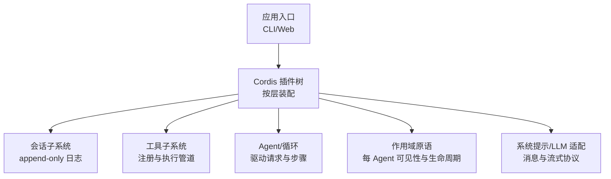
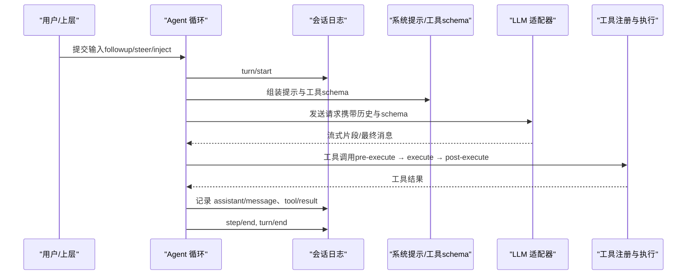
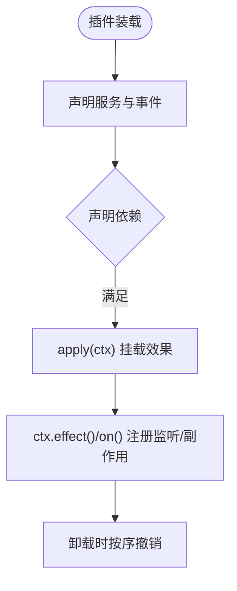
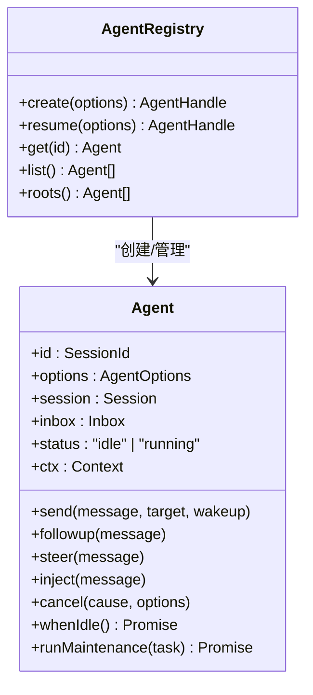
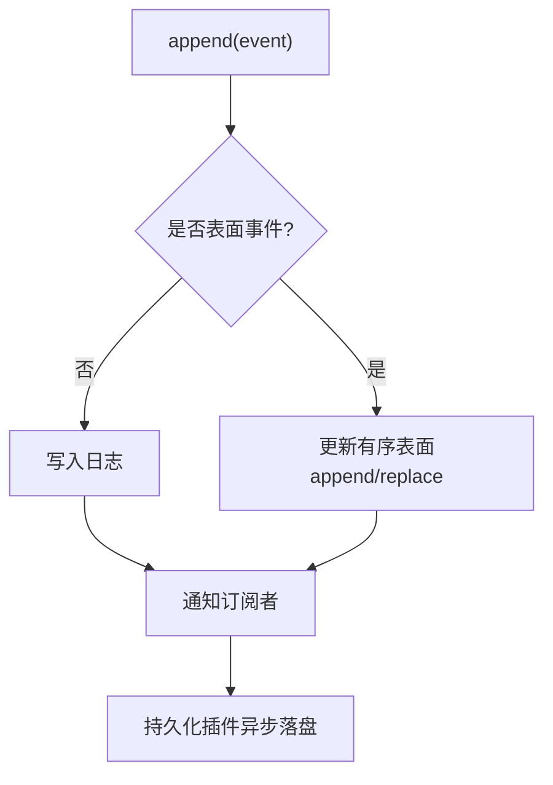
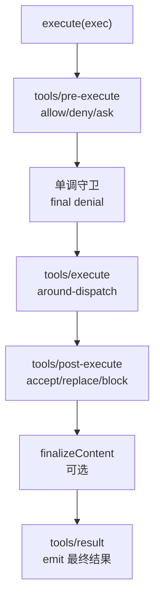
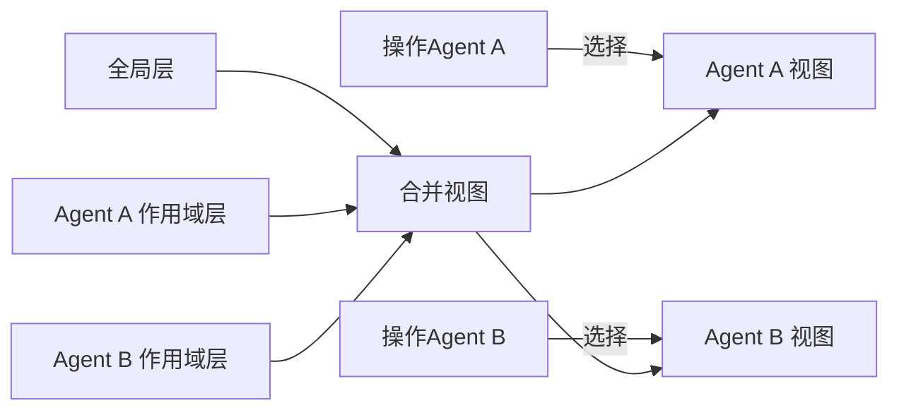
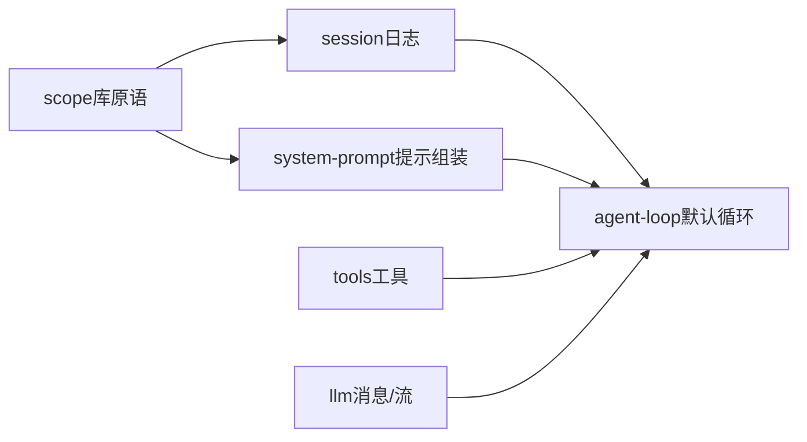

# 核心概念

<cite>
**本文引用的文件**
- [架构总览](file://docs/architecture.md)
- [术语表](file://docs/glossary.md)
- [Cordis 入门](file://docs/cordis-primer.md)
- [会话子系统](file://docs/subsystems/session.md)
- [工具子系统](file://docs/subsystems/tools.md)
- [作用域注册](file://docs/subsystems/scope.md)
- [核心子系统（Agent/Loop）](file://docs/subsystems/core.md)
- [示例配置：headless-agent](file://examples/headless-agent/cordis.yml)
</cite>

## 目录
1. [引言](#引言)
2. [项目结构](#项目结构)
3. [核心组件](#核心组件)
4. [架构总览](#架构总览)
5. [详细组件分析](#详细组件分析)
6. [依赖关系分析](#依赖关系分析)
7. [性能与可扩展性](#性能与可扩展性)
8. [故障排查指南](#故障排查指南)
9. [结论](#结论)
10. [附录：常见误区与最佳实践](#附录：常见误区与最佳实践)

## 引言
本入门文档面向初次接触 DeepSeek Harness 的读者，目标是帮助你理解插件、Agent、会话、工具、作用域等关键概念的定义、职责与协作方式。我们将用通俗类比解释抽象概念，并通过仓库中的真实配置与子系统说明，展示这些概念如何在系统中协同工作。读完本文后，你将能够把握系统的“基础术语和思维模式”，并知道在哪里继续深入学习实现细节。

## 项目结构
DeepSeek Harness 以 Cordis 插件框架为底座，所有能力都以插件形式贡献到共享上下文。核心由若干子系统组成：会话日志、系统提示组装、工具注册与执行、Agent 接口与默认循环、以及作用域原语。运行时的具体装配通过配置文件（如 cordis.yml）声明，按层叠加、可被覆盖。



图表来源
- [架构总览:9-13](file://docs/architecture.md#L9-L13)
- [核心子系统（Agent/Loop）:11-20](file://docs/subsystems/core.md#L11-L20)

章节来源
- [架构总览:9-38](file://docs/architecture.md#L9-L38)
- [核心子系统（Agent/Loop）:11-20](file://docs/subsystems/core.md#L11-L20)

## 核心组件
- 插件（Plugin）：基于 Cordis 的最小扩展单元，声明服务、事件与可逆效果，挂载到共享上下文。
- Agent：一次对话的“智能体”实体，拥有唯一 ID、会话、收件箱、状态与上下文；负责接收输入、驱动模型调用与工具执行。
- 会话（Session）：不可变追加型事件日志，是模型可见历史的唯一事实来源；所有持久化、回放、派生历史都从它构建。
- 工具（Tool）：模型可调用的能力，包含参数 schema、执行函数、输出渲染与 UI 呈现；通过作用域注册与限制进行可见性控制。
- 作用域（Scope）：以不透明键标识的“可见性+生命周期”容器，使同一注册既决定谁可见，又决定何时销毁。

章节来源
- [Cordis 入门:7-14](file://docs/cordis-primer.md#L7-L14)
- [术语表:11-21](file://docs/glossary.md#L11-L21)
- [会话子系统:5-12](file://docs/subsystems/session.md#L5-L12)
- [工具子系统:9-12](file://docs/subsystems/tools.md#L9-L12)
- [作用域注册:9-18](file://docs/subsystems/scope.md#L9-L18)

## 架构总览
Harness 的核心循环围绕“会话日志—提示组装—模型调用—工具执行—结果落盘”展开。每个环节都是可替换的能力接缝（seam），通过事件与服务注入组合。



图表来源
- [架构总览:63-90](file://docs/architecture.md#L63-L90)
- [会话子系统:29-88](file://docs/subsystems/session.md#L29-L88)
- [工具子系统:170-173](file://docs/subsystems/tools.md#L170-L173)

章节来源
- [架构总览:63-129](file://docs/architecture.md#L63-L129)

## 详细组件分析

### 插件（Plugin）
- 定义：一个对象或类，实现服务接口，声明依赖（inject）、生命周期（apply/effect/on），并通过事件通信。
- 特点：注册是可逆的效果；卸载时自动回滚；加载顺序通过依赖声明而非手动编排。
- 在系统中的位置：所有产品功能（模型适配器、工具注册、会话存储、Agent 循环）都是插件。



图表来源
- [Cordis 入门:7-14](file://docs/cordis-primer.md#L7-L14)
- [Cordis 入门:28-44](file://docs/cordis-primer.md#L28-L44)

章节来源
- [Cordis 入门:7-44](file://docs/cordis-primer.md#L7-L44)

### Agent（智能体）
- 角色：一次对话的“负责人”，持有会话、收件箱、状态与上下文；对外暴露 send/followup/steer/inject 等方法。
- 生命周期：创建时建立会话与 Agent 实例；setup 阶段完成该 Agent 的作用域内注册；发布后进入 idle/running 状态；dispose 时停止循环、清理会话与作用域。
- 与循环：默认循环实现 Agent 接口，将输入转化为 turn/step，驱动模型与工具。



图表来源
- [核心子系统（Agent/Loop）:22-55](file://docs/subsystems/core.md#L22-L55)
- [核心子系统（Agent/Loop）:53-155](file://docs/subsystems/core.md#L53-L155)

章节来源
- [核心子系统（Agent/Loop）:22-155](file://docs/subsystems/core.md#L22-L155)

### 会话（Session）
- 本质：追加型事件日志，所有模型可见的历史都由此推导；任何进入模型请求的内容都必须能由日志重建。
- 事件类型：turn/step 边界、user/assistant/tool 消息、流式 chunk、请求头与上下文元数据等。
- 表面投影：仅“表面事件”参与有序的消息面；支持 append 与 replace 两种插入语义，用于压缩等场景。
- 持久化：后端需无损持久化全部事件（包括 chunk），保证 seq 连续；恢复时重放得到一致历史。



图表来源
- [会话子系统:29-124](file://docs/subsystems/session.md#L29-L124)
- [会话子系统:251-313](file://docs/subsystems/session.md#L251-L313)
- [会话子系统:601-605](file://docs/subsystems/session.md#L601-L605)

章节来源
- [会话子系统:5-124](file://docs/subsystems/session.md#L5-L124)
- [会话子系统:251-313](file://docs/subsystems/session.md#L251-L313)
- [会话子系统:601-605](file://docs/subsystems/session.md#L601-L605)

### 工具（Tool）
- 定义：包含参数 schema、执行函数、输出渲染与可选 UI 呈现；通过注册表提供可见性与执行策略。
- 执行管道：pre-execute（允许/拒绝/询问）→ 单调守卫 → execute（around-dispatch）→ post-execute（接受/替换/阻断）→ finalizeContent → result 事件。
- 可见性：全局注册 + 作用域遮蔽；可通过 ToolRestriction 对继承的工具集进行 allow/deny 过滤。
- 并发：工具可声明 isConcurrencySafe，参与并行分组；否则走独占调度。



图表来源
- [工具子系统:170-173](file://docs/subsystems/tools.md#L170-L173)
- [工具子系统:376-404](file://docs/subsystems/tools.md#L376-L404)
- [工具子系统:480-570](file://docs/subsystems/tools.md#L480-L570)

章节来源
- [工具子系统:9-152](file://docs/subsystems/tools.md#L9-L152)
- [工具子系统:170-404](file://docs/subsystems/tools.md#L170-L404)
- [工具子系统:480-570](file://docs/subsystems/tools.md#L480-L570)

### 作用域（Scope）
- 身份：不透明的 ScopeKey（通常就是 Agent 对象本身），用于选择正确的注册层。
- 载体：Scoped<T> 作为事件分发的 this 类型，确保只向目标 Agent 分发。
- 层级：全局层 + 精确作用域层；读取时合并（全局具名条目 + 作用域遮蔽）；空层可回收。
- 生命周期：通过 agent.ctx 注册的贡献随 Agent 生命周期存在与销毁；setup 窗口完成注册后再发布 Agent。



图表来源
- [作用域注册:9-18](file://docs/subsystems/scope.md#L9-L18)
- [作用域注册:29-59](file://docs/subsystems/scope.md#L29-L59)
- [术语表:11-21](file://docs/glossary.md#L11-L21)

章节来源
- [作用域注册:9-59](file://docs/subsystems/scope.md#L9-L59)
- [术语表:11-21](file://docs/glossary.md#L11-L21)

### 实际装配示例（headless-agent）
以下是一个最小可用的“一次性编码助手”配置片段，展示了如何把多个插件（设置、凭据、LLM 适配器、子进程、工具、持久化、压缩、子代理、工作流等）组合起来，形成可运行的 Agent。

```yaml
# 示例：headless-agent/cordis.yml（节选）
- id: settings
  name: '@deepseek-ai/dsh-settings-file'
- id: credentials
  name: '@deepseek-ai/dsh-credentials-local'
- id: llm-deepseek
  name: '@deepseek-ai/dsh-llm-deepseek'
  config:
    thinking: enabled
    reasoningEffort: max
    models:
      - id: deepseek-v4-pro
        contextWindow: 128000
- id: agent-spine
  name: '@deepseek-ai/dsh-agent-spine-demo'
  config:
    agents:
      - id: main
        provider: deepseek-official
        model: deepseek-v4-flash
        cwd: !!js process.cwd()
    persona: |
      You are headless-agent...
- id: persistence
  name: '@deepseek-ai/dsh-session-persistence-jsonl'
  config:
    root: './.sessions'
- id: tool-fs
  name: '@deepseek-ai/dsh-tool-fs'
```

章节来源
- [示例配置：headless-agent:1-166](file://examples/headless-agent/cordis.yml#L1-L166)

## 依赖关系分析
- 插件之间通过 Cordis 的服务键（ctx.*）解耦，避免直接导入实现；加载顺序由 inject 声明隐式表达。
- 核心子系统之间的依赖：agent-loop 依赖 session/system-prompt/tools/llm；scope 是底层库原语，被 session 与 system-prompt 消费以避免循环。
- 事件是扩展点：session/*、agent/*、tools/* 等事件串起不同子系统，使得新增行为只需注册监听或中间件。



图表来源
- [核心子系统（Agent/Loop）:11-20](file://docs/subsystems/core.md#L11-L20)
- [架构总览:53-61](file://docs/architecture.md#L53-L61)

章节来源
- [核心子系统（Agent/Loop）:11-20](file://docs/subsystems/core.md#L11-L20)
- [架构总览:53-61](file://docs/architecture.md#L53-L61)

## 性能与可扩展性
- 会话日志的 deriveMessages 会缓存已投影的表面节点，首次 O(新节点)，重写时重建；适合高频读取。
- 工具执行支持并行与独占模式，减少不必要阻塞；post-execute 可替换内容而不影响结构化值，兼顾性能与灵活性。
- 插件体系天然可扩展：新增能力即新增插件，通过事件与服务接入，无需修改核心。

[本节为通用指导，不直接分析具体文件]

## 故障排查指南
- 会话日志一致性：若出现历史不一致，检查 surfaceOp 与 sourceEventSeqs 是否正确；确认持久化后端是否完整保存了所有事件（包括 chunk）。
- 工具执行失败：查看 tools/pre-execute 是否 deny/ask，tools/post-execute 是否 block；确认工具 schema 与参数匹配。
- Agent 状态异常：关注 agent/status 事件；使用 whenIdle 等待稳定态；必要时 cancel 当前活动并重新投递输入。
- 作用域问题：确认注册是在 setup 窗口中通过 agent.ctx 完成；检查 ScopeKey 是否正确绑定到目标 Agent。

章节来源
- [会话子系统:601-605](file://docs/subsystems/session.md#L601-L605)
- [工具子系统:376-404](file://docs/subsystems/tools.md#L376-L404)
- [核心子系统（Agent/Loop）:144-155](file://docs/subsystems/core.md#L144-L155)

## 结论
DeepSeek Harness 以“插件 + 事件 + 作用域”为核心组织方式：插件贡献能力，事件串联流程，作用域隔离可见性与生命周期。Agent 驱动会话，会话记录一切，工具扩展能力，作用域确保正确可见与资源回收。掌握这些概念后，你可以安全地扩展系统、定位问题，并以最小改动集成新能力。

[本节为总结，不直接分析具体文件]

## 附录：常见误区与最佳实践
- 误区：把 scope 当作父子继承结构。正解：scope 是扁平的，不会向下继承；跨 Agent 的可见性由各自作用域决定。
- 误区：认为工具注册可以随意泄露给模型。正解：schemas() 仅暴露白名单字段，执行回调不会进入模型请求。
- 误区：在 session 之外维护“另一份历史”。正解：模型可见历史必须能从日志重建，新增模型可见输入应新增事件类型。
- 最佳实践：
  - 在 setup 窗口通过 agent.ctx 完成作用域内注册，确保生命周期一致。
  - 使用工具的执行管道做策略拦截（pre/post-execute），而不是侵入工具内部逻辑。
  - 通过 ToolRestriction 精细控制可见工具集合，避免越权。
  - 利用会话的 fork/resume 能力实现任务分支与恢复。

章节来源
- [术语表:11-21](file://docs/glossary.md#L11-L21)
- [工具子系统:153-168](file://docs/subsystems/tools.md#L153-L168)
- [会话子系统:92-97](file://docs/subsystems/session.md#L92-L97)
- [核心子系统（Agent/Loop）:22-55](file://docs/subsystems/core.md#L22-L55)