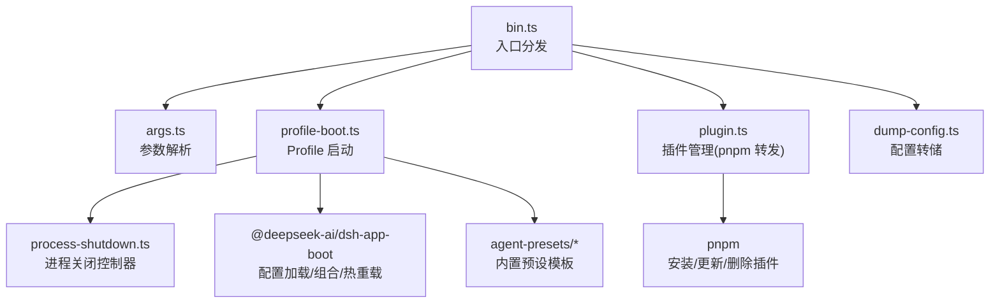
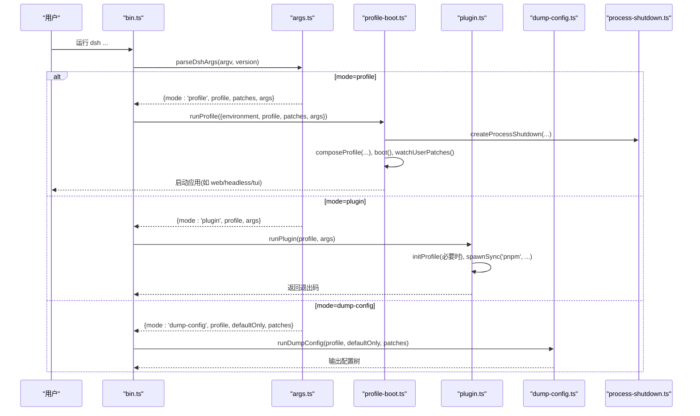
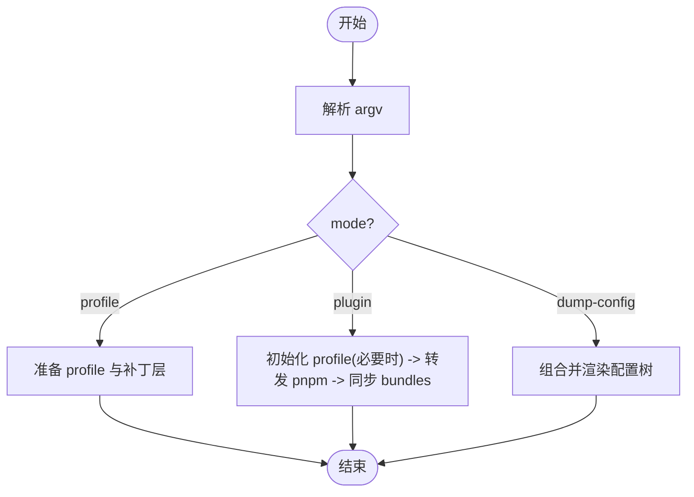
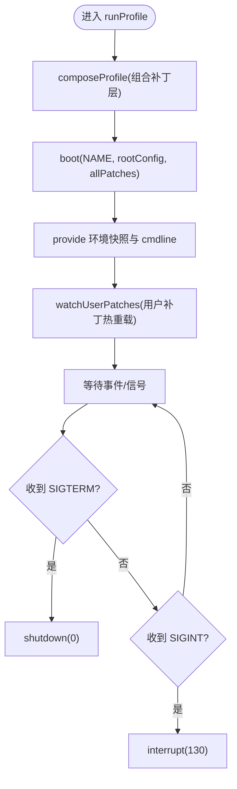
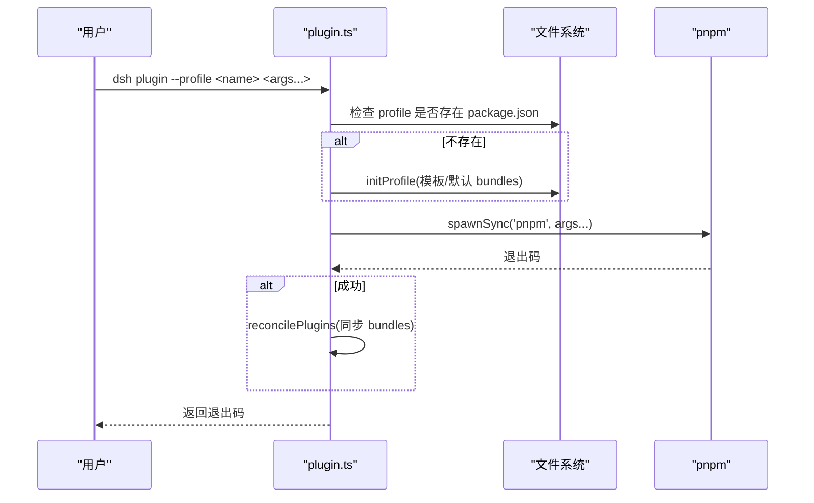
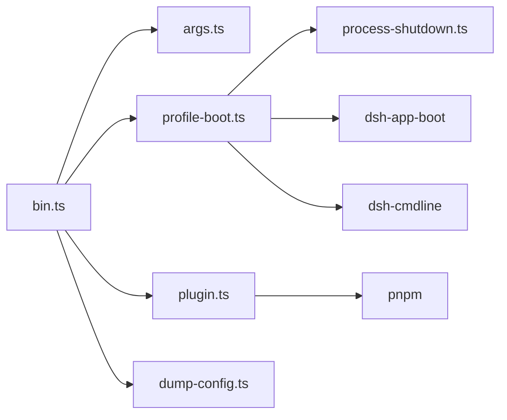

# CLI 命令行界面

<cite>
**本文引用的文件**
- [apps/cli/src/bin.ts](file://apps/cli/src/bin.ts)
- [apps/cli/src/args.ts](file://apps/cli/src/args.ts)
- [apps/cli/src/profile-boot.ts](file://apps/cli/src/profile-boot.ts)
- [apps/cli/src/plugin.ts](file://apps/cli/src/plugin.ts)
- [apps/cli/src/dump-config.ts](file://apps/cli/src/dump-config.ts)
- [apps/cli/src/process-shutdown.ts](file://apps/cli/src/process-shutdown.ts)
- [apps/cli/package.json](file://apps/cli/package.json)
- [apps/cli/README.md](file://apps/cli/README.md)
- [apps/cli/config/agent-presets/code/preset.yml](file://apps/cli/config/agent-presets/code/preset.yml)
- [apps/cli/config/agent-presets/minimal/preset.yml](file://apps/cli/config/agent-presets/minimal/preset.yml)
</cite>

## 目录
1. [简介](#简介)
2. [项目结构](#项目结构)
3. [核心组件](#核心组件)
4. [架构总览](#架构总览)
5. [详细组件分析](#详细组件分析)
6. [依赖关系分析](#依赖关系分析)
7. [性能考虑](#性能考虑)
8. [故障排查指南](#故障排查指南)
9. [结论](#结论)
10. [附录](#附录)

## 简介
本文件面向 DeepSeek Harness 的 CLI 应用程序 dsh，系统性说明其入口模式、参数解析、配置文件与插件系统、Profile 系统与预设模板的使用方式，并给出完整的命令行参数参考、错误处理与调试技巧，以及实际使用示例和最佳实践。dsh 是“按 Profile 启动”的产品级命令行工具：通过命令行为 Profile 装配补丁层（bundle 层、用户层、覆盖层），再交由注入的应用插件完成具体工作（Web UI、Headless 等）。

## 项目结构
CLI 的核心位于 apps/cli/src，包含入口分发、参数解析、Profile 启动、插件管理、配置转储与进程关闭控制等模块；同时提供内置的 Agent 预设模板与包清单。

图表来源
- [apps/cli/src/bin.ts:1-54](file://apps/cli/src/bin.ts#L1-L54)
- [apps/cli/src/args.ts:1-192](file://apps/cli/src/args.ts#L1-L192)
- [apps/cli/src/profile-boot.ts:1-301](file://apps/cli/src/profile-boot.ts#L1-L301)
- [apps/cli/src/plugin.ts:1-159](file://apps/cli/src/plugin.ts#L1-L159)
- [apps/cli/src/dump-config.ts:1-54](file://apps/cli/src/dump-config.ts#L1-L54)
- [apps/cli/src/process-shutdown.ts:1-78](file://apps/cli/src/process-shutdown.ts#L1-L78)

章节来源
- [apps/cli/README.md:1-48](file://apps/cli/README.md#L1-L48)
- [apps/cli/package.json:1-102](file://apps/cli/package.json#L1-L102)

## 核心组件
- 入口分发 bin.ts：读取版本、解析参数、根据 mode 动态导入并执行 profile/plugin/dump-config。
- 参数解析 args.ts：基于 Commander 定义 dsh 主命令、web 别名、plugin 子命令；负责 --profile/--patch/--dump-config/--dump-default-config 等选项校验与透传。
- Profile 启动 profile-boot.ts：组装补丁层（bundle 层、用户层、home 层、--patch 覆盖层、遥测开关），写入空根配置，启动 Cordis 树，挂载 HMR 监听用户补丁，提供 cmdline 与退出通道。
- 插件管理 plugin.ts：首次使用初始化 Profile，将剩余参数原样转发给 pnpm，并根据已安装包是否声明 dsh.bundle 同步维护 dsh.profile.bundles。
- 配置转储 dump-config.ts：不启动应用，仅组合并渲染补丁层，便于诊断与可视化。
- 进程关闭 process-shutdown.ts：统一优雅退出与强制超时退出，避免僵尸进程。

章节来源
- [apps/cli/src/bin.ts:1-54](file://apps/cli/src/bin.ts#L1-L54)
- [apps/cli/src/args.ts:1-192](file://apps/cli/src/args.ts#L1-L192)
- [apps/cli/src/profile-boot.ts:1-301](file://apps/cli/src/profile-boot.ts#L1-L301)
- [apps/cli/src/plugin.ts:1-159](file://apps/cli/src/plugin.ts#L1-L159)
- [apps/cli/src/dump-config.ts:1-54](file://apps/cli/src/dump-config.ts#L1-L54)
- [apps/cli/src/process-shutdown.ts:1-78](file://apps/cli/src/process-shutdown.ts#L1-L78)

## 架构总览
dsh 采用“入口分发 + 按需加载”的模式：仅解析自身关心的参数，其余参数原样传递给被启动的 Profile 应用。Profile 通过补丁层机制组合配置，支持热重载与遥测开关。插件管理以 pnpm 为后端，自动维护 bundle 列表。

图表来源
- [apps/cli/src/bin.ts:27-53](file://apps/cli/src/bin.ts#L27-L53)
- [apps/cli/src/args.ts:112-191](file://apps/cli/src/args.ts#L112-L191)
- [apps/cli/src/profile-boot.ts:207-300](file://apps/cli/src/profile-boot.ts#L207-L300)
- [apps/cli/src/plugin.ts:120-158](file://apps/cli/src/plugin.ts#L120-L158)
- [apps/cli/src/dump-config.ts:30-52](file://apps/cli/src/dump-config.ts#L30-L52)
- [apps/cli/src/process-shutdown.ts:22-77](file://apps/cli/src/process-shutdown.ts#L22-L77)

## 详细组件分析

### 入口与参数解析（bin.ts / args.ts）
- 入口职责：读取版本、调用参数解析器、根据 mode 动态 import 对应处理器。
- 参数解析要点：
  - 主命令支持 --profile <name>、--patch <path>（可重复）、--dump-config、--dump-default-config。
  - web 是 --profile web 的硬编码别名，保留自身帮助与透传参数。
  - plugin 子命令要求 --profile <name>，并将剩余参数原样传给 pnpm。
  - 严格互斥与校验：例如 --dump-config 与 --dump-default-config 互斥；dump 模式不接受应用参数；禁止在父命令上对子命令传递无关选项。
  - 帮助与版本由 Commander 处理，错误时直接退出。

图表来源
- [apps/cli/src/bin.ts:27-53](file://apps/cli/src/bin.ts#L27-L53)
- [apps/cli/src/args.ts:83-103](file://apps/cli/src/args.ts#L83-L103)
- [apps/cli/src/args.ts:112-191](file://apps/cli/src/args.ts#L112-L191)

章节来源
- [apps/cli/src/bin.ts:1-54](file://apps/cli/src/bin.ts#L1-L54)
- [apps/cli/src/args.ts:1-192](file://apps/cli/src/args.ts#L1-L192)

### Profile 启动与补丁层组合（profile-boot.ts）
- 补丁层顺序（应用顺序）：
  1) 每个 bundle 的补丁（按 dsh.profile.bundles 顺序）
  2) Profile 自身的 cordis.patch.yml
  3) 家目录级 $DSH_HOME/cordis.patch.yml
  4) --patch 覆盖层
  5) 遥测开关（若存在对应行且环境变量启用禁用）
- 运行时特性：
  - 每次启动重写空根配置，避免 Loader 写回导致重复插入。
  - 提供 DSH_LAUNCH_ENVIRONMENT_KEY 与 cmdline（args、exit）供所有插件消费。
  - 自动挂载 HMR 与补丁文件监听，实现用户补丁的热重载。
  - 信号处理：SIGTERM 优雅退出（0），SIGINT 中断退出（130）。
  - 遥测开关：当存在 telemetry 行且环境变量非空时，生成禁用补丁。

图表来源
- [apps/cli/src/profile-boot.ts:142-171](file://apps/cli/src/profile-boot.ts#L142-L171)
- [apps/cli/src/profile-boot.ts:207-300](file://apps/cli/src/profile-boot.ts#L207-L300)
- [apps/cli/src/process-shutdown.ts:22-77](file://apps/cli/src/process-shutdown.ts#L22-L77)

章节来源
- [apps/cli/src/profile-boot.ts:1-301](file://apps/cli/src/profile-boot.ts#L1-L301)
- [apps/cli/src/process-shutdown.ts:1-78](file://apps/cli/src/process-shutdown.ts#L1-L78)

### 插件管理与预设模板（plugin.ts）
- 首次使用自动初始化 Profile（从 shipped 模板或默认 bundles）。
- 将剩余参数原样转发给 pnpm，并在成功时根据已安装包是否声明 dsh.bundle 同步维护 dsh.profile.bundles。
- 相对路径安全：将 . 或 ../ 形式的 file:/link: 规范锚定到调用目录，避免误解析到 Profile 目录内部。
- 常见错误提示：未找到 pnpm、git 托管插件 prepare 脚本被 pnpm 阻止时的引导信息。

图表来源
- [apps/cli/src/plugin.ts:120-158](file://apps/cli/src/plugin.ts#L120-L158)
- [apps/cli/src/plugin.ts:36-91](file://apps/cli/src/plugin.ts#L36-L91)
- [apps/cli/src/plugin.ts:104-112](file://apps/cli/src/plugin.ts#L104-L112)

章节来源
- [apps/cli/src/plugin.ts:1-159](file://apps/cli/src/plugin.ts#L1-L159)

### 配置转储（dump-config.ts）
- 不启动应用，仅组合并渲染补丁层，便于诊断。
- 支持两种模式：
  - --dump-config：包含用户层与 --patch 覆盖层。
  - --dump-default-config：仅打印 bundle 层，忽略用户层与覆盖层，且不允许与 --patch 混用。
- 输出包含每层的来源标注，便于定位配置冲突。

章节来源
- [apps/cli/src/dump-config.ts:1-54](file://apps/cli/src/dump-config.ts#L1-L54)

### Web UI、Headless 与 Profile 系统
- Web UI：通过 dsh web 或 dsh --profile web 启动；其自身参数由 web 应用解析（例如端口、帮助等）。
- Headless：通过 dsh --profile headless 运行一次性任务，完成后退出。
- Profile 系统：
  - 位置：$DSH_HOME/profiles/<name>
  - 组成：package.json（含 dsh.profile 与 bundles）、cordis.patch.yml（用户补丁）
  - 组合顺序：bundles → 用户层 → home 层 → --patch 覆盖层 → 遥测开关
  - 热重载：编辑 cordis.patch.yml 与 $DSH_HOME/cordis.patch.yml 即时生效（需保持进程活跃）。

章节来源
- [apps/cli/README.md:1-48](file://apps/cli/README.md#L1-L48)
- [apps/cli/src/profile-boot.ts:142-171](file://apps/cli/src/profile-boot.ts#L142-L171)

### 预设模板与 Agent 预设
- 内置预设模板位于 apps/cli/config/agent-presets，用于快速创建或展示不同能力的 Agent 配置。
- 示例：code 与 minimal 预设包含 name、description、order 等元数据，配合 agent.cordis.yml 描述能力集合。

章节来源
- [apps/cli/config/agent-presets/code/preset.yml:1-4](file://apps/cli/config/agent-presets/code/preset.yml#L1-L4)
- [apps/cli/config/agent-presets/minimal/preset.yml:1-4](file://apps/cli/config/agent-presets/minimal/preset.yml#L1-L4)

## 依赖关系分析
- 外部依赖：commander（命令行框架）、js-yaml（YAML 解析）、node-addon-require-builtin（原生模块兼容）。
- 内部依赖：@deepseek-ai/dsh-app-boot（配置加载/组合/热重载）、@deepseek-ai/cordis-*（插件与加载器）、@deepseek-ai/dsh-cmdline（命令行服务）、@deepseek-ai/dsh-home-paths（Home 路径解析）。

图表来源
- [apps/cli/package.json:22-84](file://apps/cli/package.json#L22-L84)
- [apps/cli/src/bin.ts:11-15](file://apps/cli/src/bin.ts#L11-L15)
- [apps/cli/src/profile-boot.ts:20-39](file://apps/cli/src/profile-boot.ts#L20-L39)
- [apps/cli/src/plugin.ts:13-26](file://apps/cli/src/plugin.ts#L13-L26)

章节来源
- [apps/cli/package.json:1-102](file://apps/cli/package.json#L1-L102)

## 性能考虑
- 按需加载：入口仅在需要时动态 import 对应处理器，减少冷启动开销。
- 补丁层组合：避免重复解析与写回，确保热重载稳定。
- 进程关闭：设置最大宽限期，防止长时间挂起。
- 建议：
  - 尽量使用 --dump-default-config 进行初始诊断，减少用户层干扰。
  - 合理拆分补丁层，避免过大的单一 patch 文件。
  - 在生产环境中谨慎开启遥测，可通过环境变量禁用。

[本节为通用指导，无需特定文件引用]

## 故障排查指南
- 常见错误与处理：
  - 缺少 --profile：主命令必须指定 --profile，否则会报错。
  - 互斥选项：--dump-config 与 --dump-default-config 不可同时使用。
  - 配置转储不接受应用参数：dump 模式下传入额外参数会报错。
  - 插件管理失败：
    - 未找到 pnpm：请安装 pnpm。
    - git 托管插件 prepare 脚本被阻止：按提示在 pnpm-workspace.yaml 中添加 allowBuilds 白名单后重试。
  - 遥测相关：若组合中不存在遥测行，则环境变量开关无效。
- 调试技巧：
  - 使用 --dump-config 查看完整组合树，确认层顺序与覆盖关系。
  - 使用 --dump-default-config 排除用户层与覆盖层影响，聚焦 bundle 层。
  - 观察进程退出码：正常退出 0，用户中断 130，其他错误为非零。
  - 检查 $DSH_HOME/cordis.patch.yml 与 Profile 的 cordis.patch.yml 内容是否正确。

章节来源
- [apps/cli/src/args.ts:83-103](file://apps/cli/src/args.ts#L83-L103)
- [apps/cli/src/args.ts:147-181](file://apps/cli/src/args.ts#L147-L181)
- [apps/cli/src/plugin.ts:134-156](file://apps/cli/src/plugin.ts#L134-L156)
- [apps/cli/src/profile-boot.ts:211-225](file://apps/cli/src/profile-boot.ts#L211-L225)

## 结论
dsh 通过清晰的入口分发、严格的参数解析、灵活的补丁层组合与健壮的进程关闭机制，提供了可扩展、可观测、可热重载的 Profile 启动体验。结合插件管理与内置预设模板，用户可以快速搭建 Web UI、Headless 等多种运行模式，并通过配置转储与错误提示高效排障。

[本节为总结性内容，无需特定文件引用]

## 附录

### 命令行参数完整参考
- 主命令
  - --profile <name>：指定要启动的 Profile 名称（必需）。
  - --patch <path>：追加补丁覆盖层（可重复）。
  - --dump-config：打印组合后的配置树并退出。
  - --dump-default-config：仅打印 bundle 层（不含用户层与覆盖层）并退出。
  - -V, --version：输出版本号。
- 子命令
  - web：等价于 --profile web，其后参数由 web 应用解析。
  - plugin：管理 Profile 的插件，需 --profile <name>，并将剩余参数原样转发给 pnpm。

章节来源
- [apps/cli/src/args.ts:117-181](file://apps/cli/src/args.ts#L117-L181)
- [apps/cli/README.md:17-43](file://apps/cli/README.md#L17-L43)

### 实际使用示例
- 启动 Web UI：
  - dsh web
  - dsh --profile web --help
- 运行 Headless 任务：
  - dsh --profile headless "run the tests"
- 自定义补丁：
  - dsh --profile tui --patch ./extra.yml
- 插件管理：
  - dsh plugin --profile tui add <package>
  - dsh plugin --profile tui remove <package>
  - dsh plugin --profile tui why <package>

章节来源
- [apps/cli/src/args.ts:64-72](file://apps/cli/src/args.ts#L64-L72)
- [apps/cli/README.md:17-43](file://apps/cli/README.md#L17-L43)

### 最佳实践
- 优先使用 --dump-default-config 进行初始诊断，再逐步加入用户层与覆盖层。
- 将机器级偏好放入 $DSH_HOME/cordis.patch.yml，将 Profile 级偏好放入 cordis.patch.yml。
- 合理使用 --patch 进行临时覆盖，避免污染用户层。
- 插件变更通过 dsh plugin 管理，确保 dsh.profile.bundles 与实际安装状态一致。
- 生产环境根据需要禁用遥测（设置相应环境变量）。

[本节为通用指导，无需特定文件引用]