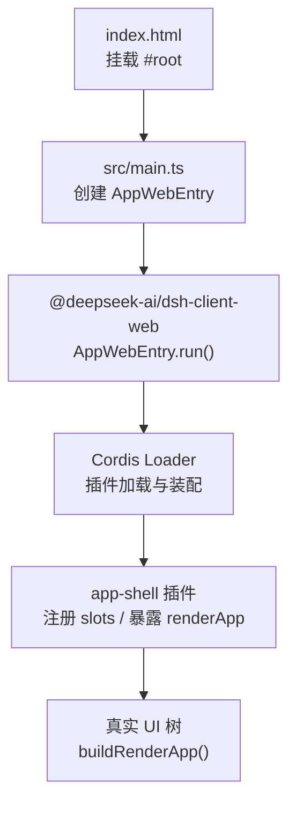
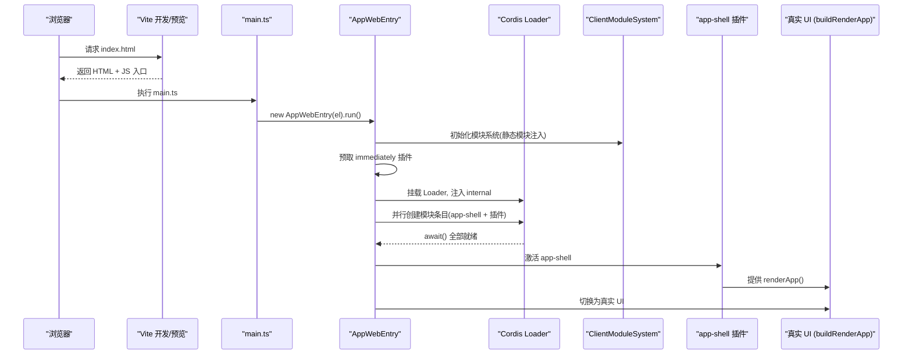
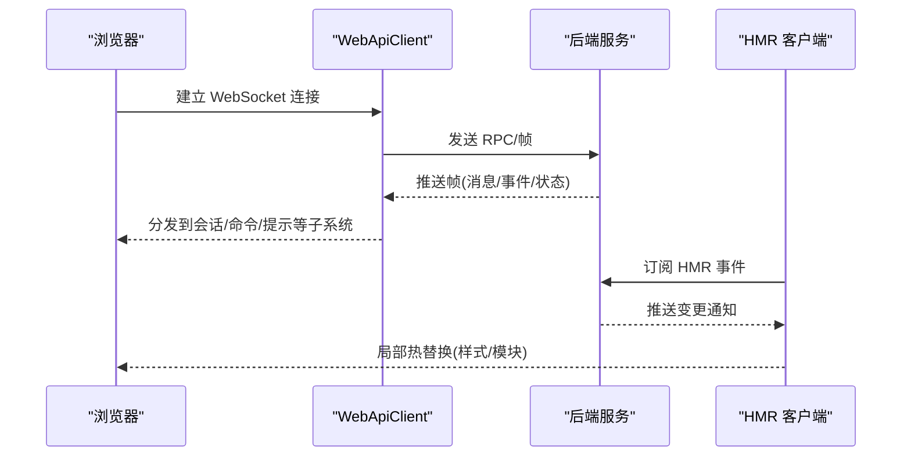
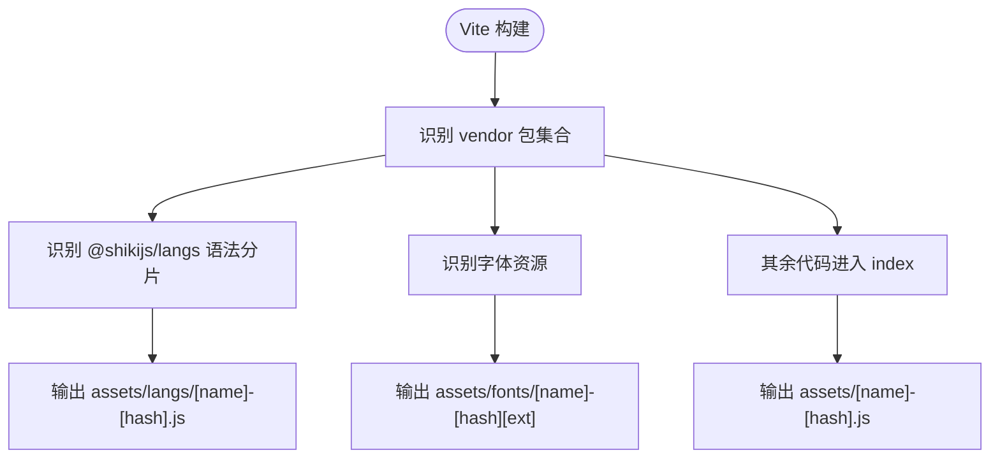
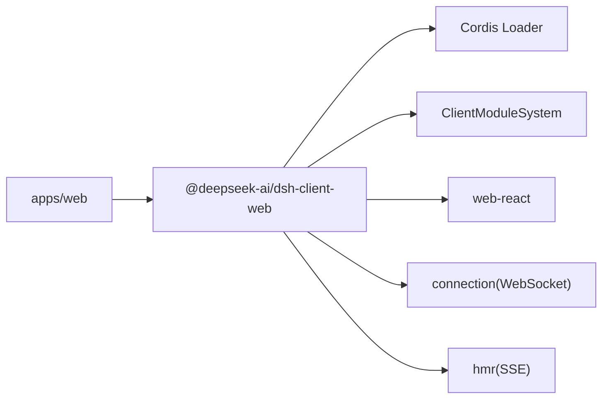

# Web 前端应用

<cite>
**本文引用的文件**
- [apps/web/package.json](file://apps/web/package.json)
- [apps/web/vite.config.ts](file://apps/web/vite.config.ts)
- [apps/web/src/main.ts](file://apps/web/src/main.ts)
- [apps/web/index.html](file://apps/web/index.html)
- [packages/client/web/src/boot.tsx](file://packages/client/web/src/boot.tsx)
- [packages/client/web/src/AppRoot.tsx](file://packages/client/web/src/AppRoot.tsx)
- [packages/client/web/src/app-shell.ts](file://packages/client/web/src/app-shell.ts)
- [packages/client/web/src/app.tsx](file://packages/client/web/src/app.tsx)
- [packages/client/connection/src/client/web-api-client.ts](file://packages/client/connection/src/client/web-api-client.ts)
- [packages/client/hmr/src/client/index.ts](file://packages/client/hmr/src/client/index.ts)
</cite>

## 目录
1. [简介](#简介)
2. [项目结构](#项目结构)
3. [核心组件](#核心组件)
4. [架构总览](#架构总览)
5. [详细组件分析](#详细组件分析)
6. [依赖关系分析](#依赖关系分析)
7. [性能考虑](#性能考虑)
8. [故障排查指南](#故障排查指南)
9. [结论](#结论)
10. [附录](#附录)

## 简介
本文件面向 DeepSeek Harness Web 前端应用，聚焦基于 Vite 的前端架构、模块组织与构建配置；说明 Web 界面启动流程、开发环境与生产部署；解释与后端服务的通信机制、实时数据更新与用户交互处理；梳理前端组件结构、状态管理与性能优化策略；并提供开发指南与自定义扩展方法。

## 项目结构
Web 前端位于 apps/web，采用“薄入口 + 壳库”的组织方式：
- index.html 提供挂载点与 PWA 清单。
- src/main.ts 仅负责查找 #root 并启动 AppWebEntry。
- vite.config.ts 定义插件、分包策略、资源路由与别名，确保 shell 自足且插件按需加载。
- 实际 UI 与运行时由 packages/client/web 提供的壳库承担，apps/web 不直接持有业务逻辑。

**图表来源**
- [apps/web/index.html:1-15](file://apps/web/index.html#L1-L15)
- [apps/web/src/main.ts:1-11](file://apps/web/src/main.ts#L1-L11)
- [packages/client/web/src/boot.tsx:1-239](file://packages/client/web/src/boot.tsx#L1-L239)
- [packages/client/web/src/app-shell.ts:1-51](file://packages/client/web/src/app-shell.ts#L1-L51)
- [packages/client/web/src/app.tsx:1-45](file://packages/client/web/src/app.tsx#L1-L45)

**章节来源**
- [apps/web/package.json:1-52](file://apps/web/package.json#L1-L52)
- [apps/web/vite.config.ts:1-161](file://apps/web/vite.config.ts#L1-L161)
- [apps/web/index.html:1-15](file://apps/web/index.html#L1-L15)
- [apps/web/src/main.ts:1-11](file://apps/web/src/main.ts#L1-L11)

## 核心组件
- AppWebEntry（壳启动器）：解析引导清单、初始化模块系统、预取 immediately 插件、挂载 Loader、创建图条目、全量激活后切换至真实 UI。
- AppRoot（启动门控）：在 boot 完成前显示加载/失败页，完成后渲染真实 UI。
- app-shell（装配插件）：安装插槽渲染器，提供 renderApp 工厂，将布局根槽挂载到 UI 树。
- buildRenderApp（真实 UI 装配）：绑定会话标题、渲染 root 插槽，作为唯一 ctx 级 renderSlot 调用点。

这些组件共同实现“壳自足、插件可插拔、UI 延迟装配”的启动模型。

**章节来源**
- [packages/client/web/src/boot.tsx:1-239](file://packages/client/web/src/boot.tsx#L1-L239)
- [packages/client/web/src/AppRoot.tsx:1-61](file://packages/client/web/src/AppRoot.tsx#L1-L61)
- [packages/client/web/src/app-shell.ts:1-51](file://packages/client/web/src/app-shell.ts#L1-L51)
- [packages/client/web/src/app.tsx:1-45](file://packages/client/web/src/app.tsx#L1-L45)

## 架构总览
下图展示从浏览器请求到 UI 渲染的关键路径，以及插件系统与模块系统的协作。

**图表来源**
- [apps/web/src/main.ts:1-11](file://apps/web/src/main.ts#L1-L11)
- [packages/client/web/src/boot.tsx:1-239](file://packages/client/web/src/boot.tsx#L1-L239)
- [packages/client/web/src/app-shell.ts:1-51](file://packages/client/web/src/app-shell.ts#L1-L51)
- [packages/client/web/src/app.tsx:1-45](file://packages/client/web/src/app.tsx#L1-L45)

## 详细组件分析

### 启动器 AppWebEntry
职责
- 解析 window.__DSH_BOOT__ 引导清单。
- 建立 ClientModuleSystem，注册壳自有模块与 modules 包。
- 预取 immediately 插件，避免同步 require 边在材料化时阻塞。
- 挂载 Cordis Loader，注入 internal，创建所有图条目并等待激活。
- 通过信号驱动 AppRoot 从加载页切换到真实 UI。

关键流程
- 预取 immediately 插件：并行 prefetch，失败静默吞掉，避免单点失败阻断整体启动。
- 创建条目顺序：先 modules，再各插件，最后 app-shell，保证服务可用时序。
- 全量扫描：await 后检查每个条目的 fiber 状态，非 active 则汇总失败原因并抛出。

错误与健壮性
- 启动失败停留在加载页，展示 per-entry 状态与错误摘要。
- 禁止独立 Vite serve：防止无引导清单的裸壳被直接访问。

**章节来源**
- [packages/client/web/src/boot.tsx:1-239](file://packages/client/web/src/boot.tsx#L1-L239)
- [apps/web/vite.config.ts:11-19](file://apps/web/vite.config.ts#L11-L19)

### 启动门控 AppRoot
职责
- 订阅内核信号（settled/status/error），在 boot 完成前显示加载或失败信息。
- 完成后调用 renderApp 渲染真实 UI。

设计要点
- 纯壳组件，零插件依赖，确保失败报告自身可靠。
- 使用外部存储订阅模式与 React 集成。

**章节来源**
- [packages/client/web/src/AppRoot.tsx:1-61](file://packages/client/web/src/AppRoot.tsx#L1-L61)

### 装配插件 app-shell
职责
- 安装插槽渲染器。
- 提供 appShell.renderApp 工厂，首次渲染时构建一次真实 UI 树。

注入与契约
- 注入 slots/sessions/layout 服务，确保 UI 装配所需上下文就绪。
- 通过 Context 扩展声明 appShell 服务类型。

**章节来源**
- [packages/client/web/src/app-shell.ts:1-51](file://packages/client/web/src/app-shell.ts#L1-L51)

### 真实 UI 装配 buildRenderApp
职责
- 绑定当前会话标题到文档标题。
- 通过 ctx.slots.renderSlot('root', {}) 挂载布局根槽，内部再渲染子槽。

约束
- 该函数是程序中唯一的 ctx 级 renderSlot 调用点，保持 UI 装配集中可控。

**章节来源**
- [packages/client/web/src/app.tsx:1-45](file://packages/client/web/src/app.tsx#L1-L45)

### 与后端通信与实时更新
- WebSocket 下行：客户端通过 WebSocket 建立长连接，解析帧并投递到上层事件流，支持重连与错误处理。
- 连接选择：根据页面 URL 参数选择真实客户端或测试夹具，便于本地调试。
- HMR 热更新：HMR 插件订阅 SSE 事件，按插件粒度替换样式与模块，无需整页刷新。

**图表来源**
- [packages/client/connection/src/client/web-api-client.ts:34-68](file://packages/client/connection/src/client/web-api-client.ts#L34-L68)
- [packages/client/hmr/src/client/index.ts:69-102](file://packages/client/hmr/src/client/index.ts#L69-L102)

**章节来源**
- [packages/client/connection/src/client/web-api-client.ts:34-68](file://packages/client/connection/src/client/web-api-client.ts#L34-L68)
- [packages/client/hmr/src/client/index.ts:69-102](file://packages/client/hmr/src/client/index.ts#L69-L102)

### 构建与分包策略（Vite）
- 强制非独立运行：拒绝 standalone serve，要求通过 dsh web 启动，确保引导清单存在。
- 分包策略：
  - vendor 包：数学、语法高亮、Markdown 解析等重型且低频变动的第三方库。
  - langs 包：@shikijs/langs 的语法分片，懒加载。
  - fonts 包：KaTeX 字体资源归类。
  - 源码与壳代码默认进入 index 包，编辑 shell 代码不影响 vendor 缓存。
- 资源路由：assets/fonts、assets/langs 等目录规则明确，利于 CDN 缓存。
- 别名与 define：将 Node-only 模块替换为 stub，屏蔽 process.env 分支，使 vendored loader 在浏览器中安全运行。

**图表来源**
- [apps/web/vite.config.ts:21-77](file://apps/web/vite.config.ts#L21-L77)
- [apps/web/vite.config.ts:92-127](file://apps/web/vite.config.ts#L92-L127)
- [apps/web/vite.config.ts:129-159](file://apps/web/vite.config.ts#L129-L159)

**章节来源**
- [apps/web/vite.config.ts:1-161](file://apps/web/vite.config.ts#L1-L161)

## 依赖关系分析
- apps/web 仅依赖 React、React DOM 与 dsh-client-web 壳库；业务 UI 以插件形式动态加载。
- 壳库依赖 Cordis 框架、React DOM 与内部模块系统；通过 app-shell 装配 UI。
- 连接层依赖浏览器 WebSocket；HMR 依赖 SSE 事件通道。

**图表来源**
- [apps/web/package.json:28-49](file://apps/web/package.json#L28-L49)
- [packages/client/web/src/index.ts:1-20](file://packages/client/web/src/index.ts#L1-L20)
- [packages/client/connection/src/client/web-api-client.ts:34-68](file://packages/client/connection/src/client/web-api-client.ts#L34-L68)
- [packages/client/hmr/src/client/index.ts:69-102](file://packages/client/hmr/src/client/index.ts#L69-L102)

**章节来源**
- [apps/web/package.json:1-52](file://apps/web/package.json#L1-L52)
- [packages/client/web/src/index.ts:1-20](file://packages/client/web/src/index.ts#L1-L20)

## 性能考虑
- 分包与缓存
  - 将变动频率低的第三方库放入 vendor，减少主包抖动。
  - 语法高亮与 Markdown 相关资源拆分，按需懒加载。
  - 字体资源独立目录，便于 CDN 长期缓存。
- 启动优化
  - immediately 插件预取，避免材料化时的同步阻塞。
  - 并行创建图条目，最大化网络并发。
  - 启动失败停留在加载页，避免部分 UI 闪烁。
- 运行时优化
  - 通过 slots 与快照选择器最小化重渲染范围。
  - HMR 按插件粒度热替换，缩短反馈周期。
- 构建产物
  - 开启 sourcemap，便于线上问题定位。
  - 严格区分 vendor/langs/fonts/index，提升缓存命中率。

[本节为通用指导，不直接分析具体文件]

## 故障排查指南
- 无法独立启动 Vite
  - 现象：直接运行 Vite dev/preview 报错。
  - 原因：apps/web 不是独立应用，需要宿主注入引导清单。
  - 解决：通过 dsh web 启动；开发模式下配合 dev:web 进行插件 HMR。
- 启动失败停留在加载页
  - 现象：显示“Failed to load plugins”，列出失败条目与错误信息。
  - 排查：查看控制台导入错误；确认 immediately 预取是否成功；检查 app-shell 是否激活。
- WebSocket 连接异常
  - 现象：消息不更新或频繁断开。
  - 排查：检查协议升级、代理设置；确认服务端地址与端口；观察客户端日志中的帧解析错误。
- HMR 不生效
  - 现象：修改插件未热更新。
  - 排查：确认 SSE 事件通道可达；检查插件条目是否在 loader 中；确认样式标签 data-plugin 匹配。

**章节来源**
- [apps/web/vite.config.ts:11-19](file://apps/web/vite.config.ts#L11-L19)
- [packages/client/web/src/AppRoot.tsx:28-61](file://packages/client/web/src/AppRoot.tsx#L28-L61)
- [packages/client/connection/src/client/web-api-client.ts:34-68](file://packages/client/connection/src/client/web-api-client.ts#L34-L68)
- [packages/client/hmr/src/client/index.ts:69-102](file://packages/client/hmr/src/client/index.ts#L69-L102)

## 结论
DeepSeek Harness Web 采用“薄入口 + 壳库 + 插件化”的架构，借助 Vite 的分包与资源路由能力，结合 Cordis 的模块系统与 HMR，实现了高内聚、低耦合、可扩展的前端体系。启动流程清晰、错误可见性强；通信层基于 WebSocket 提供实时数据；UI 通过 slots 与快照选择器实现高效渲染。遵循本文的开发与排障建议，可快速定位问题并稳定扩展功能。

[本节为总结，不直接分析具体文件]

## 附录

### 开发环境
- 启动
  - 通过 dsh web 启动，确保引导清单注入。
  - 开发模式下同时运行 dev:web，以便插件 bundle 重建与 HMR。
- 本地调试
  - 使用 ?fixture 参数切换测试客户端，便于离线验证。
  - 关注控制台与加载页的错误摘要，快速定位失败的插件条目。

**章节来源**
- [apps/web/vite.config.ts:11-19](file://apps/web/vite.config.ts#L11-L19)
- [packages/client/connection/tests/client-apply.client.spec.ts:57-85](file://packages/client/connection/tests/client-apply.client.spec.ts#L57-L85)

### 生产部署
- 构建
  - 运行 pnpm build，产出 dist 静态资源。
  - 产物包含 index/vendor/langs/fonts 等目录，便于 CDN 缓存。
- 发布
  - 由宿主服务提供 index.html 与引导清单，并按约定路径托管静态资源。
  - 确保 WebSocket 与 SSE 通道可达。

**章节来源**
- [apps/web/package.json:22-26](file://apps/web/package.json#L22-L26)
- [apps/web/vite.config.ts:92-127](file://apps/web/vite.config.ts#L92-L127)

### 自定义扩展方法
- 新增 UI 功能
  - 新建插件包，声明 dsh.client 与 inject 拓扑，编写 src/client 下的浏览器侧逻辑。
  - 通过 slots 注册与渲染新区域，避免全局导出组件。
- 新增插槽
  - 合并 SlotMap 契约，在父级 entry 的 children 中声明，并通过 renderSlot 渲染。
- 消费新帧类型
  - 传输型帧走 Session 的 dispatch switch；主机级帧走 Manager 路由表；对话业务事件走 Definition + 视图渲染。
- 状态位置
  - 业务数据（事件、流式累积、待处理）置于对象层；父级知晓的状态通过 owner props 传递；组件私有状态限于组件；跨条目共享状态使用 store。
- 通知通道
  - 帧驱动/异步使用 markDirty 批处理；用户手势回显需同 tick 时使用 notifyNow。

**章节来源**
- [packages/client/AGENTS.md:38-48](file://packages/client/AGENTS.md#L38-L48)
- [packages/client/web/src/app.tsx:1-45](file://packages/client/web/src/app.tsx#L1-L45)