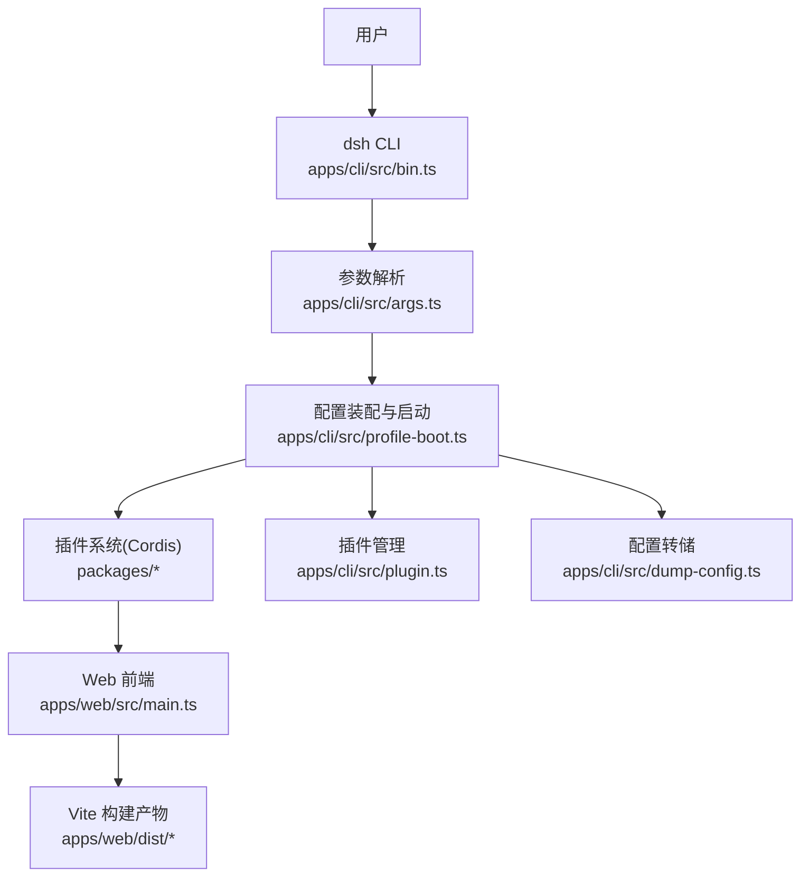
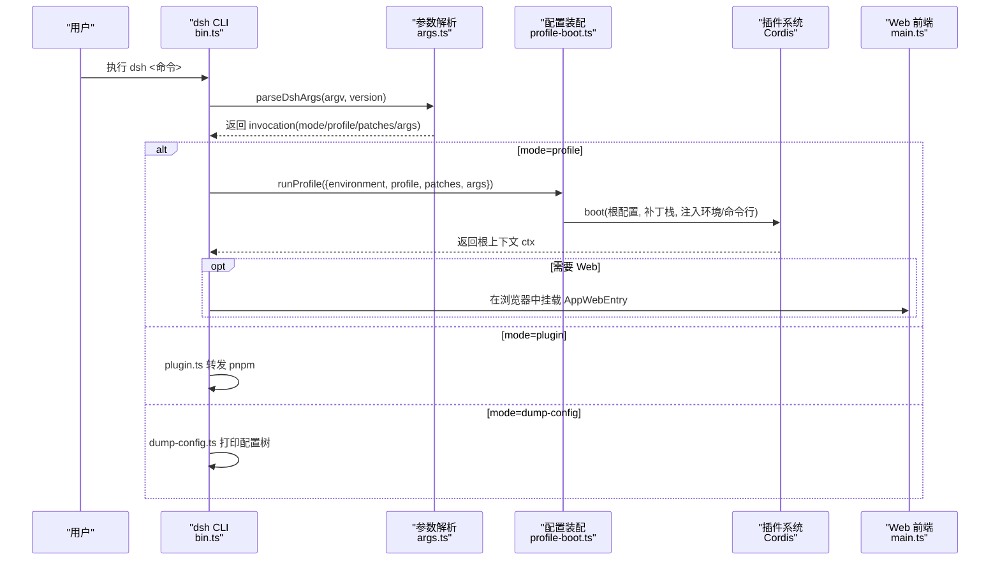
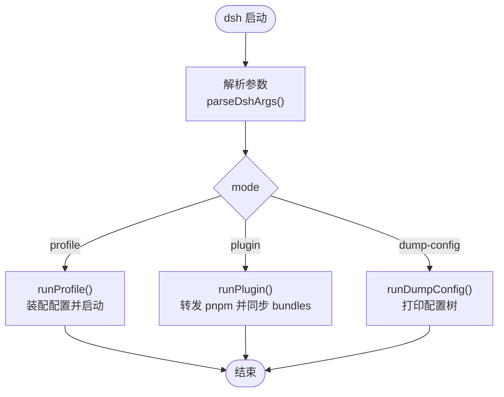
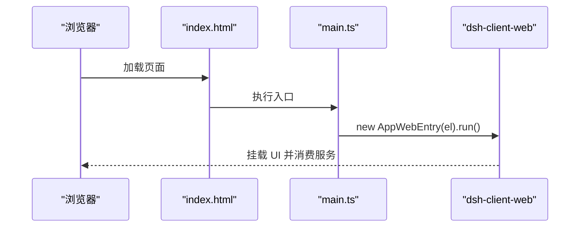
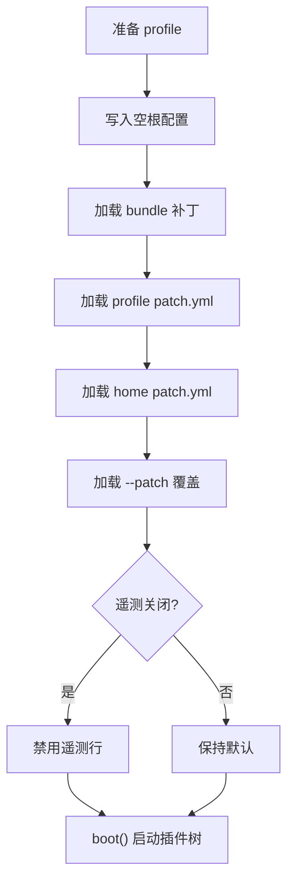
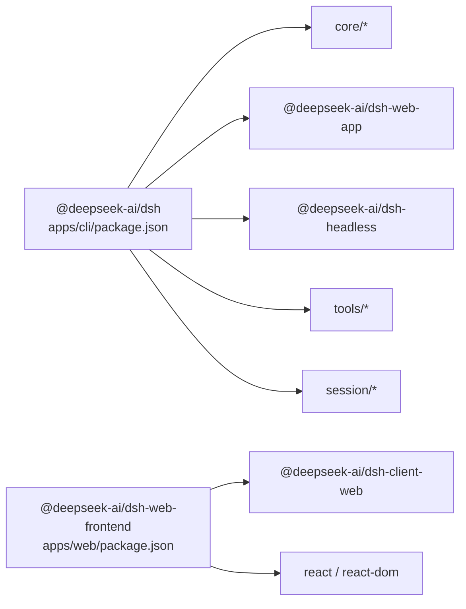

# 应用程序层

<cite>
**本文引用的文件**
- [apps/cli/src/bin.ts](file://apps/cli/src/bin.ts)
- [apps/cli/src/args.ts](file://apps/cli/src/args.ts)
- [apps/cli/src/profile-boot.ts](file://apps/cli/src/profile-boot.ts)
- [apps/cli/src/plugin.ts](file://apps/cli/src/plugin.ts)
- [apps/cli/src/dump-config.ts](file://apps/cli/src/dump-config.ts)
- [apps/cli/package.json](file://apps/cli/package.json)
- [apps/web/src/main.ts](file://apps/web/src/main.ts)
- [apps/web/vite.config.ts](file://apps/web/vite.config.ts)
- [apps/web/package.json](file://apps/web/package.json)
- [docs/architecture.md](file://docs/architecture.md)
</cite>

## 目录
1. [简介](#简介)
2. [项目结构](#项目结构)
3. [核心组件](#核心组件)
4. [架构总览](#架构总览)
5. [详细组件分析](#详细组件分析)
6. [依赖关系分析](#依赖关系分析)
7. [性能考虑](#性能考虑)
8. [故障排查指南](#故障排查指南)
9. [结论](#结论)
10. [附录](#附录)

## 简介
本章节面向 DeepSeek Harness 的应用程序层，聚焦 CLI 命令行界面与 Web 前端应用的设计、启动流程、配置加载与服务发现机制，并说明不同运行模式（Web UI、CLI/TUI、无头模式）的特点与使用场景。同时给出扩展点与自定义选项、部署与配置指导，帮助读者在不深入源码的情况下也能理解与应用该层。

## 项目结构
应用程序层由两个主要入口组成：
- CLI 应用：负责解析命令、选择并启动“配置文件（profile）”，组装插件树，提供插件管理与配置转储能力。
- Web 前端应用：基于 Vite 构建的浏览器应用，通过 dsh web 启动时由 CLI 提供的宿主环境进行挂载与运行。

图表来源
- [apps/cli/src/bin.ts:1-54](file://apps/cli/src/bin.ts#L1-L54)
- [apps/cli/src/args.ts:1-192](file://apps/cli/src/args.ts#L1-L192)
- [apps/cli/src/profile-boot.ts:1-301](file://apps/cli/src/profile-boot.ts#L1-L301)
- [apps/web/src/main.ts:1-11](file://apps/web/src/main.ts#L1-L11)
- [apps/web/vite.config.ts:1-161](file://apps/web/vite.config.ts#L1-L161)

章节来源
- [apps/cli/src/bin.ts:1-54](file://apps/cli/src/bin.ts#L1-L54)
- [apps/cli/src/args.ts:1-192](file://apps/cli/src/args.ts#L1-L192)
- [apps/cli/src/profile-boot.ts:1-301](file://apps/cli/src/profile-boot.ts#L1-L301)
- [apps/web/src/main.ts:1-11](file://apps/web/src/main.ts#L1-L11)
- [apps/web/vite.config.ts:1-161](file://apps/web/vite.config.ts#L1-L161)

## 核心组件
- CLI 入口与路由：bin.ts 根据解析出的模式动态加载 profile、plugin、dump-config 等子模块，避免无关代码进入执行路径。
- 参数解析：args.ts 统一解析 dsh 命令，支持 --profile、--patch、--dump-config、web 别名、plugin 子命令等，并将剩余参数透传给被启动的应用。
- 配置装配与启动：profile-boot.ts 负责加载 profile、组合补丁层（bundles、profile patch、home patch、--patch overlays、遥测开关）、注入环境与命令行上下文、安装失败即停策略与进程退出控制，并监听用户补丁热重载。
- 插件管理：plugin.ts 将 pnpm 操作转发到 profile 目录，并在成功后根据已安装包是否声明 bundle 来同步 dsh.profile.bundles 列表。
- 配置转储：dump-config.ts 在不启动应用的前提下渲染最终配置树，便于诊断与对比。
- Web 前端：main.ts 仅做最小引导，查找挂载节点并初始化 AppWebEntry；vite.config.ts 定义构建、分包、资源组织与开发保护（禁止独立 serve）。

章节来源
- [apps/cli/src/bin.ts:1-54](file://apps/cli/src/bin.ts#L1-L54)
- [apps/cli/src/args.ts:1-192](file://apps/cli/src/args.ts#L1-L192)
- [apps/cli/src/profile-boot.ts:1-301](file://apps/cli/src/profile-boot.ts#L1-L301)
- [apps/cli/src/plugin.ts:1-159](file://apps/cli/src/plugin.ts#L1-L159)
- [apps/cli/src/dump-config.ts:1-54](file://apps/cli/src/dump-config.ts#L1-L54)
- [apps/web/src/main.ts:1-11](file://apps/web/src/main.ts#L1-L11)
- [apps/web/vite.config.ts:1-161](file://apps/web/vite.config.ts#L1-L161)

## 架构总览
DeepSeek Harness 以 Cordis 插件框架为基础，所有功能都是可插拔的插件。应用程序层通过“配置文件（profile）+ 补丁层（bundle/patch）”的方式组合出运行时插件树。CLI 负责解析命令、装配配置、启动服务；Web 前端作为浏览器端应用，在宿主环境中挂载并消费服务。

图表来源
- [apps/cli/src/bin.ts:1-54](file://apps/cli/src/bin.ts#L1-L54)
- [apps/cli/src/args.ts:1-192](file://apps/cli/src/args.ts#L1-L192)
- [apps/cli/src/profile-boot.ts:1-301](file://apps/cli/src/profile-boot.ts#L1-L301)
- [apps/web/src/main.ts:1-11](file://apps/web/src/main.ts#L1-L11)

## 详细组件分析

### CLI 命令行界面
- 入口与分发：bin.ts 读取版本、解析参数，按模式动态导入并执行 profile、plugin、dump-config。
- 参数解析：args.ts 使用 Commander 统一处理 launcher 标志与子命令，将未知参数透传给被启动的应用；web 是 --profile web 的别名；plugin 子命令用于管理 profile 的插件依赖。
- 行为要点：
  - 帮助与版本：-h/--help 与 -V/--version 由解析器处理并直接退出。
  - 参数边界：launcher 标志优先，首个不识别的 token 开始应用参数。
  - 错误处理：解析错误或非法参数会输出诊断并以非零码退出。

图表来源
- [apps/cli/src/bin.ts:1-54](file://apps/cli/src/bin.ts#L1-L54)
- [apps/cli/src/args.ts:1-192](file://apps/cli/src/args.ts#L1-L192)
- [apps/cli/src/plugin.ts:1-159](file://apps/cli/src/plugin.ts#L1-L159)
- [apps/cli/src/dump-config.ts:1-54](file://apps/cli/src/dump-config.ts#L1-L54)

章节来源
- [apps/cli/src/bin.ts:1-54](file://apps/cli/src/bin.ts#L1-L54)
- [apps/cli/src/args.ts:1-192](file://apps/cli/src/args.ts#L1-L192)

### Web 前端应用
- 引导逻辑：main.ts 仅负责查找 #root 并创建 AppWebEntry 实例后运行，其余加载、模块表填充、AppRoot 门控、插件装配均在客户端壳库中完成。
- 构建与开发：
  - vite.config.ts 禁止独立 serve 模式，要求通过 dsh web 启动以获得正确的宿主环境。
  - 手动分包 vendor/index/langs/fonts，优化首屏与缓存命中。
  - 通过 alias/define 将 Node-only 模块替换为浏览器兼容实现，屏蔽内部 Node 探针。

图表来源
- [apps/web/src/main.ts:1-11](file://apps/web/src/main.ts#L1-L11)
- [apps/web/vite.config.ts:1-161](file://apps/web/vite.config.ts#L1-L161)

章节来源
- [apps/web/src/main.ts:1-11](file://apps/web/src/main.ts#L1-L11)
- [apps/web/vite.config.ts:1-161](file://apps/web/vite.config.ts#L1-L161)

### 启动流程、配置加载与服务发现
- 启动流程：
  - bin.ts 解析 argv，选择模式并调用对应 runner。
  - profile-boot.ts 准备 profile、写入空根配置、组合补丁栈、注入环境与命令行上下文、安装 fail-loud 与进程退出控制器，并可选启用 HMR 监听用户补丁。
- 配置加载顺序（从低到高优先级）：
  - 每个 bundle 的补丁（按 dsh.profile.bundles 顺序）
  - profile 自身的 cordis.patch.yml
  - 家目录级 cordis.patch.yml（$DSH_HOME/cordis.patch.yml）
  - --patch 覆盖文件
  - 遥测开关（DSH_TELEMETRY_DISABLED）
- 服务发现：
  - 通过 Cordis Loader 与 Include 插件，按 id 定位行并替换或插入新行。
  - 启动时将环境快照与命令行上下文注入到 ctx，供任意插件读取。

图表来源
- [apps/cli/src/profile-boot.ts:1-301](file://apps/cli/src/profile-boot.ts#L1-L301)

章节来源
- [apps/cli/src/profile-boot.ts:1-301](file://apps/cli/src/profile-boot.ts#L1-L301)

### 运行模式与使用场景
- Web UI 模式：
  - 通过 dsh web 启动，适合交互式开发与调试，提供浏览器界面与实时反馈。
  - 构建产物由 Vite 生成，静态资源由宿主服务提供。
- CLI/TUI 模式：
  - 通过 dsh --profile tui 启动（需安装相应 profile），适合终端交互与脚本化任务。
- 无头模式：
  - 通过 dsh --profile headless 启动，一次性执行任务后退出，适合自动化与批处理。
- 插件管理：
  - dsh plugin --profile <name> <pnpm args> 在 profile 目录执行 pnpm，并自动同步 dsh.profile.bundles。

章节来源
- [apps/cli/README.md:1-48](file://apps/cli/README.md#L1-L48)
- [apps/cli/src/args.ts:1-192](file://apps/cli/src/args.ts#L1-L192)
- [apps/cli/src/plugin.ts:1-159](file://apps/cli/src/plugin.ts#L1-L159)

### 扩展点与自定义选项
- 补丁层扩展：
  - 通过 bundle 与 patch.yml 对任意行进行替换或插入，实现能力切换与定制。
- 环境变量：
  - DSH_TELEMETRY_DISABLED：非空即禁用遥测行。
  - DSH_HOME：决定 profile 与家目录补丁位置。
- 命令行：
  - --profile、--patch、--dump-config、--dump-default-config、web 别名、plugin 子命令。
- 插件体系：
  - 通过 Cordis 注册服务、事件、效果；新增模型适配器、工具、持久化、沙箱、审批策略等均通过插件方式接入。

章节来源
- [apps/cli/src/profile-boot.ts:1-301](file://apps/cli/src/profile-boot.ts#L1-L301)
- [docs/architecture.md:1-130](file://docs/architecture.md#L1-L130)

### 部署与配置指导
- 生产运行：
  - 先分别构建 CLI 包与前端产物，再通过 dsh 命令运行。
  - 使用 dsh web 启动 Web 模式，确保宿主环境正确注入。
- 配置检查：
  - 使用 --dump-default-config 查看打包层默认配置。
  - 使用 --dump-config 查看包含用户层与覆盖后的完整配置树。
- 插件管理：
  - 使用 dsh plugin 添加/移除/查询 profile 插件，并自动维护 bundles 列表。
- 安全与健壮性：
  - 安装 fail-loud 与进程退出控制器，确保异常快速失败与可控退出。
  - 遥测可通过环境变量关闭。

章节来源
- [apps/cli/README.md:1-48](file://apps/cli/README.md#L1-L48)
- [apps/cli/src/dump-config.ts:1-54](file://apps/cli/src/dump-config.ts#L1-L54)
- [apps/cli/src/profile-boot.ts:1-301](file://apps/cli/src/profile-boot.ts#L1-L301)

## 依赖关系分析
- CLI 包依赖：
  - 大量 workspace 包参与组合，包括基础能力、Web 应用、无头运行、终端、工具集、会话投影、技能、计划、工作流等。
- Web 前端依赖：
  - 依赖 React 与 dsh-client-web 壳库；开发依赖包含 Vite、Playwright、TypeScript 等。
- 构建与运行：
  - Vite 配置将 Node-only 模块替换为浏览器兼容实现，并通过 define 屏蔽内部探针。
  - 分包策略将重型渲染依赖放入 vendor，语法高亮语言按需懒加载。

图表来源
- [apps/cli/package.json:1-102](file://apps/cli/package.json#L1-L102)
- [apps/web/package.json:1-52](file://apps/web/package.json#L1-L52)

章节来源
- [apps/cli/package.json:1-102](file://apps/cli/package.json#L1-L102)
- [apps/web/package.json:1-52](file://apps/web/package.json#L1-L52)

## 性能考虑
- 启动性能：
  - 动态导入各模式模块，减少无关代码进入执行路径。
  - 配置装配阶段只解析必要层，避免过早评估。
- 构建性能：
  - Vite 手动分包将重型依赖隔离到 vendor，提升缓存命中率。
  - 语法高亮语言按需懒加载，减少初始包体积。
- 运行时性能：
  - 通过补丁层精确替换行，避免全量重写配置带来的开销。
  - 遥测可关闭以减少额外开销。

[本节为通用性能建议，不直接分析具体文件]

## 故障排查指南
- 无法独立启动 Web：
  - 若直接使用 Vite serve，会被拒绝并提示通过 dsh web 启动。
- 插件安装失败：
  - 检查 pnpm 是否在 PATH；git 托管插件可能需要在 pnpm-workspace.yaml 中允许 prepare 脚本。
- 配置不一致：
  - 使用 --dump-default-config 与 --dump-config 对比差异，定位用户层或覆盖层问题。
- 遥测相关：
  - 设置 DSH_TELEMETRY_DISABLED 为非空值以禁用遥测行。
- 进程退出：
  - 安装 fail-loud 与进程退出控制器，SIGTERM/SIGINT 会触发受控清理。

章节来源
- [apps/web/vite.config.ts:1-161](file://apps/web/vite.config.ts#L1-L161)
- [apps/cli/src/plugin.ts:1-159](file://apps/cli/src/plugin.ts#L1-L159)
- [apps/cli/src/dump-config.ts:1-54](file://apps/cli/src/dump-config.ts#L1-L54)
- [apps/cli/src/profile-boot.ts:1-301](file://apps/cli/src/profile-boot.ts#L1-L301)

## 结论
DeepSeek Harness 的应用程序层以 CLI 为统一入口，通过 profile 与补丁层组合出灵活的插件树，支撑 Web UI、CLI/TUI 与无头模式等多种运行形态。其设计强调可观测性（配置转储）、可扩展性（插件体系）与可运维性（环境变量与进程控制）。借助文档化的扩展点与清晰的启动流程，用户可以高效地定制与部署所需能力。

[本节为总结性内容，不直接分析具体文件]

## 附录
- 参考文档：
  - 架构总览与扩展点映射见 docs/architecture.md。
  - CLI 行为参考与源执行约定见 apps/cli/reference/README.md。

章节来源
- [docs/architecture.md:1-130](file://docs/architecture.md#L1-L130)
- [apps/cli/reference/README.md:13-19](file://apps/cli/reference/README.md#L13-L19)