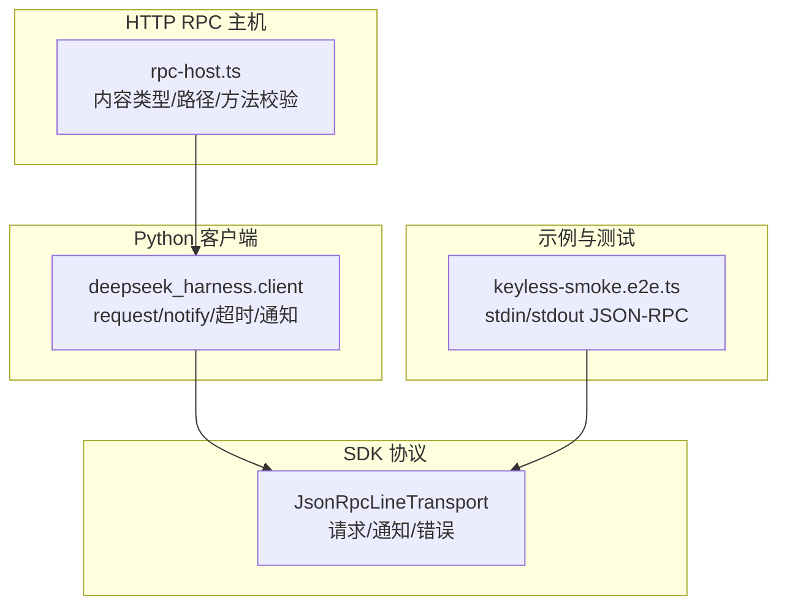
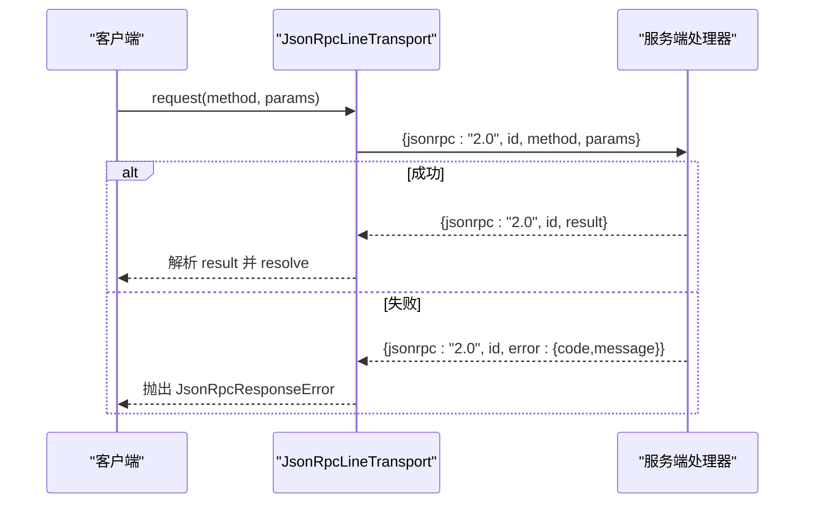
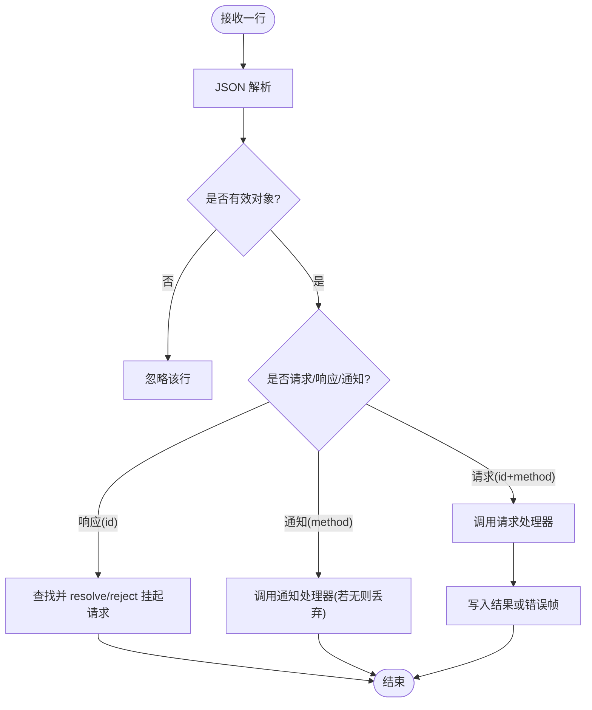
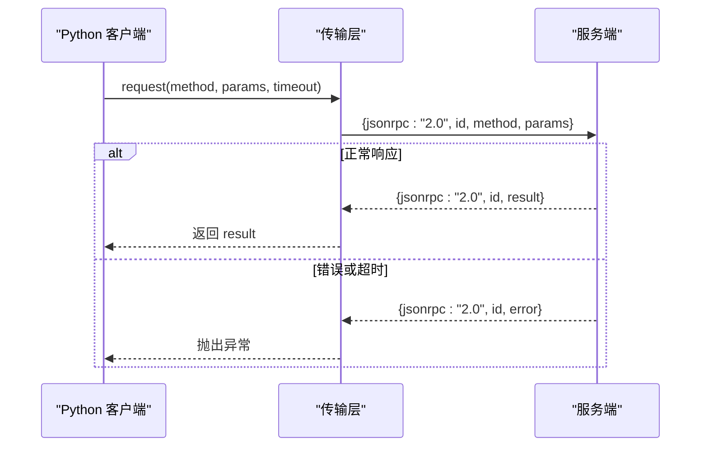
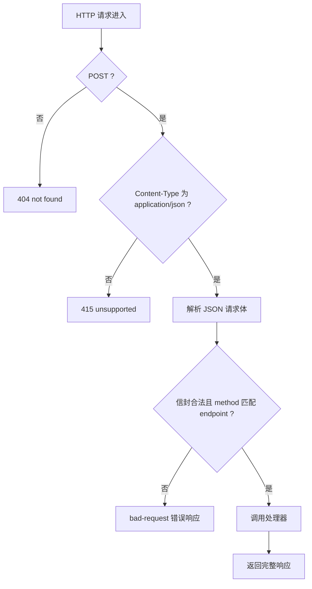
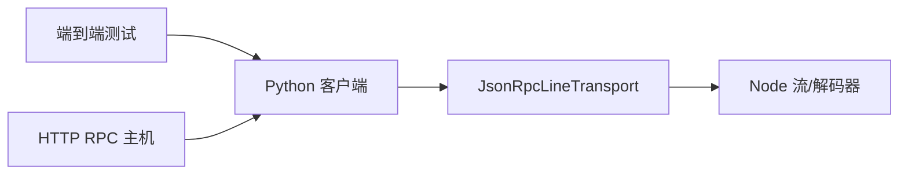

# JSON-RPC 协议

<cite>
**本文引用的文件**
- [packages/sdk/protocol/src/transport.ts](file://packages/sdk/protocol/src/transport.ts)
- [packages/sdk/protocol/README.md](file://packages/sdk/protocol/README.md)
- [python/sdk/src/deepseek_harness/client.py](file://python/sdk/src/deepseek_harness/client.py)
- [examples/jsonrpc-agent/tests/keyless-smoke.e2e.ts](file://examples/jsonrpc-agent/tests/keyless-smoke.e2e.ts)
- [packages/host/apiproxy/tests/rpc-schemas.spec.ts](file://packages/host/apiproxy/tests/rpc-schemas.spec.ts)
- [packages/client/connection/src/rpc-host.ts](file://packages/client/connection/src/rpc-host.ts)
</cite>

## 目录
1. [简介](#简介)
2. [项目结构](#项目结构)
3. [核心组件](#核心组件)
4. [架构总览](#架构总览)
5. [详细组件分析](#详细组件分析)
6. [依赖关系分析](#依赖关系分析)
7. [性能考量](#性能考量)
8. [故障排查指南](#故障排查指南)
9. [结论](#结论)
10. [附录](#附录)

## 简介
本文件为 DeepSeek Harness SDK 使用的 JSON-RPC 2.0 协议技术文档。该协议以“按行分隔的 JSON”（每行一个紧凑 JSON 帧）在字节流上承载，支持请求-响应、通知以及错误处理。服务端与客户端共享同一套消息类型定义，确保两端对方法名、参数和结果的结构达成一致。当前实现未进行协议版本协商，处于预发布阶段；连接生命周期通过进程关闭或显式关闭传输来管理。

## 项目结构
- 协议传输层：基于 Node.js 流的 JSON-RPC 2.0 行帧解析与发送，提供请求、通知、错误处理与挂起请求管理。
- Python 客户端：封装了请求、通知、超时与通知订阅等能力，并负责将响应反序列化为模型对象。
- 示例与测试：端到端测试展示了通过标准输入输出驱动 JSON-RPC 会话，包括初始化、会话提示、事件通知与关机流程。
- 安全与路由：HTTP 通道上的 RPC 主机负责校验内容类型、路径与方法匹配，并提供拦截器机制。

**图示来源**
- [packages/sdk/protocol/src/transport.ts:1-280](file://packages/sdk/protocol/src/transport.ts#L1-L280)
- [python/sdk/src/deepseek_harness/client.py:157-258](file://python/sdk/src/deepseek_harness/client.py#L157-L258)
- [examples/jsonrpc-agent/tests/keyless-smoke.e2e.ts:105-159](file://examples/jsonrpc-agent/tests/keyless-smoke.e2e.ts#L105-L159)
- [packages/client/connection/src/rpc-host.ts:144-218](file://packages/client/connection/src/rpc-host.ts#L144-L218)

**章节来源**
- [packages/sdk/protocol/README.md:1-40](file://packages/sdk/protocol/README.md#L1-L40)

## 核心组件
- JsonRpcLineTransport：实现 JSON-RPC 2.0 的按行帧解析、请求-响应关联、通知分发、错误映射与挂起请求清理。
- Python 客户端：提供 request/notify/next_notification 等高层 API，封装超时、通知过滤与订阅、响应模型校验。
- HTTP RPC 主机：在 Web 环境中对入站请求进行内容类型、路径与方法匹配校验，并将结果包装为标准响应。

**章节来源**
- [packages/sdk/protocol/src/transport.ts:62-268](file://packages/sdk/protocol/src/transport.ts#L62-L268)
- [python/sdk/src/deepseek_harness/client.py:157-258](file://python/sdk/src/deepseek_harness/client.py#L157-L258)
- [packages/client/connection/src/rpc-host.ts:144-218](file://packages/client/connection/src/rpc-host.ts#L144-L218)

## 架构总览
协议采用“请求-响应 + 通知”的双向通信模式：
- 请求-响应：客户端发送包含 id 与 method 的请求帧，服务端返回对应 id 的结果或错误帧。
- 通知：仅含 method 的帧，无 id，不期望响应。
- 错误：服务端在处理请求时抛出异常会转换为 JSON-RPC 错误帧；客户端收到后将拒绝对应的 Promise。

**图示来源**
- [packages/sdk/protocol/src/transport.ts:121-156](file://packages/sdk/protocol/src/transport.ts#L121-L156)
- [packages/sdk/protocol/src/transport.ts:201-238](file://packages/sdk/protocol/src/transport.ts#L201-L238)
- [packages/sdk/protocol/src/transport.ts:240-258](file://packages/sdk/protocol/src/transport.ts#L240-L258)

## 详细组件分析

### 传输层：JsonRpcLineTransport
- 帧格式：每行一个紧凑 JSON，字段遵循 JSON-RPC 2.0 约定（jsonrpc、id、method、params、result、error）。
- 请求-响应：维护 pending 映射，使用唯一 id 关联请求与响应；支持 AbortSignal 取消。
- 通知：仅含 method 的帧，调用已注册的 notificationHandler；无 handler 时丢弃。
- 错误处理：缺失请求处理器返回 -32601；处理器抛错返回 -32603；客户端收到错误帧后抛出携带 code/message/data 的异常。
- 健壮性：忽略非法 JSON 行；UTF-8 多字节跨缓冲正确拼接；关闭时清理所有挂起请求。

**图示来源**
- [packages/sdk/protocol/src/transport.ts:175-238](file://packages/sdk/protocol/src/transport.ts#L175-L238)
- [packages/sdk/protocol/src/transport.ts:240-268](file://packages/sdk/protocol/src/transport.ts#L240-L268)

**章节来源**
- [packages/sdk/protocol/src/transport.ts:62-268](file://packages/sdk/protocol/src/transport.ts#L62-L268)

### Python 客户端：请求、通知与超时
- 请求：生成唯一 id，构造 JSON-RPC 请求帧，等待响应并按模型校验。
- 通知：构造不含 id 的通知帧，可选附带 params。
- 超时：可配置全局或单次请求超时；超时后清理挂起状态。
- 通知订阅：支持一次性回调或订阅过滤器，临时订阅在请求完成后自动关闭。

**图示来源**
- [python/sdk/src/deepseek_harness/client.py:157-258](file://python/sdk/src/deepseek_harness/client.py#L157-L258)
- [packages/sdk/protocol/src/transport.ts:121-156](file://packages/sdk/protocol/src/transport.ts#L121-L156)

**章节来源**
- [python/sdk/src/deepseek_harness/client.py:157-258](file://python/sdk/src/deepseek_harness/client.py#L157-L258)

### HTTP RPC 主机：安全与路由
- 内容类型校验：仅接受 application/json。
- 路径与方法匹配：从 URL 路径提取 endpoint，校验请求体中的 method 与 endpoint 一致。
- 错误响应：无效信封或方法不匹配返回结构化错误；处理器异常返回 500。
- 拦截器：允许注册针对特定通道的拦截器，统一处理鉴权与审计。

**图示来源**
- [packages/client/connection/src/rpc-host.ts:144-218](file://packages/client/connection/src/rpc-host.ts#L144-L218)

**章节来源**
- [packages/client/connection/src/rpc-host.ts:90-141](file://packages/client/connection/src/rpc-host.ts#L90-L141)
- [packages/client/connection/src/rpc-host.ts:144-218](file://packages/client/connection/src/rpc-host.ts#L144-L218)

## 依赖关系分析
- 传输层依赖 Node.js 流与字符串解码器，保证 UTF-8 安全与行帧边界。
- Python 客户端依赖队列与锁实现请求-响应关联与通知并发安全。
- 端到端测试验证 stdout/stderr 分离与 JSON-RPC 帧纯净性。
- HTTP RPC 主机依赖路由与内容类型校验，保障外部接入安全。

**图示来源**
- [packages/sdk/protocol/src/transport.ts:9-12](file://packages/sdk/protocol/src/transport.ts#L9-L12)
- [python/sdk/src/deepseek_harness/client.py:157-258](file://python/sdk/src/deepseek_harness/client.py#L157-L258)
- [examples/jsonrpc-agent/tests/keyless-smoke.e2e.ts:105-159](file://examples/jsonrpc-agent/tests/keyless-smoke.e2e.ts#L105-L159)
- [packages/client/connection/src/rpc-host.ts:144-218](file://packages/client/connection/src/rpc-host.ts#L144-L218)

**章节来源**
- [packages/sdk/protocol/src/transport.ts:1-280](file://packages/sdk/protocol/src/transport.ts#L1-L280)
- [python/sdk/src/deepseek_harness/client.py:157-258](file://python/sdk/src/deepseek_harness/client.py#L157-L258)
- [examples/jsonrpc-agent/tests/keyless-smoke.e2e.ts:105-159](file://examples/jsonrpc-agent/tests/keyless-smoke.e2e.ts#L105-L159)
- [packages/client/connection/src/rpc-host.ts:144-218](file://packages/client/connection/src/rpc-host.ts#L144-L218)

## 性能考量
- 帧大小与序列化开销：保持 JSON 紧凑，避免多余字段；批量通知建议合并以减少帧数。
- 背压与流控：利用底层流的 backpressure，必要时使用 flush 同步写回。
- 挂起请求内存：及时取消或超时清理，避免泄漏；AbortSignal 用于快速释放资源。
- 错误快速失败：无效帧直接忽略，减少无效处理路径。

[本节为通用指导，无需具体文件引用]

## 故障排查指南
- 方法未找到：服务端未注册对应请求处理器时返回 -32601；检查方法名与注册逻辑。
- 处理器异常：返回 -32603；捕获并记录异常堆栈，确认参数合法性。
- 非 JSON 或空帧：被忽略；检查对端是否输出调试信息到 stdout。
- 响应丢失：检查 id 是否匹配、是否重复消费或提前关闭传输。
- 内容类型错误：HTTP 通道需 application/json；否则返回 415。
- 方法不匹配：URL 路径与请求体 method 不一致将返回 bad-request。

**章节来源**
- [packages/sdk/protocol/src/transport.ts:226-238](file://packages/sdk/protocol/src/transport.ts#L226-L238)
- [packages/sdk/protocol/src/transport.ts:240-258](file://packages/sdk/protocol/src/transport.ts#L240-L258)
- [packages/host/apiproxy/tests/rpc-schemas.spec.ts:85-101](file://packages/host/apiproxy/tests/rpc-schemas.spec.ts#L85-L101)
- [packages/client/connection/src/rpc-host.ts:155-178](file://packages/client/connection/src/rpc-host.ts#L155-L178)

## 结论
该 JSON-RPC 协议以简洁可靠的行帧方式实现了请求-响应与通知机制，具备完善的错误处理与健壮性设计。当前版本未进行协议版本协商，处于预发布阶段；连接生命周期通过进程关闭或显式关闭传输管理。建议在集成时严格遵循内容类型、路径与方法匹配规则，并结合超时与取消策略提升稳定性。

[本节为总结性内容，无需具体文件引用]

## 附录

### 协议握手与生命周期
- 握手：initialize 请求携带 serverInfo.version；当前实现不进行版本协商，客户端应容忍未知版本。
- 生命周期：通过 shutdown 请求触发优雅关闭；若未收到响应，可通过关闭进程终止会话。
- 通知：session.event、session.status、subagent.started/finished 等由服务端主动推送。

**章节来源**
- [packages/sdk/protocol/README.md:15-25](file://packages/sdk/protocol/README.md#L15-L25)
- [packages/sdk/protocol/README.md:35-40](file://packages/sdk/protocol/README.md#L35-L40)

### 消息格式与数据类型
- 请求帧：包含 jsonrpc、id、method、可选 params。
- 响应帧：包含 jsonrpc、id、result 或 error。
- 通知帧：包含 jsonrpc、method、可选 params。
- 错误码：-32601（方法未找到）、-32603（内部错误）；HTTP 通道额外包含 bad-request、unsupported media type 等。

**章节来源**
- [packages/sdk/protocol/src/transport.ts:121-156](file://packages/sdk/protocol/src/transport.ts#L121-L156)
- [packages/sdk/protocol/src/transport.ts:226-258](file://packages/sdk/protocol/src/transport.ts#L226-L258)
- [packages/client/connection/src/rpc-host.ts:155-178](file://packages/client/connection/src/rpc-host.ts#L155-L178)

### 完整消息示例（路径引用）
- 请求示例：见端到端测试中发送 initialize、session/prompt、shutdown 等请求的片段。
- 响应示例：见测试中对 shutdown 响应的断言。
- 通知示例：见测试中 session.event、session.status 等通知的断言。

**章节来源**
- [examples/jsonrpc-agent/tests/keyless-smoke.e2e.ts:105-159](file://examples/jsonrpc-agent/tests/keyless-smoke.e2e.ts#L105-L159)

### 序列化最佳实践
- 使用紧凑 JSON，避免多余空白。
- 参数规范化：非对象参数将被归一化为空对象；数组与标量不会作为 params 传递。
- UTF-8 安全：传输层正确处理多字节字符跨缓冲边界。
- 错误数据：保留 wire 层的 code、message、data 以便上层诊断。

**章节来源**
- [packages/sdk/protocol/src/transport.ts:271-274](file://packages/sdk/protocol/src/transport.ts#L271-L274)
- [packages/sdk/protocol/src/transport.ts:240-258](file://packages/sdk/protocol/src/transport.ts#L240-L258)

### 安全考虑
- 内容类型：HTTP 通道仅接受 application/json。
- 路径与方法：严格校验 URL 路径与方法一致性，防止越权调用。
- 信任域：根据 authority 控制可信主机列表，限制跨域访问。
- 错误最小化：对外错误不包含敏感信息，内部异常仅在日志中记录。

**章节来源**
- [packages/client/connection/src/rpc-host.ts:97-115](file://packages/client/connection/src/rpc-host.ts#L97-L115)
- [packages/client/connection/src/rpc-host.ts:155-178](file://packages/client/connection/src/rpc-host.ts#L155-L178)

### 版本兼容性策略
- 当前无协议版本协商；initialize 携带 serverInfo.version 但不强制校验。
- 预发布阶段不承诺向后兼容；升级时需关注方法名与载荷变更。
- 服务器→客户端请求能力存在但未启用；未来可用于审批流程。

**章节来源**
- [packages/sdk/protocol/README.md:35-40](file://packages/sdk/protocol/README.md#L35-L40)

### 不同语言客户端集成指南
- TypeScript：使用 JsonRpcLineTransport 的 request/notify 接口，结合 AbortSignal 实现取消与超时。
- Python：使用 deepseek_harness.client 的 request/notify/next_notification，配合 response_model 进行响应校验。
- 其他语言：遵循 JSON-RPC 2.0 行帧规范，实现 id 关联与通知处理；注意参数规范化与错误映射。

**章节来源**
- [packages/sdk/protocol/src/transport.ts:121-156](file://packages/sdk/protocol/src/transport.ts#L121-L156)
- [python/sdk/src/deepseek_harness/client.py:157-258](file://python/sdk/src/deepseek_harness/client.py#L157-L258)