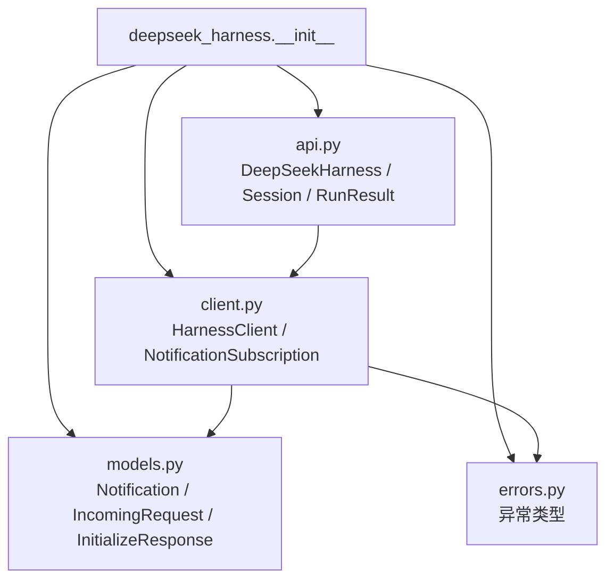
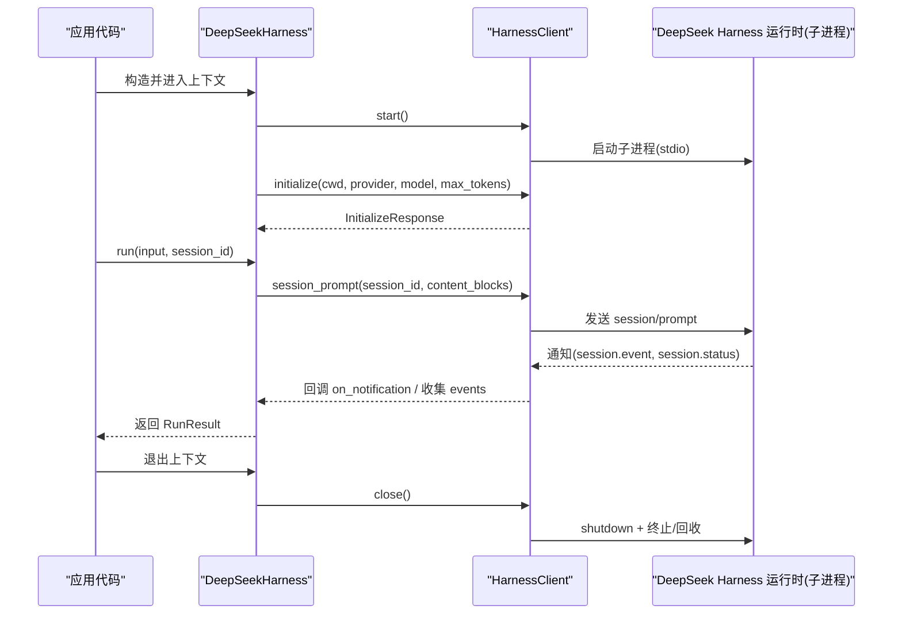
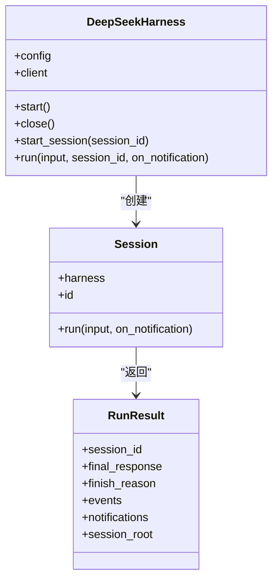
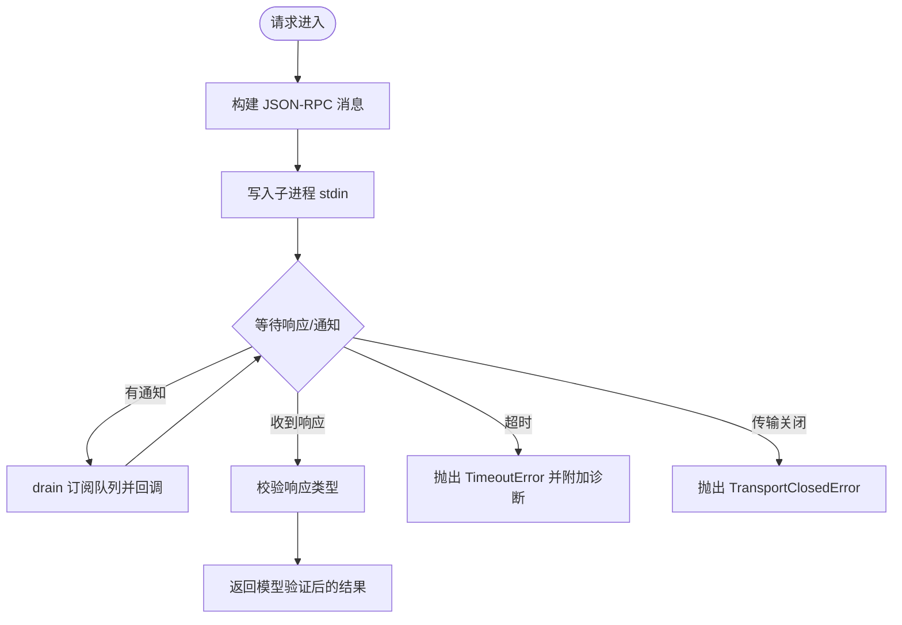
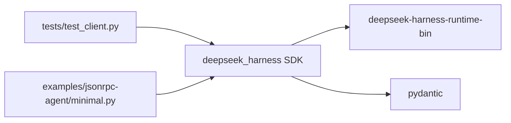

# Python SDK

<cite>
**本文引用的文件**
- [__init__.py](file://python/sdk/src/deepseek_harness/__init__.py)
- [api.py](file://python/sdk/src/deepseek_harness/api.py)
- [client.py](file://python/sdk/src/deepseek_harness/client.py)
- [models.py](file://python/sdk/src/deepseek_harness/models.py)
- [errors.py](file://python/sdk/src/deepseek_harness/errors.py)
- [README.md](file://python/sdk/README.md)
- [pyproject.toml](file://python/sdk/pyproject.toml)
- [test_client.py](file://python/sdk/tests/test_client.py)
- [minimal.py](file://examples/jsonrpc-agent/minimal.py)
- [manual_sdk_agent_smoke.py](file://python/sdk/tests/manual_sdk_agent_smoke.py)
</cite>

## 目录
1. [简介](#简介)
2. [项目结构](#项目结构)
3. [安装与配置](#安装与配置)
4. [核心组件](#核心组件)
5. [架构总览](#架构总览)
6. [详细组件分析](#详细组件分析)
7. [依赖关系分析](#依赖关系分析)
8. [性能与超时](#性能与超时)
9. [错误处理与调试](#错误处理与调试)
10. [常见问题排查](#常见问题排查)
11. [结论](#结论)
12. [附录：公共 API 参考](#附录公共-api-参考)

## 简介
本仓库提供 DeepSeek Harness 的 Python SDK，用于通过 JSON-RPC over stdio 驱动本地或远程的 DeepSeek Harness 运行时进程。SDK 暴露高层易用接口（会话、运行任务）和底层客户端能力（请求/通知、订阅、桥接请求转发），并内置子进程生命周期管理、通知路由、会话树追踪、超时与关闭策略等。

## 项目结构
Python SDK 位于 python/sdk/src/deepseek_harness，主要模块如下：
- __init__.py：统一导出公共类型与类
- api.py：高层 API（DeepSeekHarness、Session、RunResult）
- client.py：低层 JSON-RPC 客户端（HarnessClient）、通知订阅、子进程通信
- models.py：通用数据模型（Notification、IncomingRequest、InitializeResponse 等）
- errors.py：异常体系（TransportClosedError、JsonRpcError、SdkProtocolError 等）

**图表来源**
- [__init__.py:1-19](file://python/sdk/src/deepseek_harness/__init__.py#L1-L19)
- [api.py:13-125](file://python/sdk/src/deepseek_harness/api.py#L13-L125)
- [client.py:24-58](file://python/sdk/src/deepseek_harness/client.py#L24-L58)
- [models.py:13-33](file://python/sdk/src/deepseek_harness/models.py#L13-L33)
- [errors.py:4-24](file://python/sdk/src/deepseek_harness/errors.py#L4-L24)

**章节来源**
- [__init__.py:1-19](file://python/sdk/src/deepseek_harness/__init__.py#L1-L19)
- [api.py:13-125](file://python/sdk/src/deepseek_harness/api.py#L13-L125)
- [client.py:24-58](file://python/sdk/src/deepseek_harness/client.py#L24-L58)
- [models.py:13-33](file://python/sdk/src/deepseek_harness/models.py#L13-L33)
- [errors.py:4-24](file://python/sdk/src/deepseek_harness/errors.py#L4-L24)

## 安装与配置
- 安装方式：通过 pip 安装 deepseek-harness-sdk，该包会附带同版本 runtime 二进制，无需额外安装 Node 环境即可运行。
- 环境变量：默认继承调用方环境，支持 DEEPSEEK_BASE_URL、DEEPSEEK_API_KEY；可通过配置注入 DSH_CWD、DSH_SESSION_ROOT、DSH_CORDIS_CONFIG 等。
- 工作目录与会话根：cwd 指定 agent 可访问的工作区；session_root 指定会话日志与状态存储位置。
- 自定义运行时：可通过 launch_args_override、runtime_bin、bridge_bin 指定启动参数或可执行路径；未显式设置时自动解析打包的运行时。

**章节来源**
- [README.md:10-52](file://python/sdk/README.md#L10-L52)
- [api.py:13-83](file://python/sdk/src/deepseek_harness/api.py#L13-L83)
- [client.py:24-35](file://python/sdk/src/deepseek_harness/client.py#L24-L35)
- [client.py:424-454](file://python/sdk/src/deepseek_harness/client.py#L424-L454)

## 核心组件
- DeepSeekHarness：高层入口，负责启动/初始化运行时、创建会话、执行任务并返回结果。
- Session：封装一次会话的运行周期，收集事件与通知，等待空闲结束。
- HarnessClient：低层 JSON-RPC 客户端，维护子进程、读写消息、请求/响应、通知订阅与路由。
- NotificationSubscription：通知订阅句柄，支持过滤、批量消费与上下文管理。
- RunResult：单次 run 的结果，包含最终回复、结束原因、事件列表、通知列表与会话根。

**章节来源**
- [api.py:13-183](file://python/sdk/src/deepseek_harness/api.py#L13-L183)
- [client.py:37-214](file://python/sdk/src/deepseek_harness/client.py#L37-L214)
- [client.py:507-546](file://python/sdk/src/deepseek_harness/client.py#L507-L546)

## 架构总览
SDK 以“进程内 Python 对象 + 外部运行时子进程”的方式协作。Python 侧通过标准输入输出进行 JSON-RPC 通信，内部线程负责读取 stdout/stderr 并分发消息。

**图表来源**
- [api.py:97-125](file://python/sdk/src/deepseek_harness/api.py#L97-L125)
- [api.py:132-183](file://python/sdk/src/deepseek_harness/api.py#L132-L183)
- [client.py:63-116](file://python/sdk/src/deepseek_harness/client.py#L63-L116)
- [client.py:117-155](file://python/sdk/src/deepseek_harness/client.py#L117-L155)

## 详细组件分析

### 高层 API：DeepSeekHarness 与 Session
- DeepSeekHarness
  - 作用：封装运行时生命周期与初始化，提供 run/start_session 等便捷方法。
  - 关键行为：
    - 懒启动：首次调用 start() 才启动子进程并执行 initialize。
    - 环境变量注入：将 cwd、session_root、cordis、base_url、api_key 等转为环境变量传递给运行时。
    - 上下文管理：支持 with 语句确保资源释放。
- Session
  - 作用：围绕一个 session_id 组织一次完整的交互周期。
  - 关键行为：
    - 标准化输入：字符串或内容块列表均可。
    - 订阅会话及后代通知：自动跟踪 subagent.started/finished 建立父子关系。
    - 等待结束：直到收到 idle 状态，提取最后 assistant/message 文本作为 final_response，以及最后一个 turn/end 的 reason.kind 作为 finish_reason。
- RunResult
  - 字段：session_id、final_response、finish_reason、events、notifications、session_root。
  - 语义：events 仅包含根会话事件；notifications 包含根会话及其已知后代的完整通知序列。

**图表来源**
- [api.py:13-125](file://python/sdk/src/deepseek_harness/api.py#L13-L125)
- [api.py:127-183](file://python/sdk/src/deepseek_harness/api.py#L127-L183)
- [api.py:38-46](file://python/sdk/src/deepseek_harness/api.py#L38-L46)

**章节来源**
- [api.py:13-183](file://python/sdk/src/deepseek_harness/api.py#L13-L183)

### 低层客户端：HarnessClient
- 子进程管理
  - start/close：启动子进程，启动 reader/stderr 线程；shutdown 请求失败也会尝试关闭 stdin、terminate/kill 并回收。
  - 诊断信息：在关闭或超时时附加 stderr 尾部与退出码便于定位问题。
- JSON-RPC 请求/响应
  - request/_request_raw：为每个请求分配唯一 id，维护 waiter 队列，支持超时与通知并行处理。
  - notify/respond/respond_error：无返回值的通知与请求响应。
- 通知系统
  - next_notification/subscribe_notifications/subscribe_session_notifications：全局与按会话的通知订阅；支持过滤器与批量 drain。
  - 会话树追踪：基于 subagent.started/finished 记录父子关系，实现跨订阅的祖先关系保持。
- 桥接请求
  - next_request/respond：当运行时向客户端发起请求（如 llm.request），可由应用处理并回写结果。

**图表来源**
- [client.py:157-296](file://python/sdk/src/deepseek_harness/client.py#L157-L296)
- [client.py:298-342](file://python/sdk/src/deepseek_harness/client.py#L298-L342)
- [client.py:343-397](file://python/sdk/src/deepseek_harness/client.py#L343-L397)
- [client.py:403-422](file://python/sdk/src/deepseek_harness/client.py#L403-L422)

**章节来源**
- [client.py:37-558](file://python/sdk/src/deepseek_harness/client.py#L37-L558)

### 数据模型与协议
- Notification：表示一条通知（method + payload）。
- IncomingRequest：表示来自运行时的请求（id + method + payload）。
- InitializeResponse：initialize 响应，包含 serverInfo。
- JsonValue/JsonObject：JSON 值与对象的类型别名，贯穿整个 SDK。

**章节来源**
- [models.py:8-33](file://python/sdk/src/deepseek_harness/models.py#L8-L33)

## 依赖关系分析
- 运行时绑定：SDK 依赖 deepseek-harness-runtime-bin，安装时自动获取对应平台 wheel。
- 配置注入：当使用打包运行时且未显式覆盖 cordis/config 时，SDK 自动注入打包默认配置路径到 DSH_CORDIS_CONFIG。
- 测试与示例：tests 中通过 launch_args_override 指向 fake_runtime/fake_bridge 脚本模拟运行时行为；examples/jsonrpc-agent/minimal.py 展示最小可用用法。

**图表来源**
- [pyproject.toml:5-16](file://python/sdk/pyproject.toml#L5-L16)
- [client.py:424-436](file://python/sdk/src/deepseek_harness/client.py#L424-L436)
- [test_client.py:15-125](file://python/sdk/tests/test_client.py#L15-L125)
- [minimal.py:16-39](file://examples/jsonrpc-agent/minimal.py#L16-L39)

**章节来源**
- [pyproject.toml:5-16](file://python/sdk/pyproject.toml#L5-L16)
- [client.py:424-454](file://python/sdk/src/deepseek_harness/client.py#L424-L454)
- [test_client.py:15-125](file://python/sdk/tests/test_client.py#L15-L125)
- [minimal.py:16-39](file://examples/jsonrpc-agent/minimal.py#L16-L39)

## 性能与超时
- 请求超时：request_timeout_seconds 控制单个请求等待响应的最长时间；超时时会抛出 TimeoutError 并附带 stderr 尾部与退出码。
- 关闭超时：shutdown_timeout_seconds 控制 shutdown 请求与进程回收的等待时间；超时后会强制 kill。
- 并发与线程：reader/stderr 为守护线程；请求/通知通过队列与锁保护，避免竞态。
- 通知批处理：drain 允许一次性消费多个通知，减少阻塞等待。

**章节来源**
- [client.py:63-116](file://python/sdk/src/deepseek_harness/client.py#L63-L116)
- [client.py:228-296](file://python/sdk/src/deepseek_harness/client.py#L228-L296)
- [client.py:403-422](file://python/sdk/src/deepseek_harness/client.py#L403-L422)

## 错误处理与调试
- 异常类型
  - HarnessError：基础异常。
  - TransportClosedError：运行时子进程退出或 stdout 关闭。
  - SdkProtocolError：运行时发送不符合 SDK 协议的数据（例如 turn/end 缺少 reason.kind）。
  - JsonRpcError：运行时返回 JSON-RPC error 响应，包含 code、message、data。
- 常见错误场景
  - 初始化失败：initialize 返回 error 时，客户端会关闭子进程并抛出异常。
  - 请求超时：长时间无响应时抛出 TimeoutError，并附带诊断信息。
  - 传输关闭：写入失败或子进程退出时抛出 TransportClosedError。
  - 协议违规：turn/end 缺少 data.reason.kind 时抛出 SdkProtocolError。
- 调试技巧
  - 捕获 stderr 尾部：TransportClosedError 与 TimeoutError 中包含 stderr 尾部与退出码。
  - 使用 on_notification：在 run 中注册回调，观察 session.event、session.status、subagent.* 等事件顺序。
  - 使用 subscribe_session_notifications：精确订阅某会话及其后代的通知，避免污染其他会话。
  - 使用 next_request/respond：当运行时发起桥接请求（如 llm.request），可在客户端处理并回写结果。

**章节来源**
- [errors.py:4-24](file://python/sdk/src/deepseek_harness/errors.py#L4-L24)
- [client.py:87-116](file://python/sdk/src/deepseek_harness/client.py#L87-L116)
- [client.py:228-296](file://python/sdk/src/deepseek_harness/client.py#L228-L296)
- [api.py:225-243](file://python/sdk/src/deepseek_harness/api.py#L225-L243)
- [test_client.py:720-800](file://python/sdk/tests/test_client.py#L720-L800)

## 常见问题排查
- 无法找到运行时：若未设置 runtime_bin/bridge_bin/launch_args_override，且 deepseek-harness-runtime-bin 未安装，会抛出 FileNotFoundError。
- 初始化失败：检查 provider/model 是否在 Cordis 配置中注册；确认 DEEPSEEK_API_KEY/DEEPSEEK_BASE_URL 是否正确。
- 会话无响应：确认 session_id 一致；检查是否收到 agent/inbox/spliced 回执与 session.status=idle。
- 通知丢失：确保使用 subscribe_session_notifications 订阅当前会话；注意 subagent.started/finished 会建立父子关系。
- 超时过长：调整 request_timeout_seconds；查看 stderr 尾部与退出码定位卡点。
- 关闭不生效：调整 shutdown_timeout_seconds；必要时手动 kill 子进程。

**章节来源**
- [client.py:424-436](file://python/sdk/src/deepseek_harness/client.py#L424-L436)
- [client.py:117-136](file://python/sdk/src/deepseek_harness/client.py#L117-L136)
- [api.py:132-183](file://python/sdk/src/deepseek_harness/api.py#L132-L183)
- [test_client.py:720-800](file://python/sdk/tests/test_client.py#L720-L800)

## 结论
DeepSeek Harness Python SDK 提供了从高层到低层的完整能力：高层 API 简化了会话与任务执行，低层客户端实现了健壮的 JSON-RPC 通信、通知订阅与子进程管理。通过合理的配置与错误处理，可以在生产环境中稳定地驱动 Agent 完成复杂任务。

## 附录：公共 API 参考

### DeepSeekHarnessConfig
- 字段
  - provider：模型提供商名称（默认 deepseek-official）
  - model：模型标识（默认 deepseek-v4-flash）
  - max_tokens：可选每请求最大 token 数
  - cwd：工作目录（绝对路径）
  - runtime_cwd：运行时子进程工作目录（默认与 cwd 相同）
  - session_root：会话持久化根目录
  - cordis：Cordis 配置文件路径
  - env：注入到子进程的环境变量
  - runtime_bin/bridge_bin/launch_args_override：运行时可执行或启动参数覆盖
  - request_timeout_seconds/shutdown_timeout_seconds：请求与关闭超时
  - base_url/api_key：等价于设置 DEEPSEEK_BASE_URL/DEEPSEEK_API_KEY

**章节来源**
- [api.py:13-36](file://python/sdk/src/deepseek_harness/api.py#L13-L36)

### DeepSeekHarness
- 方法
  - start()：懒启动并 initialize
  - close()：关闭运行时
  - start_session(session_id=None)：创建 Session
  - run(input, session_id=None, on_notification=None)：执行一次任务并返回 RunResult
  - client：暴露底层 HarnessClient

**章节来源**
- [api.py:48-125](file://python/sdk/src/deepseek_harness/api.py#L48-L125)

### Session
- 方法
  - run(input, on_notification=None)：执行会话任务，返回 RunResult

**章节来源**
- [api.py:127-183](file://python/sdk/src/deepseek_harness/api.py#L127-L183)

### RunResult
- 字段
  - session_id：会话标识
  - final_response：最后一次 assistant/message 文本拼接
  - finish_reason：最后一个 turn/end 的 reason.kind（可能为 None）
  - events：根会话事件列表
  - notifications：根会话及已知后代的通知列表
  - session_root：会话根目录

**章节来源**
- [api.py:38-46](file://python/sdk/src/deepseek_harness/api.py#L38-L46)

### HarnessConfig
- 字段
  - runtime_bin/bridge_bin：运行时可执行或桥接可执行
  - launch_args_override：覆盖启动参数
  - cwd/env：子进程工作目录与环境变量
  - request_timeout_seconds/shutdown_timeout_seconds：请求与关闭超时

**章节来源**
- [client.py:24-35](file://python/sdk/src/deepseek_harness/client.py#L24-L35)

### HarnessClient
- 方法
  - start()/close()：子进程生命周期
  - initialize(cwd, provider, model, max_tokens=None)：初始化运行时
  - session_prompt(session_id, content_blocks, on_notification=None, notification_subscription=None)：提交 prompt，返回 messageId
  - request(method, params, response_model, timeout_seconds=None, on_notification=None, notification_filter=None, notification_subscription=None)：通用 JSON-RPC 请求
  - notify(method, params=None)：发送通知
  - next_notification()/next_request()/respond()/respond_error()：处理通知与桥接请求
  - subscribe_notifications(notification_filter=None)/subscribe_session_notifications(session_id)：订阅通知
  - _default_launch_args()/ _inject_bundled_default_config()：运行时解析与配置注入

**章节来源**
- [client.py:37-558](file://python/sdk/src/deepseek_harness/client.py#L37-L558)

### NotificationSubscription
- 方法
  - close()：关闭订阅
  - next()：阻塞获取下一条通知
  - drain(on_notification)：非阻塞批量消费通知

**章节来源**
- [client.py:507-546](file://python/sdk/src/deepseek_harness/client.py#L507-L546)

### 模型与类型
- Notification：{method, payload}
- IncomingRequest：{id, method, payload}
- InitializeResponse：{serverInfo}
- JsonValue/JsonObject：JSON 值与对象类型别名

**章节来源**
- [models.py:8-33](file://python/sdk/src/deepseek_harness/models.py#L8-L33)

### 异步操作支持说明
- 当前 SDK 为同步设计：所有 I/O（子进程读写、请求等待）均为阻塞式。
- 通知处理：通过 on_notification 回调与 NotificationSubscription.drain 实现“伪异步”的事件驱动体验。
- 如需真正的异步，请在应用层使用线程或进程包装同步 SDK，或将 HarnessClient 集成到异步事件循环中自行编排。

**章节来源**
- [client.py:157-296](file://python/sdk/src/deepseek_harness/client.py#L157-L296)
- [client.py:507-546](file://python/sdk/src/deepseek_harness/client.py#L507-L546)

### 基本用法示例（路径引用）
- 最小示例：参见 examples/jsonrpc-agent/minimal.py，演示如何传入 workspace、session_root、provider、model、max_tokens 并执行 run。
- 端到端冒烟测试：参见 python/sdk/tests/manual_sdk_agent_smoke.py，演示如何通过 mock HTTP 服务与 bundled default config 完成一次真实调用。
- 单元测试：参见 python/sdk/tests/test_client.py，涵盖通知收集、子代理树、超时、关闭、桥接请求等场景。

**章节来源**
- [minimal.py:16-39](file://examples/jsonrpc-agent/minimal.py#L16-L39)
- [manual_sdk_agent_smoke.py:45-99](file://python/sdk/tests/manual_sdk_agent_smoke.py#L45-L99)
- [test_client.py:15-125](file://python/sdk/tests/test_client.py#L15-L125)