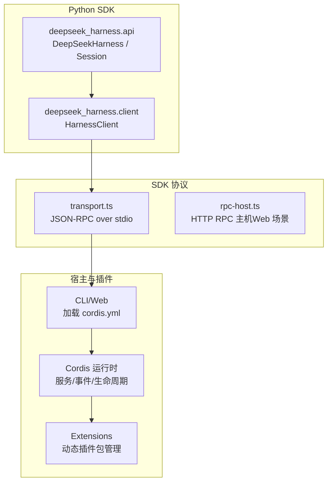
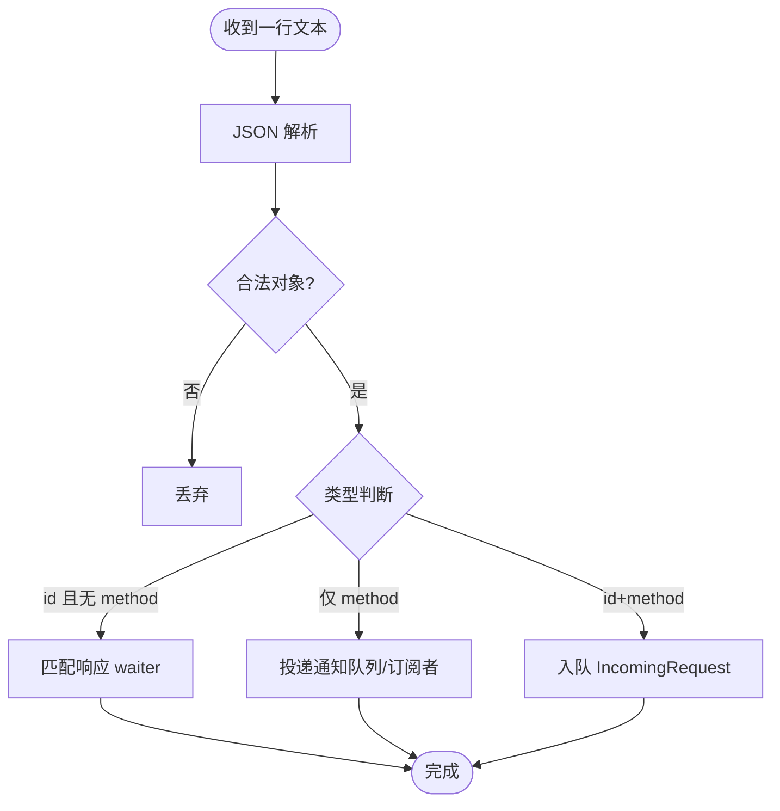
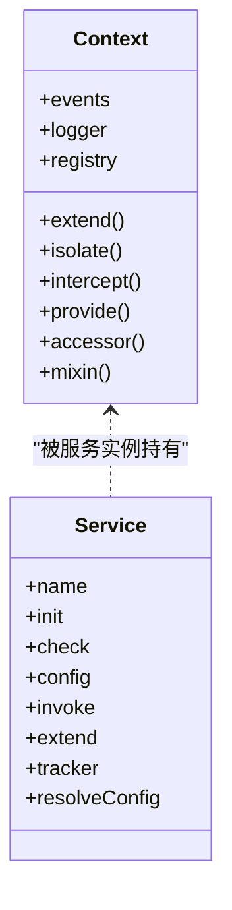
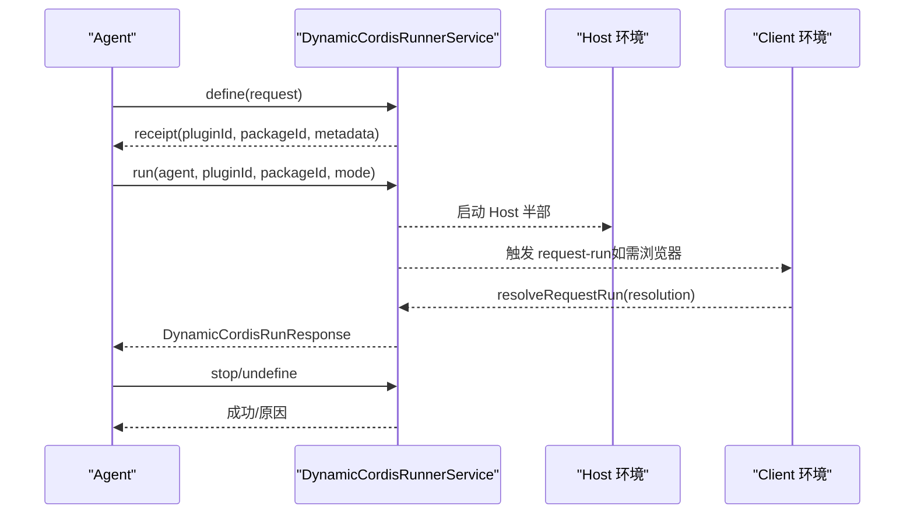
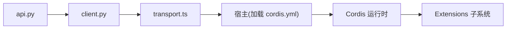

# 扩展机制

<cite>
**本文引用的文件**
- [README.md](file://README.md)
- [cordis-primer.md](file://docs/cordis-primer.md)
- [extensions.md](file://docs/subsystems/extensions.md)
- [python-sdk/README.md](file://python/sdk/README.md)
- [jsonrpc-agent/README.md](file://examples/jsonrpc-agent/README.md)
- [client.py](file://python/sdk/src/deepseek_harness/client.py)
- [api.py](file://python/sdk/src/deepseek_harness/api.py)
- [transport.ts](file://packages/sdk/protocol/src/transport.ts)
- [rpc-host.ts](file://packages/client/connection/src/rpc-host.ts)
- [01-first-plugin.md](file://docs/cordis-tutorial/01-first-plugin.md)
- [service.md](file://docs/cordis-api/service.md)
- [context.md](file://docs/cordis-api/context.md)
- [registry.zh.md](file://docs/cordis-api/registry.zh.md)
- [cordis.yml](file://examples/jsonrpc-agent/cordis.yml)
</cite>

## 目录
1. [简介](#简介)
2. [项目结构](#项目结构)
3. [核心组件](#核心组件)
4. [架构总览](#架构总览)
5. [详细组件分析](#详细组件分析)
6. [依赖关系分析](#依赖关系分析)
7. [性能考量](#性能考量)
8. [故障排查指南](#故障排查指南)
9. [结论](#结论)
10. [附录](#附录)

## 简介
DeepSeek Harness（dsh）采用“一切皆插件”的架构，基于 Cordis 框架实现插件化、可组合、可观测的运行时。本文件聚焦扩展机制与插件生态：通过 Python SDK 驱动 JSON-RPC 子进程运行 Agent；通过 Cordis 配置编排插件；通过 Extensions 子系统动态管理插件包生命周期；并提供从零开始创建自定义插件与服务、测试与发布的完整路径。

## 项目结构
仓库以多包形式组织，与扩展相关的关键位置包括：
- Python SDK：提供 JSON-RPC 客户端与高层 API，负责启动并复用 dsh 子进程
- SDK 协议层：JSON-RPC over stdio 的消息收发与错误处理
- CLI/Web：作为宿主应用加载 Cordis 配置，挂载插件
- Extensions：动态插件注册、激活、撤销、跨端（Host/Client）协调
- Cordis 文档：服务、上下文、事件、生命周期等扩展开发基础



图表来源
- [client.py:37-116](file://python/sdk/src/deepseek_harness/client.py#L37-L116)
- [api.py:48-124](file://python/sdk/src/deepseek_harness/api.py#L48-L124)
- [transport.ts:201-238](file://packages/sdk/protocol/src/transport.ts#L201-L238)
- [rpc-host.ts:160-198](file://packages/client/connection/src/rpc-host.ts#L160-L198)
- [extensions.md:1-13](file://docs/subsystems/extensions.md#L1-L13)

章节来源
- [README.md:5-11](file://README.md#L5-L11)
- [cordis-primer.md:7-14](file://docs/cordis-primer.md#L7-L14)

## 核心组件
- Python SDK 高层 API：DeepSeekHarness 与 Session，封装会话、通知与结果解析
- JSON-RPC 客户端：HarnessClient，负责子进程生命周期、消息路由、通知订阅、超时与诊断
- SDK 协议层：按行 JSON 的 JSON-RPC 2.0 传输，支持请求/响应、通知与错误
- Cordis 插件系统：服务、上下文、事件、效果（effect）与注入依赖
- Extensions 子系统：动态定义、运行、撤销插件包，跨 Host/Client 协调

章节来源
- [api.py:48-183](file://python/sdk/src/deepseek_harness/api.py#L48-L183)
- [client.py:37-116](file://python/sdk/src/deepseek_harness/client.py#L37-L116)
- [transport.ts:201-238](file://packages/sdk/protocol/src/transport.ts#L201-L238)
- [extensions.md:17-257](file://docs/subsystems/extensions.md#L17-L257)

## 架构总览
下图展示从 Python 调用到插件执行的端到端流程：Python SDK 启动 dsh 子进程，通过 JSON-RPC 发送 initialize 与 session/prompt；宿主加载 cordis.yml 组装 Cordis 上下文与插件；Extensions 在需要时动态拉起或停止插件包；事件与通知沿会话树传播回 Python 侧。

```mermaid
sequenceDiagram
participant Py as "Python SDK"
participant HC as "HarnessClient"
proc as "dsh 子进程"
host as "宿主(CLI/Web)"
cordis as "Cordis 运行时"
ext as "Extensions"
Py->>HC : start()
HC->>proc : 启动子进程(JSON-RPC over stdio)
HC->>proc : initialize(provider,model,maxTokens)
proc-->>host : 加载 cordis.yml
host-->>cordis : 挂载插件/服务
Py->>HC : session_prompt(sessionId, contentBlocks)
HC->>proc : 发送 session/prompt
proc-->>cordis : 调度根会话
cordis-->>ext : 按需 define/run/stop 插件包
cordis-->>proc : 返回消息ID
proc-->>HC : 通知 session.event / turn/end
HC-->>Py : RunResult(events, notifications)
```

图表来源
- [api.py:117-183](file://python/sdk/src/deepseek_harness/api.py#L117-L183)
- [client.py:117-155](file://python/sdk/src/deepseek_harness/client.py#L117-L155)
- [transport.ts:201-238](file://packages/sdk/protocol/src/transport.ts#L201-L238)
- [extensions.md:67-257](file://docs/subsystems/extensions.md#L67-L257)

## 详细组件分析

### Python SDK 使用指南
- 安装与运行
  - 通过 pip 安装 deepseek-harness-sdk，自动附带同版本 runtime-bin
  - 默认使用内置单文件 dsh-jsonrpc-agent，无需 Node.js
- 基本用法
  - 使用 DeepSeekHarness 作为上下文管理器，内部会懒启动子进程并复用
  - 调用 run(...) 提交输入，等待 idle 后返回 RunResult
- 配置项
  - provider/model/max_tokens：选择模型与输出上限
  - cwd/runtime_cwd/session_root：工作区、运行时工作目录与持久化目录
  - cordis：指定自定义 Cordis 配置文件路径
  - env/base_url/api_key：环境变量覆盖，便于对接本地代理或自有端点
- 通知与会话树
  - Session.run 期间收集 root 会话事件与所有已知子会话通知
  - 可通过 on_notification 回调或 subscription 过滤特定会话的通知

章节来源
- [python-sdk/README.md:10-52](file://python/sdk/README.md#L10-L52)
- [api.py:13-46](file://python/sdk/src/deepseek_harness/api.py#L13-L46)
- [api.py:48-183](file://python/sdk/src/deepseek_harness/api.py#L48-L183)
- [client.py:63-116](file://python/sdk/src/deepseek_harness/client.py#L63-L116)

### JSON-RPC 协议设计与实现
- 传输格式
  - 每行一个 JSON 对象，遵循 JSON-RPC 2.0
  - 支持请求/响应（带 id）、通知（method 无 id）与错误（error 字段）
- 客户端行为
  - 维护请求等待队列、通知订阅、会话父子关系追踪
  - 支持超时、关闭时的诊断信息（退出码、stderr 尾部）
- 服务端行为
  - 解析消息，分发到对应 handler，写回 result 或 error
  - Web 场景下通过 HTTP RPC 主机进行校验与路由



图表来源
- [client.py:318-397](file://python/sdk/src/deepseek_harness/client.py#L318-L397)
- [transport.ts:201-238](file://packages/sdk/protocol/src/transport.ts#L201-L238)
- [rpc-host.ts:160-198](file://packages/client/connection/src/rpc-host.ts#L160-L198)

章节来源
- [client.py:157-296](file://python/sdk/src/deepseek_harness/client.py#L157-L296)
- [transport.ts:201-238](file://packages/sdk/protocol/src/transport.ts#L201-L238)
- [rpc-host.ts:160-198](file://packages/client/connection/src/rpc-host.ts#L160-L198)

### 通过 Cordis 创建自定义插件与服务
- 插件形态
  - 函数插件：export function apply(ctx, config)
  - 对象插件：export const plugin = { name, apply }
  - 类插件：继承 Service，构造时注册自身
- 上下文与依赖
  - ctx 提供事件总线、日志、反射、注册表等能力
  - 通过 inject 声明依赖，由 Cordis 保证加载顺序
- 效果与生命周期
  - 使用 ctx.effect() 注册可逆副作用，卸载时自动清理
  - 推荐将相关清理逻辑放在同一 effect 中，确保有序释放
- 快速上手
  - 参考教程创建第一个插件，并通过 cordis.yml 组合应用



图表来源
- [context.md:8-12](file://docs/cordis-api/context.md#L8-L12)
- [service.md:4-12](file://docs/cordis-api/service.md#L4-L12)
- [registry.zh.md:60-121](file://docs/cordis-api/registry.zh.md#L60-L121)

章节来源
- [01-first-plugin.md:5-77](file://docs/cordis-tutorial/01-first-plugin.md#L5-L77)
- [cordis-primer.md:7-44](file://docs/cordis-primer.md#L7-L44)
- [context.md:14-96](file://docs/cordis-api/context.md#L14-L96)
- [service.md:14-103](file://docs/cordis-api/service.md#L14-L103)
- [registry.zh.md:60-121](file://docs/cordis-api/registry.zh.md#L60-L121)

### 动态插件与 Extensions 子系统
- 动态能力
  - define：定义新插件或追加包，返回元数据与标识
  - run：启动或切换某个包的运行模式（含授权审批）
  - stop/undefine：停止运行或移除插件及其包
  - 跨端协调：Host/Client 双向同步 inspect manifest、查询与结果
- 事件
  - dynamic-package/dynamic-retract：激活/撤回通知
  - request-run/request-run-resolved：需要浏览器页或用户决策的请求
  - inspect-query/inspect-query-resolved：只读查询的生命周期
- 典型用途
  - 让 Agent 在运行期发现、安装、更新与撤销第三方插件
  - 为 UI 面板提供插件清单、源码快照与运行状态



图表来源
- [extensions.md:67-257](file://docs/subsystems/extensions.md#L67-L257)
- [extensions.md:259-363](file://docs/subsystems/extensions.md#L259-L363)

章节来源
- [extensions.md:1-365](file://docs/subsystems/extensions.md#L1-L365)

### 第三方集成方式与最佳实践
- 通过 Cordis 配置装配
  - 使用 cordis.yml 声明插件、服务与配置，避免硬编码
  - 示例 jsonrpc-agent 展示了最小可用的无头 Agent 组合
- 环境变量与配置注入
  - 通过 DSH_CWD、DSH_SESSION_ROOT、DEEPSEEK_BASE_URL、DEEPSEEK_API_KEY 等控制行为
  - 使用 DSH_CORDIS_CONFIG 指向自定义配置，或使用 SDK 的 cordis 参数
- 安全与沙箱
  - 谨慎授予文件系统权限，仅在隔离环境中运行高权限工具
  - 对 Bash 等持久化工具注意工作目录与超时设置

章节来源
- [jsonrpc-agent/README.md:16-41](file://examples/jsonrpc-agent/README.md#L16-L41)
- [python-sdk/README.md:27-52](file://python/sdk/README.md#L27-L52)
- [cordis.yml:1-90](file://examples/jsonrpc-agent/cordis.yml#L1-L90)

### 扩展开发完整指南（接口、测试、发布）
- 接口定义
  - 明确插件提供的服务名与配置 schema（Standard Schema）
  - 通过 ctx.provide 暴露能力，使用 ctx.on/emit/waterfall/serial 定义事件契约
- 测试策略
  - 单元测试：验证服务方法、事件流与错误分支
  - 集成测试：使用 cordis.yml 组合被测插件与依赖，模拟真实加载顺序
  - 快照测试：对输出与交互序列做快照比对
- 发布流程
  - 将插件打包为 npm 包，导出标准入口（apply/Service）
  - 在 README 中标注 @deepseek-ai/cordis 兼容性与配置项
  - 在仓库添加 dsh-plugin 主题以便社区发现

章节来源
- [01-first-plugin.md:23-77](file://docs/cordis-tutorial/01-first-plugin.md#L23-L77)
- [registry.zh.md:60-121](file://docs/cordis-api/registry.zh.md#L60-L121)
- [README.md:37-45](file://README.md#L37-L45)

## 依赖关系分析
- Python SDK 与协议层
  - api.py 依赖 client.py 发起 JSON-RPC 调用
  - client.py 依赖 transport 语义（请求/响应/通知/错误）
- 宿主与插件
  - CLI/Web 读取 cordis.yml，交由 Cordis 装载插件与服务
  - Extensions 在运行期动态管理插件包，与 Host/Client 通信
- 事件与通知
  - 事件总线解耦插件间通信，waterfall/serial/parallel 提供不同协作语义



图表来源
- [api.py:48-183](file://python/sdk/src/deepseek_harness/api.py#L48-L183)
- [client.py:37-116](file://python/sdk/src/deepseek_harness/client.py#L37-L116)
- [transport.ts:201-238](file://packages/sdk/protocol/src/transport.ts#L201-L238)
- [extensions.md:17-257](file://docs/subsystems/extensions.md#L17-L257)

章节来源
- [api.py:48-183](file://python/sdk/src/deepseek_harness/api.py#L48-L183)
- [client.py:37-116](file://python/sdk/src/deepseek_harness/client.py#L37-L116)
- [transport.ts:201-238](file://packages/sdk/protocol/src/transport.ts#L201-L238)
- [extensions.md:17-257](file://docs/subsystems/extensions.md#L17-L257)

## 性能考量
- 子进程复用
  - DeepSeekHarness 复用同一子进程，减少启动开销
- 通知批处理
  - 使用订阅与 drain 批量消费通知，降低主循环阻塞
- 超时与诊断
  - 合理设置 request_timeout_seconds，失败时获取 stderr 尾部与退出码辅助定位
- 插件粒度
  - 将相关功能聚合为单一插件，减少跨插件事件风暴
- 事件模式选择
  - 单决策用 waterfall 短路；并行 fan-out 用 parallel；有序链式用 serial

[本节为通用指导，不直接分析具体文件]

## 故障排查指南
- 连接与传输
  - 检查子进程是否存活、stdin/stdout 是否正常
  - 捕获 TransportClosedError 并查看诊断信息（退出码、stderr 尾部）
- 超时问题
  - 调整 request_timeout_seconds，确认远端服务可用
  - 关注 session.status 是否为 idle，避免死等
- 插件加载失败
  - 检查 cordis.yml 中的模块路径与名称拼写
  - 使用 Cordis 日志服务查看加载报告
- 动态插件
  - 通过 inventory/snapshot 查看插件版本与运行态
  - 使用 undefine/stop 清理残留运行

章节来源
- [client.py:87-116](file://python/sdk/src/deepseek_harness/client.py#L87-L116)
- [client.py:399-422](file://python/sdk/src/deepseek_harness/client.py#L399-L422)
- [01-first-plugin.md:79-93](file://docs/cordis-tutorial/01-first-plugin.md#L79-L93)
- [extensions.md:180-257](file://docs/subsystems/extensions.md#L180-L257)

## 结论
DeepSeek Harness 通过 Cordis 实现了高度可扩展的插件生态，配合 Python SDK 的 JSON-RPC 子进程模型，既适合无头自动化，也便于与 Web/CLI 宿主集成。借助 Extensions 的动态能力，可以在运行期按需安装、更新与撤销插件，满足复杂业务场景。遵循本文的接口设计、测试与发布建议，可以快速构建稳定可靠的扩展与服务。

## 附录
- 快速开始
  - 安装 SDK 并运行示例：见 python-sdk/README.md 与 examples/jsonrpc-agent/README.md
- 参考配置
  - 最小无头 Agent 组合：examples/jsonrpc-agent/cordis.yml
- 进一步阅读
  - Cordis 入门与教程：docs/cordis-primer.md、docs/cordis-tutorial/*
  - 服务与上下文 API：docs/cordis-api/service.md、docs/cordis-api/context.md