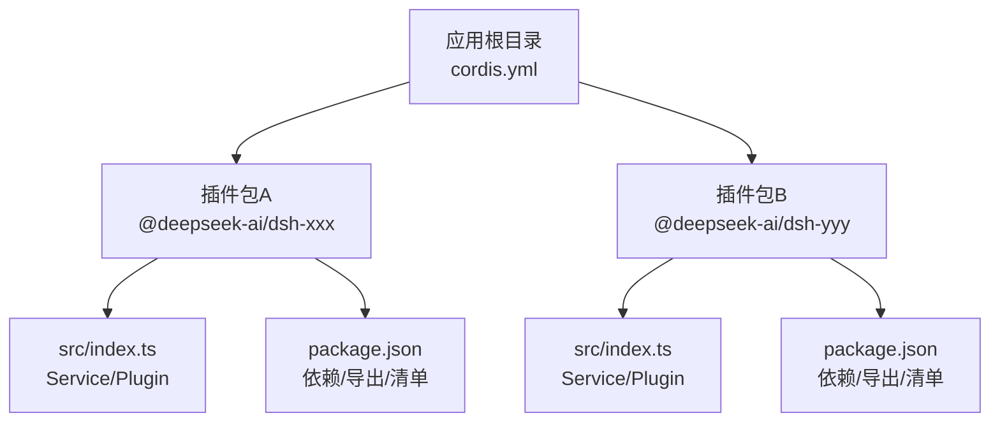
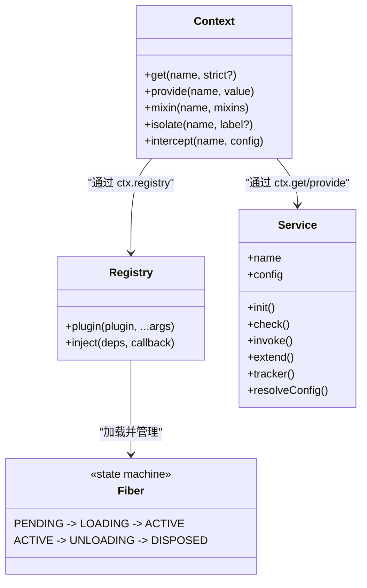
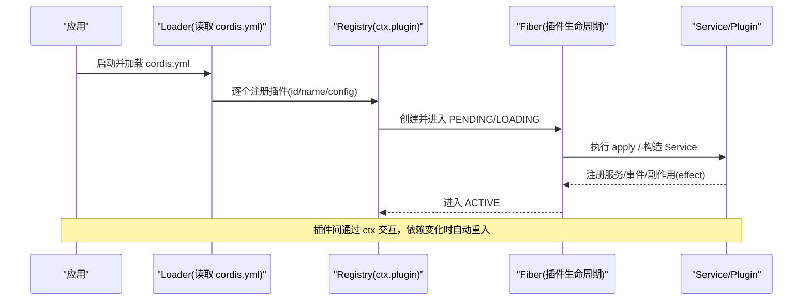
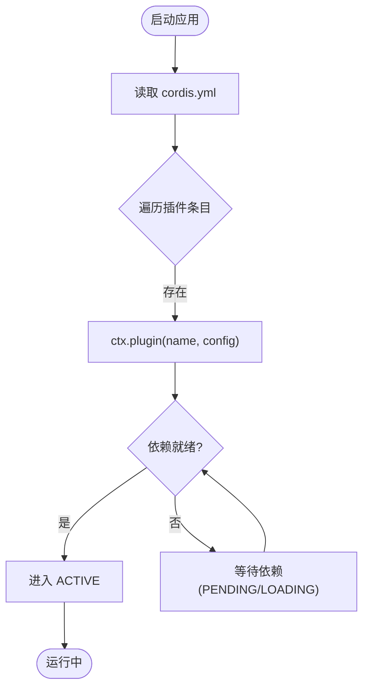
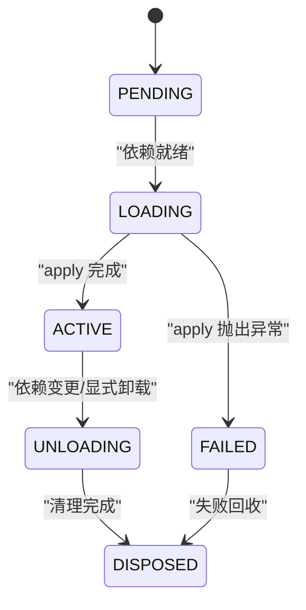
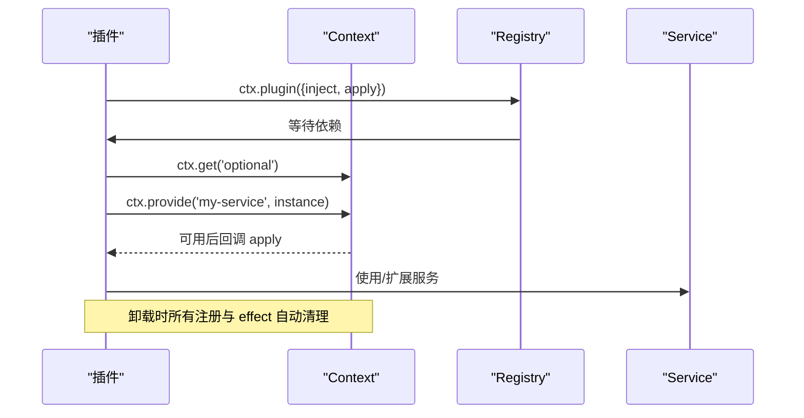
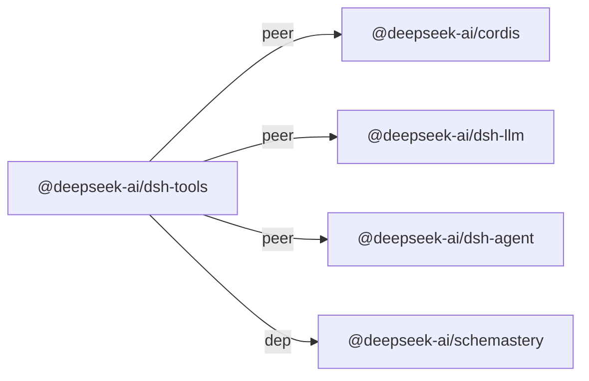

# 包开发

<cite>
**本文引用的文件**
- [adding-a-package.md](file://docs/cookbook/adding-a-package.md)
- [index.md（Cordis 教程索引）](file://docs/cordis-tutorial/index.md)
- [plugins-and-lifecycle.md（插件与生命周期）](file://docs/user/develop/framework/index.md)
- [registry.md（注册与依赖注入）](file://docs/cordis-api/registry.md)
- [context.md（上下文 API）](file://docs/cordis-api/context.md)
- [service.md（服务基类）](file://docs/cordis-api/service.md)
- [SKILL.md（插件开发技能约束）](file://apps/cli/config/agent-presets/cordis/skills/cordis-plugin-development/SKILL.md)
- [cordis.yml（ACP 示例组合）](file://examples/acp-agent/cordis.yml)
- [cordis.yml（无头代理示例组合）](file://examples/headless-agent/cordis.yml)
- [package.json（工具包示例）](file://packages/core/tools/package.json)
- [package.json（ACP 示例应用）](file://examples/acp-agent/package.json)
- [testing.md（测试策略）](file://docs/testing.md)
</cite>

## 目录
1. [简介](#简介)
2. [项目结构](#项目结构)
3. [核心组件](#核心组件)
4. [架构总览](#架构总览)
5. [详细组件分析](#详细组件分析)
6. [依赖分析](#依赖分析)
7. [性能考虑](#性能考虑)
8. [故障排查指南](#故障排查指南)
9. [结论](#结论)
10. [附录](#附录)

## 简介
本指南面向希望在 DeepSeek Harness 中基于 Cordis 框架创建可复用插件包的开发者。内容涵盖：
- 包的目录结构与 package.json、cordis.yml 配置要点
- 依赖管理、版本控制与发布流程
- 开发环境搭建、调试技巧与测试策略
- 从简单工具包到复杂服务包的完整示例
- 包的注册机制、发现机制与生命周期管理

## 项目结构
一个标准的 Cordis 插件包通常包含以下要素：
- package.json：声明包名、版本、入口、导出、依赖与发布清单
- src/index.ts：默认导出为 Service 或 Plugin（name/inject/apply/Config）
- tsconfig.json：继承基础配置，指向 src 与 lib/types
- README.md：说明服务 API、事件、扩展点与设计约束
- cordis.yml（在应用层）：以 id/name/config 形式装配多个插件

**图示来源**
- [adding-a-package.md:7-27](file://docs/cookbook/adding-a-package.md#L7-L27)
- [package.json（工具包示例）:1-69](file://packages/core/tools/package.json#L1-L69)
- [cordis.yml（ACP 示例组合）:1-193](file://examples/acp-agent/cordis.yml#L1-L193)

**章节来源**
- [adding-a-package.md:7-27](file://docs/cookbook/adding-a-package.md#L7-L27)
- [package.json（工具包示例）:1-69](file://packages/core/tools/package.json#L1-L69)
- [cordis.yml（ACP 示例组合）:1-193](file://examples/acp-agent/cordis.yml#L1-L193)

## 核心组件
- Context：插件运行时的上下文容器，提供 get/provide/mixin/isolate/intercept 等能力
- Registry：插件加载与依赖注入，支持 inject 声明式等待依赖就绪
- Service：以类方式暴露 ctx.<name> 的命名服务，自动随 Fiber 生命周期管理
- Fiber：每个插件的生命周期作用域，状态机驱动加载、激活、卸载与清理

**图示来源**
- [context.md:14-96](file://docs/cordis-api/context.md#L14-L96)
- [registry.md:8-47](file://docs/cordis-api/registry.md#L8-L47)
- [service.md:14-103](file://docs/cordis-api/service.md#L14-L103)
- [plugins-and-lifecycle.md:7-24](file://docs/user/develop/framework/index.md#L7-L24)

**章节来源**
- [context.md:14-96](file://docs/cordis-api/context.md#L14-L96)
- [registry.md:8-47](file://docs/cordis-api/registry.md#L8-L47)
- [service.md:14-103](file://docs/cordis-api/service.md#L14-L103)
- [plugins-and-lifecycle.md:7-24](file://docs/user/develop/framework/index.md#L7-L24)

## 架构总览
Cordis 将“能力即插件”的理念贯穿始终：LLM 适配器、文件系统、子进程、工作流、工具、会话持久化等均以插件形式挂载到共享上下文。应用通过 cordis.yml 声明式装配这些插件，由 Loader 解析并启动。

**图示来源**
- [index.md（Cordis 教程索引）:13-36](file://docs/cordis-tutorial/index.md#L13-L36)
- [registry.md:35-47](file://docs/cordis-api/registry.md#L35-L47)
- [plugins-and-lifecycle.md:7-24](file://docs/user/develop/framework/index.md#L7-L24)

**章节来源**
- [index.md（Cordis 教程索引）:13-36](file://docs/cordis-tutorial/index.md#L13-L36)
- [registry.md:35-47](file://docs/cordis-api/registry.md#L35-L47)
- [plugins-and-lifecycle.md:7-24](file://docs/user/develop/framework/index.md#L7-L24)

## 详细组件分析

### 包目录结构与 package.json 规范
- 包位置：packages/<group>/<pkg>/
- 必需文件：package.json、tsconfig.json、src/index.ts、README.md
- package.json 关键项：
  - private: true（内部包）
  - version：与根版本一致
  - type: module
  - main: "lib/index.js"
  - types: "lib/types/index.d.ts"
  - exports：定义主入口与类型入口
  - peerDependencies/devDependencies：同时声明 @deepseek-ai/cordis 及 dsh 相关依赖
  - files：仅打包 lib 产物与必要资源，不打包 src、map 等

**章节来源**
- [adding-a-package.md:7-27](file://docs/cookbook/adding-a-package.md#L7-L27)
- [package.json（工具包示例）:1-69](file://packages/core/tools/package.json#L1-L69)

### cordis.yml 配置与插件装配
- 使用数组条目描述插件：id、name、config
- name 指向已安装的包名（如 @deepseek-ai/dsh-llm-deepseek）
- config 可为静态值或 !!js 表达式，便于运行时注入环境变量
- 典型装配包括 LLM 适配器、沙箱、子进程、工具、工作流、持久化等

**图示来源**
- [cordis.yml（ACP 示例组合）:1-193](file://examples/acp-agent/cordis.yml#L1-L193)
- [cordis.yml（无头代理示例组合）:1-166](file://examples/headless-agent/cordis.yml#L1-L166)
- [registry.md:8-47](file://docs/cordis-api/registry.md#L8-L47)

**章节来源**
- [cordis.yml（ACP 示例组合）:1-193](file://examples/acp-agent/cordis.yml#L1-L193)
- [cordis.yml（无头代理示例组合）:1-166](file://examples/headless-agent/cordis.yml#L1-L166)
- [registry.md:8-47](file://docs/cordis-api/registry.md#L8-L47)

### 插件生命周期与自动清理
- Fiber 状态机：PENDING → LOADING → ACTIVE → UNLOADING → DISPOSED
- 依赖驱动加载：声明 inject 后，依赖缺失会等待；依赖消失则自动卸载并重载
- 自动清理：ctx.on、ctx.tools.register、ctx.llm.registerAdapter、ctx.effect 返回的清理函数会在卸载时执行

**图示来源**
- [plugins-and-lifecycle.md:7-24](file://docs/user/develop/framework/index.md#L7-L24)
- [plugins-and-lifecycle.md:26-57](file://docs/user/develop/framework/index.md#L26-L57)

**章节来源**
- [plugins-and-lifecycle.md:7-24](file://docs/user/develop/framework/index.md#L7-L24)
- [plugins-and-lifecycle.md:26-57](file://docs/user/develop/framework/index.md#L26-L57)

### 服务与上下文交互
- 通过 Service 基类暴露 ctx.<name>，构造函数中调用 super(ctx, name) 完成注册
- 使用 ctx.get 安全获取可选能力，使用 inject 声明强依赖
- 使用 ctx.provide 注册当前 Fiber 拥有的服务实现，卸载时自动移除
- 使用 ctx.intercept 为下游插件注入服务级拦截配置

**图示来源**
- [context.md:237-365](file://docs/cordis-api/context.md#L237-L365)
- [service.md:14-103](file://docs/cordis-api/service.md#L14-L103)
- [registry.md:8-47](file://docs/cordis-api/registry.md#L8-L47)

**章节来源**
- [context.md:237-365](file://docs/cordis-api/context.md#L237-L365)
- [service.md:14-103](file://docs/cordis-api/service.md#L14-L103)
- [registry.md:8-47](file://docs/cordis-api/registry.md#L8-L47)

### 开发环境搭建与调试
- 使用仓库内 Cordis 引导器快速运行 TypeScript 插件：node --import tsx vendor/cordis/bin.js
- 通过 cordis.yml 组织插件树，无需构建即可热重载
- 使用 ctx.logger 输出诊断信息，避免直接 stdout
- 客户端/宿主端脚本限制：禁止 import/require/JSX/装饰器等，遵循 SKILL 约束

**章节来源**
- [index.md（Cordis 教程索引）:13-36](file://docs/cordis-tutorial/index.md#L13-L36)
- [SKILL.md:61-99](file://apps/cli/config/agent-presets/cordis/skills/cordis-plugin-development/SKILL.md#L61-L99)
- [SKILL.md:100-150](file://apps/cli/config/agent-presets/cordis/skills/cordis-plugin-development/SKILL.md#L100-L150)

### 测试策略
- 单元测试：vitest 覆盖 packages/*/tests，确保 HMR 安全（dispose 后断言清理）
- 覆盖率门禁：per-file 100% 覆盖 src，未覆盖行多为死代码需删除
- 真实 API e2e：有密钥场景验证端到端行为，无密钥 CI 自跳过
- 快照测试：键无关的协议/展示/日志快照，记录/刷新需人工审查差异
- 浏览器快照：Chromium 回放对比 web GUI 输出
- 优先使用真实实现而非 mock，仅对昂贵/非确定性边界进行模拟

**章节来源**
- [testing.md:7-49](file://docs/testing.md#L7-L49)

### 从简单工具包到复杂服务包示例
- 简单工具包：只暴露工具注册与执行管线，依赖 minimal 的服务集
- 复杂服务包：组合 LLM 适配器、沙箱、子进程、工作流、持久化、会话投影等，通过 cordis.yml 装配
- 参考示例：
  - ACP 自动化服务器：完整的后端组装与快照录制
  - 无头代理：一次性编码助手，含设置、凭据、持久化与工作流

**章节来源**
- [cordis.yml（ACP 示例组合）:1-193](file://examples/acp-agent/cordis.yml#L1-L193)
- [cordis.yml（无头代理示例组合）:1-166](file://examples/headless-agent/cordis.yml#L1-L166)
- [package.json（ACP 示例应用）:1-8](file://examples/acp-agent/package.json#L1-L8)

## 依赖分析
- 包间耦合：通过 Cordis 服务名解耦，插件仅依赖接口而非具体实现
- 版本一致性：内部依赖使用 workspace:^ 锁定范围，发布脚本校验精确版本
- 依赖声明：peerDependencies 与 devDependencies 保持一致，避免重复安装
- 导出契约：exports.types 与 default 分离，保证类型与运行时路径正确

**图示来源**
- [package.json（工具包示例）:43-67](file://packages/core/tools/package.json#L43-L67)
- [scripts/check-workspace-constraints.ts:375-383](file://scripts/check-workspace-constraints.ts#L375-L383)

**章节来源**
- [package.json（工具包示例）:43-67](file://packages/core/tools/package.json#L43-L67)
- [scripts/check-workspace-constraints.ts:375-383](file://scripts/check-workspace-constraints.ts#L375-L383)

## 性能考虑
- 延迟加载：通过 inject 仅在依赖就绪时加载插件，减少冷启动开销
- 最小化副作用：避免模块顶层副作用，将 I/O 放入 apply/effect
- 缓存与压缩：持久化与历史压缩策略影响内存与 IO，按需配置
- 隔离作用域：使用 isolate 隔离服务实现，避免全局污染与冲突

[本节为通用指导，不直接分析具体文件]

## 故障排查指南
- 插件未加载：检查 cordis.yml 中的 id/name 是否正确，依赖是否满足
- 配置错误：查看 Config 校验失败日志，修正 YAML 或 !!js 表达式
- 生命周期问题：确认 effect 返回了清理函数，避免资源泄漏
- 调试建议：使用 ctx.logger 输出上下文与事件，结合快照测试定位回归

**章节来源**
- [registry.md:35-47](file://docs/cordis-api/registry.md#L35-L47)
- [context.md:237-365](file://docs/cordis-api/context.md#L237-L365)
- [testing.md:7-49](file://docs/testing.md#L7-L49)

## 结论
基于 Cordis 的包开发强调“能力即插件”的模块化思想。通过规范的 package.json、清晰的 cordis.yml 装配、严格的依赖管理与完善的测试策略，可以构建出高内聚、低耦合、易复用的插件包。借助 Fiber 生命周期与自动清理机制，开发者能够专注于业务逻辑，而将加载、依赖、卸载与资源管理交给框架处理。

[本节为总结性内容，不直接分析具体文件]

## 附录
- 快速开始：在仓库 tmp 目录下创建 cordis.yml，使用 vendor/cordis/bin.js 运行 TypeScript 插件
- 包清单：遵循 adding-a-package 的检查清单，确保 package.json 与导出符合约束
- 示例参考：ACP 与无头代理展示了从工具到服务的完整装配模式

**章节来源**
- [index.md（Cordis 教程索引）:13-36](file://docs/cordis-tutorial/index.md#L13-L36)
- [adding-a-package.md:7-27](file://docs/cookbook/adding-a-package.md#L7-L27)
- [cordis.yml（ACP 示例组合）:1-193](file://examples/acp-agent/cordis.yml#L1-L193)
- [cordis.yml（无头代理示例组合）:1-166](file://examples/headless-agent/cordis.yml#L1-L166)