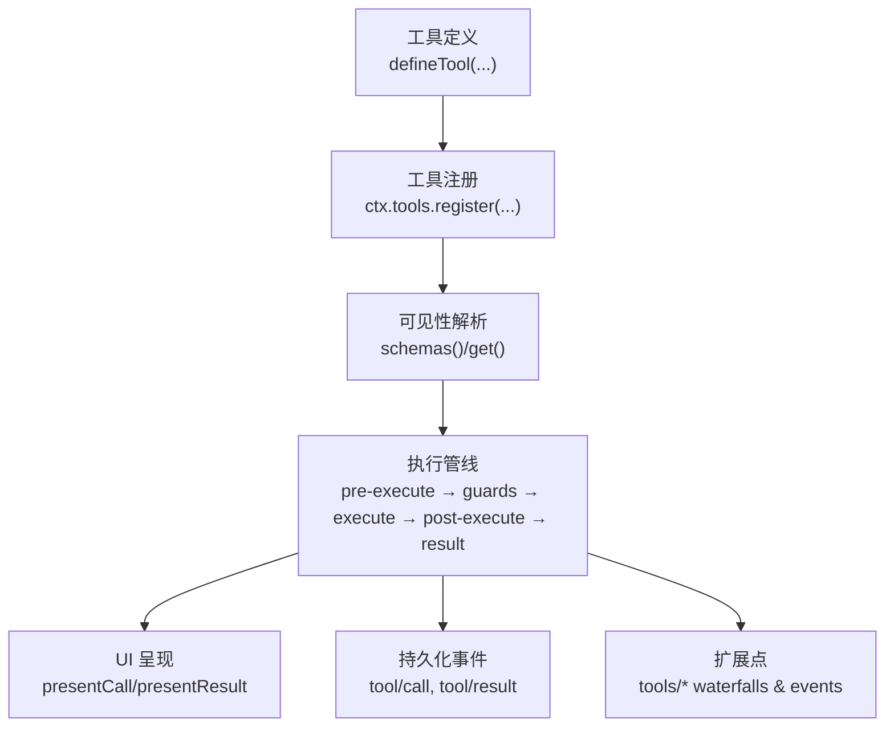
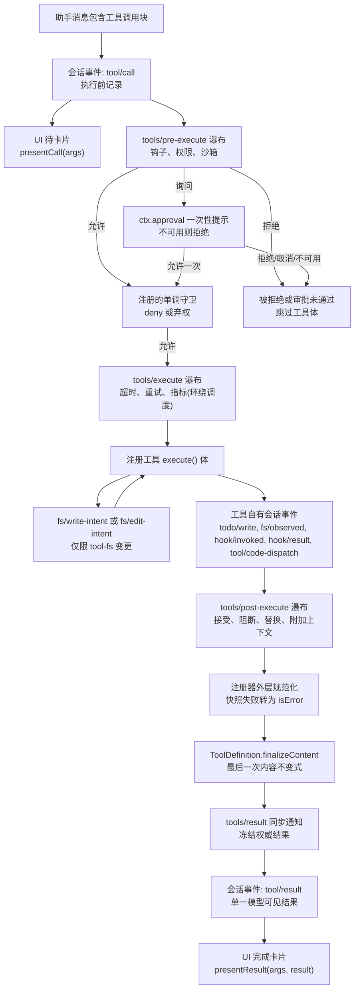
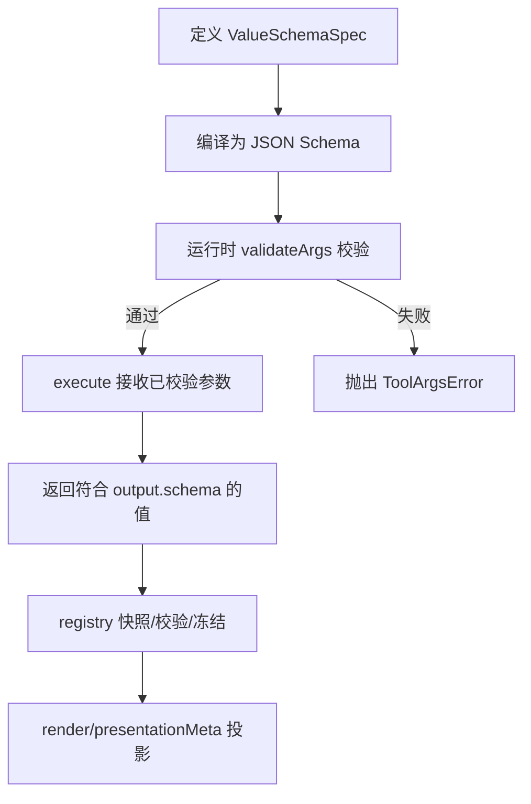
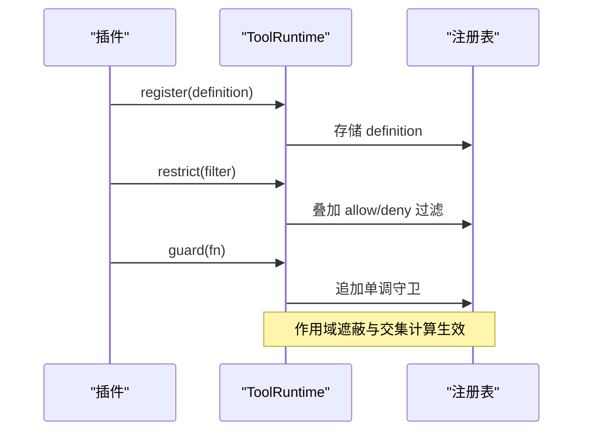
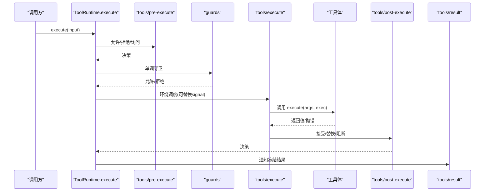
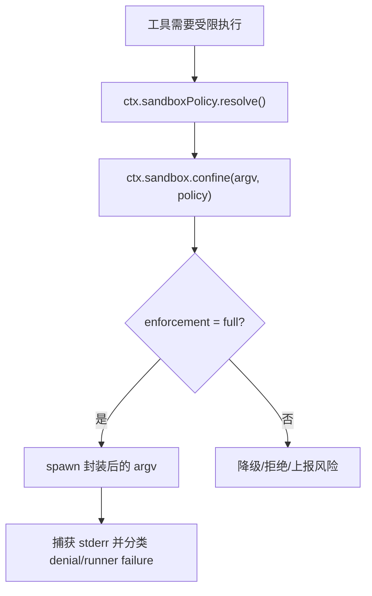
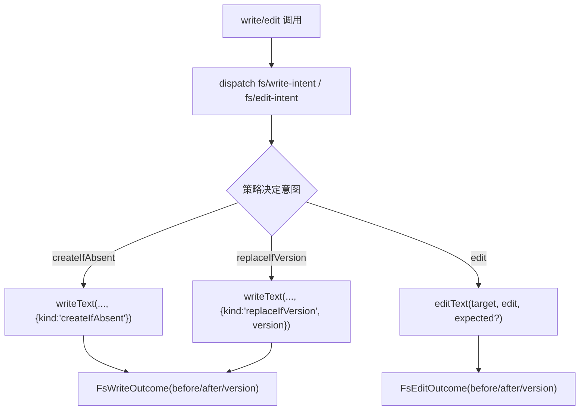
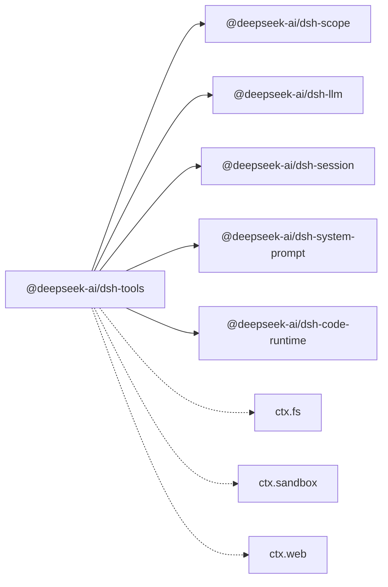

# 工具开发

<cite>
**本文引用的文件**
- [packages/core/tools/src/index.ts](file://packages/core/tools/src/index.ts)
- [packages/core/tools/src/schema.ts](file://packages/core/tools/src/schema.ts)
- [docs/subsystems/tools.md](file://docs/subsystems/tools.md)
- [docs/cookbook/adding-a-tool.md](file://docs/cookbook/adding-a-tool.md)
- [docs/tool-catalog.md](file://docs/tool-catalog.md)
- [docs/tool-execution-pipeline.md](file://docs/tool-execution-pipeline.md)
- [docs/subsystems/sandbox.md](file://docs/subsystems/sandbox.md)
- [docs/subsystems/filesystem.md](file://docs/subsystems/filesystem.md)
- [docs/testing.md](file://docs/testing.md)
</cite>

## 目录
1. [简介](#简介)
2. [项目结构](#项目结构)
3. [核心组件](#核心组件)
4. [架构总览](#架构总览)
5. [详细组件分析](#详细组件分析)
6. [依赖关系分析](#依赖关系分析)
7. [性能考虑](#性能考虑)
8. [故障排查指南](#故障排查指南)
9. [结论](#结论)
10. [附录](#附录)

## 简介
本指南面向希望为 DeepSeek Harness（dsh）开发自定义工具的开发者，覆盖从工具函数编写规范、参数验证与返回值处理，到注册机制、元数据定义、权限控制、执行上下文、错误处理与重试、安全沙箱集成、文件系统访问、网络请求处理，以及测试与调试的完整流程。文档基于仓库中的工具子系统实现与官方文档，提供循序渐进的知识层次和可视化图示，帮助不同技术背景的读者快速上手并写出高质量、可维护的工具。

## 项目结构
围绕“工具”的核心代码与文档主要分布在以下位置：
- 工具运行时与注册管线：packages/core/tools/src/index.ts
- 统一 JSON 值模式 DSL 与 defineTool 辅助：packages/core/tools/src/schema.ts
- 工具子系统说明与 API 契约：docs/subsystems/tools.md
- 工具作者参考与最佳实践：docs/cookbook/adding-a-tool.md
- 已 shipped 工具清单与 schema：docs/tool-catalog.md
- 工具执行流水线流程图：docs/tool-execution-pipeline.md
- 进程沙箱能力与策略：docs/subsystems/sandbox.md
- 文件系统能力与观察策略：docs/subsystems/filesystem.md
- 测试策略与分层：docs/testing.md

**图表来源**
- [packages/core/tools/src/index.ts:787-900](file://packages/core/tools/src/index.ts#L787-L900)
- [docs/subsystems/tools.md:478-570](file://docs/subsystems/tools.md#L478-L570)

**章节来源**
- [packages/core/tools/src/index.ts:787-900](file://packages/core/tools/src/index.ts#L787-L900)
- [docs/subsystems/tools.md:478-570](file://docs/subsystems/tools.md#L478-L570)

## 核心组件
- 工具定义与注册
  - 使用 defineTool 声明 name、description、parameters、output（schema + render + presentationMeta）、execute，以及可选 finalizeContent、timeoutMs、isConcurrencySafe、presentCall、presentResult。
  - 通过 ctx.tools.register 注册；支持作用域遮蔽与限制（restrict）。
- 执行管线
  - pre-execute 允许/拒绝/询问（ask），monotonic guards 最终否决，tools/execute 用于超时/重试等 around-dispatch，post-execute 接受/替换/阻断结果，finalizeContent 做最后一次内容不变式检查，最后 tools/result 通知冻结的最终结果。
- 模式与 SDK 生成
  - 在 code/both 模式下，系统提示注入“仅 run_code 可直接调用”，并在 SDK 区域生成各语言绑定，使 Code Mode 程序可直接 await tools.<name>(args)。
- UI 呈现
  - presentCall/presentResult 返回中性 card 标签视图，供宿主/客户端映射到具体 UI。

**章节来源**
- [docs/cookbook/adding-a-tool.md:7-66](file://docs/cookbook/adding-a-tool.md#L7-L66)
- [docs/subsystems/tools.md:9-96](file://docs/subsystems/tools.md#L9-L96)
- [docs/subsystems/tools.md:459-468](file://docs/subsystems/tools.md#L459-L468)
- [packages/core/tools/src/index.ts:839-892](file://packages/core/tools/src/index.ts#L839-L892)

## 架构总览
下图展示了工具从模型调用到结果呈现的完整路径，包括策略、钩子、沙箱、文件系统守卫、结果重写、最终结果观察与 UI 渲染。

**图表来源**
- [docs/tool-execution-pipeline.md:8-58](file://docs/tool-execution-pipeline.md#L8-L58)
- [docs/subsystems/tools.md:170-404](file://docs/subsystems/tools.md#L170-L404)

## 详细组件分析

### 工具定义与参数验证
- 统一 JSON 值模式 DSL
  - 支持 string、number、integer、boolean、null、array、object、json、oneOf；对象节点必须显式声明 additionalProperties。
  - 参数根是隐式开放对象，required 标注在属性上。
- defineTool 将参数 schema 编译为 JSON Schema，并对输入进行严格校验；输出 schema 同样受约束。
- 类型推断
  - InferValue/InferArgs 提供最多 16 层容器深度的精确推断，超出回退到 JsonValue。
- 错误处理
  - 参数不匹配抛出 ToolArgsError；输出无效抛出 ToolOutputError；均走工具错误路径。

**图表来源**
- [packages/core/tools/src/schema.ts:1-200](file://packages/core/tools/src/schema.ts#L1-L200)
- [docs/subsystems/tools.md:98-151](file://docs/subsystems/tools.md#L98-L151)

**章节来源**
- [packages/core/tools/src/schema.ts:1-200](file://packages/core/tools/src/schema.ts#L1-L200)
- [docs/subsystems/tools.md:98-151](file://docs/subsystems/tools.md#L98-L151)

### 工具注册与作用域/权限控制
- 注册
  - ctx.tools.register(definition) 支持全局与作用域注册；同层重复名称会失败。
- 可见性与限制
  - schemas(scope) 构建模型可见的 ToolSchema[]（白名单字段）；get(name, scope) 按作用域解析。
  - restrict(filter) 对全局工具施加 allow/deny 过滤；作用域内注册不受影响。
- 单调守卫
  - guard(guard) 注册 final pre-dispatch 策略；返回原因即拒绝，且后续监听无法撤销拒绝。

**图表来源**
- [docs/subsystems/tools.md:478-570](file://docs/subsystems/tools.md#L478-L570)
- [packages/core/tools/src/index.ts:713-754](file://packages/core/tools/src/index.ts#L713-L754)

**章节来源**
- [docs/subsystems/tools.md:478-570](file://docs/subsystems/tools.md#L478-L570)
- [packages/core/tools/src/index.ts:713-754](file://packages/core/tools/src/index.ts#L713-L754)

### 执行上下文、错误处理与重试
- 执行上下文
  - ToolExecutionInput → ToolExecution（增加 token/rootCallId）→ ToolDispatchExecution（可替换 signal）。
  - ToolRunContext 提供 deferContext/concludeTurn，用于嵌套分发与回合终止标记。
- 错误与结果
  - 成功：ToolExecutionSuccess（value/content/meta/additionalContexts/concludesTurn）。
  - 失败：ToolExecutionFailure（error/message/info）。
  - 规范化：注册器捕获 schema/renderer/projector 异常，转换为 isError 结果。
- 重试与超时
  - 通过 tools/execute 瀑布包装 next() 实现超时、重试、指标收集；需遵守信号融合与静默恢复约定。

**图表来源**
- [docs/subsystems/tools.md:170-404](file://docs/subsystems/tools.md#L170-L404)
- [docs/tool-execution-pipeline.md:8-58](file://docs/tool-execution-pipeline.md#L8-L58)

**章节来源**
- [docs/subsystems/tools.md:170-404](file://docs/subsystems/tools.md#L170-L404)
- [docs/tool-execution-pipeline.md:8-58](file://docs/tool-execution-pipeline.md#L8-L58)

### 安全沙箱集成
- 沙箱模式
  - read-only、workspace-write、danger-full-access；仅前两种可下发给提供者。
- 每调用策略
  - SandboxExecutionPolicy 携带 mode/workspaceRoot/sessionId；resolve(request) 决定最终策略。
- 封装 argv 与分类
  - confine(argv, policy) 返回 ConfinedArgv（含 enforcement、denialSignatures、runnerFailureRules）。
- 工具集成建议
  - 对需要受限执行的命令（如 bash/pwsh），通过 ctx.sandbox.confine 包裹 argv；根据 enforcement 决定是否继续。

**图表来源**
- [docs/subsystems/sandbox.md:9-156](file://docs/subsystems/sandbox.md#L9-L156)

**章节来源**
- [docs/subsystems/sandbox.md:9-156](file://docs/subsystems/sandbox.md#L9-L156)

### 文件系统访问
- 抽象文件系统
  - ctx.fs 提供 resolve/stat/lstat/readText/streamText/readBytes/listDir/writeText/editText 等。
- 写/改守卫
  - fs/write-intent 与 fs/edit-intent 单槽位决策水落；默认无保护，策略插件可强制“读前写/改”。
- 观察状态
  - fs/observed 记录 present/absent 及版本；策略据此决定 createIfAbsent 或 replaceIfVersion。
- 错误码
  - FS_NOT_FOUND、FS_PERMISSION_DENIED、FS_SANDBOX_DENIED、FS_STALE_VERSION 等稳定错误码便于重试/权限分支。

**图表来源**
- [docs/subsystems/filesystem.md:114-179](file://docs/subsystems/filesystem.md#L114-L179)
- [docs/subsystems/filesystem.md:432-495](file://docs/subsystems/filesystem.md#L432-L495)

**章节来源**
- [docs/subsystems/filesystem.md:114-179](file://docs/subsystems/filesystem.md#L114-L179)
- [docs/subsystems/filesystem.md:432-495](file://docs/subsystems/filesystem.md#L432-L495)

### 网络请求处理
- 工具视角
  - 网络能力由 ctx.web 抽象，web_search/web_fetch 工具屏蔽后端差异，保持模型可见 schema 稳定。
- 执行策略
  - 可通过 tools/execute 瀑布添加超时、重试、指标；结合 sandbox 策略限制出站网络（若平台支持）。
- 结果呈现
  - 使用 output.render 与 presentationMeta 输出结构化摘要，避免将大体积正文直接暴露给模型。

**章节来源**
- [docs/tool-catalog.md:41-41](file://docs/tool-catalog.md#L41-L41)
- [docs/subsystems/tools.md:170-404](file://docs/subsystems/tools.md#L170-L404)

### 多种工具示例与最佳实践
- 文件操作工具
  - 使用 ctx.fs 进行读取/写入/编辑；配合 fs/* 事件实现“读前写/改”策略；利用 FsWriteIntent/FsEditRequest 保证原子性与一致性。
- 网络请求工具
  - 通过 ctx.web 发起搜索/抓取；在 tools/execute 中设置超时与重试；presentationMeta 携带来源/截断信息以便 UI 展示。
- 代码执行工具
  - 在 code/both 模式下，run_code 是唯一可直接调用的工具；其他工具通过 SDK 绑定在程序内调用，进入完整工具管线。

**章节来源**
- [docs/tool-catalog.md:17-41](file://docs/tool-catalog.md#L17-L41)
- [docs/cookbook/adding-a-tool.md:61-66](file://docs/cookbook/adding-a-tool.md#L61-L66)

## 依赖关系分析
- 模块耦合
  - tools 包依赖 @deepseek-ai/cordis（服务/事件）、@deepseek-ai/dsh-scope（作用域）、@deepseek-ai/dsh-llm（类型/错误）、@deepseek-ai/dsh-session（序列化/快照）、@deepseek-ai/dsh-system-prompt（系统提示注入）、@deepseek-ai/dsh-code-runtime（code 模式）。
- 外部集成点
  - 文件系统（ctx.fs）、沙箱（ctx.sandbox）、Web（ctx.web）、Shell（bash/pwsh）、Jobs（后台任务）、Subprocess（子进程）。
- 循环依赖规避
  - 通过事件水落与抽象 seam 解耦；工具只依赖接口而非具体实现。

**图表来源**
- [packages/core/tools/src/index.ts:1-28](file://packages/core/tools/src/index.ts#L1-L28)

**章节来源**
- [packages/core/tools/src/index.ts:1-28](file://packages/core/tools/src/index.ts#L1-L28)

## 性能考虑
- 并发与并行
  - isConcurrencySafe 允许工具声明可并行；调度器据此形成滚动池并行执行。
- 超时与预算
  - timeoutMs 声明工具级超时预算；tools/execute 负责实际超时控制。
- 结果大小与溢出
  - 文件读取/网络响应应使用流式或分页；presentationMeta 携带 truncated/total 等元数据，避免 UI 误判。
- 缓存与去重
  - 对于幂等查询，可在 tools/execute 中引入缓存；注意失效与并发安全。

[本节为通用指导，无需特定文件引用]

## 故障排查指南
- 常见错误
  - 未知工具：UNKNOWN_TOOL（工具不可见或未注册）。
  - 参数错误：ToolArgsError（INVALID_ARGS）。
  - 输出错误：ToolOutputError（INVALID_TOOL_OUTPUT）。
  - 文件系统：FS_* 系列错误码（权限、沙箱拒绝、版本陈旧等）。
  - 沙箱：SANDBOX_UNAVAILABLE（无可用后端）。
- 定位步骤
  - 查看 tools/pre-execute/guards 是否拒绝；确认 restrict 过滤是否正确。
  - 检查 tools/execute 包装是否吞掉异常或未恢复 signal。
  - 对 fs 操作，确认 fs/observed 状态与预期一致；必要时先 read 再 write/edit。
  - 对沙箱，检查 enforcement=full 与否，以及 stderr 分类是否为 runner failure。
- 日志与观测
  - 订阅 tools/result 获取冻结结果；使用 tools/code-dispatch-log 调整代码模式子调度的日志副本。

**章节来源**
- [docs/subsystems/tools.md:170-404](file://docs/subsystems/tools.md#L170-L404)
- [docs/subsystems/filesystem.md:244-270](file://docs/subsystems/filesystem.md#L244-L270)
- [docs/subsystems/sandbox.md:152-156](file://docs/subsystems/sandbox.md#L152-L156)

## 结论
本指南系统化梳理了 dsh 工具开发的完整链路：从定义与注册、参数与输出校验、执行管线与权限控制，到沙箱与文件系统的安全边界、网络请求的处理方式，以及测试与调试方法。遵循这些规范与最佳实践，可以开发出健壮、安全、可观测且易于维护的工具，同时充分利用系统的并发、超时、重试与 UI 呈现能力。

[本节为总结性内容，无需特定文件引用]

## 附录
- 快速开始
  - 使用 defineTool 声明最小工具，并通过 ctx.tools.register 注册；确保 parameters/output/execute 对齐。
  - 在 code/both 模式下，通过 run_code 调用工具，或在 native 模式下直接调用。
- 推荐实践
  - 始终尊重 exec.signal；对长耗时工作使用后台任务（ctx.jobs）。
  - 使用 presentationMeta 承载 UI 所需元数据，避免将大文本放入 value。
  - 通过 tools/pre-execute/guards 实现权限与策略，而不是在工具体内硬编码。
- 测试与调试
  - 单元测试覆盖参数校验与错误路径；e2e 使用真实组合与 keyless 场景；snapshot 锁定模型可见行为。
  - 使用 tools/result 观测最终结果；必要时在 tools/post-execute 替换 content/value。

**章节来源**
- [docs/cookbook/adding-a-tool.md:7-66](file://docs/cookbook/adding-a-tool.md#L7-L66)
- [docs/testing.md:7-50](file://docs/testing.md#L7-L50)