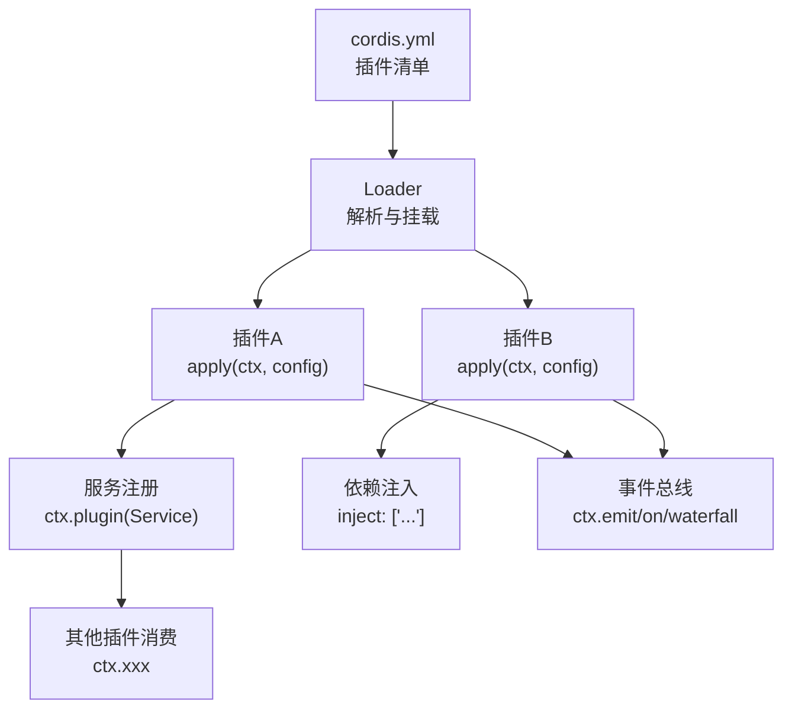
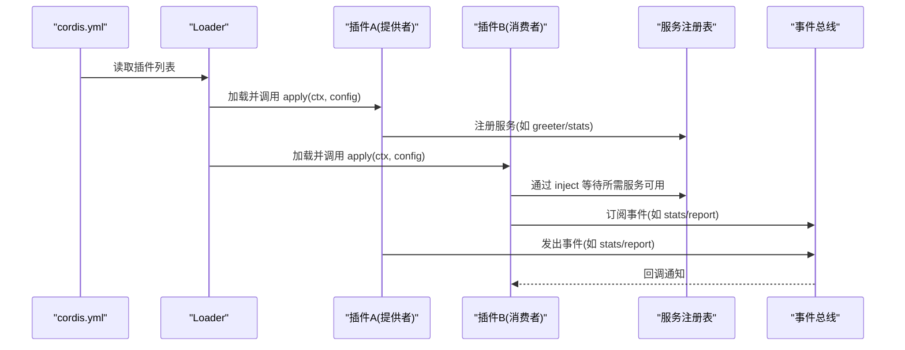
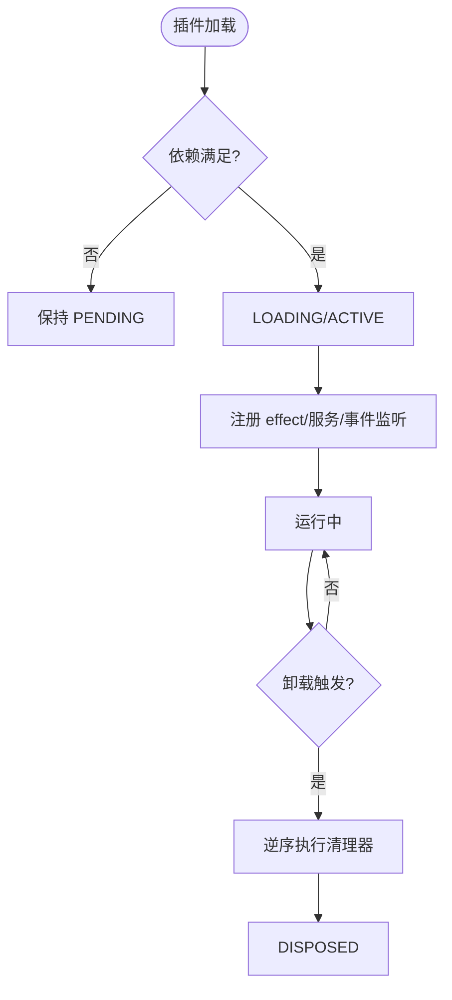
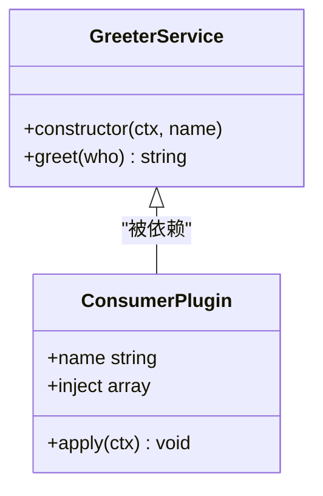
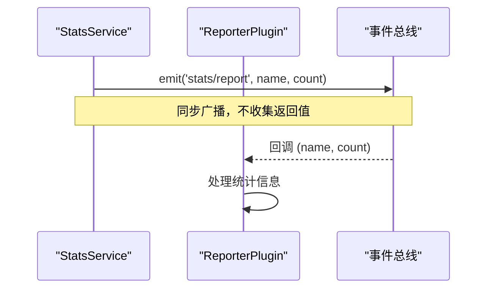
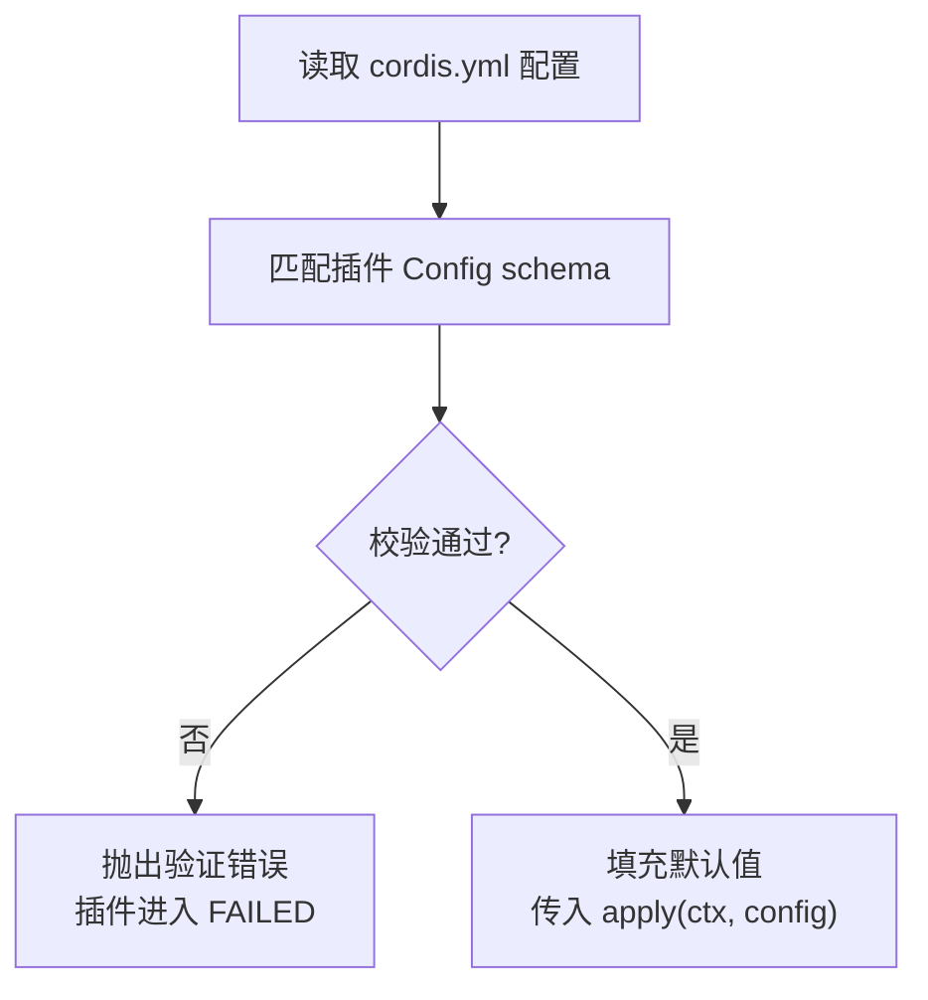
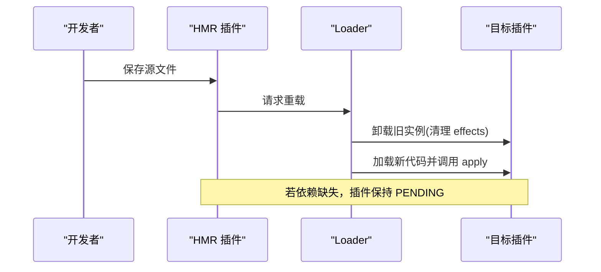
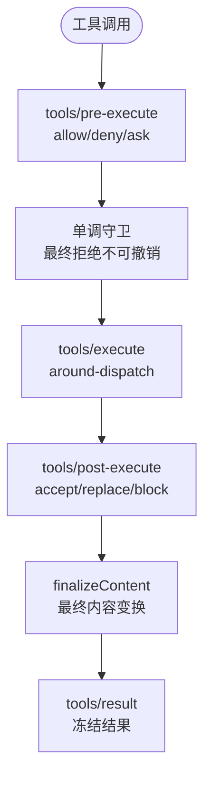
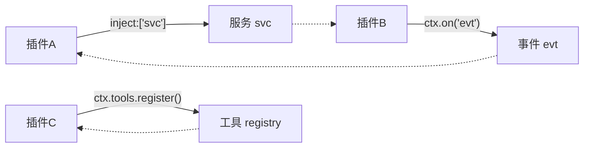

# 插件开发

<cite>
**本文引用的文件**
- [01-first-plugin.md](file://docs/cordis-tutorial/01-first-plugin.md)
- [02-lifecycle-and-effects.md](file://docs/cordis-tutorial/02-lifecycle-and-effects.md)
- [03-services.md](file://docs/cordis-tutorial/03-services.md)
- [04-events.md](file://docs/cordis-tutorial/04-events.md)
- [05-config.md](file://docs/cordis-tutorial/05-config.md)
- [06-composition-and-hmr.md](file://docs/cordis-tutorial/06-composition-and-hmr.md)
- [service.md](file://docs/cordis-api/service.md)
- [context.md](file://docs/cordis-api/context.md)
- [registry.md](file://docs/cordis-api/registry.md)
- [tools.md](file://docs/subsystems/tools.md)
</cite>

## 目录
1. [简介](#简介)
2. [项目结构](#项目结构)
3. [核心组件](#核心组件)
4. [架构总览](#架构总览)
5. [详细组件分析](#详细组件分析)
6. [依赖关系分析](#依赖关系分析)
7. [性能考量](#性能考量)
8. [故障排查指南](#故障排查指南)
9. [结论](#结论)
10. [附录](#附录)

## 简介
本指南面向希望基于 Cordis 框架开发自定义插件与服务的工程师，覆盖从插件目录结构、配置文件格式、依赖管理到工具开发、服务注册与生命周期、上下文传播、测试调试与发布的完整流程。文档以教程与 API 文档为依据，提供循序渐进的说明、图示与最佳实践建议，帮助读者快速上手并写出健壮可扩展的插件。

## 项目结构
Cordis 插件由“配置驱动”的插件树组成：应用通过 cordis.yml 声明要加载的插件条目；每个插件可以是一个函数、对象或类（Service 子类）。插件之间通过服务（services）进行能力共享，通过事件（events）进行解耦通信，并通过配置（config）实现可插拔行为。

**图表来源**
- [01-first-plugin.md:23-51](file://docs/cordis-tutorial/01-first-plugin.md#L23-L51)
- [03-services.md:7-43](file://docs/cordis-tutorial/03-services.md#L7-L43)
- [04-events.md:7-78](file://docs/cordis-tutorial/04-events.md#L7-L78)

**章节来源**
- [01-first-plugin.md:5-51](file://docs/cordis-tutorial/01-first-plugin.md#L5-L51)
- [06-composition-and-hmr.md:7-25](file://docs/cordis-tutorial/06-composition-and-hmr.md#L7-L25)

## 核心组件
- 上下文 Context：插件交互的核心入口，承载服务、事件、日志、反射、注册表等能力。
- 服务 Service：以名称注册的运行时能力，供其他插件通过 ctx 访问。
- 事件 Events：插件间解耦通信机制，支持多种分发模式（emit/parallel/serial/bail/waterfall）。
- 注册表 Registry：负责插件加载、依赖注入与生命周期管理。
- 工具 Tools：模型可见的工具定义与执行管线，包含参数校验、权限控制、结果呈现等。

**章节来源**
- [context.md:4-163](file://docs/cordis-api/context.md#L4-L163)
- [service.md:4-103](file://docs/cordis-api/service.md#L4-L103)
- [registry.md:4-153](file://docs/cordis-api/registry.md#L4-L153)
- [tools.md:9-152](file://docs/subsystems/tools.md#L9-L152)

## 架构总览
下图展示了插件在 Cordis 中的加载顺序、依赖解析与服务/事件交互方式。

**图表来源**
- [01-first-plugin.md:23-51](file://docs/cordis-tutorial/01-first-plugin.md#L23-L51)
- [03-services.md:44-78](file://docs/cordis-tutorial/03-services.md#L44-L78)
- [04-events.md:7-78](file://docs/cordis-tutorial/04-events.md#L7-L78)

## 详细组件分析

### 插件与生命周期
- 插件形态：函数、对象（含 apply）、类（Service 子类）。
- 生命周期：PENDING → LOADING → ACTIVE → UNLOADING → DISPOSED，失败进入 FAILED。
- 资源清理：使用 ctx.effect() 包装外部资源，返回清理函数；卸载时按逆序并发执行异步清理。
- 子插件：通过 ctx.plugin(child) 动态挂载，fiber.dispose() 会递归卸载所有子插件。

**图表来源**
- [02-lifecycle-and-effects.md:68-94](file://docs/cordis-tutorial/02-lifecycle-and-effects.md#L68-L94)

**章节来源**
- [01-first-plugin.md:53-92](file://docs/cordis-tutorial/01-first-plugin.md#L53-L92)
- [02-lifecycle-and-effects.md:7-67](file://docs/cordis-tutorial/02-lifecycle-and-effects.md#L7-L67)

### 服务与依赖注入
- 提供服务：继承 Service 并在构造函数中调用 super(ctx, name)，实例即作为服务注册。
- 消费服务：通过 inject 声明硬依赖，Cordis 保证 apply 内服务已就绪；也可用 ctx.get(name) 做可选依赖探测。
- 依赖追踪：当服务提供者卸载或被替换，依赖方也会卸载并重新加载，避免持有过期引用。
- 命名空间：服务名全局唯一，建议使用前缀避免冲突。

**图表来源**
- [03-services.md:7-43](file://docs/cordis-tutorial/03-services.md#L7-L43)
- [03-services.md:44-78](file://docs/cordis-tutorial/03-services.md#L44-L78)

**章节来源**
- [03-services.md:7-95](file://docs/cordis-tutorial/03-services.md#L7-L95)
- [service.md:4-103](file://docs/cordis-api/service.md#L4-L103)

### 事件系统
- 声明事件：通过合并接口 Events 声明事件名与监听签名，使 ctx.emit/on 具备类型安全。
- 分发模式：emit（同步广播）、parallel（并行等待）、serial（串行首个非空返回）、bail（同步版 serial）、waterfall（中间件式拦截/改写）。
- Waterfall：用于拦截与短路（veto），必须遵循“仅观察/标注的监听器需调用 next()”的规则。

**图表来源**
- [04-events.md:7-78](file://docs/cordis-tutorial/04-events.md#L7-L78)
- [04-events.md:80-141](file://docs/cordis-tutorial/04-events.md#L80-L141)

**章节来源**
- [04-events.md:7-141](file://docs/cordis-tutorial/04-events.md#L7-L141)

### 配置与验证
- 配置声明：导出 Config 类型与同名 schema（Standard Schema），Cordis 在 apply 前完成校验与默认值填充。
- 错误处理：无效配置导致加载失败并给出精确错误路径；插件不会在半配置状态下启动。
- 计算值：支持 !!js 标签在配置中计算运行时值（仅限 config 与 disabled 字段）。

**图表来源**
- [05-config.md:7-68](file://docs/cordis-tutorial/05-config.md#L7-L68)

**章节来源**
- [05-config.md:7-82](file://docs/cordis-tutorial/05-config.md#L7-L82)

### 组合与热更新（HMR）
- 条目元数据：id 稳定标识，disabled 可临时禁用；group 可将一组条目整体加载/卸载；isolate 可为组提供独立的服务作用域。
- HMR：通过 cordis-plugin-hmr 监听文件变更，自动卸载旧实例并加载新代码；依赖未满足时会处于 PENDING。
- 诊断：可通过 ctx.registry 枚举 fiber 状态，定位 PENDING 原因。

**图表来源**
- [06-composition-and-hmr.md:7-59](file://docs/cordis-tutorial/06-composition-and-hmr.md#L7-L59)
- [06-composition-and-hmr.md:61-110](file://docs/cordis-tutorial/06-composition-and-hmr.md#L61-L110)

**章节来源**
- [06-composition-and-hmr.md:7-110](file://docs/cordis-tutorial/06-composition-and-hmr.md#L7-L110)

### 工具开发与权限控制
- 工具定义：ToolDefinition 包含参数 schema、输出 schema、execute 执行体、可选 finalizeContent/presentCall/presentResult 等。
- 参数校验：defineTool 将参数 schema 编译为 JSON Schema 并严格校验，非法参数抛出 ToolArgsError。
- 执行管线：pre-execute（允许/拒绝/询问）→ 单调守卫 → execute（around-dispatch）→ post-execute（接受/替换/阻断）→ finalizeContent → result。
- 权限控制：通过 tools/pre-execute 与 guard 实现细粒度访问控制；ToolRestriction 可按作用域限制工具可见性。
- 并发与安全：isConcurrencySafe 标记可并行执行的调用；timeoutMs 提供协作式超时预算。

**图表来源**
- [tools.md:170-404](file://docs/subsystems/tools.md#L170-L404)
- [tools.md:478-574](file://docs/subsystems/tools.md#L478-L574)

**章节来源**
- [tools.md:9-152](file://docs/subsystems/tools.md#L9-L152)
- [tools.md:170-404](file://docs/subsystems/tools.md#L170-L404)
- [tools.md:478-721](file://docs/subsystems/tools.md#L478-L721)

## 依赖关系分析
- 插件与服务的耦合：通过 inject 显式声明依赖，降低直接导入带来的紧耦合；服务替换时依赖方自动重装载。
- 事件与工具的解耦：事件用于广播与拦截，工具用于对外暴露能力；两者均通过 ctx 访问，职责清晰。
- 上下文与作用域：Context.extend/isolate/intercept 支持创建子上下文与作用域隔离，便于多实例或多代理场景。

**图表来源**
- [03-services.md:44-78](file://docs/cordis-tutorial/03-services.md#L44-L78)
- [04-events.md:7-78](file://docs/cordis-tutorial/04-events.md#L7-L78)
- [tools.md:478-574](file://docs/subsystems/tools.md#L478-L574)

**章节来源**
- [context.md:14-96](file://docs/cordis-api/context.md#L14-L96)
- [registry.md:8-56](file://docs/cordis-api/registry.md#L8-L56)

## 性能考量
- 依赖驱动的加载顺序：避免在 cordis.yml 中依赖位置排序，应通过 inject 表达依赖，提升可维护性与稳定性。
- 事件分发模式选择：高频广播使用 emit；需要聚合结果使用 parallel；需要短路决策使用 serial/bail；复杂拦截使用 waterfall。
- 工具并发与超时：合理设置 isConcurrencySafe 与 timeoutMs，确保工具能响应取消信号并尽快达到静默点。
- HMR 与热更新：利用 HMR 减少重启成本，但注意依赖缺失导致的 PENDING 状态会影响热更新体验。

[本节为通用指导，无需特定文件来源]

## 故障排查指南
- 插件无输出：检查是否处于 PENDING 状态，确认依赖服务是否提供；可使用 ctx.registry 遍历 fiber 状态进行诊断。
- 配置错误：查看验证错误路径，修正类型或必填字段；必要时使用 !!js 计算运行时值。
- 事件未触发：确认事件名与签名一致，监听器是否正确注册；waterfall 监听器是否遗漏调用 next()。
- 工具被拒绝：检查 pre-execute 策略与 guard 规则；确认工具在当前作用域可见且未被限制。

**章节来源**
- [06-composition-and-hmr.md:61-110](file://docs/cordis-tutorial/06-composition-and-hmr.md#L61-L110)
- [05-config.md:53-82](file://docs/cordis-tutorial/05-config.md#L53-L82)
- [04-events.md:80-141](file://docs/cordis-tutorial/04-events.md#L80-L141)
- [tools.md:170-404](file://docs/subsystems/tools.md#L170-L404)

## 结论
基于 Cordis 的插件体系通过“配置驱动 + 服务 + 事件 + 工具”的组合，提供了高内聚、低耦合、可热更新的扩展能力。遵循依赖声明、配置校验、事件契约与工具管线规范，可以构建出健壮、可观测、易维护的插件生态。结合 HMR 与诊断能力，开发体验与问题定位效率显著提升。

[本节为总结，无需特定文件来源]

## 附录
- 快速开始：参考“第一个插件”教程，编写 apply 并配置 cordis.yml。
- 服务与依赖：学习 Service 子类与 inject 的使用，掌握依赖追踪与替换。
- 事件与拦截：掌握 emit/parallel/serial/bail/waterfall 的适用场景与语义。
- 配置与验证：使用 Standard Schema 定义配置，确保类型安全与运行时校验。
- 工具开发：通过 defineTool 注册工具，实现参数校验、权限控制与结果呈现。
- 组合与 HMR：使用 id/disabled/group/isolate 组织插件，配合 HMR 提升开发效率。
- 调试与诊断：通过 fiber 状态与事件日志定位问题，逐步缩小范围。

[本节为指引，无需特定文件来源]