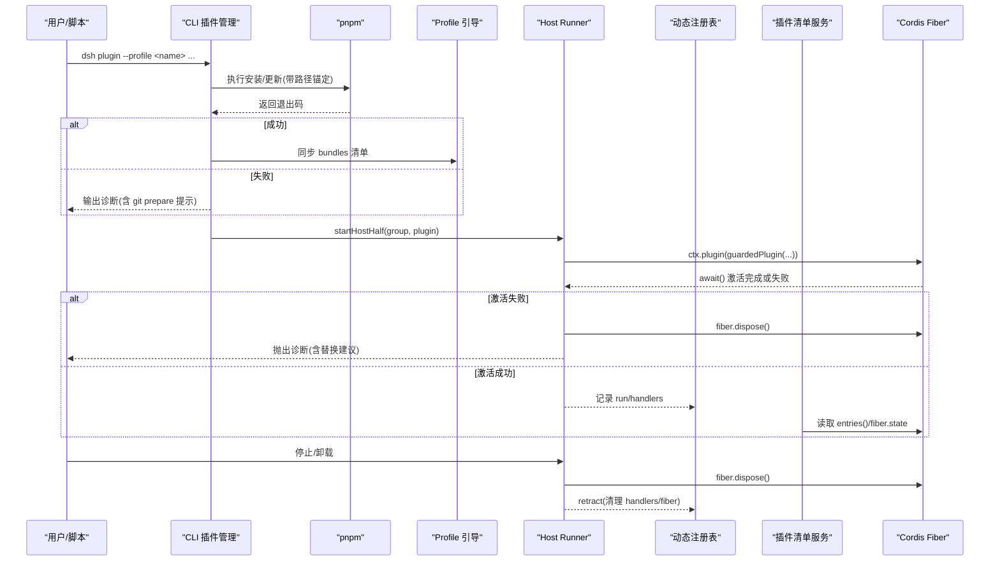
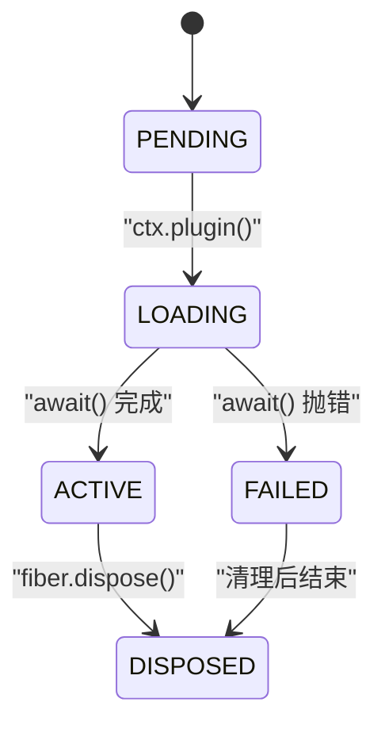
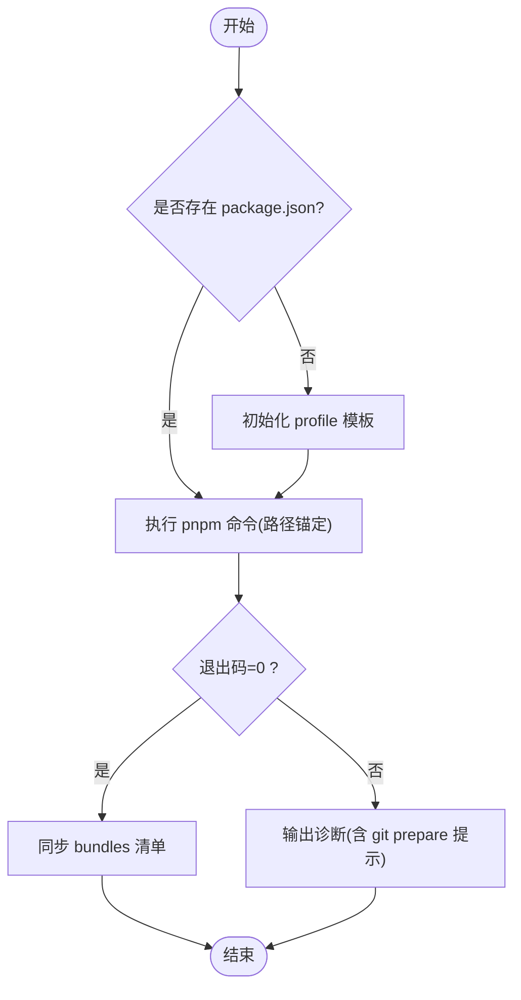
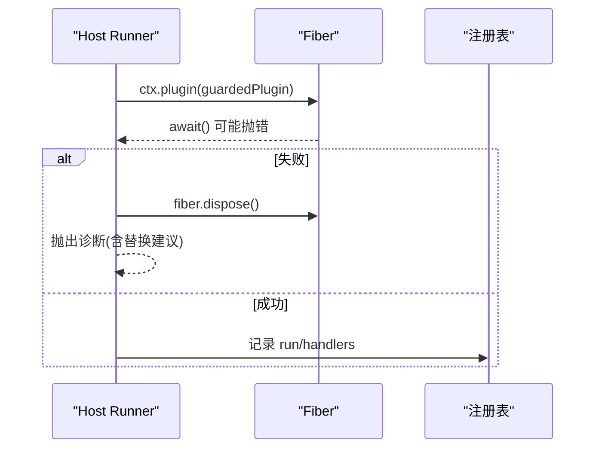
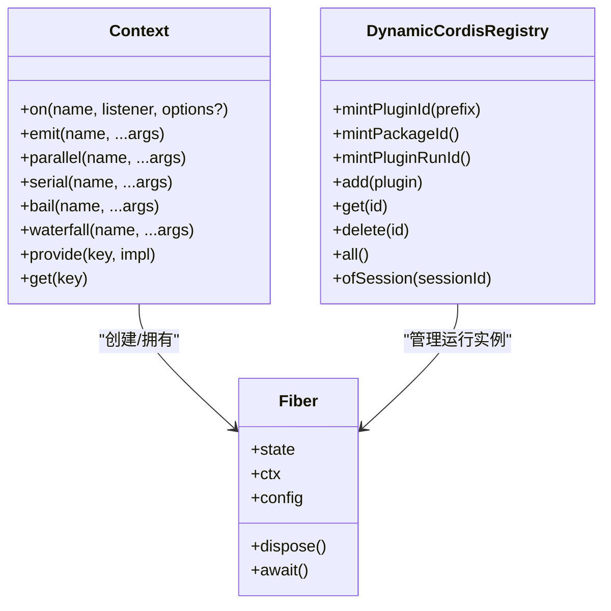
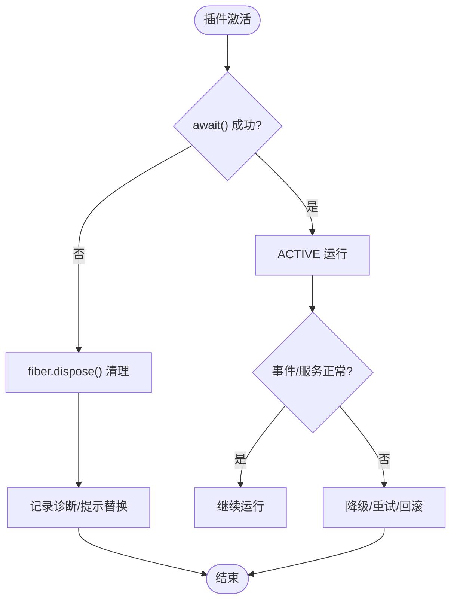
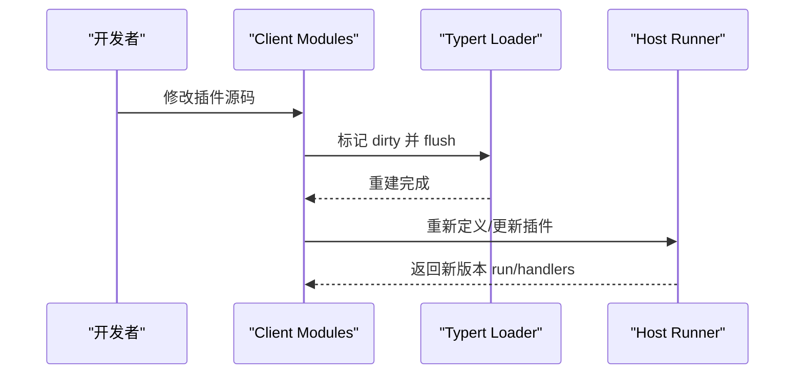
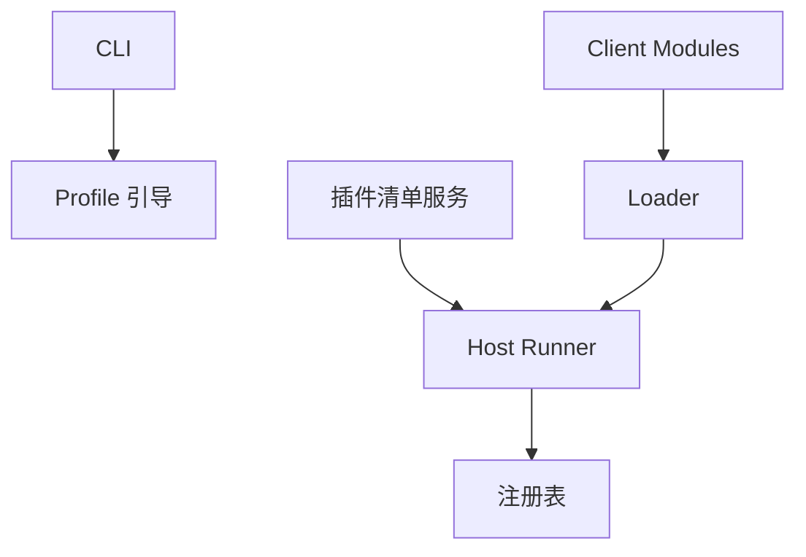

# 插件生命周期

<cite>
**本文引用的文件**
- [apps/cli/src/plugin.ts](file://apps/cli/src/plugin.ts)
- [packages/extensions/cordis-host-runner/src/lifecycle.ts](file://packages/extensions/cordis-host-runner/src/lifecycle.ts)
- [packages/extensions/cordis-host-runner/src/registry.ts](file://packages/extensions/cordis-host-runner/src/registry.ts)
- [packages/host/plugin-inventory/src/index.ts](file://packages/host/plugin-inventory/src/index.ts)
- [packages/client/modules/src/index.ts](file://packages/client/modules/src/index.ts)
- [packages/boot/app-boot/src/profile.ts](file://packages/boot/app-boot/src/profile.ts)
- [scripts/test-invariants.spec.ts](file://scripts/test-invariants.spec.ts)
- [packages/code-runtime/code-runtime/tests/service.spec.ts](file://packages/code-runtime/code-runtime/tests/service.spec.ts)
- [packages/typert/loader/src/index.ts](file://packages/typert/loader/src/index.ts)
- [examples/headless-agent/tests/fixtures/startup-activation-error/activation-error.mjs](file://examples/headless-agent/tests/fixtures/startup-activation-error/activation-error.mjs)
- [packages/extensions/tool-cordis/tests/cordis-lifecycle.spec.ts](file://packages/extensions/tool-cordis/tests/cordis-lifecycle.spec.ts)
- [docs/cordis-api/events.md](file://docs/cordis-api/events.md)
- [docs/cordis-api/fiber.md](file://docs/cordis-api/fiber.md)
- [docs/cordis-api/fiber.zh.md](file://docs/cordis-api/fiber.zh.md)
</cite>

## 目录
1. [简介](#简介)
2. [项目结构](#项目结构)
3. [核心组件](#核心组件)
4. [架构总览](#架构总览)
5. [详细组件分析](#详细组件分析)
6. [依赖关系分析](#依赖关系分析)
7. [性能考量](#性能考量)
8. [故障排查指南](#故障排查指南)
9. [结论](#结论)
10. [附录](#附录)

## 简介
本文件系统性梳理插件从加载到卸载的完整生命周期，覆盖初始化、激活与运行阶段的钩子与状态流转；阐述事件监听与消息传递机制；解释插件间通信、依赖解析与冲突解决；给出错误处理、资源清理与优雅降级策略；并提供监控调试方法以及热重载与动态更新能力说明。

## 项目结构
围绕插件生命周期，仓库中关键位置包括：
- CLI 层：负责配置“配置文件（profile）”中的插件包集合，并在安装后自动对齐“dsh.profile.bundles”清单，从而决定哪些包作为插件层参与启动。
- Host Runner：将沙箱产出的插件以子 Fiber 形式挂载，保证失败不残留，并报告未满足的注入依赖。
- Registry：维护动态插件的定义、版本与运行实例，管理审批流与运行时失败诊断。
- Inventory：对外暴露当前 Loader 的非分组条目及其 Fiber 阶段快照，便于 UI/工具观测。
- Client Modules：在 Web 侧订阅内部事件，收集变更并触发重建，支撑 HMR/热重载。
- Boot Profile：为 profile 建立模块回退链接，确保插件可被解析。
- Cordis Fiber/Events：提供插件上下文、Fiber 状态机、effect 管理与事件分发模式。

```mermaid
graph TB
subgraph "CLI"
CLI["apps/cli/src/plugin.ts"]
end
subgraph "Host Runner"
LIF["packages/extensions/cordis-host-runner/src/lifecycle.ts"]
REG["packages/extensions/cordis-host-runner/src/registry.ts"]
end
subgraph "Inventory"
INV["packages/host/plugin-inventory/src/index.ts"]
end
subgraph "Client Modules"
CM["packages/client/modules/src/index.ts"]
end
subgraph "Boot Profile"
PROF["packages/boot/app-boot/src/profile.ts"]
end
subgraph "Cordis Core"
FIB["docs/cordis-api/fiber*.md"]
EVT["docs/cordis-api/events.md"]
end
CLI --> PROF
CLI --> LIF
LIF --> REG
INV --> LIF
CM --> FIB
CM --> EVT
LIF --> FIB
LIF --> EVT
```

图表来源
- [apps/cli/src/plugin.ts:120-158](file://apps/cli/src/plugin.ts#L120-L158)
- [packages/extensions/cordis-host-runner/src/lifecycle.ts:22-45](file://packages/extensions/cordis-host-runner/src/lifecycle.ts#L22-L45)
- [packages/extensions/cordis-host-runner/src/registry.ts:141-277](file://packages/extensions/cordis-host-runner/src/registry.ts#L141-L277)
- [packages/host/plugin-inventory/src/index.ts:42-72](file://packages/host/plugin-inventory/src/index.ts#L42-L72)
- [packages/client/modules/src/index.ts:187-213](file://packages/client/modules/src/index.ts#L187-L213)
- [packages/boot/app-boot/src/profile.ts:224-255](file://packages/boot/app-boot/src/profile.ts#L224-L255)
- [docs/cordis-api/fiber.md:50-109](file://docs/cordis-api/fiber.md#L50-L109)
- [docs/cordis-api/events.md:1-208](file://docs/cordis-api/events.md#L1-L208)

章节来源
- [apps/cli/src/plugin.ts:120-158](file://apps/cli/src/plugin.ts#L120-L158)
- [packages/extensions/cordis-host-runner/src/lifecycle.ts:22-45](file://packages/extensions/cordis-host-runner/src/lifecycle.ts#L22-L45)
- [packages/extensions/cordis-host-runner/src/registry.ts:141-277](file://packages/extensions/cordis-host-runner/src/registry.ts#L141-L277)
- [packages/host/plugin-inventory/src/index.ts:42-72](file://packages/host/plugin-inventory/src/index.ts#L42-L72)
- [packages/client/modules/src/index.ts:187-213](file://packages/client/modules/src/index.ts#L187-L213)
- [packages/boot/app-boot/src/profile.ts:224-255](file://packages/boot/app-boot/src/profile.ts#L224-L255)
- [docs/cordis-api/fiber.md:50-109](file://docs/cordis-api/fiber.md#L50-L109)
- [docs/cordis-api/events.md:1-208](file://docs/cordis-api/events.md#L1-L208)

## 核心组件
- CLI 插件管理器：负责 profile 初始化、调用 pnpm 安装/更新、根据已安装包是否声明 dsh.bundle 自动同步 bundles 列表，并在失败时给出明确提示。
- Host Runner 生命周期：将插件作为子 Fiber 挂载，等待激活完成；若失败则立即 dispose 并抛出诊断信息；支持查询缺失注入服务。
- 动态插件注册表：维护插件稳定 ID、版本、运行实例、审批请求与失败诊断；支持删除、查询与按会话过滤。
- 插件清单服务：实时读取 Loader 条目与 Fiber 阶段，供外部系统观察。
- Web 客户端模块：订阅内部事件，增量刷新模块图，驱动 HMR/热重载。
- Boot Profile：为 profile 构建 node_modules 符号链接，使插件依赖可被解析。
- Cordis Fiber/Events：定义插件上下文、Fiber 状态机、effect 生命周期与多种事件分发模式。

章节来源
- [apps/cli/src/plugin.ts:120-158](file://apps/cli/src/plugin.ts#L120-L158)
- [packages/extensions/cordis-host-runner/src/lifecycle.ts:22-45](file://packages/extensions/cordis-host-runner/src/lifecycle.ts#L22-L45)
- [packages/extensions/cordis-host-runner/src/registry.ts:141-277](file://packages/extensions/cordis-host-runner/src/registry.ts#L141-L277)
- [packages/host/plugin-inventory/src/index.ts:42-72](file://packages/host/plugin-inventory/src/index.ts#L42-L72)
- [packages/client/modules/src/index.ts:187-213](file://packages/client/modules/src/index.ts#L187-L213)
- [packages/boot/app-boot/src/profile.ts:224-255](file://packages/boot/app-boot/src/profile.ts#L224-L255)
- [docs/cordis-api/fiber.md:50-109](file://docs/cordis-api/fiber.md#L50-L109)
- [docs/cordis-api/events.md:1-208](file://docs/cordis-api/events.md#L1-L208)

## 架构总览
下图展示插件从 CLI 安装到 Host Runner 挂载、激活、运行与卸载的全链路交互。



图表来源
- [apps/cli/src/plugin.ts:120-158](file://apps/cli/src/plugin.ts#L120-L158)
- [packages/extensions/cordis-host-runner/src/lifecycle.ts:22-45](file://packages/extensions/cordis-host-runner/src/lifecycle.ts#L22-L45)
- [packages/extensions/cordis-host-runner/src/registry.ts:1191-1230](file://packages/extensions/cordis-host-runner/src/registry.ts#L1191-L1230)
- [packages/host/plugin-inventory/src/index.ts:42-72](file://packages/host/plugin-inventory/src/index.ts#L42-L72)

## 详细组件分析

### 插件生命周期状态机与钩子
- 状态：PENDING → LOADING → ACTIVE → DISPOSED（异常时为 FAILED）。
- 钩子：
  - internal/plugin：在插件发布前后触发，可用于注入依赖、监听状态变化、注册 effect。
  - effect：在 Fiber 上下文中注册 setup/cleanup，支持重启与异步清理。
- 行为要点：
  - 在 PENDING/LOADING 阶段仍可注册 effect。
  - 父 Fiber 在 LOADING 期间可等待子 Fiber 清理完成。
  - 重复注册服务会拒绝，避免冲突。



图表来源
- [packages/extensions/tool-cordis/tests/cordis-lifecycle.spec.ts:117-160](file://packages/extensions/tool-cordis/tests/cordis-lifecycle.spec.ts#L117-L160)
- [docs/cordis-api/fiber.zh.md:93-135](file://docs/cordis-api/fiber.zh.md#L93-L135)

章节来源
- [packages/extensions/tool-cordis/tests/cordis-lifecycle.spec.ts:117-160](file://packages/extensions/tool-cordis/tests/cordis-lifecycle.spec.ts#L117-L160)
- [docs/cordis-api/fiber.zh.md:93-135](file://docs/cordis-api/fiber.zh.md#L93-L135)

### 初始化阶段（CLI 与 Profile）
- CLI 流程：
  - 首次使用初始化 profile 目录。
  - 调用 pnpm 执行安装/更新，并将相对路径规范锚定到调用目录。
  - 成功后根据已安装包是否声明 dsh.bundle 自动同步 bundles 列表。
  - 失败时输出诊断，针对 git 依赖的 prepare 脚本给出允许构建提示。
- Profile 引导：
  - 通过 BFS 遍历依赖与 peerDependencies，建立 node_modules 符号链接，确保插件可被解析。



图表来源
- [apps/cli/src/plugin.ts:120-158](file://apps/cli/src/plugin.ts#L120-L158)
- [packages/boot/app-boot/src/profile.ts:224-255](file://packages/boot/app-boot/src/profile.ts#L224-L255)

章节来源
- [apps/cli/src/plugin.ts:120-158](file://apps/cli/src/plugin.ts#L120-L158)
- [packages/boot/app-boot/src/profile.ts:224-255](file://packages/boot/app-boot/src/profile.ts#L224-L255)

### 激活阶段（Host Runner 与依赖注入）
- Host Runner 将插件包装为 guardedPlugin 并以子 Fiber 挂载，等待 await() 完成。
- 若激活失败，立即 dispose 并抛出诊断；常见“已注册”冲突会提示先停止旧版本再替换。
- missingServices 可列出尚未满足的 inject 依赖名，用于诊断“挂起但未激活”的原因。



图表来源
- [packages/extensions/cordis-host-runner/src/lifecycle.ts:22-45](file://packages/extensions/cordis-host-runner/src/lifecycle.ts#L22-L45)
- [packages/extensions/cordis-host-runner/src/registry.ts:141-277](file://packages/extensions/cordis-host-runner/src/registry.ts#L141-L277)

章节来源
- [packages/extensions/cordis-host-runner/src/lifecycle.ts:22-45](file://packages/extensions/cordis-host-runner/src/lifecycle.ts#L22-L45)
- [packages/extensions/cordis-host-runner/src/registry.ts:141-277](file://packages/extensions/cordis-host-runner/src/registry.ts#L141-L277)

### 运行阶段（事件、消息与服务）
- 事件模型：
  - emit/parallel/serial/bail/waterfall 多种分发模式，支持同步与异步监听器。
  - on/once 注册监听器，受 Fiber 生命周期管理，卸载时自动清理。
- 消息传递：
  - 通过 Context 提供的服务注册与注入实现插件间通信。
  - 重复注册同一服务会被拒绝，避免冲突。
- 动态插件：
  - 运行期可定义/更新插件版本，注册表维护 latestRun/run 等元数据，失败时产出诊断。



图表来源
- [docs/cordis-api/events.md:1-208](file://docs/cordis-api/events.md#L1-L208)
- [docs/cordis-api/fiber.md:50-109](file://docs/cordis-api/fiber.md#L50-L109)
- [packages/extensions/cordis-host-runner/src/registry.ts:141-277](file://packages/extensions/cordis-host-runner/src/registry.ts#L141-L277)

章节来源
- [docs/cordis-api/events.md:1-208](file://docs/cordis-api/events.md#L1-L208)
- [docs/cordis-api/fiber.md:50-109](file://docs/cordis-api/fiber.md#L50-L109)
- [packages/extensions/cordis-host-runner/src/registry.ts:141-277](file://packages/extensions/cordis-host-runner/src/registry.ts#L141-L277)

### 错误处理、资源清理与优雅降级
- 启动失败：
  - Host Runner 捕获 await() 异常，立即 dispose 并抛出包含原始堆栈的诊断；对“已注册”冲突给出替换指引。
  - 示例 fixture 展示了确定性错误堆栈以便诊断。
- Effect 与清理：
  - effect 支持同步/异步清理；重启时会先等待旧清理完成再进入新 setup。
  - 在 child 处于 PENDING/LOADING 时仍可注册 effect，确保清理链完整。
- 服务去重：
  - 同一 context 下重复注册服务会拒绝，避免冲突。
- 优雅降级：
  - 通过 serial/bail 事件模式实现短路；通过 waterfall 实现拦截/否决。
  - 动态插件失败时保留 latestRun 诊断，便于后续重试或回滚。



图表来源
- [packages/extensions/cordis-host-runner/src/lifecycle.ts:22-45](file://packages/extensions/cordis-host-runner/src/lifecycle.ts#L22-L45)
- [examples/headless-agent/tests/fixtures/startup-activation-error/activation-error.mjs:1-6](file://examples/headless-agent/tests/fixtures/startup-activation-error/activation-error.mjs#L1-L6)
- [packages/extensions/tool-cordis/tests/cordis-lifecycle.spec.ts:10-115](file://packages/extensions/tool-cordis/tests/cordis-lifecycle.spec.ts#L10-L115)
- [packages/code-runtime/code-runtime/tests/service.spec.ts:74-88](file://packages/code-runtime/code-runtime/tests/service.spec.ts#L74-L88)
- [docs/cordis-api/events.md:1-208](file://docs/cordis-api/events.md#L1-L208)

章节来源
- [packages/extensions/cordis-host-runner/src/lifecycle.ts:22-45](file://packages/extensions/cordis-host-runner/src/lifecycle.ts#L22-L45)
- [examples/headless-agent/tests/fixtures/startup-activation-error/activation-error.mjs:1-6](file://examples/headless-agent/tests/fixtures/startup-activation-error/activation-error.mjs#L1-L6)
- [packages/extensions/tool-cordis/tests/cordis-lifecycle.spec.ts:10-115](file://packages/extensions/tool-cordis/tests/cordis-lifecycle.spec.ts#L10-L115)
- [packages/code-runtime/code-runtime/tests/service.spec.ts:74-88](file://packages/code-runtime/code-runtime/tests/service.spec.ts#L74-L88)
- [docs/cordis-api/events.md:1-208](file://docs/cordis-api/events.md#L1-L208)

### 插件间通信、依赖解析与冲突解决
- 通信：
  - 通过 Context 的事件 API 与 provide/get 进行服务级通信。
  - 动态插件通过注册表维护 handlers 与 run 元数据，支持跨进程/会话协作。
- 依赖解析：
  - CLI 层基于 pnpm 安装结果判断是否加入 bundles；Profile 引导层通过符号链接补齐依赖。
  - Typert Loader 订阅 internal/plugin 事件，将新增条目加入脏集合并批量处理。
- 冲突解决：
  - 重复服务注册拒绝；动态插件“已注册”冲突提示先停止旧版本再替换。
  - 测试用例验证 root 插件需等待所有惰性伴生激活后才允许嵌套启动。


图表来源
- [packages/client/modules/src/index.ts:187-213](file://packages/client/modules/src/index.ts#L187-L213)
- [packages/typert/loader/src/index.ts:392-422](file://packages/typert/loader/src/index.ts#L392-L422)
- [packages/extensions/cordis-host-runner/src/registry.ts:141-277](file://packages/extensions/cordis-host-runner/src/registry.ts#L141-L277)
- [scripts/test-invariants.spec.ts:223-238](file://scripts/test-invariants.spec.ts#L223-L238)

章节来源
- [packages/client/modules/src/index.ts:187-213](file://packages/client/modules/src/index.ts#L187-L213)
- [packages/typert/loader/src/index.ts:392-422](file://packages/typert/loader/src/index.ts#L392-L422)
- [packages/extensions/cordis-host-runner/src/registry.ts:141-277](file://packages/extensions/cordis-host-runner/src/registry.ts#L141-L277)
- [scripts/test-invariants.spec.ts:223-238](file://scripts/test-invariants.spec.ts#L223-L238)

### 监控与调试
- 插件清单服务：
  - 通过 list() 获取 Loader 非分组条目及对应 Fiber 阶段，便于 UI/工具观测。
- 内部事件：
  - internal/plugin 在插件发布前后触发，可用于统计、埋点与调试。
- 诊断信息：
  - Host Runner 在失败时输出包含插件名、阶段与原始堆栈的诊断；动态插件失败记录在 latestRun 中。

章节来源
- [packages/host/plugin-inventory/src/index.ts:42-72](file://packages/host/plugin-inventory/src/index.ts#L42-L72)
- [packages/extensions/cordis-host-runner/src/lifecycle.ts:22-45](file://packages/extensions/cordis-host-runner/src/lifecycle.ts#L22-L45)
- [packages/extensions/cordis-host-runner/src/registry.ts:1191-1230](file://packages/extensions/cordis-host-runner/src/registry.ts#L1191-L1230)

### 热重载与动态更新
- Web 客户端模块：
  - 订阅 internal/plugin 等事件，维护 dirty 集合与 rebuild 回调，触发增量重建。
- Typert Loader：
  - 订阅 internal/plugin，将新条目加入脏集合并批量 flush，避免阻塞。
- 动态插件：
  - 通过 define/request/retract 流程实现版本切换与回滚；失败时保留诊断，支持重试。



图表来源
- [packages/client/modules/src/index.ts:187-213](file://packages/client/modules/src/index.ts#L187-L213)
- [packages/typert/loader/src/index.ts:392-422](file://packages/typert/loader/src/index.ts#L392-L422)
- [packages/extensions/cordis-host-runner/src/registry.ts:141-277](file://packages/extensions/cordis-host-runner/src/registry.ts#L141-L277)

章节来源
- [packages/client/modules/src/index.ts:187-213](file://packages/client/modules/src/index.ts#L187-L213)
- [packages/typert/loader/src/index.ts:392-422](file://packages/typert/loader/src/index.ts#L392-L422)
- [packages/extensions/cordis-host-runner/src/registry.ts:141-277](file://packages/extensions/cordis-host-runner/src/registry.ts#L141-L277)

## 依赖关系分析
- CLI 与 Profile：CLI 依赖 Profile 引导来建立模块链接，确保插件可被解析。
- Host Runner 与 Registry：Host Runner 将插件以 Fiber 形式挂载，并通过 Registry 管理运行实例与诊断。
- Inventory 与 Loader：Inventory 直接读取 Loader 的 entries 与 fiber.state，无需额外缓存。
- Client Modules 与 Loader：Client Modules 订阅 Loader 的内部事件，驱动 HMR。



图表来源
- [apps/cli/src/plugin.ts:120-158](file://apps/cli/src/plugin.ts#L120-L158)
- [packages/extensions/cordis-host-runner/src/lifecycle.ts:22-45](file://packages/extensions/cordis-host-runner/src/lifecycle.ts#L22-L45)
- [packages/host/plugin-inventory/src/index.ts:42-72](file://packages/host/plugin-inventory/src/index.ts#L42-L72)
- [packages/client/modules/src/index.ts:187-213](file://packages/client/modules/src/index.ts#L187-L213)

章节来源
- [apps/cli/src/plugin.ts:120-158](file://apps/cli/src/plugin.ts#L120-L158)
- [packages/extensions/cordis-host-runner/src/lifecycle.ts:22-45](file://packages/extensions/cordis-host-runner/src/lifecycle.ts#L22-L45)
- [packages/host/plugin-inventory/src/index.ts:42-72](file://packages/host/plugin-inventory/src/index.ts#L42-L72)
- [packages/client/modules/src/index.ts:187-213](file://packages/client/modules/src/index.ts#L187-L213)

## 性能考量
- 批量刷新：Loader 将多个 dirty 条目批量 flush，减少频繁重建开销。
- 并发与串行：事件分发提供 parallel/serial/bail/waterfall 多种模式，可按场景选择最优策略。
- 懒加载：root 插件需等待所有惰性伴生激活后再允许嵌套启动，避免过早竞争。
- 最小化缓存：Inventory 直接读取 Loader 状态，避免多份状态同步成本。

[本节为通用指导，不直接分析具体文件]

## 故障排查指南
- 启动失败：
  - 检查 Host Runner 抛出的诊断信息，关注“已注册”冲突提示，先停止旧版本再替换。
  - 使用示例 fixture 的确定性错误堆栈定位问题。
- 依赖未满足：
  - 使用 missingServices 列出尚未注入的服务名，确认提供者是否已注册。
- 清理卡住：
  - 检查 effect 的异步清理是否被 gate 阻塞；确保在正确时机释放。
- 服务冲突：
  - 重复注册服务会拒绝，检查是否有多个插件尝试提供同一服务。

章节来源
- [packages/extensions/cordis-host-runner/src/lifecycle.ts:22-45](file://packages/extensions/cordis-host-runner/src/lifecycle.ts#L22-L45)
- [examples/headless-agent/tests/fixtures/startup-activation-error/activation-error.mjs:1-6](file://examples/headless-agent/tests/fixtures/startup-activation-error/activation-error.mjs#L1-L6)
- [packages/extensions/tool-cordis/tests/cordis-lifecycle.spec.ts:10-115](file://packages/extensions/tool-cordis/tests/cordis-lifecycle.spec.ts#L10-L115)
- [packages/code-runtime/code-runtime/tests/service.spec.ts:74-88](file://packages/code-runtime/code-runtime/tests/service.spec.ts#L74-L88)

## 结论
该插件体系以 Cordis Fiber 为核心，结合 CLI、Host Runner、注册表与事件系统，实现了从安装、初始化、激活到运行与卸载的完整生命周期管理。通过严格的依赖解析、冲突解决与完善的错误处理，保障了插件系统的稳定性与可观测性；同时借助事件驱动的 HMR 与动态插件机制，提供了良好的开发体验与热更新能力。

## 附录
- 常用 API 参考：
  - Fiber：state、ctx、config、dispose、await、store、inertia、name。
  - 事件：emit/parallel/serial/bail/waterfall、on/once、EventOptions、DispatchMode。
- 相关文档路径：
  - [docs/cordis-api/fiber.md](file://docs/cordis-api/fiber.md)
  - [docs/cordis-api/fiber.zh.md](file://docs/cordis-api/fiber.zh.md)
  - [docs/cordis-api/events.md](file://docs/cordis-api/events.md)

章节来源
- [docs/cordis-api/fiber.md:50-109](file://docs/cordis-api/fiber.md#L50-L109)
- [docs/cordis-api/fiber.zh.md:82-146](file://docs/cordis-api/fiber.zh.md#L82-L146)
- [docs/cordis-api/events.md:1-208](file://docs/cordis-api/events.md#L1-L208)