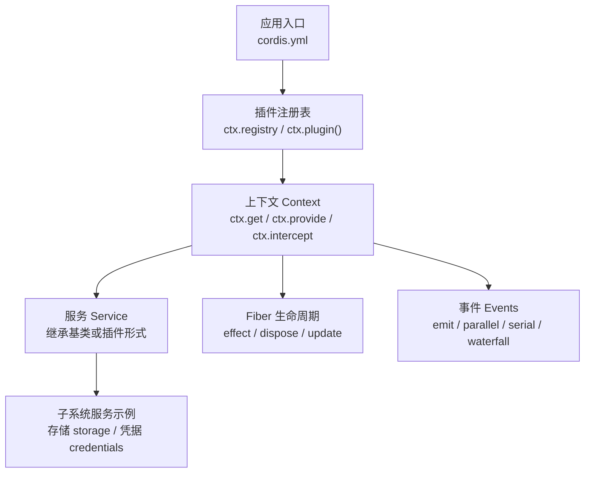
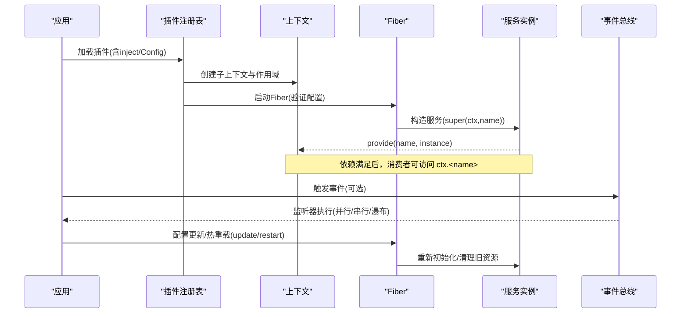
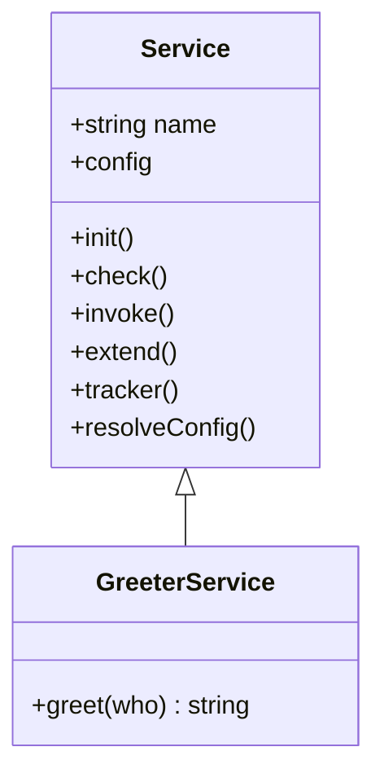
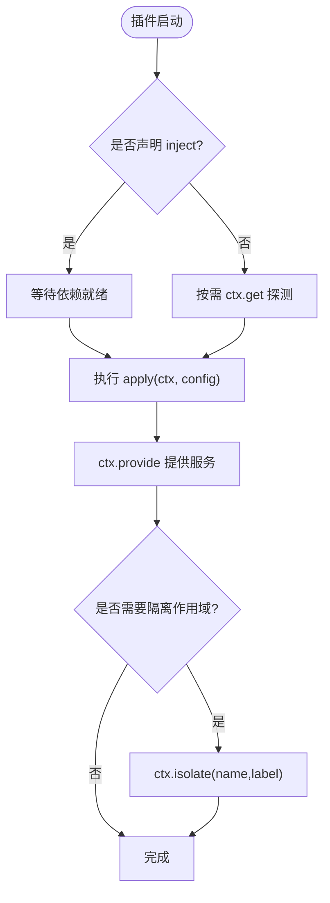
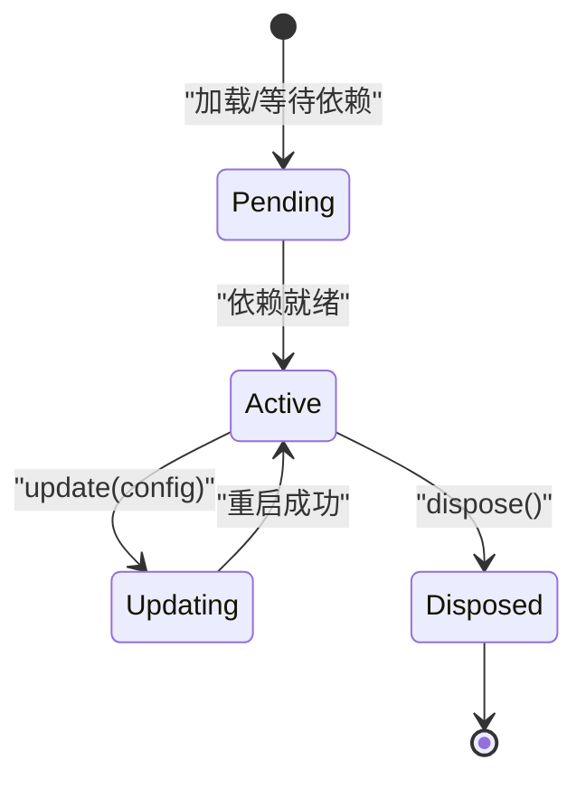
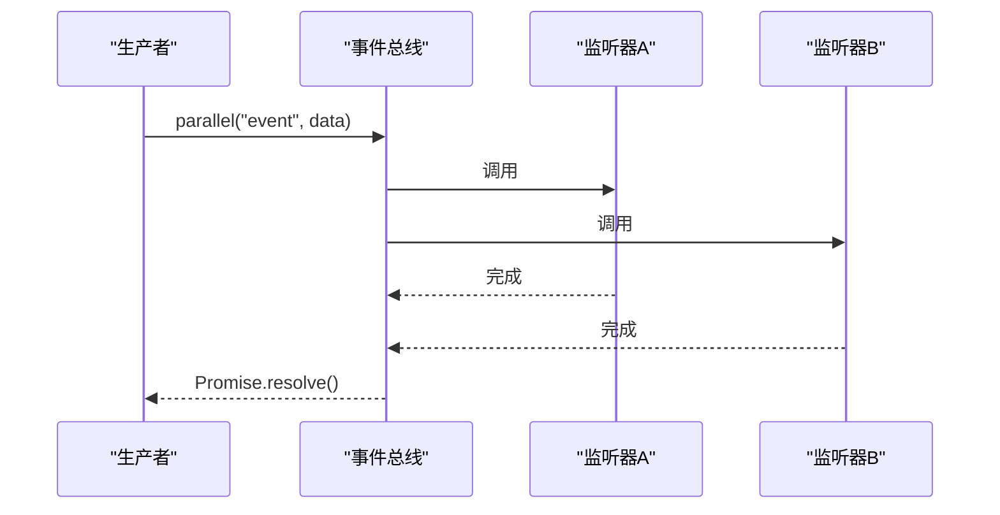
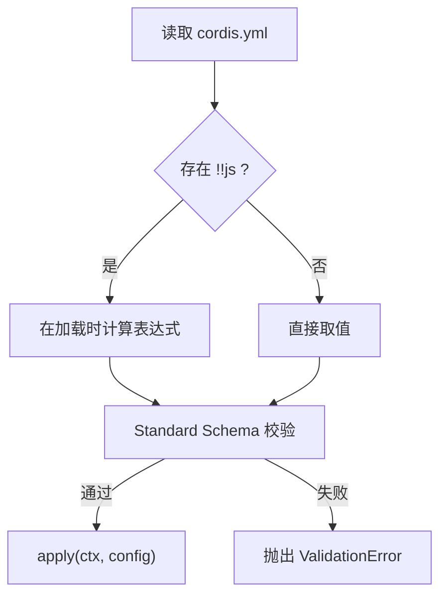
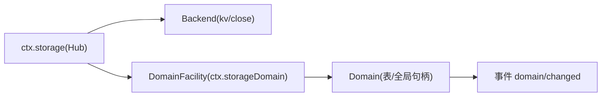
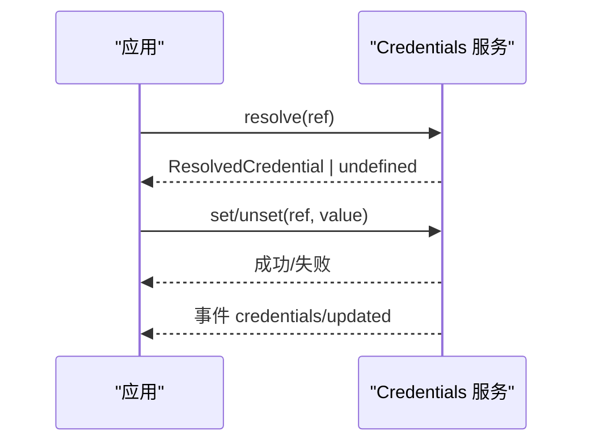
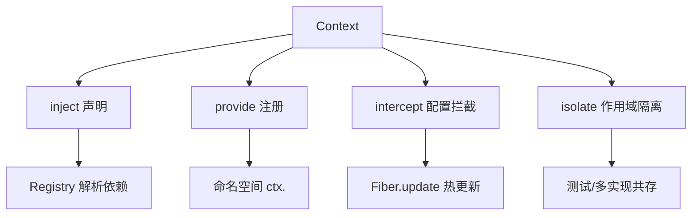

# 服务开发

<cite>
**本文引用的文件**
- [service.md](file://docs/cordis-api/service.md)
- [context.md](file://docs/cordis-api/context.md)
- [registry.md](file://docs/cordis-api/registry.md)
- [fiber.md](file://docs/cordis-api/fiber.md)
- [events.md](file://docs/cordis-api/events.md)
- [03-services.md](file://docs/cordis-tutorial/03-services.md)
- [05-config.md](file://docs/cordis-tutorial/05-config.md)
- [storage.md](file://docs/subsystems/storage.md)
- [credentials.md](file://docs/subsystems/credentials.md)
</cite>

## 目录
1. [简介](#简介)
2. [项目结构](#项目结构)
3. [核心组件](#核心组件)
4. [架构总览](#架构总览)
5. [详细组件分析](#详细组件分析)
6. [依赖关系分析](#依赖关系分析)
7. [性能考虑](#性能考虑)
8. [故障排查指南](#故障排查指南)
9. [结论](#结论)
10. [附录](#附录)

## 简介
本指南面向基于 Cordis 框架开发自定义服务的工程师，系统阐述服务的接口定义、实现规范、生命周期管理、注册机制、依赖注入与上下文传播，并覆盖并发处理、错误恢复、资源管理、配置与环境变量、动态配置更新。文档还给出数据存储服务、认证（凭据）服务等类型服务的完整示例路径，并提供测试策略、性能优化与生产部署最佳实践建议。

## 项目结构
Cordis 将“服务”作为插件化的能力单元：服务通过基类或插件形式在上下文中以名称暴露 API；消费者通过依赖声明获取服务，而不关心具体提供者。框架提供上下文、插件注册表、Fiber 生命周期、事件总线等基础设施，支撑服务的高内聚、低耦合与可替换性。

图表来源
- [registry.md:35-56](file://docs/cordis-api/registry.md#L35-L56)
- [context.md:237-314](file://docs/cordis-api/context.md#L237-L314)
- [fiber.md:8-37](file://docs/cordis-api/fiber.md#L8-L37)
- [events.md:8-123](file://docs/cordis-api/events.md#L8-L123)
- [storage.md:9-24](file://docs/subsystems/storage.md#L9-L24)
- [credentials.md:1-7](file://docs/subsystems/credentials.md#L1-L7)

章节来源
- [registry.md:35-56](file://docs/cordis-api/registry.md#L35-L56)
- [context.md:237-314](file://docs/cordis-api/context.md#L237-L314)
- [fiber.md:8-37](file://docs/cordis-api/fiber.md#L8-L37)
- [events.md:8-123](file://docs/cordis-api/events.md#L8-L123)
- [storage.md:9-24](file://docs/subsystems/storage.md#L9-L24)
- [credentials.md:1-7](file://docs/subsystems/credentials.md#L1-L7)

## 核心组件
- 服务基类与命名注册：服务通过继承基类并在构造函数中调用父构造器完成命名注册，随所属 Fiber 自动卸载。
- 上下文与依赖注入：Context 提供 get/provide/accessor/mixin 等能力；插件可通过 inject 声明强依赖，未就绪时挂起加载。
- Fiber 生命周期：effect 注册清理回调；update/restart 支持热更新与配置变更；dispose 保证资源释放。
- 事件总线：提供 emit/parallel/serial/bail/waterfall 多种分发模式，用于解耦与编排。
- 配置与拦截：插件可声明 Config 校验；intercept 可在子作用域为特定服务注入配置片段。

章节来源
- [service.md:4-23](file://docs/cordis-api/service.md#L4-L23)
- [registry.md:8-31](file://docs/cordis-api/registry.md#L8-L31)
- [fiber.md:8-37](file://docs/cordis-api/fiber.md#L8-L37)
- [events.md:8-123](file://docs/cordis-api/events.md#L8-L123)
- [context.md:68-96](file://docs/cordis-api/context.md#L68-L96)

## 架构总览
下图展示服务从注册到消费的关键交互：插件加载、服务提供、依赖解析、生命周期管理与事件通信。

图表来源
- [registry.md:35-56](file://docs/cordis-api/registry.md#L35-L56)
- [context.md:286-314](file://docs/cordis-api/context.md#L286-L314)
- [fiber.md:248-274](file://docs/cordis-api/fiber.md#L248-L274)
- [events.md:8-123](file://docs/cordis-api/events.md#L8-L123)

## 详细组件分析

### 服务接口与实现规范
- 命名服务：继承服务基类并在构造函数中调用父构造器，立即以指定名称注册到上下文，随 Fiber 卸载自动移除。
- 类型安全：通过模块扩展声明 Context 的具名属性，使消费者获得编译期类型检查。
- 可插拔：服务即插件，既可用类形式也可用函数/对象形式注册，便于按环境或配置切换实现。

图表来源
- [service.md:4-23](file://docs/cordis-api/service.md#L4-L23)
- [service.md:27-103](file://docs/cordis-api/service.md#L27-L103)

章节来源
- [service.md:4-23](file://docs/cordis-api/service.md#L4-L23)
- [03-services.md:7-42](file://docs/cordis-tutorial/03-services.md#L7-L42)

### 依赖注入与上下文传播
- 强依赖：插件通过 inject 声明所需服务，框架确保所有依赖就绪后才运行 apply，避免竞态。
- 弱依赖：使用 ctx.get 按需探测，返回 undefined 表示不可用，适合可选能力。
- 作用域隔离：ctx.isolate 可为某服务建立独立作用域，便于多实现并存或测试替换。
- 配置拦截：ctx.intercept 为下游插件注入针对某服务的配置片段，不污染父上下文。

图表来源
- [registry.md:8-31](file://docs/cordis-api/registry.md#L8-L31)
- [context.md:39-96](file://docs/cordis-api/context.md#L39-L96)
- [context.md:237-314](file://docs/cordis-api/context.md#L237-L314)

章节来源
- [registry.md:8-31](file://docs/cordis-api/registry.md#L8-L31)
- [context.md:39-96](file://docs/cordis-api/context.md#L39-L96)
- [context.md:237-314](file://docs/cordis-api/context.md#L237-L314)
- [03-services.md:44-95](file://docs/cordis-tutorial/03-services.md#L44-L95)

### 生命周期管理与资源清理
- effect：在 Fiber 上注册带清理回调的效果，卸载时按逆序回收。
- dispose：显式释放资源；Fiber 自身也负责统一回收。
- update/restart：支持运行时配置更新与热重载，内部先运行更新钩子再重启。
- 状态与诊断：Fiber 暴露 state、getEffects 等用于排障。

图表来源
- [fiber.md:8-37](file://docs/cordis-api/fiber.md#L8-L37)
- [fiber.md:248-274](file://docs/cordis-api/fiber.md#L248-L274)
- [fiber.md:102-120](file://docs/cordis-api/fiber.md#L102-L120)

章节来源
- [fiber.md:8-37](file://docs/cordis-api/fiber.md#L8-L37)
- [fiber.md:248-274](file://docs/cordis-api/fiber.md#L248-L274)
- [fiber.md:102-120](file://docs/cordis-api/fiber.md#L102-L120)

### 并发处理、错误恢复与事件协作
- 事件分发模式：
  - emit：同步广播，忽略返回值。
  - parallel：并发执行所有监听器，全部完成后 resolve。
  - serial：顺序执行，遇到第一个 bail 值停止。
  - bail：同步短路。
  - waterfall：链式 next 组合，支持拦截与改写。
- 错误恢复：Fiber 启动失败进入 FAILED；事件监听器异常被捕获并记录，不影响已提交操作（除 INVARIANT 级）。

图表来源
- [events.md:8-123](file://docs/cordis-api/events.md#L8-L123)

章节来源
- [events.md:8-123](file://docs/cordis-api/events.md#L8-L123)

### 配置选项、环境变量与动态更新
- 配置校验：插件导出 Config 校验器，启动前严格校验，失败则拒绝加载。
- 计算值：支持 !!js 标签在配置中计算运行时值（如读取环境变量）。
- 动态更新：Fiber.update 接收新配置并重启；结合 intercept 可实现作用域内的配置覆盖。

图表来源
- [05-config.md:7-51](file://docs/cordis-tutorial/05-config.md#L7-L51)
- [05-config.md:70-81](file://docs/cordis-tutorial/05-config.md#L70-L81)
- [fiber.md:248-274](file://docs/cordis-api/fiber.md#L248-L274)

章节来源
- [05-config.md:7-51](file://docs/cordis-tutorial/05-config.md#L7-L51)
- [05-config.md:70-81](file://docs/cordis-tutorial/05-config.md#L70-L81)
- [fiber.md:248-274](file://docs/cordis-api/fiber.md#L248-L274)

### 示例一：数据存储服务（Storage）
- 角色划分：Hub（ctx.storage）、后端（backend）、领域层（ctx.storageDomain），职责清晰、互不侵入。
- 后端契约：每个 backend 拥有单一介质，暴露可选能力（如 kv），close 幂等且有序释放。
- 领域模型：DomainSpec 描述领域标识、版本、全局槽与表结构；open 过程严格校验并路由到后端。
- 变更事件：domain/changed 在持久化成功后发出，顺序一致，供观察者增量更新。

图表来源
- [storage.md:9-24](file://docs/subsystems/storage.md#L9-L24)
- [storage.md:26-47](file://docs/subsystems/storage.md#L26-L47)
- [storage.md:49-99](file://docs/subsystems/storage.md#L49-L99)
- [storage.md:100-125](file://docs/subsystems/storage.md#L100-L125)

章节来源
- [storage.md:9-24](file://docs/subsystems/storage.md#L9-L24)
- [storage.md:26-47](file://docs/subsystems/storage.md#L26-L47)
- [storage.md:49-99](file://docs/subsystems/storage.md#L49-L99)
- [storage.md:100-125](file://docs/subsystems/storage.md#L100-L125)

### 示例二：认证服务（凭据 Credentials）
- 设计要点：配置仅保存引用（环境变量名），实际值由 Provider 管理；每次操作重新解析，天然支持热更新。
- 能力边界：describe 仅暴露可写性与来源，不泄露值；set/unset 受来源限制，空值视为未配置。
- 变更通知：credentials/updated 在持久化变更后发出，UI 可据此刷新状态。

图表来源
- [credentials.md:1-7](file://docs/subsystems/credentials.md#L1-L7)
- [credentials.md:18-50](file://docs/subsystems/credentials.md#L18-L50)
- [credentials.md:48-51](file://docs/subsystems/credentials.md#L48-L51)
- [credentials.md:60-104](file://docs/subsystems/credentials.md#L60-L104)
- [credentials.md:106-133](file://docs/subsystems/credentials.md#L106-L133)

章节来源
- [credentials.md:1-7](file://docs/subsystems/credentials.md#L1-L7)
- [credentials.md:18-50](file://docs/subsystems/credentials.md#L18-L50)
- [credentials.md:48-51](file://docs/subsystems/credentials.md#L48-L51)
- [credentials.md:60-104](file://docs/subsystems/credentials.md#L60-L104)
- [credentials.md:106-133](file://docs/subsystems/credentials.md#L106-L133)

### 示例三：监控服务（概念性）
- 目标：采集指标、日志与追踪信息，上报至监控系统。
- 建议实现：
  - 以服务形式暴露采集 API（如 metrics.increment、trace.span）。
  - 使用事件总线异步批量上报，避免阻塞主流程。
  - 通过 Fiber.effect 注册定时任务与资源清理。
  - 使用 ctx.intercept 在不同环境切换上报端点与采样率。
- 注意：保持无副作用的轻量采集逻辑，重活交给后台队列。

[本节为概念性说明，不直接分析具体文件]

## 依赖关系分析
- 松耦合：消费者通过名称依赖服务，不感知具体实现；Provider 可替换。
- 作用域：isolate 允许同一服务名在不同作用域提供不同实现，便于测试与多租户。
- 配置分层：intercept 提供细粒度配置覆盖，update/restart 支持热更新。

图表来源
- [registry.md:8-31](file://docs/cordis-api/registry.md#L8-L31)
- [context.md:39-96](file://docs/cordis-api/context.md#L39-L96)
- [fiber.md:248-274](file://docs/cordis-api/fiber.md#L248-L274)

章节来源
- [registry.md:8-31](file://docs/cordis-api/registry.md#L8-L31)
- [context.md:39-96](file://docs/cordis-api/context.md#L39-L96)
- [fiber.md:248-274](file://docs/cordis-api/fiber.md#L248-L274)

## 性能考虑
- 事件选择：高频场景优先使用 emit 或 parallel；需要顺序与短路时使用 serial/bail；复杂编排使用 waterfall。
- 资源管理：所有外部资源（连接、定时器、文件句柄）通过 Fiber.effect 注册，确保卸载时释放。
- 配置热更：利用 update/restart 实现零停机升级；避免在热路径做昂贵初始化。
- 存储写入：遵循领域层的写队列与原子性语义，避免并发竞争与内存-介质不一致。
- 凭据解析：每次操作重新解析，避免缓存过期问题，代价可控。

[本节提供通用指导，不直接分析具体文件]

## 故障排查指南
- 配置错误：ValidationError 会阻止插件启动，定位到 schema 的具体字段。
- 依赖缺失：inject 未满足时插件保持 PENDING，不会崩溃；检查服务注册顺序与名称。
- 作用域问题：isolate 导致服务名在不同作用域解析不同；确认 label 与期望一致。
- 事件异常：监听器抛错会被捕获并记录，必要时启用更严格的监听器或拆分链路。
- 资源泄漏：使用 getEffects 查看已注册 effect；确保 disposer 被正确调用。

章节来源
- [fiber.md:357-375](file://docs/cordis-api/fiber.md#L357-L375)
- [03-services.md:74-79](file://docs/cordis-tutorial/03-services.md#L74-L79)
- [events.md:8-123](file://docs/cordis-api/events.md#L8-L123)

## 结论
Cordis 通过“服务即插件”的设计，将能力抽象为可插拔、可替换、可观测的单元。借助 Context 的作用域与拦截、Fiber 的生命周期与热更新、事件的灵活分发，开发者可以构建高内聚、低耦合、易测试的服务体系。配合存储与凭据等子系统，能够覆盖数据持久化、安全凭据管理等关键场景。

[本节总结性内容，不直接分析具体文件]

## 附录
- 快速上手：参考教程中的“服务”与“配置”章节，逐步掌握服务提供、依赖注入与配置校验。
- 生产部署：
  - 使用最小权限原则与沙箱约束，避免服务间越权访问。
  - 通过环境变量与 !!js 控制敏感配置，结合凭据服务集中管理。
  - 开启健康检查与指标上报，结合事件与日志进行可观测性建设。
- 测试策略：
  - 使用 isolate 注入测试替身，隔离外部依赖。
  - 利用 inject 的延迟特性编写确定性用例。
  - 对事件驱动逻辑采用快照与断言组合的方式验证。

[本节提供通用指导，不直接分析具体文件]