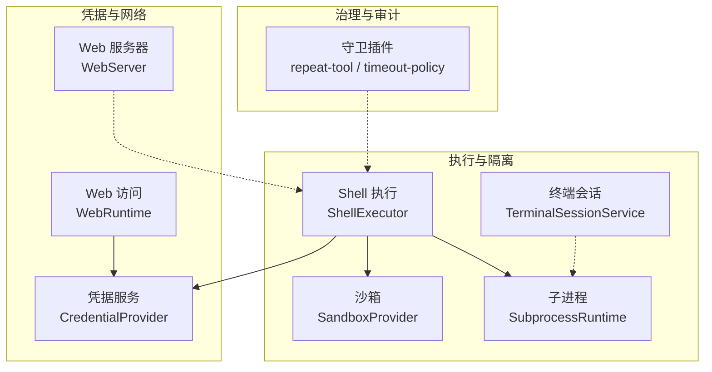
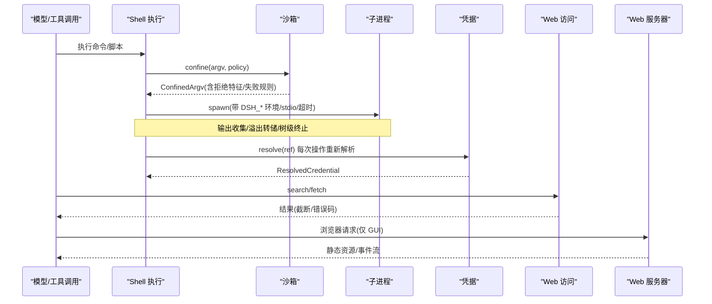
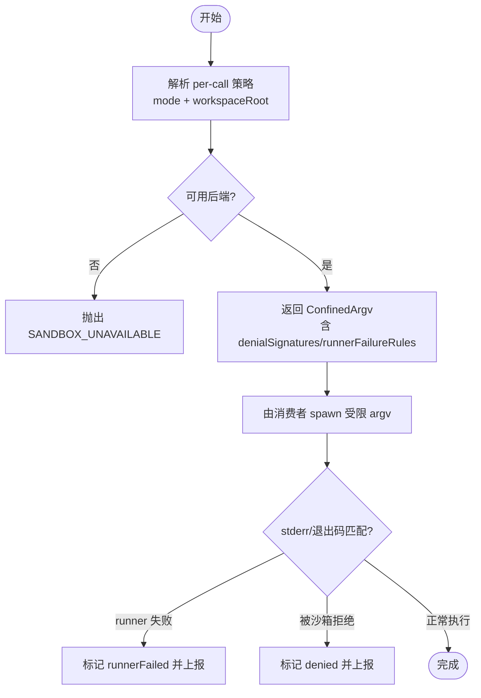
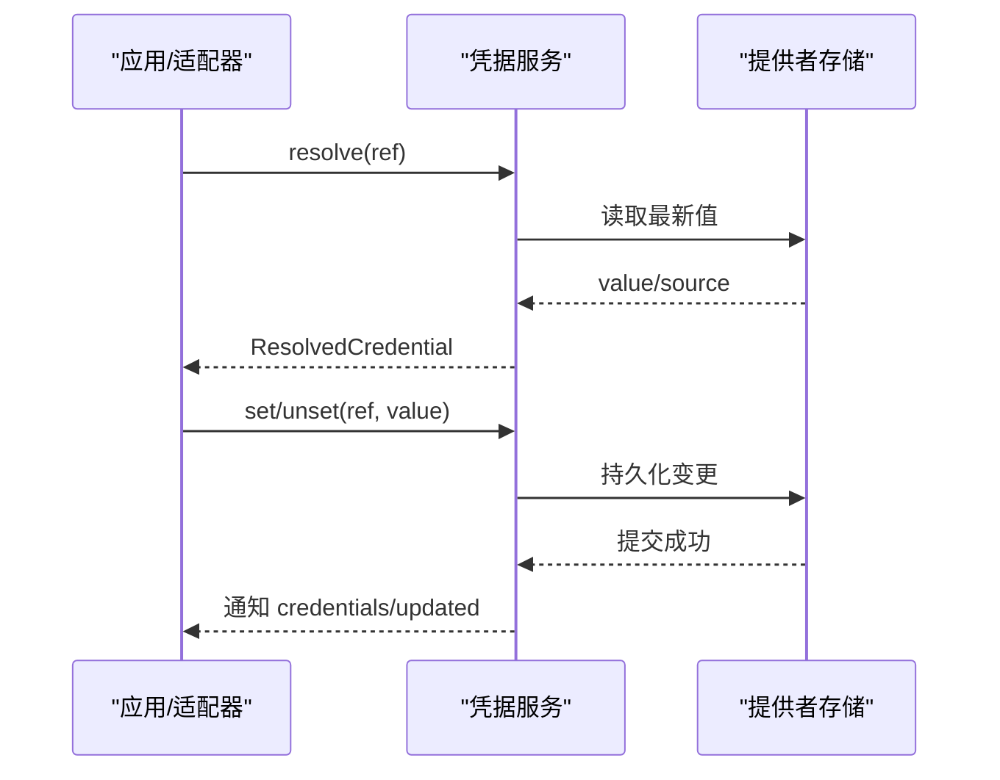
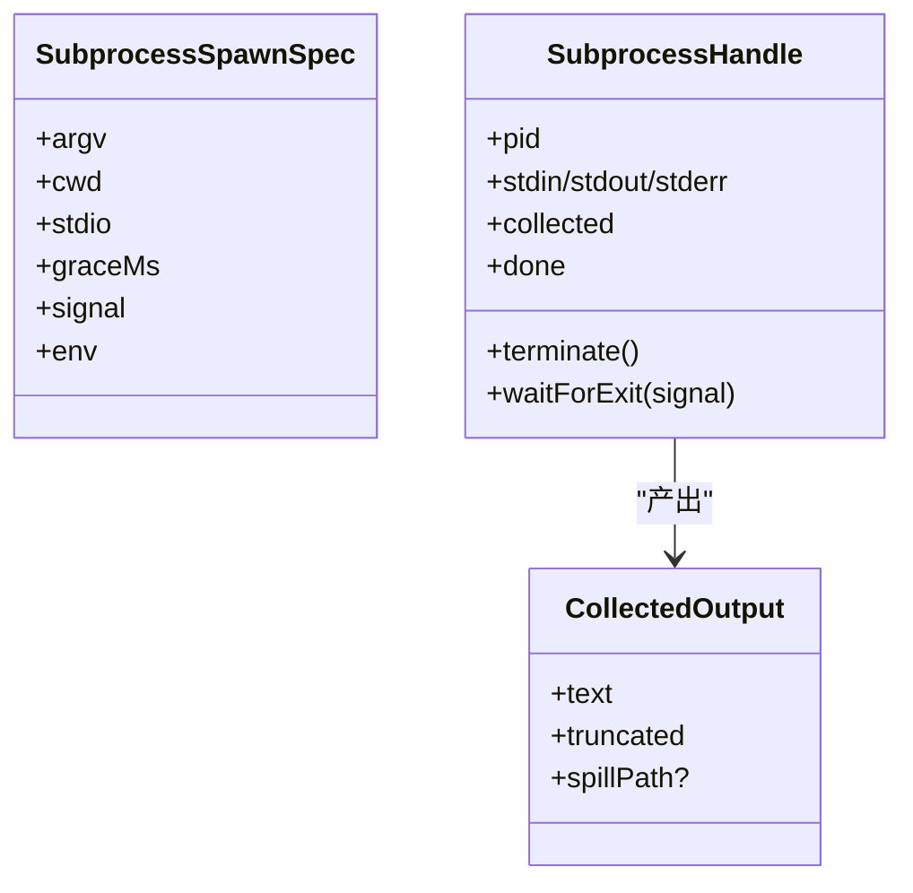
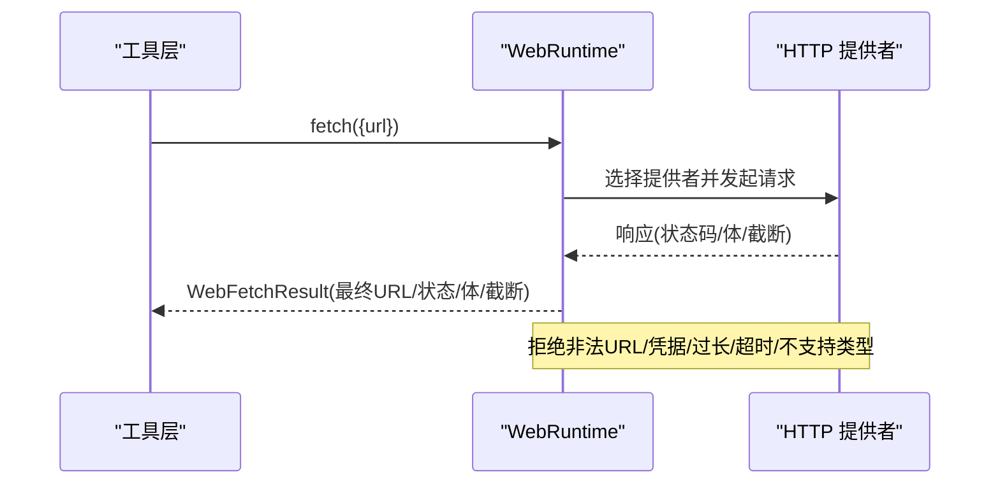
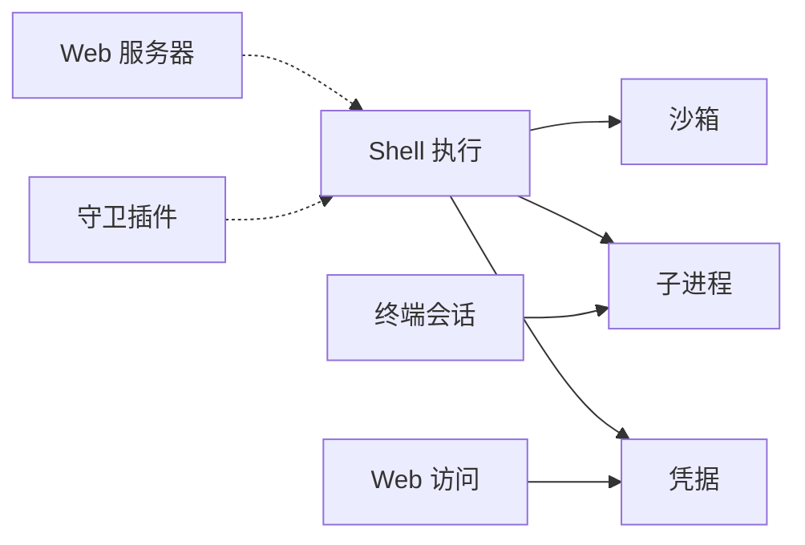

# 安全最佳实践

<cite>
**本文引用的文件**
- [packages/sandbox/sandbox/src/index.ts](file://packages/sandbox/sandbox/src/index.ts)
- [docs/subsystems/sandbox.md](file://docs/subsystems/sandbox.md)
- [packages/credentials/credentials/src/index.ts](file://packages/credentials/credentials/src/index.ts)
- [docs/subsystems/credentials.md](file://docs/subsystems/credentials.md)
- [packages/credentials/credentials-local/README.md](file://packages/credentials/credentials-local/README.md)
- [docs/subsystems/subprocess.md](file://docs/subsystems/subprocess.md)
- [docs/subsystems/shell.md](file://docs/subsystems/shell.md)
- [docs/subsystems/web.md](file://docs/subsystems/web.md)
- [packages/web/web-fetch-http/tests/fetch-http.spec.ts](file://packages/web/web-fetch-http/tests/fetch-http.spec.ts)
- [docs/subsystems/web-server.md](file://docs/subsystems/web-server.md)
- [packages/host/webserver/README.md](file://packages/host/webserver/README.md)
- [packages/guard/README.md](file://packages/guard/README.md)
- [packages/terminal/terminal/src/index.ts](file://packages/terminal/terminal/src/index.ts)
- [docs/subsystems/terminal.md](file://docs/subsystems/terminal.md)
</cite>

## 目录
1. [引言](#引言)
2. [项目结构](#项目结构)
3. [核心组件](#核心组件)
4. [架构总览](#架构总览)
5. [详细组件分析](#详细组件分析)
6. [依赖关系分析](#依赖关系分析)
7. [性能与安全权衡](#性能与安全权衡)
8. [故障排查指南](#故障排查指南)
9. [结论](#结论)
10. [附录](#附录)

## 引言
本指南面向第三方集成与扩展开发，聚焦身份认证、授权控制、数据保护、沙箱隔离、凭据管理、网络安全、审计与合规以及常见威胁防护。内容基于代码库中已实现的安全能力与边界说明，提供可操作的策略与实践建议，帮助在保持功能可用性的同时降低风险面。

## 项目结构
本项目将安全相关能力按“能力接缝（capability seam）”拆分到独立包与文档：
- 进程沙箱：sandbox 抽象 + 本地后端（Linux/macOS/Windows），为工具执行提供文件系统限制。
- 凭据：credentials 抽象 + 本地提供者，统一引用解析与变更传播。
- 子进程：subprocess 抽象，负责受控环境、输出收集与终止语义。
- Shell 执行：shell 抽象，整合沙箱策略、超时、输出与后台任务。
- Web 访问：web 抽象 + fetch/search 提供者，内置传输层安全与大小限制。
- Web 服务器：host webserver，仅用于 GUI 宿主，无 TLS/鉴权。
- 终端会话：terminal 抽象，PTY 生命周期与信号控制。
- 守卫插件：guard，对循环行为进行预算与提醒约束。

图表来源
- [packages/sandbox/sandbox/src/index.ts:158-176](file://packages/sandbox/sandbox/src/index.ts#L158-L176)
- [docs/subsystems/subprocess.md:276-323](file://docs/subsystems/subprocess.md#L276-L323)
- [docs/subsystems/shell.md:231-267](file://docs/subsystems/shell.md#L231-L267)
- [packages/credentials/credentials/src/index.ts:60-101](file://packages/credentials/credentials/src/index.ts#L60-L101)
- [docs/subsystems/web.md:142-196](file://docs/subsystems/web.md#L142-L196)
- [docs/subsystems/web-server.md:57-105](file://docs/subsystems/web-server.md#L57-L105)
- [packages/terminal/terminal/src/index.ts:101-179](file://packages/terminal/terminal/src/index.ts#L101-L179)
- [packages/guard/README.md:1-13](file://packages/guard/README.md#L1-L13)

章节来源
- [docs/subsystems/sandbox.md:1-219](file://docs/subsystems/sandbox.md#L1-L219)
- [docs/subsystems/credentials.md:1-134](file://docs/subsystems/credentials.md#L1-L134)
- [docs/subsystems/subprocess.md:1-325](file://docs/subsystems/subprocess.md#L1-L325)
- [docs/subsystems/shell.md:1-304](file://docs/subsystems/shell.md#L1-L304)
- [docs/subsystems/web.md:1-200](file://docs/subsystems/web.md#L1-L200)
- [docs/subsystems/web-server.md:1-109](file://docs/subsystems/web-server.md#L1-L109)
- [docs/subsystems/terminal.md:1-185](file://docs/subsystems/terminal.md#L1-L185)
- [packages/guard/README.md:1-13](file://packages/guard/README.md#L1-L13)

## 核心组件
- 进程沙箱：以 per-call 策略包裹 argv，返回受限执行参数与“完整度”报告；不可用时报错而非静默放行。
- 凭据服务：以“引用”代替明文配置，每次操作重新解析，支持描述与持久化写入，空值视为未配置。
- 子进程：显式 stdio 模式、DSH_* 命名空间、收集输出与树级终止。
- Shell 执行：合并沙箱策略、超时、输出上限与后台任务；失败分类清晰。
- Web 访问：搜索与抓取能力分离，提供者选择策略明确，HTTP 传输具备 URL/重定向/大小/超时校验。
- Web 服务器：仅服务于浏览器 GUI，默认不暴露于非回环地址，无 TLS/鉴权。
- 终端会话：PTY 生命周期、前台进程组信号、清理与状态观察。
- 守卫插件：重复调用提醒与每调用超时策略，作为可插拔的循环治理。

章节来源
- [packages/sandbox/sandbox/src/index.ts:23-176](file://packages/sandbox/sandbox/src/index.ts#L23-L176)
- [packages/credentials/credentials/src/index.ts:18-101](file://packages/credentials/credentials/src/index.ts#L18-L101)
- [docs/subsystems/subprocess.md:13-130](file://docs/subsystems/subprocess.md#L13-L130)
- [docs/subsystems/shell.md:9-166](file://docs/subsystems/shell.md#L9-L166)
- [docs/subsystems/web.md:120-133](file://docs/subsystems/web.md#L120-L133)
- [docs/subsystems/web-server.md:29-47](file://docs/subsystems/web-server.md#L29-L47)
- [docs/subsystems/terminal.md:25-91](file://docs/subsystems/terminal.md#L25-L91)
- [packages/guard/README.md:1-13](file://packages/guard/README.md#L1-L13)

## 架构总览
下图展示第三方集成典型请求路径：模型驱动的工具调用经 Shell 执行，按需进入沙箱封装，通过子进程运行；凭据在服务层按需解析；Web 抓取走独立提供者；GUI 通过 Web 服务器暴露有限路由。

图表来源
- [docs/subsystems/shell.md:231-267](file://docs/subsystems/shell.md#L231-L267)
- [packages/sandbox/sandbox/src/index.ts:158-176](file://packages/sandbox/sandbox/src/index.ts#L158-L176)
- [docs/subsystems/subprocess.md:276-323](file://docs/subsystems/subprocess.md#L276-L323)
- [packages/credentials/credentials/src/index.ts:60-101](file://packages/credentials/credentials/src/index.ts#L60-L101)
- [docs/subsystems/web.md:142-196](file://docs/subsystems/web.md#L142-L196)
- [docs/subsystems/web-server.md:57-105](file://docs/subsystems/web-server.md#L57-L105)

## 详细组件分析

### 进程沙箱与授权控制
- 模式与强制度：read-only/workspace-write/danger-full-access；full/partial 表示当前主机能达到的强制程度。
- per-call 策略：包含 mode、workspaceRoot、可选 sessionId，避免共享可变状态。
- 失败分类：denialSignatures 标识被沙箱拒绝；runnerFailureRules 标识 runner 自身失败。
- 失败关闭：无可用时抛出 SANDBOX_UNAVAILABLE，禁止静默降级。

图表来源
- [docs/subsystems/sandbox.md:9-156](file://docs/subsystems/sandbox.md#L9-L156)
- [packages/sandbox/sandbox/src/index.ts:23-176](file://packages/sandbox/sandbox/src/index.ts#L23-L176)

章节来源
- [docs/subsystems/sandbox.md:9-156](file://docs/subsystems/sandbox.md#L9-L156)
- [packages/sandbox/sandbox/src/index.ts:23-176](file://packages/sandbox/sandbox/src/index.ts#L23-L176)

### 凭据管理与密钥轮换
- 引用优先：配置只保存环境变量名等引用，值由提供者管理。
- 每次操作解析：确保旋转后的凭据立即生效，无需重启。
- 描述与写保护：describe 返回是否可写与来源层，避免“看似成功实则无效”的写入。
- 存储边界：本地提供者使用权限受限的文件存储；模型无法直接读取该路径，但同用户进程仍可读取，因此不是绝对边界。

图表来源
- [packages/credentials/credentials/src/index.ts:60-146](file://packages/credentials/credentials/src/index.ts#L60-L146)
- [docs/subsystems/credentials.md:18-50](file://docs/subsystems/credentials.md#L18-L50)
- [packages/credentials/credentials-local/README.md:52-64](file://packages/credentials/credentials-local/README.md#L52-L64)

章节来源
- [docs/subsystems/credentials.md:1-134](file://docs/subsystems/credentials.md#L1-L134)
- [packages/credentials/credentials/src/index.ts:18-146](file://packages/credentials/credentials/src/index.ts#L18-L146)
- [packages/credentials/credentials-local/README.md:52-64](file://packages/credentials/credentials-local/README.md#L52-L64)

### 子进程与文件系统限制
- 受控环境：DSH_* 命名空间由 Harness 管理，合并前丢弃继承的同名变量。
- 输出收集：collect 模式支持溢出转储，reader 基于偏移读取，避免竞争。
- 终止语义：tree-scoped 终止，SIGTERM→grace→SIGKILL，waitForExit 等待整棵树退出。
- 与沙箱协作：shell 执行层注入沙箱策略，bash/终端等消费方据此决定受限执行。

图表来源
- [docs/subsystems/subprocess.md:89-174](file://docs/subsystems/subprocess.md#L89-L174)
- [docs/subsystems/subprocess.md:221-249](file://docs/subsystems/subprocess.md#L221-L249)

章节来源
- [docs/subsystems/subprocess.md:13-174](file://docs/subsystems/subprocess.md#L13-L174)
- [docs/subsystems/shell.md:141-166](file://docs/subsystems/shell.md#L141-L166)

### Web 访问安全
- 提供者选择：按 id/可用性选择，避免顺序依赖。
- 传输安全：仅 http/https，拒绝 URL 中的凭据，限制重定向、字节/字符/时间，解码受控。
- 错误分类：统一的 WebError 体系，区分网络/协议/策略错误。
- SSRF 注意：默认不阻断私有网络目标，部署需评估启用范围。

图表来源
- [docs/subsystems/web.md:120-133](file://docs/subsystems/web.md#L120-L133)
- [docs/subsystems/web.md:142-196](file://docs/subsystems/web.md#L142-L196)
- [packages/web/web-fetch-http/tests/fetch-http.spec.ts:276-380](file://packages/web/web-fetch-http/tests/fetch-http.spec.ts#L276-L380)

章节来源
- [docs/subsystems/web.md:1-200](file://docs/subsystems/web.md#L1-L200)
- [packages/web/web-fetch-http/tests/fetch-http.spec.ts:276-380](file://packages/web/web-fetch-http/tests/fetch-http.spec.ts#L276-L380)

### Web 服务器与网络暴露
- 用途：GUI 宿主的 HTTP 载体，注册路由与索引变换。
- 暴露面：仅支持 127.0.0.1 或 0.0.0.0；无 TLS/鉴权/源策略；绑定非回环即暴露给网络。
- 建议：生产环境应前置反向代理实现 TLS、鉴权与源策略。

章节来源
- [docs/subsystems/web-server.md:1-47](file://docs/subsystems/web-server.md#L1-L47)
- [packages/host/webserver/README.md:19-23](file://packages/host/webserver/README.md#L19-L23)

### 终端会话与进程组控制
- 会话生命周期：创建、发送、读取、信号、关闭，均受服务托管。
- 前台进程组：允许向已验证的前台进程组发送信号。
- 清理：close 会等待进程树安静退出，保证资源回收。

章节来源
- [docs/subsystems/terminal.md:25-91](file://docs/subsystems/terminal.md#L25-L91)
- [packages/terminal/terminal/src/index.ts:101-179](file://packages/terminal/terminal/src/index.ts#L101-L179)

### 守卫插件与合规性检查
- 重复调用提醒：在工具/代理事件上监听，输出上下文提示，避免无效循环。
- 超时策略：将每调用超时作为部署策略注入执行管线。
- 审计：所有守卫行为通过事件与日志可观测，便于合规审查。

章节来源
- [packages/guard/README.md:1-13](file://packages/guard/README.md#L1-L13)

## 依赖关系分析
- 低耦合：各能力以 Service Definition 暴露接口，具体实现位于独立包，便于替换与测试。
- 强内聚：每个包围绕单一职责组织类型与实现，减少跨域副作用。
- 外部依赖：Web 访问依赖底层网络栈；沙箱依赖平台内核能力（Landlock/Seatbelt/ACL）。

图表来源
- [docs/subsystems/shell.md:231-267](file://docs/subsystems/shell.md#L231-L267)
- [packages/sandbox/sandbox/src/index.ts:158-176](file://packages/sandbox/sandbox/src/index.ts#L158-L176)
- [docs/subsystems/subprocess.md:276-323](file://docs/subsystems/subprocess.md#L276-L323)
- [packages/credentials/credentials/src/index.ts:60-101](file://packages/credentials/credentials/src/index.ts#L60-L101)
- [docs/subsystems/web.md:142-196](file://docs/subsystems/web.md#L142-L196)
- [docs/subsystems/web-server.md:57-105](file://docs/subsystems/web-server.md#L57-L105)
- [packages/terminal/terminal/src/index.ts:101-179](file://packages/terminal/terminal/src/index.ts#L101-L179)
- [packages/guard/README.md:1-13](file://packages/guard/README.md#L1-L13)

## 性能与安全权衡
- 沙箱强制度：partial/full 影响误报与用户体验；在高价值场景优先 full。
- 凭据解析频率：每次操作解析带来轻微开销，但换来热更新与最小化缓存风险。
- 子进程输出：collect 模式可能产生溢出文件，需结合 spill 策略平衡内存与可恢复性。
- Web 抓取：严格限制体积与时间可减少资源滥用，但可能影响大文档体验；应在工具层呈现截断提示。

## 故障排查指南
- 沙箱不可用：当后端不可用时，捕获 SANDBOX_UNAVAILABLE，检查平台能力（bwrap/Landlock/Seatbelt/ACL）。
- 沙箱拒绝：根据 denialSignatures 判断是否为预期拒绝；若为 runnerFailureRules 命中，则修复 runner 配置。
- 凭据未生效：确认 describe 的 writable 与 source；必要时刷新存储层并观察 credentials/updated。
- Web 抓取失败：依据 WebError code 定位（如 WEB_INVALID_URL、WEB_BLOCKED_URL、WEB_FETCH_TIMEOUT），调整 URL 或策略。
- 子进程卡死：使用 terminate 与 waitForExit 组合，确认 graceMs 设置合理，检查是否有子进程持有句柄。
- 终端会话泄漏：确保 close 被调用并等待 quiescence，避免残留前台进程组。

章节来源
- [packages/sandbox/sandbox/src/index.ts:118-144](file://packages/sandbox/sandbox/src/index.ts#L118-L144)
- [docs/subsystems/sandbox.md:96-156](file://docs/subsystems/sandbox.md#L96-L156)
- [packages/credentials/credentials/src/index.ts:104-146](file://packages/credentials/credentials/src/index.ts#L104-L146)
- [docs/subsystems/web.md:126-133](file://docs/subsystems/web.md#L126-L133)
- [docs/subsystems/subprocess.md:132-174](file://docs/subsystems/subprocess.md#L132-L174)
- [docs/subsystems/terminal.md:89-91](file://docs/subsystems/terminal.md#L89-L91)

## 结论
通过将身份认证、授权控制与数据保护嵌入到能力接缝中，本项目提供了可组合、可替换且可审计的安全基线。建议在第三方集成中遵循以下原则：
- 始终使用沙箱限制文件系统影响，并在 partial 模式下采取额外防御。
- 通过凭据服务以引用方式管理密钥，避免硬编码与长驻缓存。
- 对网络访问采用最小权限与最大限制策略，谨慎启用 web_fetch。
- 使用子进程与终端服务的标准 API 管理生命周期与资源。
- 借助守卫插件与结构化错误码，建立可观测的审计与合规流程。

## 附录
- 术语速查
  - 沙箱模式：read-only / workspace-write / danger-full-access
  - 强制度：full / partial
  - 凭据引用：POSIX 风格的环境变量名
  - Web 错误码：WEB_* 系列，涵盖选择、传输与策略错误
- 参考路径
  - 沙箱定义与策略：[packages/sandbox/sandbox/src/index.ts](file://packages/sandbox/sandbox/src/index.ts)
  - 凭据服务与事件：[packages/credentials/credentials/src/index.ts](file://packages/credentials/credentials/src/index.ts)
  - 子进程规范：[docs/subsystems/subprocess.md](file://docs/subsystems/subprocess.md)
  - Shell 执行与沙箱融合：[docs/subsystems/shell.md](file://docs/subsystems/shell.md)
  - Web 访问与提供者：[docs/subsystems/web.md](file://docs/subsystems/web.md)
  - Web 服务器限制：[docs/subsystems/web-server.md](file://docs/subsystems/web-server.md)
  - 终端会话：[docs/subsystems/terminal.md](file://docs/subsystems/terminal.md)
  - 守卫插件：[packages/guard/README.md](file://packages/guard/README.md)