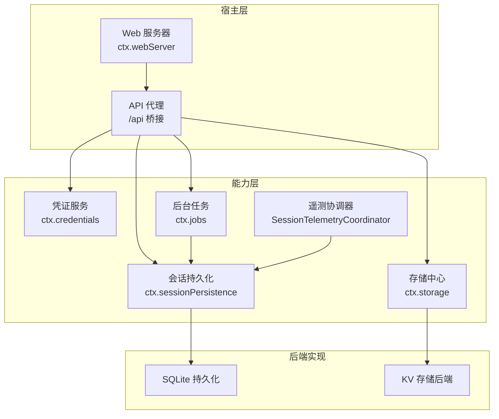
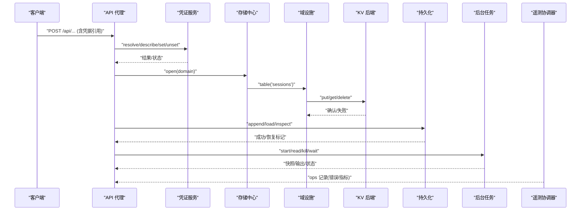
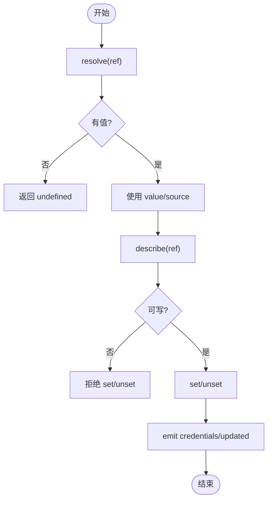
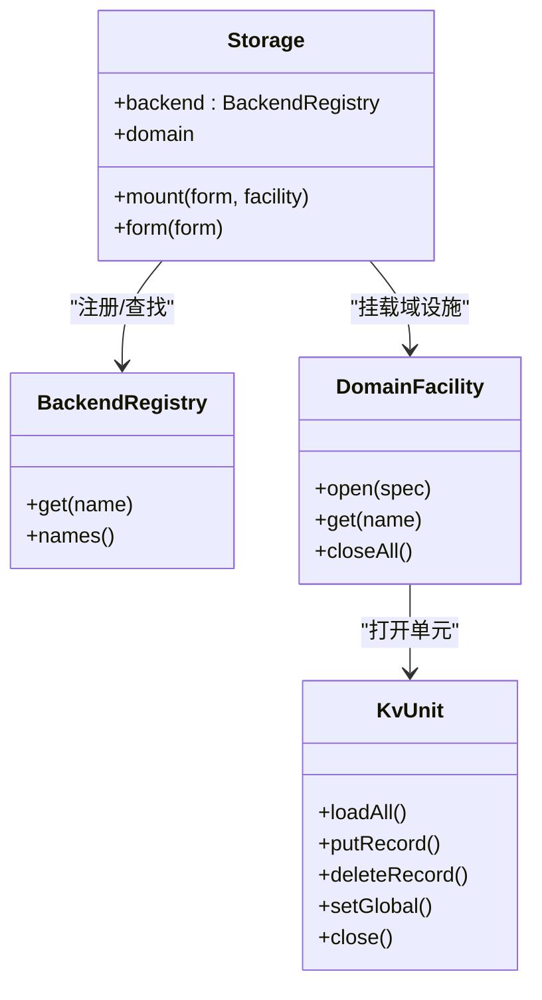
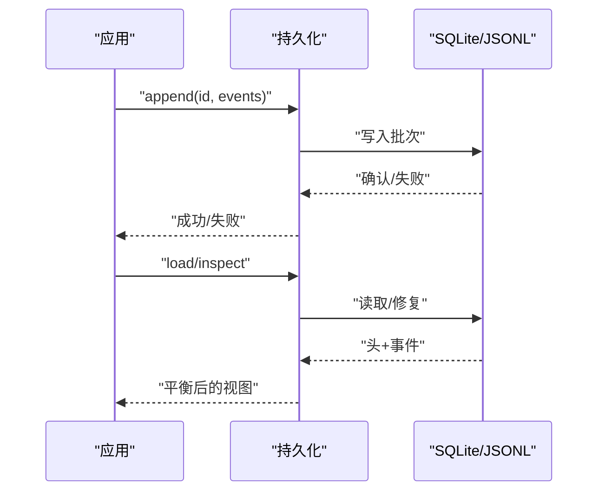
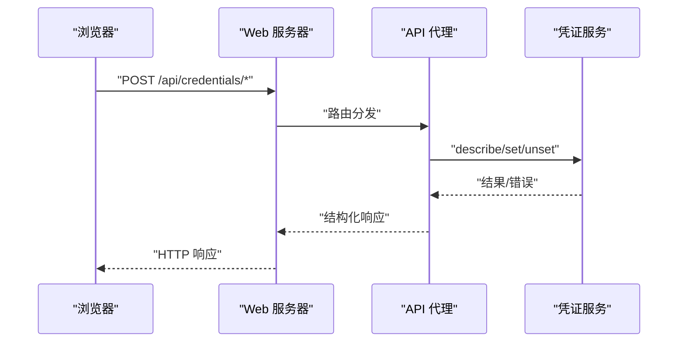
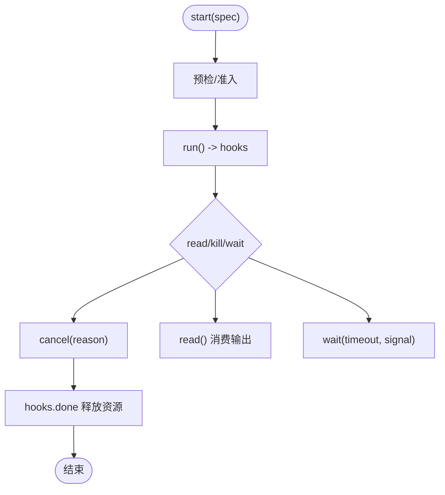
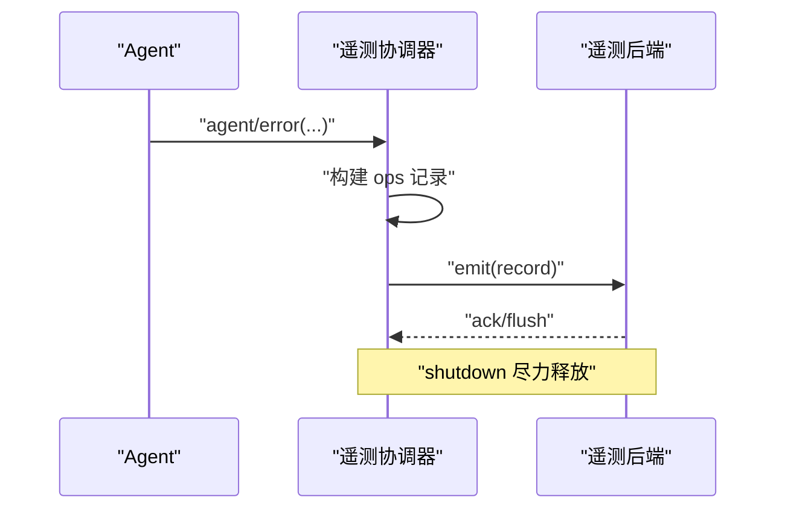
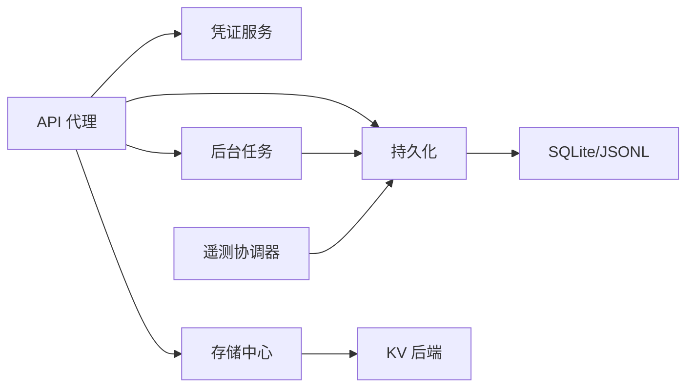

# 服务集成指南

<cite>
**本文引用的文件**
- [packages/credentials/credentials/src/index.ts](file://packages/credentials/credentials/src/index.ts)
- [docs/subsystems/credentials.md](file://docs/subsystems/credentials.md)
- [packages/storage/storage/src/index.ts](file://packages/storage/storage/src/index.ts)
- [packages/storage/storage/src/registry.ts](file://packages/storage/storage/src/registry.ts)
- [docs/subsystems/storage.md](file://docs/subsystems/storage.md)
- [packages/session/session-persistence-sqlite/src/index.ts](file://packages/session/session-persistence-sqlite/src/index.ts)
- [docs/subsystems/persistence.md](file://docs/subsystems/persistence.md)
- [packages/host/apiproxy/src/api-proxy.ts](file://packages/host/apiproxy/src/api-proxy.ts)
- [docs/subsystems/web-server.md](file://docs/subsystems/web-server.md)
- [docs/subsystems/jobs.md](file://docs/subsystems/jobs.md)
- [packages/session/session-telemetry/src/coordinator.ts](file://packages/session/session-telemetry/src/coordinator.ts)
- [packages/session/session-telemetry/src/index.ts](file://packages/session/session-telemetry/src/index.ts)
- [.agents/notes/implemented/architecture/2026-08-04-configuration-source-ownership.md](file://.agents/notes/implemented/architecture/2026-08-04-configuration-source-ownership.md)
- [scripts/verify-config-source-ownership.ts](file://scripts/verify-config-source-ownership.ts)
- [docs/config-catalog.md](file://docs/config-catalog.md)
</cite>

## 目录
1. [简介](#简介)
2. [项目结构](#项目结构)
3. [核心组件](#核心组件)
4. [架构总览](#架构总览)
5. [详细组件分析](#详细组件分析)
6. [依赖关系分析](#依赖关系分析)
7. [性能与高可用](#性能与高可用)
8. [故障排查与调试](#故障排查与调试)
9. [结论](#结论)
10. [附录：配置与示例](#附录：配置与示例)

## 简介
本指南面向需要在 DeepSeek Harness 中集成第三方服务的工程团队，覆盖数据库连接、消息队列、认证服务、存储服务等常见场景。文档基于仓库内已实现的子系统（凭证、存储、持久化、Web 服务器、后台任务、遥测等）给出可操作的集成路径、资源生命周期管理、错误恢复策略、安全与访问控制要点，以及监控与调试方法。所有说明均对应仓库中的实际实现与文档，避免臆造。

## 项目结构
DeepSeek Harness 采用插件化与服务发现模式组织能力：
- 能力接缝（Capability Seam）：以抽象服务定义暴露能力，具体实现由插件提供（如凭证、存储、持久化）。
- 服务注册与路由：通过上下文（ctx）注入服务键，按名称解析后端或数据形式。
- Web 网关：HTTP 服务器承载浏览器请求，并桥接到内部 API。
- 后台任务：统一的任务注册与生命周期管理。
- 遥测：会话级事件采集与上报。

图表来源
- [docs/subsystems/web-server.md:1-48](file://docs/subsystems/web-server.md#L1-L48)
- [packages/host/apiproxy/src/api-proxy.ts:3321-3368](file://packages/host/apiproxy/src/api-proxy.ts#L3321-L3368)
- [packages/storage/storage/src/index.ts:43-92](file://packages/storage/storage/src/index.ts#L43-L92)
- [docs/subsystems/persistence.md:231-237](file://docs/subsystems/persistence.md#L231-L237)
- [packages/session/session-telemetry/src/coordinator.ts:45-60](file://packages/session/session-telemetry/src/coordinator.ts#L45-L60)

章节来源
- [docs/subsystems/web-server.md:1-48](file://docs/subsystems/web-server.md#L1-L48)
- [docs/subsystems/storage.md:1-25](file://docs/subsystems/storage.md#L1-L25)
- [docs/subsystems/persistence.md:1-20](file://docs/subsystems/persistence.md#L1-L20)

## 核心组件
- 凭证服务（CredentialProvider）：以引用方式管理密钥，支持每操作重解析、描述元信息、写入/删除值，并提供变更事件。
- 存储中心（Storage）：后端注册表 + 数据形式挂载点；域设施通过 ctx.storageDomain 打开声明的领域。
- 会话持久化（SessionPersistence）：事件日志的追加式持久化，支持崩溃恢复、冷加载、快照列表等。
- Web 服务器（WebServer）：HTTP 路由、升级路由、回退处理器与 index.html 变换。
- 后台任务（JobRegistry）：任务注册、观察、取消、等待与完成通知。
- 遥测协调器（SessionTelemetryCoordinator）：捕获会话事件、错误，并投递到后端。

章节来源
- [packages/credentials/credentials/src/index.ts:1-146](file://packages/credentials/credentials/src/index.ts#L1-L146)
- [docs/subsystems/credentials.md:62-102](file://docs/subsystems/credentials.md#L62-L102)
- [packages/storage/storage/src/index.ts:43-92](file://packages/storage/storage/src/index.ts#L43-L92)
- [docs/subsystems/storage.md:9-25](file://docs/subsystems/storage.md#L9-L25)
- [docs/subsystems/persistence.md:231-237](file://docs/subsystems/persistence.md#L231-L237)
- [docs/subsystems/web-server.md:43-48](file://docs/subsystems/web-server.md#L43-L48)
- [docs/subsystems/jobs.md:155-158](file://docs/subsystems/jobs.md#L155-L158)
- [packages/session/session-telemetry/src/coordinator.ts:45-60](file://packages/session/session-telemetry/src/coordinator.ts#L45-L60)

## 架构总览
下图展示典型的外部服务集成流程：应用通过 API 代理调用凭证、存储、持久化等服务；存储中心根据域名路由到具体后端；持久化使用 SQLite 或其他介质；后台任务在需要时触发长运行工作；遥测协调器持续捕获事件并上报。

图表来源
- [packages/host/apiproxy/src/api-proxy.ts:3321-3368](file://packages/host/apiproxy/src/api-proxy.ts#L3321-L3368)
- [packages/storage/storage/src/index.ts:43-92](file://packages/storage/storage/src/index.ts#L43-L92)
- [docs/subsystems/storage.md:49-102](file://docs/subsystems/storage.md#L49-L102)
- [docs/subsystems/persistence.md:246-380](file://docs/subsystems/persistence.md#L246-L380)
- [docs/subsystems/jobs.md:167-285](file://docs/subsystems/jobs.md#L167-L285)
- [packages/session/session-telemetry/src/coordinator.ts:228-268](file://packages/session/session-telemetry/src/coordinator.ts#L228-L268)

## 详细组件分析

### 凭证服务集成（认证/密钥）
- 引用与解析：通过 credentialRef 构造引用，每次操作重新 resolve，确保热更新生效。
- 描述与写保护：describe 返回是否已配置、来源层与可写性；当被只读源遮蔽时 set/unset 会拒绝。
- 变更事件：credentials/updated 在提交变更后发出，监听失败被包含且不影响提交结果。
- 外部集成建议：
  - 将外部认证服务的令牌、URL、租户 ID 等作为引用存放于受信任层（进程环境或 .credentials.yaml），由 Provider 实现读取。
  - 对敏感字段使用 describe 渲染 UI 的可写状态，避免误改只读项。
  - 在每次模型请求前 resolve 一次，保证旋转密钥立即生效。

图表来源
- [packages/credentials/credentials/src/index.ts:60-146](file://packages/credentials/credentials/src/index.ts#L60-L146)
- [docs/subsystems/credentials.md:62-102](file://docs/subsystems/credentials.md#L62-L102)

章节来源
- [packages/credentials/credentials/src/index.ts:1-146](file://packages/credentials/credentials/src/index.ts#L1-L146)
- [docs/subsystems/credentials.md:62-102](file://docs/subsystems/credentials.md#L62-L102)

### 存储与 KV 后端（数据库/对象存储/缓存）
- 存储中心：ctx.storage.backend 维护命名后端表；ctx.storage.form 获取已挂载的数据形式；ctx.storage.domain 为域设施入口。
- 域设施：open(spec) 严格校验名称、版本、路由与 schema，返回强类型句柄；close() 幂等释放。
- 后端契约：每个后端拥有单一介质，暴露可选 facet（当前 kv）；unit 级别原子写入，并发顺序由调用方保证。
- 集成建议：
  - 将数据库连接、连接池、重试策略封装为 StorageBackend 实现，并在启动时注册。
  - 通过 domain 声明表结构与版本，避免运行时漂移。
  - 利用 closeAll/close 确保资源释放；重复关闭幂等。

图表来源
- [packages/storage/storage/src/index.ts:43-92](file://packages/storage/storage/src/index.ts#L43-L92)
- [packages/storage/storage/src/registry.ts:39-62](file://packages/storage/storage/src/registry.ts#L39-L62)
- [docs/subsystems/storage.md:49-102](file://docs/subsystems/storage.md#L49-L102)

章节来源
- [packages/storage/storage/src/index.ts:43-92](file://packages/storage/storage/src/index.ts#L43-L92)
- [packages/storage/storage/src/registry.ts:39-62](file://packages/storage/storage/src/registry.ts#L39-L62)
- [docs/subsystems/storage.md:9-25](file://docs/subsystems/storage.md#L9-L25)

### 会话持久化（事件日志/数据库）
- 追加式持久化：append 在持久化成功后才返回；flush 用于显式落盘与错误观察。
- 崩溃恢复：冷加载遇到未闭合的 turn 会合成中断边界，保持逻辑平衡；不截断已提交事件。
- 后端选择：JSONL 与 SQLite 两种后端共享同一抽象；SQLite 单库多行存储。
- 集成建议：
  - 将数据库连接、事务、索引策略放入持久化后端实现；确保 append 的幂等与顺序。
  - 使用 listSnapshots 做轻量巡检；readFrom 支持增量消费。
  - 注意格式拒绝策略：版本不匹配直接拒绝，便于升级治理。

图表来源
- [docs/subsystems/persistence.md:9-20](file://docs/subsystems/persistence.md#L9-L20)
- [docs/subsystems/persistence.md:246-380](file://docs/subsystems/persistence.md#L246-L380)
- [packages/session/session-persistence-sqlite/src/index.ts:140-175](file://packages/session/session-persistence-sqlite/src/index.ts#L140-L175)

章节来源
- [docs/subsystems/persistence.md:9-20](file://docs/subsystems/persistence.md#L9-L20)
- [docs/subsystems/persistence.md:231-237](file://docs/subsystems/persistence.md#L231-L237)
- [packages/session/session-persistence-sqlite/src/index.ts:140-175](file://packages/session/session-persistence-sqlite/src/index.ts#L140-L175)

### Web 服务器与 API 代理（HTTP/WebSocket）
- Web 服务器：提供精确/前缀路由、升级路由、回退处理器与 index.html 变换；监听失败拒绝初始化。
- API 代理：将凭证相关操作（describe/set/unset）转发给凭证服务，并将异常包装为结构化错误。
- 集成建议：
  - 将外部服务的 HTTP 接口封装为工具或服务，通过 API 代理暴露；限制请求体大小与可信主机。
  - 对 WebSocket 升级使用 registerUpgrade，确保独占协议所有权。

图表来源
- [docs/subsystems/web-server.md:43-48](file://docs/subsystems/web-server.md#L43-L48)
- [packages/host/apiproxy/src/api-proxy.ts:3321-3368](file://packages/host/apiproxy/src/api-proxy.ts#L3321-L3368)

章节来源
- [docs/subsystems/web-server.md:43-48](file://docs/subsystems/web-server.md#L43-L48)
- [packages/host/apiproxy/src/api-proxy.ts:3321-3368](file://packages/host/apiproxy/src/api-proxy.ts#L3321-L3368)

### 后台任务（消息队列/长作业）
- 任务注册：start 预检访问与清理，原子注册；owner 隔离与授权基于 session id。
- 生命周期：cancel 同步幂等；done 在资源释放后解决；read 消费流式输出；wait 带超时与中止信号。
- 集成建议：
  - 将消息队列消费者封装为 JobProducer，run 中持有连接与订阅；在 done 中释放资源。
  - 使用 onJobsChanged 与 onJobDone 进行监控与告警。

图表来源
- [docs/subsystems/jobs.md:24-96](file://docs/subsystems/jobs.md#L24-L96)
- [docs/subsystems/jobs.md:155-158](file://docs/subsystems/jobs.md#L155-L158)
- [docs/subsystems/jobs.md:167-285](file://docs/subsystems/jobs.md#L167-L285)

章节来源
- [docs/subsystems/jobs.md:24-96](file://docs/subsystems/jobs.md#L24-L96)
- [docs/subsystems/jobs.md:155-158](file://docs/subsystems/jobs.md#L155-L158)
- [docs/subsystems/jobs.md:167-285](file://docs/subsystems/jobs.md#L167-L285)

### 遥测与监控（指标/错误）
- 协调器：安装监听器收集会话事件与 agent/error，转换为 ops 记录并投递到后端；shutdown 尽力而为。
- 严重级别：error/info/warn，默认 info，特定事件自动提升为 error。
- 集成建议：
  - 将外部监控系统接入 SessionTelemetrySink，实现 emit/flush/shutdown。
  - 关注 agent-error 记录定位问题；利用 flush 控制批处理。

图表来源
- [packages/session/session-telemetry/src/coordinator.ts:228-268](file://packages/session/session-telemetry/src/coordinator.ts#L228-L268)
- [packages/session/session-telemetry/src/index.ts:47-178](file://packages/session/session-telemetry/src/index.ts#L47-L178)

章节来源
- [packages/session/session-telemetry/src/coordinator.ts:228-268](file://packages/session/session-telemetry/src/coordinator.ts#L228-L268)
- [packages/session/session-telemetry/src/index.ts:47-178](file://packages/session/session-telemetry/src/index.ts#L47-L178)

## 依赖关系分析
- 耦合与内聚：
  - 凭证、存储、持久化均为能力接缝，解耦了具体实现与调用方。
  - API 代理仅负责编排与错误包装，不持有业务状态。
  - 遥测协调器通过事件总线与后端松耦合。
- 外部依赖：
  - Web 服务器依赖 node:http。
  - 持久化后端依赖文件系统或 SQLite。
  - 任务系统可能依赖外部进程或消息队列。
- 循环依赖：
  - 通过 Cordis 服务键与插件装配避免直接模块循环。

图表来源
- [packages/host/apiproxy/src/api-proxy.ts:3321-3368](file://packages/host/apiproxy/src/api-proxy.ts#L3321-L3368)
- [packages/storage/storage/src/index.ts:43-92](file://packages/storage/storage/src/index.ts#L43-L92)
- [docs/subsystems/persistence.md:231-237](file://docs/subsystems/persistence.md#L231-L237)
- [docs/subsystems/jobs.md:155-158](file://docs/subsystems/jobs.md#L155-L158)
- [packages/session/session-telemetry/src/coordinator.ts:45-60](file://packages/session/session-telemetry/src/coordinator.ts#L45-L60)

章节来源
- [packages/storage/storage/src/index.ts:43-92](file://packages/storage/storage/src/index.ts#L43-L92)
- [docs/subsystems/persistence.md:231-237](file://docs/subsystems/persistence.md#L231-L237)
- [docs/subsystems/jobs.md:155-158](file://docs/subsystems/jobs.md#L155-L158)

## 性能与高可用
- 连接池与资源释放：
  - 存储后端应在 open/close 中管理连接池；close 幂等，确保多次关闭安全。
  - 持久化 append 在介质确认后返回，避免假成功；flush 用于显式落盘。
- 故障恢复：
  - 持久化在冷加载时修复中断 turn，不截断已提交事件。
  - 凭证 set/unset 在只读源遮蔽时拒绝，防止“写成功但读不到”的不一致。
- 高可用与负载均衡：
  - 存储后端可对接多实例（如分片/副本），由后端自行实现路由与重试。
  - Web 服务器绑定 127.0.0.1 或 0.0.0.0，生产部署需配合反向代理与 TLS。
- 监控与限流：
  - 使用 jobs 的 wait/read 控制背压；telemetry 记录错误与指标。
  - 配置最大请求体与可信主机，避免滥用。

[本节为通用指导，不直接分析具体文件]

## 故障排查与调试
- 凭证问题：
  - 使用 describe 检查 configured/source/writable；若 writable=false，优先排查只读源遮蔽。
  - 监听 credentials/updated 刷新 UI 状态。
- 存储问题：
  - 检查 backend-not-found/facet-unsupported/version-mismatch/malformed-medium 等错误码。
  - 使用 storage form 的 form-not-mounted 提示确认插件加载顺序。
- 持久化问题：
  - 冷加载失败时查看是否遇到未知版本或损坏；SQLite 可通过 store identity 诊断。
  - 使用 readFrom 从指定 seq 起消费，验证尾部一致性。
- Web/API 问题：
  - 监听 listen failure（端口占用等）；/api 请求体过大将被拒绝。
  - 使用 registerFallback 捕获未匹配请求，辅助定位路由缺失。
- 任务问题：
  - 使用 kill/read/wait 组合排查卡死；onJobDone/onJobsChanged 观察状态变化。
- 遥测问题：
  - 关注 agent-error 记录；实现 flush/shutdown 确保数据落地。

章节来源
- [packages/credentials/credentials/src/index.ts:101-146](file://packages/credentials/credentials/src/index.ts#L101-L146)
- [packages/storage/storage/src/registry.ts:39-62](file://packages/storage/storage/src/registry.ts#L39-L62)
- [packages/session/session-persistence-sqlite/src/index.ts:140-175](file://packages/session/session-persistence-sqlite/src/index.ts#L140-L175)
- [docs/subsystems/web-server.md:43-48](file://docs/subsystems/web-server.md#L43-L48)
- [docs/subsystems/jobs.md:167-285](file://docs/subsystems/jobs.md#L167-L285)
- [packages/session/session-telemetry/src/coordinator.ts:228-268](file://packages/session/session-telemetry/src/coordinator.ts#L228-L268)

## 结论
DeepSeek Harness 通过能力接缝与插件化架构，为第三方服务集成提供了清晰、可扩展的路径。凭证、存储、持久化、Web 服务器、后台任务与遥测共同构成稳定的集成基座。遵循本指南的配置与生命周期管理原则，可实现安全、可靠、可观测的外部服务集成。

[本节为总结，不直接分析具体文件]

## 附录：配置与示例
- 配置优先级（非机密值）：
  - 本次运行显式 > 用户设置 > 组合配置 > 进程环境 > 发现的文件 > 默认值。
- 配置优先级（机密值）：
  - 继承进程环境（只读，最高）> $DSH_HOME/.credentials.yaml > 项目 .env > $DSH_HOME/.env。
- 配置清单：
  - 参考 config-catalog 生成文档，了解各插件可配置项与依赖。
- 安全建议：
  - 禁止在 shipped 配置中内联环境变量形式的凭据或端点；应通过凭证服务与环境快照解析。
  - Web 服务器仅允许 loopback 或显式可信主机；生产部署需前置 TLS 与鉴权。

章节来源
- [.agents/notes/implemented/architecture/2026-08-04-configuration-source-ownership.md:17-69](file://.agents/notes/implemented/architecture/2026-08-04-configuration-source-ownership.md#L17-L69)
- [docs/config-catalog.md:1-10](file://docs/config-catalog.md#L1-L10)
- [scripts/verify-config-source-ownership.ts:25-56](file://scripts/verify-config-source-ownership.ts#L25-L56)
- [docs/subsystems/web-server.md:29-42](file://docs/subsystems/web-server.md#L29-L42)