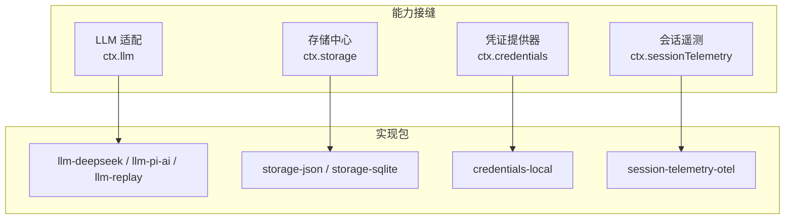
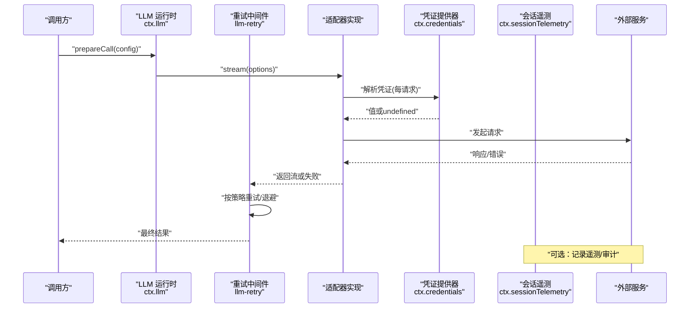
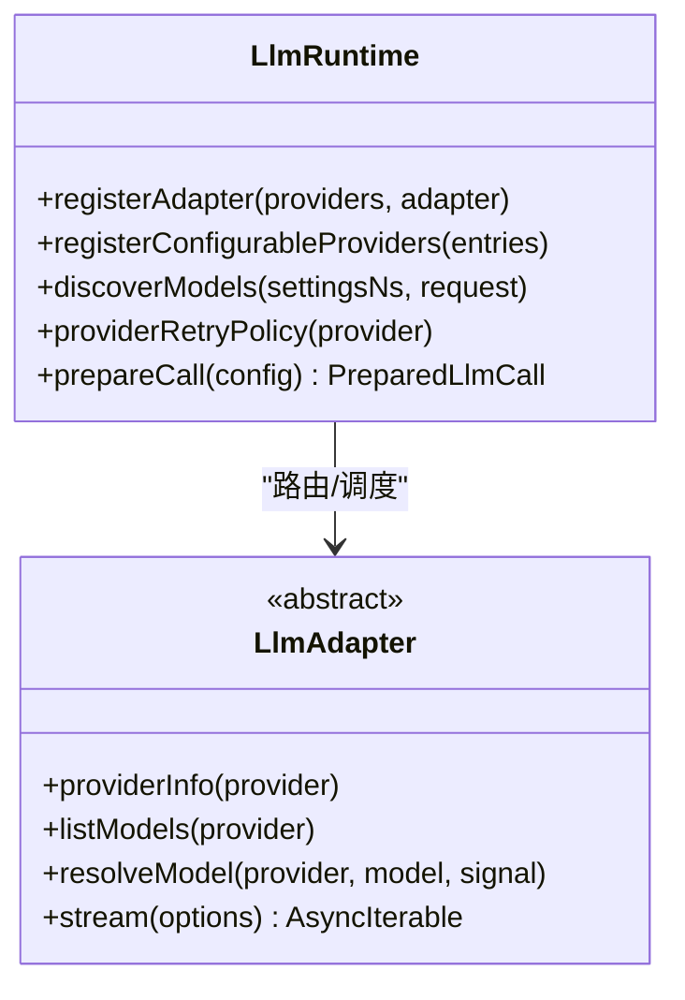
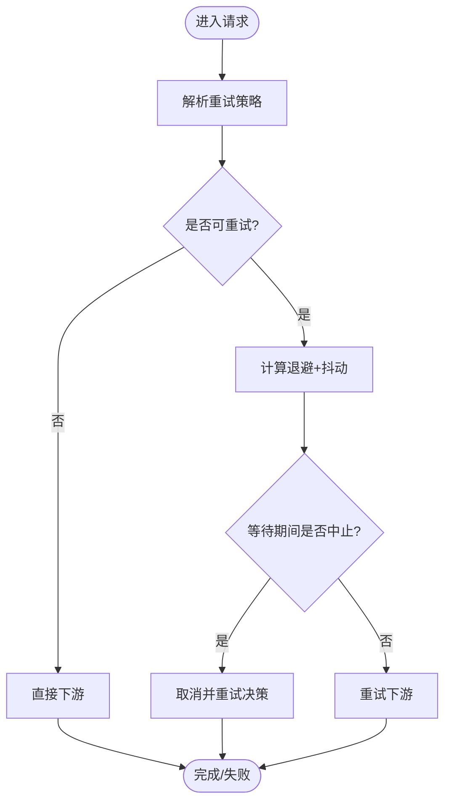
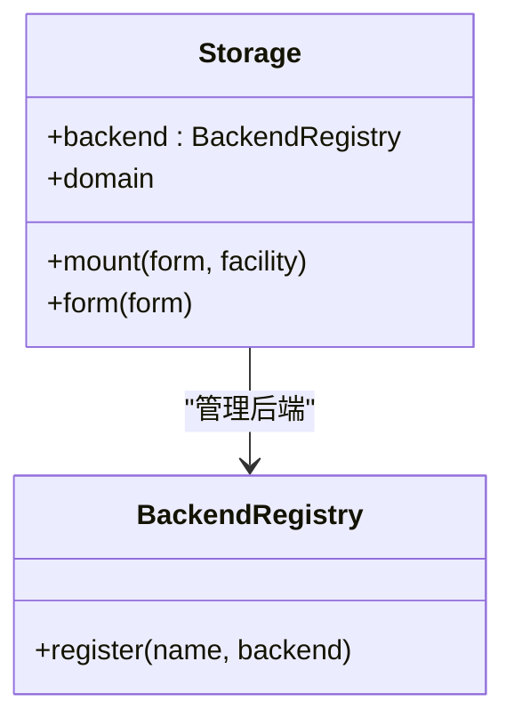
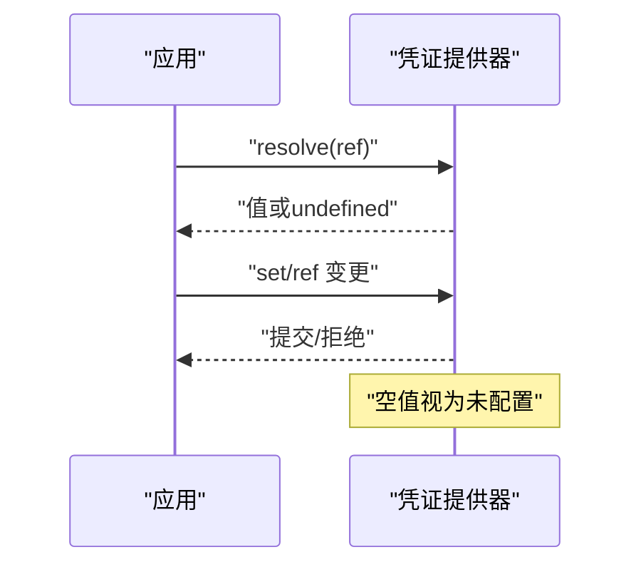
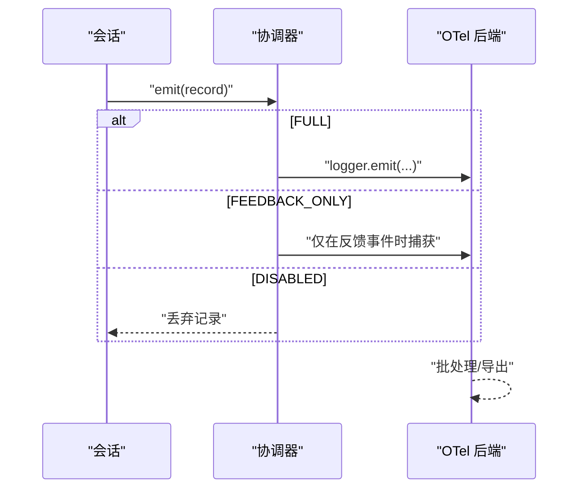
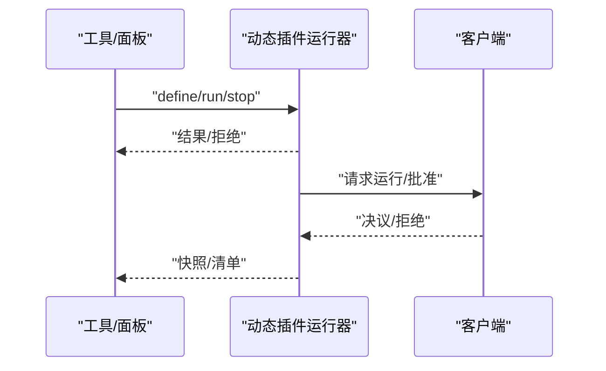
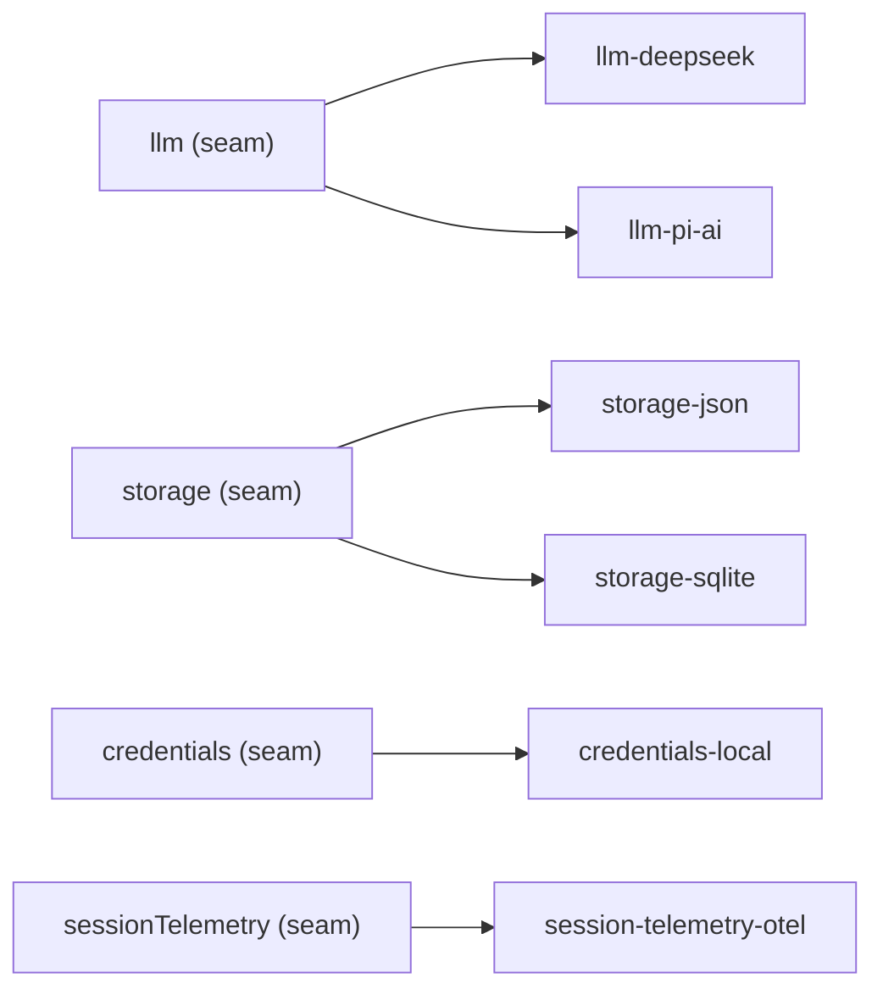

# 第三方集成

<cite>
**本文引用的文件**
- [packages/llm/llm/src/index.ts](file://packages/llm/llm/src/index.ts)
- [packages/llm/llm/src/retry-policy.ts](file://packages/llm/llm/src/retry-policy.ts)
- [packages/llm/llm-retry/src/index.ts](file://packages/llm/llm-retry/src/index.ts)
- [packages/storage/storage/src/index.ts](file://packages/storage/storage/src/index.ts)
- [packages/session/session-telemetry/src/index.ts](file://packages/session/session-telemetry/src/index.ts)
- [packages/session/session-telemetry-otel/src/index.ts](file://packages/session/session-telemetry-otel/src/index.ts)
- [docs/capability-seams.md](file://docs/capability-seams.md)
- [docs/config-catalog.md](file://docs/config-catalog.md)
- [docs/subsystems/credentials.md](file://docs/subsystems/credentials.md)
- [docs/subsystems/extensions.md](file://docs/subsystems/extensions.md)
- [docs/cordis-api/context.md](file://docs/cordis-api/context.md)
- [docs/cordis-api/registry.zh.md](file://docs/cordis-api/registry.zh.md)
</cite>

## 目录
1. [简介](#简介)
2. [项目结构](#项目结构)
3. [核心组件](#核心组件)
4. [架构总览](#架构总览)
5. [详细组件分析](#详细组件分析)
6. [依赖关系分析](#依赖关系分析)
7. [性能考虑](#性能考虑)
8. [故障排查指南](#故障排查指南)
9. [结论](#结论)
10. [附录](#附录)

## 简介
本指南面向需要在 DeepSeek Harness 中集成外部服务与系统的开发者，重点说明扩展点设计与适配器模式的使用方式，覆盖数据库、消息队列、认证服务等常见场景。文档同时给出配置管理、连接池与资源管理的最佳实践，以及错误处理、重试机制与监控集成的技术方案，并提供性能优化与安全注意事项。

## 项目结构
DeepSeek Harness 通过“能力接缝（seam）”将可替换的第三方实现解耦到独立包中，由 Cordis 插件系统加载并注册到上下文（ctx）。典型模式：
- 定义抽象服务接口（如 LLM 适配、存储后端、凭证提供器、会话遥测等）。
- 提供多个具体实现（如 JSONL/SQLite 存储、本地/远程凭证、OTel 遥测后端）。
- 消费方仅依赖抽象接口，通过 ctx 注入使用。
- 通过 cordis.yml 声明式装配，支持热更新与原子替换。

图表来源
- [docs/capability-seams.md:1-472](file://docs/capability-seams.md#L1-L472)
- [packages/llm/llm/src/index.ts:174-233](file://packages/llm/llm/src/index.ts#L174-L233)
- [packages/storage/storage/src/index.ts:1-99](file://packages/storage/storage/src/index.ts#L1-L99)
- [docs/subsystems/credentials.md:1-134](file://docs/subsystems/credentials.md#L1-L134)
- [packages/session/session-telemetry-otel/src/index.ts:141-253](file://packages/session/session-telemetry-otel/src/index.ts#L141-L253)

章节来源
- [docs/capability-seams.md:1-472](file://docs/capability-seams.md#L1-L472)

## 核心组件
- LLM 适配层：提供统一的流式调用入口、模型发现、重试策略与拦截水线。
- 存储中心：命名后端注册 + 数据形式挂载，领域层优先，调用方只关心领域 API。
- 凭证提供器：以引用方式持有密钥，按操作解析，支持热更新与只读源保护。
- 会话遥测：统一采集与导出，支持 FULL/FEEDBACK_ONLY/DISABLED 三种共享策略，对接 OTLP。

章节来源
- [packages/llm/llm/src/index.ts:174-233](file://packages/llm/llm/src/index.ts#L174-L233)
- [packages/storage/storage/src/index.ts:1-99](file://packages/storage/storage/src/index.ts#L1-L99)
- [docs/subsystems/credentials.md:1-134](file://docs/subsystems/credentials.md#L1-L134)
- [packages/session/session-telemetry-otel/src/index.ts:141-253](file://packages/session/session-telemetry-otel/src/index.ts#L141-L253)

## 架构总览
下图展示从调用方到适配器与后端的整体流程，包括重试、遥测与凭证解析的关键路径。

图表来源
- [packages/llm/llm/src/index.ts:771-800](file://packages/llm/llm/src/index.ts#L771-L800)
- [packages/llm/llm-retry/src/index.ts:99-179](file://packages/llm/llm-retry/src/index.ts#L99-L179)
- [docs/subsystems/credentials.md:18-35](file://docs/subsystems/credentials.md#L18-L35)
- [packages/session/session-telemetry-otel/src/index.ts:221-253](file://packages/session/session-telemetry-otel/src/index.ts#L221-L253)

## 详细组件分析

### LLM 适配器与重试
- 适配器抽象：实现 providerInfo、listModels、resolveModel、stream 等方法，统一消息与流式协议。
- 注册与原子替换：registerAdapter/registerConfigurableProviders 支持全量校验后原子替换，避免观察期出现空窗。
- 重试策略：每个 provider 可声明 retryPolicy；llm-retry 在 agent/request-error 事件上执行正常/无界恢复，支持退避与抖动。
- 模型发现：通过 registerModelDiscovery 暴露端点探测，供设置界面动态发现可用模型。

图表来源
- [packages/llm/llm/src/index.ts:284-484](file://packages/llm/llm/src/index.ts#L284-L484)
- [packages/llm/llm/src/index.ts:174-233](file://packages/llm/llm/src/index.ts#L174-L233)

图表来源
- [packages/llm/llm/src/retry-policy.ts:123-156](file://packages/llm/llm/src/retry-policy.ts#L123-L156)
- [packages/llm/llm-retry/src/index.ts:99-179](file://packages/llm/llm-retry/src/index.ts#L99-L179)

章节来源
- [packages/llm/llm/src/index.ts:174-233](file://packages/llm/llm/src/index.ts#L174-L233)
- [packages/llm/llm/src/index.ts:284-484](file://packages/llm/llm/src/index.ts#L284-L484)
- [packages/llm/llm/src/retry-policy.ts:123-156](file://packages/llm/llm/src/retry-policy.ts#L123-L156)
- [packages/llm/llm-retry/src/index.ts:99-179](file://packages/llm/llm-retry/src/index.ts#L99-L179)

### 存储后端与数据形式
- 存储中心：命名后端注册（backend），数据形式（forms）挂载于 hub，领域层优先。
- 生命周期：mount/unmount 受 effect 管理，重复挂载抛出明确错误。
- 使用建议：领域层封装业务语义，后端仅负责 KV/单元读写；多后端并存，按需选择。

图表来源
- [packages/storage/storage/src/index.ts:1-99](file://packages/storage/storage/src/index.ts#L1-L99)

章节来源
- [packages/storage/storage/src/index.ts:1-99](file://packages/storage/storage/src/index.ts#L1-L99)

### 凭证管理与安全
- 引用式密钥：配置中仅保存环境变量名等引用，实际值由凭证提供器维护。
- 每次操作解析：保证旋转密钥即时生效，无需重启。
- 只读源保护：当存在只读层遮挡时，写操作拒绝，避免“写入成功但读取不到”的误导。

图表来源
- [docs/subsystems/credentials.md:18-35](file://docs/subsystems/credentials.md#L18-L35)
- [docs/subsystems/credentials.md:48-101](file://docs/subsystems/credentials.md#L48-L101)

章节来源
- [docs/subsystems/credentials.md:1-134](file://docs/subsystems/credentials.md#L1-L134)

### 会话遥测与监控
- 共享策略：FULL（全量）、FEEDBACK_ONLY（仅反馈）、DISABLED（禁用）。
- 导出管线：基于 OpenTelemetry SDK，批处理器 + OTLP 导出器，支持自定义 processor/exporter。
- 关闭保障：外层超时控制 provider.shutdown，避免进程退出阻塞。

图表来源
- [packages/session/session-telemetry-otel/src/index.ts:141-253](file://packages/session/session-telemetry-otel/src/index.ts#L141-L253)
- [packages/session/session-telemetry-otel/src/index.ts:283-298](file://packages/session/session-telemetry-otel/src/index.ts#L283-L298)

章节来源
- [packages/session/session-telemetry-otel/src/index.ts:113-139](file://packages/session/session-telemetry-otel/src/index.ts#L113-L139)
- [packages/session/session-telemetry-otel/src/index.ts:141-253](file://packages/session/session-telemetry-otel/src/index.ts#L141-L253)
- [packages/session/session-telemetry-otel/src/index.ts:283-298](file://packages/session/session-telemetry-otel/src/index.ts#L283-L298)

### 动态扩展与插件编排
- 动态插件：通过 dynamicCordisRunner 定义/运行/停止宿主与浏览器两端代码，支持授权与版本切换。
- 检查与清单：cordisInspect 提供跨页面查询与清单同步，便于调试与可视化。
- 事件总线：动态包激活/撤回、请求运行等事件贯穿 Host/Client。

图表来源
- [docs/subsystems/extensions.md:67-257](file://docs/subsystems/extensions.md#L67-L257)

章节来源
- [docs/subsystems/extensions.md:1-365](file://docs/subsystems/extensions.md#L1-L365)

## 依赖关系分析
- 能力接缝与实现包之间松耦合，通过 ctx 键名绑定。
- 配置目录集中生成，便于部署级装配与校验。
- 插件生命周期由 Cordis 管理，支持 inject/provide/intercept。

图表来源
- [docs/capability-seams.md:1-472](file://docs/capability-seams.md#L1-L472)
- [docs/config-catalog.md:390-413](file://docs/config-catalog.md#L390-L413)

章节来源
- [docs/capability-seams.md:1-472](file://docs/capability-seams.md#L1-L472)
- [docs/config-catalog.md:1-800](file://docs/config-catalog.md#L1-L800)

## 性能考虑
- 重试与退避：为易失败的外部服务启用指数退避与抖动，限制最大重试次数，避免雪崩。
- 流式处理：尽量使用流式 API，减少内存峰值与首字节延迟。
- 批处理与缓冲：对遥测/日志采用批处理，合理设置批次大小与导出间隔。
- 连接复用：对外部 HTTP/DB 连接进行复用与池化，避免频繁握手。
- 资源上限：对输出大小、堆内存、超时等进行硬性限制，防止资源耗尽。
- 原子替换：配置与路由替换采用原子交换，避免冷启动与并发访问时的不一致窗口。

[本节为通用指导，不直接分析具体文件]

## 故障排查指南
- LLM 错误分类：统一使用 LlmError 携带 code/status/requestId，便于上层重试与告警。
- 凭证问题：若 resolve 返回 undefined，检查引用是否存在、是否被只读层遮挡、是否为空字符串。
- 遥测异常：确认 exporter.url 合法、mode 正确、shutdownTimeoutMillis 合理；关注批处理队列堆积导致的关闭延迟。
- 插件加载失败：查看 inject 依赖是否满足、Config 校验是否通过、provide 名称是否冲突。
- 重试失效：检查 provider 是否声明了 retryableCodes，是否因信号中止导致提前退出。

章节来源
- [packages/llm/llm/src/index.ts:69-117](file://packages/llm/llm/src/index.ts#L69-L117)
- [docs/subsystems/credentials.md:48-101](file://docs/subsystems/credentials.md#L48-L101)
- [packages/session/session-telemetry-otel/src/index.ts:170-195](file://packages/session/session-telemetry-otel/src/index.ts#L170-L195)
- [docs/cordis-api/context.md:68-96](file://docs/cordis-api/context.md#L68-L96)
- [docs/cordis-api/registry.zh.md:60-121](file://docs/cordis-api/registry.zh.md#L60-L121)

## 结论
DeepSeek Harness 通过能力接缝与适配器模式，将第三方服务以插件形式接入，具备强类型、可插拔、可观测与高内聚低耦合的特点。借助配置目录、凭证提供器与遥测后端，可在保证安全与可运维性的前提下快速集成数据库、消息队列、认证服务等外部系统。遵循本文的重试、批处理、连接复用与原子替换等实践，可获得稳定且高性能的集成效果。

## 附录

### 常见集成示例与要点
- 数据库集成
  - 通过 storage 后端注册新的 KV/单元后端，并在领域层封装业务语义。
  - 使用连接池与事务边界控制，确保一致性。
  - 参考存储中心挂载与错误码约定。
- 消息队列集成
  - 作为 LLM 适配器或工具的后端，使用流式消费与批量发送。
  - 结合重试与死信队列，保证可靠性。
  - 通过凭证提供器管理凭据，避免硬编码。
- 认证服务集成
  - 使用 credentials 提供器管理令牌/密钥，按请求解析。
  - 对鉴权失败进行统一错误码映射，便于重试与告警。
  - 在 UI 中展示可写性与来源层，提升可运维性。

章节来源
- [packages/storage/storage/src/index.ts:1-99](file://packages/storage/storage/src/index.ts#L1-L99)
- [docs/subsystems/credentials.md:1-134](file://docs/subsystems/credentials.md#L1-L134)
- [packages/llm/llm/src/index.ts:174-233](file://packages/llm/llm/src/index.ts#L174-L233)