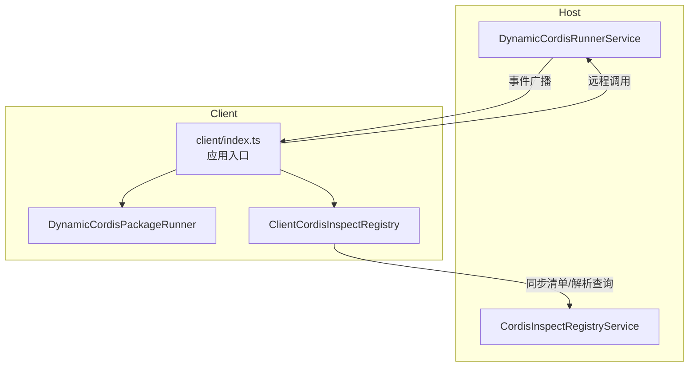
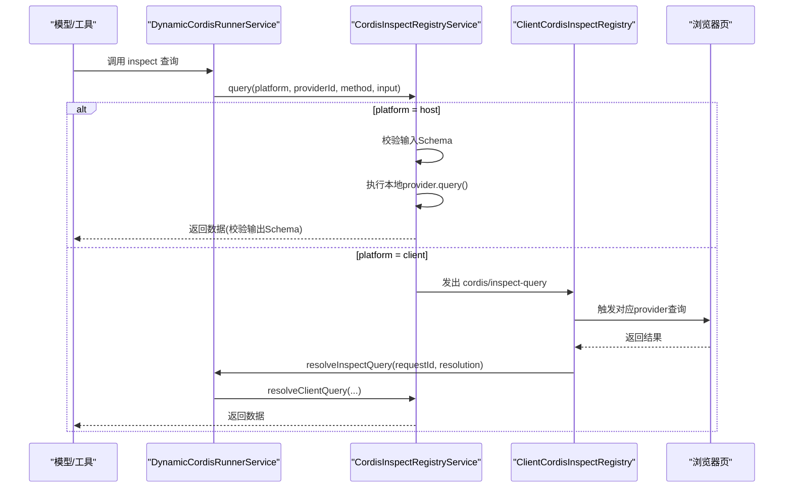
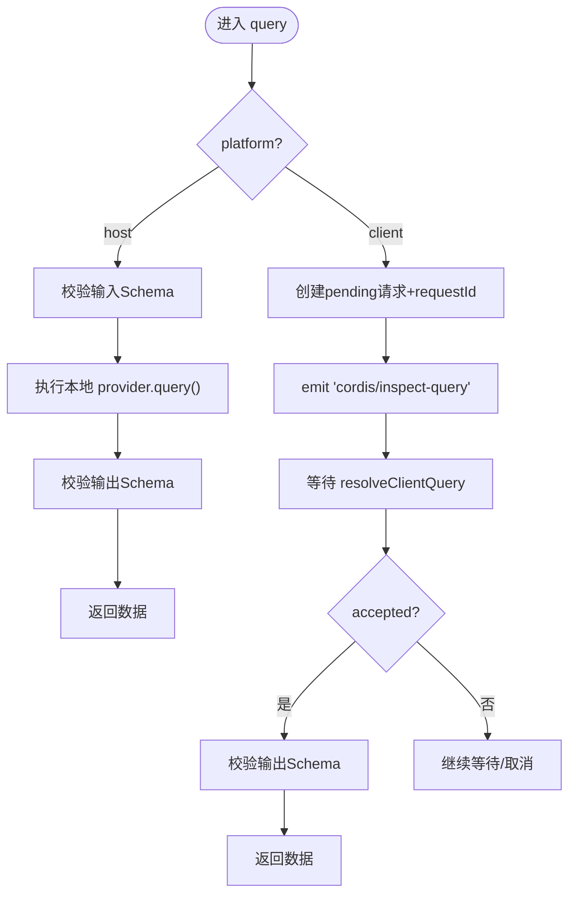
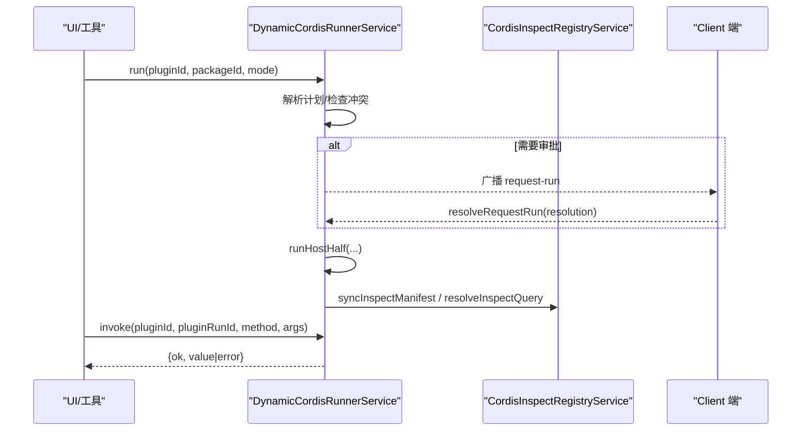
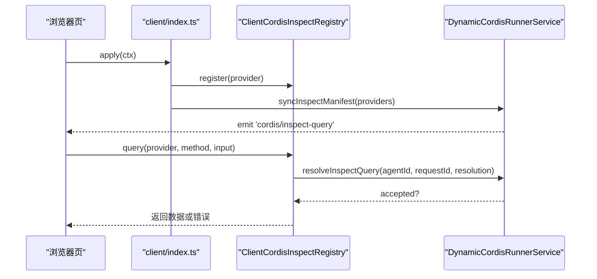
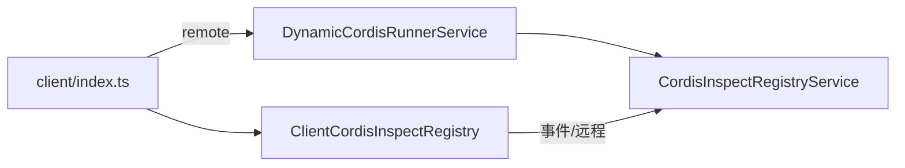

# 适配器模式实现

<cite>
**本文引用的文件**
- [packages/extensions/cordis-host-runner/src/index.ts](file://packages/extensions/cordis-host-runner/src/index.ts)
- [packages/extensions/cordis-host-runner/src/inspect-registry.ts](file://packages/extensions/cordis-host-runner/src/inspect-registry.ts)
- [packages/extensions/cordis-host-runner/src/lifecycle.ts](file://packages/extensions/cordis-host-runner/src/lifecycle.ts)
- [packages/extensions/cordis-host-runner/src/types.ts](file://packages/extensions/cordis-host-runner/src/types.ts)
- [packages/extensions/cordis-client-runner/src/client/index.ts](file://packages/extensions/cordis-client-runner/src/client/index.ts)
- [docs/subsystems/extensions.md](file://docs/subsystems/extensions.md)
- [docs/cordis-primer.md](file://docs/cordis-primer.md)
</cite>

## 目录
1. [简介](#简介)
2. [项目结构](#项目结构)
3. [核心组件](#核心组件)
4. [架构总览](#架构总览)
5. [详细组件分析](#详细组件分析)
6. [依赖关系分析](#依赖关系分析)
7. [性能与可靠性](#性能与可靠性)
8. [故障排查指南](#故障排查指南)
9. [结论](#结论)
10. [附录：自定义适配器实践](#附录自定义适配器实践)

## 简介
本文件围绕 Cordis 框架在第三方集成中的“适配器模式”展开，重点解释 Host 与 Client 两端的适配器注册机制、跨端查询路由、以及通过统一接口屏蔽差异化的第三方服务接入方式。文档以 `CordisInspectRegistryService`（Host 端）和 `DynamicCordisRunnerService`（动态插件运行器）为核心，说明如何通过“声明式清单 + 运行时路由”的方式，将不同来源的第三方能力抽象为统一的“可观察、可调用、可审计”的适配器接口。同时给出创建自定义适配器的步骤、生命周期管理、错误处理策略与性能优化建议，并总结与插件系统的集成最佳实践。

## 项目结构
Cordis 的动态插件体系由 Host 与 Client 两端组成：
- Host 端负责动态插件的定义、版本管理、激活流程、方法调用路由、以及 Host 侧的 inspect 提供者注册。
- Client 端负责浏览器侧加载、渲染、用户授权决策、以及 Client 侧的 inspect 提供者注册与结果回传。
- 两端通过远程调用与事件通道协作，形成“清单同步 + 请求-响应”的适配器协议。

图表来源
- [packages/extensions/cordis-host-runner/src/index.ts:123-144](file://packages/extensions/cordis-host-runner/src/index.ts#L123-L144)
- [packages/extensions/cordis-host-runner/src/inspect-registry.ts:45-96](file://packages/extensions/cordis-host-runner/src/inspect-registry.ts#L45-L96)
- [packages/extensions/cordis-client-runner/src/client/index.ts:187-203](file://packages/extensions/cordis-client-runner/src/client/index.ts#L187-L203)

章节来源
- [packages/extensions/cordis-host-runner/src/index.ts:123-144](file://packages/extensions/cordis-host-runner/src/index.ts#L123-L144)
- [packages/extensions/cordis-host-runner/src/inspect-registry.ts:45-96](file://packages/extensions/cordis-host-runner/src/inspect-registry.ts#L45-L96)
- [packages/extensions/cordis-client-runner/src/client/index.ts:187-203](file://packages/extensions/cordis-client-runner/src/client/index.ts#L187-L203)

## 核心组件
- DynamicCordisRunnerService（Host 端）
  - 职责：动态插件定义、版本管理、激活编排、方法调用路由、与 Client 的远程协作、以及 inspect 清单同步。
  - 关键能力：define/run/runHostHalf/invoke/syncInspectManifest/resolveInspectQuery 等。
- CordisInspectRegistryService（Host 端）
  - 职责：维护 Host/Client 两侧 inspect 提供者的清单，执行本地查询或转发到 Client 查询，校验输入输出 Schema，管理待决查询。
- Client 端协调器（client/index.ts）
  - 职责：构建 Client 侧 inspect 注册表、向 Host 同步清单、发起远程调用、上报渲染失败与守卫拒绝、订阅 Host 事件驱动页面状态。

章节来源
- [packages/extensions/cordis-host-runner/src/index.ts:123-144](file://packages/extensions/cordis-host-runner/src/index.ts#L123-L144)
- [packages/extensions/cordis-host-runner/src/inspect-registry.ts:45-96](file://packages/extensions/cordis-host-runner/src/inspect-registry.ts#L45-L96)
- [packages/extensions/cordis-client-runner/src/client/index.ts:187-203](file://packages/extensions/cordis-client-runner/src/client/index.ts#L187-L203)

## 架构总览
适配器模式在此处的体现是：通过“清单 + 路由”将不同第三方能力抽象为统一的“可发现、可调用、可观测”的接口。Host 与 Client 各自维护自身能力的清单；当模型或 UI 发起查询时，Host 根据平台选择在本机执行或转发到 Client 执行，并以 JSON Schema 严格约束输入输出，保证跨端一致性与安全性。

图表来源
- [packages/extensions/cordis-host-runner/src/inspect-registry.ts:108-198](file://packages/extensions/cordis-host-runner/src/inspect-registry.ts#L108-L198)
- [packages/extensions/cordis-client-runner/src/client/index.ts:295-307](file://packages/extensions/cordis-client-runner/src/client/index.ts#L295-L307)

## 详细组件分析

### Host 端：CordisInspectRegistryService
- 设计要点
  - 维护 Host 侧 providers Map，支持幂等注册与释放。
  - 接收 Client 侧同步的 manifest 快照，合并为完整目录供外部查看。
  - 对 Host/Client 两种平台分别执行查询：Host 直接调用本地 handler；Client 通过事件桥接并等待首个有效回答。
  - 严格的输入输出校验，确保跨端数据契约稳定。
- 关键流程
  - register：注册 Host 提供者，返回可逆的清理函数。
  - syncClientManifest：替换 Client 镜像清单，冻结不可变。
  - list：列出 Host 与 Client 全部提供者视图。
  - query：按平台分发；若为 Client，则创建 pending 请求并监听取消信号。
  - resolveClientQuery：接受首个有效的 Client 回答，验证输出后完成 Promise。

图表来源
- [packages/extensions/cordis-host-runner/src/inspect-registry.ts:108-198](file://packages/extensions/cordis-host-runner/src/inspect-registry.ts#L108-L198)

章节来源
- [packages/extensions/cordis-host-runner/src/inspect-registry.ts:57-96](file://packages/extensions/cordis-host-runner/src/inspect-registry.ts#L57-L96)
- [packages/extensions/cordis-host-runner/src/inspect-registry.ts:108-198](file://packages/extensions/cordis-host-runner/src/inspect-registry.ts#L108-L198)

### Host 端：DynamicCordisRunnerService
- 设计要点
  - 作为动态插件的宿主，负责 define/run/stop 等生命周期，以及 invoke 方法路由。
  - 内嵌 CordisInspectRegistryService，用于同步 Client 清单与解析 Client 查询结果。
  - 暴露 Remote 方法供 Client 调用，如 runHostHalf、getClientCode、resolveRequestRun、settleUserRun、syncInspectManifest、resolveInspectQuery 等。
- 关键流程
  - define：校验并登记插件与包元信息。
  - run：决定是否需要审批、创建尝试记录、启动 Host 半段或等待 Client 审批。
  - runHostHalf：在审批通过后启动 Host 代码，必要时附加到已有运行实例。
  - invoke：校验运行实例与方法存在性，执行并捕获错误，上报诊断。
  - syncInspectManifest/resolveInspectQuery：与 Client 协同完成跨端 inspect 查询。

图表来源
- [packages/extensions/cordis-host-runner/src/index.ts:248-312](file://packages/extensions/cordis-host-runner/src/index.ts#L248-L312)
- [packages/extensions/cordis-host-runner/src/index.ts:324-374](file://packages/extensions/cordis-host-runner/src/index.ts#L324-L374)
- [packages/extensions/cordis-host-runner/src/index.ts:497-517](file://packages/extensions/cordis-host-runner/src/index.ts#L497-L517)
- [packages/extensions/cordis-host-runner/src/index.ts:740-766](file://packages/extensions/cordis-host-runner/src/index.ts#L740-L766)

章节来源
- [packages/extensions/cordis-host-runner/src/index.ts:123-144](file://packages/extensions/cordis-host-runner/src/index.ts#L123-L144)
- [packages/extensions/cordis-host-runner/src/index.ts:248-312](file://packages/extensions/cordis-host-runner/src/index.ts#L248-L312)
- [packages/extensions/cordis-host-runner/src/index.ts:324-374](file://packages/extensions/cordis-host-runner/src/index.ts#L324-L374)
- [packages/extensions/cordis-host-runner/src/index.ts:497-517](file://packages/extensions/cordis-host-runner/src/index.ts#L497-L517)
- [packages/extensions/cordis-host-runner/src/index.ts:740-766](file://packages/extensions/cordis-host-runner/src/index.ts#L740-L766)

### Client 端：适配器注册与运行编排
- 设计要点
  - 在 apply 中创建 ClientCordisInspectRegistry，并通过 remote 与 Host 同步清单、解析查询。
  - 收集当前页面的 clientInspectProviders，逐个注册到 Client 注册表。
  - 建立 DynamicCordisPackageRunner 与 CordisRunOrchestrator，封装与 Host 的交互边界，统一错误提示与上报。
- 关键流程
  - provideClientTimer：注入定时器服务。
  - 同步清单：ctx.remote.dynamicCordisRunner.syncInspectManifest(providers)。
  - 解析查询：ctx.remote.dynamicCordisRunner.resolveInspectQuery(agentId, requestId, resolution)。
  - 订阅 Host 事件：request-run、request-run-resolved、dynamic-retract、inspect-query、inspect-query-resolved。

图表来源
- [packages/extensions/cordis-client-runner/src/client/index.ts:187-203](file://packages/extensions/cordis-client-runner/src/client/index.ts#L187-L203)
- [packages/extensions/cordis-client-runner/src/client/index.ts:295-307](file://packages/extensions/cordis-client-runner/src/client/index.ts#L295-L307)

章节来源
- [packages/extensions/cordis-client-runner/src/client/index.ts:187-203](file://packages/extensions/cordis-client-runner/src/client/index.ts#L187-L203)
- [packages/extensions/cordis-client-runner/src/client/index.ts:295-307](file://packages/extensions/cordis-client-runner/src/client/index.ts#L295-L307)

### 生命周期与错误处理
- Host 半段生命周期
  - 使用 guardedPlugin 包裹插件，确保启动失败时及时 dispose，避免悬挂 Fiber。
  - 对常见冲突（重复注册）给出明确提示，指导先停止旧版本再运行新版本。
  - 通过 missingServices 报告未满足的 inject 依赖。
- 错误处理策略
  - 输入输出均经 JSON Schema 校验，非法数据立即拒绝。
  - 跨端调用失败区分“传输层失败”与“业务拒绝”，并提供可读的诊断信息。
  - 渲染失败与守卫拒绝通过专用 Remote 上报，便于 Host 侧聚合诊断。

章节来源
- [packages/extensions/cordis-host-runner/src/lifecycle.ts:22-45](file://packages/extensions/cordis-host-runner/src/lifecycle.ts#L22-L45)
- [packages/extensions/cordis-host-runner/src/lifecycle.ts:55-57](file://packages/extensions/cordis-host-runner/src/lifecycle.ts#L55-L57)
- [packages/extensions/cordis-host-runner/src/inspect-registry.ts:227-248](file://packages/extensions/cordis-host-runner/src/inspect-registry.ts#L227-L248)
- [packages/extensions/cordis-client-runner/src/client/index.ts:132-170](file://packages/extensions/cordis-client-runner/src/client/index.ts#L132-L170)

## 依赖关系分析
- 组件耦合
  - DynamicCordisRunnerService 依赖 CordisInspectRegistryService 完成跨端 inspect 能力。
  - Client 端通过 remote 命名空间与 Host 通信，避免直接导入 Host 类型，降低耦合。
- 外部依赖
  - 基于 Cordis 的 Service/Fiber/Context 机制进行依赖注入与生命周期管理。
  - 使用 TypertRemoteService 暴露远程方法，保障类型安全与序列化。
- 潜在循环依赖
  - 通过事件与远程调用解耦，避免模块间直接循环引用。

图表来源
- [packages/extensions/cordis-host-runner/src/index.ts:123-144](file://packages/extensions/cordis-host-runner/src/index.ts#L123-L144)
- [packages/extensions/cordis-client-runner/src/client/index.ts:187-203](file://packages/extensions/cordis-client-runner/src/client/index.ts#L187-L203)

章节来源
- [packages/extensions/cordis-host-runner/src/index.ts:123-144](file://packages/extensions/cordis-host-runner/src/index.ts#L123-L144)
- [packages/extensions/cordis-client-runner/src/client/index.ts:187-203](file://packages/extensions/cordis-client-runner/src/client/index.ts#L187-L203)

## 性能与可靠性
- 清单同步
  - Client 端定期或按需同步 manifest 至 Host，减少重复计算与网络开销。
- 查询路由
  - Host 优先本地执行，避免不必要的跨端往返；仅在需要 Client 实时数据时才转发。
- 并发与取消
  - 使用 AbortSignal 支持查询取消，避免资源浪费。
- 序列化与校验
  - 所有跨端数据走 JSON 并做 Schema 校验，提升稳定性与可调试性。
- 资源隔离
  - Host 半段以 Fiber 为单位隔离，失败即回收，防止内存泄漏。

[本节为通用性能建议，不直接分析具体文件]

## 故障排查指南
- 常见问题定位
  - 重复注册：Host 启动阶段抛出“already registered”，需先停止旧版本再运行新版本。
  - 方法不存在：invoke 返回 method-not-found，确认 Host 是否通过 handle 注册方法。
  - 传输失败：区分 wire failure 与业务拒绝，前者多为参数或网络问题，后者为业务逻辑拒绝。
  - 渲染失败：通过 reportRenderFailure 上报，结合 slot 名称与堆栈定位。
- 排查步骤
  - 使用 inventory/snapshot 查看插件版本与运行状态。
  - 检查 inspect 清单是否同步成功，确认 provider/method 是否存在。
  - 关注 Host 与 Client 的事件流，确认请求是否到达预期端点。

章节来源
- [packages/extensions/cordis-host-runner/src/lifecycle.ts:34-42](file://packages/extensions/cordis-host-runner/src/lifecycle.ts#L34-L42)
- [packages/extensions/cordis-host-runner/src/index.ts:740-766](file://packages/extensions/cordis-host-runner/src/index.ts#L740-L766)
- [packages/extensions/cordis-client-runner/src/client/index.ts:225-245](file://packages/extensions/cordis-client-runner/src/client/index.ts#L225-L245)

## 结论
通过“清单 + 路由 + 校验”的适配器模式，Cordis 实现了 Host/Client 两端对第三方能力的统一接入与治理。CordisInspectRegistryService 提供跨端可发现的只读能力目录，DynamicCordisRunnerService 提供动态插件的生命周期与方法调用路由。两者配合，使得不同来源的第三方服务可以以最小成本接入，并获得一致的鉴权、审计与可观测性。

[本节为总结性内容，不直接分析具体文件]

## 附录：自定义适配器实践

### 设计目标
- 将任意第三方服务的能力抽象为“可发现、可调用、可观测”的适配器。
- 通过 Host/Client 两端清单与路由，屏蔽底层差异，提供统一接口。

### 步骤概览
- 定义适配器清单
  - 在 Host 或 Client 端声明 provider 的 id、description、methods（含 inputSchema/outputSchema）。
  - 在 Host 端通过 CordisInspectRegistryService.register 注册；或在 Client 端通过 ClientCordisInspectRegistry.register 注册。
- 实现查询处理器
  - 针对每个 method 实现 query(method, input, context) 逻辑，遵守输入输出 Schema。
  - 在 Host 端可直接访问本地上下文；在 Client 端可通过 remote 与 Host 协作。
- 注册与同步
  - Host 端：在插件 apply 中调用 ctx.cordisInspect.register(...)，并在卸载时调用返回的清理函数。
  - Client 端：在 apply 中收集 clientInspectProviders 并逐一注册，随后通过 ctx.remote.dynamicCordisRunner.syncInspectManifest 同步清单。
- 调用与观测
  - 外部通过 inspect 列表选择 provider 与 method 发起查询；Host 自动路由到对应平台执行。
  - 使用 inventory/snapshot 与事件流观测运行状态与错误。

### 生命周期管理
- 使用 ctx.effect 注册副作用，并确保返回清理函数，以便插件卸载时回收资源。
- 对于长连接或定时任务，务必在清理函数中关闭或取消，避免泄漏。

### 错误处理策略
- 输入输出严格遵循 JSON Schema，异常时立即拒绝并返回结构化错误。
- 跨端调用失败区分传输层与业务层，提供可读的诊断信息。
- 渲染失败与守卫拒绝通过专用 Remote 上报，便于集中诊断。

### 性能优化技巧
- 尽量在 Host 端缓存静态数据，减少跨端往返。
- 对耗时查询支持取消（AbortSignal），避免无效工作。
- 批量更新清单，减少频繁同步带来的开销。

### 与插件系统集成最佳实践
- 插件仅通过 ctx.get 获取可选能力，避免强依赖导致加载失败。
- 使用 inject 声明硬依赖，让 Cordis 自动等待依赖就绪。
- 所有贡献（工具、插槽、适配器）都应通过 ctx.effect 或 ctx.on 注册，确保可逆与可卸载。

章节来源
- [packages/extensions/cordis-host-runner/src/inspect-registry.ts:57-96](file://packages/extensions/cordis-host-runner/src/inspect-registry.ts#L57-L96)
- [packages/extensions/cordis-client-runner/src/client/index.ts:187-203](file://packages/extensions/cordis-client-runner/src/client/index.ts#L187-L203)
- [docs/cordis-primer.md:7-13](file://docs/cordis-primer.md#L7-L13)
- [docs/subsystems/extensions.md:69-253](file://docs/subsystems/extensions.md#L69-L253)