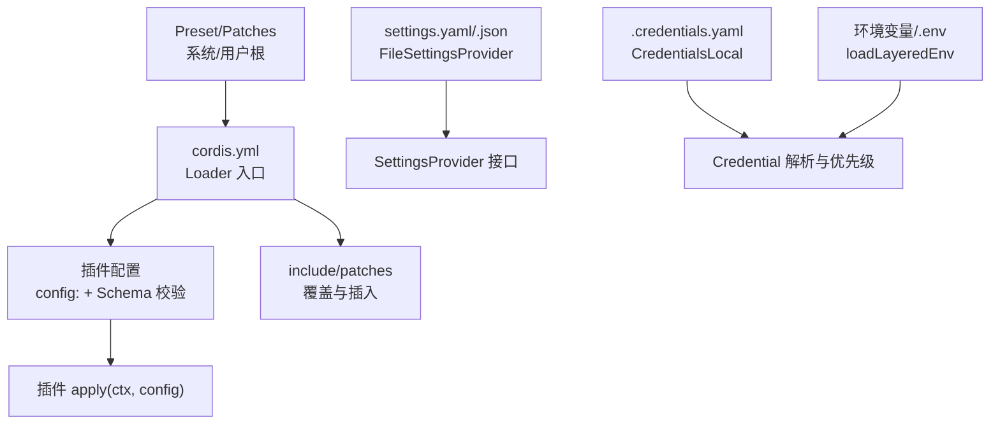
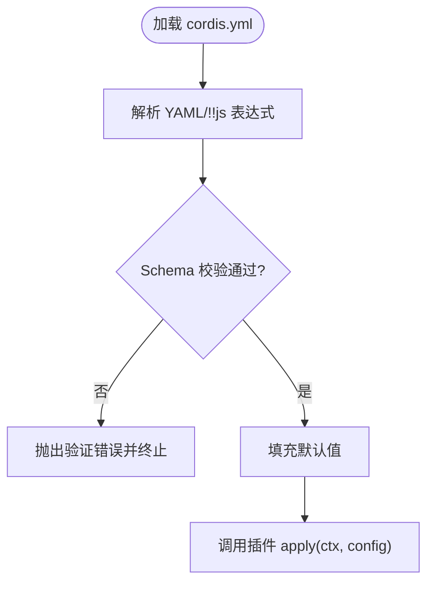
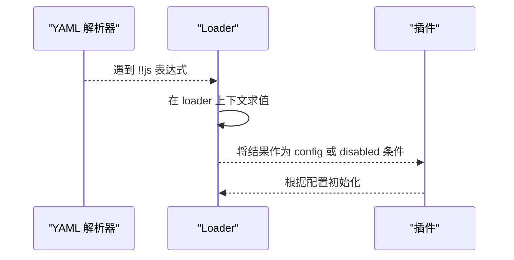
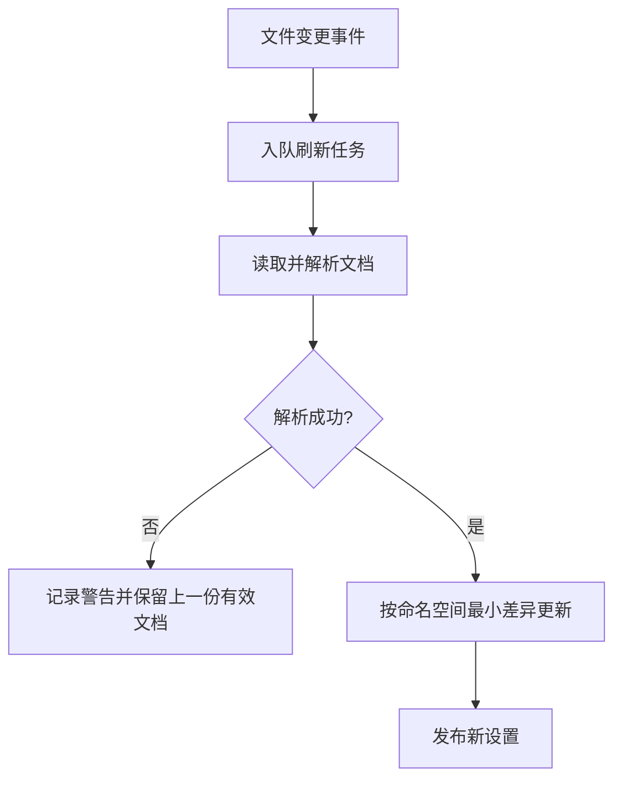
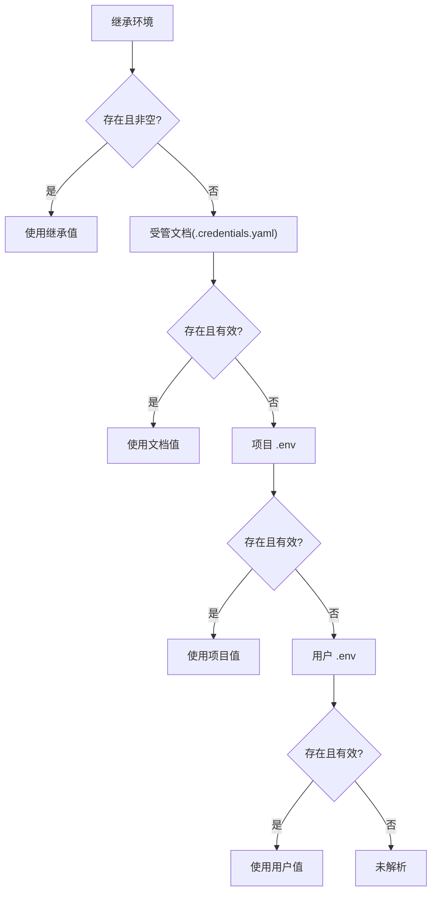
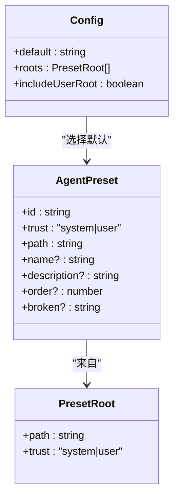
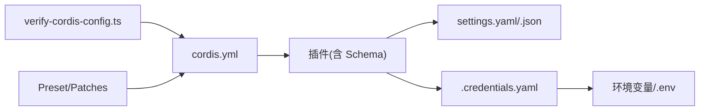

# 配置管理

<cite>
**本文引用的文件**
- [packages/settings/settings-file/src/index.ts](file://packages/settings/settings-file/src/index.ts)
- [scripts/verify-config-source-ownership.ts](file://scripts/verify-config-source-ownership.ts)
- [scripts/verify-cordis-config.ts](file://scripts/verify-cordis-config.ts)
- [scripts/cordis-config-files.ts](file://scripts/cordis-config-files.ts)
- [docs/config-catalog.md](file://docs/config-catalog.md)
- [docs/cordis-tutorial/05-config.md](file://docs/cordis-tutorial/05-config.md)
- [examples/acp-agent/cordis.yml](file://examples/acp-agent/cordis.yml)
- [apps/cli/config/agent-presets/code/preset.yml](file://apps/cli/config/agent-presets/code/preset.yml)
- [packages/preset/agent-presets/src/preset.ts](file://packages/preset/agent-presets/src/preset.ts)
- [packages/credentials/credentials-local/src/index.ts](file://packages/credentials/credentials-local/src/index.ts)
- [packages/boot/app-boot/tests/app-boot.spec.ts](file://packages/boot/app-boot/tests/app-boot.spec.ts)
- [packages/boot/app-boot/tests/config-reload.spec.ts](file://packages/boot/app-boot/tests/config-reload.spec.ts)
</cite>

## 目录
1. [简介](#简介)
2. [项目结构](#项目结构)
3. [核心组件](#核心组件)
4. [架构总览](#架构总览)
5. [详细组件分析](#详细组件分析)
6. [依赖关系分析](#依赖关系分析)
7. [性能考虑](#性能考虑)
8. [故障排查指南](#故障排查指南)
9. [结论](#结论)
10. [附录](#附录)

## 简介
本文件面向“第三方集成配置管理”，聚焦于 Cordis Loader 的 YAML 配置、插件配置模式与校验、环境变量注入、默认值处理、热重载机制，以及多环境差异、安全最佳实践、迁移与版本兼容性策略。文档以仓库中的实际实现为依据，提供可操作的模板化与分层治理方法，帮助在不同环境中稳定地编排第三方服务（如 LLM 提供商、沙箱、文件系统、工作流等）。

## 项目结构
仓库通过 Cordis Loader 将多个插件组合为应用；每个插件通过 `config:` 声明其配置类型并使用 Schema 进行运行时校验。配置来源包括：
- 插件自身的配置（YAML/JSON）
- 用户级设置文件（settings.yaml/.json）
- 凭证文件（.credentials.yaml）
- 环境变量与 .env 层叠加载
- 预置（Preset）与补丁（Patch）叠加



图表来源
- [scripts/verify-cordis-config.ts:72-99](file://scripts/verify-cordis-config.ts#L72-L99)
- [packages/settings/settings-file/src/index.ts:21-67](file://packages/settings/settings-file/src/index.ts#L21-L67)
- [packages/credentials/credentials-local/src/index.ts:249-263](file://packages/credentials/credentials-local/src/index.ts#L249-L263)
- [packages/preset/agent-presets/src/preset.ts:51-62](file://packages/preset/agent-presets/src/preset.ts#L51-L62)

章节来源
- [scripts/verify-cordis-config.ts:72-99](file://scripts/verify-cordis-config.ts#L72-L99)
- [scripts/cordis-config-files.ts:1-19](file://scripts/cordis-config-files.ts#L1-L19)

## 核心组件
- 配置发现与校验
  - 扫描所有 Loader 配置文件并验证元数据、表达式位置、包解析等。
- 插件配置与 Schema 校验
  - 每个插件导出 Config 类型与 Schema，Loader 在 apply 前完成校验与默认值填充。
- 设置文件提供者
  - 支持 YAML/JSON，具备热重载、原子写入、权限控制与注释保留。
- 凭证与 .env 层叠
  - 继承环境 > 受管文档 > 项目 .env > 用户 .env；敏感字段禁止内联到 shipped 配置。
- 预置与补丁
  - 通过 Preset 与 include/patches 实现可复用的配置模板与多环境差异。

章节来源
- [scripts/verify-cordis-config.ts:1-498](file://scripts/verify-cordis-config.ts#L1-L498)
- [docs/config-catalog.md:1-800](file://docs/config-catalog.md#L1-L800)
- [packages/settings/settings-file/src/index.ts:1-371](file://packages/settings/settings-file/src/index.ts#L1-L371)
- [packages/credentials/credentials-local/src/index.ts:249-263](file://packages/credentials/credentials-local/src/index.ts#L249-L263)
- [packages/preset/agent-presets/src/preset.ts:1-94](file://packages/preset/agent-presets/src/preset.ts#L1-L94)

## 架构总览
下图展示了从 Loader 到插件、设置与凭证的完整链路，以及热重载与补丁叠加的工作方式。

```mermaid
sequenceDiagram
participant CLI as "CLI/进程"
participant Loader as "Cordis Loader"
participant Plugin as "插件(apply)"
participant Settings as "FileSettingsProvider"
participant Creds as "CredentialsLocal"
participant Env as "环境变量/.env"
CLI->>Loader : 读取 cordis.yml
Loader->>Loader : 校验元数据/表达式/包解析
Loader->>Plugin : 传入已校验的 config
Plugin-->>CLI : 初始化完成
Settings-->>Plugin : 提供 settings (watch+debounce)
Creds-->>Plugin : 提供凭据解析(优先级)
Env-->>Creds : 继承环境优先
Note over Settings,Creds : 外部编辑触发热重载; 写操作原子+权限控制
```

图表来源
- [scripts/verify-cordis-config.ts:72-99](file://scripts/verify-cordis-config.ts#L72-L99)
- [packages/settings/settings-file/src/index.ts:232-269](file://packages/settings/settings-file/src/index.ts#L232-L269)
- [packages/credentials/credentials-local/src/index.ts:249-263](file://packages/credentials/credentials-local/src/index.ts#L249-L263)

## 详细组件分析

### 插件配置与 Schema 校验
- 每个插件通过导出的 Config 类型与 Schema 描述配置结构，Loader 在运行 apply 前执行校验，错误会立即失败，避免半配置启动。
- 配置目录与可用字段由生成文档集中列出，便于部署侧查阅。



图表来源
- [docs/cordis-tutorial/05-config.md:1-85](file://docs/cordis-tutorial/05-config.md#L1-L85)
- [docs/config-catalog.md:1-800](file://docs/config-catalog.md#L1-L800)

章节来源
- [docs/cordis-tutorial/05-config.md:1-85](file://docs/cordis-tutorial/05-config.md#L1-L85)
- [docs/config-catalog.md:1-800](file://docs/config-catalog.md#L1-L800)

### 环境变量注入与 !!js 表达式
- 在 `config` 块和 `disabled` 字段中支持 `!!js` 表达式，用于在加载时计算动态值。
- 示例中通过环境变量切换沙箱模式、会话持久化路径与压缩策略。



图表来源
- [docs/cordis-tutorial/05-config.md:70-81](file://docs/cordis-tutorial/05-config.md#L70-L81)
- [examples/acp-agent/cordis.yml:18-63](file://examples/acp-agent/cordis.yml#L18-L63)

章节来源
- [docs/cordis-tutorial/05-config.md:70-81](file://docs/cordis-tutorial/05-config.md#L70-L81)
- [examples/acp-agent/cordis.yml:18-63](file://examples/acp-agent/cordis.yml#L18-L63)

### 设置文件与热重载（settings.yaml/.json）
- FileSettingsProvider 支持 YAML/JSON，启用 chokidar 监听外部编辑，使用 debounce 合并频繁写入，并通过原子写入与严格权限保证一致性。
- 解析失败在启动时“大声失败”；热重载失败则告警并保留上一份有效文档。



图表来源
- [packages/settings/settings-file/src/index.ts:232-269](file://packages/settings/settings-file/src/index.ts#L232-L269)
- [packages/settings/settings-file/src/index.ts:271-295](file://packages/settings/settings-file/src/index.ts#L271-L295)
- [packages/settings/settings-file/src/index.ts:304-338](file://packages/settings/settings-file/src/index.ts#L304-L338)

章节来源
- [packages/settings/settings-file/src/index.ts:21-67](file://packages/settings/settings-file/src/index.ts#L21-L67)
- [packages/settings/settings-file/src/index.ts:232-269](file://packages/settings/settings-file/src/index.ts#L232-L269)
- [packages/settings/settings-file/src/index.ts:271-295](file://packages/settings/settings-file/src/index.ts#L271-L295)
- [packages/settings/settings-file/src/index.ts:304-338](file://packages/settings/settings-file/src/index.ts#L304-L338)

### 凭证与 .env 层叠与安全性
- 凭证解析优先级：继承环境 > 受管文档 > 项目 .env > 用户 .env。
- 禁止在 shipped 配置的普通单行形式中内联密钥或端点，强制走适配器与凭据解析通道。
- 启动阶段对 .env 中的危险键进行拒绝，防止被恶意覆盖。



图表来源
- [packages/credentials/credentials-local/src/index.ts:249-263](file://packages/credentials/credentials-local/src/index.ts#L249-L263)
- [scripts/verify-config-source-ownership.ts:12-42](file://scripts/verify-config-source-ownership.ts#L12-L42)
- [packages/boot/app-boot/tests/app-boot.spec.ts:93-149](file://packages/boot/app-boot/tests/app-boot.spec.ts#L93-L149)

章节来源
- [packages/credentials/credentials-local/src/index.ts:249-263](file://packages/credentials/credentials-local/src/index.ts#L249-L263)
- [scripts/verify-config-source-ownership.ts:12-42](file://scripts/verify-config-source-ownership.ts#L12-L42)
- [packages/boot/app-boot/tests/app-boot.spec.ts:93-149](file://packages/boot/app-boot/tests/app-boot.spec.ts#L93-L149)

### 预置（Preset）与补丁（Patches）——可复用模板与多环境差异
- Preset 提供可复用的配置模板，支持 system/user 信任级别与排序。
- 通过 include/patches 在同一 include 层级叠加多层补丁，后一层可覆盖/禁用前一层插入的行，适合多环境差异化。



图表来源
- [packages/preset/agent-presets/src/preset.ts:20-62](file://packages/preset/agent-presets/src/preset.ts#L20-L62)
- [apps/cli/config/agent-presets/code/preset.yml:1-4](file://apps/cli/config/agent-presets/code/preset.yml#L1-L4)

章节来源
- [packages/preset/agent-presets/src/preset.ts:1-94](file://packages/preset/agent-presets/src/preset.ts#L1-L94)
- [apps/cli/config/agent-presets/code/preset.yml:1-4](file://apps/cli/config/agent-presets/code/preset.yml#L1-L4)
- [packages/boot/app-boot/tests/config-reload.spec.ts:282-369](file://packages/boot/app-boot/tests/config-reload.spec.ts#L282-L369)

### 配置验证与默认值处理
- Loader 校验：检查数组根、条目对象、group/insert 递归校验、include patches 合法性、表达式位置限制、包解析与源平面映射。
- 插件 Schema：定义必填/可选字段、默认值、约束；不合法即失败。
- 设置文件：YAML/JSON 解析错误在启动时报错；热重载失败仅告警并保留上一份有效文档。

章节来源
- [scripts/verify-cordis-config.ts:1-498](file://scripts/verify-cordis-config.ts#L1-L498)
- [docs/cordis-tutorial/05-config.md:1-85](file://docs/cordis-tutorial/05-config.md#L1-L85)
- [packages/settings/settings-file/src/index.ts:271-295](file://packages/settings/settings-file/src/index.ts#L271-L295)

### 配置热重载能力
- 设置文件：基于 chokidar 监听，debounce 合并写入，队列串行化读写，避免并发冲突。
- 补丁叠加：每次重读都会重新应用 patches 与 insert，确保与初始加载一致。

章节来源
- [packages/settings/settings-file/src/index.ts:232-269](file://packages/settings/settings-file/src/index.ts#L232-L269)
- [packages/boot/app-boot/tests/config-reload.spec.ts:282-369](file://packages/boot/app-boot/tests/config-reload.spec.ts#L282-L369)

## 依赖关系分析
- Loader 依赖脚本进行配置发现与校验，确保所有引用可解析、表达式位置正确。
- 插件依赖 Schema 库进行配置校验；设置与凭证模块提供运行时配置与凭据。
- 预置与补丁机制依赖 include/patches 语义，确保同一层级内的覆盖顺序可控。



图表来源
- [scripts/verify-cordis-config.ts:72-99](file://scripts/verify-cordis-config.ts#L72-L99)
- [scripts/cordis-config-files.ts:1-19](file://scripts/cordis-config-files.ts#L1-L19)
- [packages/settings/settings-file/src/index.ts:21-67](file://packages/settings/settings-file/src/index.ts#L21-L67)
- [packages/credentials/credentials-local/src/index.ts:249-263](file://packages/credentials/credentials-local/src/index.ts#L249-L263)
- [packages/preset/agent-presets/src/preset.ts:51-62](file://packages/preset/agent-presets/src/preset.ts#L51-L62)

章节来源
- [scripts/verify-cordis-config.ts:72-99](file://scripts/verify-cordis-config.ts#L72-L99)
- [scripts/cordis-config-files.ts:1-19](file://scripts/cordis-config-files.ts#L1-L19)

## 性能考虑
- 设置文件热重载使用 debounce 与队列串行化，减少频繁 IO 与解析开销。
- 补丁叠加在同一 include 层级内生效，避免跨边界带来的复杂性与重复计算。
- 使用原子写入与严格权限，降低并发竞争与安全风险。

[本节为通用指导，不直接分析具体文件]

## 故障排查指南
- 配置语法错误
  - 设置文件解析失败会在启动时报错；热重载失败会记录警告并保留上一份有效文档。
- 表达式位置错误
  - 仅在 `config` 与 `disabled` 允许 `!!js`；其他元数据字段出现表达式将被拒绝。
- 包解析失败
  - 本地包必须通过 tsconfig paths 解析到源码；否则开发/测试可能不一致。
- 凭证内联违规
  - shipped 配置不得内联 apiKey/baseURL/authToken/headers 等敏感项，需走凭据解析。

章节来源
- [packages/settings/settings-file/src/index.ts:271-295](file://packages/settings/settings-file/src/index.ts#L271-L295)
- [scripts/verify-cordis-config.ts:416-472](file://scripts/verify-cordis-config.ts#L416-L472)
- [scripts/verify-config-source-ownership.ts:12-42](file://scripts/verify-config-source-ownership.ts#L12-L42)

## 结论
该配置体系通过严格的 Schema 校验、安全的凭据优先级、可观测的热重载与可组合的补丁机制，为第三方集成提供了稳定、可维护、可扩展的配置治理能力。借助 Preset 与多环境补丁，可在不同部署目标间高效复用模板并管理差异；结合 CI 校验与安全门禁，保障配置的正确性与合规性。

[本节为总结，不直接分析具体文件]

## 附录

### 多环境配置差异建议
- 使用 Preset 定义基础模板，再通过 include/patches 叠加环境差异（开发/测试/生产）。
- 通过 `!!js` 表达式与环境变量切换行为（如沙箱模式、会话存储路径、压缩策略）。
- 利用 settings.yaml 管理可热更新的非敏感配置；敏感信息通过 .credentials.yaml 与环境变量管理。

章节来源
- [examples/acp-agent/cordis.yml:18-63](file://examples/acp-agent/cordis.yml#L18-L63)
- [packages/preset/agent-presets/src/preset.ts:51-62](file://packages/preset/agent-presets/src/preset.ts#L51-L62)
- [packages/settings/settings-file/src/index.ts:21-67](file://packages/settings/settings-file/src/index.ts#L21-L67)

### 安全最佳实践
- 禁止在 shipped 配置中内联密钥或端点，统一通过凭据解析与环境变量注入。
- 启动阶段拒绝危险的 .env 键，防止覆盖关键环境变量。
- 设置文件与凭证文件采用原子写入与严格权限（目录 0700、文件 0600）。

章节来源
- [scripts/verify-config-source-ownership.ts:12-42](file://scripts/verify-config-source-ownership.ts#L12-L42)
- [packages/boot/app-boot/tests/app-boot.spec.ts:93-149](file://packages/boot/app-boot/tests/app-boot.spec.ts#L93-L149)
- [packages/settings/settings-file/src/index.ts:152-168](file://packages/settings/settings-file/src/index.ts#L152-L168)

### 迁移与版本兼容性
- 保持 Schema 向后兼容：新增字段提供默认值，移除字段通过废弃流程逐步淘汰。
- 使用 include/patches 渐进式迁移：旧配置继续生效，新环境逐步切换到新结构。
- 在 CI 中运行配置校验脚本，提前发现不兼容变更。

章节来源
- [scripts/verify-cordis-config.ts:1-498](file://scripts/verify-cordis-config.ts#L1-L498)
- [docs/config-catalog.md:1-800](file://docs/config-catalog.md#L1-L800)